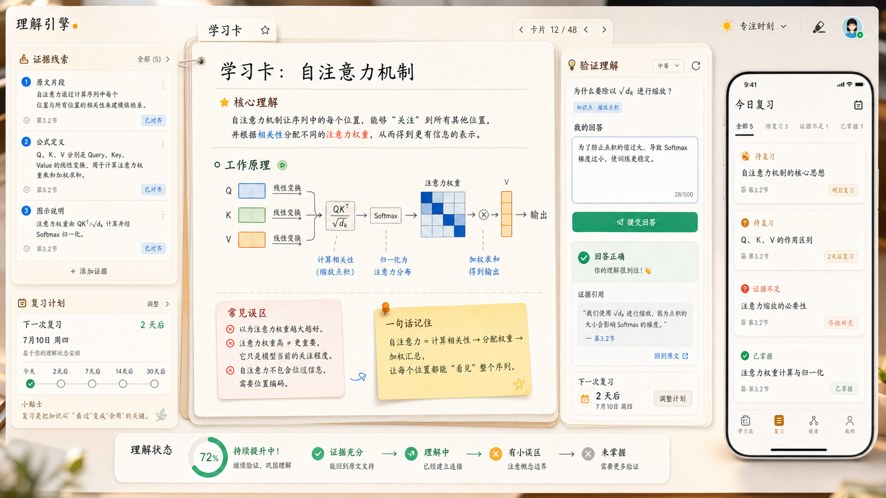

# AI 原生学习系统页面产品需求文档

## 0. 文档定位

本文档定义 AI 原生学习系统的页面设计、视觉方向、交互结构和 V0 页面验收标准。

关联文档：

- [产品愿景](ai-learning-system-product-plan.md)
- [V0 Personal Beta](ai-learning-system-v0-personal-beta.md)
- [云端核心架构](ai-learning-system-cloud-architecture.md)

本文档不是品牌营销页方案，也不是完整 UI 设计稿替代品。它的目标是：

- 明确第一版产品应该长什么样。
- 明确每个核心页面承载什么任务。
- 明确 V0.1a / V0.1b / V0.2 / V0.3 的页面边界。
- 给后续 UI 设计、前端实现和验收提供具体依据。

## 1. 设计北极星

产品第一眼应该让用户感觉：

> 这是一个活的学习驾驶舱。它不只是保存资料，而是在持续追踪我的理解变化。

关键词：

- 有趣生动。
- 现代简约。
- 可信、清醒、有秩序。
- 像下一代学习系统，而不是另一个笔记软件。

设计不能走两个极端：

- 不能像传统笔记工具一样灰、静、平。
- 不能像游戏化产品一样花哨、幼稚、低可信。

正确方向是：

> 用克制的界面承载复杂学习状态，用小而精确的动态反馈让系统显得“活着”。

## 2. 设计概念图

视觉方向参考图：



这张图只定义方向，不直接作为最终 UI 规格。需要吸收的重点是：

- 主界面是工作台，不是营销首页。
- 整体风格接近“现代学习桌面 + 数字学习卡”，年轻、温暖、轻快，不走中国风或复古路线。
- 内容层保留轻微现代纸卡质感、手写批注、荧光标注和便签感，但导航、输入、操作和移动端框架必须轻、清爽、产品化。
- 学习卡、证据、验证、复习在同一条学习链路上。
- 理解状态既可以列表化，也可以轻量图谱化。
- 色彩是点状高亮，不是整页大面积渐变。
- 所有可见界面文案必须优先使用中文。内部对象名可以保留英文，但页面标题、导航、按钮、状态和空状态不使用英文。

### 2.1 保留方案与最终取舍

本轮保留方案 C 和方案 D，但对方案 C 的理解需要调整：保留的是“现代纸质学习卡、手写批注、证据线索”的触感，不是中国风、宣纸、水墨或复古书卷。

| 方案 | 保留价值 | 需要克制的部分 | 落地方式 |
|---|---|---|---|
| 方案 C | 现代学习卡、手写批注、荧光标注、证据线索，学习内容更有记忆点 | 不做中国风、宣纸、水墨、印章、山水、仿古书卷，不让纹理压过信息 | 用在学习流、学习卡正文、复习题卡、证据摘录等内容承载区 |
| 方案 D | 更轻、更产品化、更适合长期使用和移动端扩展 | 不退回普通后台控制台，不依赖大卡片和 KPI 堆叠 | 用在导航、布局、操作按钮、移动端框架、状态反馈和任务流程 |

最终方向：

> 以 D 的轻量产品框架承载整体体验，以 C 的现代学习卡触感强化“学习、证据、复习”的内容记忆点。

设计边界：

- 现代纸卡质感是学习内容材质，不是国风皮肤。
- 桌面背景可以有温暖光感和轻微真实桌面氛围，但不能喧宾夺主。
- 复习、证据、理解状态必须形成独特视觉语言，不能只是普通列表。
- 移动端不是桌面缩小版，应优先服务“快速输入、阅读、轻触复习、回看原文”。
- 第一屏应显得像一个正在工作的学习系统，而不是数据看板。
- 禁止水墨、印章、山水、竹叶、卷轴、仿古纹理、老式书法装饰。

## 3. 视觉系统

### 3.1 视觉原则

1. 第一屏直接进入产品体验，不做 hero page。
2. 信息结构清楚，用户能快速判断今天该看什么、验证什么、复习什么。
3. 有趣来自理解状态变化，而不是装饰物。
4. AI 结果必须显得可追溯，证据是视觉一等公民。
5. 所有页面都要适合长期高频使用，不能只追求截图好看。
6. 避免传统后台控制台气质，核心记忆点应来自“今日学习流”“证据线索”“理解星图”和“理解成长”。
7. 现代纸卡质感只服务内容阅读和复习沉浸感，操作框架保持轻、准、现代。
8. 整体气质要年轻、聪明、温暖、有创造力，不能显得老气或传统文化主题化。

### 3.2 色彩

基础色：

| 用途 | 建议色 | 说明 |
|---|---|---|
| App 背景 | `#FAFAF7` | 温暖白，不用纯白刺眼背景。 |
| 主文本 | `#17202A` | 深石墨色，保证可读性。 |
| 次级文本 | `#6B7280` | 用于说明和 metadata。 |
| 边框 | `#E6E8EC` | 轻边界，不抢内容。 |
| 面板背景 | `#FFFFFF` | 内容承载面。 |

状态色：

| 状态 | 建议色 | 用途 |
|---|---|---|
| 已验证 | `#21B573` | 稳定理解。 |
| 较稳固 | `#2DBE9F` | 初步理解。 |
| 不稳定 | `#F5A524` | 需要复习或证据不足。 |
| 薄弱 | `#EF5B5B` | 误解或低置信度。 |
| 未接触 | `#A3AAB7` | 只是接触或未验证。 |
| 证据 | `#1E7CFF` | 证据链接、引用、回溯。 |
| AI 运行中 | `#15C8D8` | AI 任务运行、生成中。 |

限制：

- 不使用大面积紫蓝渐变。
- 不使用装饰性渐变圆球、泡泡或背景光斑。
- 单屏中高亮色不超过 4 种。
- 状态色必须配合文字或图标，不能只靠颜色传达。

### 3.3 字体与密度

建议：

- 页面标题：24-28px。
- 区块标题：16-18px。
- 卡片标题：14-16px。
- 正文：14-15px。
- metadata：12-13px。

原则：

- 不使用超大标题制造营销感。
- 工具界面要保持紧凑，但行高不能压迫。
- 卡片内文本必须可扫读，避免长段落堆积。

### 3.4 形状与组件

组件形态：

- 卡片圆角：8px。
- 按钮圆角：8px。
- 输入框圆角：8px。
- 状态 chip 圆角：999px。
- 页面主容器不做浮夸大圆角。

基础组件：

- Icon button：用于生成、回溯、更多、筛选、展开。
- 状态标签：用于理解状态、主题、证据强度、模型状态。
- 进度环：用于理解分数、复习进度。
- 证据连线：用于连接 AI 结论和来源片段。
- 时间线标记：用于今天理解变化。
- 分段标签：用于学习卡 / 证据 / 验证 / 复习。

### 3.5 材质、线索与动效

现代纸卡质感适用范围：

- 今日学习流里的主要学习内容。
- 学习卡正文和关键观点。
- 复习题卡、答案反馈、回看原文片段。
- 证据摘录和用户确认过的原文引用。
- 误区卡、便签卡、手写批注和图解区域。

现代纸卡质感限制：

- 纹理透明度要低，只能让内容“有触感”，不能影响长时间阅读。
- 不使用仿古边框、卷轴、毛笔装饰、大面积水墨背景、山水、印章或传统书法装饰。
- 不在导航栏、按钮、表单、设置页和系统状态区域使用重纹理。
- 纸卡边缘可以有轻微层叠和投影，但不能做破旧、泛黄或古籍感。

产品化外壳规则：

- 导航、搜索、快速捕获、筛选、确认按钮使用轻量现代控件。
- 页面主布局要稳定，不能因为纸张卡片边缘变化造成视觉跳动。
- 桌面端保留足够信息密度，移动端保留清晰单任务节奏。
- 侧栏、手机端、验证面板要像现代 App，不像手账模板或后台控制台。

核心视觉线索：

- 证据线索：细蓝线或短路径连接 AI 结论和原文，不做复杂流程图。
- 理解状态：用色点、状态 chip、进度环和小图标共同表达。
- 复习节奏：用轻进度条、题卡翻页和完成反馈表达，不做打卡式压力。
- AI 运行中：只在局部出现呼吸、扫光或小型进度，不让页面持续闪动。

## 4. 信息架构

主导航建议：

```text
学习驾驶舱
今日学习
笔记
学习卡
复习
理解星图
来源资料
搜索
设置
```

V0 可简化为：

```text
学习驾驶舱
笔记
学习卡
复习
理解星图
来源资料
```

全局固定区域：

- 左侧导航。
- 顶部当前 workspace 和搜索入口。
- 后台任务状态入口。
- 用户菜单。

全局快捷入口：

- 新建笔记。
- 快速捕获。
- 粘贴文本 / Markdown / 代码。
- 生成学习卡。
- 打开到期复习。

## 5. V0 页面范围

### 5.1 V0.1a 页面

目标：验证“学习卡 + 证据回溯”是否成立。

必须页面：

- 最小学习驾驶舱。
- 笔记编辑页。
- 学习卡详情页。
- 证据抽屉 / 证据面板。
- AI 任务状态。

不做：

- 验证。
- 复习。
- 来源收件箱。
- 完整搜索。
- 完整理解状态视图。

### 5.2 V0.1b 页面

目标：跑通一次理解验证和轻量复习。

新增页面：

- 验证理解面板。
- 验证反馈。
- 复习队列。
- 复习详情。
- 工作台复习入口。
- 移动端今日复习和轻触复习最小体验。

### 5.3 V0.2 页面

目标：加入外部资料输入池。

新增页面：

- 来源收件箱。
- 来源详情页。
- 来源转笔记草稿。
- 快速捕获增强。

### 5.4 V0.3 页面

目标：让系统显得真正有“理解状态”。

新增或增强页面：

- 理解星图。
- 今日变化。
- 基础搜索。
- AI 反馈。
- Markdown 种子导入。
- 导出中心。

## 6. 页面设计详情

### 6.1 学习驾驶舱

定位：

> 用户每天打开产品后看到的学习驾驶舱。

用户目标：

- 快速输入今天的新资料。
- 看到最近学习卡和验证状态。
- 知道今天该复习什么。
- 感知自己的理解状态在变化。

布局：

```text
左侧导航
主内容区
  顶部状态带
  快速捕获
  最近笔记
  学习卡
  复习队列
  理解快照
右侧辅助栏
  AI 任务
  今日变化
```

核心模块：

| 模块 | 内容 | 交互 |
|---|---|---|
| 顶部状态带 | 新笔记数、学习卡数、理解分数、待复习数、连续使用天数 | 点击进入对应列表 |
| 快速捕获 | 输入框、粘贴、上传、代码、链接 | 自动识别输入类型 |
| 最近笔记 | 最近编辑笔记 | 点击进入笔记编辑页 |
| 学习卡 | 最近生成学习卡 | 点击进入学习卡详情页 |
| 复习队列 | 到期复习 | 完成、延后、打开详情 |
| 理解快照 | 已验证 / 较稳固 / 不稳定 / 薄弱数量 | 点击进入理解星图 |

视觉要求：

- 第一屏要有“系统正在运转”的感觉。
- 使用小型进度环、状态标签和轻微任务动效。
- 快速捕获是页面最主要输入点，但不能像聊天框一样占据全部注意力。

空状态：

- 无笔记时展示“新建笔记”和“导入 Markdown”。
- 无学习卡时展示“从第一篇笔记生成学习卡”。
- 无复习时展示“今天没有到期复习”。

验收标准：

- 用户 5 秒内能找到新建或粘贴入口。
- 用户 10 秒内能知道今天是否有复习。
- 用户能从学习驾驶舱直接进入最近学习卡和证据。

### 6.2 快速捕获

定位：

> 低摩擦输入入口，接受混乱输入，但输出结构化对象。

支持类型：

- 手写笔记。
- 文本。
- Markdown。
- 代码片段。
- URL + 手动正文。

交互：

1. 用户粘贴内容。
2. 系统识别类型。
3. 用户确认创建来源或笔记。
4. 后台生成快照、草稿和任务。
5. 学习驾驶舱显示任务状态。

输入识别：

| 输入 | 识别 | 默认动作 |
|---|---|---|
| 多段普通文本 | 文本（`text`） | 创建来源 |
| Markdown 标题和列表 | Markdown（`markdown`） | 创建来源 |
| 包含代码块或明显语法 | 代码（`code`） | 创建来源 |
| URL | 链接（`url`） | 保存链接，可提示粘贴正文 |
| 用户选择新建笔记 | 手动笔记（`manual`） | 创建笔记 |

状态：

- 空闲。
- 识别中。
- 创建中。
- 处理中。
- 失败。
- 就绪。

### 6.3 笔记编辑页

定位：

> 用户表达和整理自己理解的地方。

页面结构：

```text
顶部栏
  标题
  自动保存状态
  生成学习卡按钮

编辑器
  内容块
  来源引用块
  代码块

右侧辅助栏
  AI 状态
  当前版本
  关联学习卡
  证据覆盖率
```

核心功能：

- 标题编辑。
- 段落、标题、列表、引用、代码块。
- 块级自动保存。
- `revision` 冲突提示。
- 创建 `note_version`。
- 生成学习卡。

生成学习卡按钮状态：

| 状态 | 文案 | 行为 |
|---|---|---|
| 可生成 | 生成学习卡 | 创建 note_version 和 job |
| 生成中 | 生成中 | 显示任务进度，不允许重复提交 |
| 已生成 | 查看学习卡 | 打开学习卡 |
| 内容已更新 | 重新生成 | 创建新版本并标记旧卡 stale |

设计要求：

- 编辑区安静，不被 AI 面板打扰。
- AI 侧栏只显示与当前笔记有关的状态。
- 证据不直接嵌入编辑正文，避免污染用户笔记。

### 6.4 学习卡详情页

定位：

> AI 把笔记转化成可学习、可追溯、可验证对象的核心页面。

页面结构：

```text
顶部栏
  学习卡标题
  来源 / 笔记版本
  证据覆盖率
  状态

分段标签
  学习卡
  证据
  验证
  复习

学习卡正文
  核心观点
  关键要点
  概念解释
  代码解释
  易错点
  问题预览
```

学习卡标签页：

- 核心观点。
- 运行机制。
- 关键要点。
- 概念解释。
- 易错点。
- 关联笔记。

每条 AI 结论必须显示证据状态：

| 状态 | UI 表现 | 含义 |
|---|---|---|
| aligned / 已对齐 | 蓝色证据标签 + 链接图标 | 可支撑理解状态 |
| soft / 软证据 | 琥珀色软证据标签 | 仅弱提示 |
| unaligned / 未对齐 | 灰色无证据标签 | 不进入长期状态 |
| stale_alignment / 需复核 | 红色需复核标签 | 需要重新对齐 |

交互：

- 点击证据标签打开证据抽屉。
- 点击“重新生成”创建新 note_version。
- 点击“验证理解”进入验证。
- 证据覆盖率低于阈值时，页面顶部提示“证据不足，不能升级理解状态”。

### 6.5 证据抽屉

定位：

> 让用户知道 AI 为什么这么说。

打开方式：

- 从学习卡 key point 打开。
- 从验证反馈打开。
- 从复习打开。

内容：

- AI 结论。
- quote_text。
- 对齐到的原文片段。
- alignment_status。
- alignment_score。
- alignment_method。
- 候选片段列表。
- 原始笔记版本 / 来源片段链接。

用户操作：

- 确认引用：确认引用正确。
- 选择其他片段：人工选择正确片段。
- 降级为软证据：降级为 soft。
- 标记错误：标记 AI 错误。

设计要求：

- 证据抽屉不能像调试工具，必须可读。
- 展示“AI 结论”和“原文证据”的并排关系。
- 对齐分数用小标签展示，不喧宾夺主。

### 6.6 验证理解面板

定位：

> 用一个轻量问题判断用户是否真的理解。

问题类型：

- 解释（`explain`）。
- 举例（`example`）。
- 应用（`apply`）。

页面形态：

- 可以是学习卡内标签页。
- 也可以是右侧 panel。

结构：

```text
问题
回答输入框
提交
反馈
  判断结果
  已覆盖点
  缺失点
  误解点
  证据引用
  下一次复习
```

结果状态：

| 结果 | UI | 后续 |
|---|---|---|
| 初步理解（`preliminary_understanding`） | 绿色 | 写入 validated，安排复习 |
| 表达不清（`unclear_expression`） | 琥珀色 | 不升级，建议回看片段 |
| 存在误解（`misunderstanding`） | 红色 | 写入 misunderstood，立即回看证据 |
| 无法判断（`unknown`） | 灰色 | 不升级，稍后重试 |

验收标准：

- 用户能在 30 秒内完成一次回答。
- 反馈必须指出至少一个 covered 或 missing point。
- 没有硬引用证据时，不显示理解升级成功。

### 6.7 复习队列

定位：

> 不是打卡清单，而是知识再激活入口。

体验目标：

- 用户打开后立刻知道今天要轻触哪些内容。
- 每条复习都说明出现原因，而不是只显示到期。
- 复习过程足够短，移动端 60 秒内可以完成 1-3 条。
- 用户答不出来时，可以直接回看原文证据，不需要重新翻找笔记。

页面结构：

```text
顶部栏
  今日复习
  全部 / 待复习 / 证据不足 / 已跳过

复习队列
  复习卡片
    复习类型
    学习卡标题
    出现原因
    证据状态
    到期时间
    主操作

右侧栏 / 底部抽屉
  今日复习节奏
  最近误解
  明天建议轻触
```

列表字段：

- 学习卡标题。
- 复习类型。
- 到期时间。
- 原因。
- 难度或风险。
- 证据状态。

复习类型：

- 复述（`recall`）。
- 回看（`reread`）。
- 对比（`compare`）。
- 应用（`apply`）。
- 修正误解（`fix_misunderstanding`）。

复习原因：

| 原因 | 页面文案 | 默认优先级 |
|---|---|---|
| 到期复习 | 上次验证后已到轻触时间 | 中 |
| 证据不足 | 关键结论缺少硬引用 | 高 |
| 存在误解 | 上次回答出现误解 | 高 |
| 长期未触达 | 已较久没有主动回忆 | 中 |
| 新学习卡 | 新内容需要第一次回忆 | 低 |

交互：

- 开始复习。
- 忽略。
- 稍后提醒。
- 打开原学习卡。
- 调整计划。

轻触复习详情：

```text
复习进度
题卡
  问题
  来源 / 学习卡
回答区
  选项 / 简短输入
反馈区
  已覆盖点
  缺失点
  误解点
  证据引用
操作
  回看原文
  下一题
  稍后再看
```

移动端复习要求：

- 今日复习必须是移动端底部导航中的一级入口。
- 一屏只处理一条复习，避免把桌面队列强行压缩到手机。
- 题卡使用轻量现代纸卡材质，操作按钮保持产品化，不做拟物按钮。
- “回看原文”以底部抽屉打开，显示原文片段、证据状态和返回按钮。
- “下一题”始终固定在底部安全区上方。
- 没有到期复习时，展示“今天没有到期复习”和“轻触最近薄弱点”。

设计要求：

- 不制造焦虑。
- 强调“轻触复习”。
- 每条复习都要说明为什么出现。
- 复习卡片可以有现代纸卡质感，但队列容器和操作控件必须轻量。
- 证据不足和存在误解要可见，但不能用大红色警告压迫用户。

验收标准：

- 用户 10 秒内知道今天有几条复习以及第一条为什么出现。
- 用户 60 秒内能在手机上完成至少一条轻触复习。
- 用户能从复习反馈 1 次点击打开原文证据。
- 答错或证据不足时，系统给出下一步行动，而不是只显示失败。

### 6.8 理解星图

定位：

> V0 阶段的最小理解图谱前置形态。

视图：

- 列表视图：默认。
- 星图视图：轻量网络图，可选。

列表视图字段：

- 对象。
- 状态。
- 证据覆盖率。
- 上次验证。
- 下次复习。
- 误解次数。

状态：

- 已验证。
- 较稳固。
- 不稳定。
- 薄弱。
- 未接触。

星图视图：

- 节点代表笔记、学习单元或候选概念。
- 颜色代表理解状态。
- 边代表来源、相似、前置或复习关系。
- V0 不要求复杂图谱编辑，只做状态浏览。

验收标准：

- 用户能一眼看到哪些内容只是看过。
- 用户能找到误解和到期复习。
- 用户能从状态回到学习卡或原文证据。

### 6.9 今日变化

定位：

> 让用户感知“今天理解发生了什么变化”。

V0.3 最小版内容：

- 今天新增笔记。
- 今天生成学习卡。
- 今天完成验证。
- 今天发现误解。
- 今天到期或完成复习。
- 明天建议轻触内容。

设计：

- 时间线形式。
- 每条变化带小图标和状态色。
- 不使用长篇 AI 总结。

### 6.10 来源收件箱

定位：

> 外部资料进入系统的缓冲区。

列表字段：

- 类型。
- 标题。
- 状态。
- 创建时间。
- 是否已转笔记。
- 是否有学习卡。

状态：

- 草稿（`draft`）。
- 处理中（`processing`）。
- 就绪（`ready`）。
- 失败（`failed`）。
- 已归档（`archived`）。

交互：

- 创建笔记草稿。
- 重新处理。
- 归档。
- 打开来源详情。

### 6.11 来源详情页

定位：

> 查看一份来源的原始输入、解析结果和可引用片段。

页面结构：

- 原始输入。
- metadata。
- snapshot 列表。
- segment 列表。
- 转笔记草稿。
- 相关学习卡。
- 相关证据。

V0 URL 规则：

- 只有 URL 时只保存链接。
- URL + 正文时按文本解析。
- 自动抓取延后到 V0.3 或 V1。

### 6.12 搜索页

定位：

> 快速回到学习对象，而不是全文检索工具堆叠。

V0 范围：

- Postgres full-text search。
- `search_documents` 投影。
- 搜索笔记、来源、AIArtifact、学习单元和证据。

结果分组：

- 笔记。
- 学习卡。
- 证据。
- 来源资料。
- 复习。

V1 再做：

- Readwise / Anki 导入内容搜索。
- 更完整全文搜索。
- 语义搜索。

## 7. 关键用户流程

### 7.1 V0.1a 学习卡闭环

```text
新建笔记
-> 写内容
-> 自动保存
-> 生成 note_version
-> 生成学习卡
-> 模型输出 quote
-> 系统对齐证据
-> 展示学习卡
-> 点击证据回溯原文
```

验收：

- 能从一篇手写笔记生成学习卡。
- 每条关键结论都有证据状态。
- 已对齐证据能回到原文片段。
- “证据不足”（内部状态 `low_evidence`）的学习卡不能进入理解升级。

### 7.2 V0.1b 验证和复习闭环

```text
打开学习卡
-> 回答验证问题
-> AI 判断理解状态
-> 展示已覆盖点 / 缺失点 / 误解点
-> 写入 understanding_event
-> 创建 review_schedule
-> 复习队列出现到期项
```

验收：

- 验证反馈必须引用证据。
- 无硬引用时不能写入 `validated`。
- 复习能解释出现原因。

### 7.3 V0.2 来源到笔记

```text
粘贴文本 / Markdown / 代码
-> 创建来源
-> 生成 snapshot / segments
-> 创建笔记草稿
-> 用户编辑
-> 进入学习卡闭环
```

验收：

- 来源和笔记分层清晰。
- 用户能继续编辑笔记草稿。
- 证据仍绑定不可变 snapshot 或 note_version。

## 8. 状态与空页面

必须设计的状态：

- 空工作台。
- 无学习卡。
- 无到期复习。
- AI 生成中。
- AI 生成失败。
- 证据对齐不足。
- 来源解析失败。
- 自动保存失败。
- 低置信度验证。
- 数据导出中。

原则：

- 错误要告诉用户下一步能做什么。
- AI 失败不能让用户觉得内容丢了。
- 证据不足时要降级为弱提示，而不是隐藏结果。

## 9. 响应式设计

桌面优先：

- 主要使用 1280px 以上宽度。
- 左侧导航固定。
- 内容区使用两栏或三栏。
- 主推荐结构是“现代学习卡内容层 + 证据 / 复习轻侧栏”，不要退化成 KPI 卡片看板。

平板：

- 左侧导航收缩为 icon rail。
- 证据抽屉可以全屏显示。
- 学习卡和验证理解上下堆叠。
- 复习队列可以左侧列表、右侧详情，也可以上下堆叠。

移动端：

- V0 不做完整桌面功能复刻，但复习、阅读和快速输入必须是可用的一等体验。
- 使用底部导航：学习流、复习、捕获、状态、我的。
- 学习驾驶舱移动端首屏只保留今日学习流、快速捕获和今日复习入口。
- 学习卡详情移动端优先展示正文、证据状态和“回看原文”，复杂编辑入口降级。
- 证据抽屉移动端使用底部抽屉或全屏页，必须支持返回学习卡 / 复习详情。
- 理解星图移动端默认显示状态列表，不默认显示复杂网络图。
- 复杂笔记编辑、批量整理、图谱浏览可以提示使用桌面端。

移动端复习重点：

- 今日复习是移动端一级入口，不藏在学习卡详情里。
- 队列页只展示最必要字段：标题、原因、证据状态、主操作。
- 详情页一屏一题，底部固定主按钮。
- 回看原文不离开当前复习上下文。
- 完成后展示轻反馈：已完成、下一次时间、下一题。

断点建议：

| 视口 | 布局 |
|---|---|
| 1440px 以上 | 左导航 + 主内容 + 右侧证据 / 复习栏 |
| 1024-1439px | 左 icon rail + 主内容 + 可折叠侧栏 |
| 768-1023px | 上下堆叠，证据和复习使用抽屉 |
| 390-767px | 底部导航，单列任务流 |

## 10. 设计验收标准

### 10.1 第一印象

- 第一屏看起来像“学习驾驶舱”，不是普通笔记列表。
- 用户能明显看到理解状态、证据和复习。
- 色彩有活力，但不花哨。

### 10.2 可用性

- 5 秒内找到快速输入。
- 10 秒内判断今天是否需要复习。
- 2 次点击内从学习卡回到证据原文。
- 30 秒内完成一次验证回答。
- 60 秒内在移动端完成至少一条轻触复习。

### 10.3 可信度

- AI 结论旁必须出现证据状态。
- “证据不足”（内部状态 `low_evidence`）必须明确可见。
- 用户能查看 quote、原文片段、对齐状态和分数。

### 10.4 工程落地

- 页面设计必须映射到现有核心对象。
- 不引入 V0 数据模型之外的核心事实对象。
- V0.1a 页面不能依赖来源收件箱、复习或完整搜索。
- 所有 AI 任务状态必须可见。
- 移动端复习只能依赖 `review_schedule`、学习卡、证据和理解事件，不引入额外核心对象。

## 11. 后续设计任务

下一步可以继续拆：

- V0.1a Figma 级 wireframe。
- 学习卡详情页高保真稿。
- 证据抽屉交互稿。
- 学习驾驶舱响应式布局。
- 移动端今日复习和轻触复习高保真稿。
- 设计 token 表。
- 前端组件清单。

## 12. 一句话

页面体验要让用户感觉：

> 我不是在整理资料，而是在驾驶一个会持续追踪、验证和进化我理解状态的学习系统。

---

## 附录 A. 评审意见

### A.1 需要警惕的潜在风险

#### 1. AI 引用对齐准确率是这个产品的"生死线"

文档里写得很清楚：硬引用 precision ≥ 80%，关键结论 hard evidence coverage ≥ 60%。但当前主流 LLM 在长文里给出精确 quote + span 的稳定度，其实比想象的要差。

**建议**：

- V0.1a 的硬编码 happy path 不要只跑 1-2 篇笔记，要跑 20-30 篇代表性资料做基准。
- 提前设计 fallback：如果 LLM 给的 quote 不能被精确匹配，系统要降级到软引用，而不是硬塞。
- 考虑把对齐拆成两步：模型先输出 `claim + quote_text`，再用算法把 quote 匹配到 segment（embedding + 字符级 fuzzy + 段落定位），避免完全依赖模型自报坐标。

#### 2. "理解账户"模型膨胀风险

你列了 14 个核心对象：Source / Asset / Note / Block / Snapshot / Evidence / AIArtifact / Concept / Claim / Relation / Learning Unit / Validation / Review / Understanding Account。

如果全部在 V0 一开始就建表，会陷入**模型未稳、字段天天改**的状态。

**建议**：

- V0.1a 只用最小子集：`Note → NoteVersion → LearningCard → Quote → EvidenceSegment`。Concept / Claim / Relation / UnderstandingEvent 这些先在代码里用结构化 JSON 字段模拟，等跑通两轮迭代后再上表。
- Snapshot 可以先只做 NoteVersion 一层，Source Snapshot / Segment 延后到 V0.2。

#### 3. 复习调度"动态间隔"在 V0 不要承诺

文档说"早期用简单规则，后续根据验证置信度和复习结果动态调整"，但产品愿景里又把"高置信度拉长、低置信度缩短"作为核心理念。

**风险**：用户用 1 个月后会发现复习节奏不稳定，但产品没给出"为什么这样排"的可解释性，就会被吐槽"AI 复习不靠谱"。

**建议**：

- V0 复习只用 `next_review_at = last_review_at + interval`，interval 是离散档位（如 1 / 3 / 7 / 14 / 30 天）。
- 把"档位选择规则"暴露给用户，不要一开始就用连续函数。
- 等验证准确率稳定后再做个性化。

#### 4. "理解星图"在 V0 容易做空

文档里说"V0 不做完整图谱，但应先做最小理解状态列表"，这是对的。但"理解星图"这个名字+视觉很容易诱导团队去做 D3.js 拓扑图。

**建议**：

- 强制把 V0 理解星图做成"理解状态表 + 颜色 dot + 状态 chip"。
- 任何网络图都延后到 V1/V2，且必须有明确交互目的（不是好看）。

#### 5. 学习风格系统在 V0 容易做成"皮肤"

7 种风格 × 8 个影响维度 = 56 个变量。V0 如果真做切换，每个用户每种状态都要测，会拖死迭代。

**建议**：

- V0 只留一个 flag：`learning_style_id`。
- 在产品文案和复习提醒上做轻区分（任务版 vs 陪伴版 vs 低能量版），不在数据模型上做切分。
- 把"风格影响"留到 V1 验证。

#### 6. 移动端"复习一等入口"是否过早

页面 PRD 把移动端复习作为"一等体验"，但 V0 用户是产品主自己，移动端复刻的成本不低。

**建议**：

- V0.1a-V0.1b 可以只做桌面，移动端从 V0.3 或 V1 开始。
- 如果一定要做，优先只做"复习卡片页"和"回看原文底部抽屉"，其它一律降级提示"请使用桌面端"。

### A.2 文档结构上的小建议

1. **缺一个统一的术语表 (Glossary)**。Source / Note / NoteVersion / LearningCard / AIArtifact / Concept / Claim / UnderstandingEvent 反复出现，但没有任何地方给过单字段定义。建议在 `product-plan.md` 第 4 节前加一个"对象字段速查表"。

2. **缺一个状态机总图**。`draft / processing / ready / failed / archived`（Source）、`aligned / soft / unaligned / stale_alignment`（Evidence）、`preliminary / validated / unclear / misunderstanding / unknown`（Validation）——这些状态机散落在文档各处。建议单拎一张表。

3. **V0 退出标准偏结果、缺过程**。当前 V0 退出标准是"4 周使用 + 5 张学习卡 + Evidence precision ≥ 80%"。建议补一个**V0 中期检查点**（V0.1b 结束时）：如果中期检查点没过，是否回滚架构、还是优化提示词？给团队一个明确的"如果不行就回去"按钮。

4. **AI 调用层的多模型路由**是原则 13 里一句话带过，但实际上这是 V0 必须验证的能力。建议在架构文档里单写一节：哪些任务用快模型、哪些用强模型、缓存策略、失败降级。
