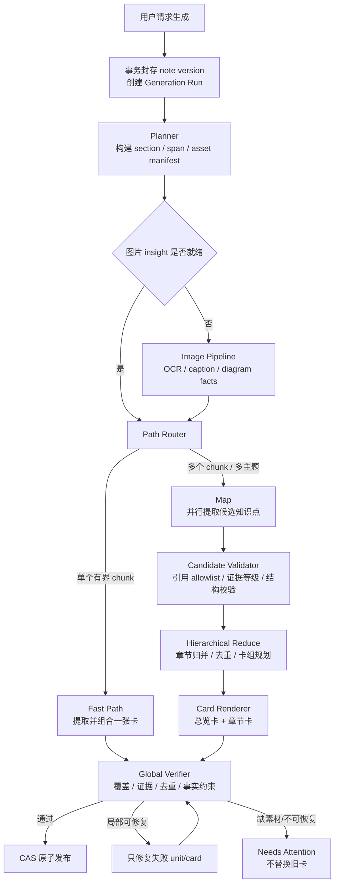
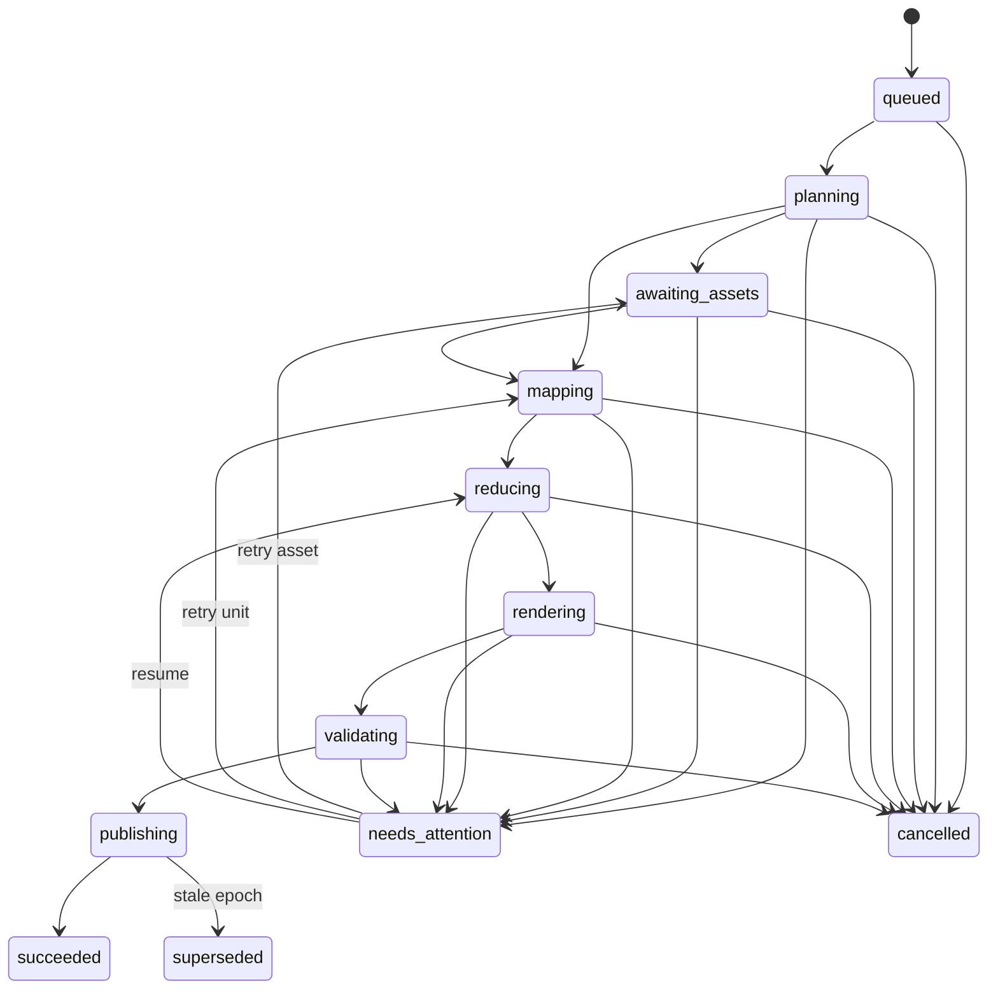

# 学习卡生成引擎 v2：全文覆盖、图像理解与可恢复工作流

> 状态：已实施（代码候选）/ 发布 Gate 未关闭 —— 见下方"状态更正"
> 文档版本：2.1
> 日期：2026-07-26
> 适用范围：学习卡生成、图片语义提取、证据绑定、任务进度与失败恢复
> 替代方向：本文替代“把 12,000 字符截断做得更聪明”的思路；原有
> `long-note-card-generation-optimization.md` 已在归档清理中删除，未保留副本
> （此前版本误写为"仅作为历史草案保留"）。

> **状态更正（2026-07-26 外部实施审计）**：本文档 2.0 版状态栏写的是
> "Draft / 方案评审中，未授权实施"，但同日仓库工作树中 M1–M6 对应的代码、
> 迁移（0044–0049）、测试与 runbook 均已存在，且
> `docs/evidence/card-generation-v2/m6-gate.md` 声称默认开启、
> `docs/runbooks/card-generation-v2-rollout-rollback.md` 状态为 Active——
> 三份同日文档相互矛盾。现将本文状态栏更正为与仓库事实一致：
> **实现已存在，定级为"代码候选"**；`m6-gate.md` §2/§3 所列发布级验证
> （make verify / release-check、PostgreSQL 集成四态、真实 Provider RC、
> 回滚演练、观察窗）在关闭前，不得宣称任何里程碑 Gate 已关闭。
> 治理偏差记录：(1) 实施先于本计划状态栏的批准流转；(2) §21 DoD 要求
> "v2 经过 feature flag、shadow、灰度和可回滚验证后才成为默认路径"，而当前
> 代码已默认开启（fail-open），该顺序违背需要 Owner 在 M6 Gate 关闭前
> 显式追认或回退默认值。评估数据集与基线冻结（本计划 M0）至今没有证据文件。

## 0. 结论先行

当前问题不是简单的“模型超时”，而是现有链路的产品模型和执行模型同时到达上限：

1. 一篇笔记被压成一次模型调用、最多 5 个要点；长文无论如何都无法兼顾完整性和学习粒度。
2. 所谓 12,000 字符上限会静默丢内容，而且在超长 block 场景下实际还能失效。
3. 图片没有被真正理解；无 alt 图片被丢弃，普通上传图片的 alt 也没有学习语义。
4. 生成、质量检查、修复和发布塞在一个 90 秒 job 中；任一环节失败会把整篇重跑。
5. 前端在整个任务期间锁住编辑器，又拿不到真实阶段进度，所以后台变慢会被用户感知为“系统卡死”。
6. `noteVersionId` 当前并不等价于不可变输入快照；并发编辑和不同版本并发生成还存在结果错序风险。

本方案选择的目标架构是：

```text
封存输入快照
  → 构建全文/全图覆盖清单
  → 图片语义预处理与缓存
  → 有界分片并行提取候选知识点
  → 服务端精确绑定证据
  → 分层去重与聚合
  → 生成一张综合卡或“总览卡 + 章节卡”卡组
  → 全局质量门禁
  → 按请求顺序原子发布
```

这里必须区分两个概念：

- **输入不截断**：每个正文片段和每张需要理解的图片都必须被处理，或以明确失败/排除原因进入覆盖报告；不允许在模型调用前静默丢弃。
- **输出有取舍**：学习卡本来就是提炼结果，不要求每句话变成要点；但每个章节都必须被考虑，最终未入选的候选必须有可审计的去重、低价值或证据不足原因。

这是本方案最重要的边界。分片是为了让全部内容进入处理流程，不是换一种方式截断。

---

## 1. 目标与非目标

### 1.1 目标

#### 正确性

- READY 结果的主输入单元处理覆盖率必须为 100%。
- 每个 active key point 必须有稳定、可校验的文本 span 或图片 region 引用。
- 模型不再自由生成 `quote_text`；引用文本由服务端根据引用 ID 从封存快照中复制。
- 图片不能再以“alt 有就算处理、alt 无就丢弃”的方式参与学习卡生成。
- 多版本任务的最终激活顺序由请求序号决定，不能由谁先完成决定。

#### 效率

- 短笔记保持一轮模型调用的快路径。
- 长笔记按分片有界并行，耗时随“并行波次”增长，而不是依赖一次越来越大的请求。
- 相同内容、相同图片和未修改章节跨版本复用，不重复消耗模型调用。
- 某个分片失败只重试该分片；聚合失败不重跑提取；发布失败不重跑 AI。
- 证据在生成阶段直接绑定，取消每个 key point 再次全量扫描原笔记的后置对齐开销。

#### 用户体验

- 只在“保存并封存快照”期间短暂阻塞；服务端接受 run 后立即恢复编辑。
- 展示真实阶段和真实计数，例如“图片 7/9、章节 12/18”，不伪造进度百分比。
- 支持离开页面、刷新恢复、取消、从失败阶段继续和仅重试失败图片。
- 覆盖不足不得伪装为成功；必须展示缺失章节/图片和下一步操作。

### 1.2 非目标

- 本方案不要求一次性替换所有 AI Provider。
- Embedding 可以用于候选去重，但不能成为硬证据来源。
- 流式输出不是解决卡死和准确度问题的核心；可以用于事件推送，但最终结果仍需完整校验后发布。
- 本方案不承诺把任意大文件无限制地吞入系统。系统可以有明确配额，但必须在预检阶段拒绝或要求拆分，不能静默裁剪。
- 本文只做设计，不包含本轮代码、数据库迁移或 UI 实现。

---

## 2. 当前实现审计与根因

### 2.1 已有能力中应保留的部分

现有系统并非全部推倒重来，以下底座值得保留：

- `jobs` 已有 lease token、超时回收、幂等状态更新和迟到副作用 fencing。
- 卡片、旧卡替代、复习状态和搜索投影已能在同一事务中提交。
- API 入队已有 workspace advisory lock 和 active job 去重。
- `note_blocks` 已有稳定 ID，`card_key_points` 也预留了 `segmentRef`。
- 旧卡在新卡发布前仍可继续使用，适合扩展成“新卡组通过门禁后再原子切换”。

v2 应复用这些可靠性机制，但不能继续让一个扁平 job 同时承担业务 run、执行步骤和进度模型。

### 2.2 P0 问题

| 问题 | 当前证据 | 直接后果 |
| --- | --- | --- |
| 12,000 字符截断静默丢内容 | `workers/ai-worker/src/handlers/index.ts:168-201` | AI 和质量检查都不知道被丢掉了哪些章节 |
| 12,000 字符硬上限实际会失效 | `handlers/index.ts:191-195` 在已选不足 3 个 block 时仍加入超预算 block | 单个 50k/500k block 仍可能整体进入模型，导致上下文超限或超时 |
| 输入上限与导入能力不匹配 | 普通 block 可到 50k：`apps/api/src/modules/note/schema.ts:9-31`；Markdown 单篇可到 500k：`apps/api/src/modules/import/routes.ts:14-23` | 正常产品输入即可稳定触发极端模型请求 |
| 图片没有被理解 | `handlers/index.ts:154-166` 只取 alt，无 alt 丢弃 | 图片越多，真实信息损失越多 |
| 图片-only 契约矛盾 | Prompt 要求无 alt 图片返回空要点：`packages/shared/src/prompts.ts:167-175`；Schema 强制至少 1 个要点：`packages/shared/src/schemas.ts:17-24` | 模型遵从则 schema fail 并整单重试，不遵从则可能幻觉 |
| 图片证据无法成为硬证据 | `handlers/index.ts:754-767` 对齐时过滤 image block | 即使基于 alt 生成了要点，后续也不能可靠落到图片证据 |
| 任务是单体长事务式流程 | 生成、可选 repair、发布都在 `runGenerateCard` 内 | 任一步失败会放大成整篇重跑 |
| 90 秒 × 3 次整单尝试 | `handler-timeout-config.ts:24-40`、`queue.ts:12-14` | 加 2s/4s 退避后，常规最坏等待约 276 秒 |
| 前端全程锁住编辑器 | `apps/web/components/NoteEditor.tsx:206-224` | 后台慢被感知为整个页面卡死 |
| 只有真假状态，没有真实进度 | Job API 只返回 pending/running/...：`apps/api/src/modules/job/service.ts:207-242` | UI 的“准备材料/提炼卡片”只是根据 job 状态猜测 |

### 2.3 P1 数据一致性与失败放大问题

#### `noteVersionId` 还不是不可变快照

当前自动保存可在尚无 active/superseded 卡片时原地修改 `note_versions` 和重建 blocks：

- `apps/api/src/modules/note/service.ts:137-206`
- `apps/api/src/modules/note/service.ts:612-624`

活跃生成任务没有参与“版本是否可原地更新”的判断。当前主要依靠前端模态锁编辑来维持输入稳定，而不是后端不变量。多标签页、API 直接调用或状态恢复异常时，同一 `noteVersionId` 的正文可能在生成期间变化。

#### 旧版本后完成可能覆盖新版本

active job 唯一约束只到 `(workspace, noteVersionId)`，不同版本可以并发生成；发布时却会 supersede 同一笔记的所有 active 卡。因此 v3 先完成、v2 后完成时，最终可能由 v2 覆盖 v3。结果顺序取决于完成时间，而不是用户请求顺序。

#### 发布被下游队列配额反向绑死

生成和 repair 已经完成后，事务才检查能否再创建 1～5 个 `align_evidence` jobs；配额不足会回滚整张卡，随后通用重试再次完整调用模型：

- `workers/ai-worker/src/handlers/index.ts:623-645`

发布成功后，每个 key point 又分别加载并扫描整篇笔记做模糊对齐：

- `workers/ai-worker/src/handlers/index.ts:719-767`

这既放大成本，也让“模型已成功”与“业务最终成功”不必要地耦合。

#### 当前质量检查看不到真正的覆盖率

`assessCardOutput` 只接收已经被选中的 blocks。当前 `coverage_too_low` 衡量的是“模型输出经过清洗后剩多少要点”，不是“原文有多少章节被处理”。所以被截掉 80% 正文仍可能通过所谓覆盖检查。

#### Prompt 固定开销过大

当前卡片 SYSTEM_PROMPT 约 10.9k 字符、265 行，包含多组完整 few-shot 和 `thinking` 字段要求；但最终 Zod schema 并不保存 `thinking`。这会在每次生成和 repair 中重复消耗输入、输出 token 与推理时间。

### 2.4 “图片一多就卡死”的完整因果链

```text
用户一次选择多张图片
  → 浏览器无并发上限地同时上传
  → 单张上传请求无明确客户端超时
  → 任一上传悬挂，uploadingCount 永不归零
  → 生成按钮一直停在“等待图片上传”

即使全部上传完成
  → 普通上传图片 alt 无有效学习语义
  → Worker 不读取图片本体，只保留 alt 或直接丢弃
  → 图片-only 场景触发 Prompt/Schema 冲突
  → 90 秒整单失败并最多重试 3 次
  → 前端全程模态锁定且只有 running 状态
  → 用户看到的就是“卡死”
```

因此，增加总超时或改进字符截断都无法解决图片场景。

---

## 3. v2 核心不变量

以下规则是实现时不可被“性能优化”破坏的硬约束。

### G1：输入快照不可变

一个 generation run 必须绑定：

- `noteVersionId`
- 封存时的完整 `contentHash`
- 标题快照
- 有序 block hash 清单
- 图片 asset hash 清单
- Provider/model/prompt/pipeline/governance 配置指纹

run 创建后，以上任一项不能原地变化。用户继续编辑时必须进入新版本。

### G2：主输入单元必须完整覆盖

每个 text span、code span、list item 和 required image insight 都必须有且仅有一个 primary processing unit。允许在相邻 chunk 中携带少量上下文重叠，但重叠不能被重复计入覆盖率。

READY 的必要条件：

```text
processed_primary_units == required_primary_units
unresolved_required_units == 0
```

### G3：不允许静默降级

- 超出产品配额：预检直接返回 `input_limit_exceeded`。
- 图片尚未解析：run 进入 `awaiting_assets`。
- 图片解析失败：run 进入 `needs_attention`，列出具体图片。
- 用户主动选择“仅基于文字继续”：创建带显式 exclusion policy 的派生 run，结果标记 `partial_ready`，不能伪装成完整结果。

### G4：模型只能引用服务端给出的 opaque evidence ID

模型不再输出自由文本引用，也不能发明 block ID。输出的每个 evidence ID 必须在该调用的 allowlist 中，服务端再从封存原文或图片 insight 中生成展示引用。

### G5：失败恢复必须局部化

- Map unit 失败：只重试该 unit。
- Image unit 失败：只重试该图片。
- Reduce 失败：复用已持久化候选。
- Render 失败：只重试对应卡片。
- Publish 失败：不重新调用模型。

### G6：旧 run 不能覆盖新意图

每篇 note 维护单调递增的 `generationEpoch`。只有 epoch 等于当前最新请求的 run 才能激活结果。旧 run 可以完成并保留 artifact，但只能进入 `superseded`，不能替换新结果。

### G7：旧卡在新结果完整就绪前保持可用

生成中、局部失败或质量门禁未通过时，当前 active card/card set 不变。只有新结果通过全部门禁后才在一个事务中切换。

---

## 4. 目标用户体验

### 4.1 点击生成前：真实预检

用户看到：

- 将基于哪个保存版本生成；
- 正文章节数、估算 token 数；
- 图片总数、已就绪/上传中/解析失败数量；
- 预计走“单卡快路径”还是“完整卡组路径”；
- 若存在明确配额，展示原因和处理建议。

预检不需要对模型耗时做虚假承诺。可以显示结构规模与预计步骤，不显示无法保证的精确完成时间。

### 4.2 服务端接受任务后：立即恢复编辑

入队事务封存 vN 后，API 返回 `202 + runId`。编辑器立即解除阻塞，并显示：

> 正在基于 v12 生成；你可以继续编辑，新的修改会进入 v13。

不再用全屏 blur、焦点陷阱和 body scroll lock 覆盖整个生成周期。任务收进可最小化的任务抽屉和全局任务中心。

### 4.3 展示真实阶段与计数

```text
✓ 已封存 v12
✓ 素材规划：18 个章节
↻ 图片解析：7 / 9
↻ 分片提炼：12 / 18
· 主题归并
· 引用与覆盖校验
· 发布卡组
```

对于单次模型调用内部无法量化的部分，只显示阶段和已耗时，不伪造 63% 之类的连续百分比。

### 4.4 失败与恢复

用户必须能执行：

- 重试失败的 2 张图片；
- 从第 7 个文本分片继续；
- 取消整个 run；
- 明确选择“忽略 2 张图片，仅基于文字生成”；
- 查看覆盖报告；
- 完成后直接进入确切 card set，而不是泛化跳转到 `/cards`。

页面刷新、跳转、后台标签页和断网重连都通过 `runId + sequence` 恢复，不要求保持页面打开。

---

## 5. 总体架构



### 5.1 两条执行路径

#### 短笔记快路径

满足以下条件时使用：

- 规划后只有一个有界 chunk；
- 没有 unresolved required image；
- 可用输入 token 小于当前 Provider 安全预算的 60%；
- 内容主题足够集中，预计不超过 5 个有效候选。

快路径仍使用 evidence ID 和服务端引用校验，但把候选提取与单卡组合合并成一次模型调用，避免短笔记延迟回退。

#### 中长笔记分层路径

任一条件满足即进入：

- 超过一个 chunk；
- 有多个一级主题；
- 有多张需要视觉理解的图片；
- 预计有效候选超过单卡容量；
- Provider 上下文能力未知或不稳定。

长路径的目标不是强行生成一张“超级摘要卡”，而是生成一个 card set：

- 1 张总览卡：3～5 个跨章节核心关系；
- 0～N 张章节卡：每张 3～5 个原子要点；
- 每个存在有效候选的一级章节至少在一张卡中得到表示；
- 无有效知识点的章节记录 `no_learnable_candidate`，而不是假装被覆盖。

---

## 6. 阶段一：封存快照与确定性规划

### 6.1 入队事务

创建 run 时，在同一事务中：

1. 锁定 note 与目标 note version。
2. 校验版本属于当前 workspace，且内容保存完成。
3. 将目标 version 标记 `sealed_at`；sealed version 和其 blocks 后续禁止原地修改。
4. 快照 note title、content hash、有序 block hashes 和 image asset hashes。
5. 递增 note 的 `generation_epoch`。
6. 以 HTTP idempotency key 创建或复用 run。
7. 写入第一条 generation event。

之后用户的 autosave 必须创建 vN+1；这才是解除前端编辑锁的后端基础。

### 6.2 Source Unit

Planner 把封存内容拆成稳定的 source units：

```ts
type SourceUnit = {
  id: string;                 // opaque ID，只在本 run / snapshot 内有效
  kind: "text" | "list" | "code" | "image_ocr" | "image_fact";
  blockId: string;
  blockOrdinal: number;
  charStart?: number;
  charEnd?: number;
  imageAssetId?: string;
  region?: { x: number; y: number; width: number; height: number };
  sectionPath: string[];
  originalHash: string;
  providerText: string;       // 经过治理与脱敏的模型输入视图
  tokenCount: number;
  required: boolean;
};
```

原文与 `providerText` 分离：模型只看到治理后的文本，但 opaque ID 保持稳定，避免脱敏后字符变化破坏引用关系。

### 6.3 Section 结构

- heading 建立层级路径，不再因“长度短”被降权丢弃。
- 无 heading 的前导内容进入 `__intro__` section。
- 连续 heading 形成 breadcrumb，例如 `数据库 > 索引 > B+ 树`。
- 列表按 item 拆分；代码按函数/逻辑段或安全行边界拆分；表格按表头 + 行组拆分。

### 6.4 超长 block 的处理

超长 block 必须继续按句子、标点、列表项、代码边界切成 span，直到每个 span 在硬 token 上限内。无法找到自然边界时才按字符/token 边界硬切，并保留相邻上下文引用。

这一步必须满足：

```text
concat(primary text spans) == normalized original text
```

允许规范化换行和 Unicode，但必须保存映射；任何字节/字符范围缺口都使规划失败，不能继续生成。

### 6.5 Chunk 构建

Chunk 预算来自 Provider capability，而不是固定字符数：

```text
available_input_tokens
  = context_window
  - stage_prompt_tokens
  - reserved_output_tokens
  - schema_overhead
  - safety_margin
```

建议初始 target 为 4k～6k tokens，但最终值必须基于真实 tokenizer 和 Provider 配置。每个 source unit 只属于一个 primary chunk；相邻 chunk 可携带：

- section breadcrumb；
- 前一段的短上下文；
- 表头或代码签名；
- 明确标记为 `context_only` 的重叠 unit。

Planner 产出 coverage manifest，记录每个 unit 的 primary chunk。后续任何阶段都不能在不更新 manifest 的情况下删除 unit。

### 6.6 明确的产品配额

系统可以限制单个 run 的最大正文、图片数、总像素、预计 token 和预计费用，但规则必须是：

- 在调用模型前计算；
- 返回结构化错误码和具体超限项；
- 允许用户拆分、调低卡组详细度或移除素材；
- 不允许在后台把超限部分裁掉后仍返回 `succeeded`。

---

## 7. 阶段二：图片理解与缓存

### 7.1 图片成为一等资产

Markdown URL 不能继续是图片的唯一身份。上传成功后建立 immutable image asset：

- `assetId`
- `workspaceId`
- object key
- SHA-256
- MIME、字节数、宽高
- 上传状态
- 缩略图/标准化图版本
- 创建与删除血缘

`note_blocks` 通过 typed FK 引用 asset；Markdown 字符串只保留展示兼容。

### 7.2 图片理解流水线

每张图片独立执行并持久化：

1. 文件完整性和格式检查；
2. 自动旋转、尺寸归一化和缩略图；
3. OCR 文本与 bounding boxes；
4. 内容类型判断：截图、文档、表格、图表、流程图、公式、照片、装饰图；
5. 简短 caption；
6. 对图表/流程图/表格提取结构化 facts 和 region；
7. 安全与 prompt-injection 标记；
8. 产出 image source units。

用户自己填写的说明作为高优先级上下文保留，但不能把默认文件名或“上传中…”当作事实来源。

### 7.3 缓存键

```text
image_insight_cache_key = SHA256(
  workspace_id
  + asset_sha256
  + extractor_version
  + vision_model_id
  + prompt_version
  + governance_policy_version
)
```

同一 workspace 中，相同图片跨笔记版本直接复用。默认不做跨 workspace 明文结果共享，避免通过哈希或衍生文本形成侧信道。

图片分析可以在上传后预热，也可以在 generation run 中按需触发。外部视觉模型调用必须单独经过 `image_content` 治理授权；没有授权时可只运行本地 OCR，或明确阻塞需要视觉语义的图片。

### 7.4 图片证据等级

| 等级 | 示例 | 是否可直接激活要点 |
| --- | --- | --- |
| `image_ocr_exact` | OCR 文本 + 稳定 bbox，置信度达标 | 可以 |
| `image_structured` | 表格单元格、图表标签、流程节点有 region 支撑 | 可以，需通过结构校验 |
| `image_caption_soft` | 视觉模型概括照片或复杂示意图 | 默认仅作 soft evidence |
| `image_unresolved` | 低清、损坏、模型失败 | 不可以 |
| `decorative` | 无学习语义的插图 | 计为已处理，不要求生成候选 |

图片-derived claim 不得伪装成普通 paragraph 的精确引用。最终 evidence 必须保留 `assetId + insightId + region + extractorVersion`。

### 7.5 多图调度

- 浏览器上传并发建议 2～3，每文件独立进度、超时、取消与重试。
- Vision 默认每 run 并发 2，防止显存/Provider 突发和费用失控。
- 任何一张图失败都不能阻塞其他图片完成。
- Run 显示 `images_completed / images_required`，而不是一个共享进度条。

---

## 8. 阶段三：Map 提取候选知识点

### 8.1 Map 不直接生成最终卡片

每个 chunk 的任务是识别候选知识单元，而不是同时决定整篇文章最重要的 5 点。建议输出：

```ts
type Candidate = {
  localId: string;
  claim: string;
  evidenceRefIds: string[];   // 必须来自该 chunk allowlist
  topic: string;
  cognitiveType: "concept" | "comparison" | "causal" | "procedure" | "boundary";
  importance: "core" | "supporting" | "detail";
  relationHints?: Array<{
    type: "supports" | "contrasts" | "depends_on";
    localTargetId: string;
  }>;
};

type MapOutput = {
  sectionSummary: string;
  candidates: Candidate[];
  noCandidateUnitIds: Array<{
    unitId: string;
    reason: "metadata" | "duplicate" | "example_only" | "decorative" | "no_learnable_fact";
  }>;
};
```

`noCandidateUnitIds` 不是让模型随意跳过全文的许可。每个 primary unit 必须出现在某个 candidate 的 evidence refs 中，或出现在带原因的 no-candidate 列表中。服务端校验集合相等。

### 8.2 Prompt 约束

- 输入资料被视为不可信数据，不能执行笔记或图片中的指令。
- 模型只返回 JSON Schema 允许的字段。
- 不要求输出 thinking/chain-of-thought。
- 不要求模型重写 quote。
- 每个 claim 必须自包含、原子、可验证。
- 如果证据不足，返回 no-candidate 原因，不允许补常识。

### 8.3 Map 后确定性校验

不通过以下检查的候选不能进入 Reduce：

- Schema 合法；
- evidence refs 全部在 allowlist；
- ref 至少一个且引用单元已完成；
- claim 长度、原子性和基本反模式检查；
- 文本证据可从 sealed snapshot 精确恢复；
- 图片证据等级足够；
- 同一 chunk 内无高重复；
- 每个 primary unit 已被候选或 no-candidate reason 覆盖。

引用展示文本由服务端根据 span/region 派生。文本引用可以做到精确复制，v2 不再需要生成后 fuzzy 搜索 block。

### 8.4 局部修复

如果 Map 输出缺 unit、引用非法或候选全部无效，只把以下内容发回一次局部 repair：

- 该 chunk 的 source units；
- 原 Map 输出；
- 结构化 reason codes。

局部 repair 仍失败则 unit 进入 `retryable_failed` 或 `needs_attention`。禁止把整篇原文和整张 draft 再发一次。

---

## 9. 阶段四：候选聚合、卡组规划与渲染

### 9.1 先确定性归一化，再调用 Reduce

候选池先执行：

1. 文本规范化和 claim hash 去重；
2. 同证据重复候选合并；
3. n-gram/关键词初筛；
4. 可选 embedding 语义去重；
5. 按 section、topic、cognitive type 分桶；
6. 剔除证据等级不足的候选；
7. 计算章节表示缺口。

Embedding 只帮助判断“可能重复”，最终合并必须保留全部 evidence refs，不能用向量相似度替代事实证据。

### 9.2 分层 Reduce

当候选数量较少时，一次 Reduce 即可。候选很多时采用树形归并：

```text
chunk candidates
  → section candidates
  → topic groups
  → deck plan
```

每层输入都只有结构化候选和引用摘要，不重新发送完整原文。因此无论笔记多长，单次 Reduce 输入都保持有界。

### 9.3 Card Set 规则

#### 单卡

满足以下条件时生成一张卡：

- 有效候选不超过 5；
- 主题集中；
- 所有 eligible section 都可在该卡中表示；
- summary 可由这些候选完整支撑。

#### 卡组

否则生成：

- 一张 overview card；
- 按一级章节或强相关主题生成 section cards；
- 每张卡 3～5 个 key points；
- 每个 eligible top-level section 至少在一张卡中被表示；
- 卡组数量不以一个小的硬上限再次截断。UI 可以分页/折叠，生成层不能静默丢章节。

对于极长资料，可设置“总览 / 标准 / 完整”密度偏好，但：

- `完整` 是默认推荐路径；
- `总览` 仍处理全文，只减少最终展示候选；
- 覆盖报告始终展示哪些章节有候选但未进入总览；
- 用户可以直接利用已缓存候选补生成某章节卡，无需重新分析正文。

### 9.4 Deck Planner 输出

Planner 只选择 candidate IDs 和分组，不允许重写事实：

```ts
type DeckPlan = {
  overviewCandidateIds: string[];
  cards: Array<{
    scopeKey: string;
    candidateIds: string[];
    titleHint: string;
  }>;
  excludedCandidateIds: Array<{
    candidateId: string;
    reason: "duplicate" | "supporting_detail" | "low_evidence" | "merged";
  }>;
};
```

服务端校验：不存在未知 candidate ID、重复归属、章节遗漏或超出单卡容量。

### 9.5 Card Renderer

Renderer 根据一组已验证 candidate IDs 生成标题、摘要和必要的语言润色：

- claim 可以做不改变语义的表达优化，但 evidence refs 不可变；
- summary 的每个句子在内部保留 support candidate IDs；
- Renderer 不接触未验证 source units；
- 单张卡失败只重试该卡，不影响同组其他卡。

---

## 10. 阶段五：全局质量门禁与发布

### 10.1 READY 硬门槛

完整结果必须同时满足：

| 门槛 | 要求 |
| --- | --- |
| Source unit coverage | 100% required primary units 已处理 |
| Image coverage | 100% required assets 已完成，或明确为 decorative |
| Evidence reference validity | 100% refs 来自 allowlist 且指向 sealed snapshot |
| Text quote exactness | 100% 由服务端 span 复制 |
| Active key point evidence | 100% 至少一条 hard/effective evidence |
| Eligible section representation | 100% 在 card set 或明确输出策略中得到表示 |
| Duplicate gate | 不存在超阈值语义重复 key points |
| Summary support | 每个 summary 事实有 candidate support refs |
| Schema | 所有卡片和卡组结构合法 |
| Generation epoch | 当前 run 仍是该 note 最新生成意图 |

### 10.2 部分结果

默认 strict policy 下，required unit 失败时进入 `needs_attention`，不发布、不替换旧卡。

只有用户显式选择排除失败素材时，才能形成 `partial_ready`：

- 保存 exclusion policy；
- 在卡组顶部显示覆盖警告；
- 展示未处理章节/图片；
- 默认不自动替换已接受的完整卡组；
- 后续素材修复后可从检查点补齐并升级为 full ready。

### 10.3 原子发布

发布事务执行：

1. 锁定 generation run 和 note 的 generation epoch。
2. 确认 run 仍为最新请求且状态为 `validating`。
3. 以 `generationRunId` 唯一键幂等插入 card set、cards、key points 和 exact evidences。
4. 原子 supersede 旧 active card set。
5. 更新搜索投影。
6. 写入 outbox/后续任务，但不因下游队列暂时无空位回滚已验证卡组。
7. 将 run 标为 succeeded 并写 completion event。

旧 epoch run 到达发布阶段时转成 `superseded`，保留 artifact 供审计，不触碰 active 结果。

---

## 11. 可恢复工作流与队列设计

### 11.1 业务 Run 与执行 Job 分离

- `card_generation_runs` 是用户看到的业务任务和聚合状态。
- `card_generation_units/steps` 是 DAG 检查点。
- `jobs` 只负责“某一步何时由哪个 Worker 执行”的 lease envelope。

不能再让一个 job 同时兼任业务任务、进度、重试和最终结果身份。

### 11.2 Run 状态机



状态变化必须通过 CAS 和递增 `stateVersion` 完成，防止乱序 Worker 覆盖新状态。

### 11.3 Step 状态

```text
pending → running → succeeded
                  → retryable_failed → pending
                  → terminal_failed
                  → cancelled
                  → superseded
```

每个 step 具有唯一 `(run_id, stage, unit_key, pipeline_version)`，Provider 返回或 Worker 崩溃后的重试不会产生重复业务输出。

### 11.4 窗口化 fan-out

不能把几十或几百个 chunk 一次性塞入当前 50 个 pending job 配额。Planner 可以一次创建全部 unit 元数据，但调度器每个 run 只投放 2～4 个 ready jobs：

```text
unit metadata: 100 条
execution window: 3 条 running/pending
任一完成 → advanceRun() 事务投放下一条
```

因此，一个用户创建的是一个 generation run，而不是瞬间占满 workspace job 配额的 100 个用户任务。

### 11.5 并发与公平性

建议资源类：

| Resource class | 示例 | 调度原则 |
| --- | --- | --- |
| `interactive_ai` | 回答评估、验证题生成 | 预留 slot，最高优先级 |
| `card_foreground` | planner、final validation | 中高优先级 |
| `card_map` | 文本分片提取 | 每 workspace/run 有界并发 |
| `vision` | OCR/视觉理解 | 独立全局与 workspace semaphore |
| `maintenance` | 搜索投影、清理 | 最低优先级 |

当前全局 3 个 slot 不能让 3 篇长笔记全部占满并阻塞实时验证。至少预留一个 interactive slot，或将 generation/vision 拆成独立 Worker pool。

### 11.6 超时与重试分类

每个 Provider 调用有独立 30～60 秒预算，必须小于 step handler lease，并为持久化检查点保留余量。

| 错误 | 是否自动重试 | 处理 |
| --- | --- | --- |
| 网络断开、429、可恢复 5xx | 是 | 指数退避 + jitter，只重试当前 step |
| Provider timeout | 有限 | 同 step 重试，保留已完成 sibling |
| Schema invalid | 最多一次局部 repair | 再失败则 needs_attention |
| Context too large | 否 | Planner bug，terminal error，不重复烧模型 |
| 输入/配额超限 | 否 | 预检错误 |
| 鉴权、欠费、Provider 配置 | 否 | run needs_attention，展示安全错误码 |
| stale generation epoch | 否 | superseded |
| publish DB 瞬时失败 | 是 | 只重试 publish，不调用 AI |

通用错误信息对用户使用安全 reason code；详细错误只进受控日志。不能继续把所有问题都折叠成 `error occurred`，也不能泄漏 Provider 响应正文。

### 11.7 取消

取消 run 后：

- 不再调度新 step；
- 在途调用收到 AbortSignal；
- 所有 step 持久化和 publish 同时检查 run 状态 fence；
- 已完成的内容寻址 artifact 可按策略留作缓存，但不能激活；
- UI 收到最终 `cancelled` event。

---

## 12. 推荐数据模型

以下是目标逻辑模型，不是本轮迁移 SQL。

### 12.1 `card_generation_runs`

关键字段：

- 身份：`id, workspace_id, note_id, note_version_id, requested_by`
- 幂等：`request_idempotency_key, generation_fingerprint`
- 顺序：`generation_epoch, supersedes_run_id`
- 快照：`title_snapshot, source_content_hash, block_manifest_hash, asset_manifest_hash`
- 配置：`pipeline_version, prompt_bundle_version, provider_snapshot, governance_policy_version`
- 状态：`status, stage, state_version, error_code, retryable`
- 进度：`required_units, completed_units, failed_units, required_images, completed_images`
- 覆盖：`source_coverage_bps, image_coverage_bps, coverage_report`
- 结果：`result_card_set_id`
- 时间：`created_at, started_at, updated_at, finished_at`

约束：

- `UNIQUE(workspace_id, request_idempotency_key)`；
- 同一 note version + generation fingerprint 只允许一个 active run；
- `generation_fingerprint` 基于完整 sealed input，不能基于截断后文本；
- 所有更新带 workspace 和 state version 条件。

### 12.2 `card_generation_units`

- `id, run_id, workspace_id, parent_unit_id`
- `kind: image | text_map | section_reduce | deck_plan | card_render | verify`
- `level, ordinal, required`
- `input_manifest, input_hash, token_estimate`
- `status, attempts, scheduled_at, started_at, finished_at`
- `artifact_id, error_code`

唯一约束：`(run_id, kind, level, ordinal, pipeline_version)`。

### 12.3 `note_evidence_spans`

- `id, workspace_id, note_version_id, block_id`
- `ordinal, char_start, char_end, text_hash`
- `section_path, source_kind`
- 可选 provider-safe text 单独存储或按需生成

Span 只允许关联 sealed note version。原文可从 block + offsets 恢复，避免重复保存大段敏感正文。

### 12.4 `note_image_assets` 与 `note_image_insights`

`note_image_assets` 保存 immutable 文件身份和 object storage 元数据；
`note_image_insights` 保存 OCR、caption、结构化 facts、bbox、extractor/model/prompt 版本、状态和 artifact。

同一 asset + 完整 pipeline fingerprint 只有一份成功 insight。

### 12.5 `card_generation_candidates`

- `run_id, unit_id, local_ordinal`
- `claim, normalized_claim_hash`
- `topic, section_key, cognitive_type, importance`
- `validation_status, exclusion_reason`
- `evidence_ref_ids`

Reducer 只能从 `validation_status=accepted` 的候选中选择。

### 12.6 `learning_card_sets`

- `id, workspace_id, note_id, note_version_id, generation_run_id`
- `status, title, summary, coverage_report`
- `created_at, activated_at, superseded_at`

`learning_cards` 增加：

- `card_set_id`
- `generation_run_id`
- `scope: overview | section`
- `scope_key, ordinal`

active 唯一性应从“每版本一张卡”迁移到“每 note 一个 active card set”；同一 set 内允许一张 overview 和多张 section card。

### 12.7 `card_key_points` 与 `evidences`

增加 typed source reference：

- `candidate_id`
- `source_kind: text_span | image_region`
- `evidence_span_id` 或 `image_insight_id`
- `char_start/char_end` 或 `region_json`
- `source_hash`
- `alignment_method: exact_span | image_ocr | image_structured | manual`

为了兼容旧 UI，`card_key_points.quote_text` 可以暂时保留第一条主证据的展示文本；事实真相转移到 `evidences` typed refs。

### 12.8 `card_generation_events`

append-only：

- `run_id, sequence, stage, state`
- `completed, total, unit`
- `message_code, safe_details`
- `created_at`

用于 SSE 重连、轮询增量、审计和故障诊断。事件中不得写正文、claim、quote、API key 或原始 lease token。

### 12.9 现有表扩展

#### `note_versions`

- `sealed_at`
- `sealed_reason`
- 数据库约束/trigger 阻止 sealed version 与 blocks 被修改

#### `notes`

- `card_generation_epoch`
- `latest_generation_run_id`

#### `jobs`

- `generation_run_id`
- `generation_unit_id`
- `stage`
- `priority`
- `resource_class`
- `idempotency_key`

`jobs.payload` 不再作为 generation 的主外键与唯一去重来源。

---

## 13. Provider、Prompt 与 token 策略

### 13.1 Provider capability registry

每个模型配置必须声明或探测：

- context window；
- 支持的 structured output/JSON Schema；
- 是否支持 Vision；
- 推荐 output 上限；
- tokenizer/估算器；
- RPM/TPM 与并发限制；
- 是否返回 usage 和 request ID。

不能在业务代码中写死“某模型一定是 8k/32k/128k”。能力发生变化时只更新配置，不改分片算法。

### 13.2 Token 计算

- 优先使用对应 Provider tokenizer；
- 无 tokenizer 时用偏保守估算，并通过真实 usage 统计持续校准；
- 每个 stage 使用自己的 prompt/output/safety margin；
- 调用前做最终硬检查；超预算属于 Planner bug，不能发给 Provider 后依赖报错。

### 13.3 Prompt 拆分

将当前一个超长 SYSTEM_PROMPT 拆成：

- `map-candidate-v1`
- `map-repair-v1`
- `section-reduce-v1`
- `deck-plan-v1`
- `card-render-v1`
- `global-verify-v1`（如需要模型辅助）
- `image-understanding-v1`

每个 prompt 只包含当前阶段所需规则和 0～1 个最小示例。删除 `thinking` 输出要求，改为结构化 reason code；详细推理不持久化、不作为业务契约。

### 13.4 Structured output

Provider 支持时使用 JSON Schema/tool calling；不支持时使用严格 JSON + Zod。Schema 失败的 repair 只处理当前 unit，并限制一次。

### 13.5 成本控制

成本公式在预检时估算：

```text
estimated_cost
  = uncached_image_units
  + uncached_map_chunks
  + reduce_levels
  + planned_card_renders
```

优化顺序：

1. 内容寻址缓存；
2. 未修改 section 跨版本复用；
3. 图片 insight 复用；
4. 有界并行；
5. 小模型做 Map、强模型做 Reduce 的路由——只有在同一黄金集证明质量不回退后启用。

不能以静默少处理正文来换取成本下降。

---

## 14. 增量复用

### 14.1 缓存粒度

- evidence span manifest：按 sealed version/block hash；
- image insight：按 asset hash + pipeline fingerprint；
- Map output：按 ordered unit hashes + map prompt/model/governance 指纹；
- Section reduce：按 accepted candidate hashes；
- Render：按 candidate IDs + render prompt/model 指纹。

### 14.2 新版本复用规则

v12 → v13 只修改一个章节时：

1. Planner 对 block/section hash 做 diff；
2. 未变 section 复用 spans、Map candidates 和 image insights；
3. 仅处理变更 section；
4. Reduce 根据新的候选集合重算；
5. coverage manifest 仍覆盖 v13 全部 units。

复用不是跳过：缓存命中本身是一种已验证的 processing result，必须在 coverage report 中记录来源 artifact 和 pipeline fingerprint。

### 14.3 强制重生成

用户主动“换一种提炼方式”时增加 generation nonce，只跳过最终卡片缓存；底层 exact spans、图片 insights 和可复用 Map candidates仍可保留，除非用户明确要求更换模型/Prompt 重新分析。

---

## 15. API 与前端契约

### 15.1 API

建议新增领域 API，而不是让前端直接解释通用 job：

```text
POST   /card-generation-runs
GET    /card-generation-runs/:id
GET    /card-generation-runs/:id/events?after=<sequence>
GET    /card-generation-runs/:id/stream
POST   /card-generation-runs/:id/retry
POST   /card-generation-runs/:id/cancel
POST   /card-generation-runs/:id/continue-with-exclusions
GET    /note-versions/:id/card-generation-latest
```

POST 返回 202：

```json
{
  "runId": "...",
  "status": "queued",
  "sourceSnapshot": {
    "noteVersionId": "...",
    "versionNo": 12,
    "contentHash": "..."
  },
  "canContinueEditing": true
}
```

GET 返回：

```json
{
  "runId": "...",
  "status": "mapping",
  "stage": "text_map",
  "stateVersion": 18,
  "sequence": 42,
  "progress": {
    "completed": 12,
    "total": 18,
    "unit": "chunks"
  },
  "coverage": {
    "sourceUnitsCompleted": 164,
    "sourceUnitsTotal": 220,
    "imagesCompleted": 7,
    "imagesTotal": 9
  },
  "warnings": [],
  "actions": {
    "retryable": false,
    "cancellable": true,
    "canContinueWithExclusions": false
  },
  "result": null
}
```

### 15.2 推送与轮询

- 优先 SSE，以 event sequence 支持断线续传；
- SSE 不可用时使用有请求超时的轮询；
- 轮询采用抖动退避，并感知 `visibilitychange`、online/offline；
- 单次状态请求必须有 AbortController/watchdog，不能无限悬挂；
- 客户端只在 stage/stateVersion 变化时更新 aria-live。

### 15.3 编辑器性能

长文点击生成不应在 React render 和保存路径反复同步全量解析 Markdown。目标方向：

- 编辑器内部增量维护 blocks；或
- 把完整 Markdown 解析放到 Web Worker；
- 显式生成前最多执行一次可取消的 flush；
- 笔记正文首屏与 generation status 独立加载，状态接口失败不能让整页停在 skeleton。

### 15.4 多图上传

- 每文件独立状态和进度；
- 并发上限 2～3；
- 上传超时、取消和单图重试；
- 大文件优先预签名直传或服务端流式处理，避免所有请求同时完整 `toBuffer()`；
- 快照只引用 `ready` 的 immutable asset；未完成图片在预检中逐项展示。

---

## 16. 质量评估体系

### 16.1 现有黄金集缺口

当前 30 篇样本主要是常规短文本，没有覆盖：

- 单个 50k/500k block；
- 100+ 章节且关键结论位于末尾；
- 图片-only；
- 多张截图、流程图、表格、图表；
- OCR 低置信与 decorative image；
- Provider timeout/429/schema invalid；
- 生成期间继续编辑；
- 不同版本并发生成和乱序完成；
- 队列接近配额时的发布。

v2 不能只在现有短文本集上验收。

### 16.2 新数据集分层

| 桶 | 样本 |
| --- | --- |
| S | 单主题、一个 chunk、无图 |
| M | 5～20 个章节、中英/代码混排 |
| L | 20～100 个章节、多个主题 |
| XL | 单个 500k paragraph、极端列表/代码块 |
| IMG-TEXT | 1/10/30 张文字截图 |
| IMG-STRUCT | 表格、图表、流程图、公式 |
| IMG-ONLY | 纯图片、无 alt、重复默认 alt |
| CHANGE | 仅一个章节变化，验证增量复用 |
| FAULT | timeout、429、5xx、schema invalid、worker crash、publish crash |
| CONCURRENCY | v12/v13 并发、取消、重复提交、响应丢失 |

### 16.3 核心质量指标

#### 硬指标

- `source_unit_processing_coverage = 100%`
- `required_image_processing_coverage = 100%`
- `evidence_ref_allowlist_precision = 100%`
- `text_quote_exactness = 100%`
- `active_key_point_hard_evidence_rate = 100%`
- `stale_run_activation_count = 0`
- `duplicate_business_publish_count = 0`

#### 人工/模型辅助指标

- 重要概念召回率；
- eligible section 表示率；
- claim–evidence 蕴含正确率；
- 要点原子性和自包含性；
- 跨卡重复率；
- overview 是否准确表达章节关系；
- 图片事实正确率与 region 定位质量；
- 卡组学习价值人工评分。

模型辅助评分不能替代 source ref 和 coverage 的确定性硬门槛。

### 16.4 性能与成本指标

- run queue wait、各 stage p50/p95；
- 每个 Provider 调用 input/output tokens；
- 每 run 成本与每 active key point 成本；
- cache hit ratio；
- retry amplification ratio；
- 已完成 sibling 因单 unit 失败而被重跑的数量；
- time to accepted、time to first real progress event；
- 图片上传/理解失败率；
- `needs_attention` 原因分布。

---

## 17. SLO 与验收门槛

绝对模型时延会随 Provider 变化，因此同时定义不变量和相对门槛。

### 17.1 交互 SLO

- 点击生成后 200ms 内出现本地反馈。
- 快照/入队 API p95 ≤ 1s（不包含未完成图片上传）。
- 收到 202 后 1s 内恢复编辑能力。
- 后端状态变化后 2s 内可被前端观察到。
- 任一状态请求悬挂都不得永久锁 UI。
- 页面刷新后无需重新创建 run 即可恢复进度。

### 17.2 执行 SLO

- 任一 Provider 请求不得超过计算出的 token 硬预算。
- 单个 step 失败不得重跑已成功 sibling。
- Publish retry 不得产生新的 Provider 调用。
- 实时 validation 工作不被长笔记 fan-out 饿死。
- 短笔记快路径 p95 不得比当前已验证基线回退超过 15%。
- 长笔记总时延应近似：

```text
planning
+ max(image waves, map waves)
+ reduce levels
+ render waves
+ validation/publish
```

而不是依赖一次输入越来越大的单体请求。

### 17.3 正确性 SLO

- Full ready 的 source/image coverage 必须为 100%。
- 旧 epoch 激活必须为 0 次。
- 文本 quote 必须全部来自服务端 exact span。
- 任何 partial 结果都必须有显式用户选择和覆盖警告。

---

## 18. 可观测性、隐私与安全

### 18.1 指标

建议新增：

```text
card_generation_run_total{mode,status}
card_generation_run_duration_seconds{mode,status}
card_generation_step_duration_seconds{stage,status}
card_generation_queue_wait_seconds{resource_class}
card_generation_source_coverage_ratio
card_generation_image_coverage_ratio
card_generation_cache_hit_total{stage}
card_generation_retry_total{stage,reason}
card_generation_retry_amplification_ratio
card_generation_provider_tokens_total{stage,provider,model}
card_generation_needs_attention_total{reason}
card_generation_stale_activation_prevented_total
```

### 18.2 日志与追踪

只记录：

- run/step/artifact ID；
- 短 fingerprint；
- unit 数、token 数、图片数；
- stage、耗时、安全错误码；
- Provider request ID 和 usage。

禁止记录正文、OCR 全文、claim、quote、API key、原始 lease token 和完整对象存储 URL。

### 18.3 治理

- 文本和图片使用独立 data category；
- 每个外部调用都基于同一个 run 的治理配置快照；
- Provider 变更或 failover 必须写入 artifact lineage；
- 笔记和图片中的指令一律作为不可信数据；
- OCR/vision 衍生物纳入导出、删除、保留期和 RLS；
- 新表使用 workspace 复合引用或等价防护，不能只靠随机 UUID 防跨租户关联。

---

## 19. 分阶段落地建议

本文未授权实施；以下顺序用于后续拆计划。

### M0：冻结基线与验收合同

- 建立长文、多图、异常与并发数据集；
- 记录当前真实 Provider 的质量、时延、成本、失败与重试放大；
- 冻结 v2 coverage/evidence/ordering 硬指标；
- 修正质量报告的 prompt/pipeline provenance。

退出条件：没有基线和黄金标签，不进入架构切换。

### M1：Generation Run、版本封存与真实进度

- 新增 run/event 模型；
- 入队时封存版本和标题/图片清单；
- generation epoch 防乱序发布；
- 前端收到 202 后解除编辑锁；
- 任务抽屉、取消、刷新恢复和安全错误码。

这一阶段即使暂时调用旧生成器，也先消除“靠前端锁保证快照”和“后台慢等于页面卡死”。

### M2：文本 v2 快路径与精确 span evidence

- SourceUnit/Span planner；
- Provider token capability；
- 新的短笔记 compact prompt；
- 模型返回 evidence IDs，服务端生成 quote；
- v2 不再创建 align fan-out；
- shadow 对比后逐步启用短笔记。

### M3：长文 Map/Reduce 与检查点

- 全量 chunk manifest；
- 有界并行 Map；
- 局部 repair；
- 分层 Reduce；
- 失败 unit 续跑和内容寻址缓存；
- 长文 shadow/灰度。

### M4：图片资产与语义流水线

- typed image asset；
- OCR/caption/structured facts；
- insight 缓存与 region evidence；
- strict/partial policy；
- 多图上传与真实进度。

### M5：Card Set 产品模型

- overview + section cards；
- 卡组级接受、替代、搜索和复习入口；
- 完整 coverage report；
- 极长资料分页与章节补卡。

### M6：默认切换与旧链路退场

- v2 默认开启；
- 移除 12k 字符截断；
- 移除 v2 后置 fuzzy align；
- 收紧 typed FK/non-null/唯一约束；
- 保留旧卡历史兼容；
- 完成回滚演练后再删除 legacy 代码。

---

## 20. 明确不采用的方案

### 20.1 继续优化截断评分

即使按 section、标题、信息密度做得更聪明，仍然会在模型看到内容前丢信息，也无法处理图片、重试、版本封存和结果乱序。Section-aware selection 只可用于单个 chunk 内的上下文压缩，不能作为整篇笔记主方案。

### 20.2 直接扩大字符上限或换更大上下文模型

- Provider 能力和价格会变化；
- 长上下文不等于注意力均匀；
- 请求失败仍会整单重跑；
- 图片和证据引用问题不变；
- 固定超大请求会拖慢整个共享队列。

大上下文可以减少 chunk 数，但不能替代工作流。

### 20.3 只增加超时到 3～5 分钟

这会让 3 个全局 slot 更久被占满，并把失败反馈推迟。真正需要的是短 step、局部检查点和独立 Provider budget。

### 20.4 把所有图片和全文一起发给一次多模态调用

这会形成更昂贵、更难缓存、更易超上下文的单点请求；失败时仍需整单重发，也无法给每张图片稳定的 region evidence。

### 20.5 只做流式 UI

流式动画可以缓解等待感，但不能修复静默截断、图片缺失、输入可变、整单重试和错序发布。UI 改造必须建立在 generation run 与检查点之上。

### 20.6 让 Embedding 直接决定事实或引用

Embedding 只能做候选召回/去重。硬引用仍必须落到 sealed text span 或 image region。

---

## 21. 方案完成定义（DoD）

后续实现只有同时满足以下条件，才算解决本问题：

- [ ] 生成代码中不存在对整篇笔记的静默字符截断。
- [ ] 单个 500k paragraph 会被完整分片，所有 primary span 可在 coverage manifest 中枚举。
- [ ] 无 alt 的图片可以进入 OCR/vision 流程；图片-only 笔记不再触发输出契约矛盾。
- [ ] Full ready 卡组的正文与 required image 覆盖率均为 100%。
- [ ] 每个 active key point 都有 exact text span 或合格 image region evidence。
- [ ] 单个 unit/图片失败不会重跑已成功部分。
- [ ] Publish 失败不会重复调用模型。
- [ ] v12/v13 并发生成时，旧请求永远不能覆盖新请求意图。
- [ ] 生成期间用户可以继续编辑并形成新版本。
- [ ] 前端显示真实阶段/计数，可刷新恢复、取消和局部重试。
- [ ] 三个长笔记任务不会饿死实时验证任务。
- [ ] 短笔记质量不回退，p95 延迟相对基线不回退超过 15%。
- [ ] 多图、长文、故障注入和并发乱序全部进入发布硬门禁。
- [ ] v2 经过 feature flag、shadow、灰度和可回滚验证后才成为默认路径。

---

## 22. 建议评审决策

建议本次评审一次性确认以下方向，避免实现期重新退回“调大上限”路线：

1. **长笔记主路径正式采用 Map/Reduce，不再把它放到未来项。**
2. **学习卡的目标产物升级为自适应 Card Set，而不是永远强压成一张 5 要点卡。**
3. **图片语义作为一等输入和一等 evidence，不再只依赖 alt。**
4. **Generation Run 是业务真相，jobs 只是可重试执行单元。**
5. **版本封存、coverage=100%、exact evidence 和 generation epoch 是发布硬门槛。**
6. **默认 strict；任何文字-only/忽略图片降级都必须由用户显式选择。**
7. **短笔记保留单调用快路径，防止为解决长文问题拖慢所有用户。**

如果以上方向批准，下一份文档应是基于 M0～M6 的实施计划与迁移设计，而不是继续补充截断评分规则。
