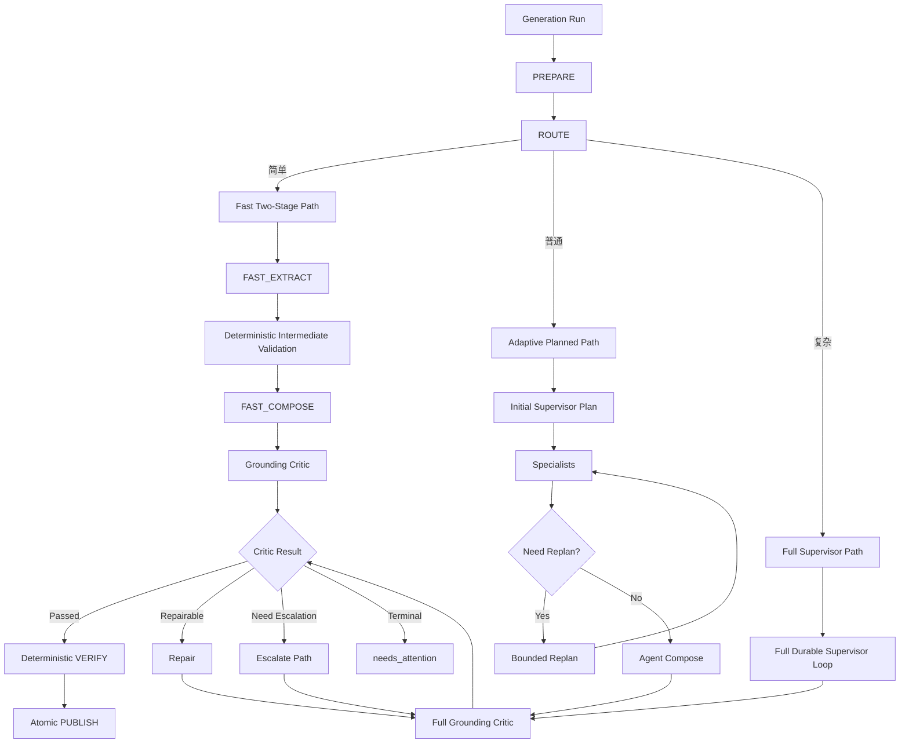
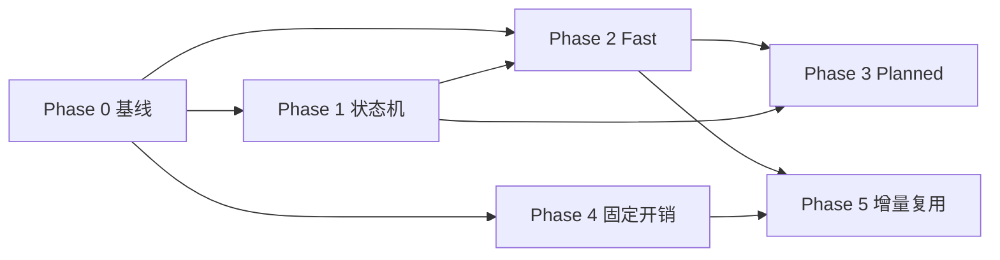

# 学习卡生成系统性能与质量协同优化——实施计划

> 版本：v1.3（代码事实核对修订版）
> 日期：2026-08-06
> 设计依据：`性能与质量协同优化方案 v0.3`（技术评审候选稿）
> 基线系统：`Supervisor Agent v1` / `card-supervisor-shell-v1`
> 文档状态：实施计划（任务拆分 + 执行层定义）；v1.1 纳入评审修订；v1.2 删除人工评审与双跑机制、收敛数值上限；v1.3 按代码事实修正预算兜底口径与函数引用
> 责任：API 服务 / AI Worker / 共享包 / DB / 前端 Web / Desktop
>
> **v1.2 修订（2026-08-06，依据实施反馈）**：
> ① 删除全部人工评审内容（原 §4.6 非劣效统计口径、§4.7 双跑成本/人力预算、§4.8 Pseudo-Gold 协议）及支撑它们的 Shadow 双跑机制（P2-8、P3-8），质量门禁改为纯自动化指标（Unsupported/Contradicted/Evidence Integrity、Fallback/Escalation 率、成本/延迟监控）；
> ② 删除除"防死循环"外的全部数值上限：repair/replan 次数、Compose 上下文预算、Fast 输入/路由阈值、样本量门槛等一律移除——历史教训是"给每个角色/工具设上限导致 AI 输出截断、任务失败"，本版只保留 maxTurns/maxToolCalls、重试次数、自旋检测等防死循环机制；
> ③ 原 §4.6-§4.8 删除后，§4.9-§4.11 顺延为 §4.6-§4.8。
>
> **v1.3 修订（2026-08-06，代码事实核对后更新）**：
> ① 修正"防死循环由全局 turn/toolCall 预算约束"的口径：`budget.ts` 自 2026-08-04 起角色级 `maxTurns/maxToolCalls` 已不作执行检查（仅常量保留），实际兜底为 run 级 `maxProviderCalls`/`runDeadline`/token 上限 + 自旋检测——§3.2、§4.1、§4.3、§5.3 P3-3、§7、§9-1 全部按此替换；
> ② P1-1 推进函数勘误：仓库无 `advanceGeneration`，改为 `supervisor-loop.ts` 的 `executeSupervisorTurn`/16 状态状态机对应分支；
> ③ P0-5 补充 B1 死代码 `generationFingerprintInputSchema`（contracts.ts:1312-1331，无使用方）清理，验收改为"清理后仅一套在用"；
> ④ §4.1 补充 kind 的 DB CHECK 约束迁移、新增 `grounding_critic`（Full Critic）kind、明确 Fast 路径 Repair 语义（Repair 即升级 Full）；
> ⑤ P2-9 补充灰度发布机制落点。
>
> **v1.1 评审修订（2026-08-06，代码评审后更新）**：
> ① §5.6 新增"路径优先级决策规则"（假设 A 成立则 Phase 4 前置）；
> ② §4.7 显性化双跑人工评审人力预算（v1.2 已删除）；
> ③ §4.1 补充 `execution_mode` 迁移说明、勘误角色名为 `vision_specialist`；
> ④ §7 新增质量指标冲突裁决优先级；
> ⑤ §5.2 新增 P2-10（用户侧兜底与前端落地）；
> ⑥ §9 修正预算契约口径问题（16/40 为 turn/toolCall 预算，非 token）。

---

## 0. 文档定位

本文是 v0.3 方案的可实施版本，在保留 v0.3 全部设计决策的基础上补充：

1. **三假设验证实验设计**（Phase 0 的交付物与结论拍板流程）；
2. **双层升级 Artifact 继承链**（Fast → Planned → Full 的传递规则）；
3. **Repair / Escalation 判定规则**（由确定性 issue code 分类驱动，不依赖模型判断）；
4. **纯自动化质量门禁**（Unsupported/Contradicted/Evidence Integrity、Fallback/Escalation 率、成本/延迟指标；不设人工评审与双跑实验）；
5. **每个 Phase 的任务级 WBS**（任务、交付物、验收、依赖、规模）。

对仓库现状的描述基于已核对的实现事实（见 v0.3 §2；v1.1/v1.3 已由代码评审逐项复核，关键仓库事实表引用基本属实，发现的差异已在 v1.3 修订说明及 §4.1/§9-1 落文）；正式实施前由代码负责人完成逐项最终确认。

### 关键仓库事实（实施时引用）

| 主题 | 位置 |
|---|---|
| 生成流程入口 | `workers/ai-worker/src/handlers/card-supervisor-agent.ts` |
| Supervisor Durable Loop / 状态机 | `workers/ai-worker/src/agent/roles/supervisor-loop.ts` |
| 自动兜底推进 | `workers/ai-worker/src/agent/supervisor-auto-fallback.ts` |
| Phase 执行器（5 段式） | `workers/ai-worker/src/agent/run-phase-executor.ts` |
| VERIFY | `workers/ai-worker/src/agent/verify-phase.ts` / `verify.ts` |
| PUBLISH / Epoch Fence | `workers/ai-worker/src/agent/publish.ts` / `publish-phase.ts` |
| 角色实现 | `workers/ai-worker/src/agent/roles/{text-extractor,code-extractor,vision-specialist,deck-composer,grounding-critic,repairer}.ts` |
| 推进类工具 | `workers/ai-worker/src/agent/tools/quality.ts`、`tools/deck-draft.ts` |
| 预算 / 契约常量 | `packages/shared/src/card-agent-contracts.ts` |
| 指标 | `workers/ai-worker/src/lib/metrics.ts` |
| 表结构 | `packages/db/src/schema/card-generation.ts`、`schema/evidence.ts` |
| B1 fingerprint 复用 | `apps/api/src/modules/card-generation/service.ts` |

---

## 1. 背景与问题定义

### 1.1 已核实的性能事实（5 个 Problem Set Run）

- Supervisor Turn 已从约 15 降至约 3；
- E2E 约 81～114 秒；
- 每 Run 约 9～10 次 Provider 调用；
- 单次主要生成调用约 42～64 秒；
- 每 Run Input Token 约 42k～56k，Output Token 约 2.9k～5.3k。

结论：**不能再简单归因于"Supervisor Turn 太多"**。瓶颈是"单次 Provider 延迟、语义调用总数、阶段固定开销"的组合，各项贡献比例尚未测量。

### 1.2 三个待验证假设

| 假设 | 内容 | 验证方式 | 拍板出口 |
|---|---|---|---|
| A | 单次 Provider 延迟是第一瓶颈 | 分层样本的延迟回归模型（延迟 ~ tokens × role × model） | 决定是否值得压缩单次输入/输出 |
| B | 语义调用次数是第二瓶颈 | 9～10 次调用的价值消融（哪些调用对质量有边际贡献） | 决定 Fast/Planned 是否值得上线 |
| C | 固定开销是次级可优化瓶颈 | 单 Run 延迟瀑布分解（queue/DB/事件/上下文/轮询） | 决定投入放在调用压缩还是 Provider/Context 优化 |

### 1.3 优化目标

> 减少不产生语义价值的调用和固定开销，同时保留 Agent 在理解、提取、归纳、组卡、审查和修复上的能力。

非目标（不变量，任何阶段不得放宽）：

- 不取消 Supervisor Agent；
- 不让代码决定知识点和卡片结构；
- 不允许模型直接发布结果；
- 不移除独立 Grounding Critic；
- 不改变统一 Evidence / VERIFY / PUBLISH 契约；
- 不降低 Evidence 完整性要求。

---

## 2. 总体架构



执行模式：`fast_two_stage_v1` / `adaptive_planned_v1` / `full_supervisor_v1`。

---

## 3. 三层执行路径设计要点（实施约束）

### 3.1 Fast Two-Stage Path

**流程**：`PREPARE → FAST_EXTRACT → INTERMEDIATE_VALIDATE → FAST_COMPOSE → CRITIC → VERIFY → PUBLISH`

**适用范围**：简单内容由 Router 依据内容特征判定（无图片、无公式、代码片段少、density 非 complete），**不做 token 量或数量级硬阈值**（历史教训：数值上限导致 AI 输出截断、任务失败）。

**FAST_EXTRACT 输出**：`FastExtractionArtifact`（documentIntent、learningFocus、candidates[localId/claim/topic/sectionKey/cognitiveType/importance/difficulty/evidenceRefIds/relationHints]、noCandidateDecisions）。**不负责**最终分组、标题/摘要、Merge/Split、排序——控制 Output Token 并让中间校验有明确边界。

**中间确定性校验**（纯代码，无模型）检查清单：

- Schema 合法；Candidate Local ID 唯一；
- Evidence ID ∈ Allowlist；Evidence 类型合法；
- 每个 Required Bundle 有明确决策（Candidate 或 No-Candidate）；
- Claim 长度在上下限内；无空 Claim；
- 数字/公式/代码 Evidence 类型一致；Candidate 与 Bundle 归属一致；
- 输出未截断（Finish Reason 完整）。

失败分类：

```text
可重试协议错误        → 仅重试 FAST_EXTRACT（≤2 次）
复杂语义错误          → 升级（Phase 2 为 Full；Phase 3 后为 Planned/Full）
多次失败              → Full Supervisor 或 needs_attention
```

**FAST_COMPOSE 输出**：Canonical Candidate Operations、Card Grouping、Deck Title/Summary、Card Title/Summary、Learning Objective、Ordinal、Capacity Exclusions。

**Compose 按需读取（原则约束，不设数值上限）**：

- 只允许按 Evidence ID / Candidate / Bundle / Section 读取；禁止自由全文扫描；
- 不设回读量/读取次数/单次 ID 数上限（历史教训：数值上限导致 AI 输出截断）；上下文不足时用已有内容完成 Compose，或升级。

**升级与 Artifact 复用**（见 §4.2 双层继承链）：

```text
FAST_EXTRACT 未通过中间校验 → Artifact 不可复用
FAST_EXTRACT 已通过中间校验   → 写入隔离 provisional ledger，
                              作为 Planned / Full 路径的"已验证初稿"
```

可复用：Candidate Claim、Evidence Binding、No-Candidate Decision、Section/Topic、Importance/Difficulty 初值、Relation Hint。
不可直接信任：最终 Canonical Candidate、Merge/Split、Card Grouping、Deck Title/Summary、Critic Verdict。

### 3.2 Adaptive Planned Path

**流程**：`Initial Plan → Specialists → Deterministic Gap Detection →（可选）Bounded Replan → Agent Compose → Full Critic →（可选 Repair）→ VERIFY → PUBLISH`

**Initial Plan** 输出 `GenerationPlan`（documentIntent、learningFocus、bundleTasks[specialist/extractionFocus/relatedBundleIds/expectedDecisionKinds]、compositionStrategy）。Plan 是不可变记录（见 §4.1），初始而非最终真相。

**Gap Detection（确定性优先）**：

- Required Bundle 无明确决策；Candidate 数量 0 或异常爆炸；
- Specialist 协议错误 / 引用未分配 Evidence / Bundle 类型与 Evidence 类型不匹配；
- Code Bundle 无 Code/Formula Candidate；Image Bundle 缺 Required Image Evidence；
- Coverage Ledger 不完整；Surviving Coverage 低于阈值；
- 同 Section 大量重复 Candidate；Finish Reason 截断；Plan 指定 Bundle 不存在或重复。

Specialist 自报（`PlanMismatchSignal`）只能作为 Replan 触发加项，不能单独作为成功判定。

**Bounded Replan**：只能调整未完成 Bundle、有限补查、修改 Specialist、增加相关 Bundle Context、调整 Extraction Focus；不得重置 Run、自动增预算、清除已验证 Artifact；次数不设硬上限，防死循环由 run 级预算（`maxProviderCalls`/`runDeadline`/token 上限，见 §9-1）与自旋检测兜底。

**Replan Artifact 三分类复用规则**：

| 分类 | 规则 |
|---|---|
| `validated_and_unaffected` | 直接复用，不重新调用 Provider |
| `validated_but_referenced` | 允许 Compose/Replan 读取，不默认重提取 |
| `invalid_or_affected` | 创建新 Specialist Unit（inputHash 含 Replan Version） |

不得因修改一个 Bundle 的 Context 而无条件重跑全部 Specialist。

### 3.3 Full Supervisor Path

**适用**：多模态高度混合 / 跨章节复杂依赖 / 需动态 Evidence Search / Replan 后仍失败 / Coverage 冲突 / 复杂 Hard Issue / Complete Density 复杂内容 / 升级路径。

**工具边界**：

- 保留语义工具：`get_run_manifest`、`get_next_unassigned_bundles`、`delegate_specialist`、`read_agent_task_results`、`ensure_semantic_index`、`search_related_evidence`、`read_candidate_ledger`、`apply_candidate_operations`、`submit_deck_draft`、`read_quality_report`、`request_repair`、`apply_draft_patch`；
- 转为系统内部状态机命令（模型调用时返回 `deprecated_system_managed_transition`，由系统按权威状态推进，后续从 Schema 移除）：`request_grounding_review`、`request_verification`、Critic Passed 后创建 VERIFY、Repair 完成后重新 Critic、Draft 提交后创建 Critic、Child Task 完成后恢复父任务。

### 3.4 三路径维护价值门槛（每季度 / 重大模型升级后重新评估）

保留 Fast 独立路径需同时满足：

```text
Fast 覆盖内容占比可观（覆盖过低则无独立路径价值）
且 Fast 相比 Full 的 E2E 显著改善（需经成本模型验证为净节省）
且 Fast Fallback Rate 可控
且 Fast 质量满足自动化质量门禁（Unsupported/Contradicted/Evidence Integrity）
```

保留 Adaptive Planned 独立路径需同时满足：

```text
Planned 覆盖内容占比可观
且 Planned 相比 Full 的 Provider Calls 或成本显著改善
且 Planned → Full Escalation 可控
且质量满足自动化质量门禁
```

具体数值不作硬性门槛，由 P0-8 基线报告给出观测值后在季度评估时参照。

不满足时：Fast 覆盖过低 → 合并为 Adaptive Planned 的小内容配置；Planned 升级率过高 → 普通内容直接走 Full Supervisor。

---

## 4. 执行层定义（本版补充）

### 4.1 数据模型改动

**`card_generation_runs` 新增字段**：

```text
execution_mode           GenerationExecutionMode  -- 现状仅存于 provider_snapshot JSON（api/service.ts 写入），需 JSON→列一次性迁移；存量 Run 默认 NULL（语义=未路由）
routing_reason           string[]
fallback_from_mode       GenerationExecutionMode?
fallback_reason          string?
plan_version             int?
plan_hash                string?
fast_path_attempted      boolean
fast_path_succeeded      boolean
repair_count             int        -- Run 级全局计数，不设上限（防死循环由 run 级预算与自旋检测兜底，见 §9-1）
replan_count             int        -- Planned 路径 Replan 观测计数，不设上限
```

**`card_generation_units` 新增 kind**：

```text
route
supervisor_plan
fast_extract
fast_compose
grounding_critic_light
grounding_critic_claim
grounding_critic      -- Full Critic（Planned/Full 路径的独立 unit 记录）
compose
repair
deterministic_verify
publish
```

保留 `agent_run` 兼容 Full Supervisor Durable Loop。

> **DB 迁移注意**：`card_generation_units.kind` 的 CHECK 约束现状由 migration `0062` 收窄为 4 值（`prepare / agent_run / deterministic_verify / publish`，见 `apps/api/src/db/migrations/0062_retire_legacy_bridge_pipeline_v2_constraints.sql`），新增上述 kind 必须配套一次**扩展 CHECK 约束的 migration**；本段全部新列（`execution_mode` 等）同样需要对应 migration（含存量 `provider_snapshot` JSON → 列的一次性回填）。

**新增 `card_generation_plans`（不可变，只插入）**：

```typescript
type CardGenerationPlanRecord = {
  id: string; runId: string; version: number; schemaVersion: string;
  planJson: GenerationPlan; contentHash: string;
  producedByUnitId: string; producedByEventKey: string; createdAt: string;
};
```

**新增 `provisional_candidates`（Fast/升级隔离区）**：

```text
runId | sourceUnitKind | artifactHash | candidateJson | producedBy | status
(validated_initial | reused | rejected | superseded) | createdAt
```

`artifactHash` 采用内容寻址，与 B1 共享 Hash/Version 规则但独立存储。

**Quality Report 新增**：`critic_mode(light|claim|full)`、`reviewed_claim_count`、`high_risk_claim_count`、`low_risk_claim_count`、`escalated_claim_count`。

**Metrics 新增（Provider 级）**：

```text
provider_call_duration_ms   provider_time_to_first_token_ms
provider_input_tokens       provider_output_tokens
provider_cache_hit_tokens   provider_cache_miss_tokens
provider_finish_reason      provider_response_truncated
provider_role               provider_model
```

必须把 `generation_supervisor`、`text|code|vision_specialist`（角色名以 `card-agent-contracts.ts` 为准，非 `vision_extractor`）、`deck_composer`、`grounding_critic`、`repairer` 全部加入 `lib/metrics.ts` 的 allowlist（现状 allowlist 仅含 4 个非角色 key，见 `lib/metrics.ts` 的 `PROVIDER_OPERATIONS`）。

### 4.2 双层升级 Artifact 继承链（本版补充）

升级允许链：`Fast → Planned`、`Fast → Full`、`Planned → Full`；禁止反向。Fast/Planned 失败 Artifact 不得直接发布。

**传递规则**（Fast → Planned → Full 连续升级时）：

1. Fast 的 `FastExtractionArtifact` 通过中间校验后进入 `provisional_candidates`，层级为"已验证初稿"；
2. Fast → Planned 时，**必须按 Bundle 重新归属**：Fast 是全局提取范式（sectionKey/topic 为全局标注），Planned Specialist 是按 Bundle 分工范式——转换步骤将每个 candidate 按 Evidence 所属 Bundle 重新归属并校验，归属失败的 candidate 标记 `unassigned` 交 Planned 补查；
3. Planned 的 Specialist 对 provisional candidates 执行 `confirm / revise / reject / supplement`，只对存在 Gap 的 Bundle 重新提取；
4. Planned → Full 时，Full Supervisor 可读取 provisional ledger 作为参考初稿，但 Full 拥有最终决定权；不信任其最终组卡产物；
5. 任何环节进入正式 Candidate Ledger 前重新校验；`producedBy` 全程保留；
6. **升级不重置 `repairCount`**；成本按叠加路径统计（primary + fallback 全量）。

### 4.3 Repair / Escalation 判定规则（确定性，本版补充）

Critic 输出带结构化 issue code。Hard Issue 出现时由代码按下表路由（**不调用模型判断**）：

| 优先级 | 条件（issue code / 确定性信号） | 动作 | 是否消耗 Repair |
|---|---|---|---|
| 1 | 完整性/协议/Coverage 问题（`coverage_gap`、`protocol_error`、`bundle_missing`） | Escalate 或补查 | 否 |
| 2 | 证据不足且 Evidence Search 命中数 > 0（`insufficient_evidence` + search_hits>0） | Escalate / Evidence Search | 否 |
| 3 | 表达/局部组织错误且现有 Evidence 充足（`wording`、`title_summary`、`local_merge_split`） | Repair | 是 |
| 4 | 多 Bundle 冲突、核心概念遗漏、结构性组卡错误（`cross_bundle_conflict`、`core_concept_missing`、`structure`） | Escalate / Recompose | 否 |

Repair 只承担：Claim Rewrite、Title/Summary Rewrite、Evidence Removal、局部 Move/Merge/Split、Ordinal/Group 调整。Repair 不重新理解整篇文档。

Repair 次数**不设硬上限**（历史教训：上限导致 Repair 能力被浪费、任务失败），防死循环由 run 级预算（`maxProviderCalls`/`runDeadline`/token 上限）与自旋检测兜底（角色级 maxTurns/maxToolCalls 自 2026-08-04 起已不作执行上限，见 §9-1）；Repair 计数（Run 级）以下情况均不重置：Fast→Planned、Fast→Full、Planned→Full、Worker 重启、Unit 重试、Critic Mode 切换、Draft Version 增加。

Fast 路径命中 Repair 级 issue（上表优先级 3）时，**Repair 即触发 `Fast → Full` 升级**：Fast 内不设独立 Repair，Repair 产物按 §4.4 走 Full Critic（与"Repair 产物 → Full Critic"的映射一致）。

### 4.4 风险分级（确定性优先）

```typescript
type DeterministicClaimRisk = {
  containsNumber: boolean; containsDate: boolean; containsUnit: boolean;
  referencesCodeSpan: boolean; referencesFormulaSpan: boolean; referencesImageEvidence: boolean;
  evidenceCount: number; sourceBundleCount: number;
  isMergeResult: boolean; isSplitResult: boolean; isRepairResult: boolean;
  lexicalOverlapBelowThreshold: boolean;
  containsComparisonPattern: boolean; containsCausalPattern: boolean; containsBoundaryPattern: boolean;
};
```

来源规则：

- Code/Formula/Image 由 Evidence 类型确定；Merge/Split/Repair 由 Typed Operation 记录确定；跨 Bundle 由 Evidence 归属确定；
- 数字/日期/单位用解析器检测；比较/因果/边界用保守词法模式**只作加项**；
- 模型输出的 `cognitiveType` / `relationHints` / `importance` / `difficulty` **只能提高风险，不能降低风险**。

审查映射（第一阶段不实施免 Critic）：

| Claim 风险 | 审查 |
|---|---|
| 低 | 批量 Lightweight Critic |
| 中 | Claim-Level Critic |
| 高 | Full Context Critic |
| Repair 产物 | Full Critic |
| Image / Formula / Code | 至少 Claim-Level Critic |

待积累 Light vs Full Verdict 差异数据后，再考虑确定性放行。

### 4.5 成本模型

```typescript
estimatedCost =
  inputTokens * inputUnitPrice +
  cachedInputTokens * cachedInputUnitPrice +
  outputTokens * outputUnitPrice +
  embeddingTokens * embeddingUnitPrice +
  imageUnits * imageUnitPrice;

totalExpectedCost =
  primaryPathCost +
  retryProbability * retryCost +
  fallbackProbability * fallbackCost;      // 叠加路径全量成本，不计入 Retry Amplification
```

新增指标：`fallback_cost_amplification`、`semantic_retry_amplification`。

### 4.6 用户反馈闭环

**输入信号**：删除卡片、修改标题/Summary、删除/修改 Key Point、手动合并/拆分、强制重新生成、反馈选项（过碎/过长/漏重点/重复/不准确）。

**注入位置**：下一次生成的 Router、Supervisor Plan、Compose、Critic Policy。

```typescript
type GenerationFeedbackProfile = {
  preferredGranularity?: "more_atomic" | "balanced" | "more_comprehensive";
  rejectedTopics?: string[]; missingTopics?: string[];
  duplicationComplaint?: boolean; accuracyComplaint?: boolean;
  priorEditSummary?: string;
};
```

**安全约束**：反馈只能调整 Granularity / Topic Priority / Grouping / Style / Coverage Focus；不得放宽 Evidence / Unsupported Claim / VERIFY / Budget / Privacy / PUBLISH Gate。

### 4.7 SLO 制定流程

不在设计阶段固定绝对 SLO。流程：

1. Phase 0 采集分层样本的真实延迟（真实 Run 不足时用合成/脱敏样本补齐）；
2. 建立延迟模型：`duration ~ f(input_tokens, output_tokens, model, provider, role, finish_reason, cache_hit)`；
3. Phase 2/3 用真实样本测试 Fast Extract / Fast Compose / Light Critic 延迟；
4. 计算各路径 P50/P90/P95，冻结 SLO；
5. P95 Gate 需在样本充足或持续流量后冻结；Problem Set 的 5 个 Run 只能作为初始事实，不是统计基线。

分层覆盖：Source Token 桶、Output Token 桶、纯文本/代码/图片/混合、Overview/Standard/Complete、Fast 候选/Planned 候选/Full、不同 Provider/Model、正常/截断/重试/Fallback。

**可观察延迟 SLO**（区分模式）：Notify 正常 P95 ≤ 1s；Polling Fallback P95 ≤ 3s。

### 4.8 用户文案（统一）

| executionMode | 用户文案 |
|---|---|
| `fast_two_stage_v1` | 快速生成 |
| `adaptive_planned_v1` | 多角色协作 |
| `full_supervisor_v1` | 深度分析 |

---

## 5. 任务拆分（WBS）

### 5.0 Phase 0：现状收口与基线（先盘点，再改造）

**出口条件**：预算单一来源、Provider 延迟/Output Token 可观测、Auto-Fallback 有测试、B1/B2 清理后仅一套在用实现、基线报告冻结、三假设有结论并拍板投入方向。

| ID | 任务 | 关键交付物 | 验收标准 | 依赖 | 规模 |
|---|---|---|---|---|---|
| P0-1 | 盘点并测试 `supervisor-auto-fallback` | Auto-Fallback 场景矩阵文档；覆盖测试 | 每种注入路径（模型不调用工具/过早请求验证/只读自旋）有单测；明确"临时兜底 vs 正式状态机入口"的结论 | 无 | S（1-2 人日） |
| P0-2 | 统一预算契约口径（防死循环机制 = run 级 maxProviderCalls/runDeadline/token 上限 + 自旋检测；角色级 16/40 仅常量保留，见 §9-1） | 单一预算来源（常量 + 文档同步）；验证 run 级预算可兜底不设上限的 Repair/Replan | grep 文档与代码一致；无漂移检查脚本；run 级兜底有测试 | P0-1 | S |
| P0-3 | 收口 BUG-94（模型错误 Draft Hash 推进） | 推进路径不信任模型传入 Hash，从 DB 加载权威 Artifact | BUG-94 回归测试通过；`request_verification` 注入路径无法用错误 hash 推进 | P0-1 | S |
| P0-4 | 补齐 Provider 级 Metrics（allowlist） | `lib/metrics.ts` allowlist 全角色；Grafana 面板 | 线上可见 `generation_supervisor` 等全部角色的 duration/token/finish_reason；`provider_response_truncated` 可查 | 无 | S |
| P0-5 | 盘点收口 B1/B2 | B1 fingerprint、B2 prompt cache 的代码/提交/gate 状态清单；清理无使用方的 `generationFingerprintInputSchema`（contracts.ts:1312-1331，17 字段死代码）；补齐测试与 gate | 清理后仅一套在用实现；Force Regenerate 与版本变化不误复用有测试 | 无 | M（2-3 人日） |
| P0-6 | 构建分层基线数据集 | 数据集清单（分层覆盖表）、存储位置、脱敏规范 | 覆盖 §4.7 分层维度；真实 Run 不足时用合成/脱敏样本补齐 | 无 | M |
| P0-7 | 三假设验证实验（A/B/C） | 延迟回归模型表；调用价值清单（9~10 次调用逐个标注高/中/低边际价值）；单 Run 延迟瀑布分解图 | 三假设各自结论 + 证据；评审通过并拍板"主要投入方向"（调用压缩 vs Provider/Context 优化） | P0-4、P0-6 | L（4-5 人日） |
| P0-8 | 冻结基线报告 | v1 性能基线文档（P50/P90/P95、成本模型参数、SLO 草案、Fast 路由判定依据） | 基线报告评审通过；Fast 是否值得上线、路由判定依据记录在案 | P0-7 | S |

### 5.1 Phase 1：状态机正式化

**出口条件**：质量无回退；纯推进 Turn 减少；无重复 Critic/VERIFY；无 BUG-94 类错误 Hash 推进。

| ID | 任务 | 关键交付物 | 验收标准 | 依赖 | 规模 |
|---|---|---|---|---|---|
| P1-1 | Draft Created → 自动创建 Critic Unit | 状态机推进规则（`supervisor-loop.ts` 的 `executeSupervisorTurn` / 16 状态状态机对应分支） | Draft 成功后不再需要模型请求 Critic；无重复 Critic | P0-1 | S |
| P1-2 | Critic Passed → 自动创建 VERIFY Unit | 同上 | Critic 通过后自动 VERIFY；VERIFY 不信任前序状态（独立校验） | P1-1 | S |
| P1-3 | Repair Completed → 自动重新 Critic | 同上 | Repair 完成后自动 Critic；`repairCount` 全局计数落地（Run 级，不重置） | P1-1 | S |
| P1-4 | Child Tasks Completed → 自动推进 | Child Task 完成事件驱动父任务恢复 | 不再需要 Supervisor 轮询读取子任务状态 | P1-1 | S |
| P1-5 | 推进工具 Deprecated | `request_grounding_review`/`request_verification` 返回 `deprecated_system_managed_transition`；系统按权威状态推进 | 模型调用返回提示且系统正确推进；审计记录；后续从 Schema 移除的计划 | P1-2、P1-3 | M |
| P1-6 | 竞态与幂等修复 | 模型工具调用与状态机推进并发场景测试 | 并发/双推进有测试；CAS + Lease Fence 生效；无重复 Unit 创建 | P1-1~P1-5 | M |
| P1-7 | Phase 1 回归验收 | 回归报告 | 质量无回退（§7 质量项）；纯推进 Turn 减少；无重复 Critic/VERIFY；E2E 延迟下降 | P1-1~P1-6 | S |

### 5.2 Phase 2：Fast Two-Stage

**出口条件**：Fast 走灰度小流量 → 自动化质量 Gate 通过 → 放量发布；升级目标固定为 `Fast → Full Supervisor`（Phase 2 不得依赖 Adaptive Planned）。

| ID | 任务 | 关键交付物 | 验收标准 | 依赖 | 规模 |
|---|---|---|---|---|---|
| P2-1 | Complexity Router（先统计不切换） | 路由模块 + `routing_reason` 落库 | 只计算不切换；`execution_mode`/`routing_reason` 写入 runs；覆盖比例可统计 | P0-8 | S |
| P2-2 | FAST_EXTRACT Unit + Schema | `fast_extract` unit kind、Prompt、`FastExtractionArtifact` Zod Schema（输入不设 token 上限，仅受全局预算约束） | 输出通过 Schema 校验；Evidence ID 全部 ∈ Allowlist；Required Bundle 均有决策 | P1-7、P2-1 | M |
| P2-3 | 中间确定性校验 | 独立校验模块（§3.1 清单） | 纯代码无模型；失败分类（重试 ≤2 / 升级 / needs_attention）正确 | P2-2 | S |
| P2-4 | FAST_COMPOSE Unit + 按需读取 | `fast_compose` unit kind、ComposeArtifact Schema、按需读取 Evidence（§3.1） | 只按 Evidence ID/Candidate/Bundle/Section 读取，禁止全文扫描；不设数值上限 | P2-3 | M |
| P2-5 | 风险分级 + Light/Claim-Level Critic | `DeterministicClaimRisk` 计算器；risk → 审查等级映射；Lightweight Critic 输入输出契约 | 模型标注只升不降；低/中/高风险映射正确；Repair/Image/Formula/Code 至少 Claim-Level | P2-4 | M |
| P2-6 | Fast → Full 升级 + provisional ledger | `provisional_candidates` 表；升级流程：通过校验的 ExtractArtifact 写入 → Full 读取 confirm/revise/reject/supplement | 升级不重置 repairCount；失败 Artifact 不发布；producedBy 保留 | P2-3 | M |
| P2-7 | Unit Artifact Cache 最小版 | 内容寻址缓存（inputHash = 输入+模型版本+Prompt 版本+unit kind）；命中重放；审计 | 与 B1 共享 Hash 规则但独立存储；force 重算可用；无两套实现 | P2-2 | M |
| P2-9 | 成本与延迟建模 + 路径价值评估 + 灰度机制 | 路径级 P50/P90/P95；三路径价值门槛数据（Coverage、E2E 改善、Fallback、自动化质量指标）；灰度发布机制（feature flag 分桶、小流量→放量/回退开关） | 输出"Fast 是否值得保留独立路径"结论；SLO 草案更新；灰度开关可用 | P2-1~P2-7 | M |
| P2-10 | 用户侧兜底与前端落地 | `needs_attention` 的用户重试/反馈入口（覆盖 Fast/Planned/Full 三路径）；executionMode 用户文案（§4.8） | 质量不达标的 Run 有明确用户处理路径（重试/反馈/查看原因）；executionMode 展示符合 §4.8 | P2-9 | S |

### 5.3 Phase 3：Adaptive Planned

**出口条件**：Planned 自动化质量 Gate 通过；升级矩阵切换为 `Fast → Adaptive Planned → Full Supervisor`。

| ID | 任务 | 关键交付物 | 验收标准 | 依赖 | 规模 |
|---|---|---|---|---|---|
| P3-1 | GenerationPlan Schema + Initial Plan Unit | `supervisor_plan` unit kind；`card_generation_plans` 表（不可变）；Plan Schema 校验 | Plan 只插入不更新；contentHash/version/producedBy 完整 | P1-7 | M |
| P3-2 | 确定性 Gap Detection | Gap Detection 模块（§3.2 清单） | 纯代码信号优先；Specialist 自报仅加项；误报率有测试样本 | P3-1 | M |
| P3-3 | Bounded Replan + Artifact 复用 | Replan Unit（次数不设硬上限，防死循环由 run 级预算与自旋检测兜底，见 §9-1）；三分类复用规则落地；inputHash 含 Replan Version | 复用不重跑 Provider；Replan 不能重置 Run/增预算/清 Artifact | P3-2、P2-7 | M |
| P3-4 | Specialist DAG 调度 | 代码并行调度 text/code/vision；relatedBundleIds 依赖；全部 Required 完成后自动 Compose | 并行调度正确；依赖顺序正确；无 Supervisor 空转 Turn | P3-1 | M |
| P3-5 | Compose 按需读取 Evidence | 按 Candidate/Bundle/Section/EvidenceID 读取接口（§3.1 原则复用） | 默认不注入全文；不设数值上限 | P3-4 | M |
| P3-6 | Planned → Full 升级 | 升级条件落地（Replan 后仍失败/Coverage 不足/上下文不足/复杂 Hard Issue） | 升级不重置 repairCount；失败 Artifact 不发布 | P3-3 | S |
| P3-7 | 升级矩阵切换（Fast→Planned→Full） | Fast ExtractArtifact 按 Bundle 重新归属转换步骤；升级矩阵启用 | 切换前四项验证通过（可复用、Gap Detection 识别 Fast 遗留、Repair 不重置、成本叠加统计） | P3-6、P2-6 | M |

### 5.4 Phase 4：上下文与固定开销

**出口条件**：每 Turn 上下文增量构建；Prompt Cache 单一实现；批量幂等查询/事件写入；Notify + 轮询兜底；可观察延迟达标。

| ID | 任务 | 关键交付物 | 验收标准 | 依赖 | 规模 |
|---|---|---|---|---|---|
| P4-1 | 上下文增量构建 | 稳定上下文/状态上下文拆分；按 `stateVersion` 增量更新 | 不再每 Turn 重建全量上下文；缓存键 = runId + shellVersion + policyVersion + toolSchemaVersion | P1-7 | M |
| P4-2 | Prompt Cache 收口与扩展 | B2 收口（单一实现）；稳定前缀字节级一致；cache key 含 model/prompt version；usage 统计 | 未命中行为一致；cache 收益按 Provider/Model/Role 可统计；feature flag 灰度 | P0-5 | M |
| P4-3 | Tool 幂等批量查询 | `resolveToolCallsBatch`/`persistToolRequestEventsBatch`/`persistToolResultEventsBatch` | 每 Tool Call 独立幂等键；批量不破坏局部恢复；Event 顺序稳定 | P1-6 | M |
| P4-4 | Event 批量写入 | 批量持久化 + 顺序保证 | 写入量下降；审计可追溯 | P4-3 | S |
| P4-5 | Agent Event Summary 回灌 | `AgentExecutionSummary`（completed/failed tool calls、child tasks、latest decision） | 模型上下文不再默认加载 200 条原始 Event；诊断时按需读取 | P4-1 | M |
| P4-6 | Notify + Polling Fallback | LISTEN/NOTIFY 唤醒；轮询分级（活跃 100-200ms/短空闲 500ms/长空闲 1-2s） | Notify P95 ≤1s；Polling P95 ≤3s（区分统计） | 无 | M |
| P4-7 | 流式状态输出 | Time to First Status/Token/Tool Call、Stage Transition Latency 记录 | 指标落库；用户感知改善但不算 E2E 优化核心 | P4-1 | S |

### 5.5 Phase 5：增量 Artifact 复用（后续，不阻塞前四阶段）

| ID | 任务 | 关键交付物 | 验收标准 | 依赖 | 规模 |
|---|---|---|---|---|---|
| P5-1 | Bundle Extraction Cache | 跨版本 Bundle 级提取缓存 | 只重算变化 Bundle；命中可重放 | P2-7 | L |
| P5-2 | Candidate Cache | Candidate 级缓存 | 同源同内容命中；版本变化失效 | P2-7 | M |
| P5-3 | Critic Cache | Light/Full verdict 缓存（claim 哈希） | 同 Claim 重复审查命中 | P2-7 | M |
| P5-4 | Note Version Diff | 快照 diff | 变化范围可定位到 Bundle/Span 级 | 无 | M |
| P5-5 | Changed Claim Review | 只审查变化 Claim，未变化引用旧 verdict | 无重复审查 | P5-4 | M |
| P5-6 | Incremental Search Projection | 增量搜索索引 | 索引更新与 Cache 一致 | P5-4 | M |

### 5.6 依赖图



关键路径：`P0 → P1 → P2 → P3 → 默认路由`。Phase 4 与 Phase 2/3 并行不阻塞；Phase 5 全程不阻塞。

**路径优先级决策规则（v1.1 补充，P0-7 拍板后生效）**：

- 若假设 A（单次 Provider 延迟是第一瓶颈）成立：上下文压缩 / Prompt Cache 属首要投入，Phase 4 的 P4-1（上下文增量构建）与 P4-2（Prompt Cache 收口）**前置到 Phase 2 之前**，关键路径调整为 `P0 → P1 → P4 → P2 → P3`；
- 若假设 B（语义调用次数是第二瓶颈）成立：维持 `P0 → P1 → P2 → P3`，Fast/Planned 优先；
- 若假设 C（固定开销显著）成立：Phase 4 的 P4-3~P4-6（幂等批量 / Event / Notify）前置；
- P0-8 冻结基线报告时必须记录该决策及依据，后续 Phase 执行顺序以此为准。

---

## 6. 里程碑与排期建议

> 人日/周数为相对建议，实施前由团队按实际产能校准。

| 里程碑 | 内容 | 建议周期 | Gate |
|---|---|---|---|
| M0 | Phase 0 + Phase 1 | 2-3 周 | 基线报告评审通过；状态机收敛无质量回退 |
| M1 | Phase 2 | 2-3 周 | Fast 自动化质量 Gate 通过；放量发布；成本模型落地 |
| M2 | Phase 3 | 2-3 周 | Planned 自动化质量 Gate 通过；升级矩阵切换 |
| M3 | Phase 4 | 2-3 周（可与 M1/M2 并行） | 可观察延迟 SLO 达标 |
| M4 | Phase 5 | 3-4 周（后续阶段） | 增量复用收益数据 |

总量粗估：**约 12-16 人周（不含 Phase 5，已剔除双跑任务 P2-8/P3-8）**，需团队校准。

---

## 7. 验收标准汇总（Gate 清单）

### 质量

- Unsupported Claim = 0；Contradicted Claim = 0；Evidence Integrity = 100%；
- Fast / Planned 路径满足自动化质量门禁（同上硬指标 + Fallback/Escalation 率可控 + 成本/延迟可观测）；
- 跨卡重复率不增加；强制重新生成率不显著上升；删除/修改 Key Point 比例不显著上升（用户行为指标作弱代理观测）；
- **指标冲突裁决优先级**：硬指标（Unsupported/Contradicted/Evidence Integrity）> Fallback/Escalation 率 > 成本/延迟指标。冲突时以硬指标为准，不得只报有利指标。

### 不变量

- Repair 次数不设硬上限（防死循环由 run 级预算与自旋检测兜底，见 §9-1）；升级不重置 Repair Count（观测计数）；
- 旧 Run 不覆盖新 Run（Epoch Fence）；Publish 失败不重新调用模型；
- Fast/Planned 失败 Artifact 不直接发布；
- 所有路径使用相同 Evidence / Draft / VERIFY / PUBLISH 契约。

### 性能

- 基线冻结后定 SLO；初期要求：状态机收敛后 Provider Call 数下降；Fast/Planned E2E 显著低于 Full；Output Token 无异常放大；Fallback 成本可观测、可控。

### 稳定性

- Success Rate ≥ 98%；无重复发布；Unit 可局部恢复；Worker 重启可恢复；Tool 幂等无回归；Replan/Repair 次数不设硬上限，防死循环由 run 级预算与自旋检测兜底（见 §9-1）；升级链只允许 Fast → Planned → Full，禁止反向。

---

## 8. 风险与回退

| 风险 | 防护 |
|---|---|
| Fast 质量下降 | 仍用 Agent；独立 Light/Claim Critic；自动升级；路径级自动化指标监控；灰度小流量逐步放量 |
| Plan 错误导致批量提取偏差 | Plan Schema 校验；确定性 Gap Detection；Specialist 自报仅加项；Coverage 不足升级；Compose 可按需读原文 |
| 状态机跳阶段 | 每次推进 CAS；Unit/Run 双重状态约束；Artifact Hash 校验；VERIFY 不信任前序状态 |
| Light Critic 漏检 | 高风险自动 Full；第一阶段全量 Critic；Repair 后 Full；定期抽样 Full 复审并对比 verdict |
| 单次上下文过大 | 两段式（Fast Extract/Compose）+ 中间校验兜底；上下文不足时升级 |
| 升级链路 Artifact 继承错误 | §4.2 传递规则；按 Bundle 重新归属；进入正式 Ledger 前重新校验 |
| 假设结论与路径优先级脱钩 | §5.6 决策规则：P0-7 拍板后按假设 A/B/C 结论调整关键路径（A 成立则 P4 前置） |

---

## 9. 开放问题（实施前需确认）

1. 预算契约口径（v1.3 按代码事实修订）：`16/40` 实为角色级 `maxTurns/maxToolCalls`（`card-agent-contracts.ts` 的 `DEFAULT_ROLE_BUDGETS`），但 `workers/ai-worker/src/agent/budget.ts` 自 2026-08-04 起**已不对角色级 maxTurns/maxToolCalls 作执行检查**（仅保留常量与空实现，见 budget.ts:193/256/267-268/315-319）；当前防死循环的实际载体是 **run 级 `maxProviderCalls`(60) / `runDeadline` / token 上限（`createDefaultRunBudget`）+ 自旋检测（`supervisor-auto-fallback.ts` 场景 C）**。文档各处"防死循环由全局 turn/toolCall 预算约束"已全部按此替换；P0-2 统一口径并验证 run 级预算在 Repair/Replan 不设次数上限后仍能有效兜底。token 预算实值（`maxInputTokens` 2M / `maxOutputTokens` 500K）**维持现状不收紧**（历史教训：收紧 token 上限导致 AI 输出截断、任务失败）。
2. `deprecated_system_managed_transition` 兼容期长度：建议保留 1 个发布周期后从 Schema 移除。
3. 各任务人日估算需团队按实际产能校准。
