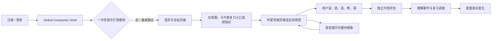
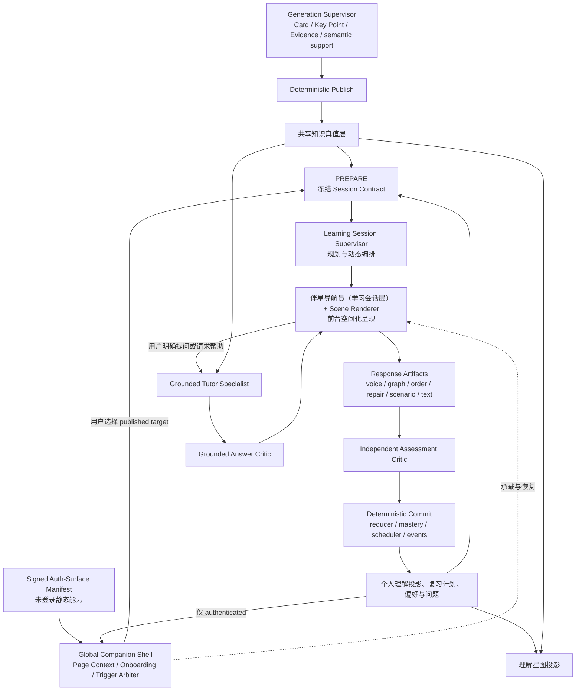
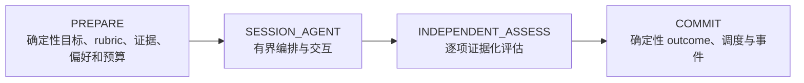
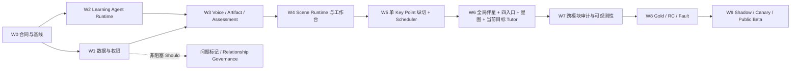

# AI 学习伴侣驱动的多模态理解宇宙：最终产品与实施方案

> 状态：Draft（Final Proposal）/ 待 Repository Owner 批准<br>
> 文档版本：1.2<br>
> 日期：2026-08-04<br>
> 目标发布：学习卡 Generation Supervisor v1 通过既定 Gate 后的首个学习体验正式公测列车，版本号由发布计划统一确定<br>
> 学习运行时标识：`learning_session_supervisor_v1`<br>
> 确定性外壳：`learning-session-shell-v1`<br>
> 多模态协议：`multimodal-validation-contract-v1`<br>
> 上游计划：[学习卡生成 Supervisor Agent v1](learning-card-generation-agent-graph-public-beta.md)<br>
> 上游问题证据：[学习卡生成 v2 质量诊断](../evidence/v0.6/card-generation-v2-quality-diagnosis-2026-08-01.md)<br>
> 一句话目标：让学习伴侣从注册、登录和首次进入开始贯穿整个系统，把静态学习卡、只读理解星图、打字验证和到期队列，统一为一个由伴星导航员随处可达、Learning Session Supervisor 有界编排、用户通过语音与知识操作参与、独立 Critic 评估、真实结果驱动星图变化的个人理解宇宙。

---

## 0. 结论先行

本项目选择：

> **AI 学习伴侣驱动的多模态理解宇宙。语音、触控和知识操作是一等交互，打字只是可选输入；游戏感来自探索、操作、反馈和知识世界的真实变化，不来自排行榜、XP、连续打卡或任务压力。**

用户只需理解一个核心循环：

> **选一颗想靠近的星，和伴星走一小段路，通过说、排、连、修、演弄清一件事，再回到星图看看真正发生了什么。**



从注册/登录到上述循环之外的所有页面，同一个伴星以全局壳持续可达；首次使用引导、页面帮助、空状态和故障恢复只帮助用户抵达或理解这条循环，不新增第二套任务系统，也不制造学习事实。

### 0.1 五个不可退让的产品决策

1. **不以打字为默认前提**：完整主路径必须可经语音不使用键盘完成；语音关闭时保留文字 canonical 路径，并在目标通过资格检查时提供同样零打字的 structured proof。不能虚假承诺“拒绝语音且拒绝一切生成式输入”仍适用于每类知识。
2. **不把学习伴侣做成聊天框**：伴侣的主要语言是指向、移动、铺路、摆放、连接、朗读、显影和退场；自然语言只是其能力之一。
3. **不把小游戏成绩冒充理解**：每种互动只推进它实际证明的能力切面；识别型点击、提示后完成和纯浏览只能是练习。
4. **不让 Agent 直接写学习真相**：Agent 负责理解用户意图、编排路线、生成场景、追问和解释；正式 outcome、掌握投影、复习调度和共享图关系由独立评估与确定性内核决定。
5. **全站可达不等于全站打扰**：同一个伴星从注册、登录、首次引导到所有由 public-auth shell 或 authenticated app shell 承载的可路由页面持续可见或可召唤，但只读取页面显式提供的净化上下文；普通浏览时安静收起，用户隐藏或关闭后不再邀请、发声或调用后台 Companion 能力。

### 0.2 “全面 Agent 化”的准确边界

Agent 化的是需要知识理解和策略判断的部分：

- 本轮选择哪些知识目标；
- 如何结合用户时间、意图和交互偏好组织路线；
- 当前知识适合语音讲解、关系重建、步骤排序、错误修复还是情境模拟；
- 正式评估结束后暴露了哪个 rubric 缺口，下一步应进入练习、切换场景还是结束；
- 如何回答用户对当前文章、知识点或相关概念的额外问题；
- 如何把一次会话以简洁、非施压的方式呈现在星图中。

不 Agent 化的是不能容忍概率错误的学习内核：

- active Card、Key Point、Evidence 和后续 semantic relation 的资格；
- workspace/user 权限、RLS、隐私和工具 allowlist；
- rubric、evidence allowlist、episode target fingerprint、stable content exposure key 和 assistance snapshot；
- Response Artifact 的锁定、hash、幂等、cancel 和 stale；
- 逐项 verdict 的结构完整性检查和 deterministic reducer；
- mastery policy、official scheduler 和星图正式投影；
- semantic relation candidate 到 published/rejected 的审核与发布（Should，非公测主链）；
- 原子事务、重放、审计、导出和删除；
- 注册/登录及全部 credential 页面帮助、首次使用引导步骤、页面锚点、触发优先级和页面允许动作；这些由 versioned manifest 与确定性状态机驱动，不由模型观察 DOM 或自由决定。

这与 Generation Supervisor 方案使用同一架构哲学：**认知工作交给 Agent，业务真相交给确定性系统。**

落地形态不是“一个大 LoopAgent 包办所有事情”，也不是恢复旧固定 stage pipeline，而是：

```text
Typed Agent Graph（阶段、状态、权限与恢复）
  ├─ bounded LoopAgent node（路线与 Scene 编排）
  ├─ specialist Agents（Tutor、Rubric/Scene Critic、Assessment Critic）
  └─ deterministic core（资格、事务、事实、调度、投影）
```

LoopAgent 适合在已冻结权限、预算和终止条件内做局部认知循环；Typed Graph 负责跨阶段依赖、checkpoint、失败恢复和可观测性；向量召回只是 Tutor/候选发现的工具，不能替代 exact evidence、coverage、relationship publish 或 schedule 真相。保留下来的旧能力只有已经验证的 canonical 事实、调度不变量、安全边界和回滚读取路径，不保留旧方案的多 stage 编排主链。

### 0.3 与 Generation Supervisor 的发布关系

- Generation Supervisor 负责“什么知识值得成为可信学习资产”；本计划负责“用户如何与这些资产互动并证明理解”。
- 两者可复用通用 Agent Runtime 的 session、turn、tool event、budget、checkpoint、lease 和 native-tool/structured-action 能力，但 role、工具权限、数据权限、模型快照和发布 Gate 完全分离。
- Learning Session Supervisor 只能读取已经确定性 Publish 的 canonical Card、Key Point 和 Evidence，不得读取 generation draft、Candidate Ledger 私有 staging 或未通过 Critic 的产物。
- Generation Supervisor 不得读取个人回答、音频、理解状态、用户问题标记或复习表现，也不得为单个用户改写共享卡片。
- 本计划的 W0 合同工作可与 Generation Supervisor 的后期 Gate 受控并行；消费端集成以其 published output contract 稳定为前置，不反向阻塞生成主链的公测 Gate。

公测消费边界冻结为 `PublishedLearningAssetContractV1`：

```ts
type PublishedLearningAssetContractV1 = {
  contractVersion: "published-learning-asset-v1";
  cardId: string;
  cardRevision: number;
  keyPointId: string;
  claim: string;
  exactEvidenceRefs: string[];
  semanticSupportReportId: string;
  semanticSupportReportHash: string;
  sourceFingerprint: string;
  lifecycle: "active" | "superseded";
  cognitiveType?: string;
  interactionAffordances?: string[];
};
```

- required 是 Card、Key Point、claim、exact evidence、semantic support、source fingerprint 和 active/superseded 生命周期；`cognitiveType` 与 interaction affordance 只是 optional hint；
- Candidate Ledger、relation hints、private draft 和未 Publish 产物一律 forbidden；optional 字段缺失时只使用通过 Gold 的安全 Scene fallback；
- active Card Set 被替换或 source fingerprint 改变时，所有未提交 Episode stale；历史结果保留原版本引用；
- contract hash、替换/stale 和 forbidden-field 负向测试是 Generation → Learning 集成 Gate。

### 0.4 对旧 v0.7 方案的处理

本文批准后：

| 旧 v0.7 能力 | 决策 |
| --- | --- |
| question-first、防泄漏、assistance、stale、canonical outcome | 保留并扩展到多模态 |
| Key Point 级掌握投影、可重算事件流 | 保留并升级为能力切面 + 时间耐久双层表达 |
| 星图行动入口、搜索、透镜、稳定布局 | 保留并扩展 |
| 概念候选 + 人工确认、血缘保护 | 公测只消费确定性血缘；semantic relation 独立治理后再扩展 |
| Learning Session、流式进度、取消与恢复 | 保留思路，重写为有界多模态会话 |
| 今日关卡 | 改为用户可选择、可缩短、可忽略的路线建议 |
| XP、level、streak、成就墙、combo、清空任务 | 从主方向删除，不作为公测 Must/Should |
| 热力图和学习统计 | 只作为个人事实回顾，不承担催促和比较功能 |

本文不是在旧 v0.7 上增加一只 AI 头像，而是重写其产品核心。

### 0.5 复杂度预算：扩玩法，不扩主链

尽管本文把风险合同写得很细，运行时主链只有一条：

```text
PREPARE → bounded SESSION_AGENT → INDEPENDENT_ASSESS → COMMIT
```

公测只允许一套 Session/Episode 模型、一套 Public/Private Scene 协议、一套 Response Artifact、一套 reducer/domain adapter 和一套 official scheduler 写路径。新增玩法原则上只新增 versioned Scene schema、deterministic scorer 和 Gold fixture，不新增一条业务 pipeline、canonical event 系统或自由协商的多 Agent 群聊。

若某项扩展必须新增第二套掌握真相、第二个 schedule writer、另一种提交事务或无限 Loop 才能成立，默认拒绝或重新设计；问题标记、workspace Tutor 和 semantic relationship 因此全部置于非阻塞 Should bundle。

Global Companion Shell 是一层确定性分发与呈现壳，不是第二条 Learning pipeline：所有页面复用一个 versioned context/action contract、一个触发仲裁器和一套用户开关；不得为每个页面再建独立助手 Agent、消息历史或记忆库。

---

## 1. 当前事实与核心问题

### 1.1 当前实现事实

| 领域 | 当前事实 | 核心缺口 |
| --- | --- | --- |
| 学习卡生成 | Generation Supervisor 方案将输出 canonical candidate、exact evidence、semantic support、semantic grouping 和 relation hints | 生成结果尚未被设计成可操作的学习对象，消费端仍主要展示文字 |
| 验证题型 | 现有契约主要是 `explain / example / apply`，前台以自由文本回答为主 | 默认要求打字，未覆盖语音、结构重建、关系连接和多步情境 |
| Rubric 评估 | rubric 持久化 expected concept 与 evidence，但当前评估 Provider 输入只含 criterion/weight/required | 尚未形成“用户回答片段—冻结 rubric target—canonical evidence”的逐项语义复核 |
| 复习 | 到期项按 `nextReviewAt` 升序进入队列，具备可信 attempt、assistance 和调度事实 | 产品形态仍像必须清理的任务队列，缺少按用户意图组织的有界路线 |
| 理解星图 | Canvas 已有缩放、平移、聚类、LOD、选择和详情；服务端只有 `source → note → card → key_point` 外键血缘 | 只能看，尚未成为学习入口，也不能展示个人学习事实的真实闭环 |
| 前台 AI | AI 主要在生成、评估等后台工作；注册、登录、首次进入和普通页面没有统一助手壳 | 用户没有一个从进入系统起就可找到、并能在文章、卡片、星图、历史和错误状态间连续工作的前台学习伴侣 |
| 游戏化 | 旧 v0.7 以 XP、streak、每日关卡、成就和 combo 为主 | 与“自愿、非强迫、按个人偏好学习”的产品价值冲突 |

### 1.2 如果不改，会出现什么

- 不喜欢打字的用户无法完成核心验证，学习卡、复习和星图因此失去闭环价值；
- 新用户注册完成后无法建立“材料—卡片—航程—星图”的基础心智，不同页面的帮助与 AI 入口彼此割裂；
- 把自由文本换成大量四选一，只会降低输入成本，却不能可靠证明理解；
- 给传统问答套动画，不会产生真正的游戏感；
- 另加一个右下角聊天框，只会复制通用 AI 产品的“问一句答一句”，无法形成项目差异化；
- 如果学习伴侣既辅导又判卷，会产生泄题、标准漂移和 assistance 污染；
- 如果 Agent 可以直接点亮星图或修改复习计划，系统将失去当前最有价值的可信边界；
- 如果把所有生成关系都画进图中，理解星图会迅速变成不可解释的幻觉关系网。

---

## 2. 产品定义与统一心智

### 2.1 用户只需要理解四个对象

| 产品对象 | 用户心智 | 系统职责 |
| --- | --- | --- |
| 理解星图 | 我的知识世界现在是什么样 | 展示共享知识和个人理解，选择目的地 |
| 伴星导航员 | 从进入系统起就能找到、和我一起走的学习伙伴 | 提供首次引导和页面帮助；进入学习目标后呈现路线、场景、语音和可选动作 |
| 学习航程 | 我这次想弄清的一小段内容 | 有目标、有预算、有终点的 Learning Session |
| 共学工作台 | 我真正动手或开口的地方 | 承载说、排、连、修、演等 Encounter |

航迹只是一次航程的结果，可选问题标记也只是星图上的私有标记，不再作为独立产品系统要求用户理解。“验证”“复习”“题型”“Agent”“Trust Class”和能力切面也全部退到一条航程背后。

### 2.2 统一核心循环

```text
用户从星图、学习卡、此刻入口或复习入口选择一个知识目标
→ 系统沿用显式偏好；用户可选补充可用时间或输入限制
→ Learning Session Supervisor 默认只提议一条路线，并提供“换一个”
→ 伴星导航员把路线呈现为语音与可操作场景
→ 用户通过说、排、连、修、演产生 Response Artifact
→ 独立 Critic 按冻结 rubric 与证据逐项评估
→ 确定性内核写理解事件并运行 official scheduler
→ 来源页面就地展示真实变化，并提供可选“在星图中查看”
→ 明确结束；是否继续由用户主动决定
```

“说、排、连、修、演”是 Supervisor 的内部 Scene 语法，不是五个全局玩法按钮；稳固/修补/迁移是内部 route intent，不默认要求用户先分类自己的学习行为。

### 2.3 产品原则

1. **自主性优先**：用户决定目的地、投入程度、输入方式和何时结束。
2. **少说话，多行动**：伴侣优先操作知识空间，不用长篇消息占据学习界面。
3. **无打字是完整主路径**：语音不是文字输入的附属功能，也不是低质量模式。
4. **语音不是唯一入口**：安静环境、无麦克风和言语障碍用户始终有 text canonical 路径；对 `SilentProofProfile` 合格目标另有零语音、零打字 canonical 路径，并公开其覆盖边界。
5. **游戏感来自内在反馈**：选择、预测、后果、发现、修复和世界变化，而不是外部奖励。
6. **理解变化必须有证据**：点击、停留、浏览和看过答案不等于学会。
7. **一轮有终点**：不自动续题、不制造无限流、不要求清空任务。
8. **推荐可解释、可拒绝**：用户能看到“为什么推荐”，可换路线、缩短或关闭。
9. **个人偏好不是人格标签**：不构建“视觉型/听觉型学习者”等伪科学分类。
10. **失败不是身份**：误区和到期内容被表达为可探索、可修补的空间，而不是用户缺陷。
11. **处处可达、按需介入**：所有由 public-auth shell 或 authenticated app shell 承载的可路由页面都纳入同一个伴星覆盖 registry，但页面功能不依赖伴星才能完成；“常驻”表示身份和上下文连续，不表示持续动画、弹窗、语音或模型调用。

### 2.4 明确非目标

- 排行榜、好友比较、公开掌握状态、学习时长竞赛；
- XP、金币、等级、宝箱、抽卡、随机奖励、体力或内容锁；
- streak、断签惩罚、红色逾期债务、固定每日目标；
- 用完成速度、口语流利度、点击量、自信度或情绪直接判断理解；
- 右下角通用聊天机器人或无限陪聊；
- 让 Agent 生成任意 HTML/JavaScript 并直接在前台执行；
- 让前台伴侣在 trusted 作答前访问隐藏答案、rubric target 或 evidence；
- 让模型自动确认概念关系、修改共享图真值或正式调度；
- 强制所有知识点使用同一种小游戏；
- 用参与度、DAU 或留存替代真实学习效果证明；
- 公测首版的 VR/AR、实时多人协作、社交路线或开放式 Agent 自主联网。

---

## 3. 目标用户与关键旅程

### 3.1 目标用户

1. **低打字意愿用户**：愿意说、点、拖、连和操作，但不愿填写长答案；这是默认用户之一，不是特殊人群。
2. **好奇型阅读者**：读到文章或卡片时会产生大量“为什么、如果、和什么有关”的问题，需要即时、有证据的扩展解释。
3. **复习型用户**：愿意巩固知识，但反感任务债务、清单压力和重复题面。
4. **严肃学习者**：需要可信判定、证据回溯、干净界面和可关闭的伴侣。
5. **无障碍用户**：可能无法使用语音、精细拖拽、动画或长文本，需要等价的触控、键盘、读屏和 reduced-motion 路径。

### 3.2 前置旅程：从注册到第一次独立使用

```text
用户打开注册或登录页
→ 伴星以静态或轻量状态说明产品用途，并按需提供登录与无障碍帮助；不读取凭据，也不调用个性化模型
→ 注册完成并首次进入系统，伴星只发出一次欢迎：“要不要用大约 3 分钟和我走一遍？”
→ 用户选择“带我走一遍 / 我自己看看 / 先调整方式”；每一步都可返回、暂停或跳过
→ “带我走一遍”进入物理隔离的 `onboarding_sample:*` 沙盒，亲手走过“示例材料 → 示例学习卡 → 极短操作 → 星图演示预览”
→ 沙盒固定标记为 `onboarding_sample / practice_only`，不写 mastery、assessment、exposure 或 official scheduler，演示变化结束即还原
→ 若选择自己的材料，先结束 onboarding，再由全局伴星带到正常导入/生成流程；查看真实 Card 或操作真实 target 必须走常规 Session、assistance 与 exposure 合同
→ 引导结束后提供“从我的内容开始 / 去星图看看 / 结束引导”，不自动开始正式航程
→ 完成或跳过后系统不再自动邀请或重放；用户可随时从伴星或帮助入口手动重新开始
```

首次使用引导是确定性产品教学，不是 `LearningSession`、`LearningEpisode` 或 Grounded Tutor 对话。它使用版本化隔离示例，让用户在不上传材料、不开放麦克风、不授予通知权限的情况下理解基础流程；“约 3 分钟”只描述该沙盒，不包含真实材料的上传或生成时间。老用户首次获得全局伴星时只得到一个被动、非阻塞的短介绍与存在感入口，不主动展开或强制重走完整流程。

### 3.3 旅程 A：第一次遇见一颗新星

```text
Generation Supervisor 发布可信学习卡
→ 星图出现新知识星，证据状态清楚，但个人理解尚未验证
→ 伴星只发出一次轻邀请：“要不要用 3 分钟靠近它？”
→ 用户选择语音、静音操作或稍后
→ 共学工作台生成一个与知识结构匹配的 Encounter
→ 完成后返回原星图视口
→ 只有真实验证过的能力切面发生变化
```

### 3.4 旅程 B：完全不打字的稳固航程

```text
用户选择“10 分钟、静音”，目标已通过 `structuredProofEligibility`
→ Supervisor 从合法到期候选中编排一个预先冻结的 structured-proof bundle
→ 用户通过两个互补、无即时反馈的结构化 Encounter 完成
→ 中途不显示正确答案，不自动吸附到正确位置
→ 单个 Encounter 只推进被实际证明的 facet；只有整个 bundle 覆盖全部 required rubric 且通过 Gold 等价 Gate，才可归一为 canonical review outcome
→ 路线明确结束，不自动追加下一轮
```

### 3.5 旅程 C：语音 Teach-back

```text
用户按住说 20～60 秒，向伴星解释知识点
→ ASR 生成逐字 transcript
→ 用户确认、重录或切换模态
→ Agent 不润色、不补句
→ Independent Assessment Critic 引用 transcript 片段和 canonical evidence 逐项评估
→ ASR 关键内容不确定则 not_assessable，无损重试，不判为不会
```

### 3.6 旅程 D：边学边问，不进入普通聊天

```text
用户在当前 Card/Episode 中问：“如果这个条件变化还成立吗？”
→ 若正在 trusted challenge，系统先询问是否切换到一起学习
→ 原子记录 assistance / practice 状态后调用 Grounded Tutor
→ 伴星拉出相关证据、对比节点或一个条件变式场景
→ 公测 Must 只回答当前 target 的证据化问题，并形成有界 detour
→ 回答后固定提供返回原航程或结束；问题标记 Should flag 开启时才额外提供持久保存
```

### 3.7 旅程 E：从误区到修补

```text
独立诊断发现 required rubric 缺失或矛盾
→ 结果页不显示“失败”，而是指出具体尚未说清的部分
→ 系统生成一个只在当前结果页存在的问题建议
→ Should 能力启用后，只有用户明确确认才保存为问题标记；未确认建议自动退场且不重复提醒
→ 用户可立即进入引导式练习，但本轮 assistance 后不制造“已掌握”
→ 冷却后再进行新的独立验证
```

### 3.8 旅程 F：长时间离开后回来

```text
用户回来
→ 不展示“欠了 87 项”
→ 伴星询问现在有 3 / 10 / 20 分钟
→ 仅使用当前 official scheduler 的复习优先级、canonical outcome 和用户兴趣提议一条短恢复路线
→ 用户可缩短、换一条、自由漫游或直接关闭
→ 未处理 schedule 保留事实，但不被道德化为债务
```

---

## 4. 总体 Agent 与系统架构

### 4.1 上下游架构



### 4.2 组件职责

学习路线与正式学习事实使用两个不同事务层级：

- `LearningSession` 是用户可见的航程容器，串联 1～5 个 Episode，没有 route-level mastery 或总体 schedule 副作用；
- `LearningEpisode` 是 canonical 单元，公测 v1 恰好绑定一个 `keyPointId` 和一个非空 typed `OfficialSchedulingDecisionV1`；只有 `consume_pending` 才绑定一个精确 `inputScheduleId + generation + policyEpoch`；
- 四阶段外壳对每个 Episode 独立执行。一个 Episode 已 commit 后不会因后续 Episode stale、失败或用户取消而回滚；未 commit Episode 零副作用；
- exactly-once 键落到 Episode target commit，而不是 `session complete`。

多个 Episode 之间必须经过用户 checkpoint，不能自动续题：

```text
本 Episode 的真实结果
→ 结束并返回来源（默认）
→ 用户确认“继续下一站”
→ 或换一个 / 缩短剩余路线
```

Supervisor 可以提议下一站，但只有用户命令 `confirm_continue_session` 才能 PREPARE 下一 Episode；没有倒计时默认选择。origin-aware completion 在用户停止、选择返回或全部 Episode 明确结束时执行，而不是在 Episode 之间强制跳页。

| 组件 | 负责 | 明确禁止 |
| --- | --- | --- |
| Generation Supervisor | 生成并组织可信学习资产 | 读取个人学习数据、为用户判定掌握 |
| Global Companion Shell | 从注册/登录开始承载统一伴星身份、确定性首次引导、净化页面上下文、触发仲裁、跨页 origin 与召唤入口 | 读取 DOM/截图/凭据、绕过页面权限或未保存保护、把 onboarding 当作学习事实、在 credential 页面调用个性化模型 |
| Learning Session Supervisor | 选择路线、场景、probe 和有界追问 | 修改卡片真值、直接给 outcome、写 schedule |
| Scene Author（专业子 Agent） | 读取当前 target 的 published claim/evidence 与 private Rubric staging，提出 public/private Scene 草案 | 激活/展示 Scene、跨 target 检索、读取用户回答、签发 trust |
| 伴星导航员（学习会话层） | 在 Global Shell 内呈现 Supervisor 的 typed actions，接收语音/触控/键盘选择 | 自由规划、提前读取答案、自己宣布用户学会 |
| Grounded Tutor | 证据化解释、回答额外问题、生成练习和例子 | 产生正式 assessment、发布语义关系、直接写卡片 |
| Grounded Answer Critic | 对 Tutor 每个事实段检查来源权限、support mode 与实质支撑 | 参与 formal 评分、扩展检索范围、写学习事实 |
| Rubric/Scene Critic | 在展示前检查 rubric 支撑、public/secret 分离、泄漏、可评估性、唯一解/区分度和 A11y | 辅导用户、写正式 outcome |
| Scene Activation Service（确定性） | 校验 schema、安全/Critic verdict、public/private hashes、plan/epoch/budget 后 exactly-once 激活 Scene | 生成或修复内容、跳过 Critic、改变 trust ceiling |
| Independent Assessment Critic | 对冻结 rubric、证据和 Response Artifact 逐项判定 | 生成题目、辅导、输出 mastery/interval |
| Deterministic Core | eligibility、assistance、stale、reducer、mastery、scheduler、commit | 开放式语义生成 |
| Projection Service | 从事件重放个人理解和星图状态 | 把 Agent confidence 当成掌握事实 |

### 4.3 每个 Learning Episode 的四阶段确定性外壳



#### PREPARE

- 解析用户选择的 Key Point、临时问题上下文或复习入口；
- 从 official scheduler、needs-repair 状态和 active canonical 内容中生成合法 Episode 候选；
- 冻结 formal eligibility、typed scheduling decision、Episode/content exposure 身份、用户偏好、assistance snapshot、BudgetEnvelope、capability/runtime epoch 和 policy versions；
- 只读取 `PublishedLearningAssetContractV1` 的 required canonical 字段；optional cognitive metadata 缺失时进入已验证的安全 Scene fallback，不允许 Agent 自由猜测 UI；
- PREPARE 本身不把含答案的评分合同返回客户端。

#### SESSION_AGENT

- 根据目的地和显式偏好默认提议一条路线；“换一个”才生成备选；
- 在首个 formal probe 展示前执行不向用户展示的 `RUBRIC_AND_SCENE_PREPARE` 子流程：解析 RubricTarget → Scene Author 提出草案 → deterministic schema/safety → 独立 Rubric/Scene Critic → 确定性激活 immutable private/public contracts；
- 每个 RubricTarget 冻结 criterion、server-only expected target/hash、weight、required、facet、target、逐项 evidence refs 和 semantic-support report；
- 公测 v1 的同一 formal Episode 在首次回答前冻结全部 trusted probes 和分支，Supervisor 只能请求 `requestedTrustClass`，不能签发 effective trust；
- trusted 阶段不读取内容性 gap 来动态出题，只能接收 `continue / stop / not_assessable / switch_modality` 等无答案控制信号；
- 内容性 assessment gap 只有在正式答案锁定并完成 Independent Assess 后才可供结果解释或 practice 使用；
- practice 阶段可以按已知缺口自适应追问，但其后续 artifact 全部保持 practice-only；
- 不进入无限聊天，不新增评分目标，不替用户完成答案。

#### INDEPENDENT_ASSESS

- 使用独立 Agent Session、system policy 和模型快照；
- 不继承 Supervisor 的自由文本判断；
- 读取完整锁定 artifact、冻结 rubric target 和 canonical evidence；
- 每个 verdict 绑定 Response Artifact、真实 answer excerpt 或 interaction refs、evidence refs；
- 不返回 overall mastery、复习间隔或共享图关系真值。

#### COMMIT

- 重新验证 content/episode fingerprint、全部 frozen probe hash、scheduling decision、budget/capability/epoch fence、cancel、assistance 和 artifact hash；
- 服务端签发 `EpisodeTrustDecision`，运行 `rubric-session-reducer-v2` 与 `facet-to-mastery-policy-v1`，再由 contract 冻结版本的互斥纯函数推导唯一 `EpisodeCommitDisposition`；
- 只有 `canonical_mastery/canonical_unable` 才写 overall validation/review outcome；facet、practice、diagnostic 和 operational 状态使用各自唯一落点，不能伪装成 review attempt；
- 正式结果优先落入现有 validation/review/understanding canonical facts，并通过 outbox 派生 facet/map projection，避免第二套真相；
- 一个 Episode commit 失败或 stale 不回滚之前已成功的独立 Episode；cancel 后已 commit Episode 保留，当前和未开始 Episode 零副作用；
- 重试、断线和 Worker crash 不得重复 result 或 schedule 副作用。

最终 COMMIT 必须在一个数据库事务内按固定顺序锁 `runtime-control → learning_episode → authoritative target/version guard → keyPoint schedule guard → input schedule（consume 时）`，并以单次 CAS 同时验证：`runtimeEpoch=snapshot`、`episodeEpoch` 未变、Episode=`active && !cancelled && !stale`、current content revision/fingerprint 匹配、scheduling decision hash 匹配、kill=false；`create_initial` 还验证不存在 active pending，`consume_pending` 验证精确 generation 仍 active。任一失败整体回滚为 stale/cancelled/blocked。cancel、显式 stale 和 Generation publish/active Card Set 替换也必须经过相同 episode/target guard 或 bump authoritative version guard，不能在 COMMIT 检查与写入之间穿透。

### 4.4 Agent Loop 的有界性

建议初始硬边界，最终数值在 W0 通过真实 Provider 和交互测试冻结：

| 维度 | 建议上限 |
| --- | ---: |
| 每个 Session Supervisor turns | 8 |
| trusted 内容性动态 follow-up | 0（公测 v1；全部 formal probe 预冻结） |
| 每条路线 Encounter | 2～5 |
| 同时 active 学习会话 | 每用户 1 |
| Grounded Tutor 单问题补查 | 3 次工具调用 |
| 单次 Agent turn deadline | 由 Provider/ASR policy 冻结，建议 ≤120 秒 |
| Session inactivity expiry | 建议 30 分钟；只结束 active UI，不回滚已 commit Episode |
| Pause TTL | W0 冻结；恢复时必须重查 source/policy/assistance stale |

上下文记忆来自数据库里的 contract、probe、artifact、assessment、偏好和事件摘要，不来自无限增长的聊天 messages。

---

## 5. 全局前台学习伴侣：伴星导航员

### 5.1 为什么不是聊天机器人

普通聊天产品的容器是消息流；本产品的容器是**知识空间和一次有目标的 Session**。

伴星必须具备通用聊天产品没有的行为：

- 知道用户当前选中的文章、Card、Key Point、星域、确定性血缘和当前 Scene 关系；
- 能在星图中指向、聚焦、铺路和拉近节点；
- 能把知识对象放入共学工作台，生成可操作场景；
- 能观察用户的结构化动作并改变下一步；
- 能回答额外问题，并把回答呈现为证据卡、对比场景或练习建议；
- 能明确结束、安静退场并把结果还给星图。

### 5.2 视觉定案：拟人化动画伴星

伴星的公测基础形象明确采用**拟人化 + 动画角色**，不采用抽象光球、工具图标、写实人类或只有语音没有身体的助手。它应当让用户感到“有一个角色正在和我共同操作知识世界”，而不是“系统给功能套了一个头像”。

基础角色定义为一名来自理解星图的**年轻星际导航员**：

- 采用约 2.5～3 头身的动画比例，轮廓轻巧、亲和但不过度幼儿化；
- 具有清晰的眼睛、眉眼、嘴部、双手和完整身体语言，能够看向目标、指路、托起卡片、拉动节点和连接星轨；
- 产品叙事不绑定现实年龄、种族或职业权威；首版视觉候选可以采用下述参考图中偏女性化的造型，但不把角色写成教师、裁判或需要用户照料的宠物；
- 保留星图世界观识别物：发光星纹、短披风或围巾式彗尾、可变形的导航环；导航环既是随身物件，也是聚焦节点、展开证据和铺设路线的视觉工具；
- 使用二维动画造型、干净色块、柔和描边和少量空间光效；避免写实 3D 数字人、过度复杂服装和大面积持续粒子，以保证 Web、移动端和星图 Canvas 中的可读性；
- 角色关系是并肩探索的伙伴，不是监督者、判卷者、需要用户照料的电子宠物，也不通过亲密依赖要求用户回来。

公测只交付一个统一基础角色，保证品牌与动画质量。外观配色、声音和轻量动作风格的个性化保留为 Could；不得通过 XP、连续学习、付费抽取或任务完成解锁角色身体、表情和必要动作。

#### 角色视觉与动作参考（Draft 1.2）


图 1 为当前伴星导航员的**概念视觉与动作参考**，用于冻结首版候选的共同方向，不代表可直接发布的最终生产资产。它把既有文字设定具体化为：深色星光长发、圆框眼镜、白/深蓝/金色星际服装、彗尾式披风、星形发饰，以及可手持或悬浮的星盘导航环。整体保持约 2.5～3 头身、正面轮廓清楚、双手动作可读，并通过导航环、光屏和星光反馈把角色动作与知识空间联系起来。

示例动作与 `CompanionVisualStateV1` 的语义映射如下；原图标签是姿态灵感，不新增一套独立业务状态：

| 示例动作 | 对应状态/动作 | 使用边界 |
| --- | --- | --- |
| `01_待机_idle` | `dormant` | 只在面板已打开或 moderate/active 已出现时使用；quiet 未召唤仍为静态锚点 |
| `02_邀请_invite` | `invite_once` | 只用于获得一次性 permit 的首次引导或合法邀请，忽略后安静退场 |
| `03_导航_navigate` | `navigate`、`focus_nodes`、`draw_route` | 指向服务端批准的目标与路线，不自由操纵页面或替用户确认 |
| `04_分析_analyze` | `present_evidence`、`explain`、`co_manipulate` | 光屏只能呈现 public/allowlisted 内容，不能显示隐藏答案、rubric 或伪造评估进度 |
| `05_倾听_listen` | `listen` | 仅在用户主动开启麦克风后出现；不从停顿、音色或语速推断情绪与能力 |
| `06_思考_think` | `explain` 或 `uncertain_or_retry` 的短过渡 | 只能对应真实的有界准备/不确定状态，不冒充 Provider、Critic 或 canonical assessment 进度 |
| `07_鼓励_encourage` | 无内容提示的轻量鼓励 | 不暗示答案，不使用“坚持打卡”“别放弃我”等压力或依赖文案，不因答错表现失望 |
| `08_庆祝_celebrate` | `committed_change` | 只有真实 commit 后可用；生产动画需弱化为短确认，不能演变为烟花、连胜或夸张奖励 |

该 PNG 作为方案内参考副本保存在 `docs/image/learning-companion-character-action-reference.png`。虽然原文件名包含“透明”，当前文件实际为 RGB 图片，棋盘格已烘焙且没有 Alpha 通道；正式制作必须把每个动作拆成真正透明背景、统一画布/脚底锚点/安全边界的独立资产，移除标签与棋盘格，并提供二维骨骼/矢量主资产及静态 PNG/WebP fallback。W0 还必须记录素材来源、生成过程、许可与商业使用权；在权利和生产规格确认前，本图只能用于内部设计参考与原型。

#### 动画状态机

动画不是循环播放的装饰，也不由模型自由生成。服务端 typed action 与前端状态共同驱动 versioned `CompanionVisualStateV1`；角色动画只能表达已经发生的系统状态，不能伪装评估进度或 canonical 结果。

| 视觉状态 | 拟人化动画表现 | 边界 |
| --- | --- | --- |
| `dormant` | 面板已打开或 moderate/active 角色已出现时，安静坐、站或悬浮，只有克制的呼吸/眨眼 | `quiet` 未召唤时不得进入该动画，只显示静态中性锚点；不在页面边缘持续摆尾或弹跳 |
| `invite_once` | 从目标星后探身、挥手并指向一条短路线 | 同一上下文只出现一次，忽略后安静退场 |
| `navigate` | 面向目标飞行或步行，回头示意用户，并用导航环拉出星轨 | 路线必须来自已批准 typed action |
| `present_evidence` | 双手展开证据卡或把两个知识对象并排放上工作台 | 不把隐藏 rubric、答案或私有字段动画化 |
| `listen` | 身体前倾、保持目光关注，导航环变成克制的语音波纹 | 仅在用户主动开启麦克风后出现，不以停顿推断情绪或能力 |
| `co_manipulate` | 指向、托住或移动场景对象，必要时退开让出操作空间 | formal 状态不得替用户完成有评分含义的动作 |
| `explain` | 使用手势、表情和场景对象分段解释，而不是持续输出聊天气泡 | 仅用于一起学习或 Tutor detour，结果为 practice-only |
| `assessment_handoff` | 收起提示工具，后退到场景边缘；独立“观测环”接管验证状态 | 通过可见退场表达“伴星导航员不参与判分” |
| `committed_change` | 先看向发生变化的知识星，再与用户做轻量确认动作 | 主要反馈来自知识世界真实变化，不做烟花、连胜或夸张庆功 |
| `uncertain_or_retry` | 保持中性专注，摊手或展示明确的重试/换模态入口 | 不哭泣、沮丧、责备或把系统故障表演成用户失败 |
| `exit_or_hidden` | 可用已缓存资产做一次短挥手/淡出；reduced-motion 下直接消失 | 控制状态与零监听/零调用立即生效，本地退场动画不得延迟；`temporary_hidden/global_off` 不留气泡、声音、context 监听/传输或后台 Companion 调用 |

角色可以表达好奇、专注、共同发现、平静和温和幽默，但禁止对用户表现失望、焦虑、吃醋、孤独、受伤或“等你回来”。答错时角色只关注知识对象和下一种可选操作，不对用户摇头、叹气或降低亲密度。系统也不得根据摄像头、语音或操作速度推断用户情绪，再暗中切换角色表情。

首版动画资产使用可交互的二维骨骼/矢量状态机，而不是 GIF、长视频或由 LLM 实时生成的角色动作。W1 原型需在 Rive 或满足同等条件的引擎之间完成性能、许可证、离线降级和无障碍评估；无论最终引擎为何，`CompanionVisualStateV1`、typed-action 映射和静态 fallback 都不能绑定到供应商私有语义。

`reduced-motion` 下取消飞行、弹性缩放、视差和持续漂浮，改用角色姿态切换、短淡入、描边与静态路线；读屏路径必须提供等价状态文本。角色、动画或音频加载失败时，完整学习功能通过静态角色立绘、图标化手势和标准控件继续可用。

### 5.3 主要动作语言

伴星优先使用 typed spatial actions：

- `focus_nodes`：聚焦一个或多个知识节点；
- `draw_route`：展示一条有界路线和推荐理由；
- `stage_scene`：把对象带入共学工作台；
- `read_prompt`：原样 TTS 朗读净化题面；
- `offer_branch`：提供至多三个清晰选择；
- `show_change`：在 commit 后呈现真实变化；
- `propose_curiosity_save`（Should）：提议保存问题标记，只有用户确认端点可执行；
- `return_to_origin`：恢复来源页面、视口和选中态；
- `end_session`：明确结束并退场。

这些动作由服务端 tool schema 和前端 Scene Renderer 实现。模型不能返回任意 DOM、CSS、HTML 或脚本。

在 Learning Session 外，Global Shell 只使用确定性的产品动作：`spotlight_ui_anchor`、`open_page_help`、`preview_navigation`、`resume_onboarding`、`resume_checkpoint`、`show_permission_scope`、`dismiss_suggestion`、`preview_registered_page_action` 和 `request_page_action_confirmation`。锚点、文案、目的地和允许条件来自页面 manifest；Global Shell 只呈现影响预览并提交用户意图，真正的生成、偏好修改、发布、导出或删除由所属 domain service 重新鉴权后执行。这些动作不能创建 Episode、直接修改领域数据或被模型自由拼装。

### 5.4 全局伴星壳：从登录到每个页面

“学习伴侣存在于系统的方方面面”不是让角色始终占据屏幕、持续说话或在每个页面运行模型，而是：

> **同一个伴星身份始终可找到，知道自己处于哪个页面和权限边界，能够就地提供合法动作，并在没有明确价值时安静退场。**

伴星由应用级 `Global Companion Shell` 承载，不在各页面重复嵌入互不相识的聊天框。用户从登录、首页进入 Note、Card、复习、星图或共学工作台时，看到的是同一个角色、同一套显式偏好和一段有边界的任务上下文；页面功能本身仍须在伴星不可用或关闭时完整成立。

#### 5.4.1 三层能力，不混用权限

| 层级 | 出现场景 | 能力 | 硬边界 |
| --- | --- | --- | --- |
| 公开认证层 | 注册、登录、找回账号与公开产品介绍 | 静态/确定性角色、产品说明、错误码帮助、语言与无障碍入口 | 不读取输入值，不接触密码/验证码/token，不调用个性化模型，不建立学习画像 |
| 全局产品层 | authenticated app shell 承载的所有可路由页面 | 首次使用引导、全局导航、页面说明、空状态与故障恢复、恢复已暂停任务、召唤入口 | 只读页面注册的净化上下文；不能写学习真相、绕过权限或把产品帮助冒充 Tutor |
| 学习会话层 | 用户明确选定 published target 并进入 Session 后 | 现有的路线、Scene、语音、Grounded Tutor 与可信评估交接 | 受 Session Contract、工具 allowlist、Formal/Practice 和双 Critic 约束 |

三层共享角色造型和基础动作语言，但能力升级必须可见：从“页面帮助”进入“当前知识的一起学习”时展示 target 和数据边界；进入“让我试试”时继续使用 `assessment_handoff` 明确退场。登录页看见伴星不代表伴星已经认识用户，系统导航帮助也不能调用 Grounded Tutor 来回答无界产品问题。

#### 5.4.2 全局呈现形态

| 形态 | 适用场景 | 行为边界 |
| --- | --- | --- |
| 安静锚点 | 普通浏览页 | 使用静态中性图标/小立绘固定在应用导航区或内容安全边缘，只提供召唤入口；不播放 idle 动画、不闪烁、不发声、不显示未读红点 |
| 就地提示 | 首次引导、目标附近、空状态、真实状态变化或可恢复错误 | 锚定一个真实 UI 对象，只给一条相关建议，可忽略并立即退场 |
| 伴星侧板 / 移动端底部面板 | 用户主动提问、查看路线、恢复任务或调整本轮方式 | 承载当前任务的有界动作和上下文标签，不形成无限聊天历史 |
| 共学舞台 | Scene、练习、正式验证与结果解释 | 使用完整动画和空间动作状态机；结束后恢复来源页、滚动位置、星图视口和选中对象 |
| 静态降级 | 动画、语音、模型或网络不可用 | 使用静态角色、页面说明和标准控件；不阻塞手动主路径 |

桌面端锚点不得覆盖内容主操作，移动端并入可收起的底部工具栏或面板。伴星提出跨页动作时先说明目的地；页面有未保存内容时只能调用页面自身的离开确认，不能绕过保护。

#### 5.4.3 首次使用引导：第一次同行

注册成功并首次进入系统时，伴星只发出一次账号级设置邀请：

> “欢迎来到你的理解宇宙。要不要用大约 3 分钟和我走一遍？你也可以直接开始探索。”

这是用户尚未选择存在感前唯一一次可主动展示的 consent surface，不计入普通 Companion suggestion；设备已设 auth-local hide 时也只提供被动入口。“安静”从用户跳过、完成或离开该 surface 后立即生效。固定提供三个同级动作：`带我走一遍 / 我自己看看 / 先调整方式`。其中“我自己看看”就是直接跳过，不使用弱化颜色、倒计时、二次挽留或“推荐”角标；每一步都保留上一步、暂停和跳过，并支持键盘、读屏与 reduced-motion。已有用户偏好为 quiet、temporary hidden 或 global off 时，只在设置/帮助中放置被动介绍，不借迁移或新版本主动弹出。

引导不是连续 tooltip，而是一段用户亲手完成、确定性可恢复的产品教学：

1. **认识边界**：伴星说明自己会指路、解释和操作知识空间，但不会替用户确认，也不负责判分。
2. **调整相处方式**：可选安静/适度陪伴/主动建议，以及字幕、动效、语音输出和输入偏好；不选择时采用“安静”。
3. **选择起点**：进入版本化沙盒示例，或选择“用我的内容开始”；后者立即结束 onboarding，再进入正常导入/生成页面，任何创建动作逐项确认。
4. **走过示例流程**：在 `onboarding_sample:*` namespace 中选择示例材料 → 看示例学习卡 → 体验一次极短的“排、连或修” → 在静态演示星图中定位示例知识星。
5. **看见可信交接**：演示伴星在正式验证前退场、只有可信结果才改变星图；沙盒 `publishedTargetEligibility=false`，不能进入 content exposure、scheduler、正式星图投影或任何真实 target。所有“变化”标记为演示预览并在结束时还原。
6. **明确结束**：选择“从我的内容开始 / 去星图看看 / 结束引导”；若用户要开始真实验证，先结束 onboarding，再走正常 PREPARE，不静默启动 Session。

版本化状态定义为：

```ts
type CompanionOnboardingStateV1 = {
  onboardingVersion: string;
  revision: number;
  offerStatus: "not_offered" | "offered" | "consumed";
  offerDisposition?: "completed" | "skipped";
  activeRun?: {
    runId: string;
    entryMode: "first_run" | "manual_replay" | "migration_intro";
    runStatus: "in_progress" | "paused";
    stepId: string;
    resumeTokenRef: string;
    resumeWorkspaceRef?: string;
    expiresAt: string;
  };
  lastRun?: {
    entryMode: "first_run" | "manual_replay" | "migration_intro";
    disposition: "completed" | "skipped" | "abandoned";
    at: string;
  };
  updatedAt: string;
};
```

- 自动欢迎资格严格等于 `offerStatus=not_offered` 且未命中 auth-local hide；渲染前必须先 CAS `not_offered → offered` 并取得一次性 display permit，只有获胜设备/标签页可以展示；CAS 成功后即使客户端在首帧前崩溃，`offered/paused/abandoned` 也不得再次自动展开，只提供被动恢复入口；
- `offerStatus=consumed` 是该版本的单调终态，完成或跳过通过服务端 revision CAS `offered → consumed` 并写 `completed/skipped` disposition，刷新、重登、前后跳转、并发设备或旧请求不能回退；
- 用户从伴星、设置或帮助中心主动重播时只创建 `entryMode=manual_replay` 的独立 run，绝不改变 consumed；暂停只写 `runStatus=paused`，不会自动展开，至多按独立恢复预算展示一次被动续接入口；
- `resumeTokenRef` 绑定 user、可选 workspace、onboardingVersion、runId、base revision 与 expiry；跨 workspace 只同步账号级 offer 终态，不复用上一 workspace 的 resume token；
- 新版本只有在核心心智或关键交互实质变化时才允许一次轻量更新说明，且仍受现有 presence/hidden/off 约束；不能把每次产品更新包装成新手引导；
- 首次欢迎预算与普通页面邀请预算分开持久化；
- 麦克风、通知、文件、跨 workspace 检索等权限只在实际动作发生时逐项请求，拒绝后立即提供等价路径，不在引导中打包索取。

`companion_onboarding_v1` 原子包含隔离的 sample assets、确定性 Card/Scene renderer 和静态 demo map，不依赖正式 Scene Runtime、Generation Supervisor 或 `understanding_universe_v2`。自己的材料入口仅在对应 import/generation capability 可用时展示，并在跳转前终止 onboarding sandbox。

#### 5.4.4 页面感知协议：知道用户在哪里，但不窥视屏幕

authenticated app shell 的每个可路由页面向全局壳声明一个净化、版本化的 `PageCompanionContextV1` adapter；public-auth shell 页面使用对应的静态签名 manifest。注册 route/manifest 不等于持续采集页面：`quiet` 未召唤、`page_context_off`、`temporary_hidden` 或 `global_off` 时，adapter 不挂载 entity/selection observer，也不构造或发送完整 context snapshot。伴星不能抓取整页 DOM、后台截屏、读取剪贴板或根据可见像素猜测页面状态。

```ts
type PageCompanionContextV1 = {
  pageKind: string;
  pageInstanceId: string;
  originRef: string;
  visibleEntityRefs: string[];
  selectedEntityRefs: string[];
  activeMode: "browse" | "practice" | "formal" | "edit" | "settings";
  allowedActionIds: string[];
  capabilityFlags: string[];
  permissionSnapshotHash: string;
  hasUnsavedChanges: boolean;
  sensitivity: "normal" | "private" | "credential";
  contextVersion: number;
};
```

`quiet` 下只有用户显式召唤、选择“和伴星看看”或进入 Session 后，才按当前 action 所需字段构造短 TTL 的 `PageCompanionContextV1`，面板关闭/动作结束即销毁。`moderate/active` 判断是否存在合法主动 reason 时也不能持续发送完整 entity 列表，只能在审核过的 source event 上产生最小触发快照：

```ts
type CompanionTriggerContextV1 = {
  pageKind: string;
  stablePageContextKey: string;
  sourceEventType: string;
  canonicalTargetRef?: string;
  activeMode: "browse" | "practice" | "formal" | "edit" | "settings";
  capabilitySnapshotHash: string;
  permissionSnapshotHash: string;
  contextVersion: number;
};
```

Trigger Context 不含 `visibleEntityRefs`、`selectedEntityRefs`、选区文本或页面内容；只有 rule/budget/lease 签发 permit 且用户接受提示后，页面才构造该 action 所需的完整净化上下文。`page_context_off` 下即使用户召唤也只使用静态帮助，不升级上下文。

真实路由与伴星覆盖使用 `CompanionPageCoverageRegistryV1` 一一对应：

```ts
type CompanionPageCoverageEntryV1 = {
  routePattern: string;
  pageKind: string;
  surfaceMode: "full_context" | "static_help" | "silent_anchor" | "transitional";
  sensitivity: "normal" | "private" | "credential";
  manifestVersion: string;
  manifestHash: string;
  manualFallbackTestId: string;
  owner: string;
};
```

coverage 包含列表、详情、Card Set、全屏编辑/验证、邀请接受、邮箱验证、MFA、SSO callback、重置密码、账号/安全/成员/权限/密钥、错误页与 internal/admin 路由。子路由只有在 sensitivity 和 action allowlist 完全相同时才可显式继承父 manifest；未分类、隐式继承或 manifest hash 失效必须在 CI/启动时失败，不能靠页面矩阵的概括名称漏过真实路由。

页面协议遵循以下规则：

- 只传 canonical ID、净化显示信息、页面状态与权限摘要；`originRef` 和 entity ref 使用服务端签发的 opaque ID，不携带 URL secret/query；密码、验证码、token、隐藏答案、private rubric、系统剪贴板、未授权 workspace 内容和任意 DOM 均不可进入；
- 页面切换、选择变化、workspace/角色权限变化或 `contextVersion` 更新后，旧上下文立即 stale，旧 action token 不能执行；
- 页面只能暴露其注册的 typed actions；展示型动作可在用户召唤后执行，离页导航在存在未保存内容时确认，写入/发布/导出/删除和偏好变更始终预览影响并由用户明确确认；
- 伴星界面持续显示“当前使用：页面类型 / 当前对象 / 权限范围”，用户可查看详情或对当前页面关闭上下文；
- workspace 切换时清空任务上下文并重新校验权限，不能把上一 workspace 的实体、问题或页面摘要带入下一处；
- 未接入协议的页面只提供通用导航和静态帮助，不假装理解页面内容。

任何 `sensitivity="credential"` 页面——无论未登录还是已登录——只能使用签名静态 allowlist 和 `static_help/silent_anchor/transitional` surface：`visibleEntityRefs/selectedEntityRefs` 必须为空，LLM/ASR/TTS、Companion 预取、DOM/selection observer 和个性化 context 为 0；字段焦点、长度、粘贴、自动填充、校验时序和输入节奏也不得被收集。伴星最多读取归一化页面状态与不暴露账号是否存在的通用错误码，不能根据原始认证错误做差异化文案。

#### 5.4.5 触发仲裁与打扰预算

全局壳启用时，被动召唤始终优先：用户可以点击/键盘召唤伴星，在 Note 选区、Card、Key Point、证据、星图节点、空状态或错误旁选择“和伴星看看”，或在 Session 中请求帮助、换模态和结束。全局关闭后只保留设置、帮助菜单与全局命令中的重新启用动作。

主动提示不能由 Agent 临时编造原因，只能命中审核过的有限规则：

```ts
type CompanionTriggerRuleV1 = {
  reasonId: string; // bounded registry enum, never model-authored
  sourceEventType: string;
  allowedPresenceLevels: Array<"moderate" | "active">;
  allowedPageKinds: string[];
  requiredCapabilityIds: string[];
  suppressionModes: string[];
  stableContextKeyPolicy: string;
  cooldownPolicyId: string;
  actionManifestId: string;
};
```

`CompanionTriggerPolicyV1` 是这些 rule 与 presence 映射、稳定 key policy、cooldown/suppression registry 的签名集合；缺失或 hash 不匹配时主动提示 fail closed，被动召唤与页面原生功能仍可用。

合法 reason 只包括：用户已暂停任务的续接、当前操作的可恢复错误说明、canonical 内容变化导致的 stale、commit 后就地展示真实变化、长时间回来后的非强迫恢复，以及主动建议档下清晰且立即可执行的下一步。注册后的首次 consent surface 使用独立 onboarding 状态机和预算，不属于本规则。

触发前固定执行以下抑制顺序，任一命中即停止：

```text
auth_local_hidden / global_off
> temporary_hidden
> page_muted / page_context_off / focus_until_task_end / suggestion_paused / suppressedSuggestionClassIds
> presence level 是否允许该 reason
> rule capability / page / action eligibility
> stable page budget 与 reason budget
```

- 安静 `quiet`：除用户召唤和新注册账号的一次性 onboarding consent surface 外，Companion 主动提示为 0；
- 适度 `moderate`：只允许暂停任务续接、可恢复错误、stale 与 committed change；
- 主动 `active`：在适度基础上允许有明确理由的下一步与回归路线，但仍不自动执行；
- 当前有 formal 作答、录音、文本输入、拖拽、模态框、权限申请或危险操作时，所有内容性主动提示为 0；
- 同一时刻最多一条，必须显示 `reasonId` 对应的人类可读原因，并提供“稍后 / 不再提示此类建议”；后者写入 `suppressedSuggestionClassIds`；
- 不使用数字角标、未读红点、循环挥手、自动语音或情绪表演争夺注意力。

邀请预算使用两个稳定身份，不能复用会随刷新变化的 `pageInstanceId/contextVersion/viewport/temporary selection`：

```text
stablePageContextKey = workspace + routePattern + canonical target/origin + targetChangeEpoch
contextBudgetKey      = user + stablePageContextKey + cooldownEpoch
reasonBudgetKey       = user + workspace + canonical target/origin + targetChangeEpoch + boundedReasonId + cooldownEpoch
```

一次提示必须在同一数据库事务内：验证 suppression/policy/capability → 以唯一约束插入 `contextBudgetKey` 与 `reasonBudgetKey` → 获取 account-scoped、短 TTL 的 `activeSuggestionLease` → 签发一次性 `CompanionSuggestionPermitV1`。任一 key/lease 冲突则整体回滚且前台不得渲染；dismiss、页面离开或 TTL 释放 lease，但不退还已消费预算。这样多标签、多设备和不同 reason 也不能同时展示两条提示。

`targetChangeEpoch` 只在服务端确认 canonical target 发生规则定义的实质变化时单调增加，使一次新邀请资格可审计地产生；刷新、视口、临时选择、Agent 判断和普通 page state 不得改变它。`reasonId`、`cooldownEpoch`、lease TTL 和 key policy 均由签名 policy 冻结，Agent 无权生成或修改。

认证、安全、权限与破坏性操作确认属于页面原生系统 UI，不进入 Companion trigger budget，也不能因隐藏/关闭伴星而消失；伴星只可在用户主动召唤后解释已经显示的原生提示。Companion 自身的固定优先级为：

```text
用户主动召唤
> 用户明确暂停任务的续接
> 当前操作的可恢复错误说明
> canonical 状态变化
> 普通上下文建议
```

#### 5.4.6 页面职责矩阵

| 页面 | 伴星可以做 | 明确不能做 |
| --- | --- | --- |
| 注册 / 登录 / 找回账号 | 解释公开产品能力、无障碍入口和确定性登录故障 | 读取或发送凭据、观察输入内容、建立画像、请求麦克风或运行个性化 Agent |
| 首页 / 空 workspace | 开始或恢复首次引导、选择示例、说明如何添加第一份材料、恢复已暂停任务 | 强迫上传、自动创建内容、把 onboarding 做成待清任务 |
| “此刻” / Review | 解释 official scheduler 的推荐原因，缩短、换一条、稍后或自由漫游 | 展示学习债务、红色逾期、静默延期或自动开始 |
| Source / Note | 说明页面、朗读选区、定位证据、展示已发布 Card；内容解释须先绑定 published target，必要时提议生成学习资产 | 对未绑定 target 开启无界问答，把解释直接发布为 canonical Card，读取未授权材料 |
| Card / Key Point | 一起学习、让我试试、查看证据、前往星图 | formal 前泄露答案/rubric，替用户开始验证 |
| 理解星图 | 聚焦节点、切换透镜、铺设路线、恢复视口 | 自由创建共享关系，把 Scene 连线发布为图真值 |
| 共学工作台 | 朗读操作、切换模态、一起学习、可信交接、停止 | formal 中给内容提示、代做、代提交或参与评分 |
| Episode 结果 | 解释真实变化、返回来源、可选查看星图或由用户确认继续 | 夸大掌握、自动续题、用庆祝动画掩盖 assessment 边界 |
| 搜索 / 无结果 | 缩小合法范围、解释无结果、引导添加或选择已有内容 | 编造不存在的结果、跨权限检索 |
| 导入 / 生成状态 | 根据确定性 job 状态解释进度、提供离开/返回/重试入口 | 虚构百分比、承诺未完成产物、用角色动画伪装后台进度 |
| 设置 / 隐私 / 历史 | 解释选项影响、定位控制项、预览导出/删除范围、重播引导 | 自动改偏好、代确认授权、导出或删除 |
| 账号 / 安全 / 成员 / 权限 / 密钥 / MFA | 仅以签名静态 allowlist 解释页面结构、角色概念和原生安全提示 | 运行模型/语音、观察字段或交互元数据、读取成员/密钥值、代授权或改变权限 |
| 404 / 离线 / 降级 | 解释已保存状态和可恢复步骤，切换静态或手动路径 | 把系统故障表现成用户失败，阻塞原页面 fallback |

Global Shell 启用且当前 surface 未命中 auth-local hide、temporary hidden 或 global off 时，所有 registry 内可交互页面必须有与 `surfaceMode` 一致的稳定召唤入口；隐藏/关闭时页面不显示锚点，只保证普通帮助、设置或全局命令中的重新启用入口可达。账号、安全、密钥等敏感页面只能使用后述 credential-safe 静态模式。全站伴星是协作层，不是用来掩盖信息架构缺陷的单点依赖。

#### 5.4.7 跨页、跨设备与失败恢复

- 跨页只携带有界任务摘要、`originRef`、合法 entity refs 和已确认 checkpoint，不携带无限消息流；返回时恢复来源、滚动位置、星图 viewport 与选择态；
- 跨设备同步 onboarding offer 终态、global off、存在感/suggestion suppression、学习目标和合法 Session checkpoint；不跨设备同步 temporary hidden/page mute、未提交输入、原始音频或临时敏感内容；
- 新设备在 presence/trigger 允许时至多询问一次“继续上次任务 / 暂不恢复”，quiet 下只提供被动续接入口，绝不自动展开完整 Scene；展示 target 名称或恢复前先重查 workspace、权限、内容 revision、policy、assistance 与 capability，过期时说明原因并安全重建；
- 同一 Session 多设备并发采用显式接管或只读提示，不能双重提交；登录过期后重新认证应回到原页面与合法 checkpoint；
- Shell、角色、动画、语音或模型失败不能阻塞页面。重试保持幂等，并始终提供“重试 / 使用手动方式 / 退出伴星”；系统不能丢失已经确认的步骤或重复创建副作用。

### 5.5 存在感设置

| 存在感 | 主动行为 |
| --- | --- |
| 安静 `quiet` | 未召唤时只有静态中性锚点且完整 entity context/idle 动画为 0；除新注册账号一次性 consent surface 外，主动提示为 0 |
| 适度陪伴 `moderate` | 只在恢复、可恢复错误、stale 或 committed change 给一次邀请，未响应即退场 |
| 主动建议 `active` | 在适度陪伴基础上允许展示一条有原因说明的下一步或路线，但不自动开始 |

无论哪一档：

- 不自动开启麦克风；
- 不自动进入下一题或下一条路线；
- 不因用户忽略、跳过、离开而表现失望；
- 不使用红色倒计时、任务债务或损失提示；
- 用户可以一键隐藏伴星，同时保留完整手动学习能力。

控制状态不复用“隐藏”一个模糊布尔值：

| 控制状态 | 作用域与期限 | 伴星行为 |
| --- | --- | --- |
| `page_muted` | 当前 route/stable page context，离开或用户恢复时结束 | 保留安静锚点与手动召唤；该页主动建议和自动语音为 0 |
| `page_context_off` | 当前 route/stable page context，直到离开或用户恢复 | 不挂载页面 observer、不构造/传输 entity refs；只提供静态页面帮助和通用导航 |
| `focus_until_task_end` | 当前显式任务结束或用户恢复 | 保留完成任务所需的手动控件；所有 Companion 主动建议为 0 |
| `suggestion_paused` | 账号级，直到用户显式恢复 | 保留锚点与手动召唤；所有设备的主动建议为 0 |
| `temporary_hidden` | 设备级，跨刷新/重登保持，直到用户显式恢复 | 当前设备无角色、面板、声音、邀请、context 监听/构造/发送、预取或新增 Companion job/Provider 调用；只留设置/帮助/全局命令恢复入口 |
| `global_off` | 账号级、跨设备，直到用户显式恢复 | 所有设备执行 temporary hidden 的零监听/零调用语义，并关闭 Companion 通知；应用启动只允许读取一次普通开关状态 |
| `animation_off / voice_output_off` | 账号级显式偏好 | 功能入口保留，分别改为静态角色或静音；不改变学习权限与结果资格 |

`temporary_hidden/global_off` 在客户端接受操作后立即停渲染、observer 和 context，UI 不等待网络才隐藏。`temporary_hidden` 的持久布尔值只留在设备本地；authenticated 客户端另发送不写账号偏好的短生命周期 `deviceSessionId + surfaceEpoch` runtime-fence，请求服务端取消该设备尚未开始或可取消的 Companion 调用。`global_off` 才通过 `/me/companion` 做 account revision CAS，并向全部 active device session 广播 fence。两者的迟到 Companion 结果一律丢弃。

只有已经脱离 Companion、由所属 domain service 执行的导入/生成等 job 可以让用户选择“转到手动界面继续 / 取消”；Grounded Tutor、页面解释、建议和其他 Companion job 必须取消，不能以“手动继续”为名在隐藏后运行。已锁 formal assessment 属于可信内核，可按原 contract drain，但不能因此新增 Companion 提示或调用。普通偏好读取、runtime-fence、重新启用、导出和删除请求不算后台 Companion 调用。

`temporary_hidden` 只控制当前设备的应用内 Companion surface 与 runtime work，不静默改变用户另行 opt-in 的系统 push 通知偏好；若用户希望暂停跨设备建议/通知，使用 `suggestion_paused`、通知开关或 `global_off`。runtime-fence 可以抑制当前 device session 的应用内通知，但不把本地 hidden 伪装成账号级通知设置。

每个已打开的 authenticated Companion surface 必须持有绑定 `accountStateRevision + accountStateEpoch + deviceSessionId` 的短期签名 lease，挂载 observer、构造 context、显示本地提示或发起 Companion 调用前均重验。`global_off` CAS 单调提升 epoch，并通过 SSE/WebSocket control event 立即撤销所有 active device lease；漏收事件的设备在短租约到期后 fail closed。传播 p95/最大 SLA、lease TTL 和离线重连规则在 W0 冻结。若 account CAS 失败，当前设备保持 `temporary_hidden`，设置页明确显示“仅本设备已隐藏，全局关闭尚未同步”并提供重试，不能谎报全局关闭成功。

首次启用时以中立方式让新老用户选择；未选择前默认“安静”。`suppressedSuggestionClassIds`、稳定页面预算和 bounded reason 预算持久化；忽略或 dismiss 后，冷却结束或目标发生 canonical 实质变化前不得再次邀请。任何系统通知必须显式 opt-in。

公开认证页另提供设备本地的“隐藏伴星”开关；已登录用户全局关闭后登出，同一设备只保留普通帮助入口，不在未登录状态暴露账号偏好或身份。新设备在认证前无法也不得推断账号级 global off，只能尊重本地 hide；认证成功后在 authenticated shell 挂载 observer/角色前先读取一次账号开关并应用。`temporary_hidden/global_off` 不能被刷新、重登、跨页或产品更新静默撤销。

### 5.6 三种学习前台状态

| 状态 | 伴侣可以做什么 | 结果资格 |
| --- | --- | --- |
| 一起学习 | 解释、举例、展示证据、给提示、生成练习 | `practice_only` |
| 让我试试 | 朗读净化题面、解释操作、录音控制、无内容鼓励 | 可进入 trusted assessment |
| 自由探索 | 回答当前目标问题、操作沙盘；候选关系仅在 Should flag 开启时可见 | 默认 `practice_only`，除非用户显式确认开启新 trusted session |

用户在“让我试试”过程中索要知识帮助时，前台只能呈现“切换到一起学习”的确认动作；用户确认后由原子 `enter_practice_mode` 端点先记录 assistance 和 exposure，再开放 Grounded Tutor 权限。Agent 不能代点，系统不能先提示再补记。

### 5.7 Grounded Tutor：真正回答额外问题

Grounded Tutor 是当前 Learning Session 内的**有界 detour**，不是独立聊天通道。每个 detour 必须绑定 `sessionId + episodeId + targetId + questionId`；`questionId` 可以只是本轮 ephemeral ID，不表示已经持久保存。一次只处理一个问题，公测 v1 最多允许两次澄清；Must 固定结束动作只有“返回原航程 / 结束”，问题标记 Should flag 开启时才增加“保存为问题标记”。Session 外提问只有在用户明确选定一个 published Key Point 后才创建 scoped exploration Session；否则先请用户选择材料，不提供通用无限消息流。

输出优先是证据卡、对比 Scene、条件变式或短解释，而不是长文本对话。前台不保留无限滚动聊天历史；detour 结束后只保存用户确认保留的问题和必要的事件摘要。

答案按支持层级拆分：

| 支持层级 | 含义 | 展示与副作用 |
| --- | --- | --- |
| 当前 target（公测 Must） | 直接由 canonical evidence 支持，或由这些证据中的明确前提作有界推导 | 展示精确证据；推导段标记 `derived_from_current_target`，可进入练习场景 |
| 工作区知识（Should） | 由其他已发布 Note/Card/Evidence 支持 | 展示来源并可拉入比较场景 |
| 扩展说明（Should） | 模型一般知识或合理推论，当前材料未覆盖 | 明确标注，不进入共享知识真值和正式验证 |
| 未知 | 当前证据和可靠扩展均不足 | 明确说明不知道，不编造来源 |

每个事实性 answer segment 都包含 support mode；标记为“当前内容”或“工作区知识”的 segment 必须携带 canonical evidence refs，标记为“扩展说明”的 segment 可以没有当前工作区 evidence，但必须显式声明其非 canonical 来源和不可产生的副作用。公测 Must 只开放“当前 target”。

Must 可见动作只有：在当前 target 边界内换一种解释、查看对应证据、生成当前目标的 practice Scene、返回或结束。跨 target 比较、workspace 检索、扩展说明、新笔记/新卡提议和持久问题保存均为 Should；对应 flag 未开时动作本身不可见，不能先展示再报能力不足。

伴侣只能**提议**生成新学习卡、关系 candidate 或创建笔记，必须由用户确认并重新经过 Generation Supervisor/Relationship Governance；Tutor 答案不能直接成为 canonical Card 或 published semantic relation。

标记为“当前 target”或“工作区知识”的 segment 在展示前还要经过独立 Grounded Answer Critic 的逐段 `supported / partial / unsupported` 检查；`derived_from_current_target` 还必须绑定 premise refs 与推导类型。只有 supported 可以使用对应来源标签，partial/unsupported 必须降为明确的扩展说明（Should 开启时）或 abstain。引用完整不等于语义支撑通过。

### 5.8 伴侣记忆

允许保存：

- versioned onboarding 的单调 offer consumed/disposition、scoped paused run 和用户主动 manual replay 记录；
- account-scoped global off/presence/suppression、workspace-scoped 邀请预算，以及不做服务端偏好持久化的 device-local hidden/page control；
- 用户明确设置的输入、语音、反馈、动效和伴星存在感偏好；
- canonical 理解投影和复习事实的摘要引用；
- 用户主动保存的问题标记（Should）和学习目标；
- 用户明确表示喜欢、不喜欢或拒绝的互动方式；
- 已发生的 assistance、stale 和 exposure 事实。

禁止保存或推断：

- private chain-of-thought；
- 注册/登录凭据、验证码、token、剪贴板、后台截图和未提交的敏感表单内容；
- 未经用户确认的心理画像或人格判断；
- “视觉型/听觉型”等永久学习风格标签；
- 以口音、语速、停顿和操作速度推断能力；
- 通过情绪数据静默改变难度、掌握或调度。

短 TTL 的 page/action audit 与 invitation ledger 是安全和幂等记录，不是伴星“记住了用户”；它们必须进入导出/删除，不能用于构建兴趣画像、拒绝倾向或跨 workspace 行为轨迹。

---

## 6. 多模态交互：说、排、连、修、演

### 6.1 统一交互语法

| 动作 | 典型场景 | 主要验证能力 |
| --- | --- | --- |
| 说 | 语音 Teach-back、向伴星解释、口头举例 | recall、explain、apply、boundary |
| 排 | 重建步骤、流程、时间线和状态迁移 | procedure、依赖顺序 |
| 连 | 构建因果、组成、前置、对比和证据关系 | relate、boundary、causal structure |
| 修 | 找到并修复错误流程、论证、代码轨迹或概念图 | boundary、procedure、misconception repair |
| 演 | 多步情境决策、条件变式、后果预测、反例构造 | apply、boundary、transfer |

文本回答作为兼容和偏好选项存在，但不再决定产品结构。

### 6.2 知识结构到互动的路由

| 知识结构 | 优先 Encounter | 备选 |
| --- | --- | --- |
| 概念、原则、定义 | 语音 Teach-back、边界辨析 | 例子/反例构造 |
| 因果、系统关系 | 关系重建、条件变式 | 语音解释、故障修复 |
| 流程、算法、操作顺序 | 步骤排序、状态重建 | 故障定位、语音说明 |
| 比较、易混概念 | 分类、错误连接修复 | 对比讲解、情境判断 |
| 应用型知识 | 多步情境、决策路径 | 语音理由、反例构造 |
| 代码、公式、图表 | 轨迹修复、参数变化、结构操作 | 语音解释；首版按能力逐类开放 |

`cognitiveType` 是内容路由提示，`CapabilityFacet` 是用户被证明能做什么，两者不能混为同一枚举。

### 6.3 Structured Scene DSL

公测首版不允许模型任意生成界面。Learning Session Supervisor 只能选择并填充版本化 Scene schema：

```ts
type LearningScene =
  | VoiceTeachbackScene
  | OrderingScene
  | RelationCanvasScene
  | RepairScene
  | MultiStepScenarioScene
  | CounterexampleScene
  | OptionalTextScene;
```

每个 Scene 必须冻结：

- scene/template/version；
- target IDs、source fingerprint 和 capability facet；
- public payload 与 secret solution 的独立 hash/version；
- allowed token/node/edge/option IDs 与 `disclosureProfile`；
- 逐 rubric evidence binding；
- assistance policy、template trust ceiling 和反馈时点；
- distractor、branch 和最大操作次数；
- keyboard、tap-select-place、screen-reader 和 reduced-motion 等价路径。

Scene 必须物理拆分为三个对象：

| 对象 | 可见性 | 内容 |
| --- | --- | --- |
| `PublicSceneContract` | 可返回客户端 | 净化题面、opaque token IDs、可见 token 文本、操作协议、A11y 和 `publicPayloadHash` |
| `PrivateSceneSolution` | 仅服务端/评估器 | 正确顺序/关系/branch、distractor 身份、rubric target 和 evidence binding |
| `PrivateLearningEpisodeContract` | 仅服务端 | target/schedule/fingerprint、RubricTargets、policy/model refs、budget 和 plan hash |

结构题允许把完成操作所必需的 token 文本展示在 DOM 中，但不得返回正确映射、secret solution、hidden rubric、evidence、历史反馈或答案提示。`disclosureProfile` 决定它最多可证明什么：例如展示全部步骤 token 后可以验证 procedure/order，但不能声明验证了无提示 recall。

每个动态 formal Scene 激活前执行 `scene-safety-v1`：schema、public/secret 分离、allowlisted IDs、答案泄漏、可评估性、唯一解或有效多解、distractor 区分度、事实支撑、prompt injection、语言和 A11y 检查，并 mandatory 调用独立 Rubric/Scene Critic。只有完全静态且带不可变 certification hash、内容槽位仍通过 deterministic allowlist 的模板可以复用历史 Critic approval。失败最多修复一次，仍失败则 `question_retryable/blocked`，不得把未审核 Scene 展示给用户。

唯一激活权限属于 deterministic `Scene Activation Service`：它在事务内验证 Scene Author staging、`scene-safety-v1`、Critic=`approved` 或合法静态 certification、public/private/solution/disclosure hashes、planHash、epoch 与 BudgetEnvelope，写入一次 immutable active contract。Author、Supervisor、Critic 和 Companion 都没有 `activate_scene_contract` 权限。

### 6.4 各模态的最高可信资格

| 模态 | 可证明什么 | 最高资格 | 必须降级的情况 |
| --- | --- | --- | --- |
| 语音讲解 | 主动回忆、解释、因果、应用 | `mastery_eligible` | Agent 补写、关键 ASR 不可靠、已给内容提示 |
| 无提示排序 | 流程和顺序 | `facet_eligible` | 完整顺序已暴露、反复试到正确、即时纠错 |
| 无提示拖拽/连线 | 因果、分类、关系和边界 | `facet_eligible` | 吸附正确位、只剩唯一槽位、完整答案 token 已给出 |
| 多步情境 | 应用和条件边界 | 单 Scene 最高 `facet_eligible` | 单次 A/B/C、每步即时揭晓、错误项被排除 |
| 故障修复 | 约束、边界、procedure | `facet_eligible` | 只点出错误但未修复或未说明依据 |
| 普通单选/判断/配对 | 识别和诊断 | `diagnostic_only` | 不得单独升级掌握 |
| 提示、原文、答案暴露后互动 | 练习 | `practice_only` | 不得延长 interval 或点亮掌握 |
| 关键输入无法可靠解析 | 无法评估 | `not_assessable` | 无正负副作用，可换模态重试 |

预制 option/rationale ID 只能产生 `diagnostic_only`；正式理由必须来自用户的语音、文字或主动构建的关系/条件 artifact。多步路径不会因为步骤多就自动升级 trust。

### 6.5 语音作为一等输入

- TTS 只原样朗读净化题面，不额外给关键词或语气暗示；
- ASR 生成逐字 transcript，用户可播放、确认、重录或切换模态；
- Agent 不能自动润色、概括或补全后再把结果当用户答案；
- 口音、流利度、语速、停顿和音量不进入理解判定；
- 关键术语低置信时返回 `not_assessable`，不能猜测；
- 用户确认的逐字 transcript 是 voice artifact 的 canonical answer；重录确认仍为 voice revision，手工修正则创建 `text_or_mixed` revision；两者都服从同一 lock、stale、assistance 与删除规则；
- raw audio 只是 ASR 与短期争议窗口所需的 transient 输入，加密、短 TTL、默认不进长期备份；用户确认 transcript 后 raw audio 丢失或到期不降低既有 trust；
- voice artifact 长期保留 transcript、transcript hash、短期 audio hash、ASR provider/model/version/language/confidence 与用户确认时间；audio hash 不能被用来恢复声音；
- ASR/TTS Provider 必须绑定 tenant policy、区域、保留期、训练使用禁令/数据处理合同与 consent version；不满足 workspace policy 时语音能力不可用，并提供 text 或 eligibility 合格的 structured 路径；
- TTS 只使用审核过的固定 voice/profile 和净化纯文本，不接受模型生成的 SSML、远程音频 URL 或隐藏提示；
- 无麦克风、安静环境或言语障碍用户始终可切换 `text_or_mixed` canonical 输入；通过 `structuredProofEligibility` 的目标还可用 `structured-proof-v1` 获得同级 canonical outcome 资格；不合格目标不得展示 silent mastery 路线，更不能以选择题换皮冒充等价。

### 6.6 拖拽不是唯一操作方式

所有拖拽必须提供：

- 点选对象 → 选择动作 → 点选目标的等价路径；
- 键盘移动、连接、撤销和锁定；
- screen reader 可理解的节点、关系和顺序描述；
- Switch Control/单手操作的足够大目标；
- reduced-motion 下无飞行动画的静态变化；
- 无计时评分、无精确拖拽速度评分。

---

## 7. Learning Session Contract 与可信评估

### 7.1 Session 容器与 Private Episode Contract

客户端只能获得净化后的 Session/Scene view。正式评分合同只存在服务端：

```ts
type PrivateLearningEpisodeContract = {
  version: "private-learning-episode-contract-v1";
  sessionId: string;
  episodeId: string;
  origin: "card" | "review" | "star_map" | "now";
  originRef: {
    type: "card" | "review_schedule" | "key_point" | "question_suggestion";
    id: string;
  };
  intent: "stabilize" | "clarify" | "transfer" | "explore";
  keyPointId: string;
  formalEligibilityKind:
    | "initial_validation"
    | "scheduled_review"
    | "repair_revalidation"
    | "ad_hoc_transfer"
    | "practice";
  formalPlan: {
    kind: "voice_mastery" | "structured_mastery_bundle" | "facet_only" | "practice";
    requiredProbeIds: string[];
    bundlePolicyVersion?: string;
    silentProofProfileId?: string;
    structuredProofEligibilityReportHash?: string;
  };
  schedulingDecision: OfficialSchedulingDecisionV1;
  episodeTargetFingerprint: string;
  contentExposureKey: string;
  rubricTargets: RubricTarget[];
  allowedModalities: ValidationModality[];
  frozenProbes: FrozenProbeRef[];
  maxTurns: number;
  assistancePolicyVersion: string;
  rubricPolicyVersion: string;
  scenePolicyVersion: string;
  assessmentPolicyVersion: string;
  masteryPolicyVersion: string;
  schedulerPolicyVersion: string;
  providerConfigId: string;
  modelId: string;
  requiredCapabilityIds: string[];
  capabilitySnapshotHash: string;
  providerPolicyVersion: string;
  runtimeEpochSnapshot: number;
  episodeEpoch: number;
  commitPolicyVersion: string;
  budgetEnvelopeRef: string;
  budgetEnvelopeHash: string;
  planHash: string;
};

type OfficialSchedulingDecisionV1 = {
  decisionRef: string;
  decisionHash: string;
  authorizedAction: "create_initial" | "consume_pending" | "record_only" | "no_effect";
  inputScheduleId?: string;
  inputScheduleGeneration?: number;
  prioritySource: "official_due" | "official_overdue" | "canonical_gap" | "user_selected";
  policyVersion: string;
  policyEpoch: number;
  reasonCodes: string[];
};

type FrozenProbeRef = {
  probeId: string;
  publicSceneContractId: string;
  publicPayloadHash: string;
  privateSolutionId: string;
  privateSolutionHash: string;
  sceneSafetyReportId: string;
  sceneSafetyReportHash: string;
  templateTrustCeiling: TrustClass;
  disclosureProfileHash: string;
};

type RubricTarget = {
  id: string;
  criterion: string;
  expectedTargetRef: string;
  expectedTargetHash: string;
  weight: 1 | 2 | 3;
  required: boolean;
  capabilityFacet: CapabilityFacet;
  targetKeyPointId: string;
  evidenceRefIds: string[];
  semanticSupportReportId: string;
  semanticSupportReportHash: string;
};
```

`workspaceId` 和 `userId` 由服务端上下文注入，不接受模型或客户端覆盖。Provider 字段只有不可变配置/模型/能力/policy 引用及 hash，不存 API key、凭据或任意 `object`。

`formalPlan.kind`、`schedulingDecision`、全部 `frozenProbes` 和预算 fence 在首个 probe 激活前冻结并进入 `planHash`。`authorizedAction` 是 official scheduler 的**事前最大授权**，不是根据作答结果改写的最终副作用：

- `create_initial` 只允许不存在 active pending schedule 的 `initial_validation`；产生可评估 canonical outcome 时创建恰好一个首条 schedule；
- `consume_pending` 只允许 official policy 判定合法的 scheduled review、repair revalidation 或 early review，必须绑定精确 `inputScheduleId + generation`，提交后恰好一个 successor；
- `record_only` 不消费、不替换也不新增 schedule；已有 pending 原样保留，只允许 facet observation；
- `no_effect` 只用于事前已声明的 practice/diagnostic 路径；`not_assessable`、provider failure、stale 和 cancel 是事后 disposition 条件，不改变预冻结授权；
- 用户从 Card/Star 主动选择目标只改变 `prioritySource`，本身不授予 early review；若已有未到期 pending，只有 official policy 签发 `consume_pending` 才能提前复习，否则只能 `record_only/no_effect`；
- `facet_only` 必须配 `record_only`，`practice` 必须配 `no_effect`，二者不得绑定 input schedule；`voice_mastery/structured_mastery_bundle` 必须预声明全部 required probe，可配 create/consume/record-only。不能在看到答案后升级 formal plan 或 scheduling authorization。

`requiredCapabilityIds + capabilitySnapshotHash` 只覆盖该 Episode 的传递闭包，不是所有全局 flags 的快照；无关 UI/Tutor/Should flag 变化不使 formal Episode stale。`budgetEnvelope` 在展示首个 formal Scene 前预留完成全部 required probe、Assessment Critic 和 deterministic commit 所需额度；预算不足必须在用户作答前阻断。`planHash` 覆盖 scheduling decision、runtime/episode epoch、commit policy、required capability closure、budget ref/hash 和全部 frozen probe hash。

`GET /learning-sessions/:id` 只返回 public Session view 与 active `PublicSceneContract`；Private Episode Contract、RubricTarget 和 PrivateSceneSolution 在 network/RSC/prefetch/cache/DOM 中字段级不可达。

ephemeral 问题建议可以作为 `originRef`，但正式 target 仍是 Key Point。Must 只在本轮保留 ephemeral 状态；问题标记 Should flag 开启后，用户才可将其持久化为“保留、已探索、用户确认解决、归档”。Agent 不能仅凭回答自动宣布问题解决。

### 7.2 Response Artifact 与状态机

所有回答先转成不可变、user-private、可哈希的 Response Artifact：

```ts
type ResponseArtifactBase = {
  id: string;
  sessionId: string;
  episodeId: string;
  keyPointId: string;
  probeId: string;
  publicSceneContractId: string;
  publicPayloadHash: string;
  privateSolutionId: string;
  privateSolutionHash: string;
  sceneSafetyReportHash: string;
  disclosureProfileHash: string;
  inputSchemaHash: string;
  modality: ValidationModality;
  contentHash: string;
  capturedAt: string;
  answerLockedAt: string;
  assistanceSnapshot: AssistanceSnapshot;
  episodeTargetFingerprint: string;
  contentExposureKey: string;
  requestedTrustClass: TrustClass;
  templateTrustCeiling: TrustClass;
  effectiveTrustClass: TrustClass;
  trustPolicyVersion: string;
  trustReasonCodes: string[];
  correctionMethod?: "none" | "re_recorded" | "manual_text_edit";
};
```

该类型是 server-private record。客户端只得到 `PublicResponseReceipt {artifactId, revision, contentHash, status}`；private solution/safety hashes、trust reason、assistance snapshot 和 assessment refs 不得出现在 response/RSC/cache/DOM。Agent 只能请求 `requestedTrustClass`；Scene policy 冻结 `templateTrustCeiling`；服务端在 lock 时根据 disclosure、attempts、assistance、stale 和 integrity 计算单 Artifact 的最保守 `effectiveTrustClass`。客户端和 Agent 均不能提交或覆盖 effective 值。每个 Artifact 必须逐 hash 匹配 Episode 的 `FrozenProbeRef`；只有 version 没有 private solution/safety hash 不足以进入评估。

模态 payload：

- `voice`：逐字 confirmed transcript、segment timestamps、ASR provider/model/version/language/confidence、可选的短期 audio ref/hash；只有重录后的确认仍属于纯 voice；
- `text_or_mixed`：原始文本与 hash；用户手工编辑 ASR transcript 会创建此模态的新 Artifact，并通过 `supersedesArtifactId` 保留来源，不伪装为纯 voice；
- `drag_graph`：public allowlisted node/token 集、用户最终 node/edge IDs、relation types、action digest；
- `ordering`：public allowlisted item IDs、最终 ordered IDs；
- `repair`：删除、替换、移动、连接等 typed operations；
- `scenario`：scenario/version、每步 option ID、用户主动构建的理由/条件 artifact refs、branch path；
- 多轮会话只保存多个独立 artifact 引用，不把自由聊天整体当成一个答案。

状态机：

```text
Probe: draft → safety_check → active → locked | superseded | stale
Voice Artifact: capturing → transcribed → awaiting_confirmation → locked | superseded | stale
Other Artifact: draft → awaiting_confirmation → locked | superseded | stale
Any locked Artifact: locked → redacted（append-only tombstone，不可恢复为 locked）
```

重录、手工修正 transcript 或改变结构答案都创建新 revision/artifact 并记录 `supersedesArtifactId`，不原地修改已哈希行；`correctionMethod` 明确区分重录与手工编辑。locked 后迟到 autosave/chunk 一律拒绝。请求必须携带 base revision、public scene hash、user action nonce 和 idempotency key。

结构化 bundle 的 mastery 资格不通过修改单个不可变 Artifact 获得，而由服务端另行签发：

```ts
type EpisodeTrustDecision = {
  episodeId: string;
  effectiveClass: TrustClass;
  sourceArtifactIds: string[];
  frozenProbeSetHash: string;
  requiredRubricCoverageHash: string;
  bundlePolicyVersion?: string;
  assistanceSnapshotHash: string;
  reasonCodes: string[];
  decisionHash: string;
};
```

COMMIT 只消费冻结 Artifact 集与 `EpisodeTrustDecision`；单 Scene 的 `facet_eligible` 不会被回写成 `mastery_eligible`。

### 7.3 Trust Classes 与签发规则

| Trust Class | 含义 | 业务效果 |
| --- | --- | --- |
| `mastery_eligible` | 服务端证明完整 required rubric、无辅助且满足 modality/bundle policy | 可进入 canonical outcome；是否写 schedule 只由 typed official decision 决定 |
| `facet_eligible` | 高可信但只证明窄能力 | 只写 allowlisted facet evidence，不能单独消费或延长 Key Point schedule |
| `diagnostic_only` | 有诊断价值，但猜测空间高 | 只影响练习建议，不进入正式调度 |
| `practice_only` | 已获得内容帮助或交互本身泄露答案 | 记录练习，不升级、不延长 interval |
| `not_assessable` | ASR、契约或输入质量不足 | 无正负副作用，可无损重试 |

正式可信 artifact 必须同时满足：

```text
effectiveTrustClass ∈ {mastery_eligible, facet_eligible}
AND assistance 合格
AND target/evidence/rubric/scene 非 stale
AND Response Artifact 完整且由用户确认锁定
AND Independent Assessment 完整
AND deterministic modality scorer / rubric-session-reducer-v2 成功
```

`canonical_mastery` 还必须有 `EpisodeTrustDecision.effectiveClass=mastery_eligible`，且其 source artifacts、FrozenProbe set、coverage、assistance 与 bundle policy hashes 全部重建一致；Artifact 合格只是必要条件，不是 bundle 升格条件。

### 7.4 能力切面、Silent Bundle 与 schedule

v1 能力切面：

- `recall`：无答案线索下主动回忆；
- `explain`：说明概念、原因或机制；
- `apply`：迁移到新情境；
- `boundary`：识别适用条件、反例和混淆项；
- `procedure`：重建步骤和依赖顺序；
- `relate`：在当前 Key Point 的冻结知识结构内建立关系；跨节点 published semantic relation 属后续治理能力。

能力切面回答“用户被证明能做什么”；mastery state 回答“这份能力在多长时间间隔上仍然稳定”。两者不合并成模糊百分比。

`SilentProofProfile` 是 versioned 资格模板，不是一个对所有知识通吃的小游戏。初始 family 包括 procedure（排序 + 修复）、causal/boundary（关系重建 + 条件变式）和 concept/application（开放构建 + 情境应用）；实际启用 family 由 W0 corpus audit 与 Gold 决定。每个 `structuredProofEligibilityReport` 必须证明：全部 required facets 可由未泄漏答案的结构证据覆盖、公开 token 不覆盖所声称的 recall、任务具有足够区分度、A11y 等价操作不降低语义要求、该 profile 已通过独立 Gold。

公测 silent route 采用 Key Point 级激活：100% 被路由到 structured proof 的目标必须 eligibility=`eligible`；W0 基于真实 active corpus 冻结整体和各内容 family 的最低覆盖率，W8 在独立 RC 集复核。未达到覆盖门槛则不宣传 universal silent coverage、不降低 trust；不合格目标仍可 voice 或 `text_or_mixed` canonical 验证。

`facet-to-mastery-policy-v1` 固定：

- 单个 `facet_eligible` 成功或失败只写 facet evidence，不消费、不完成、不缩短或延长 Key Point schedule；
- 只有预声明为 `facet_only` 的完整 Episode 才能 commit facet evidence；`structured_mastery_bundle` 未完成时，已完成 Scene 只保留为 support artifact，不写 canonical facet 或 schedule 副作用；
- Voice Teach-back 只有在覆盖该 Episode 全部 required rubric/facets 时才可签发 `mastery_eligible`；
- `structured-proof-v1` 是 profile-eligible 目标的无语音 canonical 路径：由至少两个预冻结、互补、无中途反馈且高区分度的结构 Scene 组成，必须联合覆盖全部 required rubric，并通过跨模态 Gold 的 false-upgrade/false-downgrade Gate；
- bundle 中任一 required Scene 未完成、stale、assisted、not-assessable 或未通过，不能消费 input schedule；
- 在等价 Gate 通过前，所有结构 Scene 最高只为 `facet_eligible`；
- `create_initial/consume_pending` 的可评估 Episode 恰好产生一个 initial/successor schedule；`record_only/no_effect` 的 schedule 写入必须为 0；
- route/session 没有总体 mastery，也不能消费 schedule。

`rubric-session-reducer-v2` 先输出 `pass | partial | fail | not_assessable`，再由 validation/review domain adapter 映射到现有 canonical outcome 枚举。W0 必须冻结 formal eligibility + scheduling authorization + reducer result → commit disposition → domain fact → initial/successor/no-schedule 矩阵。

`EpisodeCommitDispositionV1` 直接在本文冻结：

| disposition | 允许的 trust/result 与 scheduling authorization | 唯一事实落点 | schedule / attempt 副作用 |
| --- | --- | --- | --- |
| `canonical_mastery` | Episode trust=`mastery_eligible`，result=`pass/partial/fail`，authorizedAction=`create_initial/consume_pending` | 现有 validation event；review origin 同时写现有 review attempt/outcome | create/consume 后恰好一个 active schedule；同 generation exactly-once |
| `canonical_unable` | 用户明确 `unable`，且 authorizedAction=`create_initial/consume_pending` | 现有 unable domain outcome | 按冻结 unable policy 恰好一个 active schedule；不写“已掌握” |
| `canonical_facet_observation` | assessable trusted point result；formal plan 允许 point observation；trust 至少 `facet_eligible`；authorizedAction=`record_only` | 扩展后的 `validation_point_assessments` 作为唯一 canonical facet fact + outbox | 0 overall validation/review outcome，0 review attempt，0 schedule；已有 pending 保持不变 |
| `practice_or_diagnostic` | practice/diagnostic/assisted | learning session practice/diagnostic event | 0 canonical mastery/facet projection，0 review attempt，0 schedule |
| `operational_only` | not-assessable、provider failure、stale、cancel | retryable/terminal operational state 与低敏审计 | 0 学习副作用 |

Review origin 如果只完成 facet-only Scene，不创建 `review_attempt`，原 pending schedule 保持 active；UI 明确显示“记录了这一项能力，本次复习时间未改变”。任何 consumer 只有在 disposition allowlist 中才能读取相应事实，旧 mastery consumer 不得扫描 practice/facet support 表。

Disposition 是互斥纯函数，按以下优先级只返回一个值：

1. stale/cancel/kill/provider failure/not-assessable/缺 required artifact → `operational_only`；
2. assisted、practice plan、diagnostic trust 或 authorizedAction=`no_effect` → `practice_or_diagnostic`；
3. `user_declared_unable + authorizedAction∈{create_initial,consume_pending}` → `canonical_unable`，否则归入 practice/diagnostic；
4. assessable `EpisodeTrustDecision=mastery_eligible + authorizedAction∈{create_initial,consume_pending}` → `canonical_mastery`；
5. assessable trusted point results + authorizedAction=`record_only` → `canonical_facet_observation`；
6. 其余组合 fail closed 为 `operational_only` 并记录 contract invariant violation。

Incomplete silent bundle 在第 1 步结束，只保留 support artifact，绝不因 `record_only` 落入 facet canonical fact。

### 7.5 Assessment、确定性评分与多 Artifact 归约

```ts
type RubricAssessment = {
  rubricItemId: string;
  verdict: "covered" | "partial" | "missing" | "contradicted" | "not_assessable";
  responseBindings: Array<{
    responseArtifactId: string;
    answerExcerpt?: string;
    interactionRefs?: string[];
  }>;
  evidenceRefIds: string[];
  assessmentSource: "deterministic" | "critic" | "user_declared_unable";
  rationale: string;
  confidence: number;
};
```

硬要求：

- 每个冻结 rubric item 恰好一条最终 assessment；
- evidence refs 必须是**该 RubricTarget 预绑定 evidenceRefIds 的子集**，不能只来自 target 全局 allowlist；
- COMMIT 重新验证 source authenticity、semantic support=`supported`、report hash 和 fingerprint；
- excerpt 必须能从锁定 transcript/text 重建；interaction refs 必须来自 artifact；
- ordering、固定 graph 和 typed repair 优先由 deterministic modality scorer 产生逐项 evidence；仅开放语义、语音和复杂理由交给 Critic；
- 多个 artifact 只消费 content assistance 前、effective trusted 且 locked 的 bindings；practice artifact 不参与正式归约；
- 公测 v1 不在 locked 回答后进行内容性 trusted 追问，因此不存在“后答覆盖前答”；任一 required contradiction 按 reducer 表处理，confidence 不进入 reducer/mastery；
- unknown、duplicate、missing、伪造引用全部 fail closed；Critic 不返回总体 outcome；runtime Critic 不给自己的 RC Gold 打分。

### 7.6 Assistance、exposure 与同锁域竞态

不降级的中性辅助：原样 TTS、麦克风/触控/键盘操作说明、重录、撤销未锁输入、无内容性的时间提示和无障碍呈现。

必须先降级为 `practice_only` 再提供：内容提示、关键词、例子、source/quote/claim/expected target、排除选项、即时红绿、吸附正确位置、Agent 补句/润色和答案揭示。

`episodeTargetFingerprint` 用于判断本 Episode 的 Card/Rubric/Scene/policy 是否 stale；assistance 不能使用它作为身份键。稳定的：

```text
contentExposureKey = H(workspaceId, userId, keyPointId,
  publishedContentRevision, normalizedClaimHash, sortedEvidenceContentHashes)
```

不得包含 Scene、rubric、provider、model 或 assistance policy 版本。`enter-practice/reveal` 与 `confirm-and-lock/submit` 必须锁同一 `(workspaceId, userId, contentExposureKey)` learning-unit guard 和当前 probe row，固定锁序并使用 user action nonce：

- lock 先赢：冻结 pre-exposure snapshot；之后 reveal 不追溯污染已锁 artifact，但写 exposure/cooldown；
- assistance 先赢：事务提交后才允许返回任何内容；之后 lock 必须看到 practice-only；
- exposure 跨页面、设备、Session、Scene/policy rollover 和重开持久；共享 evidence 会通过确定性 dependency ledger 传播到受影响的 content exposure keys；
- 旧 question-first 与新 Episode 读写同一 `learning_unit_exposure` aggregate 和 learning-unit guard，不能靠切换入口重置；
- Agent 只能呈现“切换到一起学习”的建议，不能自主执行 enter-practice、lock 或 submit。

### 7.7 Stale、取消与 Episode 提交

- start、probe activate、artifact lock、assess 和 commit 均检查 `episodeTargetFingerprint` 与独立 `contentExposureKey`；
- episode target fingerprint 使用 canonical serialization，至少覆盖 published Card/Key Point revision、逐项 RubricTarget/hash、每项 evidence source+semantic-support hashes、Scene policy 和 assistance policy；
- Provider/model/budget ref 由 contract 冻结但不属于内容 fingerprint；无关配置变化不能使已锁答案 stale，原 Provider 不可用时进入 retryable 或显式新 Episode；
- Key Point/Evidence/Rubric/Scene policy 任一内容失配，该 Episode stale，无正式副作用；
- cancel 终止当前和未开始 Episode；之前已 commit Episode 保留；
- 所有 turn/tool/Critic 结果落库前重新比较 contract 的 `runtimeEpochSnapshot + episodeEpoch`；COMMIT 使用 §4.3 的四类固定锁与完整 CAS，消除 runtime/cancel/stale/publish 的 check/write 竞态；
- hard kill 后的迟到 Provider/ASR/Critic 响应只记录不含用户内容的审计摘要，不写 probe/artifact/assessment staging，也不能恢复为 trusted；
- 断线恢复只读取 event/contract/artifact，不重复 Provider 调用和业务副作用；
- 同一 pending schedule 不能同时被旧 question-first submission 与新 Episode 消费，数据库唯一约束和 target-level idempotency 为最终兜底。

---

## 8. 学习卡：从文字文档变成互动学习对象

### 8.1 学习卡的新职责

学习卡仍是有证据的知识载体。前台只保留一个主行动：**“开始/继续一小段航程”**；Supervisor 决定本轮使用语音、排序、修复还是情境，不把“动/试”做成平级玩法菜单。

朗读、查看证据和向伴侣提问作为内容工具存在，不必创建完整 formal Session：

- **朗读**：TTS 播放摘要、论点或用户选择的证据；
- **查看证据**：展开 exact evidence 与 semantic support；
- **问一问**：创建当前 target 的有界 Tutor detour；
- **开始航程**：进入一个新的 Learning Session/Episode。

朗读、查看和 Tutor 会按实际暴露内容记录 exposure；如果用户刚刚听到或看到了本次目标答案，随后开始航程必须遵守 assistance cooldown，不能通过切换按钮或页面立刻制造 trusted 结果。

### 8.2 Generation 输出适配

Learning Runtime 只消费 §0.3 的 `PublishedLearningAssetContractV1`。`relation hints`、Candidate Ledger、semantic grouping staging 和生成草稿都不是运行时依赖，也不能通过向量检索旁路进入 formal Scene。

Generation Supervisor 不负责生成最终 UI Scene。若上游提供已发布的 `cognitiveType` 或 interaction affordance，PREPARE 可将其作为路由提示；缺失、未知或不受支持时，必须落到经 Gold 验证的安全 Scene 模板，不能让 Agent 临时猜一个 UI。关系提示只能在后续 Relationship Governance 中成为 candidate 来源之一，不能直接成为星图实线或正式 relation challenge。

### 8.3 卡片状态不等于用户理解

- 卡片已发布只表示知识资产通过生成与证据 Gate；
- 打开、收听和收藏只表示接触过；
- Grounded Tutor 解释只产生 practice 事件；
- 只有符合 trusted contract 的验证/复习事件才能改变个人理解投影。

---

## 9. 路线式复习与双层调度

### 9.1 内部路线意图与正式副作用

| 内部 intent | 用户文案示例 | 典型 Encounter | 正式副作用 |
| --- | --- | --- | --- |
| `stabilize` | 重新看看 | 语音回忆或 `structured-proof-v1` | 只有 official `create_initial/consume_pending` 的完整 mastery Episode 才创建/消费 schedule，并恰好留下一个 active schedule |
| `clarify` | 再弄清一点 | 独立诊断 → 结果 → 引导练习 | 提示前的完整正式 Episode 可提交；提示后的操作全为 practice |
| `transfer` | 试着应用 | 单 Key Point 情境、故障修复、边界变式 | 默认 `record_only` 写 facet；只有 official policy 签发 `create_initial/consume_pending` 且完整 mastery plan 通过时才影响 schedule |
| `explore` | 随便看看 | 听解释、证据浏览、开放问题和沙盘 | 全部 practice-only，不消费 schedule |

这些是服务端枚举，不是要求用户理解的四个模式。用户默认只选目的地，系统沿用偏好并给一条路线；时长与输入限制按需补充，“换一个”才显示替代方案。

所有 schedule 副作用统一服从 §7.4 的冻结矩阵：单个 `facet_eligible` Scene 无论表现多好都不能完成、缩短或延长 Key Point schedule；`structured-proof-v1` 必须满足全部 required encounter 后才作为一个 Episode 归约。

### 9.2 Official Scheduler 与 Agent 编排分离

同一时间只能有一个 official scheduler：

- 当前可继续使用版本化 discrete policy；
- FSRS 保持独立 shadow，只有完成连续 stability/difficulty 状态、校准、工作量和回放 Gate 后才能转正；
- Agent 上线不自动授权 FSRS 转正。

Official scheduler 负责：

- formal eligibility、early-review authorization、typed scheduling authorization、due window、successor schedule、memory state 和 policy reason。

Learning Session Supervisor 只在合法候选集合中决定：

- 本轮处理哪些目标；
- 顺序、主题聚合和预计时长；
- 采用什么 Encounter；
- 是否建议稳固、修补或迁移。

Agent 不得静默延期、完成或修改 schedule，也不得让 practice 结果进入 FSRS。

### 9.3 “此刻”与普通复习页

用户可见的 Today 改名为“此刻”，从任务入口改为轻量路线启动器：

- 询问或沿用可用时间、当前意图和输入条件；
- 默认只展示一条有理由的推荐路线；用户点“换一个”后才生成并替换为另一条；
- 支持换一组、减少数量、稍后、自由漫游和查看详细到期事实；
- 不要求清空，不显示红色欠账，不自动进入下一轮。

原始 FIFO Review Queue 可保留为诊断、历史和回滚入口，不再作为普通用户唯一主入口。

### 9.4 非强迫恢复

- 长时间未使用后先询问当前可投入时间；
- 只使用当前 official scheduler 的复习优先级、canonical gap 和用户当前兴趣选择少量内容；
- 未处理 schedule 保留事实，不因不展示而被静默完成或延期；
- 用户可以随时停止，部分完成不受惩罚；
- `later` 是合法用户选择，不是失败状态；
- 通知和伴星主动程度由用户显式控制。

每个 Episode plan 持久化 `schedulingDecision.decisionRef/hash/authorizedAction/prioritySource/policyEpoch`。FSRS shadow 不得进入候选、排序、推荐理由或用户文案；只有它通过独立 Gate 并正式成为 official scheduler 后，retrievability 才能成为合法 priority source。

---

## 10. 理解星图：总入口、真实投影与可扩展关系

### 10.1 两个数据平面，不造“四层真相”

| 数据平面 | 内容 | 归属 | 唯一变化来源 |
| --- | --- | --- | --- |
| 共享知识真值 | Source、Note、Card、Key Point、Evidence 和确定性血缘 | workspace-owned | canonical Publish 与现有外键血缘 |
| 个人学习事实及投影 | validation/review outcome、时间耐久、能力切面、assistance、问题与可隐藏航迹 | user-private | 现有 canonical 学习事实 + outbox/replay |

关系 candidate 和问题不是新的“真值层”，而是附着在上述平面上的不同属性：semantic relation candidate 属 workspace 治理对象；问题与航迹属用户私有标记。公测 Must 不把 relation hints 画成共享语义边，也不宣称具备“关系理解”正式状态。

### 10.2 四个产品透镜

默认一次只突出一个意图，避免把技术投影全部堆进 Canvas：

- **当前目标**：现在准备靠近的 Key Point 与一条建议路线；
- **证据**：来源、exact evidence、semantic support 和版本；
- **关系**：公测只展示确定性血缘；通过 Relationship Governance 后才可展示 published semantic relation；
- **问题**（Should）：用户主动保存的探索标记。

到期详情、能力切面、最近验证和 assistance cooldown 放进节点详情，不各自成为全图透镜。

### 10.3 星图行动与来源感知完成

公测选中 Card/Key Point 后可以开始或继续一小段航程、朗读、查看证据、召唤当前目标 Tutor，或返回来源 Note/Card。Scene 内的连线只是当前 Episode 的 Response Artifact，不会自动创建共享边。

所有入口使用相同的 Session/Episode 内核，但完成后回到原任务上下文：

| origin | 默认完成体验 |
| --- | --- |
| `star_map` | 恢复原 viewport、zoom、selection，并显影本次真实变化 |
| `card` | 返回当前卡片，显示一行能力/复习变化摘要 |
| `review` / `now` | 展示本 Episode 的 schedule 结果与仍保留的未处理事实 |
| scoped Tutor detour | 回到原 Episode、保留为练习或明确结束 |

每处都可选择“在星图中查看”，但不强制跳转。`originRef`、viewport/selection snapshot 和 completion summary contract 在 PREPARE 时冻结。

### 10.4 星图变化规则

- 浏览、打开、停留、收藏、朗读和看过答案不能点亮理解；
- 只有现有 canonical validation/review outcome 才能改变时间耐久；facet 变化必须能追到合格 assessment；
- practice 航迹默认只出现在本轮 recap 或短期历史，不作为永久显著进度；用户可关闭、隐藏、清理和删除；
- 所有长期投影可由 canonical facts + outbox 重放得到同一 hash；
- 不展示伪精确的“掌握度 87%”，也不把活动量包装成知识成长。

### 10.5 Relationship Governance（Should，非公测阻塞项）

semantic relation 只有经过独立治理后才可进入共享真值：

```text
candidate（relation hint / Tutor proposal / user proposal）
→ 独立 relation support check（逐端点、关系类型、证据与反例）
→ authorized human confirm | reject
→ versioned publish + fingerprint + audit
→ 上游节点/证据变化时 stale，支持撤回和重审
```

- 个人 workspace 由 owner 确认；协作 workspace 仅 owner/editor 或专门权限角色可确认；viewer 和普通回答接口无权确认；
- Generation Claim Critic、Tutor、Session Supervisor 和用户在 Scene 中的连线都只能提议 candidate；
- candidate 为虚线且不进入 formal target；published relation 才可成为未来 relation challenge 的冻结输入；
- 关系理解、跨 Card/Note challenge 与个人 relation projection 均在该治理能力发布后另走 Gate。

### 10.6 当前 Canvas 的改造原则

- 扩展现有缩放、平移、聚类、选中、LOD 和稳定布局，不为伴侣重写整套图渲染；
- 伴星动作和路线通过受控 overlay/scene layer 实现；
- 低缩放 LOD 按当前目标、official priority、canonical gap 和重要性保留节点，不随机取样；
- 星图不是唯一入口：搜索、卡片、“此刻”和复习均可直接开始，结果通过同一投影在星图可见；
- 移动端退化为星域列表 + 路线卡，功能不依赖精细 Canvas 操作。

---

## 11. 个性化与非强迫式游戏设计

### 11.1 本轮上下文

用户可以快速表达：

- 3 / 10 / 20 分钟或自定义；
- 本轮精力：低负荷 / 正常；
- 挑战偏好：温和 / 标准 / 挑战；
- 静音 / 可语音 / 只用触控或键盘；
- 聚焦一个星域 / 混合复习（只在用户需要时出现）。

默认只要求选择目的地，以上均为可选约束。本轮精力不长期保存、不形成心理画像；这些值只影响 route composition、表达、数量和互动选择，不能直接进入 mastery 或 official scheduler。

### 11.2 长期可编辑偏好

- 默认输入优先级：语音、触控结构操作、文字；
- 明确禁用或不喜欢的 Encounter；
- 反馈风格：简洁、直接、引导式；
- 伴星存在感：安静、适度陪伴、主动建议；
- 页面级静音/专注、账号级角色动画/语音输出与全局关闭，以及仅本设备持久化的临时隐藏；
- 用户明确选择“不再提示”的 bounded suggestion classes；
- 挑战倾向和单主题/交错复习偏好；
- 默认时长、每周负荷、可用时间窗和通知边界；
- TTS 语速、字幕、音效、reduced-motion 和无障碍偏好；
- 原始音频保留与隐私选择。

设置与帮助中心还提供“重新播放首次引导”和“伴星当前可使用哪些页面上下文”。onboarding 的完成/跳过属于产品状态，不是学习偏好；用户重置偏好时不得因此重新触发已跳过引导。

所有偏好都必须可查看、修改、重置、导出和删除。Agent 只能提出 `suggested preference`，不能静默改变。

### 11.3 游戏感的来源

允许：

- 选择目的地和路线；
- 预测一个决定的后果；
- 通过操作看到系统、因果或条件变化；
- 修复一条错误光路或让一颗星重新清晰；
- 可信理解变化在知识世界中显现；
- 主动保存的问题得到回答、转化或安静归档（Should）；
- 回看自己的理解变化；practice 航迹默认不作为长期显著资产。

禁止：

- XP、等级、金币、连击、宝箱；
- streak、断签宽限和“保住火焰”；
- 每日清空、自动追加和无限下一题；
- 排行榜、分享成绩和跨用户比较；
- 失败扣分、掉级羞辱和倒计时；
- 随机奖励、内容锁和体力墙；
- 让伴星通过失望、焦虑或拟人依赖催促学习。

### 11.4 反馈文案

使用具体、可行动、非身份化表达：

- “这次你已经能重建前三个步骤，边界条件还没独立验证。”
- “这个知识点有可靠证据，但你还没有独立解释过它。”
- “你刚刚查看了提示，这一轮记为练习；以后可以再独立试一次。”
- “欢迎回来。按你现在的时间，可以从一条 3 分钟路线开始。”

避免：

- “你落后了”“欠了 N 项”“连续记录即将中断”；
- “你已经完全掌握 92%”；
- “再来一题保住进度”；
- “你不适合这种学习方式”。

---

## 12. 数据、API 与工具边界

### 12.1 数据归属

| 数据 | 归属 | 说明 |
| --- | --- | --- |
| published Card/Key Point/Evidence/确定性血缘 | workspace-owned | 公测共享知识真值 |
| onboarding offer/run、`global_off`、存在感与 suggestion suppression | account-scoped user-private | 产品交互状态，不是学习事实；onboarding consumed 单调、全局关闭和 suppression 跨设备同步，不使用 workspace RLS |
| 页面/target 邀请 ledger、任务 resume 与 workspace entity refs | user-private-in-workspace | 使用 user + workspace 双边界；跨 workspace 清空，不与账号级状态混表 |
| Companion page/action audit | user-private；跟随 action 的 account/workspace scope | 仅用于安全、幂等、预算与用户支持；有短 TTL、导出/删除和去关联边界，不进入增长画像 |
| `temporary_hidden` 与未登录 auth-surface hide | device-local, non-identifying | 控制布尔值/版本不在服务端持久化；登录后只发送不含页面内容的短 TTL runtime-fence 以停止该 device session 调用 |
| session contract、probe、response、audio/transcript | user-private-in-workspace | 个人学习输入 |
| assessment、assistance、validation/review outcome | user-private-in-workspace | 可审计学习事实；canonical 结果沿用现有域 |
| personal mastery/facet projection | user-private-in-workspace | 由 canonical 事实可重算 |
| 问题标记（Should）与短期 practice 航迹 | user-private-in-workspace | 默认不共享；分享需另行显式授权 |
| semantic relation candidate/published relation（Should） | workspace-owned + 审核权限 | 独立 Relationship Governance，不由回答写入 |
| Agent task/event | 按 run/session 隔离 | 不存 private chain-of-thought |

Generation Agent 数据角色无权读取 user-private 学习数据；Learning Agent 无权读取 generation staging。

### 12.2 建议数据对象

W0 必须先批准 canonical event ADR；不能等实现阶段再决定。原则是：**Session 对象负责证明过程，现有 validation/review 域继续负责正式学习结果。**

过程对象与唯一 facet 扩展：

- `user_companion_onboarding`（account-scoped）：version、monotonic offer status/disposition、revision CAS、active run、scoped resume token 与主动重播记录；
- `user_companion_account_state`（account-scoped）：revision/epoch CAS、global enabled/off、presence、suggestion pause/suppression、动画/语音和通知边界；
- `companion_runtime_fences / active_surface_leases`（ephemeral）：user + device session + surface/account epoch + TTL；不存 page/entity/content，用于本地 hidden 取消与 global-off 实时失效；
- `companion_invitation_ledger`（workspace-scoped）：`stablePageContextKey/contextBudgetKey/reasonBudgetKey`、bounded reason、cooldown epoch、展示与 dismiss，不能转成负向学习事实；
- `learning_sessions`：origin、intent、contract/plan hash、budget、status、versions；
- `learning_episodes`：单 Key Point target、input schedule generation、runtime/policy epoch、commit key 和状态；
- `learning_session_probes`：turn、target、facet、modality、public/private contract refs；
- `learning_response_artifacts`：不可变多模态 payload、hash、lock、assistance snapshot；
- `learning_assessment_reports`：Critic version、逐 RubricTarget artifact/evidence binding 和 verdict；它是支撑证据，不是第二套 canonical outcome；
- 扩展既有 `validation_point_assessments`：probe、artifact、facet、trust、assessment report 和 interaction refs；它是 `canonical_facet_observation` 的唯一 canonical facet fact，不是 overall outcome；
- `user_capability_projection`：key-point × facet 的个人投影；
- `user_learning_preferences`：显式学习偏好和建议偏好分离；不与 account-scoped Companion 开关或 device-local hidden 状态混表。

`PageCompanionContextV1` 是短生命周期页面能力快照，不作为用户行为录像持久化；审计最多保留 page/action/entity opaque IDs、context/permission hashes、版本和结果，不保存整页内容、DOM、截图、凭据或未提交输入。onboarding、audit 与邀请 ledger 不能进入 mastery、official scheduler、路线难度、人格/兴趣画像、增长分群或跨 workspace analytics。

所有 entity-bearing Companion audit/ledger 都纳入 user-private 导出与分级删除。原始 entity refs 只保留到冷却/idempotency/retry 所需的最短期限，默认上限建议 30 天并在 W0 由 privacy owner 冻结；到期后删除或替换为不可逆、content-free 的预算 tombstone。`suppressedSuggestionClassIds` 作为用户显式选择可持续保存，但不携带 target；安全保留例外必须有单独 policy、可见期限和访问审计。用户删除后对数据库、cache、队列和分析副本做残留扫描，不能因删除 ledger 自动重新邀请或把拒绝行为重建为画像。

正式 overall outcome、attempt 和 schedule 必须落入现有 `validation_events`、`review_attempts`、`understanding_events` 及其现行权威表/枚举；facet projection 只读扩展后的 `validation_point_assessments`；两者均通过同事务 outbox 派生 capability/map projection。不得新增 `understanding_evidence_events` 作为平行 canonical 真相。若 W0 ADR 发现必须替换现有事实，则在编码前给出 backfill、双读比对、cutover、回滚和 contract migration，并保持相同 schedule 只由一个写路径消费。

`existing-domain-multimodal-adapter-v1` 在 W0 冻结：非文本 Artifact 在旧域只存 opaque artifact ref/hash、render summary 和 point assessments，不把 graph/order/repair JSON 伪装进 `userAnswer`；历史 API/UI 通过 adapter 展示可读摘要并跳转私有 artifact。input uniqueness 使用 artifact content hash + probe/version；redaction 会级联清理旧域中的任何 answer copy。

Should 才新增：`learning_questions`、relation candidate/review/version 表和未来 `user_relation_understanding`。它们不阻塞 trusted multimodal core 的 RC。

旧 question-first 与新 Episode 的 canonical compatibility matrix 必须在 W0 冻结；数据库约束保证二者不能同时消费同一 pending schedule。

### 12.3 API 方向

```text
POST   /learning-sessions
GET    /learning-sessions/:id                         # 仅 public view
POST   /learning-sessions/:id/episodes/:episodeId/probes/:probeId/responses
POST   /learning-sessions/:id/episodes/:episodeId/responses/:artifactId/confirm-and-lock
POST   /learning-sessions/:sid/episodes/:eid/probes/:pid/enter-practice
POST   /learning-sessions/:sid/episodes/:eid/probes/:pid/tutor-detours # 当前 target、有界、practice-only
POST   /learning-sessions/:id/continue                 # 用户确认进入下一 Episode
POST   /learning-sessions/:id/end                     # 用户意图；不是 mastery commit
GET    /learning-sessions/:id/stream
GET    /understanding/universe
PATCH  /me/learning-preferences
GET    /me/companion
PATCH  /me/companion                                 # revision CAS；账号级开关/存在感/suppression 与隐私控制
POST   /me/companion/onboarding/:version/transition  # 带 revision/runId CAS；用户动作可跳过、暂停、恢复与重播
POST   /me/companion/runtime-fences                   # 短 TTL device-session fence；不持久化 device-local preference
POST   /me/companion/page-actions/:actionId/confirm  # 导航或写入动作的显式确认；服务端重验页面上下文

# Should flags
POST   /learning-questions
PATCH  /learning-questions/:id
```

不存在脱离 Session 的 `/learning-companion/grounded-answer` 或无限 message API。practice/Tutor/confirm-and-lock 请求 body 必须含 `contentExposureKey + baseRevision + userActionNonce + requestHash`，服务端按 URL 身份重算并拒绝不一致。所有写端点使用既有认证、CSRF、幂等和审计，但授权作用域严格拆分：

- `/me/companion` 与 onboarding transition 使用认证 user_id + account authorization + revision CAS，不进入 workspace transaction/RLS；
- runtime-fence 只接受当前认证 user + device session + 单调 surface epoch，写短 TTL 运行时 fence，不持久化 device-local preference 或页面内容；
- Learning Session 与 workspace-scoped page action 使用 workspace transaction + user/workspace RLS；
- account、workspace 或其他领域 page action 最终由所属 domain service 按真实作用域重新鉴权，不能统一套 workspace RLS，也不能信任 Shell 声称的 scope。

public DTO 使用显式 allowlist、`private/no-store` 与 DOM/RSC/prefetch/cache 泄漏测试。Private Episode、RubricTarget、solution 和 Provider policy 只供服务端内部 actor 读取。

注册/登录页的角色、公开说明和错误帮助来自随构建签名的 auth-surface manifest，不依赖上述 authenticated API，也不发起 LLM、ASR、TTS 或个性化预取。页面 action 请求必须携带 `pageInstanceId + contextVersion + permissionSnapshotHash + impactPreviewHash + userActionNonce + idempotencyKey + requestHash`；所属 domain service 在执行前重算 stable context、影响预览、workspace、权限、未保存保护、capability 和 action allowlist，旧页面 token 或预览一律 stale。

### 12.4 按 actor 分离的权限与工具 allowlist

| actor | 允许 | 明确禁止 |
| --- | --- | --- |
| Global Companion Shell | 读取页面显式注册的 `PageCompanionContextV1`、运行确定性 onboarding/触发仲裁、呈现静态帮助、恢复 origin、提交用户确认的页面 action | 抓取 DOM/截图/剪贴板、读取 credential/private input、自由生成 action、绕过页面确认、在 credential 页面调用模型 |
| Page Domain Service | 对注册 action 重验 current context/permission、影响预览 hash、nonce、idempotency 和领域规则后执行生成/偏好/发布/导出/删除 | 信任 Shell 传入权限、接受未注册 action、让 Global Shell 直接写领域表 |
| Session Supervisor | 读取净化 contract summary、`propose_bounded_route`、从已审核模板提议 probe、`focus_nodes/draw_route/stage_scene`、`propose_episode_ready`、提议结束 | lock/submit、enter-practice、保存问题、直接派发/代签评估、commit、读取内容性 assessment gap 后继续 formal |
| Scene Author | 只读当前 target published claim/evidence 与 private Rubric staging，写未激活 Scene staging | 读用户回答、激活或展示 Scene、跨 target 检索、签发 trust/outcome |
| Session Companion Renderer（伴星导航员的学习会话 actor） | 呈现 public typed actions、收集用户动作 nonce、恢复 origin | 读取 private contract/solution、自由发工具、替用户确认 |
| 用户命令端点 | onboarding transition、page action confirm、`confirm_and_lock_response`、`enter_practice_mode`、`confirm_continue_session`、`confirm_end_session`、Should 下的 `confirm_save_question` | 接受 Agent 伪造的用户授权；每次动作必须有 nonce、request hash 和 idempotency key |
| Grounded Tutor | 在 practice 状态读取当前 target 已发布证据、生成证据卡/当前目标 Scene/短解释；Should flag 开启时才提议保存问题 | formal assessment、跨 target 无限搜索、写 mastery/schedule/Card/relation |
| Grounded Answer Critic | 只读 Tutor segment、该 segment allowlisted evidence/premises 和 support mode，输出逐段 support verdict | 扩大检索、改写回答、参与 formal assessment、写学习事实 |
| Rubric/Scene Critic | 只读 private staging，输出激活 verdict | 展示给用户、辅导、签发业务 outcome |
| Assessment Critic | 只读 locked artifact、RubricTarget 和 evidence，输出逐项 assessment | 生成 probe、修改 artifact、输出 mastery/interval |
| Scene Activation Service | `activate_scene_contract`：确定性校验 schema/safety/Critic/certification/hashes/plan/epoch/budget 并 exactly-once 激活 | 内容生成、修复、跳过 Critic、改变 trust ceiling |
| Deterministic Core | 校验 required artifacts 后派发独立评估、锁、reducer、existing-domain commit、outbox、scheduler | 开放式生成或替用户表达意图 |

禁止：

- 任意 SQL、shell、文件系统、HTTP 和插件；
- 全局伴星后台截屏、环境监听、持续麦克风、DOM/credential/clipboard 读取；
- 动态生成并执行前端代码；
- 读取跨 workspace/user artifact；
- Supervisor runtime、Companion、Tutor 和客户端在 trusted 回答前读取或返回 hidden rubric/expected concept/evidence；Scene Author 仅能在隔离的 server-side staging 读取当前 target 所需字段，且无 public action 工具；
- 直接写 mastery、schedule、published semantic relation 或 canonical Card；
- child Agent 再 spawn Agent；
- 提高预算、延长无限会话或跳过 Critic。

### 12.5 事件与幂等

- onboarding offer/run 与 account Companion state 使用 user + version/revision CAS；context/reason 双预算、`activeSuggestionLease` 与一次性 permit 在一个事务中原子签发，重复触发、跨设备旧写和迟到 dismiss 不得回退终态或重复展示；
- session、probe、artifact、tool call、assessment 和 commit 具有稳定幂等键；
- 一次 provider/job attempt 最多一次外部模型调用；
- side-effect tool 在同一事务记录 tool-result event 和 staging mutation；
- 事件 payload 只存 schema action、IDs、hash、版本、计数、usage 和安全摘要，不存 raw chain-of-thought；
- 相同 canonical event stream 重放必须得到相同 mastery、facet 和星图投影 hash。
- onboarding/邀请/页面 action 使用独立产品事件域；学习事实重放忽略该事件域，页面 action 审计只保留净化 ID/hash，不能存 credential 或整页内容。

---

## 13. 安全、隐私、无障碍与可靠性

### 13.1 答案泄漏边界

trusted 提交前，前台 Companion DTO、RSC/hydration、prefetch、cache 和 DOM 不得包含：

- private contract 字段、完整 claim 结论、secret solution、正确映射或 distractor 身份；
- hidden rubric、expected target、private evidence/quote；
- 历史正确答案或相同题目的反馈；
- 能排除错误项的内部 gap verdict；
- Tutor 的提示内容。

经 `scene-safety-v1` 批准、完成操作所必需的 public token 可以出现，但必须属于 `PublicSceneContract` allowlist，其 `disclosureProfileHash` 进入 template trust ceiling 和 FrozenProbeRef；公开 token 暴露的内容不得再被计作无提示 recall。DOM Gold 同时校验 public allowlist 与 private denylist，不能只做粗暴 substring 禁止。

Session Supervisor 在服务端可以基于冻结 contract 选择 probe，但对前台只能调用净化后的 typed action。安全依赖 schema 与工具权限，不依赖模型“自觉不泄题”。

### 13.2 音频与 transcript

- raw audio 加密、user-private、短 TTL，默认不进入长期备份；
- 用户确认 transcript 是 canonical answer；raw audio 不是 canonical assessment 输入，确认后删除或 TTL 到期不改变既有 trust/outcome；
- transcript、transcript/audio hash、ASR version/confidence 属于敏感学习数据，进入导出与删除边界；
- 音频、transcript、题面、答案不进入普通日志、Prometheus label 或 analytics payload；
- ASR/TTS Provider、model、region、retention、training-use policy、consent version 和 data category 固定到 artifact/contract；
- 关键术语无法可靠识别时 `not_assessable`，不以模型猜测补全；
- 用户可随时关闭语音；关闭后不上传音频，并仍有静音 canonical 路径；
- 删除 raw audio 只结束声音复核能力，不影响已确认 transcript；删除 transcript 会将 artifact 标为 `redacted`，不能同时宣称该 assessment 仍可做完整语义重审；级联 redaction 必须覆盖 artifact transcript/segments/hash、assessment `answerExcerpt`、复述用户答案的 Critic rationale、Tutor/Critic job payload、retry payload、对象引用与 cache；
- assessment rationale 默认内容最小化，只存 reason code 和必要的 rubric/evidence ref；删除后对数据库、对象存储、队列与 cache 做内容扫描，用户答案残留为 0；仅保留不含内容的 tombstone ID、删除原因、policy/version 和历史 outcome ref；
- 回放分两级：canonical event/assessment 可确定性重放既有 outcome 与投影；只有未 redacted 的 artifact 才能被新版 Critic 做 semantic re-audit；
- 用户若进一步删除对应学习结果，系统写 compensating invalidation event，不改写历史事件；official scheduler 在同一事务 supersede/cancel 由该结果派生的 current pending schedule，再依据剩余有效事实产生恰好一个 active schedule；若无剩余事实则按 `State.New` policy 处理。UI 在删除前明确展示 raw audio、answer content、learning result 三种删除影响。

### 13.3 RLS 与攻击面

- 任意 `sensitivity=credential` 页面进入 Companion DTO、RSC/hydration/cache、analytics、日志、模型请求、截图或持久上下文的账号、密码、验证码、token、私有输入及字段焦点/长度/粘贴/自动填充/时序元数据必须为 0；公开帮助只读页面类型与防枚举的归一化错误码；
- 未登录页为尊重“隐藏伴星”最多保存一个设备本地布尔值，不关联 user/workspace、登录标识、错误历史或学习数据；清除站点数据即可移除；
- `PageCompanionContextV1`、页面 manifest 和 action token 必须做 schema、版本、签名/来源、workspace、permission snapshot、contextVersion 与 allowlist 校验；页面切换后的 stale action fail closed；
- workspace/角色切换原子清空全局任务上下文；跨 workspace entity refs、onboarding resumeRef 和邀请 key 不得复用；
- account-scoped Companion 表只按认证 user_id 授权，禁止 workspace actor 和其他用户读取；workspace-scoped Companion/学习表继续使用 workspace_id + user_id 双条件 RLS；device-local hide 不写持久表，runtime-fence 仅保留 user/device session/surface epoch/TTL；
- 共享知识真值继续使用 workspace-owned 策略；
- prompt injection、伪 evidence/node/token/option ID、跨版本引用、音频替换和 replay 攻击 fail closed；
- drag/order/scenario payload 必须校验 allowlisted IDs、数量、版本和 hash；
- semantic relation candidate 不能通过回答接口变成 published；
- Scene Author、伴星、Tutor、Grounded Answer Critic、Session Supervisor、Rubric/Scene Critic 和 Assessment Critic 使用不同工具 allowlist；
- `temporary_hidden` 本地生效且 runtime-fence 确认后，当前 device session 的页面 observer、context DTO、角色、应用内邀请/声音/预取与新增 Companion job 为 0；`global_off` CAS 后还要求所有设备 lease 失效、Companion 系统通知和跨设备调用为 0。可取消的在途调用取消，迟到结果丢弃，只有用户主动打开的设置/帮助恢复入口可以存在。

### 13.4 无障碍硬门禁

- 首次引导的“跳过”在每一步都是视觉、键盘和读屏同级动作；引导可返回、暂停、恢复和主动重播，不用会困住焦点的 tooltip 链；
- 伴星锚点、当前上下文、建议原因、忙碌/退场和页面 action 均有语义标签；关闭面板后焦点回到原触发位置，live region 只播报必要状态；
- 所有支持 voice 的 Key Point 有零打字 canonical 路径；所有 Key Point 有 `text_or_mixed` canonical fallback；profile-eligible 目标另有通过跨模态 Gold 的零语音、零打字 `structured-proof-v1`；
- 所有拖拽有 tap-select-place、键盘和 Switch 等价操作；
- screen reader 可理解节点、关系、路线、Scene 和结果；
- 颜色、空间位置和动画不是唯一信息载体；
- 触控目标至少 44×44 CSS px；
- 200% zoom 不丢功能；
- 390 / 768 / 1440 三视口无主路径阻断；
- reduced-motion 完整支持；
- 语音输出默认不自动播放；角色表情、动作、音效、颜色或空间位置不是唯一信息载体；
- 可暂停、重听、确认 transcript 和切换模态；
- 无倒计时评分、无操作速度评分；
- 麦克风权限拒绝后可进入 text 或 eligibility 合格的 structured proof，不出现操作死路；UI 不把尚未支持的组合伪装成可验证。

### 13.5 降级与恢复

- Global Companion Shell 不可用时，认证、导航、导入、设置和所有学习页面仍有标准手动入口；登录页保留无需脚本或模型的公开帮助；
- 页面尚未注册或页面上下文 stale 时，伴星只提供通用导航/静态帮助，不猜测页面内容；重新认证后恢复合法 origin 和 checkpoint，不能重放旧权限 action；
- Companion/Tutor 不可用时，用户仍可进入现有 question-first 验证或已审核的手动 Scene；
- ASR 不可用时，eligibility 合格目标可切换触控结构操作，其余切换文字；
- 向量召回不可用时，当前-target Tutor 使用 `PublishedLearningAssetContractV1` 的精确证据；不扩大搜索、不伪造来源；
- Assessment Critic 不可用时进入 `evaluation_retryable`，不由 Supervisor 代签；
- star overlay/动画故障时降级为列表和静态路线卡；
- 降级不能把 practice 提升为 trusted，也不能减少 evidence/coverage 资格。

上述 Tutor 降级用于处理发布后的短时故障，不是删减发布范围的豁免：current-target Tutor 仍是正式公测 Must，未通过其 Grounded Answer Gate 时 W9 不得设为 public-beta default；workspace/扩展 Tutor 不在该阻塞条件内。

---

## 14. 版本范围与删减线

### 14.1 Must：正式公测的最小完整闭环

- `LearningSession` 编排容器、单 Key Point `LearningEpisode` canonical 单元和四阶段确定性外壳；
- `PublicSceneContract / PrivateSceneSolution / PrivateLearningEpisodeContract` 物理分离，formal probes 首次回答前全部冻结；
- Response Artifact、服务端 effective Trust Class、Rubric/Scene Critic、独立 Assessment Critic、deterministic reducer/commit；
- `Global Companion Shell` 从注册/登录覆盖 public-auth 与 authenticated app shell 的全部可路由页面；全量 coverage registry、credential-safe 静态 manifest、`CompanionTriggerContextV1/PageCompanionContextV1` 最小化升级、页面 action token、`CompanionTriggerRuleV1`、双预算、origin 恢复与静态 fallback 完整；
- versioned 首次使用引导支持开始、返回、暂停、跳过、CAS 恢复和 manual replay；隔离 `onboarding_sample:*` assets/renderer/demo map 自带且 `publishedTargetEligibility=false`，对 exposure、学习事实和调度零副作用；own-content 先退出 sandbox 再走正常合同；
- 伴星导航员的学习会话层使用 typed actions，支持 quiet/moderate/active、页面静音/专注/暂停建议、device-local temporary hidden 与 account-scoped global off；各状态的建议、context 监听和调用边界可确定性验证；
- 一个统一的拟人化动画基础角色、`CompanionVisualStateV1`、typed-action 动画映射、`assessment_handoff` 可见边界、静态与 reduced-motion fallback；
- 语音 Teach-back：TTS、ASR、用户确认、not-assessable 与隐私闭环；
- universal `text_or_mixed` canonical fallback；文字不是默认玩法，但保证 voice/structured 不适配时仍可完成；
- versioned `SilentProofProfile` registry、eligibility matrix 与经跨模态 Gold 验证的 `structured-proof-v1`；对合格目标至少两个互补、预冻结、无中途反馈的 Scene 完整覆盖 required rubric并获得同级 canonical outcome 资格；
- Structured Scene DSL、deterministic safety 和无障碍等价操作，禁止任意生成 UI；
- Formal/Practice/Diagnostic/Not-assessable 的数据和视觉彻底分离；
- `stabilize/clarify` 完整闭环、单 Key Point `transfer` 最小切片和 practice-only explore；
- 学习卡一个主行动；卡片、复习、“此刻”和星图进入同一 Session/Episode 内核，并按 origin 就地完成；
- Grounded Tutor 仅支持当前 target 的 evidence-grounded 有界 detour，始终是 practice-only；
- 星图两个数据平面、确定性血缘、Card/Key Point 行动入口和真实结果回写；
- key-point 能力切面与时间耐久分离；
- official scheduler 唯一写入权；FSRS 可继续 shadow，不阻塞本计划；
- 显式输入/反馈/伴星/无障碍偏好；account-scoped onboarding/global off/presence/suppression 跨设备一致，workspace 邀请/任务状态不越界，device-local hidden 不泄露身份；
- 非强迫恢复、明确结束、无自动续题；
- RLS、assistance、stale、幂等、取消、恢复、导出、删除和回滚；
- 真 Provider、ASR、数据库和浏览器 Gate。

### 14.2 Should

- 故障定位与修复、反例构造；
- 问题标记的手工保存、归档、解决与路线 origin；Agent 只能提议；
- Grounded Tutor 的 workspace evidence 检索和明确标注的扩展说明；
- Relationship Governance、published semantic relation、关系透镜、个人关系理解和跨 Card/Note challenge；
- 航程回放和个人学习变化时间轴；
- 更丰富的代码、公式、图表和参数沙盘；
- 显式偏好建议和单主题/交错复习；
- 本地或端侧 ASR 可行性；
- 达独立 Gate 后 feature-flagged FSRS 正式接管。

### 14.3 Could

- 伴星配色、服饰细节、声音和轻量动作风格个性化；
- 用户自建和收藏路线；
- 手写、图形化或摄像头实物演示；
- 经授权的 Web 检索与引用；
- 可分享但不比较成绩的路线模板；
- 更丰富的环境音和主题，默认关闭。

### 14.4 删减线

容量不足时依次裁剪：

1. 伴星外观个性化、环境音和非状态必需的复杂动画；
2. 航程回放和学习时间轴；
3. 反例构造、复杂代码/公式场景；
4. 问题标记和 Relationship Governance 整体保持 Should，不进入公测关键路径；
5. 跨 Note 迁移，只保留单 Key Point transfer 切片；
6. Grounded Tutor 的 workspace/扩展层，只保留当前 target；
7. 超出 eligibility coverage 所需的丰富 Scene 类型；最小 SilentProofProfile registry 只有在仍满足冻结整体/分 family 覆盖门槛时才能缩减。

以下不可裁剪：Global Companion Shell、可跳过且零学习副作用的首次引导、全部可路由页面的 coverage registry 与净化 context/action manifest、credential 零读取、关闭后零监听/调用、Episode 事务单位、public/private contract 分离、Formal/Practice 分离、Response Artifact、双 Critic、deterministic commit、语音确认/隐私、universal text fallback、eligible silent canonical profile、assistance/stale、official scheduler、星图真实回写、origin-aware completion、当前 target Tutor、统一的拟人化基础角色及必要状态动画、明确结束、非强迫规则和全部安全/RLS Gate。若这些无法完成，应推迟版本而不是降低可信性。

---

## 15. 单一实施与发布列车

本计划是一个产品项目和一条发布列车，但不是一次性 Big Bang。所有里程碑共享同一 contract、数据模型和最终 DoD，通过 feature flag 逐步形成完整垂直闭环。

容量初估（不含 Generation Supervisor 自身尚未完成的工作）：

- 单一资深全栈/AI 实施流：约 20～28 周；
- 两条受控并行流（Agent/数据与 Web/交互）：约 14～20 周；
- 真实 Provider/ASR RC、无障碍、shadow/canary 和观察窗口包含在估算内；
- W0 完成后根据现有代码基线和原型数据重估一次，不能用发布日期倒逼降低 hard Gate。



### W0：合同、基线与治理冻结

- 批准本文及其对旧 v0.7 的拟替代关系；
- 冻结 Session/Episode、public/private Scene、Response Artifact、Trust Class、Capability Facet 和 `PublishedLearningAssetContractV1`；
- 冻结 `CompanionOnboardingStateV1` 的单调/CAS 规则、sample namespace/renderer、`CompanionPageCoverageRegistryV1`、`CompanionTriggerContextV1/PageCompanionContextV1` 升级规则、页面 action token、auth-surface manifest、`CompanionTriggerPolicyV1/CompanionTriggerRuleV1`、稳定双预算、device runtime-fence、account epoch/active-device lease/SLA、控制状态、origin 恢复和 onboarding/普通邀请分离；
- 冻结 FrozenProbeRef、EpisodeTrustDecision、episodeTargetFingerprint/contentExposureKey 和 legacy/new 共享 exposure ledger；
- 批准 canonical event ADR、现有 domain adapter、formal eligibility/scheduling authorization → reducer → disposition/domain fact → schedule/no-schedule 矩阵与 legacy compatibility matrix；
- 冻结 `existing-domain-multimodal-adapter-v1`、`EpisodeCommitDispositionV1` 和 `OfficialSchedulingDecisionV1`；
- 冻结公开认证层、全局产品层、学习会话层以及 Companion/Tutor/Session/Critic/用户命令的分层权限和运行时 epoch/kill policy；
- 冻结拟人化基础角色 brief、图 1 的视觉/八动作参考、`CompanionVisualStateV1`、typed-action 映射、情绪表达禁区和 reduced-motion/static fallback 验收合同；完成参考素材来源、生成过程、许可与商业使用权核验，并冻结真正透明背景、统一画布/锚点和分动作交付规格；
- 冻结 Formal/Practice、assistance、stale、非强迫、A11y、安全、Provider 数据治理和 transcript 删除/重放规则；
- 冻结 Companion audit/ledger 的允许用途、entity-bearing TTL、content-free tombstone、导出/删除和跨 workspace/增长分析禁止规则；
- 明确 semantic relation 与持久问题不在 Must，记录 Should governance 边界；
- 建立多模态 Gold、人工标注指南、交互歧义和答案泄漏对抗集；
- 完成 active corpus audit，冻结 `SilentProofProfile` eligibility matrix、整体/分 family 覆盖门槛和开发/RC 数据隔离；
- 冻结 capability bundle、反向依赖闭包与单 config revision 原子 apply/rollback、`BudgetEnvelope`、`RolloutStageGateV1`、质量/成本阈值、样本量、置信区间、SLA 和回滚条件；
- 在指定设备/浏览器/网络档位记录星图、验证、复习、Provider 成本和性能基线。

退出：code/API/Web/Worker/Test/文档对核心语义定义一致；阈值在看到 RC 结果前冻结。

### W1：数据、RLS、隐私与事件底座

- account-scoped onboarding/Companion state、workspace-scoped invitation/resume ledger、session/episode/probe/artifact/assessment/prefs schema，以及 device-local hide + ephemeral runtime-fence contract；
- 实现 onboarding offer consumed 的 revision CAS、manual replay run、scoped resume token，account-scoped global off/presence/suppression 的跨设备同步、SSE/WebSocket epoch 撤销 + lease fail-closed、device runtime-fence，workspace ledger 不越界；页面上下文保持短生命周期，仅审计净化 ID/hash；
- 实现 Companion audit/ledger 用途隔离、entity-ref TTL、content-free tombstone、导出/删除与全存储残留扫描；
- 完成 auth-surface manifest 与 credential 零采集验证，未登录角色不依赖 authenticated API 或任何模型 Provider；
- 正式 outcome 适配现有 validation/review/understanding 事实，同事务 outbox 派生 projection；
- 实现真实 published row → `PublishedLearningAssetContractV1` handoff adapter：required 缺失 fail closed，`cardRevision` 来自 active Card Set/revision 权威字段，contract version/hash 与替换/stale 集成测试通过；
- 实现 `existing-domain-multimodal-adapter-v1`：非文本 artifact ref/摘要、历史 reader、input uniqueness 和 redaction cascade；
- workspace-owned 与 user-private RLS 矩阵；
- migration fresh/upgrade/repeat/restore；
- append-only canonical fact、deterministic projection 和 drift replay；
- transcript/raw audio 导出、分级删除、TTL、对象存储和备份边界；
- `learning_unit_exposure` aggregate/guard 供 legacy question-first 与新 Episode 共同读写；
- old question-first/new Episode schedule 唯一消费约束与读写兼容。
- 并行完成二维角色状态机引擎 spike，评估 Rive 或同等方案在许可证、包体、帧率、离线缓存、Canvas 叠加、读屏与静态降级上的适配；不让引擎选择反向修改视觉状态合同。

退出：account/workspace/device 三类状态权限正确，跨 workspace/user 泄漏为 0；onboarding consumed 不回退、邀请双预算不重复；相同事件重放 hash 一致；Generation → Learning Handoff Gate 与 multimodal legacy adapter Gate 通过，作为 W3/W5 前置。

### W2：Learning Session Supervisor Runtime

- generic Agent runtime 复用，但 role/tool/provider/budget 独立；
- PREPARE、Session loop、typed actions、checkpoint、wait/resume、cancel；
- Scene Author/Supervisor/Companion/Tutor/Critics 分离的 tool gateway、public DTO serializer、prompt-injection boundary；
- Global Shell 与 Learning Session Supervisor 解耦：页面导航、首次引导和静态帮助不创建 Session，也不借用 learning Agent budget；
- Supervisor staging plan，0 canonical write；
- budget/context/turn deadline/inactivity/pause TTL 和 0 trusted content follow-up。

退出：Agent 越权写 outcome/schedule/graph truth 为 0；无限 loop 不可达。

### W3：语音、Response Artifact 与独立评估

- TTS、ASR、transcript 确认、重录和换模态；
- voice/text_or_mixed artifact、FrozenProbe hash binding、raw audio transient policy 与 Provider data governance；
- Artifact trust、EpisodeTrustDecision、assistance/stale 和 deterministic reducer；
- Independent Assessment Critic 逐项 evidence binding；
- 重录/手工编辑 revision、全复制面 redaction、ASR 失败、低置信、音频替换和两级 replay 测试；
- 同步交付键盘/读屏替代入口、麦克风拒绝与 reduced-motion 状态。

退出：语音 trusted 路径完整；ASR 不可靠时 100% not-assessable/fail closed。

### W4：Structured Scene Runtime 与静音 mastery profile qualification

- 按 W0 eligibility/coverage matrix 完成最小 `SilentProofProfile` registry；每个合格 bundle 至少两个互补 Scene，预计从 Ordering、Relation Canvas、Repair、开放构建与条件情境中组合；
- Relation Canvas 只操作当前 Key Point 的冻结 Scene 结构，不创建共享 semantic relation；
- tap-select-place、键盘、读屏和 reduced-motion；
- 无即时泄题的 formal mode 与可即时反馈的 practice mode；
- public/private payload、deterministic scorer、response/action digest、锁定和恢复；
- 伴星拟人化基础角色、必要状态动画、spatial actions、`assessment_handoff` 和移动端/静态降级；
- 交付 Global Shell 的安静锚点、侧板/移动端底部面板、全部 versioned 控制状态、context-off/hidden/off 的 observer/context 零构造、焦点恢复和 `PageCompanionContextV1` adapter 基础设施；
- 在开发资格集上完成第一轮 blinded cross-modality qualification；该集合与 W8 冻结 RC 集不重叠。

退出：profile-eligible 目标的无语音、无打字 bundle 在开发资格集达到预冻结集成阈值，可进入 W5；这不是 release qualification，不能用于调低 W8 阈值。任意 UI/code 生成不可达。

### W5：单 Key Point 可信纵切与 official scheduler

- 一个 Key Point 上打通 voice 与 profile-eligible silent bundle 的 `stabilize/clarify`；
- 打通 Episode prepare → lock → assess → reducer → `EpisodeCommitDispositionV1` → existing-domain facts → outbox projection；
- 完整覆盖 create-initial、consume-pending、record-only/facet、practice/diagnostic、not-assessable/unable；
- 单 Key Point transfer 最小切片只在完整 rubric/evidence 下开放；
- 同 schedule 并发、旧/新入口竞态、partial/stale/cancel 和 rollback；
- 先提供不依赖 Canvas 的列表/静态卡 fallback。

退出：consume-pending 最多消费一次；create/consume 后恰好一个 active schedule；record-only/facet/practice/operational 0 调度副作用；FSRS shadow 0 路线影响。

### W6：全局伴星、四入口、理解星图与当前目标 Tutor

- 注册/登录静态伴星、隔离 sample assets/renderer/demo map、首次使用引导与设置/帮助重播，以及 public-auth/authenticated 全路由 `CompanionPageCoverageRegistryV1`；
- 首页/空 workspace、内容库与 Source/Note 列表/详情、Card Set/Card/Key Point/全屏验证、Review/此刻、星图、工作台/结果、搜索/无结果、导入/生成、邀请/验证/MFA/SSO callback、设置/隐私/历史/账号安全/成员权限/密钥、错误/离线和 internal/admin 的 context 与 action manifest；
- trigger rule registry、presence/reason 映射、onboarding 与 context/reason 双预算、suggestion suppression、静音/专注/隐藏/关闭、跨页 origin、跨设备安全恢复与多设备显式接管；
- 学习卡一个主行动，复习、“此刻”、星图共享 Session/Episode 内核；
- origin-aware completion、节点详情和星图两个数据平面的真实回写；
- Episode 结果 checkpoint 与用户确认的继续/换一个/缩短/返回；
- 当前 target Tutor 有界 detour、逐段 evidence refs/support mode 与 Grounded Answer Critic；
- trusted → practice 原子切换；
- 非强迫恢复、邀请预算、明确结束和 0 自动续题；
- workspace/扩展 Tutor、持久问题、semantic relation 均保持非阻塞 Should flag。

退出：注册/首次引导和全部可路由页面 coverage 通过；四入口结果一致且就地完成；Tutor 直接写掌握/卡片/关系为 0；credential/跨 workspace 泄漏与来源伪装为 0；`temporary_hidden/global_off` 后页面监听/context 构造、角色/邀请/预取/后台调用为 0。

### W7：跨模块 A11y、安全、隐私与可观测性审计

- 审计 W1～W6 已同步实现的三档存在感、全部控制/抑制状态、显式偏好、A11y、安全和隐私；
- onboarding 跳过/恢复/重播、页面焦点与读屏、credential-safe、stale page action、跨 workspace 清空和 all-pages manual fallback E2E；
- 语音/无语音/键盘/读屏/reduced-motion E2E，以及角色状态与真实 Session/assessment/commit 状态的一致性；
- prompt injection、跨租户、DOM/prefetch、并发 assistance；
- cost/latency/ASR/trust/route/companion 指标；
- dashboard、alerts、runbook 和 privacy review。

退出：WCAG 2.2 AA serious/critical 为 0；硬偏好违反为 0。

### W8：质量、容量、故障与真实 Provider RC

- 多模态 Gold 两轮；
- 使用 W4 从未见过的冻结 RC Gold 做两轮最终 release qualification；模型、prompt、profile 或阈值变更后从第一轮重跑；
- Assessment Critic 与人工逐项一致性；
- 当前 target Tutor 支撑精度；
- 2K/13K/50K 字符 Note、每 Card 1/10/30 Key Points、每 Session 1/3/5 Episodes；
- 100/1,000/5,000 节点星图、并发 Session、ASR/LLM/对象存储故障；
- 全局壳对首屏/路由性能的影响、router 与 `CompanionPageCoverageRegistryV1` 100% 对账、跨设备恢复、登录过期与 Companion 全故障降级；
- crash/retry/cancel/stale/rollback；
- 真 Provider、真 ASR、PostgreSQL、对象存储和浏览器证据。

退出：全部硬不变量关闭，无 placeholder、skip 和 insufficient-data 伪通过。

### W9：Shadow、Canary 与公测默认

每一步都必须达到 W0 冻结的定量 `RolloutStageGateV1`，不能只完成开关操作：

1. replay/shadow：只生成计划和 assessment 对比，不写 canonical；
2. internal allowlist；
3. 5% workspace-stable canary；
4. hard-kill rollback drill；
5. 25% canary；
6. 最终 soak 与成本观察窗；
7. Gate 通过后设为正式公测默认；
8. 再退休旧文本主入口的默认地位。

任何 hard invariant 单次违规立即停止扩量并回滚相关 flag。

---

## 16. 成功指标与发布 Gate

### 16.1 可信性硬指标

- 未知或越权 evidence/artifact/node/edge/option ref：0；
- practice/diagnostic/not-assessable 导致 mastery 或 schedule 升级：0；
- assisted/stale 结果训练 FSRS 或延长 interval：0；
- Agent 直接修改 outcome、due、mastery、published semantic relation：0；
- 单击选择/判断单独产生 mastery upgrade：0；
- ASR/Agent 改写后的答案伪装为用户原始答案：0；
- semantic relation candidate 自动转 published：0；
- 未作答前 DOM/network/cache/prefetch 答案泄漏：0；
- 跨 workspace/user 学习数据泄漏：0；
- 重复 job/tool/commit 产生重复副作用：0；
- 一个 input schedule 被成功消费超过一次：0；
- 每个成功提交的 schedule-bearing Episode 的 successor schedule 数不等于 1：0；
- `facet_eligible` 或 incomplete silent bundle 改变 Key Point schedule：0；
- `record_only/no_effect` 写 schedule 或结束 review attempt：0；`create_initial/consume_pending` 提交后 active schedule 数不等于 1：0；
- 同一内容通过 legacy/new、换 Scene/policy 绕过 exposure/cooldown：0；
- FSRS shadow 进入候选、排序、推荐理由或用户文案：0；
- Episode plan 包含 ineligible target 或缺少 official decision ref：0；
- 星图无事件依据的正式状态变化：0；
- 未 redacted 结果从 contract + frozen probes + artifacts + EpisodeTrustDecision + assessments + scheduling decision + reducer 可做完整语义重算：100%；
- redacted 结果只要求由 canonical event + content-free tombstone 确定性重放既有 outcome/投影，且明确不支持 semantic re-audit：100%；
- 投影 replay hash 一致：100%。

### 16.2 多模态与评估质量

- Formal artifact 结构完整率：100%；运行中可用率目标 ≥99.5%；
- Question/Scene 固定对抗集答案泄漏：0；
- critical contradiction 被判可掌握：0；
- ASR 关键内容不可辨时进入 `not_assessable`：100%；
- 未 redacted 评估的 artifact/evidence/excerpt 可追溯率：100%；redacted 评估的 tombstone/outcome/policy refs 可追溯率：100%，excerpt 必须已删除；
- 相同 facet 的人工双标一致性和 Critic precision/recall 阈值在 W0 冻结，RC 后不得降低；
- 纯识别猜中导致整体掌握：0；
- voice 与 silent bundle 按相同 rubric/facet 分层报告 false-upgrade、false-downgrade、abstain 和 `not_assessable`；
- silent mastery bundle 与人工判断、voice 路径的一致性阈值、最小样本量、双标规则和置信区间在 W0 冻结；
- 被路由到 silent mastery 但缺少 eligible `SilentProofProfile`：0；整体与各内容 family 覆盖率达到 W0 冻结门槛；
- 模态间只比较相同 facet，不要求单个排序 Scene 与开放讲解提供相同信息量。

### 16.3 Grounded Tutor 质量

- 当前 target answer segment 的 evidence refs 完整率：100%；
- source-grounded substantive support precision 目标 ≥95%；
- 将扩展知识伪装成当前文章事实：0；
- 不足以回答时能够明确 abstain；
- Tutor 输出直接进入 canonical Card/published relation/mastery：0；
- 若启用 workspace/扩展 Should flag，错误 support mode、越权 workspace 结果和 unsupported segment 使用来源标签：0。

### 16.4 产品与价值观指标

观察但不作为强迫优化目标：

- 首次引导的开始、跳过、暂停、恢复和主动重播分布，以及引导后用户独立完成第一个有意义动作的比例；
- 各 route/page kind 的主动召唤、建议采纳/忽略、立即隐藏和使用手动 fallback 的分布；
- 无键盘完成的 Session 占比；
- 用户选择语音、触控、文字和混合模态的分布；
- 伴星安静/适度/主动设置分布和关闭率；
- 路线主动停止、缩短、换一组和完成比例；
- 问题标记保存、解决和丢弃比例（Should flag 启用时）；
- 后续独立 recall、修补后同类 rubric 缺失率、迁移任务成功率；
- Grounded Tutor 回答有帮助/没帮助的显式反馈；
- ASR not-assessable 和模态切换率。

onboarding 完成率、伴星打开时长、对话轮数、留存、DAU、学习时长和完成数量只能作为观察指标，不能授权隐藏跳过、增加弹窗、streak、任务债务、自动续题或伴侣催促。

以下是不可用“完成率提升”覆盖的自主性硬 Gate：

- `temporary_hidden` 本地生效/runtime-fence 确认后，当前 device session 的页面 context listener/DTO、角色/声音/应用内邀请/预取与新增 Companion 调用：0；`global_off` CAS 后所有设备上述活动及 Companion 系统通知：0；可取消调用未取消或迟到结果被采用：0；
- `global_off` account epoch 向 active devices 传播超过 W0 SLA、旧 lease 到期后仍挂载/调用、或 CAS 失败却显示全局成功：0；
- account global off 用户在新设备认证后、开关状态解析前挂载 observer/context/角色或发 Companion 调用：0；
- 任意 `sensitivity=credential` 页的输入值及字段焦点/长度/粘贴/自动填充/时序元数据进入 Companion DTO、日志、analytics、截图、模型或持久上下文：0；该页 LLM/ASR/TTS、个性化预取与 DOM/selection observer：0；
- `global_companion_shell` 启用且 surface 未命中 auth-local hide/temporary hidden/global off 时，registry 中可交互 route 的有效 manifest 与规定召唤入口覆盖率：100%；隐藏/关闭时只要求恢复入口可达；伴星故障时同页面手动主路径可完成率：100%；
- onboarding `offerStatus=offered` 后第二次自动展示：0；consumed 后同版本由系统自动邀请或自动重放：0；用户主动跳过所需动作数：1；终态被刷新、重登、旧 CAS 或跨设备回退次数：0；用户主动 manual replay 不计为违规；
- `quiet` 下除新注册 consent surface 外的主动提示：0；`page_muted/page_context_off/focus_until_task_end/suggestion_paused/suppressedSuggestionClassIds` 命中的越界提示：0；
- `quiet` 未召唤时 entity/selection observer、完整 `PageCompanionContextV1` 构造/传输和 idle 动画：0；moderate/active 在 permit + 用户接受前传输 visible/selected entity refs 或页面内容：0；
- stale `pageInstanceId/contextVersion/permissionSnapshotHash` 成功执行 action：0；跨 workspace context/entity 泄漏：0；
- 当前页面上下文关闭后传入 Companion/Provider 的 entity refs、contextual suggestion/action：0；恢复/接管前暴露未重验 target 名称：0；未接管设备成功提交：0；
- 未经影响预览、当前 context/permission 重验、有效用户 nonce 与显式确认而成功执行的写入、发布、偏好修改、导出或删除动作：0；Global Shell 直接写领域数据：0；
- Companion audit/ledger 超过冻结 TTL 仍含 entity ref、用户删除后存储残留、进入增长画像/兴趣推断或跨 workspace analytics：0；导出覆盖率：100%；
- formal 作答、录音、输入、拖拽、模态框和危险操作期间的内容性主动建议：0；
- 同一 `contextBudgetKey` 被消费后页面提示重复次数：0；同一 `reasonBudgetKey` 被消费后同类提示重复次数：0；刷新、重登、选择变化和页面往返重置次数：0；未注册 reason/capability/page/action 产生主动提示：0；
- 无有效 `CompanionSuggestionPermitV1` 渲染主动提示：0；同一用户并发 active suggestion 数 >1：0；非 canonical 实质变化推进 `targetChangeEpoch`：0；
- 自动开启麦克风：0；未 opt-in 通知：0；
- `later / dismiss / stop` 修改 schedule、偏好、理解状态或制造负向记录：0；
- 用户主动停止成功率：100%；完成后自动进入下一题/路线：0；
- 主动邀请导致的关闭/打断率达到 W0 冻结停止阈值时，停止扩量并回退该邀请策略。

### 16.5 体验与性能 Gate

- 本地 companion action 从 pointer/key event handler 开始到下一帧视觉 commit，p95 < 100ms；不含网络或 Provider；
- 已收到且缓存合法 Session plan 后，从 Scene state transition 到首个可交互帧，p95 < 300ms；不含网络或 Provider；
- Global Shell、auth-surface manifest 和安静锚点不得阻塞认证或页面主内容；新增 JS/渲染/路由 p95 预算及移动端内存上限在 W0 相对基线冻结，超限时优先降级角色而不是延迟主页面；
- Provider/ASR 阶段有真实进度、取消与恢复；
- 1,000 节点下星图帧率不低于 W0 基线；
- 390 / 768 / 1440、200% zoom、键盘、读屏、reduced-motion 主路径通过；
- 麦克风拒绝、ASR 失败、无动画和无 Canvas 精细操作均有可完成路径。

性能数据必须在 W0 指定的 Chrome stable、桌面参考机和中档移动设备/节流档位上采集，冷热路径分开，单场景样本量至少 100；RC 报告记录硬件、浏览器、构建、数据 fixture、网络条件和区间，不允许用开发机平均值替代 p95。

### 16.6 成本与调用放大 Gate

- W0 用真实 Provider 冻结每 Episode/Session 的 LLM 调用、输入/输出 token、ASR 秒数、TTS 字符、对象存储和 current-target Tutor 独立预算，以及用户级 p50/p95 成本；
- PREPARE 创建不可借用的 `BudgetEnvelope`；展示首个 formal Scene 前预留全部 required probes、一次允许的重录/结构修正上限、Assessment Critic 重试与 commit 所需额度；workspace/user 余额不足在作答前以非惩罚方式拒绝；
- 已锁答案使用预留额度完成评估；Provider 故障进入有 W0 冻结 SLA 的 recovery queue，不能因后续预算耗尽永久卡在 retryable；超出 SLA 后以 operational failure 结束且 0 学习副作用；
- Tutor detour 使用独立 envelope，不能借用 formal reserve；重录、多 Scene 和澄清分别按 contract 上限扣账，Agent 无权提高；
- 同一 provider/job attempt 的重复计费调用：0；重试放大系数上限在 W0 冻结并由 RC 故障注入验证；
- 用户取消被服务端确认后新增 LLM/ASR/TTS/对象存储调用：0；
- `temporary_hidden/global_off` 确认后的新增 Companion 成本：0；Tutor 不得消耗或借用 formal assessment 预算；
- 公开认证层、安静锚点和未触发的页面 context 注册产生的 LLM/ASR/TTS 调用与 Provider 成本：0；
- 任一 p95 成本或调用数越过冻结上限即停止扩量，不能靠缩减 Critic、证据或 A11y 绕过。

---

## 17. 测试、故障与安全矩阵

### 17.1 必测行为

- public-auth 与 authenticated credential 页的签名 manifest、字段/焦点/长度/粘贴/自动填充/时序 fuzz、认证数据流入 Companion DTO/RSC/hydration/cache/日志/analytics/模型为 0、防枚举归一错误码和纯静态帮助；
- 首次引导完整、一步跳过、每步返回/暂停、刷新/重登/跨设备恢复、manual replay、版本升级和老用户 quiet/off；`not_offered→offered` 双标签/双设备 CAS、CAS 成功但首帧前崩溃不重弹、offer consumed 单调、scoped resume token/expiry，以及旧设备不能回退终态；
- `onboarding_sample:*` namespace 物理隔离、`publishedTargetEligibility=false`、demo map 还原、对 assessment/mastery/exposure/schedule 为 0；own-content 分支先终止 sandbox，并进入正常 capability/exposure 合同；
- router 全量 route 与 `CompanionPageCoverageRegistryV1` 对账、`PageCompanionContextV1`/action manifest、四种 surface mode、移动端收起、未接入 fallback、未保存离页保护和关闭后手动主路径；
- `CompanionTriggerRuleV1` registry、presence reason 映射、context/reason 唯一约束 + account suggestion lease + permit 的多标签/多设备事务竞争、`targetChangeEpoch`、onboarding 独立预算、稳定 cooldown 与 suggestion class suppression；quiet/page-muted/context-off/focus/paused/hidden/off 和 formal/录音/输入/拖拽期间 0 非法内容建议；
- quiet 静态锚点/零 idle 动画/显式召唤后短 TTL context，以及 moderate/active 只用 `CompanionTriggerContextV1`、permit + 接受后才升级完整 context；
- 认证、安全、权限和破坏性确认在 Companion hidden/off 时仍由页面原生 UI 完整展示，且不消费 Companion budget；
- 页面切换、workspace/角色切换、权限撤回和 contextVersion 变化后的 stale action；跨设备恢复前重验与多设备显式接管；
- 当前页面上下文关闭后的零 entity/context 传输，以及页面 action 的影响预览、nonce、permission/context 重验、domain service 再鉴权和 Global Shell 零直接写；
- Companion page/action audit 与 invitation ledger 的用途隔离、TTL expiry、content-free tombstone、导出/删除、全存储残留扫描和删除后不重新打扰；
- device-local hidden 与 ephemeral runtime-fence、account global-off CAS/epoch fanout/active-device lease expiry/CAS 失败诚实状态；确认后的页面 observer/context、预取、Companion Provider/job 与迟到结果为 0；domain import/generation 可手动移交、Tutor 必须取消、已锁 formal core 只 drain 的分离；
- 新设备认证后的 account state bootstrap：global off 解析前不挂载 authenticated Companion surface，且未登录页只使用不关联身份的 local hide；
- onboarding tooltip/侧板焦点不陷阱、跳过一级动作、关闭后焦点返回、读屏 live region、200% zoom 与 390 px 不遮挡；
- 语音 Teach-back、重录、确认、低置信和切模态；
- `structured-proof-v1` 全 bundle、缺一 Scene、跨模态公平性，以及 ordering/graph/repair 的 formal/practice 两态；
- Public Scene 的 network/RSC/prefetch/cache/DOM 零 private contract/solution/rubric/evidence 字段；
- 用户请求提示时 assistance 先写后返回内容；
- 同一 target 在多标签页/多设备并发 reveal/lock/submit；
- legacy reveal → new Episode lock、new reveal → legacy submit、Scene/Rubric/policy rollover 三组共享 `contentExposureKey` 竞态；
- first artifact lock 后 rubric/target/evidence 不能改变；
- Session Supervisor 最多 follow-up、最大 turns 和 deadline；
- Critic mandatory，Supervisor/Tutor 不能代签；
- multi-Episode partial commit/stale/cancel；
- input schedule exactly-once、恰好一个 successor、facet-only 零 schedule side effect；
- 并发 `create_initial`、`consume_pending` exactly-once，完整 `record_only/no_effect` disposition 矩阵、未到期 user-selected 与 early-review policy；
- semantic relation candidate 无法通过验证路径 published（启用 Should flag 时）；
- companion hidden-answer 工具负向权限；
- 问题标记 user-private/RLS/export/delete（启用 Should flag 时）；
- Card/Review/Now/Star 四种 origin 的就地完成、可选查看星图和事件驱动变化；
- 所有入口无键盘主路径；
- 长时间回归无任务债务文案；
- `temporary_hidden` 时手动产品完整，当前 device session 的页面 context listener/DTO、角色/声音/应用内邀请/应用内通知/预取/后台调用为 0，另行 opt-in 的系统 push 偏好不变；`global_off` 时上述边界扩展到全部设备，且 Companion 系统 push 为 0；
- transcript revision、raw audio TTL、全复制面 transcript redaction/残留扫描、semantic re-audit 与 learning-result/schedule invalidation；
- kill/cancel/stale/publish 与 COMMIT 的双顺序交错、late Provider/Critic response、soft drain 与 legacy reader compatibility。
- root capability 关闭的反向依赖闭包、单 config revision 原子 apply/rollback、任一节点失败整体回滚，以及运行中从不暴露非法 flag 组合。

### 17.2 故障矩阵

| 故障 | 预期行为 |
| --- | --- |
| Global Shell/角色资源失败 | 页面、认证和全部手动功能先加载；降级为静态帮助或完全不显示，不阻塞主任务 |
| auth-surface manifest 无效 | fail closed 为无伴星的标准认证页；不得改用模型生成帮助或读取表单 |
| page context/action token stale | 拒绝动作，刷新净化上下文；未保存内容、workspace 和权限状态不被绕过 |
| onboarding 中断/登录过期 | 保存已确认步骤；重新认证后只用 scoped token + revision CAS 从合法 step/origin 恢复，offer consumed 不回退或被系统主动重放 |
| 多设备同时恢复同一 Session | 后进入设备明确选择接管或只读；未接管设备不能提交 |
| hidden/off 后 Companion late response | 丢弃且不渲染、不写状态、不触发后续 job；必要的 locked formal core 只按原 contract 完成 |
| ASR timeout/low confidence | transcript 未确认，`not_assessable`；允许重录/换模态，无理解副作用 |
| Session Supervisor crash | 从 contract/probe/artifact/event 恢复，不重做已锁输入 |
| Critic unavailable | `evaluation_retryable`，不由 Supervisor 替代 |
| formal budget unavailable before start | 不展示 Scene、不收回答，给出非惩罚稍后/换 practice 路径 |
| budget/Provider incident after answer lock | 使用预留 envelope 或进入有 SLA 的 recovery queue；超时 operational-only，0 学习副作用 |
| Grounded Tutor unavailable | trusted 主链仍可完成，额外问题可稍后恢复 |
| duplicate tool/response | artifact 与副作用 exactly-once |
| Card/Key Point/Evidence 更新 | 对应未提交 Episode stale，保留历史，无 mastery/schedule 写入 |
| cancel/断线 | 持久化事件恢复，不重复 Provider 和 commit |
| raw audio storage failure | transcript 确认前停止 voice lock，可重录或走 silent bundle；确认后 raw audio 丢失不影响 canonical transcript/outcome |
| vector/retrieval failure | 当前-target Tutor 直接用 published exact evidence；Should 搜索层关闭，不扩大或伪造来源 |
| star overlay failure | 静态路线卡/列表回退，理解内核不受影响 |
| cross-tenant/forged ID | 拒绝并记录安全事件 |
| publish/commit 响应丢失 | 同一 canonical result 和 schedule，0 重复副作用 |
| privacy/trust/scheduler hard incident | bump runtime epoch、fence 全部未 commit Episode、取消未完成外部 job，禁止 trusted 恢复 |
| late result after hard kill | 仅低敏审计摘要，不写可恢复 probe/artifact/assessment staging |

关键 crash、retry、cancel、stale 和并发场景重复执行，hard invariant 必须 100% 通过。

---

## 18. Feature Flags、Rollout 与回滚

### 18.1 建议 flags

```text
trusted_multimodal_core
global_companion_shell
companion_onboarding_v1
learning_session_companion
multimodal_voice
structured_proof_v1
journey_routes
understanding_universe_v2
current_target_tutor

# Should
learning_question_markers
semantic_relationships
tutor_workspace_expansion
```

服务端是能力与 rollout 唯一真相；authenticated Web 读取 API capability，未登录页只读取服务端签名的公开 auth-surface capability manifest，Web 不拥有独立构建时业务默认。依赖关系固定为：

| capability bundle | 原子内容与依赖 |
| --- | --- |
| `trusted_multimodal_core` | Session/Episode + universal `text_or_mixed` fallback + artifact + 双 Critic + reducer + existing-domain commit + outbox；不可拆分 |
| `global_companion_shell` | credential-safe auth manifest + 全路由 coverage registry + 全局角色/锚点/侧板 + minimal Trigger Context → on-demand Page Context + trigger rule/双预算/lease + 控制状态 + origin/focus 恢复 + context-off/hidden/off 零监听/调用；不依赖 learning core，且无学习写入或自由模型能力 |
| `companion_onboarding_v1` | 依赖 `global_companion_shell`，并原子包含隔离 `onboarding_sample:*` assets、deterministic demo Card/Scene renderer、静态 demo map 与 CAS 状态机；可跳过/暂停/恢复/重播，对 exposure 与全部 learning facts 为 0 副作用，不依赖正式 Scene/map core |
| `learning_session_companion` | 依赖 `global_companion_shell + trusted_multimodal_core` 与 public typed action gateway；只有该 bundle 可把伴星升级到 Session 动作，不提供 core-off 半可写模式 |
| `multimodal_voice` | 依赖 `trusted_multimodal_core`（已原子包含 text fallback）、ASR/TTS policy 和对象存储；public-beta Must 集合另要求 `structured_proof_v1` 达到 coverage Gate |
| `structured_proof_v1` | 依赖 `trusted_multimodal_core`、Scene safety、deterministic scorer、SilentProofProfile eligibility 和完整 mastery bundle |
| `journey_routes` | 依赖 `trusted_multimodal_core` 与 official scheduler adapter；FSRS shadow 不是依赖 |
| `understanding_universe_v2` | 依赖 `trusted_multimodal_core` 的 canonical outbox projection；projection 关闭不影响 canonical facts |
| `current_target_tutor` | 依赖 `learning_session_companion + trusted_multimodal_core` 的原子 practice transition，并原子包含 Grounded Answer Critic + supported-segment filter；不依赖 formal assessment 预算 |
| Should bundles | question marker 独立 user-private；semantic relation 依赖完整 Relationship Governance；workspace Tutor 依赖授权检索与 Grounded Answer Critic |

服务启动时解析 bundle graph；onboarding 开而 global shell 关、Session Companion 开而 trusted core 关、Scene 开而 Critic/commit 关、map 开而 projection 关、Tutor 开而 Grounded Answer Critic 关等非法组合必须 fail startup。capability API 返回 `enabled / degraded / disabled + reason + policyVersion`，不得由 Web 猜测。每次外部 tool/Provider 调用及结果落库前重新验证 contract 的 required capability closure 与 runtime epoch；关闭相关 flag 后在途 Agent 不能继续该能力的调用和成本，无关 soft flag 变化不阻断 core assess/commit drain。

运行中关闭 root capability 时，控制面必须先计算反向依赖闭包，再用同一个 config revision 原子发布；不能逐个关 flag、短暂留下非法组合，也不能依赖下次启动时报错：

```text
global_companion_shell off
  → companion_onboarding_v1
  → learning_session_companion
  → current_target_tutor

trusted_multimodal_core off
  → learning_session_companion
  → multimodal_voice
  → structured_proof_v1
  → journey_routes
  → understanding_universe_v2
  → current_target_tutor
```

同一 revision 同时更新 capability API、Provider/tool fence 与前台状态；任一节点无法应用则整次配置变更回滚。`fail startup` 只是防御未知非法配置的最后防线，不是 rollout 或事故回滚机制。

### 18.2 灰度顺序

W0 冻结定量 `RolloutStageGateV1`：每档最低 Session/Episode、用户、workspace 数，voice/silent/text 与 Provider/ASR 覆盖，最短 soak 时长，hard incident=0、soft error budget、p95 成本预算和数据置信区间。每档必须产出引用该 Gate 的证据，样本不足不能进入下一档；hard-kill rollback drill 在进入 25% 前完成，25% 后完成最终 soak 才能设为默认。

1. 数据/contract 与事件投影，UI 全关；
2. internal global shell + auth manifest + onboarding/static fallback；无 learning Agent 与学习写入；
3. shadow route/assessment；
4. internal atomic core + voice + silent bundle；
5. learning-session companion + card/review 入口；
6. star map v2 回写 + origin-aware completion；
7. current-target Tutor；
8. 5% / 25% / public-beta default。

问题标记、workspace Tutor 和 semantic relationships 在主列车之外单独 shadow/canary，不阻塞第 8 步。相邻低风险 flag 可合批，但 credential-safe、onboarding 零学习副作用、Formal/Practice、双 Critic、commit、scheduler adapter 和 RLS 不允许拆开上线。

### 18.3 回滚

- UI 动画、overlay 或 Tutor 展示故障属于 soft rollback：控制面以单一 config revision 原子关闭目标及其反向依赖闭包；required capability closure 不含该 flag 的已锁 Episode 可以 drain，包含它的可选分支停止调用并降级/取消，不能影响仍健康的 core assess/commit；
- Global Shell/onboarding 故障时按依赖闭包关闭：未登录页回到标准认证 UI，authenticated 页面保留原生导航与手动入口，onboarding 状态 forward-only 保留；不得临时用自由 Agent 或 DOM 抓取补位；
- privacy、tenant、答案泄漏、trust、Critic、schedule invariant 属于 hard rollback：提升 `learningRuntimeEpoch`/启用 `commitKillSwitch`，fence 所有未 commit Episode，取消外部 job，且禁止恢复为 trusted；
- 关闭 companion/scene/tutor/map 展示后可回到既有 question-first 验证和 Review Queue；不能把新 Artifact 隐式转换成旧 submission；
- 新表、events、artifacts 和 projections forward-only 保留；
- 已产生的 canonical validation/review 结果继续有效；
- practice 航迹关闭展示后仍保留用户导出/删除能力；
- 回滚不得修改现有 schedule、attempt、understanding history 或 active Card Set；
- projection 关闭时旧 reader 仍能读取 pending schedule、attempt 和结果；再开启时执行 drift replay 和观察窗口；
- 每次 RC 必须分别演练 soft drain、hard kill 和 legacy reader matrix。

### 18.4 立即回滚条件

- 答案、跨用户、跨 workspace 或音频隐私泄漏；
- credential/private form 内容或字段交互元数据进入 Companion、日志、analytics 或模型；credential 页发生 Provider/observer 调用；stale 页面 action 或跨 workspace action 成功执行；
- onboarding sample 越出隔离 namespace、获得 published eligibility、写 assessment/mastery/exposure/schedule 或留下正式星图变化；offer consumed 后被系统自动重放，或无法一步跳过；
- practice/assisted/stale 导致正式理解或调度升级；
- Agent direct canonical write；
- Critic 缺失仍 commit；
- semantic relation candidate 自动 published（若 Should flag 已开）；
- duplicate commit/schedule；
- Companion 在 trusted pre-answer 获得隐藏答案工具；
- ASR/Agent 改写答案后作为用户原始证据；
- 无事件点亮星图；
- 无法关闭/停止、出现自动无限续题；
- `temporary_hidden` 本地/runtime-fence 后当前设备仍监听/构造/传输 context、渲染角色、发应用内邀请、预取、采用迟到结果或产生新增 Companion 调用；`global_off` 后任一设备 lease/Companion 通知/调用仍存活，或 CAS 失败却显示全局成功。

---

## 19. 文件级改造方向

### 19.1 新增建议

```text
packages/shared/src/learning-session-contracts.ts
packages/shared/src/learning-scene-contracts.ts
packages/shared/src/learning-scheduling-decisions.ts
packages/shared/src/companion-shell-contracts.ts

apps/api/src/modules/companion-shell/
apps/api/src/modules/learning-sessions/
apps/api/src/modules/learning-companion/
apps/api/src/modules/learning-exposure/
apps/api/src/db/schema/learning-sessions.ts

workers/ai-worker/src/learning-agent/runtime.ts
workers/ai-worker/src/learning-agent/session-supervisor.ts
workers/ai-worker/src/learning-agent/scene-author.ts
workers/ai-worker/src/learning-agent/rubric-scene-critic.ts
workers/ai-worker/src/learning-agent/assessment-critic.ts
workers/ai-worker/src/learning-agent/grounded-tutor.ts
workers/ai-worker/src/learning-agent/grounded-answer-critic.ts
workers/ai-worker/src/learning-agent/tools/

apps/web/components/global-companion/
apps/web/components/learning-companion/
apps/web/components/learning-scenes/
apps/web/components/understanding-universe/
apps/web/lib/page-companion/

packages/ai-quality/src/learning-session-supervisor-v1/
docs/image/learning-companion-character-action-reference.png
docs/runbooks/learning-companion-rollout-rollback.md
docs/evidence/learning-companion-v1/
```

### 19.2 修改方向

| 区域 | 关键现有模块 | 改造 |
| --- | --- | --- |
| Auth / App Shell | 注册、登录、找回账号、authenticated layout 与全局导航 | credential-safe auth manifest、全局伴星锚点/侧板、versioned onboarding、页面 registry、trigger arbiter、隐藏/关闭与静态 fallback |
| Validation | `apps/api/src/modules/validation`、v2 rubric schema、worker evaluator | 多模态 artifact、evidence-aware Critic、trust/facet、assistance |
| Review | `apps/api/src/modules/review`、Review pages | official scheduler adapter、路线启动、formal/practice 结果 |
| Understanding | `apps/api/src/modules/understanding`、`UnderstandingUniverse.tsx` | 两个数据平面、四透镜、行动入口、伴星 overlay、origin-aware 回写 |
| Web | public-auth 与 authenticated app shell 的全部可路由页面 | coverage registry、auth/context/action adapter、一个航程主行动、内容工具、Scene Renderer、语音与替代输入、关闭后的手动路径 |
| Shared | schemas/enums/api types | Companion onboarding/context/action/trigger 与 Session/Episode、Public/Private Scene、SchedulingDecision/Disposition、Artifact、Trust、Facet contracts |
| DB | API 与 packages/db schema/migrations | account onboarding/global epoch、workspace invitation/resume ledger、ephemeral device fences/surface leases、Companion audit TTL、session/episode/artifact/assessment support、exposure/runtime/target guard、outbox、prefs/projection |
| Worker/API | provider/runtime/handlers | Session Supervisor、Scene Author/Activation、Rubric/Scene Critic、Assessment Critic、Tutor/Grounded Critic、ASR/LLM budget |
| Quality | gold/scorer/runner | credential-safe、onboarding/page coverage、stale action、多模态、泄漏、grounding、assessment、a11y/fault |

### 19.3 不应修改的边界

- 不让 Global Companion Shell 依赖 Learning Session Supervisor 才能在登录、导航、空状态和设置中工作，也不让它抓取 DOM/截图来代替页面 contract；
- 不为“全站常驻”复制多套页面聊天 Agent；所有页面复用同一壳、显式 context/action manifest 和关闭状态；
- 不把 Learning Session 逻辑塞入 Generation Supervisor；
- 不让 Generation Supervisor 为用户维护理解状态；
- 不删除现有 canonical validation/review 事实，优先兼容扩展；
- 不为每种 Scene 建一条固定业务 pipeline；
- 不将 Scene 模板、视觉动效或伴星人格写入 mastery/scheduler；
- 不以向量索引代替 evidence、relationship publish governance 或 coverage 真相。

---

## 20. 完成定义（DoD）

- [ ] 本文 Approved，并在计划索引中标记为唯一学习体验重写计划。
- [ ] 旧 v0.7 XP/streak/每日关卡/成就主线被明确 Superseded，不再并行实施。
- [ ] Generation Supervisor 与 Learning Session Supervisor 的数据和工具权限完全隔离；消费端只读取 `PublishedLearningAssetContractV1`，optional 缺失有安全 fallback。
- [ ] `LearningSession` 只作容器；每个单 Key Point `LearningEpisode` 独立执行 PREPARE / SESSION_AGENT / INDEPENDENT_ASSESS / COMMIT 并 exactly-once 提交。
- [ ] Public Scene、Private Solution、Private Episode Contract 字段级物理分离；未作答前 network/RSC/prefetch/cache/DOM 零隐藏答案。
- [ ] formal probes 首次回答前全部冻结；动态 Scene 的 Rubric/Scene Critic 与每次 Episode 的 Assessment Critic 相互独立且 mandatory；静态 Scene 只能复用不可变 certification hash。
- [ ] 同一伴星从注册/登录开始由 Global Companion Shell 承载；公开认证层、全局产品层与学习会话层权限分离，只有学习会话层是 Supervisor 的前台空间化化身，任何一层都不是无限聊天 Agent。
- [ ] 图 1 的角色与八类动作作为首版视觉候选完成 Owner 评审；正式资产具备可核验来源/许可与商业使用权，按真正透明背景、统一画布/锚点、状态语义和静态 fallback 交付，不直接发布带烘焙棋盘格的概念预览图。
- [ ] public-auth 与 authenticated `sensitivity=credential` 页面只使用签名静态 allowlist；输入值/字段交互元数据进入 Companion/日志/analytics/模型为 0，Provider/observer 调用为 0，未登录伴星不依赖 authenticated API。
- [ ] versioned 首次引导可一步跳过、逐步返回/暂停、scoped-token + revision CAS 恢复和 manual replay；自动欢迎先 CAS `not_offered→offered` 取得唯一 display permit，offered 不重弹、consumed 单调且不被系统重放；`onboarding_sample:*` 物理隔离、无 published eligibility，对 assessment/mastery/exposure/schedule 和正式星图为 0，own-content 先退出 sandbox。
- [ ] public-auth/authenticated router 与 `CompanionPageCoverageRegistryV1` 100% 对账；适用页面注册有效 `PageCompanionContextV1` 与 action manifest，页面切换/权限/workspace 变化使旧 action stale，跨页可恢复 origin，未接入或 Companion 故障时手动主路径完整。
- [ ] 所有 Companion 页面写入动作都有影响预览、current context/permission/capability 重验、有效 nonce/idempotency 和用户确认，并由所属 domain service 执行；Global Shell 直接领域写入为 0。
- [ ] Companion audit/ledger 仅用于安全、幂等、预算和用户支持；entity refs 遵守冻结 TTL，用户可导出/删除且全存储残留为 0，不进入增长画像或跨 workspace analytics。
- [ ] 主动提示只来自签名 trigger rule；context/reason 双预算与 account-scoped suggestion lease 原子签发一次性 permit，多标签/多设备下同一用户同时最多一条，刷新和非 canonical 变化不能重置资格。
- [ ] 用户不打字可经 voice 完成 canonical 主路径；所有目标有 text fallback；只有 `SilentProofProfile` 合格目标才展示零语音、零打字 structured mastery，并在 Gold 上获得同级资格，覆盖率如实发布。
- [ ] 用户确认 transcript 是 voice canonical answer；重录/手工编辑模态分离，raw audio transient、Provider 治理、ASR not-assessable、全复制面级联 redaction、残留扫描和两级 replay 闭环完成。
- [ ] Formal、Facet、Diagnostic、Practice、Not-assessable 在数据、视觉和副作用上彻底分离。
- [ ] 每个未 redacted canonical assessment 绑定冻结 rubric、Response Artifact、FrozenProbeRef、private solution/safety/disclosure hashes、真实 excerpt/interaction refs 和 allowlisted evidence；redacted 后只保留 content-free tombstone/outcome refs，不再宣称 semantic re-audit。
- [ ] Silent bundle 由不可变 `EpisodeTrustDecision` 签发整体 trust，不通过修改单 Artifact trust 升级。
- [ ] `effectiveTrustClass` 只由服务端签发；Agent 不直接写 outcome、mastery、schedule、published semantic relation 或 canonical Card。
- [ ] 正式结果落入现有 validation/review/understanding canonical facts；support objects 不是第二套真相，projection 来自 outbox/replay。
- [ ] `OfficialSchedulingDecisionV1 + EpisodeCommitDispositionV1` 唯一决定写入；create/consume 恰好一个 active schedule，record-only/facet/practice/operational 为 0 schedule，FSRS 未达 Gate 时 0 用户可见影响。
- [ ] COMMIT 以固定锁序和单事务 CAS 同时 fence runtime/episode epoch、cancel/stale、current target revision/fingerprint、schedule generation 与 kill；所有并发双顺序测试通过。
- [ ] `stabilize/clarify`、单 Key Point `transfer` 切片和 practice-only explore 在同一 Episode 模型运行，使用非缺陷化用户文案。
- [ ] 学习卡只有一个航程主行动；Card/Review/Now/Star 四 origin 均就地完成并可选“在星图中查看”。
- [ ] 多 Episode Session 在每一站后停于结果 checkpoint；只有用户确认才进入下一站，默认可结束返回。
- [ ] Grounded Tutor 仅回答当前 target、有界、证据逐段可追溯、practice-only；Grounded Answer Critic 与 supported-segment filter mandatory，unsupported 在扩展 flag 关闭时只能 abstain；不存在独立无限消息 API。
- [ ] 星图共享知识真值与个人学习事实/投影两个数据平面分离，公测只展示确定性血缘；semantic relations/持久问题保持非阻塞 Should。
- [ ] 星图正式变化全部来自可重放事件，0 无事件点亮。
- [ ] quiet 未召唤时为静态锚点且 entity observer/完整 context/idle 动画为 0；moderate/active 主动仲裁只用最小 Trigger Context，permit + 用户接受后才升级所需上下文。page muted、page context off、focus、suggestion paused、temporary hidden、global off、animation/voice off 各自作用域明确；device-local hidden 使用 ephemeral runtime-fence，global off 使用 account epoch + active-device lease 撤销并如实报告 CAS；context-off/hidden/off 后 observer/context 为 0，hidden/off 后角色/声音/邀请/预取/新增后台调用与迟到结果采用为 0，0 自动开麦/自动续题/未授权通知。
- [ ] 不存在 XP、streak、排行榜、任务债务、随机奖励或强制每日目标。
- [ ] 三视口、200% zoom、键盘、读屏、Switch、reduced-motion 和麦克风拒绝路径通过。
- [ ] RLS、迁移、导出、分级删除及全存储残留扫描、幂等、stale、cancel、crash、BudgetEnvelope 和 fault Gate 全部通过。
- [ ] `global_companion_shell` 不依赖 learning core，`companion_onboarding_v1` 只依赖全局壳，`learning_session_companion` 依赖全局壳 + trusted core；root off 以同一 config revision 原子关闭反向依赖闭包，运行中 0 非法组合，fail startup 最后防御、soft drain、hard epoch kill 和 legacy reader rollback matrix 全部演练通过。
- [ ] 多模态 Gold、真实 LLM/ASR、PostgreSQL、对象存储和浏览器 RC 两轮达标。
- [ ] replay/shadow、internal allowlist、5%、25% 各阶段均达到冻结的 `RolloutStageGateV1`；rollback drill 通过并完成最终 soak 后，Must capability bundle 成为正式公测默认；Should flags 不属于本项 DoD。

---

## 21. Owner 批准时一次性确认

1. 产品正式采用“AI 学习伴侣驱动的多模态理解宇宙”，不再以 XP/streak 为游戏化主线。
2. 同一伴星从注册/登录开始覆盖 public-auth 与 authenticated app shell 的全部可路由页面；首次引导使用隔离 sample、可一步跳过/CAS 恢复/manual replay，Global Shell 不读取凭据或 DOM、不依赖 learning core，context-off/hidden/off 后遵守对应零监听/零调用边界。
3. 用户只需理解星图、伴星、航程、工作台；卡片只有一个航程主行动，不把内部 Scene/route 枚举做成玩法菜单。
4. 打字从默认输入降为可选；voice 是零打字 canonical 主路径，text 是 universal fallback，silent mastery 只对通过 eligibility + Gold 的目标开放并如实披露覆盖率。
5. 前台采用空间化伴星与有界 current-target Tutor，不采用独立聊天框、无限消息流或自动续题；Owner 接受 current-target Tutor 进入关键路径并阻塞最终公测，workspace/扩展层不阻塞。
6. `LearningSession` 是用户航程容器，单 Key Point `LearningEpisode` 才是 formal 事务和 schedule 单元。
7. Learning Supervisor 与 Generation Supervisor 独立；双 Critic + deterministic core 拥有可信激活、评估和业务提交权，Agent 无 canonical write 权限。
8. 正式结果沿用现有 validation/review/understanding canonical facts；不新建第二套学习真相。
9. 星图公测采用共享知识/个人学习两个数据平面和确定性血缘；semantic relation、关系理解、持久问题与跨工作区 Tutor 全部为非阻塞 Should。
10. Card/Review/Now/Star 共用内核但按 origin 就地完成，不强制跳回星图。
11. official scheduler 保持唯一权威；FSRS shadow 在正式转正前不得影响候选、排序、理由或文案。
12. 批准 §14、§16、§20 的范围、硬指标、成本和回滚 DoD，不因 RC 结果降低可信阈值。
13. 本文批准后，旧 v0.7 游戏化掌握旅程进入 Superseded，并同步更新计划索引与治理记录。

确认后进入 W0/W1/W2，不再另开“是否让伴星从登录起全站可达”“是否做前台学习伴侣”或“是否支持无打字主路径”的方向讨论。

---

## 附录 A：发布证据目录

```text
docs/evidence/learning-companion-v1/
  README.md
  w0-contract-baseline.md
  w1-data-rls-migrations.md
  w2-agent-runtime.md
  w3-voice-artifact-assessment.md
  w4-scene-silent-bundle-a11y.md
  w5-keypoint-scheduler-vertical.md
  w6-global-companion-onboarding-origins-map-tutor.md
  w7-cross-module-security-privacy-observability.md
  w8-real-provider-asr-rc.md
  w9-shadow-canary-public-beta.md
  legacy-reader-compatibility-matrix.md
  cost-budget-report.md
  rollback-drill.md
  release-manifest.json
```

每份证据只记录实际执行结果。代码存在、Mock 通过、计划文字或样本不足均不能替代真实 Gate。

---

## 附录 B：批准记录

| 日期 | 动作 | 说明 |
| --- | --- | --- |
| 2026-08-02 | Draft 1.0 Final Proposal | 基于 Generation Supervisor v1，完成理解星图、学习卡验证、复习和前台 AI 伴侣的最终候选方案 |
| 2026-08-04 | Draft 1.1 Global Companion Expansion | 将伴星扩展为从注册/登录开始覆盖全站的 Global Companion Shell，补齐可跳过首次引导、页面上下文协议、触发仲裁、跨页恢复、credential-safe 与发布 Gate |
| 2026-08-04 | Draft 1.2 Character Reference | 纳入 Owner 提供的伴星角色动作示例，冻结视觉元素、八类动作语义映射、生产透明资产与许可检查要求 |
| — | Approved | 待 Repository Owner 批准后填写，并同步更新 `docs/plans/README.md` 与旧 v0.7 状态 |
