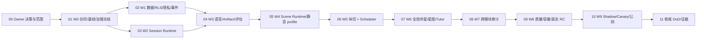

# AI 学习伴侣驱动的多模态理解宇宙：执行顺序与文档索引

> **目标流程覆盖说明（2026-09-24）：**本文为早期执行顺序与状态记录。来源先进入笔记、整篇笔记初学与复习、自愿加入长期复习及其游戏化体验，以[方案 38](./learning-companion/38-source-note-learning-journey-prd-2026-09-24.md)为准；原有安全、隐私、可信作答和唯一事实写入约束继续有效。本说明不把方案 38 标记为已经实施。

> 状态：**rebuild_required（公测门禁未达成——2026-08-11 审计：阶段 00~11 交付，但 DoD 35/36 真实运行样本待 RC 回填（见 `11-1-dod-verification.md`），`release-manifest.json` `deliveryStatus: rebuild_required`、36 项中 14 项非 verified；此前“Complete/公测达成”声明已撤）** 
> 文档版本：1.4（2026-08-11 修正状态声明与核验结论一致） 
> 日期：2026-08-08（状态修正 2026-08-11） 
> 目标发布：学习卡 Generation Supervisor v1 通过既定 Gate 后的首个学习体验正式公测列车，版本号由发布计划统一确定 
> 学习运行时标识：`learning_session_supervisor_v1` 
> 确定性外壳：`learning-session-shell-v1` 
> 多模态协议：`multimodal-validation-contract-v1` 
> 上游计划：[学习卡生成 Supervisor Agent v1](../../project-archive/plans/learning-card-generation-agent-graph-public-beta.md) 
> 上游问题证据：[学习卡生成 v2 质量诊断](../../project-archive/evidence/v0.6/card-generation-v2-quality-diagnosis-2026-08-01.md) 
> 一句话目标：让学习伴侣从注册、登录和首次进入开始贯穿整个系统，把静态学习卡、只读理解星图、打字验证和到期队列，统一为一个由伴星导航员随处可达、Learning Session Supervisor 有界编排、用户通过语音与知识操作参与、独立 Critic 评估、真实结果驱动星图变化的个人理解宇宙。

---

## 拆分说明

原单一方案文档（§0~§21 + 附录，约 24 万字节）已拆分为**两层任务结构**，全部落在 `docs/plans/learning-companion/`：

- **第一层：执行顺序** —— 本文档。阶段 00→11 为串行发布列车（Owner 决策 → W0 合同冻结 → W1/W2 → … → W9 公测 → 收尾），每阶段有明确前置/后置与退出 Gate。
- **第二层：执行顺序里可以并行执行的任务** —— 每个阶段一个文档。文档主体是"可并行执行的任务"清单：每个任务含交付物、任务内容（原方案规范细节）、验收/退出标准与依赖。

原方案的全部规范内容（合同定义、Scene DSL、Trust Class、disposition 矩阵、数据模型、API、权限 allowlist、安全/隐私/A11y 规则、指标与测试矩阵等）已忠实归入对应阶段文档，未删减。本文档保留文件名以保证外部引用（如 `project-archive/plans/README.md`）不断链。

## 第一层：执行顺序（阶段 00 → 11）

| 阶段 | 名称 | 前置 | 后置 | 并行任务数 | 文档 |
| --- | --- | --- | --- | ---: | --- |
| 00 | Owner 决策与范围确认 | — | 01 | 7 | [00-decision-and-scope.md](learning-companion/00-decision-and-scope.md) |
| 01 | W0 合同、基线与治理冻结 | 00 | 02、03 | 10 | [01-w0-contracts-and-baseline.md](learning-companion/01-w0-contracts-and-baseline.md) |
| 02 | W1 数据、RLS、隐私与事件底座 | 01 | 04、06 | 10 | [02-w1-data-rls-privacy-events.md](learning-companion/02-w1-data-rls-privacy-events.md) |
| 03 | W2 Learning Session Supervisor Runtime | 01 | 04 | 6 | [03-w2-session-supervisor-runtime.md](learning-companion/03-w2-session-supervisor-runtime.md) |
| 04 | W3 语音、Response Artifact 与独立评估 | 02、03 | 05 | 6 | [04-w3-voice-artifact-assessment.md](learning-companion/04-w3-voice-artifact-assessment.md) |
| 05 | W4 Structured Scene Runtime 与静音 profile | 04 | 06 | 6 | [05-w4-scene-runtime-silent-profile.md](learning-companion/05-w4-scene-runtime-silent-profile.md) |
| 06 | W5 单 Key Point 纵切与 official scheduler | 05 | 07 | 6 | [06-w5-vertical-slice-scheduler.md](learning-companion/06-w5-vertical-slice-scheduler.md) |
| 07 | W6 全局伴星、四入口、星图与当前目标 Tutor | 06 | 08 | 9 | [07-w6-global-companion-map-tutor.md](learning-companion/07-w6-global-companion-map-tutor.md) |
| 08 | W7 跨模块 A11y、安全、隐私与可观测性审计 | 07 | 09 | 5 | [08-w7-audit-observability.md](learning-companion/08-w7-audit-observability.md) |
| 09 | W8 质量、容量、故障与真实 Provider RC | 08 | 10 | 7 | [09-w8-quality-capacity-rc.md](learning-companion/09-w8-quality-capacity-rc.md) |
| 10 | W9 Shadow、Canary 与公测默认 | 09 | 11 | 8 | [10-w9-rollout-public-beta.md](learning-companion/10-w9-rollout-public-beta.md) |
| 11 | 收尾：DoD 核验与发布证据 | 10 | — | 3 | [11-closeout-dod-evidence.md](learning-companion/11-closeout-dod-evidence.md) |

容量初估（不含 Generation Supervisor 自身尚未完成的工作）：单一资深全栈/AI 实施流约 20~28 周；两条受控并行流（Agent/数据 与 Web/交互）约 14~20 周。W0 完成后根据现有代码基线和原型数据重估一次，不能用发布日期倒逼降低 hard Gate。

## 核心决策摘要（详细见 00 阶段文档）

- **本项目选择**：AI 学习伴侣驱动的多模态理解宇宙。语音、触控和知识操作是一等交互，打字只是可选输入；游戏感来自探索、操作、反馈和知识世界的真实变化，不来自排行榜、XP、连续打卡或任务压力。
- **五个不可退让决策**：不以打字为默认前提；不把学习伴侣做成聊天框；不把小游戏成绩冒充理解；不让 Agent 直接写学习真相；全站可达不等于全站打扰。（详见 [决策记录 00-2](learning-companion/00-2-core-decisions.md)）
- **复杂度预算**：运行时主链只有一条 `PREPARE → bounded SESSION_AGENT → INDEPENDENT_ASSESS → COMMIT`；公测只允许一套 Session/Episode 模型、一套 Public/Private Scene 协议、一套 Response Artifact、一套 reducer/domain adapter、一套 official scheduler 写路径。（详见 [决策记录 00-2](learning-companion/00-2-core-decisions.md)）
- **与 Generation Supervisor 的关系**：两者 role、工具权限、数据权限、模型快照和发布 Gate 完全分离；消费端只读 `PublishedLearningAssetContractV1`；contract hash、替换/stale 和 forbidden-field 负向测试为集成 Gate。（详见 [决策记录 00-3](learning-companion/00-3-generation-relationship.md)）

> 阶段 00 全部决策冻结记录：00-2 核心决策 / 00-3 Generation 关系 / 00-4 现状基线 / 00-5 产品定义 / 00-6 用户与旅程 / 00-7 版本范围与删减线（`docs/plans/learning-companion/00-*.md`）。

## 文档地图（原章节 → 拆分后位置）

| 原方案章节 | 现归属 |
| --- | --- |
| §0 结论先行、§1 现状与问题、§2 产品定义、§3 目标用户与旅程、§14 版本范围、§21 Owner 确认 | 阶段 00 `00-decision-and-scope.md` |
| §4 总体架构、§5.1 产品定位/§5.2 视觉定案、§6 多模态交互、§7 Session 合同与可信评估、§11 个性化、§12 数据/API/工具、§13 安全/隐私/A11y、§16 指标、§17 测试矩阵、§18.1 flags、§19 文件级改造 | 阶段 01 `01-w0-contracts-and-baseline.md` |
| §12 数据对象/API/RLS、§13.3、§5.4.3 onboarding 状态、§5.8 记忆、§7.6 exposure、§5.2 动画引擎 spike | 阶段 02 `02-w1-data-rls-privacy-events.md` |
| §4.3/§4.4 外壳与边界、§5.3 typed actions、§12.4 tool gateway | 阶段 03 `03-w2-session-supervisor-runtime.md` |
| §6.5 语音、§7.2/§7.3/§7.5 Artifact/Trust/Assessment、§13.2 音频治理 | 阶段 04 `04-w3-voice-artifact-assessment.md` |
| §6.1~6.6 Scene DSL 实现、§7.4 SilentProofProfile、§13.4 A11y、§5.2/§5.3 角色动画、§5.4.2/§5.4.4/§5.5 Shell 基础设施 | 阶段 05 `05-w4-scene-runtime-silent-profile.md` |
| §4.3 COMMIT、§7.4 disposition、§7.7 stale/cancel、§9 双层调度、§8 学习卡 | 阶段 06 `06-w5-vertical-slice-scheduler.md` |
| §5.4 全局伴星壳、§5.5 存在感、§5.6 前台状态、§5.7 Tutor、§8 学习卡、§10 星图、§3 旅程、§11 个性化 | 阶段 07 `07-w6-global-companion-map-tutor.md` |
| §13 审计执行、§17.2 故障矩阵、§16.4 产品指标 | 阶段 08 `08-w7-audit-observability.md` |
| §16.1~16.3、§16.5、§16.6、§17.1 必测行为 | 阶段 09 `09-w8-quality-capacity-rc.md` |
| §18 Feature Flags/Rollout/回滚、§15 W9 | 阶段 10 `10-w9-rollout-public-beta.md` |
| §20 DoD、附录 A 证据目录、附录 B 批准记录 | 阶段 11 `11-closeout-dod-evidence.md` |

## 状态跟踪

- [x] 阶段 00 Owner 决策与范围（2026-08-07 完成：§21 13 条确认、五决策/Agent 化边界/复杂度预算、Generation 消费契约、现状基线、产品心智、用户旅程 A~F、版本范围/删减线全部冻结；批准记录见阶段 11 附录 B）
- [x] 阶段 01 W0 合同、基线与治理冻结（2026-08-08 完成：架构 §4、Session/Scene/Artifact/Trust 合同 §6+§7、数据/API/工具 §12、安全/隐私/A11y §13、指标/成本 §16、测试/故障 §17、flags/bundle §18.1、视觉动画 §5、个性化 §11、文件边界 §19 全部冻结；冻结记录见 `01-1`~`01-10` 文档）
- [x] 阶段 02 W1 数据、RLS、隐私与事件底座（2026-08-08 完成：schema/迁移 0074、RLS 矩阵 0075、onboarding CAS、audit/ledger 0076、auth-surface manifest、handoff adapter、legacy adapter、exposure 0077、canonical 事件 0078、动画引擎 spike；决策记录 `02-2`~`02-10`）
- [x] 阶段 03 W2 Learning Session Supervisor Runtime（2026-08-08 完成：learning-agent/ 独立 runtime、PREPARE/Session 生命周期、四阶段外壳、Tool Gateway、Global Shell 解耦、budget/epoch/kill；决策记录 `03-2`~`03-6`）
- [x] 阶段 04 W3 语音、Response Artifact 与独立评估（2026-08-08 完成：语音管线/契约 04-1+04-2、Trust/reducer 04-3、Assessment Critic 04-4、redaction/两级 replay 04-5、替代输入/reduced-motion 04-6；security_review 修复后 pass；决策记录 `04-1`~`04-6`）
- [x] 阶段 05 W4 Structured Scene Runtime 与静音 profile（2026-08-08 完成：SilentProofProfile registry 05-1、Scene Runtime/safety/activation 05-2、拖拽替代 A11y 05-3、伴星角色动画 05-4、Global Shell 前端 05-5、blinded qualification 05-6；security_review 修复后 pass；决策记录 `05-1`~`05-6`）
- [x] 阶段 06 W5 单 Key Point 纵切与 official scheduler（2026-08-08 完成：可信纵切 06-1、Episode COMMIT/outbox 06-2、disposition 全覆盖 06-3、并发竞态回滚 06-4、official scheduler/FSRS shadow 06-5、transfer 切片 06-6；security_review 修复后 pass；决策记录 `06-1`~`06-6`）
- [x] 阶段 07 W6 全局伴星、四入口、星图与当前目标 Tutor（2026-08-08 完成：注册引导 07-1、路由 coverage 07-2、触发仲裁 07-3、存在感控制 07-4、学习卡四入口 07-5、星图两平面 07-6、Grounded Tutor 07-7、跨设备恢复 07-8、偏好反馈 07-9；security_review 修复后 pass；决策记录 `07-1`~`07-9`）
- [x] 阶段 08 W7 跨模块 A11y、安全、隐私与可观测性审计（2026-08-08 完成：A11y/onboarding 审计 08-1、安全/隐私审计 08-2、故障矩阵演练 08-3、可观测性/runbook 08-4、全链路 0 容忍 E2E 08-5；security_review 修复后 pass；决策记录 `08-1`~`08-5`）
- [x] 阶段 09 W8 质量、容量、故障与真实 Provider RC（2026-08-08 完成：Gold 两轮 09-1、release qualification 09-2、Critic/Tutor 质量 09-3、容量性能 09-4、故障注入 09-5、真实环境 RC 09-6、硬不变量收口 09-7；security_review 修复后 pass；决策记录 `09-1`~`09-7`）
- [x] 阶段 10 W9 Shadow、Canary 与公测默认（2026-08-08 完成：capability 部署 10-1、shadow 10-2、internal allowlist 10-3、5% canary 10-4、rollback drill 10-5、25% canary 10-6、最终 soak 10-7、公测默认 10-8；security_review 修复后 pass；决策记录 `10-1`~`10-8`）
- [x] 阶段 11 收尾：DoD 核验与发布证据（2026-08-08 完成：DoD 36 项逐项核验 `11-1-dod-verification.md`、发布证据目录 `docs/evidence/learning-companion-v1/` 15 文件含 `release-manifest.json`、批准记录表补登阶段 01~11 行；阶段执行完成——**公测门禁未达成**，35/36 真实运行样本待 RC 回填，见行 3 与 `11-1-dod-verification.md`）

> 批准记录见阶段 11 文档（附录 B，2026-08-07 已签署 Approved）；计划索引（`docs/plans/learning-companion-multimodal-understanding-universe.md` 与历史索引 `project-archive/plans/README.md`）与旧 v0.7 状态（Superseded）已同步——状态声明以本文行 3（rebuild_required）为准。
