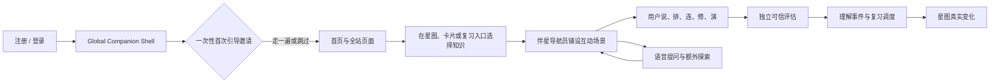

# 决策记录 00-2：产品核心决策冻结（§0）

> 状态：**Frozen（已冻结）**
> 批准人：Repository Owner（阶段 00 执行指令）
> 日期：2026-08-04
> 来源：`00-decision-and-scope.md` 任务 00-2（原方案 §0）
> 约束级别：本文件内容为后续全部阶段的硬约束，任何阶段不得引入第二套真相或第二条写路径。

---

## 1. 交付物

五个不可退让决策、Agent 化边界、复杂度预算写入本目录索引，作为**全部后续阶段的硬约束**。

## 2. 核心循环（唯一需要用户理解的心智）

## 3. 五个不可退让的产品决策（原文 §0，逐条原文）

1. **不以打字为默认前提**：完整主路径必须可经语音不使用键盘完成；语音关闭时保留文字 canonical 路径，并在目标通过资格检查时提供同样零打字的 structured proof。不能虚假承诺"拒绝语音且拒绝一切生成式输入"仍适用于每类知识。
2. **不把学习伴侣做成聊天框**：伴侣的主要语言是指向、移动、铺路、摆放、连接、朗读、显影和退场；自然语言只是其能力之一。
3. **不把小游戏成绩冒充理解**：每种互动只推进它实际证明的能力切面；识别型点击、提示后完成和纯浏览只能是练习。
4. **不让 Agent 直接写学习真相**：Agent 负责理解用户意图、编排路线、生成场景、追问和解释；正式 outcome、掌握投影、复习调度和共享图关系由独立评估与确定性内核决定。
5. **全站可达不等于全站打扰**：同一个伴星从注册、登录、首次引导到所有可路由页面持续可见或可召唤，但只读取页面显式提供的净化上下文；普通浏览时安静收起，用户隐藏或关闭后不再邀请、发声或调用后台 Companion 能力。

## 4. Agent 化边界

### 4.1 Agent 化（需要知识理解和策略判断）

- 本轮知识目标选择。
- 路线组织。
- 互动模态选择。
- rubric 缺口后的下一步。
- 额外问题回答。
- 会话在星图中的呈现。

### 4.2 不 Agent 化（不能容忍概率错误的学习内核）

- active Card/Key Point/Evidence 资格。
- workspace/user 权限、RLS、隐私和工具 allowlist。
- rubric、evidence allowlist、fingerprint、content exposure key、assistance snapshot。
- Response Artifact 锁定/hash/幂等/cancel/stale。
- verdict 结构检查和 deterministic reducer。
- mastery policy、official scheduler、星图正式投影。
- semantic relation 审核发布（Should）。
- 原子事务/重放/审计/导出/删除。
- 注册/登录与 credential 页面帮助、首次引导步骤、页面锚点、触发优先级和允许动作（由 versioned manifest 与确定性状态机驱动）。

## 5. 落地形态（原文完整）

`Typed Agent Graph（阶段、状态、权限与恢复）` = bounded LoopAgent node（路线与 Scene 编排）+ specialist Agents（Tutor、Rubric/Scene Critic、Assessment Critic）+ deterministic core（资格、事务、事实、调度、投影）。保留旧能力只有已验证的 canonical 事实、调度不变量、安全边界和回滚读取路径，不保留旧多 stage 编排主链。

## 6. 复杂度预算（§0.5，原文完整）

运行时主链只有一条 `PREPARE → bounded SESSION_AGENT → INDEPENDENT_ASSESS → COMMIT`。公测只允许一套 Session/Episode 模型、一套 Public/Private Scene 协议、一套 Response Artifact、一套 reducer/domain adapter、一套 official scheduler 写路径；新增玩法原则上只新增 versioned Scene schema、deterministic scorer 和 Gold fixture。若某项扩展必须新增第二套掌握真相/第二个 schedule writer/另一种提交事务/无限 Loop 才能成立，默认拒绝或重新设计。Global Companion Shell 是一层确定性分发与呈现壳，不是第二条 Learning pipeline。

## 7. 验收标准

1. 以上边界被本目录**全部后续阶段文档**引用为约束。
2. 任何阶段不得引入**第二套真相**或**第二条写路径**。
