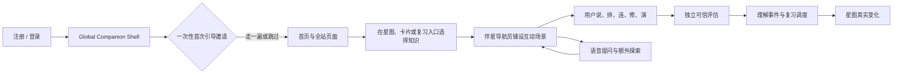

# 阶段 00：Owner 决策与范围确认

> **目标流程覆盖说明（2026-09-24）：**本文件记录早期方案的决策与实施依据。今后来源进入笔记、按整篇笔记初学与复习、长期复习、学习卡角色和游戏化体验的产品裁决，以[方案 38](./38-source-note-learning-journey-prd-2026-09-24.md)为准；可信作答、用户自愿、伴星权限和唯一学习事实写入边界继续有效。

> **第一层执行顺序第 0 步（串行入口）**
> 前置：无（本计划批准前的方向决策 Gate）
> 后置：阶段 01（W0 合同、基线与治理冻结）
> 本文件 = 本阶段下的**第二层：可并行执行的任务**清单。
> 上游方案：[AI 学习伴侣驱动的多模态理解宇宙：最终产品与实施方案](../learning-companion-multimodal-understanding-universe.md)
> 上游计划：[学习卡生成 Supervisor Agent v1](../../../project-archive/plans/learning-card-generation-agent-graph-public-beta.md)（与生成计划并行，互不阻塞）

---

## 本阶段目标

在进入任何实施前，让 Repository Owner 一次性确认产品方向、范围边界与对旧 v0.7 方案的替代关系。本阶段只产出**决策**，不产出代码；任何任务未通过，不进入 W0。

## 可并行执行的任务（第二层）

### 任务 00-1：Owner 一次性方向确认（§21）

**交付物**：Owner 对 §21 全部 13 条一次性确认的签署记录（写入 `11-closeout-dod-evidence.md` 的批准记录与计划索引 `learning-companion-multimodal-understanding-universe.md` 状态跟踪；历史索引 `project-archive/plans/README.md` 同步更新）。

**任务内容（原文 §21）**：

1. 产品正式采用"AI 学习伴侣驱动的多模态理解宇宙"，不再以 XP/streak 为游戏化主线。
2. 同一伴星从注册/登录开始覆盖 public-auth 与 authenticated app shell 的全部可路由页面；首次引导使用隔离 sample、可一步跳过/CAS 恢复/manual replay，Global Shell 不读取凭据或 DOM、不依赖 learning core，context-off/hidden/off 后遵守对应零监听/零调用边界。
3. 用户只需理解星图、伴星、航程、工作台；卡片只有一个航程主行动，不把内部 Scene/route 枚举做成玩法菜单。
4. 打字从默认输入降为可选；voice 是零打字 canonical 主路径，text 是 universal fallback，silent mastery 只对通过 eligibility + Gold 的目标开放并如实披露覆盖率。
5. 前台采用空间化伴星与有界 current-target Tutor，不采用独立聊天框、无限消息流或自动续题；Owner 接受 current-target Tutor 进入关键路径并阻塞最终公测，workspace/扩展层不阻塞。
6. `LearningSession` 是用户航程容器，单 Key Point `LearningEpisode` 才是 formal 事务和 schedule 单元。
7. Learning Supervisor 与 Generation Supervisor 独立；双 Critic + deterministic core 拥有可信激活、评估和业务提交权，Agent 无 canonical write 权限。
8. 正式结果沿用现有 validation/review/understanding canonical facts；不新建第二套学习真相。
9. 星图公测采用共享知识/个人学习两个数据平面和确定性血缘；semantic relation、关系理解、持久问题与跨工作区 Tutor 全部为非阻塞 Should。
10. Card/Review/Now/Star 共用内核但按 origin 就地完成，不强制跳回星图。
11. official scheduler 保持唯一权威；FSRS shadow 在正式转正前不得影响候选、排序、理由或文案。
12. 批准范围（§14）、硬指标（§16）、成本和回滚 DoD（§20），不因 RC 结果降低可信阈值。
13. 本文批准后，旧 v0.7 游戏化掌握旅程进入 Superseded，并同步更新计划索引与治理记录。

**验收**：13 条全部确认；确认后不再重开"是否全站可达/是否做前台伴侣/是否支持无打字主路径"方向讨论。

---

### 任务 00-2：产品核心决策冻结（§0）

**交付物**：五个不可退让决策、Agent 化边界、复杂度预算写入本目录索引，作为全部后续阶段的硬约束。

**任务内容（原文 §0）**：

核心循环（唯一需要用户理解的心智）：



五个不可退让的产品决策：

1. **不以打字为默认前提**：完整主路径必须可经语音不使用键盘完成；语音关闭时保留文字 canonical 路径，并在目标通过资格检查时提供同样零打字的 structured proof。不能虚假承诺"拒绝语音且拒绝一切生成式输入"仍适用于每类知识。
2. **不把学习伴侣做成聊天框**：伴侣的主要语言是指向、移动、铺路、摆放、连接、朗读、显影和退场；自然语言只是其能力之一。
3. **不把小游戏成绩冒充理解**：每种互动只推进它实际证明的能力切面；识别型点击、提示后完成和纯浏览只能是练习。
4. **不让 Agent 直接写学习真相**：Agent 负责理解用户意图、编排路线、生成场景、追问和解释；正式 outcome、掌握投影、复习调度和共享图关系由独立评估与确定性内核决定。
5. **全站可达不等于全站打扰**：同一个伴星从注册、登录、首次引导到所有可路由页面持续可见或可召唤，但只读取页面显式提供的净化上下文；普通浏览时安静收起，用户隐藏或关闭后不再邀请、发声或调用后台 Companion 能力。

**Agent 化边界**：

- Agent 化（需要知识理解和策略判断）：本轮知识目标选择、路线组织、互动模态选择、rubric 缺口后的下一步、额外问题回答、会话在星图中的呈现。
- 不 Agent 化（不能容忍概率错误的学习内核）：active Card/Key Point/Evidence 资格；workspace/user 权限、RLS、隐私和工具 allowlist；rubric、evidence allowlist、fingerprint、content exposure key、assistance snapshot；Response Artifact 锁定/hash/幂等/cancel/stale；verdict 结构检查和 deterministic reducer；mastery policy、official scheduler、星图正式投影；semantic relation 审核发布（Should）；原子事务/重放/审计/导出/删除；注册/登录与 credential 页面帮助、首次引导步骤、页面锚点、触发优先级和允许动作（由 versioned manifest 与确定性状态机驱动）。

落地形态：`Typed Agent Graph（阶段、状态、权限与恢复）` = bounded LoopAgent node（路线与 Scene 编排）+ specialist Agents（Tutor、Rubric/Scene Critic、Assessment Critic）+ deterministic core（资格、事务、事实、调度、投影）。保留旧能力只有已验证的 canonical 事实、调度不变量、安全边界和回滚读取路径，不保留旧多 stage 编排主链。

**复杂度预算（§0.5）**：运行时主链只有一条 `PREPARE → bounded SESSION_AGENT → INDEPENDENT_ASSESS → COMMIT`。公测只允许一套 Session/Episode 模型、一套 Public/Private Scene 协议、一套 Response Artifact、一套 reducer/domain adapter、一套 official scheduler 写路径；新增玩法原则上只新增 versioned Scene schema、deterministic scorer 和 Gold fixture。若某项扩展必须新增第二套掌握真相/第二个 schedule writer/另一种提交事务/无限 Loop 才能成立，默认拒绝或重新设计。Global Companion Shell 是一层确定性分发与呈现壳，不是第二条 Learning pipeline。

**验收**：以上边界被本目录全部后续阶段文档引用为约束；任何阶段不得引入第二套真相或第二条写路径。

---

### 任务 00-3：与 Generation Supervisor 的发布关系确认（§0.3）

**交付物**：`PublishedLearningAssetContractV1` 作为消费边界的冻结声明。

**任务内容（原文 §0.3）**：

- Generation Supervisor 负责"什么知识值得成为可信学习资产"；本计划负责"用户如何与这些资产互动并证明理解"。
- 两者可复用通用 Agent Runtime 的 session/turn/tool event/budget/checkpoint/lease/native-tool 能力，但 role、工具权限、数据权限、模型快照和发布 Gate 完全分离。
- Learning Session Supervisor 只能读取已确定性 Publish 的 canonical Card/Key Point/Evidence，不得读取 generation draft、Candidate Ledger 私有 staging 或未过 Critic 产物。
- Generation Supervisor 不得读取个人回答、音频、理解状态、问题标记或复习表现，也不得为单个用户改写共享卡片。
- W0 合同工作可与 Generation Supervisor 后期 Gate 受控并行；消费端集成以其 published output contract 稳定为前置，不反向阻塞生成主链公测 Gate。

```ts
type PublishedLearningAssetContractV1 = {
  contractVersion: "published-learning-asset-v1";
  cardId: string;
  cardRevision: number;
  keyPointId: string;
  claim: string;
  exactEvidenceRefs: string[];
  semanticSupportReportId: string;
  semanticSupportReportHash: string;
  sourceFingerprint: string;
  lifecycle: "active" | "superseded";
  cognitiveType?: string;
  interactionAffordances?: string[];
};
```

- required 是 Card、Key Point、claim、exact evidence、semantic support、source fingerprint 和 active/superseded 生命周期；`cognitiveType` 与 interaction affordance 只是 optional hint；
- Candidate Ledger、relation hints、private draft 和未 Publish 产物一律 forbidden；optional 字段缺失时只使用通过 Gold 的安全 Scene fallback；
- active Card Set 被替换或 source fingerprint 改变时，所有未提交 Episode stale；历史结果保留原版本引用；
- contract hash、替换/stale 和 forbidden-field 负向测试是 Generation → Learning 集成 Gate。

**验收**：集成 Gate 定义写入 W0（阶段 01）冻结清单；W1 实现 handoff adapter。

---

### 任务 00-4：现状基线确认（§1）

**交付物**：当前实现事实与缺口清单（供 W0 基线与 W8 对比）。

**任务内容（原文 §1.1/1.2）**：

| 领域 | 当前事实 | 核心缺口 |
| --- | --- | --- |
| 学习卡生成 | Generation Supervisor 方案将输出 canonical candidate、exact evidence、semantic support、semantic grouping 和 relation hints | 生成结果尚未被设计成可操作的学习对象，消费端仍主要展示文字 |
| 验证题型 | 现有契约主要是 `explain / example / apply`，前台以自由文本回答为主 | 默认要求打字，未覆盖语音、结构重建、关系连接和多步情境 |
| Rubric 评估 | rubric 持久化 expected concept 与 evidence，但当前评估 Provider 输入只含 criterion/weight/required | 尚未形成"用户回答片段—冻结 rubric target—canonical evidence"的逐项语义复核 |
| 复习 | 到期项按 `nextReviewAt` 升序进入队列，具备可信 attempt、assistance 和调度事实 | 产品形态仍像必须清理的任务队列，缺少按用户意图组织的有界路线 |
| 理解星图 | Canvas 已有缩放、平移、聚类、LOD、选择和详情；服务端只有 `source → note → card → key_point` 外键血缘 | 只能看，尚未成为学习入口，也不能展示个人学习事实的真实闭环 |
| 前台 AI | AI 主要在生成、评估等后台工作；注册、登录、首次进入和普通页面没有统一助手壳 | 用户没有一个从进入系统起就可找到、并能在文章、卡片、星图、历史和错误状态间连续工作的前台学习伴侣 |
| 游戏化 | 旧 v0.7 以 XP、streak、每日关卡、成就和 combo 为主 | 与"自愿、非强迫、按个人偏好学习"的产品价值冲突 |

不改的后果（§1.2）：不喜欢打字的用户无法完成核心验证；新用户无法建立"材料—卡片—航程—星图"心智；纯选择题不能可靠证明理解；传统问答套动画无游戏感；另加聊天框无差异化；伴侣既辅导又判卷会泄题/标准漂移/assistance 污染；Agent 直接点亮星图会失去可信边界；把生成关系全画进图会变成幻觉关系网。

**验收**：Owner 确认缺口清单与现状一致。

---

### 任务 00-5：产品定义与统一心智冻结（§2）

**交付物**：四个产品对象、统一核心循环、十一条产品原则、非目标清单。

**任务内容（原文 §2）**：

用户只需理解四个对象：

| 产品对象 | 用户心智 | 系统职责 |
| --- | --- | --- |
| 理解星图 | 我的知识世界现在是什么样 | 展示共享知识和个人理解，选择目的地 |
| 伴星导航员 | 从进入系统起就能找到、和我一起走的学习伙伴 | 提供首次引导和页面帮助；进入学习目标后呈现路线、场景、语音和可选动作 |
| 学习航程 | 我这次想弄清的一小段内容 | 有目标、有预算、有终点的 Learning Session |
| 共学工作台 | 我真正动手或开口的地方 | 承载说、排、连、修、演等 Encounter |

统一核心循环：选目标 → 沿用显式偏好（可选补充时间/输入限制）→ Supervisor 默认只提议一条路线并提供"换一个" → 伴星把路线呈现为语音与可操作场景 → 用户通过说/排/连/修/演产生 Response Artifact → 独立 Critic 按冻结 rubric 与证据逐项评估 → 确定性内核写理解事件并运行 official scheduler → 来源页面就地展示真实变化，可选"在星图中查看" → 明确结束，是否继续由用户主动决定。

十一条产品原则（原文 §2.3）：自主性优先；少说话多行动；无打字是完整主路径；语音不是唯一入口；游戏感来自内在反馈；理解变化必须有证据；一轮有终点；推荐可解释可拒绝；个人偏好不是人格标签；失败不是身份；处处可达按需介入。

明确非目标（原文 §2.4）：排行榜/好友比较/公开掌握状态/学习时长竞赛；XP/金币/等级/宝箱/抽卡/随机奖励/体力/内容锁；streak/断签惩罚/红色逾期债务/固定每日目标；用完成速度/口语流利度/点击量/自信度/情绪判断理解；右下角通用聊天机器人或无限陪聊；Agent 生成任意 HTML/JS 前台执行；前台伴侣在 trusted 作答前访问隐藏答案/rubric/evidence；模型自动确认概念关系/修改共享图真值/正式调度；强制所有知识点用同一种小游戏；用参与度/DAU/留存替代真实学习效果证明；公测首版 VR/AR、实时多人协作、社交路线或开放式 Agent 自主联网。

**验收**：产品心智与原则冻结，后续 W1~W9 的实现不得违背非目标清单。

---

### 任务 00-6：目标用户与关键旅程确认（§3）

**交付物**：目标用户画像 + 前置旅程 + 旅程 A~F 作为验收场景库（W6/W7/W8 复用）。

**任务内容（原文 §3）**：

目标用户：低打字意愿用户、好奇型阅读者、复习型用户、严肃学习者、无障碍用户。

前置旅程（注册 → 第一次独立使用）：注册/登录页静态伴星说明产品用途 → 首次进入只发一次欢迎（"要不要用大约 3 分钟和我走一遍？"）→ 三个同级动作"带我走一遍 / 我自己看看 / 先调整方式"，每步可返回/暂停/跳过 → "带我走一遍"进入物理隔离的 `onboarding_sample:*` 沙盒（示例材料 → 示例学习卡 → 极短操作 → 星图演示预览），固定标记 `onboarding_sample / practice_only`，不写 mastery/assessment/exposure/scheduler，演示结束即还原 → 自己的材料先结束 onboarding 再走正常导入/生成 → 结束后提供"从我的内容开始 / 去星图看看 / 结束引导"，不自动开始正式航程 → 完成后不再自动邀请或重放，可手动重开。老用户首次获得全局伴星只得到一个被动、非阻塞的短介绍。

旅程 A~F：A 第一次遇见一颗新星（轻邀请一次 → 选择语音/静音/稍后 → Encounter → 返回原星图视口 → 只有真实验证过的切面变化）；B 完全不打字的稳固航程（10 分钟静音 + `structuredProofEligibility` → 预冻结 structured-proof bundle 两个互补无即时反馈 Encounter → 不显示正确答案不自动吸附 → 覆盖全部 required rubric 且过 Gold 等价 Gate 才归一 canonical review outcome → 明确结束）；C 语音 Teach-back（按住说 20~60 秒 → ASR 逐字 transcript → 确认/重录/切模态 → Agent 不润色 → Critic 引用 transcript 片段与 canonical evidence 逐项评估 → 关键内容不确定则 not_assessable，无损重试不判为不会）；D 边学边问（trusted challenge 中提问先询问切到一起学习 → 原子记录 assistance/practice 后调 Grounded Tutor → 有界 detour → 固定返回原航程或结束；问题标记 Should flag 开启才持久保存）；E 从误区到修补（结果页不显示"失败"，指出尚未说清部分 → 仅在结果页存在的问题建议，Should 开启且用户确认才保存 → 可立即进入引导式练习但 assistance 后不制造"已掌握" → 冷却后再独立验证）；F 长时间离开后回来（不展示"欠了 87 项" → 询问 3/10/20 分钟 → 用 official scheduler 优先级+canonical outcome+兴趣提议一条短恢复路线 → 可缩短/换一条/自由漫游/关闭 → 未处理 schedule 保留事实但不被道德化为债务）。

**验收**：旅程 A~F 被 W6（实现）、W7（E2E）、W8（RC）引用为验收场景。

---

### 任务 00-7：版本范围与删减线冻结（§14）

**交付物**：Must / Should / Could / 删减线清单（W0 冻结输入的组成部分）。

**任务内容（原文 §14）**：

Must（正式公测的最小完整闭环）：`LearningSession` 编排容器、单 Key Point `LearningEpisode` canonical 单元和四阶段确定性外壳；`PublicSceneContract / PrivateSceneSolution / PrivateLearningEpisodeContract` 物理分离、formal probes 首次回答前全部冻结；Response Artifact、服务端 effective Trust Class、Rubric/Scene Critic、独立 Assessment Critic、deterministic reducer/commit；`Global Companion Shell` 从注册/登录覆盖全部可路由页面（coverage registry、credential-safe 静态 manifest、`CompanionTriggerContextV1/PageCompanionContextV1` 最小化升级、页面 action token、`CompanionTriggerRuleV1`、双预算、origin 恢复、静态 fallback）；versioned 首次使用引导（开始/返回/暂停/跳过/CAS 恢复/manual replay；隔离 `onboarding_sample:*` 且 `publishedTargetEligibility=false`；own-content 先退出 sandbox）；伴星学习会话层 typed actions + quiet/moderate/active + 页面静音/专注/暂停建议 + device-local temporary hidden + account-scoped global off；统一拟人化动画基础角色、`CompanionVisualStateV1`、typed-action 动画映射、`assessment_handoff`、静态与 reduced-motion fallback；语音 Teach-back（TTS/ASR/用户确认/not-assessable/隐私闭环）；universal `text_or_mixed` canonical fallback；versioned `SilentProofProfile` registry + eligibility matrix + 跨模态 Gold 验证的 `structured-proof-v1`（合格目标至少两个互补预冻结无中途反馈 Scene 完整覆盖 required rubric 获得同级 canonical outcome 资格）；Structured Scene DSL、deterministic safety、A11y 等价操作、禁止任意生成 UI；Formal/Practice/Diagnostic/Not-assessable 数据和视觉彻底分离；`stabilize/clarify` 完整闭环、单 Key Point `transfer` 最小切片、practice-only explore；学习卡一个主行动；Card/复习/"此刻"/星图进入同一 Session/Episode 内核并按 origin 就地完成；Grounded Tutor 仅当前 target evidence-grounded 有界 detour、始终 practice-only；星图两个数据平面、确定性血缘、Card/Key Point 行动入口、真实结果回写；key-point 能力切面与时间耐久分离；official scheduler 唯一写入权（FSRS 可 shadow 不阻塞）；显式输入/反馈/伴星/A11y 偏好；account-scoped onboarding/global off/presence/suppression 跨设备一致、workspace 邀请/任务状态不越界、device-local hidden 不泄露身份；非强迫恢复、明确结束、无自动续题；RLS、assistance、stale、幂等、取消、恢复、导出、删除和回滚；真 Provider、ASR、数据库和浏览器 Gate。

Should：故障定位与修复、反例构造；问题标记手工保存/归档/解决/路线 origin（Agent 只能提议）；Grounded Tutor 的 workspace evidence 检索与标注扩展说明；Relationship Governance、published semantic relation、关系透镜、个人关系理解、跨 Card/Note challenge；航程回放和个人学习变化时间轴；更丰富的代码/公式/图表/参数沙盘；显式偏好建议和单主题/交错复习；本地或端侧 ASR 可行性；达独立 Gate 后 feature-flagged FSRS 正式接管。

Could：伴星配色/服饰/声音/轻量动作个性化；用户自建和收藏路线；手写/图形化/摄像头实物演示；经授权 Web 检索与引用；可分享不比较成绩的路线模板；更丰富环境音和主题（默认关闭）。

删减线（容量不足时依次裁剪，1→7）：伴星外观个性化/环境音/非状态必需复杂动画 → 航程回放和学习时间轴 → 反例构造/复杂代码/公式场景 → 问题标记和 Relationship Governance 整体保持 Should → 跨 Note 迁移只保留单 Key Point transfer 切片 → Grounded Tutor workspace/扩展层只保留当前 target → 超出 eligibility coverage 的丰富 Scene 类型（最小 SilentProofProfile registry 只有仍满足冻结覆盖门槛才能缩减）。

**不可裁剪**：Global Companion Shell、可跳过且零学习副作用的首次引导、全部可路由页面 coverage registry 与净化 context/action manifest、credential 零读取、关闭后零监听/调用、Episode 事务单位、public/private contract 分离、Formal/Practice 分离、Response Artifact、双 Critic、deterministic commit、语音确认/隐私、universal text fallback、eligible silent canonical profile、assistance/stale、official scheduler、星图真实回写、origin-aware completion、当前 target Tutor、统一拟人化基础角色及必要状态动画、明确结束、非强迫规则和全部安全/RLS Gate。若这些无法完成，应推迟版本而不是降低可信性。

**验收**：Must/Should/Could 与删减线冻结；Should 不进入公测关键路径。

---

## 阶段退出 Gate（00）

- [x] §21 的 13 条 Owner 确认全部签署（任务 00-1，2026-08-07，批准记录见阶段 11 附录 B）。
- [x] 五个不可退让决策、Agent 化边界、复杂度预算记录在案（任务 00-2，见 `00-2-core-decisions.md`）。
- [x] `PublishedLearningAssetContractV1` 消费边界声明（任务 00-3，见 `00-3-generation-relationship.md`）。
- [x] 现状缺口、产品心智、旅程、版本范围确认（任务 00-4 ~ 00-7，见 `00-4-current-baseline.md`、`00-5-product-definition.md`、`00-6-users-journeys.md`、`00-7-scope-trimline.md`）。

全部通过后进入阶段 01（W0 合同、基线与治理冻结）。
