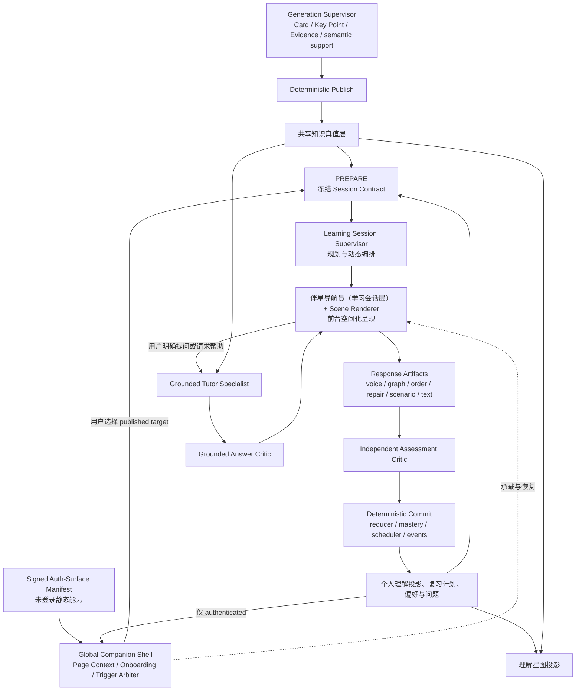
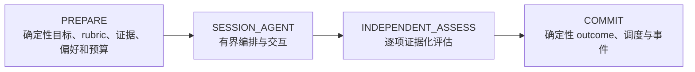

# 冻结记录 01-1：总体 Agent 与系统架构（§4）

> 状态：**Frozen（已冻结）**
> 批准人：Repository Owner（阶段 01 W0 执行）
> 日期：2026-08-07
> 来源：`01-w0-contracts-and-baseline.md` 任务 01-1（原方案 §4）
> 约束级别：架构与边界冻结；W2（阶段 03）实现以此为唯一语义。

**交付物**：架构图、组件职责矩阵、四阶段外壳、Agent Loop 硬边界（写入本目录 README 的架构引用）。

---

## 1. 上下游架构



## 2. 事务层级

- `LearningSession` 是**用户可见航程容器**（串联 1~5 个 Episode，无 route-level mastery 或总体 schedule 副作用）。
- `LearningEpisode` 是 **canonical 单元**（公测 v1 恰好绑定一个 `keyPointId` 和一个非空 typed `OfficialSchedulingDecisionV1`；`consume_pending` 绑定精确 `inputScheduleId + generation + policyEpoch`）。
- 四阶段外壳对每个 Episode **独立执行**；已 commit Episode 不因后续 Episode stale/失败/取消而回滚。
- **exactly-once 键落到 Episode target commit**。

**多 Episode 必须经过用户 checkpoint，不能自动续题**：

1. 本 Episode 真实结果 → 结束并返回来源（默认）；
2. 用户确认"继续下一站"；
3. 换一个或缩短剩余路线。

只有用户命令 `confirm_continue_session` 才能 PREPARE 下一 Episode；**无倒计时默认选择**。

## 3. 组件职责矩阵

| 组件 | 职责 | 禁止项 |
| --- | --- | --- |
| Generation Supervisor | 生成可信资产 | 禁止读个人学习数据、判掌握 |
| Global Companion Shell | 承载统一伴星身份、首次引导、净化页面上下文、触发仲裁、origin 恢复 | 禁止读 DOM/截图/凭据、绕过权限、把 onboarding 当学习事实、credential 页调用个性化模型 |
| Learning Session Supervisor | 选路线/场景/probe/有界追问 | 禁止改卡片真值、直接给 outcome、写 schedule |
| Scene Author | 读 published claim/evidence 与 private Rubric staging 提 Scene 草案 | 禁止激活/展示 Scene、跨 target 检索、读用户回答、签发 trust |
| 伴星导航员 | 呈现 typed actions、接收语音/触控/键盘选择 | 禁止自由规划、提前读答案、自己宣布学会 |
| Grounded Tutor | 证据化解释/回答额外问题/生成练习 | 禁止正式 assessment、发布语义关系、直接写卡片 |
| Grounded Answer Critic | 逐段检查来源权限/support mode/实质支撑 | 禁止参与 formal 评分、扩检索、写学习事实 |
| Rubric/Scene Critic | 展示前检查 rubric 支撑、public/secret 分离、泄漏、可评估性、唯一解/区分度、A11y | 禁止辅导、写 outcome |
| Scene Activation Service | 确定性校验后 exactly-once 激活 | 禁止生成/修复内容、跳过 Critic、改 trust ceiling |
| Independent Assessment Critic | 逐项判定 | 禁止出题、辅导、输出 mastery/interval |
| Deterministic Core | eligibility/assistance/stale/reducer/mastery/scheduler/commit | 禁止开放式语义生成 |
| Projection Service | 事件重放投影 | 禁止把 Agent confidence 当掌握事实 |

## 4. 四阶段确定性外壳



### PREPARE

- 解析用户选择的 Key Point/临时问题上下文/复习入口。
- 从 official scheduler、needs-repair 状态和 active canonical 内容生成合法 Episode 候选。
- 冻结 formal eligibility、typed scheduling decision、Episode/content exposure 身份、用户偏好、assistance snapshot、BudgetEnvelope、capability/runtime epoch 和 policy versions。
- 只读 `PublishedLearningAssetContractV1` required canonical 字段（optional 缺失进入已验证安全 Scene fallback，不允许 Agent 自由猜 UI）。
- 不把含答案的评分合同返回客户端。

### SESSION_AGENT

- 默认提议一条路线，"换一个"才生成备选。
- 首个 formal probe 展示前执行不向用户展示的 `RUBRIC_AND_SCENE_PREPARE` 子流程（RubricTarget → Scene Author 草案 → deterministic schema/safety → 独立 Rubric/Scene Critic → 确定性激活 immutable private/public contracts）。
- 每个 RubricTarget 冻结 criterion、server-only expected target/hash、weight、required、facet、target、逐项 evidence refs、semantic-support report。
- 公测 v1 同一 formal Episode 在首次回答前冻结全部 trusted probes 和分支，Supervisor 只能请求 `requestedTrustClass` 不能签发 effective trust。
- trusted 阶段不读内容性 gap 动态出题，只接收 `continue/stop/not_assessable/switch_modality` 等无答案控制信号。
- 内容性 assessment gap 只在正式答案锁定并完成 Independent Assess 后供结果解释或 practice 使用。
- practice 阶段可自适应追问但 artifact 全为 practice-only。
- 不进入无限聊天、不新增评分目标、不替用户完成答案。

### INDEPENDENT_ASSESS

- 独立 Agent Session、system policy 和模型快照。
- 不继承 Supervisor 自由文本判断。
- 读完整锁定 artifact、冻结 rubric target 和 canonical evidence。
- 每个 verdict 绑定 Response Artifact、真实 answer excerpt 或 interaction refs、evidence refs。
- 不返回 overall mastery、复习间隔或共享图关系真值。

### COMMIT

- 重新验证 content/episode fingerprint、全部 frozen probe hash、scheduling decision、budget/capability/epoch fence、cancel、assistance 和 artifact hash。
- 服务端签发 `EpisodeTrustDecision`，运行 `rubric-session-reducer-v2` 与 `facet-to-mastery-policy-v1`，由 contract 冻结版本互斥纯函数推导唯一 `EpisodeCommitDisposition`。
- 只有 `canonical_mastery/canonical_unable` 写 overall validation/review outcome；facet/practice/diagnostic/operational 用各自唯一落点，不能伪装成 review attempt。
- 正式结果优先落入现有 canonical facts 并通过 outbox 派生 projection。
- 一个 Episode 失败或 stale 不回滚已成功 Episode，cancel 后已 commit 保留。
- 重试/断线/Worker crash 不得重复 result 或 schedule 副作用。

## 5. COMMIT 固定锁序与单事务 CAS 规则

最终 COMMIT 必须在一个数据库事务内按**固定顺序锁**：

```
runtime-control → learning_episode → authoritative target/version guard → keyPoint schedule guard → input schedule（consume 时）
```

**单次 CAS 同时验证**：

- `runtimeEpoch=snapshot`
- `episodeEpoch` 未变
- Episode=`active && !cancelled && !stale`
- current content revision/fingerprint 匹配
- scheduling decision hash 匹配
- kill=false

`create_initial` 还验证不存在 active pending；`consume_pending` 验证精确 generation 仍 active。任一失败整体回滚为 stale/cancelled/blocked。

**cancel、显式 stale 和 Generation publish/active Card Set 替换也必须经过相同 guard**，不能在 COMMIT 检查与写入之间穿透。

## 6. Agent Loop 硬边界（初始建议值，W0 用真实 Provider 冻结）

| 维度 | 建议上限 |
| --- | ---: |
| 每个 Session Supervisor turns | 8 |
| trusted 内容性动态 follow-up | 0（公测 v1；全部 formal probe 预冻结） |
| 每条路线 Encounter | 2～5 |
| 同时 active 学习会话 | 每用户 1 |
| Grounded Tutor 单问题补查 | 3 次工具调用 |
| 单次 Agent turn deadline | 由 Provider/ASR policy 冻结，建议 ≤120 秒 |
| Session inactivity expiry | 建议 30 分钟；只结束 active UI，不回滚已 commit Episode |
| Pause TTL | W0 冻结；恢复时必须重查 source/policy/assistance stale |

## 7. 上下文记忆来源

上下文记忆来自数据库里的 contract、probe、artifact、assessment、偏好和事件摘要，**不来自无限增长的聊天 messages**。

## 8. 验收标准

架构与边界冻结；W2（阶段 03）实现以此为唯一语义。
