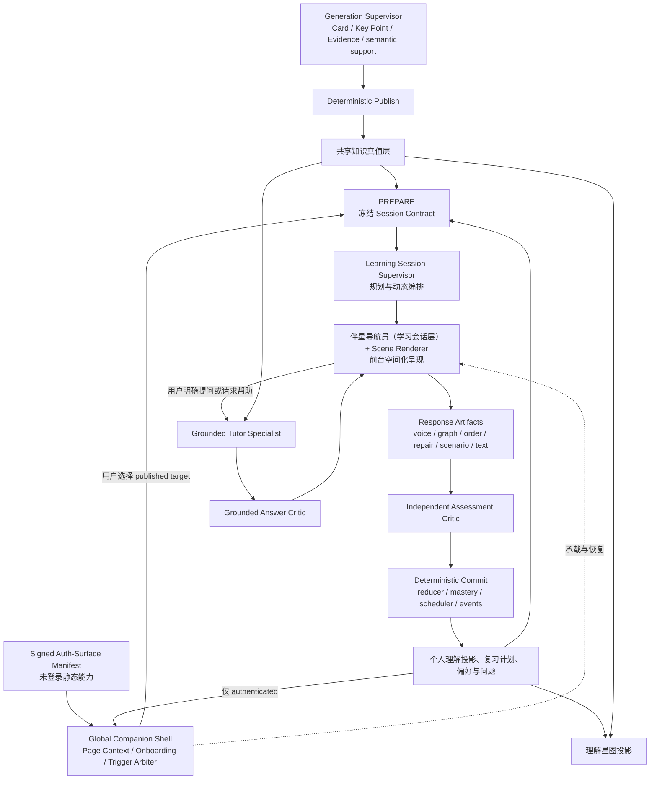
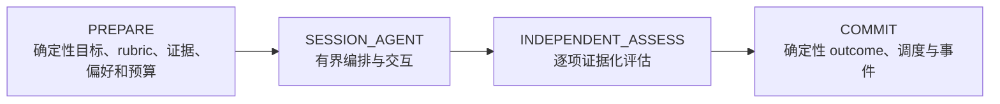

# 阶段 01（W0）：合同、基线与治理冻结

> **第一层执行顺序第 1 步**
> 前置：阶段 00（Owner 决策与范围确认）
> 后置：阶段 02（W1）与阶段 03（W2）可并行开始
> 本文件 = 本阶段下的**第二层：可并行执行的任务**清单。
> 对应原方案 §15「W0」；本阶段全部任务为**冻结/基线**工作，不写实施代码。

---

## 本阶段目标

批准方案、冻结全部 contract 与治理规则、建立基线与 Gold 对抗集，让 W1（数据）与 W2（Runtime）能在同一套冻结语义上并行开工。

## 可并行执行的任务（第二层）

### 任务 01-1：总体 Agent 与系统架构冻结（§4）

**交付物**：架构图、组件职责矩阵、四阶段外壳、Agent Loop 硬边界（写入本目录 README 的架构引用）。

**任务内容（原文 §4）**：

上下游架构：



事务层级：`LearningSession` 是用户可见航程容器（串联 1~5 个 Episode，无 route-level mastery 或总体 schedule 副作用）；`LearningEpisode` 是 canonical 单元（公测 v1 恰好绑定一个 `keyPointId` 和一个非空 typed `OfficialSchedulingDecisionV1`；`consume_pending` 绑定精确 `inputScheduleId + generation + policyEpoch`）；四阶段外壳对每个 Episode 独立执行，已 commit Episode 不因后续 Episode stale/失败/取消而回滚；exactly-once 键落到 Episode target commit。

多 Episode 必须经过用户 checkpoint，不能自动续题：本 Episode 真实结果 → 结束并返回来源（默认）/ 用户确认"继续下一站" / 换一个或缩短剩余路线。只有用户命令 `confirm_continue_session` 才能 PREPARE 下一 Episode；无倒计时默认选择。

组件职责矩阵（原文 §4.2 表格）：Generation Supervisor（生成可信资产；禁止读个人学习数据、判掌握）；Global Companion Shell（承载统一伴星身份、首次引导、净化页面上下文、触发仲裁、origin 恢复；禁止读 DOM/截图/凭据、绕过权限、把 onboarding 当学习事实、credential 页调用个性化模型）；Learning Session Supervisor（选路线/场景/probe/有界追问；禁止改卡片真值、直接给 outcome、写 schedule）；Scene Author（读 published claim/evidence 与 private Rubric staging 提 Scene 草案；禁止激活/展示 Scene、跨 target 检索、读用户回答、签发 trust）；伴星导航员（呈现 typed actions、接收语音/触控/键盘选择；禁止自由规划、提前读答案、自己宣布学会）；Grounded Tutor（证据化解释/回答额外问题/生成练习；禁止正式 assessment、发布语义关系、直接写卡片）；Grounded Answer Critic（逐段检查来源权限/support mode/实质支撑；禁止参与 formal 评分、扩检索、写学习事实）；Rubric/Scene Critic（展示前检查 rubric 支撑、public/secret 分离、泄漏、可评估性、唯一解/区分度、A11y；禁止辅导、写 outcome）；Scene Activation Service（确定性校验后 exactly-once 激活；禁止生成/修复内容、跳过 Critic、改 trust ceiling）；Independent Assessment Critic（逐项判定；禁止出题、辅导、输出 mastery/interval）；Deterministic Core（eligibility/assistance/stale/reducer/mastery/scheduler/commit；禁止开放式语义生成）；Projection Service（事件重放投影；禁止把 Agent confidence 当掌握事实）。

四阶段确定性外壳：



- **PREPARE**：解析用户选择的 Key Point/临时问题上下文/复习入口；从 official scheduler、needs-repair 状态和 active canonical 内容生成合法 Episode 候选；冻结 formal eligibility、typed scheduling decision、Episode/content exposure 身份、用户偏好、assistance snapshot、BudgetEnvelope、capability/runtime epoch 和 policy versions；只读 `PublishedLearningAssetContractV1` required canonical 字段（optional 缺失进入已验证安全 Scene fallback，不允许 Agent 自由猜 UI）；不把含答案的评分合同返回客户端。
- **SESSION_AGENT**：默认提议一条路线，"换一个"才生成备选；首个 formal probe 展示前执行不向用户展示的 `RUBRIC_AND_SCENE_PREPARE` 子流程（RubricTarget → Scene Author 草案 → deterministic schema/safety → 独立 Rubric/Scene Critic → 确定性激活 immutable private/public contracts）；每个 RubricTarget 冻结 criterion、server-only expected target/hash、weight、required、facet、target、逐项 evidence refs、semantic-support report；公测 v1 同一 formal Episode 在首次回答前冻结全部 trusted probes 和分支，Supervisor 只能请求 `requestedTrustClass` 不能签发 effective trust；trusted 阶段不读内容性 gap 动态出题，只接收 `continue/stop/not_assessable/switch_modality` 等无答案控制信号；内容性 assessment gap 只在正式答案锁定并完成 Independent Assess 后供结果解释或 practice 使用；practice 阶段可自适应追问但 artifact 全为 practice-only；不进入无限聊天、不新增评分目标、不替用户完成答案。
- **INDEPENDENT_ASSESS**：独立 Agent Session、system policy 和模型快照；不继承 Supervisor 自由文本判断；读完整锁定 artifact、冻结 rubric target 和 canonical evidence；每个 verdict 绑定 Response Artifact、真实 answer excerpt 或 interaction refs、evidence refs；不返回 overall mastery、复习间隔或共享图关系真值。
- **COMMIT**：重新验证 content/episode fingerprint、全部 frozen probe hash、scheduling decision、budget/capability/epoch fence、cancel、assistance 和 artifact hash；服务端签发 `EpisodeTrustDecision`，运行 `rubric-session-reducer-v2` 与 `facet-to-mastery-policy-v1`，由 contract 冻结版本互斥纯函数推导唯一 `EpisodeCommitDisposition`；只有 `canonical_mastery/canonical_unable` 写 overall validation/review outcome；facet/practice/diagnostic/operational 用各自唯一落点，不能伪装成 review attempt；正式结果优先落入现有 canonical facts 并通过 outbox 派生 projection；一个 Episode 失败或 stale 不回滚已成功 Episode，cancel 后已 commit 保留；重试/断线/Worker crash 不得重复 result 或 schedule 副作用。

最终 COMMIT 必须在一个数据库事务内按固定顺序锁 `runtime-control → learning_episode → authoritative target/version guard → keyPoint schedule guard → input schedule（consume 时）`，单次 CAS 同时验证 `runtimeEpoch=snapshot`、`episodeEpoch` 未变、Episode=`active && !cancelled && !stale`、current content revision/fingerprint 匹配、scheduling decision hash 匹配、kill=false；`create_initial` 还验证不存在 active pending，`consume_pending` 验证精确 generation 仍 active。任一失败整体回滚为 stale/cancelled/blocked。cancel、显式 stale 和 Generation publish/active Card Set 替换也必须经过相同 guard，不能在 COMMIT 检查与写入之间穿透。

Agent Loop 硬边界（初始建议值，W0 用真实 Provider 冻结）：

| 维度 | 建议上限 |
| --- | ---: |
| 每个 Session Supervisor turns | 8 |
| trusted 内容性动态 follow-up | 0（公测 v1；全部 formal probe 预冻结） |
| 每条路线 Encounter | 2～5 |
| 同时 active 学习会话 | 每用户 1 |
| Grounded Tutor 单问题补查 | 3 次工具调用 |
| 单次 Agent turn deadline | 由 Provider/ASR policy 冻结，建议 ≤120 秒 |
| Session inactivity expiry | 建议 30 分钟；只结束 active UI，不回滚已 commit Episode |
| Pause TTL | W0 冻结；恢复时必须重查 source/policy/assistance stale |

上下文记忆来自数据库里的 contract、probe、artifact、assessment、偏好和事件摘要，不来自无限增长的聊天 messages。

**验收**：架构与边界冻结；W2（阶段 03）实现以此为唯一语义。

---

### 任务 01-2：Session/Scene/Artifact/Trust 合同冻结（§6 + §7）

**交付物**：`PrivateLearningEpisodeContract`、`OfficialSchedulingDecisionV1`、`FrozenProbeRef`、`RubricTarget`、`ResponseArtifactBase`、`EpisodeTrustDecision`、Trust Class、Scene DSL 与 Scene 三对象拆分、能力切面、`SilentProofProfile` 规则、`EpisodeCommitDispositionV1` 矩阵、assistance/exposure/stale 规则全部冻结。

**任务内容（原文 §6.3/§6.4、§7 全文）**：

**统一交互语法（§6.1）**——"说、排、连、修、演"是 Supervisor 的内部 Scene 语法，不是五个全局玩法按钮：

| 动作 | 典型场景 | 主要验证能力 |
| --- | --- | --- |
| 说 | 语音 Teach-back、向伴星解释、口头举例 | recall、explain、apply、boundary |
| 排 | 重建步骤、流程、时间线和状态迁移 | procedure、依赖顺序 |
| 连 | 构建因果、组成、前置、对比和证据关系 | relate、boundary、causal structure |
| 修 | 找到并修复错误流程、论证、代码轨迹或概念图 | boundary、procedure、misconception repair |
| 演 | 多步情境决策、条件变式、后果预测、反例构造 | apply、boundary、transfer |

文本回答作为兼容和偏好选项存在，但不再决定产品结构。

**知识结构到互动的路由（§6.2）**——`cognitiveType` 是内容路由提示，`CapabilityFacet` 是用户被证明能做什么，两者不能混为同一枚举：

| 知识结构 | 优先 Encounter | 备选 |
| --- | --- | --- |
| 概念、原则、定义 | 语音 Teach-back、边界辨析 | 例子/反例构造 |
| 因果、系统关系 | 关系重建、条件变式 | 语音解释、故障修复 |
| 流程、算法、操作顺序 | 步骤排序、状态重建 | 故障定位、语音说明 |
| 比较、易混概念 | 分类、错误连接修复 | 对比讲解、情境判断 |
| 应用型知识 | 多步情境、决策路径 | 语音理由、反例构造 |
| 代码、公式、图表 | 轨迹修复、参数变化、结构操作 | 语音解释；首版按能力逐类开放 |

**Structured Scene DSL（§6.3）**——公测首版不允许模型任意生成界面，Supervisor 只能选择并填充 versioned Scene schema：

```ts
type LearningScene =
  | VoiceTeachbackScene
  | OrderingScene
  | RelationCanvasScene
  | RepairScene
  | MultiStepScenarioScene
  | CounterexampleScene
  | OptionalTextScene;
```

每个 Scene 必须冻结：scene/template/version；target IDs、source fingerprint 和 capability facet；public payload 与 secret solution 的独立 hash/version；allowed token/node/edge/option IDs 与 `disclosureProfile`；逐 rubric evidence binding；assistance policy、template trust ceiling 和反馈时点；distractor、branch 和最大操作次数；keyboard、tap-select-place、screen-reader 和 reduced-motion 等价路径。

Scene 必须物理拆分为三个对象：

| 对象 | 可见性 | 内容 |
| --- | --- | --- |
| `PublicSceneContract` | 可返回客户端 | 净化题面、opaque token IDs、可见 token 文本、操作协议、A11y 和 `publicPayloadHash` |
| `PrivateSceneSolution` | 仅服务端/评估器 | 正确顺序/关系/branch、distractor 身份、rubric target 和 evidence binding |
| `PrivateLearningEpisodeContract` | 仅服务端 | target/schedule/fingerprint、RubricTargets、policy/model refs、budget 和 plan hash |

结构题允许把完成操作所必需的 token 文本展示在 DOM 中，但不得返回正确映射、secret solution、hidden rubric、evidence、历史反馈或答案提示。`disclosureProfile` 决定它最多可证明什么（如展示全部步骤 token 后可验证 procedure/order，不能声明验证无提示 recall）。

每个动态 formal Scene 激活前执行 `scene-safety-v1`：schema、public/secret 分离、allowlisted IDs、答案泄漏、可评估性、唯一解或有效多解、distractor 区分度、事实支撑、prompt injection、语言和 A11y 检查，并 mandatory 调用独立 Rubric/Scene Critic。只有完全静态且带不可变 certification hash、内容槽位仍通过 deterministic allowlist 的模板可复用历史 Critic approval。失败最多修复一次，仍失败则 `question_retryable/blocked`。唯一激活权限属于 deterministic `Scene Activation Service`：事务内验证 Scene Author staging、`scene-safety-v1`、Critic=`approved` 或合法静态 certification、public/private/solution/disclosure hashes、planHash、epoch 与 BudgetEnvelope，写入一次 immutable active contract。Author、Supervisor、Critic 和 Companion 都没有 `activate_scene_contract` 权限。

**各模态最高可信资格（§6.4）**：语音讲解 → `mastery_eligible`（Agent 补写、关键 ASR 不可靠、已给内容提示则降级）；无提示排序 → `facet_eligible`（顺序已暴露、反复试对、即时纠错则降级）；无提示拖拽/连线 → `facet_eligible`（吸附正确位、只剩唯一槽位、完整答案 token 已给则降级）；多步情境 → 单 Scene 最高 `facet_eligible`（单次 A/B/C、每步即时揭晓、错误项被排除则降级）；故障修复 → `facet_eligible`（只点出错误未修复或未说明依据则降级）；普通单选/判断/配对 → `diagnostic_only`；提示/原文/答案暴露后互动 → `practice_only`；关键输入无法可靠解析 → `not_assessable`（无正负副作用，可换模态重试）。预制 option/rationale ID 只能产生 `diagnostic_only`；正式理由必须来自用户语音、文字或主动构建的关系/条件 artifact；多步路径不会因步骤多自动升级 trust。

**Session 容器与 Private Episode Contract（§7.1）**——客户端只能获得净化后的 Session/Scene view：

```ts
type PrivateLearningEpisodeContract = {
  version: "private-learning-episode-contract-v1";
  sessionId: string;
  episodeId: string;
  origin: "card" | "review" | "star_map" | "now";
  originRef: {
    type: "card" | "review_schedule" | "key_point" | "question_suggestion";
    id: string;
  };
  intent: "stabilize" | "clarify" | "transfer" | "explore";
  keyPointId: string;
  formalEligibilityKind:
    | "initial_validation"
    | "scheduled_review"
    | "repair_revalidation"
    | "ad_hoc_transfer"
    | "practice";
  formalPlan: {
    kind: "voice_mastery" | "structured_mastery_bundle" | "facet_only" | "practice";
    requiredProbeIds: string[];
    bundlePolicyVersion?: string;
    silentProofProfileId?: string;
    structuredProofEligibilityReportHash?: string;
  };
  schedulingDecision: OfficialSchedulingDecisionV1;
  episodeTargetFingerprint: string;
  contentExposureKey: string;
  rubricTargets: RubricTarget[];
  allowedModalities: ValidationModality[];
  frozenProbes: FrozenProbeRef[];
  maxTurns: number;
  assistancePolicyVersion: string;
  rubricPolicyVersion: string;
  scenePolicyVersion: string;
  assessmentPolicyVersion: string;
  masteryPolicyVersion: string;
  schedulerPolicyVersion: string;
  providerConfigId: string;
  modelId: string;
  requiredCapabilityIds: string[];
  capabilitySnapshotHash: string;
  providerPolicyVersion: string;
  runtimeEpochSnapshot: number;
  episodeEpoch: number;
  commitPolicyVersion: string;
  budgetEnvelopeRef: string;
  budgetEnvelopeHash: string;
  planHash: string;
};

type OfficialSchedulingDecisionV1 = {
  decisionRef: string;
  decisionHash: string;
  authorizedAction: "create_initial" | "consume_pending" | "record_only" | "no_effect";
  inputScheduleId?: string;
  inputScheduleGeneration?: number;
  prioritySource: "official_due" | "official_overdue" | "canonical_gap" | "user_selected";
  policyVersion: string;
  policyEpoch: number;
  reasonCodes: string[];
};

type FrozenProbeRef = {
  probeId: string;
  publicSceneContractId: string;
  publicPayloadHash: string;
  privateSolutionId: string;
  privateSolutionHash: string;
  sceneSafetyReportId: string;
  sceneSafetyReportHash: string;
  templateTrustCeiling: TrustClass;
  disclosureProfileHash: string;
};

type RubricTarget = {
  id: string;
  criterion: string;
  expectedTargetRef: string;
  expectedTargetHash: string;
  weight: 1 | 2 | 3;
  required: boolean;
  capabilityFacet: CapabilityFacet;
  targetKeyPointId: string;
  evidenceRefIds: string[];
  semanticSupportReportId: string;
  semanticSupportReportHash: string;
};
```

`workspaceId` 和 `userId` 由服务端上下文注入，不接受模型或客户端覆盖；Provider 字段只有不可变配置/模型/能力/policy 引用及 hash，不存 API key、凭据或任意 `object`。

`formalPlan.kind`、`schedulingDecision`、全部 `frozenProbes` 和预算 fence 在首个 probe 激活前冻结并进入 `planHash`。`authorizedAction` 是 official scheduler 的**事前最大授权**：`create_initial` 只允许不存在 active pending schedule 的 `initial_validation`；`consume_pending` 只允许 official policy 判定的 scheduled review/repair revalidation/early review，必须绑定精确 `inputScheduleId + generation`，提交后恰好一个 successor；`record_only` 不消费/不替换/不新增 schedule，只允许 facet observation；`no_effect` 只用于事前已声明的 practice/diagnostic 路径（`not_assessable`、provider failure、stale、cancel 是事后 disposition 条件，不改变预冻结授权）；用户从 Card/Star 主动选择目标只改变 `prioritySource`，本身不授予 early review；`facet_only` 必须配 `record_only`，`practice` 必须配 `no_effect`，二者不得绑定 input schedule；`voice_mastery/structured_mastery_bundle` 必须预声明全部 required probe。不能在看到答案后升级 formal plan 或 scheduling authorization。

`requiredCapabilityIds + capabilitySnapshotHash` 只覆盖该 Episode 的传递闭包；`budgetEnvelope` 在展示首个 formal Scene 前预留完成全部 required probe、Assessment Critic 和 deterministic commit 所需额度，预算不足必须在用户作答前阻断；`planHash` 覆盖 scheduling decision、runtime/episode epoch、commit policy、required capability closure、budget ref/hash 和全部 frozen probe hash。`GET /learning-sessions/:id` 只返回 public Session view 与 active `PublicSceneContract`；Private Episode Contract、RubricTarget 和 PrivateSceneSolution 在 network/RSC/prefetch/cache/DOM 中字段级不可达。ephemeral 问题建议可作为 `originRef`，但正式 target 仍是 Key Point；Must 只在本轮保留 ephemeral 状态。

**Response Artifact 与状态机（§7.2）**：

```ts
type ResponseArtifactBase = {
  id: string;
  sessionId: string;
  episodeId: string;
  keyPointId: string;
  probeId: string;
  publicSceneContractId: string;
  publicPayloadHash: string;
  privateSolutionId: string;
  privateSolutionHash: string;
  sceneSafetyReportHash: string;
  disclosureProfileHash: string;
  inputSchemaHash: string;
  modality: ValidationModality;
  contentHash: string;
  capturedAt: string;
  answerLockedAt: string;
  assistanceSnapshot: AssistanceSnapshot;
  episodeTargetFingerprint: string;
  contentExposureKey: string;
  requestedTrustClass: TrustClass;
  templateTrustCeiling: TrustClass;
  effectiveTrustClass: TrustClass;
  trustPolicyVersion: string;
  trustReasonCodes: string[];
  correctionMethod?: "none" | "re_recorded" | "manual_text_edit";
};
```

该类型是 server-private record。客户端只得到 `PublicResponseReceipt {artifactId, revision, contentHash, status}`；private solution/safety hashes、trust reason、assistance snapshot 和 assessment refs 不得出现在 response/RSC/cache/DOM。Agent 只能请求 `requestedTrustClass`；Scene policy 冻结 `templateTrustCeiling`；服务端在 lock 时按 disclosure、attempts、assistance、stale 和 integrity 计算单 Artifact 最保守 `effectiveTrustClass`。每个 Artifact 必须逐 hash 匹配 Episode 的 `FrozenProbeRef`；只有 version 没有 private solution/safety hash 不足以进入评估。

模态 payload：`voice`（逐字 confirmed transcript、segment timestamps、ASR provider/model/version/language/confidence、可选短期 audio ref/hash；只有重录后的确认仍属纯 voice）；`text_or_mixed`（原始文本与 hash；手工编辑 ASR transcript 创建新模态 Artifact 并经 `supersedesArtifactId` 保留来源）；`drag_graph`（public allowlisted node/token 集、最终 node/edge IDs、relation types、action digest）；`ordering`（allowlisted item IDs、最终 ordered IDs）；`repair`（删除/替换/移动/连接 typed operations）；`scenario`（scenario/version、每步 option ID、用户主动构建理由/条件 artifact refs、branch path）；多轮会话只保存多个独立 artifact 引用。

状态机：

```text
Probe: draft → safety_check → active → locked | superseded | stale
Voice Artifact: capturing → transcribed → awaiting_confirmation → locked | superseded | stale
Other Artifact: draft → awaiting_confirmation → locked | superseded | stale
Any locked Artifact: locked → redacted（append-only tombstone，不可恢复为 locked）
```

重录、手工修正 transcript 或改变结构答案都创建新 revision/artifact 并记录 `supersedesArtifactId`，不原地修改已哈希行；`correctionMethod` 明确区分重录与手工编辑。locked 后迟到 autosave/chunk 一律拒绝。请求必须携带 base revision、public scene hash、user action nonce 和 idempotency key。

结构化 bundle 的 mastery 资格由服务端另行签发：

```ts
type EpisodeTrustDecision = {
  episodeId: string;
  effectiveClass: TrustClass;
  sourceArtifactIds: string[];
  frozenProbeSetHash: string;
  requiredRubricCoverageHash: string;
  bundlePolicyVersion?: string;
  assistanceSnapshotHash: string;
  reasonCodes: string[];
  decisionHash: string;
};
```

COMMIT 只消费冻结 Artifact 集与 `EpisodeTrustDecision`；单 Scene 的 `facet_eligible` 不会被回写成 `mastery_eligible`。

**Trust Classes 与签发规则（§7.3）**：

| Trust Class | 含义 | 业务效果 |
| --- | --- | --- |
| `mastery_eligible` | 服务端证明完整 required rubric、无辅助且满足 modality/bundle policy | 可进入 canonical outcome；是否写 schedule 只由 typed official decision 决定 |
| `facet_eligible` | 高可信但只证明窄能力 | 只写 allowlisted facet evidence，不能单独消费或延长 Key Point schedule |
| `diagnostic_only` | 有诊断价值，但猜测空间高 | 只影响练习建议，不进入正式调度 |
| `practice_only` | 已获得内容帮助或交互本身泄露答案 | 记录练习，不升级、不延长 interval |
| `not_assessable` | ASR、契约或输入质量不足 | 无正负副作用，可无损重试 |

正式可信 artifact 必须同时满足：`effectiveTrustClass ∈ {mastery_eligible, facet_eligible}`、assistance 合格、target/evidence/rubric/scene 非 stale、Response Artifact 完整且由用户确认锁定、Independent Assessment 完整、deterministic modality scorer / `rubric-session-reducer-v2` 成功。`canonical_mastery` 还必须有 `EpisodeTrustDecision.effectiveClass=mastery_eligible` 且全部 hashes 重建一致；Artifact 合格只是必要条件，不是 bundle 升格条件。

**能力切面、Silent Bundle 与 schedule（§7.4）**：

v1 能力切面：`recall`（无答案线索下主动回忆）、`explain`（说明概念/原因/机制）、`apply`（迁移到新情境）、`boundary`（识别适用条件/反例/混淆项）、`procedure`（重建步骤和依赖顺序）、`relate`（在当前 Key Point 冻结知识结构内建立关系；跨节点 published semantic relation 属后续治理能力）。

`SilentProofProfile` 是 versioned 资格模板，不是对所有知识通吃的小游戏。初始 family：procedure（排序 + 修复）、causal/boundary（关系重建 + 条件变式）、concept/application（开放构建 + 情境应用）；实际启用 family 由 W0 corpus audit 与 Gold 决定。每个 `structuredProofEligibilityReport` 必须证明：全部 required facets 可由未泄漏答案的结构证据覆盖、公开 token 不覆盖所声称的 recall、任务具有足够区分度、A11y 等价操作不降低语义要求、该 profile 已通过独立 Gold。

公测 silent route 采用 Key Point 级激活：100% 被路由到 structured proof 的目标必须 eligibility=`eligible`；W0 基于真实 active corpus 冻结整体和各内容 family 的最低覆盖率，W8 在独立 RC 集复核；未达到覆盖门槛则不宣传 universal silent coverage、不降低 trust；不合格目标仍可 voice 或 `text_or_mixed` canonical 验证。

`facet-to-mastery-policy-v1` 固定：单个 `facet_eligible` 成功或失败只写 facet evidence，不消费/完成/缩短/延长 Key Point schedule；只有预声明为 `facet_only` 的完整 Episode 才能 commit facet evidence；`structured_mastery_bundle` 未完成时已完成 Scene 只保留为 support artifact，不写 canonical facet 或 schedule 副作用；Voice Teach-back 只有在覆盖全部 required rubric/facets 时才可签发 `mastery_eligible`；`structured-proof-v1` 由至少两个预冻结、互补、无中途反馈且高区分度的结构 Scene 组成，必须联合覆盖全部 required rubric，并通过跨模态 Gold 的 false-upgrade/false-downgrade Gate；bundle 中任一 required Scene 未完成/stale/assisted/not-assessable/未通过，不能消费 input schedule；等价 Gate 通过前所有结构 Scene 最高只为 `facet_eligible`；`create_initial/consume_pending` 的可评估 Episode 恰好产生一个 initial/successor schedule，`record_only/no_effect` 的 schedule 写入必须为 0；route/session 没有总体 mastery，也不能消费 schedule。

`rubric-session-reducer-v2` 先输出 `pass | partial | fail | not_assessable`，再由 validation/review domain adapter 映射到现有 canonical outcome 枚举。W0 必须冻结 formal eligibility + scheduling authorization + reducer result → commit disposition → domain fact → initial/successor/no-schedule 矩阵。

`EpisodeCommitDispositionV1`：

| disposition | 允许的 trust/result 与 scheduling authorization | 唯一事实落点 | schedule / attempt 副作用 |
| --- | --- | --- | --- |
| `canonical_mastery` | Episode trust=`mastery_eligible`，result=`pass/partial/fail`，authorizedAction=`create_initial/consume_pending` | 现有 validation event；review origin 同时写现有 review attempt/outcome | create/consume 后恰好一个 active schedule；同 generation exactly-once |
| `canonical_unable` | 用户明确 `unable`，且 authorizedAction=`create_initial/consume_pending` | 现有 unable domain outcome | 按冻结 unable policy 恰好一个 active schedule；不写"已掌握" |
| `canonical_facet_observation` | assessable trusted point result；formal plan 允许 point observation；trust 至少 `facet_eligible`；authorizedAction=`record_only` | 扩展后的 `validation_point_assessments` 作为唯一 canonical facet fact + outbox | 0 overall validation/review outcome，0 review attempt，0 schedule；已有 pending 保持不变 |
| `practice_or_diagnostic` | practice/diagnostic/assisted | learning session practice/diagnostic event | 0 canonical mastery/facet projection，0 review attempt，0 schedule |
| `operational_only` | not-assessable、provider failure、stale、cancel | retryable/terminal operational state 与低敏审计 | 0 学习副作用 |

Review origin 如果只完成 facet-only Scene，不创建 `review_attempt`，原 pending schedule 保持 active；UI 明确显示"记录了这一项能力，本次复习时间未改变"。任何 consumer 只有在 disposition allowlist 中才能读取相应事实。

Disposition 是互斥纯函数，按以下优先级只返回一个值：1) stale/cancel/kill/provider failure/not-assessable/缺 required artifact → `operational_only`；2) assisted、practice plan、diagnostic trust 或 authorizedAction=`no_effect` → `practice_or_diagnostic`；3) `user_declared_unable + authorizedAction∈{create_initial,consume_pending}` → `canonical_unable`，否则归入 practice/diagnostic；4) assessable `EpisodeTrustDecision=mastery_eligible + authorizedAction∈{create_initial,consume_pending}` → `canonical_mastery`；5) assessable trusted point results + authorizedAction=`record_only` → `canonical_facet_observation`；6) 其余组合 fail closed 为 `operational_only` 并记录 contract invariant violation。Incomplete silent bundle 在第 1 步结束，只保留 support artifact，绝不因 `record_only` 落入 facet canonical fact。

**Assessment、确定性评分与多 Artifact 归约（§7.5）**：

```ts
type RubricAssessment = {
  rubricItemId: string;
  verdict: "covered" | "partial" | "missing" | "contradicted" | "not_assessable";
  responseBindings: Array<{
    responseArtifactId: string;
    answerExcerpt?: string;
    interactionRefs?: string[];
  }>;
  evidenceRefIds: string[];
  assessmentSource: "deterministic" | "critic" | "user_declared_unable";
  rationale: string;
  confidence: number;
};
```

硬要求：每个冻结 rubric item 恰好一条最终 assessment；evidence refs 必须是该 RubricTarget 预绑定 evidenceRefIds 的子集；COMMIT 重新验证 source authenticity、semantic support=`supported`、report hash 和 fingerprint；excerpt 必须能从锁定 transcript/text 重建，interaction refs 必须来自 artifact；ordering、固定 graph 和 typed repair 优先由 deterministic modality scorer 产生逐项 evidence，仅开放语义、语音和复杂理由交给 Critic；多个 artifact 只消费 content assistance 前、effective trusted 且 locked 的 bindings，practice artifact 不参与正式归约；公测 v1 不在 locked 回答后进行内容性 trusted 追问，不存在"后答覆盖前答"；任一 required contradiction 按 reducer 表处理，confidence 不进入 reducer/mastery；unknown、duplicate、missing、伪造引用全部 fail closed；Critic 不返回总体 outcome；runtime Critic 不给自己的 RC Gold 打分。

**Assistance、exposure 与同锁域竞态（§7.6）**：

不降级的中性辅助：原样 TTS、麦克风/触控/键盘操作说明、重录、撤销未锁输入、无内容性的时间提示和无障碍呈现。必须先降级为 `practice_only` 再提供：内容提示、关键词、例子、source/quote/claim/expected target、排除选项、即时红绿、吸附正确位置、Agent 补句/润色和答案揭示。

`episodeTargetFingerprint` 用于判断本 Episode 的 Card/Rubric/Scene/policy 是否 stale；assistance 不能使用它作为身份键。稳定的：

```text
contentExposureKey = H(workspaceId, userId, keyPointId,
  publishedContentRevision, normalizedClaimHash, sortedEvidenceContentHashes)
```

不得包含 Scene、rubric、provider、model 或 assistance policy 版本。`enter-practice/reveal` 与 `confirm-and-lock/submit` 必须锁同一 `(workspaceId, userId, contentExposureKey)` learning-unit guard 和当前 probe row，固定锁序并使用 user action nonce：lock 先赢则冻结 pre-exposure snapshot，之后 reveal 不追溯污染已锁 artifact 但写 exposure/cooldown；assistance 先赢则事务提交后才允许返回任何内容，之后 lock 必须看到 practice-only；exposure 跨页面、设备、Session、Scene/policy rollover 和重开持久，共享 evidence 通过确定性 dependency ledger 传播到受影响 content exposure keys；旧 question-first 与新 Episode 读写同一 `learning_unit_exposure` aggregate 和 guard，不能靠切换入口重置；Agent 只能呈现"切换到一起学习"的建议，不能自主执行 enter-practice、lock 或 submit。

**Stale、取消与 Episode 提交（§7.7）**：start、probe activate、artifact lock、assess 和 commit 均检查 `episodeTargetFingerprint` 与独立 `contentExposureKey`；fingerprint 使用 canonical serialization，至少覆盖 published Card/Key Point revision、逐项 RubricTarget/hash、每项 evidence source+semantic-support hashes、Scene policy 和 assistance policy；Provider/model/budget ref 由 contract 冻结但不属于内容 fingerprint，无关配置变化不能使已锁答案 stale，原 Provider 不可用时进入 retryable 或显式新 Episode；Key Point/Evidence/Rubric/Scene policy 任一内容失配则 Episode stale，无正式副作用；cancel 终止当前和未开始 Episode，之前已 commit 保留；所有 turn/tool/Critic 结果落库前重新比较 contract 的 `runtimeEpochSnapshot + episodeEpoch`；COMMIT 使用 §4.3 四类固定锁与完整 CAS；hard kill 后迟到 Provider/ASR/Critic 响应只记录不含用户内容的审计摘要，不写 probe/artifact/assessment staging，也不能恢复为 trusted；断线恢复只读 event/contract/artifact，不重复 Provider 调用和业务副作用；同一 pending schedule 不能同时被旧 question-first submission 与新 Episode 消费，数据库唯一约束和 target-level idempotency 为最终兜底。

**验收**：以上全部 contract 语义冻结，供 W3/W4/W5 实现；任何字段改动必须回 W0 评审。

---

### 任务 01-3：数据、API 与工具边界冻结（§12）

**交付物**：数据归属矩阵、canonical event ADR 批准、数据对象清单、API 方向、actor 权限 allowlist、事件与幂等规则。

**任务内容（原文 §12.1/§12.2/§12.3/§12.4/§12.5）**：

数据归属矩阵（§12.1，完整表格见原方案 §12.1，此处为要点）：published Card/Key Point/Evidence/血缘 → workspace-owned；onboarding offer/run、`global_off`、存在感与 suppression → account-scoped user-private（不使用 workspace RLS，跨设备同步）；页面/target 邀请 ledger、任务 resume 与 workspace entity refs → user-private-in-workspace（跨 workspace 清空）；Companion page/action audit → user-private（短 TTL、导出/删除、去关联，不进入增长画像）；`temporary_hidden` 与未登录 auth-surface hide → device-local non-identifying；session contract/probe/response/audio/transcript → user-private-in-workspace；assessment/assistance/validation/review outcome → user-private-in-workspace（canonical 结果沿用现有域）；personal mastery/facet projection → user-private-in-workspace（可重算）；问题标记（Should）与短期 practice 航迹 → user-private-in-workspace；semantic relation candidate/published（Should）→ workspace-owned + 审核权限；Agent task/event → 按 run/session 隔离，不存 private chain-of-thought。Generation Agent 无权读 user-private 学习数据；Learning Agent 无权读 generation staging。

数据对象（§12.2）：W0 必须先批准 canonical event ADR；原则是 **Session 对象负责证明过程，现有 validation/review 域继续负责正式学习结果**。过程对象与唯一 facet 扩展：`user_companion_onboarding`（account-scoped）、`user_companion_account_state`（account-scoped）、`companion_runtime_fences / active_surface_leases`（ephemeral，短 TTL server-side table，仅 user/device/surface epoch/TTL，不存 page/entity/content）、`companion_invitation_ledger`（workspace-scoped）、`learning_sessions`、`learning_episodes`、`learning_session_probes`、`learning_response_artifacts`、`learning_assessment_reports`、扩展既有 `validation_point_assessments`（`canonical_facet_observation` 的唯一 canonical facet fact）、`user_capability_projection`、`user_learning_preferences`。

`PageCompanionContextV1` 是短生命周期页面能力快照，不作为用户行为录像持久化；审计最多保留 page/action/entity opaque IDs、context/permission hashes、版本和结果，不保存整页内容/DOM/截图/凭据/未提交输入。onboarding、audit 与邀请 ledger 不能进入 mastery、official scheduler、路线难度、人格/兴趣画像、增长分群或跨 workspace analytics。所有 entity-bearing Companion audit/ledger 纳入 user-private 导出与分级删除；原始 entity refs 只保留到冷却/idempotency/retry 所需最短期限，默认上限建议 30 天并在 W0 由 privacy owner 冻结；到期后删除或替换为不可逆、content-free 的预算 tombstone。`suppressedSuggestionClassIds` 作为用户显式选择可持续保存但不携带 target；安全保留例外须单独 policy、可见期限和访问审计。

正式 overall outcome、attempt 和 schedule 必须落入现有 `validation_events`、`review_attempts`、`understanding_events` 及其现行权威表/枚举；facet projection 只读扩展后的 `validation_point_assessments`；两者均通过同事务 outbox 派生 capability/map projection。不得新增 `understanding_evidence_events` 作为平行 canonical 真相。若 ADR 发现必须替换现有事实，则给出 backfill、双读比对、cutover、回滚和 contract migration，并保持相同 schedule 只由一个写路径消费。

`existing-domain-multimodal-adapter-v1` 在 W0 冻结：非文本 Artifact 在旧域只存 opaque artifact ref/hash、render summary 和 point assessments，不把 graph/order/repair JSON 伪装进 `userAnswer`；历史 API/UI 通过 adapter 展示可读摘要并跳转私有 artifact；input uniqueness 使用 artifact content hash + probe/version；redaction 级联清理旧域中的任何 answer copy。

Should 才新增：`learning_questions`、relation candidate/review/version 表和未来 `user_relation_understanding`。旧 question-first 与新 Episode 的 canonical compatibility matrix 必须在 W0 冻结；数据库约束保证二者不能同时消费同一 pending schedule。

API 方向（§12.3）：

```text
POST   /learning-sessions
GET    /learning-sessions/:id                         # 仅 public view
POST   /learning-sessions/:id/episodes/:episodeId/probes/:probeId/responses
POST   /learning-sessions/:id/episodes/:episodeId/responses/:artifactId/confirm-and-lock
POST   /learning-sessions/:sid/episodes/:eid/probes/:pid/enter-practice
POST   /learning-sessions/:sid/episodes/:eid/probes/:pid/tutor-detours # 当前 target、有界、practice-only
POST   /learning-sessions/:id/continue                 # 用户确认进入下一 Episode
POST   /learning-sessions/:id/end                     # 用户意图；不是 mastery commit
GET    /learning-sessions/:id/stream
GET    /understanding/universe
PATCH  /me/learning-preferences
GET    /me/companion
PATCH  /me/companion                                 # revision CAS；账号级开关/存在感/suppression 与隐私控制
POST   /me/companion/onboarding/:version/transition  # 带 revision/runId CAS；用户动作可跳过、暂停、恢复与重播
POST   /me/companion/runtime-fences                   # 短 TTL device-session fence；不持久化 device-local preference
POST   /me/companion/page-actions/:actionId/confirm  # 导航或写入动作的显式确认；服务端重验页面上下文

# Should flags
POST   /learning-questions
PATCH  /learning-questions/:id
```

不存在脱离 Session 的 `/learning-companion/grounded-answer` 或无限 message API。practice/Tutor/confirm-and-lock 请求 body 必须含 `contentExposureKey + baseRevision + userActionNonce + requestHash`，服务端按 URL 身份重算并拒绝不一致。授权作用域严格拆分：`/me/companion` 与 onboarding transition 用认证 user_id + account authorization + revision CAS，不进入 workspace transaction/RLS；runtime-fence 只接受当前认证 user + device session + 单调 surface epoch；Learning Session 与 workspace-scoped page action 用 workspace transaction + user/workspace RLS；account、workspace 或其他领域 page action 最终由所属 domain service 按真实作用域重新鉴权，不能统一套 workspace RLS，也不能信任 Shell 声称的 scope。public DTO 使用显式 allowlist、`private/no-store` 与 DOM/RSC/prefetch/cache 泄漏测试。注册/登录页角色与帮助来自随构建签名的 auth-surface manifest，不依赖 authenticated API，不发起 LLM/ASR/TTS/个性化预取。页面 action 请求必须携带 `pageInstanceId + contextVersion + permissionSnapshotHash + impactPreviewHash + userActionNonce + idempotencyKey + requestHash`。

权限与工具 allowlist（§12.4，完整 actor 矩阵见原方案，此处为禁止清单）：任意 SQL、shell、文件系统、HTTP 和插件；全局伴星后台截屏、环境监听、持续麦克风、DOM/credential/clipboard 读取；动态生成并执行前端代码；读取跨 workspace/user artifact；Supervisor runtime、Companion、Tutor 和客户端在 trusted 回答前读取或返回 hidden rubric/expected concept/evidence（Scene Author 仅能在隔离 server-side staging 读当前 target 所需字段，无 public action 工具）；直接写 mastery、schedule、published semantic relation 或 canonical Card；child Agent 再 spawn Agent；提高预算、延长无限会话或跳过 Critic。

事件与幂等（§12.5）：onboarding offer/run 与 account Companion state 使用 user + version/revision CAS；context/reason 双预算、`activeSuggestionLease` 与一次性 permit 在一个事务中原子签发，重复触发/跨设备旧写/迟到 dismiss 不得回退终态或重复展示；session、probe、artifact、tool call、assessment 和 commit 具有稳定幂等键；一次 provider/job attempt 最多一次外部模型调用；side-effect tool 在同一事务记录 tool-result event 和 staging mutation；事件 payload 只存 schema action、IDs、hash、版本、计数、usage 和安全摘要，不存 raw chain-of-thought；相同 canonical event stream 重放必须得到相同 mastery、facet 和星图投影 hash；onboarding/邀请/页面 action 使用独立产品事件域，学习事实重放忽略该事件域。

**验收**：canonical event ADR 批准；API 方向与权限矩阵冻结；W1（阶段 02）以此实现 schema/RLS/端点。

---

### 任务 01-4：安全、隐私、无障碍与可靠性规则冻结（§13）

**交付物**：答案泄漏边界、音频/transcript 治理、RLS 攻击面、A11y 硬门禁、降级与恢复规则。

**任务内容（原文 §13）**：

答案泄漏边界（§13.1）：trusted 提交前，前台 Companion DTO、RSC/hydration、prefetch、cache 和 DOM 不得包含 private contract 字段、完整 claim 结论、secret solution、正确映射或 distractor 身份、hidden rubric、expected target、private evidence/quote、历史正确答案或相同题目反馈、能排除错误项的内部 gap verdict、Tutor 提示内容。经 `scene-safety-v1` 批准、完成操作所必需的 public token 可以出现，但必须属于 `PublicSceneContract` allowlist，其 `disclosureProfileHash` 进入 template trust ceiling 和 FrozenProbeRef；公开 token 暴露的内容不得再被计作无提示 recall。DOM Gold 同时校验 public allowlist 与 private denylist，不能只做粗暴 substring 禁止。安全依赖 schema 与工具权限，不依赖模型"自觉不泄题"。

音频与 transcript（§13.2）：raw audio 加密、user-private、短 TTL，默认不进入长期备份；用户确认 transcript 是 canonical answer，raw audio 不是 canonical assessment 输入，确认后删除或 TTL 到期不改变既有 trust/outcome；transcript、transcript/audio hash、ASR version/confidence 属于敏感学习数据，进入导出与删除边界；音频、transcript、题面、答案不进入普通日志、Prometheus label 或 analytics payload；ASR/TTS Provider、model、region、retention、training-use policy、consent version 和 data category 固定到 artifact/contract；关键术语无法可靠识别时 `not_assessable`，不以模型猜测补全；用户可随时关闭语音，关闭后不上传音频，仍有静音 canonical 路径；删除 raw audio 只结束声音复核能力，不影响已确认 transcript；删除 transcript 将 artifact 标为 `redacted`，不能同时宣称该 assessment 仍可做完整语义重审；级联 redaction 覆盖 artifact transcript/segments/hash、assessment `answerExcerpt`、复述用户答案的 Critic rationale、Tutor/Critic job payload、retry payload、对象引用与 cache；assessment rationale 默认内容最小化，只存 reason code 和必要的 rubric/evidence ref；删除后对数据库、对象存储、队列与 cache 做内容扫描，用户答案残留为 0，仅保留不含内容的 tombstone ID、删除原因、policy/version 和历史 outcome ref；回放分两级：canonical event/assessment 可确定性重放既有 outcome 与投影；只有未 redacted artifact 才能被新版 Critic 做 semantic re-audit；用户删除对应学习结果时系统写 compensating invalidation event，不改写历史事件；official scheduler 在同一事务 supersede/cancel 由该结果派生的 current pending schedule，再依据剩余有效事实产生恰好一个 active schedule；UI 在删除前明确展示 raw audio、answer content、learning result 三种删除影响。

RLS 与攻击面（§13.3）：credential 页面的账号、密码、验证码、token、私有输入及字段焦点/长度/粘贴/自动填充/时序元数据进入 Companion DTO、RSC/hydration/cache、analytics、日志、模型请求、截图或持久上下文必须为 0；未登录页最多保存一个设备本地布尔值，不关联 user/workspace/登录标识/错误历史/学习数据；`PageCompanionContextV1`、页面 manifest 和 action token 做 schema、版本、签名/来源、workspace、permission snapshot、contextVersion 与 allowlist 校验，页面切换后 stale action fail closed；workspace/角色切换原子清空全局任务上下文，跨 workspace entity refs、onboarding resumeRef 和邀请 key 不得复用；account-scoped Companion 表只按认证 user_id 授权；workspace-scoped Companion/学习表用 workspace_id + user_id 双条件 RLS；device-local hide 不写持久表，runtime-fence 仅保留 user/device session/surface epoch/TTL；共享知识真值继续使用 workspace-owned 策略；prompt injection、伪 evidence/node/token/option ID、跨版本引用、音频替换和 replay 攻击 fail closed；drag/order/scenario payload 校验 allowlisted IDs、数量、版本和 hash；semantic relation candidate 不能通过回答接口变成 published；Scene Author、伴星、Tutor、Grounded Answer Critic、Session Supervisor、Rubric/Scene Critic 和 Assessment Critic 使用不同工具 allowlist；`temporary_hidden` 本地生效且 runtime-fence 确认后当前 device session 的页面 observer、context DTO、角色、应用内邀请/声音/预取与新增 Companion job 为 0；`global_off` CAS 后还要求所有设备 lease 失效、Companion 系统通知和跨设备调用为 0。

A11y 硬门禁（§13.4）：首次引导"跳过"在每一步都是视觉、键盘和读屏同级动作；引导可返回、暂停、恢复和主动重播，不用困住焦点的 tooltip 链；伴星锚点、当前上下文、建议原因、忙碌/退场和页面 action 均有语义标签，关闭面板后焦点回到原触发位置，live region 只播报必要状态；所有支持 voice 的 Key Point 有零打字 canonical 路径，所有 Key Point 有 `text_or_mixed` canonical fallback，profile-eligible 目标另有通过跨模态 Gold 的零语音零打字 `structured-proof-v1`；所有拖拽有 tap-select-place、键盘和 Switch 等价操作；screen reader 可理解节点、关系、路线、Scene 和结果；颜色、空间位置和动画不是唯一信息载体；触控目标至少 44×44 CSS px；200% zoom 不丢功能；390/768/1440 三视口无主路径阻断；reduced-motion 完整支持；语音输出默认不自动播放；可暂停、重听、确认 transcript 和切换模态；无倒计时评分、无操作速度评分；麦克风权限拒绝后可进入 text 或 eligibility 合格的 structured proof，不出现操作死路。

降级与恢复（§13.5）：Global Companion Shell 不可用时认证、导航、导入、设置和所有学习页面仍有标准手动入口；页面未注册或上下文 stale 时伴星只提供通用导航/静态帮助；Companion/Tutor 不可用时用户仍可进入现有 question-first 验证或已审核手动 Scene；ASR 不可用时 eligibility 合格目标可切换触控结构操作，其余切换文字；向量召回不可用时 current-target Tutor 使用 `PublishedLearningAssetContractV1` 精确证据，不扩大搜索不伪造来源；Assessment Critic 不可用时进入 `evaluation_retryable`，不由 Supervisor 代签；star overlay/动画故障时降级为列表和静态路线卡；降级不能把 practice 提升为 trusted，也不能减少 evidence/coverage 资格。Tutor 降级只用于发布后短时故障：current-target Tutor 仍是正式公测 Must，未通过其 Grounded Answer Gate 时 W9 不得设为 public-beta default；workspace/扩展 Tutor 不在该阻塞条件内。

**验收**：规则冻结；W1/W6/W7/W8 分别实现与验证。

---

### 任务 01-5：成功指标、性能与成本 Gate 冻结（§16）

**交付物**：可信性硬指标、多模态评估质量、Tutor 质量、产品价值观指标、体验/性能 Gate、成本/调用放大 Gate（W8/W9 的验收基准）。

**任务内容（原文 §16 全文，要点摘录，详见原方案）**：

- 可信性硬指标（§16.1）：未知/越权 ref=0；practice/diagnostic/not-assessable 导致 mastery/schedule 升级=0；assisted/stale 训练 FSRS 或延长 interval=0；Agent 直接改 outcome/due/mastery/published relation=0；单击选择/判断单独产生 mastery upgrade=0；ASR/Agent 改写答案伪装为原始答案=0；semantic relation candidate 自动转 published=0；未作答前 DOM/network/cache/prefetch 泄漏=0；跨 workspace/user 泄漏=0；重复 job/tool/commit 重复副作用=0；一个 input schedule 被消费超过一次=0；每个成功提交 schedule-bearing Episode 的 successor ≠1=0；`facet_eligible` 或 incomplete silent bundle 改变 Key Point schedule=0；`record_only/no_effect` 写 schedule 或结束 review attempt=0；create/consume 提交后 active schedule ≠1=0；同一内容经 legacy/new、换 Scene/policy 绕过 exposure/cooldown=0；FSRS shadow 进入候选/排序/理由/文案=0；Episode plan 含 ineligible target 或缺 official decision ref=0；星图无事件依据的正式状态变化=0；未 redacted 结果从 contract+frozen probes+artifacts+EpisodeTrustDecision+assessments+scheduling decision+reducer 可完整语义重算=100%；redacted 结果由 canonical event + content-free tombstone 确定性重放且明确不支持 semantic re-audit=100%；投影 replay hash 一致=100%。
- 多模态与评估质量（§16.2）：Formal artifact 结构完整率 100%、运行可用率 ≥99.5%；固定对抗集泄漏 0；critical contradiction 判可掌握 0；ASR 关键内容不可辨进入 `not_assessable` 100%；可追溯率 100%；人工双标一致性与 Critic precision/recall 阈值 W0 冻结、RC 后不得降低；纯识别猜中导致整体掌握 0；voice 与 silent bundle 按相同 rubric/facet 分层报告 false-upgrade/false-downgrade/abstain/not_assessable；silent mastery bundle 与人工判断/voice 路径一致性阈值、最小样本量、双标规则、置信区间 W0 冻结；被路由到 silent mastery 但缺 eligible `SilentProofProfile` 0；整体与分 family 覆盖率达标。
- Grounded Tutor 质量（§16.3）：evidence refs 完整率 100%；source-grounded substantive support precision ≥95%；扩展知识伪装当前文章事实 0；不足以回答时明确 abstain；Tutor 输出直接进入 canonical Card/published relation/mastery 0。
- 产品与价值观指标（§16.4）：观察但不强迫优化（引导分布、召唤/建议分布、无键盘 Session 占比、模态分布、存在感设置分布、路线停止/缩短/完成比例、问题标记分布、独立 recall/修补后缺失率、Tutor 显式反馈、ASR not-assessable 与模态切换率）。onboarding 完成率、打开时长、对话轮数、留存、DAU、学习时长、完成数量只能观察，不能授权隐藏跳过/弹窗/streak/任务债务/自动续题/伴侣催促。自主性硬 Gate（temporary_hidden/global_off 零监听零调用、onboarding 不重弹、quiet 零主动提示、credential 零采集、context/action 校验、预算不重复、不自动开麦/未 opt-in 通知=0、later/dismiss/stop 不改 schedule 等）全部为 0 容忍（原文 §16.4 硬 Gate 清单逐一冻结）。
- 体验与性能 Gate（§16.5）：本地 companion action pointer/key event → 下一帧视觉 commit p95 <100ms（不含网络/Provider）；已收到缓存 Session plan 后 Scene state transition → 首个可交互帧 p95 <300ms；Global Shell、auth-surface manifest、安静锚点不阻塞认证或主内容，JS/渲染/路由 p95 预算及移动端内存上限 W0 相对基线冻结；Provider/ASR 有真实进度、取消与恢复；1000 节点星图帧率不低于 W0 基线；390/768/1440、200% zoom、键盘、读屏、reduced-motion 主路径通过；性能数据在 W0 指定 Chrome stable、桌面参考机和中档移动设备/节流档位采集，冷热路径分开，单场景样本量至少 100。
- 成本与调用放大 Gate（§16.6）：W0 用真实 Provider 冻结每 Episode/Session 的 LLM 调用、输入/输出 token、ASR 秒数、TTS 字符、对象存储和 current-target Tutor 独立预算，以及用户级 p50/p95 成本；PREPARE 创建不可借用 `BudgetEnvelope`，展示首个 formal Scene 前预留全部 required probes、一次允许重录/结构修正上限、Assessment Critic 重试与 commit 额度；已锁答案用预留额度完成评估，Provider 故障进入有 SLA 的 recovery queue，超 SLA 以 operational failure 结束且 0 学习副作用；Tutor detour 用独立 envelope；同一 provider/job attempt 重复计费调用 0；用户取消被确认后新增调用 0；hidden/off 确认后新增 Companion 成本 0；公开认证层/安静锚点/未触发 context 注册的 Provider 成本 0；任一 p95 成本或调用数越过冻结上限即停止扩量。

**验收**：全部阈值与样本量、SLA、区间在 W0 冻结并在看到 RC 结果前不变。

---

### 任务 01-6：测试、故障与安全矩阵基线冻结（§17）

**交付物**：必测行为清单与故障矩阵（W7/W8 执行）。

**任务内容（原文 §17）**：必测行为（§17.1）涵盖 credential 页零采集 fuzz、首次引导全路径与 CAS 竞争、onboarding sandbox 隔离、router 与 coverage registry 对账、trigger 双预算竞争、quiet/各控制状态零非法内容建议、stale action、跨设备恢复与显式接管、audit/ledger 用途隔离与 TTL、device-local hidden 与 global-off epoch fanout、新设备 account bootstrap、A11y 焦点/读屏/zoom、语音 Teach-back 全流程、`structured-proof-v1` bundle 完整性、Public Scene 零 private 字段、assistance 先写后返回、多标签并发 reveal/lock/submit、legacy/new exposure 竞态三组、rubric/target/evidence lock 后不可变、Supervisor turn/deadline 上限、Critic mandatory、multi-Episode partial commit、schedule exactly-once 与 disposition 矩阵、semantic relation 无法经验证路径 published、hidden-answer 负向权限、问题标记 RLS、四 origin 就地完成、无键盘主路径、无任务债务文案、transcript revision/raw audio TTL/全复制面 redaction、kill/cancel/stale/publish 与 COMMIT 双顺序交错、root capability 反向依赖闭包与单 config revision 原子 apply/rollback（完整清单见原方案 §17.1）。

故障矩阵（§17.2，要点）：Global Shell 故障→手动功能先加载；manifest 无效→fail closed 标准认证页；context/action stale→拒绝并刷新；onboarding 中断→scoped token + CAS 恢复、consumed 不回退；多设备并发→显式接管或只读；hidden/off 迟到响应→丢弃；ASR 超时/低置信→not_assessable 可重试；Supervisor crash→从 contract/probe/artifact/event 恢复；Critic 不可用→evaluation_retryable；formal budget 不足→不展示不收回答；lock 后 budget/Provider 事故→预留 envelope 或 recovery queue；Tutor 不可用→trusted 主链仍完成；duplicate→exactly-once；Card/Key Point/Evidence 更新→未提交 Episode stale；cancel/断线→持久化事件恢复；raw audio 存储失败→确认前停止 voice lock、确认后不影响 transcript；向量故障→精确证据；star overlay 故障→静态路线卡；cross-tenant/forged ID→拒绝并记录；publish/commit 响应丢失→0 重复副作用；privacy/trust/scheduler hard incident→bump runtime epoch、fence 未 commit Episode、取消外部 job；hard kill 后迟到结果→仅低敏审计摘要。关键 crash/retry/cancel/stale/并发场景重复执行，hard invariant 必须 100% 通过。

**验收**：基线冻结；W7/W8 按此执行。

---

### 任务 01-7：Feature Flags 与 capability bundle 冻结（§18.1）

**交付物**：flag 列表、capability bundle 依赖图、根关闭闭包、服务启动校验规则。

**任务内容（原文 §18.1）**：

```text
trusted_multimodal_core
global_companion_shell
companion_onboarding_v1
learning_session_companion
multimodal_voice
structured_proof_v1
journey_routes
understanding_universe_v2
current_target_tutor

# Should
learning_question_markers
semantic_relationships
tutor_workspace_expansion
```

服务端是能力与 rollout 唯一真相；authenticated Web 读 API capability，未登录页只读服务端签名的公开 auth-surface capability manifest，Web 不拥有独立构建时业务默认。依赖关系固定为：

| capability bundle | 原子内容与依赖 |
| --- | --- |
| `trusted_multimodal_core` | Session/Episode + universal `text_or_mixed` fallback + artifact + 双 Critic + reducer + existing-domain commit + outbox；不可拆分 |
| `global_companion_shell` | credential-safe auth manifest + 全路由 coverage registry + 全局角色/锚点/侧板 + minimal Trigger Context → on-demand Page Context + trigger rule/双预算/lease + 控制状态 + origin/focus 恢复 + context-off/hidden/off 零监听/调用；不依赖 learning core，无学习写入或自由模型能力 |
| `companion_onboarding_v1` | 依赖 `global_companion_shell`；原子包含隔离 `onboarding_sample:*` assets、deterministic demo Card/Scene renderer、静态 demo map 与 CAS 状态机；可跳过/暂停/恢复/重播，对 exposure 与全部 learning facts 为 0 副作用，不依赖正式 Scene/map core |
| `learning_session_companion` | 依赖 `global_companion_shell + trusted_multimodal_core` 与 public typed action gateway；只有该 bundle 可把伴星升级到 Session 动作，不提供 core-off 半可写模式 |
| `multimodal_voice` | 依赖 `trusted_multimodal_core`（已原子包含 text fallback）、ASR/TTS policy 和对象存储；public-beta Must 集合另要求 `structured_proof_v1` 达到 coverage Gate |
| `structured_proof_v1` | 依赖 `trusted_multimodal_core`、Scene safety、deterministic scorer、SilentProofProfile eligibility 和完整 mastery bundle |
| `journey_routes` | 依赖 `trusted_multimodal_core` 与 official scheduler adapter；FSRS shadow 不是依赖 |
| `understanding_universe_v2` | 依赖 `trusted_multimodal_core` 的 canonical outbox projection；projection 关闭不影响 canonical facts |
| `current_target_tutor` | 依赖 `learning_session_companion + trusted_multimodal_core` 的原子 practice transition；原子包含 Grounded Answer Critic + supported-segment filter；不依赖 formal assessment 预算 |
| Should bundles | question marker 独立 user-private；semantic relation 依赖完整 Relationship Governance；workspace Tutor 依赖授权检索与 Grounded Answer Critic |

服务启动解析 bundle graph；非法组合（onboarding 开而 global shell 关、Session Companion 开而 trusted core 关、Scene 开而 Critic/commit 关、map 开而 projection 关、Tutor 开而 Grounded Answer Critic 关等）必须 fail startup。capability API 返回 `enabled / degraded / disabled + reason + policyVersion`。每次外部 tool/Provider 调用及结果落库前重新验证 contract 的 required capability closure 与 runtime epoch；关闭相关 flag 后在途 Agent 不能继续该能力调用和成本。运行中关闭 root capability 时先计算反向依赖闭包再用同一 config revision 原子发布：

```text
global_companion_shell off
  → companion_onboarding_v1
  → learning_session_companion
  → current_target_tutor

trusted_multimodal_core off
  → learning_session_companion
  → multimodal_voice
  → structured_proof_v1
  → journey_routes
  → understanding_universe_v2
  → current_target_tutor
```

同一 revision 同时更新 capability API、Provider/tool fence 与前台状态；任一节点无法应用则整次配置变更回滚。`fail startup` 只是防御未知非法配置的最后防线，不是 rollout 或事故回滚机制。

**验收**：bundle 依赖图冻结；W9 灰度（阶段 10）按此执行。

---

### 任务 01-8：拟人化角色视觉与动画合同冻结（§5.1/§5.2）

**交付物**：伴星产品定位（非聊天机器人）、角色 brief、`CompanionVisualStateV1`、typed-action 动画映射、情绪禁区、reduced-motion/static fallback 验收合同；参考素材来源/许可核验；透明资产交付规格。

**任务内容（原文 §5.1/§5.2）**：

产品定位——为什么不是聊天机器人（§5.1）：普通聊天产品的容器是消息流；本产品的容器是**知识空间和一次有目标的 Session**。伴星必须具备通用聊天产品没有的行为：知道用户当前选中的文章、Card、Key Point、星域、确定性血缘和当前 Scene 关系；能在星图中指向、聚焦、铺路和拉近节点；能把知识对象放入共学工作台，生成可操作场景；能观察用户的结构化动作并改变下一步；能回答额外问题，并把回答呈现为证据卡、对比场景或练习建议；能明确结束、安静退场并把结果还给星图。

- 基础形象：拟人化 + 动画角色（非抽象光球/工具图标/写实人类/只有语音无身体的助手）；一名来自理解星图的**年轻星际导航员**：约 2.5~3 头身、清晰眉眼嘴手和完整身体语言、发光星纹 + 短披风或围巾式彗尾 + 可变形的导航环；二维动画造型、干净色块、柔和描边和少量空间光效；避免写实 3D 数字人、过度复杂服装和大面积持续粒子。角色关系是并肩探索的伙伴，不是监督者、判卷者、电子宠物。
- 公测只交付一个统一基础角色；外观配色/声音/轻量动作个性化保留为 Could；不得通过 XP、连续学习、付费抽取或任务完成解锁角色身体、表情和必要动作。
- 概念参考图（`../../image/learning-companion-character-action-reference.png`，即 `docs/image/` 下）作为首版候选方向，不代表可直接发布的最终生产资产；当前文件实际为 RGB 图片（棋盘格已烘焙、无 Alpha）；正式制作必须拆成真正透明背景、统一画布/脚底锚点/安全边界的独立资产，移除标签与棋盘格，提供二维骨骼/矢量主资产及静态 PNG/WebP fallback；W0 记录素材来源、生成过程、许可与商业使用权；权利和生产规格确认前只能用于内部设计参考与原型。
- 八动作语义映射（`01_待机_idle→dormant`、`02_邀请_invite→invite_once`、`03_导航_navigate→navigate/focus_nodes/draw_route`、`04_分析_analyze→present_evidence/explain/co_manipulate`、`05_倾听_listen→listen`、`06_思考_think→explain 或 uncertain_or_retry 短过渡`、`07_鼓励_encourage→无内容轻量鼓励`、`08_庆祝_celebrate→committed_change 弱化短确认`）；原图标签是姿态灵感，不新增一套独立业务状态。
- 动画状态机（`CompanionVisualStateV1`，完整状态表见原方案 §5.2）：`dormant / invite_once / navigate / present_evidence / listen / co_manipulate / explain / assessment_handoff / committed_change / uncertain_or_retry / exit_or_hidden`；动画只能表达已经发生的系统状态，不能伪装评估进度或 canonical 结果；`quiet` 未召唤时不得进入 idle 动画只显示静态中性锚点；`assessment_handoff` 通过可见退场表达"伴星导航员不参与判分"；`committed_change` 不做烟花/连胜/夸张庆功；`exit_or_hidden` 在 reduced-motion 下直接消失，`temporary_hidden/global_off` 不留气泡/声音/context 监听/传输/后台调用。
- 情绪边界：可以表达好奇、专注、共同发现、平静和温和幽默；禁止失望、焦虑、吃醋、孤独、受伤、"等你回来"；答错时只关注知识对象和下一种可选操作；不得根据摄像头、语音或操作速度推断情绪暗中切换表情。
- 首版动画资产使用可交互的二维骨骼/矢量状态机（非 GIF/长视频/LLM 实时生成）；W1 原型在 Rive 或同等引擎间完成性能、许可证、离线降级和无障碍评估；`CompanionVisualStateV1`、typed-action 映射和静态 fallback 不绑定供应商私有语义。`reduced-motion` 下取消飞行/弹性缩放/视差/持续漂浮；角色/动画/音频加载失败时通过静态立绘、图标化手势和标准控件继续可用。

**验收**：视觉合同冻结；素材许可核验完成；W1（引擎 spike）与 W4（实现）引用。

---

### 任务 01-9：个性化与非强迫游戏设计冻结（§11）

**交付物**：本轮上下文、长期偏好模型、游戏感来源、反馈文案规则。

**任务内容（原文 §11）**：

本轮上下文（§11.1）：用户可快速表达 3/10/20 分钟或自定义、本轮精力（低负荷/正常）、挑战偏好（温和/标准/挑战）、静音/可语音/只用触控或键盘、聚焦一个星域/混合复习（按需出现）。默认只要求选择目的地，其余为可选约束；本轮精力不长期保存、不形成心理画像；这些值只影响 route composition、表达、数量和互动选择，不能直接进入 mastery 或 official scheduler。

长期可编辑偏好（§11.2）：默认输入优先级（语音/触控结构操作/文字）；明确禁用或不喜欢的 Encounter；反馈风格（简洁/直接/引导式）；伴星存在感（安静/适度陪伴/主动建议）；页面级静音/专注、账号级角色动画/语音输出与全局关闭、仅本设备持久化的临时隐藏；"不再提示"的 bounded suggestion classes；挑战倾向和单主题/交错复习偏好；默认时长、每周负荷、可用时间窗和通知边界；TTS 语速、字幕、音效、reduced-motion 和无障碍偏好；原始音频保留与隐私选择。设置与帮助中心提供"重新播放首次引导"和"伴星当前可使用哪些页面上下文"。onboarding 完成/跳过属于产品状态不是学习偏好；重置偏好不得重新触发已跳过引导。所有偏好可查看、修改、重置、导出和删除；Agent 只能提出 `suggested preference`，不能静默改变。

游戏感来源（§11.3）：允许选择目的地和路线、预测决定后果、通过操作看到系统/因果/条件变化、修复错误光路或让星重新清晰、可信理解变化在知识世界显现、主动保存的问题得到回答/转化/安静归档（Should）、回看理解变化（practice 航迹默认不作长期显著资产）。禁止 XP/等级/金币/连击/宝箱、streak/断签宽限/"保住火焰"、每日清空/自动追加/无限下一题、排行榜/分享成绩/跨用户比较、失败扣分/掉级羞辱/倒计时、随机奖励/内容锁/体力墙、让伴星通过失望/焦虑/拟人依赖催促学习。

反馈文案（§11.4）：使用具体、可行动、非身份化表达（示例："这次你已经能重建前三个步骤，边界条件还没独立验证。"）；避免"你落后了""欠了 N 项""连续记录即将中断""你已经完全掌握 92%""再来一题保住进度""你不适合这种学习方式"。

**验收**：偏好模型与文案规则冻结；W6 实现偏好与反馈。

---

### 任务 01-10：文件级改造方向确认（§19）

**交付物**：新增/修改/不应修改的文件边界（W1~W9 的实现范围参考）。

**任务内容（原文 §19）**：

新增建议：`packages/shared/src/learning-session-contracts.ts`、`learning-scene-contracts.ts`、`learning-scheduling-decisions.ts`、`companion-shell-contracts.ts`；`apps/api/src/modules/companion-shell/`、`learning-sessions/`、`learning-companion/`、`learning-exposure/`、`apps/api/src/db/schema/learning-sessions.ts`；`workers/ai-worker/src/learning-agent/`（runtime、session-supervisor、scene-author、rubric-scene-critic、assessment-critic、grounded-tutor、grounded-answer-critic、tools/）；`apps/web/components/global-companion/`、`learning-companion/`、`learning-scenes/`、`understanding-universe/`、`apps/web/lib/page-companion/`；`packages/ai-quality/src/learning-session-supervisor-v1/`；`docs/image/learning-companion-character-action-reference.png`；`docs/runbooks/learning-companion-rollout-rollback.md`；`docs/evidence/learning-companion-v1/`。

修改方向（要点）：Auth/App Shell（credential-safe auth manifest、全局锚点/侧板、versioned onboarding、页面 registry、trigger arbiter、隐藏/关闭与静态 fallback）；Validation（多模态 artifact、evidence-aware Critic、trust/facet、assistance）；Review（official scheduler adapter、路线启动、formal/practice 结果）；Understanding（两数据平面、四透镜、行动入口、伴星 overlay、origin-aware 回写）；Web（coverage registry、context/action adapter、一个航程主行动、Scene Renderer、语音与替代输入、关闭后手动路径）；Shared（Companion 与 Session/Episode/Scene/Disposition/Artifact/Trust/Facet contracts）；DB（onboarding/global epoch、workspace ledger、ephemeral fences/leases、audit TTL、session/episode/artifact/assessment、exposure/runtime/target guard、outbox、prefs/projection）；Worker/API（Session Supervisor、Scene Author/Activation、双 Critic、Tutor/Grounded Critic、ASR/LLM budget）；Quality（credential-safe、coverage、stale action、多模态、泄漏、grounding、assessment、a11y/fault）。

不应修改的边界（§19.3）：Global Shell 不依赖 Session Supervisor 才能工作，不抓 DOM/截图代替页面 contract；不为"全站常驻"复制多套页面聊天 Agent；不把 Learning Session 逻辑塞入 Generation Supervisor；不让 Generation Supervisor 为用户维护理解状态；不删除现有 canonical validation/review 事实，优先兼容扩展；不为每种 Scene 建一条固定业务 pipeline；不将 Scene 模板/视觉动效/伴星人格写入 mastery/scheduler；不以向量索引代替 evidence、relationship publish governance 或 coverage 真相。

**验收**：文件边界确认；作为各阶段实现与 Code Review 的参考。

---

## 阶段退出 Gate（01 / W0）

- [x] code/API/Web/Worker/Test/文档对核心语义定义一致（任务 01-1~01-3 冻结输出可交叉校验：架构 `01-1-architecture.md`、合同 `01-2-session-scene-artifact-trust-contracts.md`、数据/API `01-3-data-api-tools.md`，与源文档 §4/§6/§7/§12 逐条一致）。
- [x] 全部合同（Session/Episode、Scene 三对象、Artifact、Trust、Disposition、SchedulingDecision、capability bundle）冻结（任务 01-2、01-7）。
- [x] 视觉合同、素材许可、八动作语义、`CompanionVisualStateV1` 冻结（任务 01-8，见 `01-8-visual-animation-contract.md`）。
- [x] 指标/成本/SLA/样本量阈值在看 RC 结果前冻结（任务 01-5，含原方案 §16 补全阈值）。
- [x] 性能/成本基线采集档位与规则冻结（任务 01-5 §16.5/§16.6：指定设备/浏览器/网络档位、样本量、冷热路径；真实基线数据采集为后续实施项，落盘于对应阶段实施时）。
- [x] 多模态 Gold、人工标注指南、交互歧义和答案泄漏对抗集的**规则**冻结，`SilentProofProfile` eligibility matrix 与整体/分 family 覆盖门槛、开发/RC 数据隔离规则冻结（任务 01-2/01-5/01-6）；active corpus audit 与 Gold 集实际建库、覆盖率实测为后续实施项（承接：阶段 05 `05-w4-scene-runtime-silent-profile.md` 任务 05-1 基于 W0 eligibility/coverage matrix 完成最小 `SilentProofProfile` registry 与 eligibility 冻结；阶段 09 W8 以独立 RC 集复核）。

通过后进入阶段 02（W1）与阶段 03（W2，可并行）。
