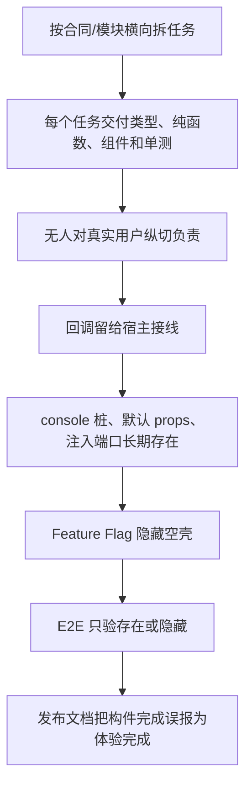
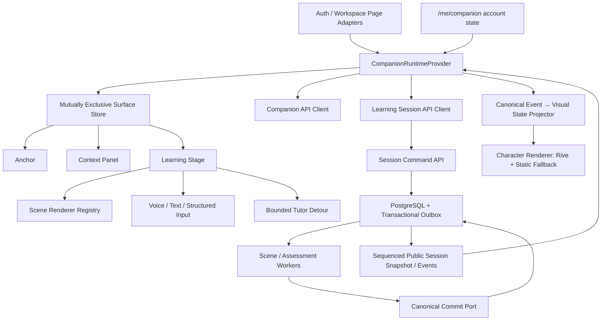

# 学习伴星体验重构方案：从“空壳入口”重建为可用的空间学习伙伴

> **已被新产品方向部分取代（2026-08-09）**
>
> Owner 已将学习伴星重新定义为“OS 桌宠本体 + 身旁微型气泡 + 二级菜单打开完整对话 + 语音对话”。本文件中“不做操作系统级 Desktop Pet”、`anchor → panel → stage` 和侧板为主交互面的方向不再有效。新的权威重构方案见 [`13-desktop-pet-ai-learning-companion-reconstruction.md`](./13-desktop-pet-ai-learning-companion-reconstruction.md)。
>
> 本文件关于真实 Learning Session、独立评估、canonical write、隐私、故障恢复、真实 E2E 和发布证据的约束继续有效。

> 状态：Draft for Owner Review  
> 日期：2026-08-09  
> 审计基线：`v1.0` 分支，`b642665` 及当前工作区只读走查  
> 关联原方案：`project-archive/plans/learning-companion-multimodal-understanding-universe.md`  
> 范围：学习伴星的产品体验、前端运行时、角色资产、学习会话接线、首次引导、星图协作、测试与发布证据  
> 不在本次范围：重写现有 canonical validation/review/scheduler 业务真相；无证据迁移或删除既有用户学习事实

---

## 0. 结论先行

当前问题不是“桌宠画得丑”这么简单，也不是给现有侧板换一张立绘就能解决。

当前交付实际是：

> **默认关闭的浮动入口 + 临时 SVG 小脸 + 空白侧板 + 未接线的演示组件 + 旧验证流程。**

原方案里真正有价值的部分——同一角色身份、空间动作、当前知识上下文、真实 Learning Session、独立评估交接、结果驱动星图变化——没有在用户路径中组成一个闭环。因此，当前伴星不能被视为“已实施但体验差”，更准确的状态是：

> **合同和判定层大量存在，前台产品与端到端装配尚未完成。**

本方案建议：

1. 保留既有 canonical validation、facts 与 scheduler 作为业务真相；新 Session、Artifact、Assessment、Commit 模块只有在真实 PostgreSQL、Worker 与事务集成验证通过后才择优复用，不能预设为可信底座；
2. 不在当前 `CompanionShell` 上继续打补丁，重建前端 Companion Runtime、唯一表面状态机和真实会话舞台；
3. 先完成 Card → 单 Key Point → 回答 → 独立评估 → Commit → 返回来源这一条真实纵切，再扩展 Voice、Tutor、Onboarding、Star Map 和四入口；
4. 在产品级角色资产、真实浏览器 E2E、视觉回归、网络与数据库证据通过以前，保持旧伴星壳默认关闭；
5. 重新打开被错误核验的 DoD，不再以文件存在、纯函数测试或注入式假观察作为发布证据。

---

## 1. 审计方法与边界

### 1.1 实际走查

本次在本地已登录演示账号中走查了：

- 今日学习首页；
- 设置 → 伴星；
- 学习卡详情；
- 验证页；
- 理解星图；
- 默认生产开关关闭状态；
- 临时启用 `NEXT_PUBLIC_COMPANION_SHELL_ENABLED=true` 后的桌面端状态；
- 390×844 移动端状态。

走查只检查显示、布局、可达性和现有只读页面；没有提交正式学习答案、创建真实学习结果或修改用户数据。

### 1.2 代码审计

重点检查：

- `apps/web/components/learning-companion/`；
- `apps/web/lib/learning-companion/`；
- `apps/web/components/layout/AppShell.tsx`；
- Card、Validation、Settings、Graph 页面接线；
- `apps/api/src/modules/companion-shell/`；
- `apps/api/src/modules/learning-sessions/`；
- `workers/ai-worker/src/learning-agent/`；
- Companion E2E、发布证据和 DoD 核验文档。

### 1.3 判断口径

只有同时满足以下条件，才算“体验已实现”：

1. 用户在真实页面可达；
2. 操作调用真实生产端点；
3. 返回真实 public contract；
4. 前端呈现与后端状态一致；
5. 关键动作产生可检查的数据库或 canonical event 结果；
6. 失败、取消、刷新、移动端和无障碍路径可用；
7. 真实浏览器 E2E 覆盖完整旅程。

类型、组件、纯函数、Mock、静态矩阵或“路径存在”只能证明构件存在，不能证明产品可用。

---

## 2. 当前实现烂在哪里

### 2.1 P0：产品事实上不可用

| 问题 | 当前事实 | 用户后果 | 证据 |
| --- | --- | --- | --- |
| 生产默认没有伴星 | Companion Shell 默认关闭 | 普通用户完全看不到计划中的核心产品对象 | `apps/web/lib/feature-flags.ts:53-64`、`apps/web/components/layout/AppShell.tsx:235-237` |
| 打开后是空侧板 | `CompanionShell` 默认 `panelContent` 为空 | 点击“召唤学习伴星”后只得到一块 420px 空白区域 | `apps/web/components/learning-companion/CompanionShell.tsx:50-91` |
| 角色不在正确位置 | Shell 同时渲染 `QuietAnchor` 和另一个无定位的 `CompanionAvatar` | 实测桌面首页 Avatar 位于 `x=0, y≈1167`，完全在视口外；用户只看到临时按钮图标 | `CompanionShell.tsx:71-91`；实际浏览器几何测量 |
| 移动端不是底部面板 | `mobileBottomSheet` 默认 `false`，Shell 从未传入移动端模式 | 390px 下打开的是接近全屏的空白右侧面板，底部导航仍露出 | `CompanionSidePanel.tsx:32-44,83-107` |
| 入口遮挡底部导航 | Anchor 固定 `right-3 bottom-3 z-40` | 移动端入口盖住导航区域，破坏主导航可用性 | `QuietAnchor.tsx:83-100`；390×844 实测 |
| Card 航程不创建 Session | “开始/继续一小段航程”只跳转旧 `/validate` | 新架构没有进入真实用户路径 | `apps/web/app/(workspace)/(focus)/cards/[id]/page.tsx:851-869` |
| Tutor 是空按钮 | “问一问”只写 `console.info` | 用户点击没有 Tutor、证据卡或返回动作 | 同文件 `:900-903` |
| 新输入区是演示 | Validation 页面文字提交只写 console；组件明确提示“不写入学习记录” | 同一页出现演示输入与旧正式输入两个系统 | `apps/web/app/(workspace)/(focus)/cards/[id]/validate/page.tsx:30-47`、`ValidationVoiceEntry.tsx:81-129` |
| Onboarding 是假接线 | 设置页 Start/Skip/Adjust/Replay 全部只写 console，本地 state 假装 consumed | 刷新后状态丢失；没有 CAS、沙盒或真实引导 | `apps/web/app/(workspace)/(default)/settings/page.tsx:97-100,915-946` |
| Auth 页面无伴星 | Companion 只挂载 authenticated `AppShell` | 与“从注册/登录起同一角色身份”相违背 | 全仓库只有 `AppShell.tsx` 导入 `CompanionShell` |
| 星图没有空间动作 | Graph 页面无 Companion overlay、route drawing 或 scene staging | 伴星无法指星、铺路或展示变化 | Graph 生产页面无 Companion/Scene Renderer 接线 |

### 2.2 P0：前后端是两套互不相连的工程

后端已有 `/me/companion`、`/learning-sessions`、回答、语音和评估相关端点，但 Web 生产代码没有对应的 Companion/Session API client，也没有调用这些端点的运行时。

表现为：

- `CompanionShell` 使用硬编码 `DEFAULT_COMPANION_CONTROL_SNAPSHOT`；
- Visual State 永远默认 `dormant`；
- System Event 永远默认 `session_idle`；
- 没有读取 `/me/companion`；
- 没有由 Card 调用 `POST /learning-sessions`；
- 没有消费 `PublicSceneContract`；
- 没有 Scene Renderer registry；
- 没有 Session 状态恢复；
- 没有 canonical event → visual state projector；
- `TapSelectPlaceLayer` 在生产页面中没有调用者；
- Grounded Tutor 和 Scene Activation 主要停留在模块/判定层，没有组成前台端到端路径。

这不是 API 缺一个按钮的问题，而是缺少一个拥有装配责任的前端运行时层。

### 2.3 P0：后端“可信闭环”目前也不成立

进一步审计发现，新学习会话后端并不是“已有完整能力，只差前端接线”。它包含会让正式路径直接失败或产生伪可信结果的实现，当前不得写入 mastery、schedule 或 canonical learning facts。

| 问题 | 当前事实 | 后果 | 证据 |
| --- | --- | --- | --- |
| Episode 状态与数据库约束冲突 | Answer 事务把 `learning_episodes.status` 写成 `answered_locked`；数据库 CHECK 和共享类型只允许 `draft / active / completed / stale / cancelled` | 真实 PostgreSQL 上 lock answer 会违反约束并回滚；Mock 测试反而把非法状态固定成期望 | `apps/api/src/modules/learning-sessions/answer-submission.ts:301-308`、`apps/api/src/db/migrations/0074_learning_sessions_schema.sql:87-91`、`packages/db/src/schema/learning-sessions.ts:92` |
| 占位判分会把任意非空答案判为 covered | `deterministicRubricVerdict` 不检查答案与证据的语义，只判断去空白后长度是否大于 0 | “不知道”或任意字符也能覆盖全部 rubric，随后进入 pass/trust 计算 | `apps/api/src/modules/learning-sessions/assessment-service.ts:101-118` |
| Trust 输入是伪造/空值 | Assessment 硬编码 `mastery_eligible`，probe、rubric coverage、assistance hash 均为空，disposition 仍标注为 COMMIT 前占位语义 | 结果不能证明独立评估、证据覆盖或无帮助作答，却可能被上层误认为正式结果 | `assessment-service.ts:166-186` |
| PREPARE 生成占位 rubric/probe | Service 用 source fingerprint 拼出确定性 hash，并明确注明待 Scene contract 接入后替换 | 返回的 plan/hash 不是经过 Scene Author、Safety 与 Rubric Critic 冻结的真实评估计划 | `session-service.ts:1229-1248` |
| Answer 写入空 Scene 与安全字段 | Response artifact 插入时多个 scene/private/safety/hash 字段为空，同时直接标为 `mastery_eligible` | Artifact 缺少可复核的冻结输入与安全来源 | `answer-submission.ts:285-293` |
| Assessment Worker 没有可用身份和队列闭环 | Worker 只是向需要用户会话鉴权的 API 发无鉴权 POST；Answer 路径又没有可靠 enqueue/outbox | 即使 Answer 成功，独立评估也不会形成可恢复、幂等的生产处理 | `workers/ai-worker/src/handlers/learning-session-assess.ts:34-63` |
| COMMIT 只有模块，没有生产调用者 | `commitEpisode`、Session Loop、Scene activation、Tutor detour 和 typed actions 主要是函数或注入端口，没有形成已注册的生产 orchestrator | Assessment 只写报告，无法保证同一事务更新 canonical facts、schedule、event 与 outbox | `apps/api/src/modules/learning-sessions/episode-commit.ts`、`vertical-slice.ts`、`session-service.ts` |

这里最危险的不是“还没完成”，而是现有单测和命名容易让团队误以为它已经可信。正确策略不是直接把 Web 接到这些端点，而是：

1. 立即关闭新路径对 mastery、scheduler 和 canonical facts 的正式写入；
2. 把 Episode 的生命周期与一次回答的处理阶段拆成两个字段；
3. 删除“非空即 covered”的占位语义；没有独立 Critic 结果时必须返回可重试或 `not_assessable`，绝不能 pass；
4. 用事务 outbox 串起 Scene prepare、Answer lock、Assessment 和 Commit；
5. 在非 Mock PostgreSQL 上证明完整事件序列和 DB diff 后，再开放正式资格。

### 2.4 P1：角色视觉完全没有达到批准方向

批准方向是 2.5～3 头身的年轻星际导航员，具有完整眼神、嘴部、双手、披风、星纹、导航环和空间操作动作。

当前产品实际使用的是：

- 28×28 的手写 SVG；
- 圆脸、闭眼、平嘴和几条曲线；
- 没有眼镜、长发、服装、完整身体轮廓和可识别手势；
- 没有 `.riv` 资产；
- 没有生产 PNG/WebP 状态资产；
- 概念图 `docs/image/learning-companion-character-action-reference.png` 未被产品代码引用；
- `apps/web/package.json` 没有 Rive 运行时依赖；
- `CompanionAvatar.tsx` 自己也注明“未来 Rive 主引擎”。

因此当前小脸不是“降级得不够精致”，而是把开发占位符当成了角色交付。

### 2.5 P1：表面状态机设计错误

计划需要同一时刻只有一个主表面：

```text
静态锚点 ↔ 有界侧板 ↔ 共学舞台 ↔ 退场/隐藏
```

当前 Shell 同时渲染：

```text
固定 QuietAnchor + 文档流 CompanionAvatar + 可选 SidePanel
```

直接造成：

- 入口和角色身份重复；
- 角色离屏；
- 打开面板后入口仍压在面板上；
- 面板 z-index 为 20，Anchor 为 40；
- 关闭/打开不改变角色姿态；
- 页面切换不恢复上下文；
- quiet、moderate、active 没有真实区别；
- `quiet` prop 实际由“未 hidden/off”推导，错误地把“可见”当成“安静模式”。

### 2.6 P1：用户文案泄漏工程实现

当前界面出现：

- `quiet / moderate / active`；
- `exact evidence`；
- `semantic support`；
- `Supervisor`；
- `trusted`；
- `cooldown`；
- `§5.4 / §5.5 / §6.5`；
- “接线演示”“宿主接入后开放”。

这些词属于内部合同、计划和工程调试，不属于用户心智。用户需要看到的是：

- “安静陪伴 / 适时提醒 / 主动建议”；
- “查看原文依据”；
- “一起弄清楚”；
- “自己试一试”；
- “这次只作为练习，不更新理解状态”。

### 2.7 P1：首次引导与产品价值冲突

首页仍使用旧的六步 Checklist，并显示“3/6 已完成”“还差 3 步”。这在视觉和心理上仍然是一份任务债务，而不是一次可跳过的同行体验。

新的 Companion Onboarding：

- 只在设置里出现；
- Start 没有任何效果；
- 没有真实的排序/连接/修复操作；
- 没有可见的 assessment handoff；
- 没有 demo star map change；
- 没有跨刷新 CAS；
- 没有首次唯一邀请。

### 2.8 P1：无障碍实现存在“测试通过、体验错误”

典型问题：

- SidePanel 首次 mount 时 `open=false`，effect 仍写入“伴星已关闭”，实测 DOM 初始就出现关闭播报；
- 面板非模态且不接管焦点，但移动端实际铺满全屏，视觉与语义不一致；
- 面板打开时底部导航仍可见，Anchor 仍覆盖其上；
- Settings 内嵌两个“伴星”二级标题和重复 region；
- 角色状态虽然有 aria label，但真实角色不可见；
- 读屏能读到一个并不存在的产品闭环，并不等于主路径可完成。

### 2.9 P0：E2E 和发布证据形成了“测试剧场”

`apps/web/e2e/companion-shell.spec.ts` 存在以下问题：

1. 测试寻找 `[data-ui='companion-anchor']`，真实组件是 `[data-ui='lc-quiet-anchor']`；
2. 测试寻找 `[data-ui='companion-sidepanel']`，真实组件是 `[data-ui='lc-companion-panel']`；
3. fallback 选择器 `.companion-shell-avatar` 命中的是离屏 Avatar，不是可点击 Anchor；
4. 移动端测试没有点击入口、没有打开面板、没有断言内容；
5. 测试把 Anchor 和 Bottom Nav 的垂直重叠当作成功条件；
6. 默认分支只证明 Feature Flag 关闭时页面没有伴星。

发布证据也互相矛盾：

- `release-manifest.json:5-8` 承认核心闭环未进生产、前端演示默认隐藏；
- 同一文件又把正式角色资产、Global Shell、Onboarding、四入口、Tutor 和移动端标为 verified；
- `11-1-dod-verification.md:156-162` 把 DoD 35/36 标为待真实运行；
- 同文件 `:168-183` 又宣称 36/36 全部通过且无 GAP。

这说明现有完成度不是工程事实，而是文档状态被过早推进。

---

## 3. 根因分析



### 3.1 交付单位选错

原执行把“状态枚举完成”“纯函数完成”“组件完成”“路由完成”当作交付单位；真正的交付单位应该是：

> 用户从一个真实入口开始，完成一段真实学习，看到可信结果，并回到原页面。

### 3.2 过度依赖“纯 UI + props 注入”

纯组件本身没有问题，但几乎每个 Companion 组件都把关键行为留给未来宿主：

- Shell 等 panel content；
- Avatar 等 system event；
- Onboarding 等 CAS；
- Voice 等 ASR/confirm；
- Text input 等 submit；
- Scene 等 activation；
- Tutor 等真实请求。

没有一个 Runtime/Feature Owner 完成最终装配。

### 3.3 视觉资产没有独立生产 Gate

视觉阶段只验证了 SVG 代码、状态枚举和降级逻辑，没有验证：

- 生产源资产；
- 多尺寸可识别性；
- 动作质量；
- 与现有暖色纸张风格的适配；
- 真实页面截图；
- Owner 逐状态视觉签收；
- 许可、导出和回退资产落盘。

结果是代码占位符成为事实标准。

### 3.4 测试对象错位

大量测试验证“一个判定器在注入合规样本时会返回 pass”，但没有证明真实系统产生了该样本。测试覆盖的是规则，不是装配。

当前相关范围约有 97 个生产 TS/TSX 文件、63 个测试文件，仍然不能打开一个有内容的伴星面板。这一反差说明覆盖率与用户价值脱钩。

### 3.5 发布治理允许自相矛盾

阶段完成、DoD、release manifest 和真实 RC 没有单一状态源。文档可以同时出现：

- implementation complete；
- core loop not in production；
- pending RC；
- 36/36 verified。

新方案必须把发布状态变成机器可判的真实证据集合，而不是手写结论。

---

## 4. 重构原则

1. **先纵切，后铺面**：先让 Card 单入口完整可用，再扩展四入口。
2. **一个表面，一个角色**：同一时刻只存在 anchor、panel、stage、hidden 中的一种主表面。
3. **无内容不打开**：Panel Model 在类型层必须包含 context、说明和至少一个合法动作；禁止空侧板。
4. **服务端状态权威**：视觉状态来自真实 Session/Event，不由前端计时器或模型文案猜测。
5. **正式与练习分离**：Tutor/帮助先原子切换 practice，再开放解释；伴星不参与正式判分。
6. **角色资产是产品，不是代码图标**：由设计源资产生产 Rive/等价矢量与 WebP/PNG fallback。
7. **用户文案不泄漏内部合同**：Supervisor、trust、cooldown、hash、§ 引用不得出现在产品界面。
8. **移动端不是缩小桌面端**：入口进入 Bottom Nav 或预留安全槽，Panel 使用真实 Bottom Sheet。
9. **旧流程只做回滚，不与新 UI 同屏**：Legacy ValidationFocus 可以保留，但不能和新 Session UI 同时渲染。
10. **真实证据才可发布**：至少包含浏览器截图/录像、network trace、canonical event 序列和 DB diff。
11. **伪评估零容忍**：正式 Critic、冻结证据或 Commit 任一缺失，结果只能是练习、可重试或 `not_assessable`，不得写 mastery/schedule。
12. **生命周期与处理阶段分离**：Episode lifecycle 不再承载 `answered_locked` 之类的管线状态；状态、数据库约束和共享合同必须同源。

### 4.1 明确非目标

- 不做操作系统级 Desktop Pet；
- 不做无限聊天消息流；
- 不做喂养、好感度、签到或依赖关系；
- 不在第一阶段覆盖所有 Scene family；
- 不为了保留现有代码而维持错误组件边界；
- 不重建第二套 mastery 或 scheduler。

---

## 5. 目标产品形态

### 5.1 一句话定义

> **伴星是学习应用内部、可随时找到的星际导航员；它通过指向、摆放、连接、朗读和退场帮助用户完成一段真实学习，而不是悬浮聊天框或需要照顾的桌宠。**

### 5.2 四种互斥表面

| 表面 | 触发条件 | 视觉 | 内容 |
| --- | --- | --- | --- |
| `anchor` | 普通浏览、未召唤 | 同一角色的清晰头像/半身裁切，静态 | 只提供召唤入口 |
| `panel` | 用户主动召唤或接受合法建议 | 角色半身 + 上下文卡 | 当前页面说明、推荐原因、1 个主行动、最多 2 个次行动 |
| `stage` | 已进入真实 Learning Session | 角色完整身体 + Scene 空间 | 路线、Scene、输入、Tutor detour、结果 checkpoint |
| `hidden` | temporary hidden/global off/页面禁止 | 无角色、无监听、无请求 | 仅设置或命令入口可恢复 |

任意状态切换都必须卸载上一主表面，禁止 Anchor、Avatar 和 Panel 三份同时存在。

### 5.3 桌面布局

- Default App Shell：Anchor 放入侧栏底部的预留 Companion Slot，位于用户菜单上方，不使用覆盖内容的 fixed FAB；
- Focus 页面：在顶部工具栏保留 48px Companion Slot；
- Star Map：在星图控制区保留独立槽位，不覆盖缩放、图例或节点；
- Panel：宽 360～400px，页面主体可保持可见；打开前必须有非空 Panel Model；
- Stage：使用页面主区域，不把完整学习塞入 400px 抽屉。

### 5.4 移动端布局

- Bottom Nav 增加明确“伴星”入口，或为 Companion 预留专属第五槽位；
- 不再使用压在导航上的浮动按钮；
- Panel 使用 55～72dvh Bottom Sheet，可拖动/按钮收起；
- Stage 使用独立全屏学习页，顶部有返回来源和结束；
- `safe-area-inset-bottom`、键盘弹出和语音权限提示不得盖住主操作；
- 关闭后焦点/屏幕阅读位置回到入口。

### 5.5 角色设计分级

同一源资产输出三个细节等级：

1. **Anchor 级（32～48px）**：眼镜、星形发饰、深色头发和导航环轮廓必须仍可识别；减少服装细节；
2. **Panel 级（80～120px）**：半身、手势、表情和导航环可读；
3. **Stage 级（160～240px）**：完整身体动作，可托卡片、指路、连接节点、退到场景边缘。

视觉需桥接现有产品的暖纸色/深绿体系：保留深蓝、白、金的星际识别色，但用产品绿作为可交互强调色，避免角色像从另一个游戏直接贴入。

### 5.6 人格与文案

- 先动作，后解释；
- 单次主动提示最多一句；
- 同时最多三个动作；
- 允许好奇、专注、共同发现、平静和温和幽默；
- 答错不失望、不摇头、不催促；
- 系统错误说清“发生了什么、能做什么”，不表演成用户失败；
- 正式判分前明确说“接下来由独立评估完成，我先退到旁边”；
- 结果只确认真实变化，不做夸张庆祝。

---

## 6. 目标技术架构



### 6.1 新的前端模块边界

建议新建 `apps/web/features/companion/`，不要继续把运行时逻辑散落在 `components/` 和 `lib/`：

```text
apps/web/features/companion/
  api/
    companion-client.ts
    learning-session-client.ts
  runtime/
    CompanionRuntimeProvider.tsx
    companion-reducer.ts
    session-event-projector.ts
    surface-model.ts
    origin-snapshot.ts
  character/
    CompanionCharacter.tsx
    CompanionAssetManifest.ts
    RiveCompanionRenderer.tsx
    StaticCompanionRenderer.tsx
  surfaces/
    CompanionAnchor.tsx
    CompanionPanel.tsx
    CompanionBottomSheet.tsx
    CompanionStage.tsx
  scenes/
    SceneRendererRegistry.tsx
    VoiceTeachbackScene.tsx
    OrderingScene.tsx
    RepairScene.tsx
    RelationScene.tsx
  onboarding/
    CompanionOnboardingSurface.tsx
    onboarding-client.ts
  copy/
    companion-copy.ts
    internal-term-guard.ts
```

现有 `apps/web/components/learning-companion/` 在迁移期只保留兼容导出；新功能不再继续堆入旧目录。

### 6.2 唯一表面状态

```ts
type CompanionSurfaceState =
  | { kind: "hidden"; reason: "temporary_hidden" | "global_off" | "surface_forbidden" }
  | { kind: "anchor"; pageKind: string }
  | { kind: "panel"; model: CompanionPanelModel; returnFocusId: string }
  | { kind: "stage"; sessionId: string; episodeId: string; origin: OriginSnapshot };
```

`CompanionPanelModel` 必须是非空联合类型：

```ts
type CompanionPanelModel =
  | { kind: "page_help"; title: string; body: string; actions: NonEmptyActions }
  | { kind: "route_offer"; targetLabel: string; reason: string; actions: NonEmptyActions }
  | { kind: "resume"; targetLabel: string; checkpointLabel: string; actions: NonEmptyActions }
  | { kind: "settings"; presence: PresenceLabel; actions: NonEmptyActions };
```

类型层禁止 `{ children: undefined }` 打开侧板。

### 6.3 Learning Session 前端状态

```text
idle
→ preparing
→ route_offer
→ scene_active
→ response_draft
→ response_locked
→ assessment_handoff
→ assessing
→ result_checkpoint
→ ended / next_episode / cancelled
```

规则：

- 状态来自服务端 public snapshot 和单调序号事件；
- 传输首版可使用短轮询，后续可替换 SSE，UI 合同不绑定传输；
- 刷新后用 Session ID 重建；
- 任一重复/乱序事件按 `sequence` 去重；
- `committed_change` 只能由 commit 事件触发；
- assessment 前端不能自行计时后“假装完成”；
- cancel/end 使用真实端点并保留已 commit Episode。

### 6.4 Page Context

每个页面只提供一个显式 adapter：

```ts
interface PageCompanionAdapter {
  pageKind: string;
  sensitivity: "normal" | "private" | "credential";
  getTriggerContext(): MinimalTriggerContext;
  getActionContext(actionId: string): Promise<ShortLivedActionContext>;
  captureOrigin(): OriginSnapshot;
}
```

约束：

- quiet 未召唤不构造完整上下文；
- credential 页面只使用静态 manifest；
- 不抓 DOM、不截屏、不读输入值；
- action context 按需构造，Panel 关闭即销毁；
- 页面未提供 adapter 时只显示静态帮助，不猜测页面状态。

### 6.5 角色资产合同

```ts
type CompanionAssetManifestV1 = {
  version: string;
  sourceLicenseRef: string;
  sourceSha256: string;
  rive?: { url: string; sha256: string; stateMachine: string };
  staticByState: Record<CompanionVisualStateV1, {
    webp: string;
    width: number;
    height: number;
    anchorX: number;
    anchorY: number;
  }>;
};
```

必须交付：

- 真透明背景；
- 统一画布、脚底锚点和安全边界；
- 11 状态静态 fallback；
- Anchor/Panel/Stage 三档导出；
- reduced-motion 姿态；
- 资产 hash、来源、许可和商业使用记录；
- 加载失败时不出现布局跳动或空白。

### 6.6 Scene Renderer

首轮只支持三个高价值 Scene：

1. Voice/Text Teach-back；
2. Ordering；
3. Repair。

Relation/Scenario 在纵切稳定后加入。每个 Scene renderer 必须：

- 只消费 `PublicSceneContract`；
- 不接触 private solution；
- 产生结构化 `ResponseArtifact`；
- 有键盘/点选替代；
- 有静态 fallback；
- 能明确 lock answer；
- 无可评估场景时 fail closed 到 Text Teach-back，而不是空舞台。

### 6.7 后端可信纵切

后端必须从“路由 + 注入端口集合”收敛为一个具有明确事务边界的应用服务。建议唯一命令链为：

```text
create_session
→ resolve_server_policy_and_budget
→ prepare_requested + scene_prepare_outbox
→ Scene Author / Safety / Rubric Critic
→ episode_activated + frozen PublicScene
→ response_draft
→ confirm_answer（锁 Artifact，不篡改 lifecycle）
→ assessment_requested + assessment_outbox
→ Independent Assessment Critic
→ assessment_completed / not_assessable
→ commit_requested
→ PgCommitPort 单事务写 canonical facts + schedule + event + outbox
→ commit_recorded
```

状态模型拆成两条正交轴：

```ts
type EpisodeLifecycle = "draft" | "active" | "completed" | "stale" | "cancelled";

type EpisodeProcessingPhase =
  | "preparing"
  | "scene_ready"
  | "awaiting_response"
  | "assessment_pending"
  | "assessment_complete"
  | "commit_pending"
  | "committed";
```

关键约束：

- Lifecycle、processing phase、数据库 CHECK 与共享 Zod schema 只能有一个来源；
- Answer confirmation 锁定 immutable artifact，并以 CAS 进入 `assessment_pending`，不再写非法 `answered_locked` lifecycle；
- Scene、rubric、probe、assistance 与 safety 输入必须在 Episode 激活前冻结并有非空 hash；
- Assessment Worker 使用服务身份或直接调用 application service，不借用户 Cookie，不做无鉴权 loopback HTTP；
- 命令事务同时写业务状态与 outbox；Worker 重试、重复消息和进程崩溃不得丢任务或重复 commit；
- Critic 不可用、证据不足、合同不一致时结果是 `not_assessable` 或 retryable error；
- 只有 `commit_recorded` 事件可驱动 mastery、schedule 和前端 `committed_change`；
- Public DTO 只包含渲染与交互所需字段，不泄漏 private solution、内部预算、计划 hash 或 policy debug 信息。

---

## 7. 保留、重写与淘汰边界

| 处理 | 模块 | 原因 |
| --- | --- | --- |
| 保留既有真相 | 既有 canonical validation、facts、official scheduler 与 RLS 原则 | 新纵切验收前继续作为唯一可信业务路径，不因 UI 重构迁移历史事实 |
| 选择性复用并重建应用流 | `/me/companion`、`/learning-sessions`、answer、voice、assess、commit 模块 | 路由/纯函数可复用，但状态冲突、占位判分、Worker 身份、outbox 和 Commit 生产接线必须重做 |
| 收敛为单一合同源 | Shared Session/Scene/Companion contracts 与 DB schema | 删除重复状态定义；Zod、TypeScript 和数据库约束必须由同一枚举生成或由 CI 校验 |
| 重写 | `CompanionShell.tsx` | 当前边界允许空 panel、重复 surface、硬编码状态 |
| 重写 | `QuietAnchor.tsx` | 当前视觉是占位符，布局覆盖移动导航 |
| 降级为开发 fallback | `CompanionAvatar.tsx` | 可暂作极端失败图形，不得继续作为生产角色资产 |
| 重写 | `CompanionSidePanel.tsx` | 需要响应式 surface、非空 model、正确 mobile bottom sheet |
| 重写接线 | `CompanionSettings.tsx`、Settings page | 说明文字要变成真实可持久化控制 |
| 替换 | `ValidationVoiceEntry.tsx` | 不得与旧正式验证同屏；改为 Session Stage 的真实输入 |
| 保留逻辑、接入生产 | `TapSelectPlaceLayer` 相关纯逻辑 | 有价值，但必须由真实 Scene Renderer 调用 |
| 暂时保留回滚 | `ValidationFocus` 旧路径 | 新纵切通过前作为 legacy fallback；不得与新 UI 混用 |
| 删除 | 所有 `console.info("[companion] ... integration pending")` 生产动作 | 明确属于演示桩 |
| 重写 | `companion-shell.spec.ts` | 选择器错误、验收目标错误、没有用户行为 |
| 撤回结论 | 错误 verified 的发布证据 | 真实 RC 和纵切通过后重新签发 |

---

## 8. 分阶段重构计划

### R0：纠正事实与隔离旧空壳（2～3 天）

目标：停止继续在错误完成度上开发。

工作：

- 保持 `NEXT_PUBLIC_COMPANION_SHELL_ENABLED=false`；
- 新增独立 `COMPANION_V2_INTERNAL` capability，不复用旧空壳开关；
- 立即关闭新 Session 路径对 mastery、scheduler 和 canonical facts 的正式写入；当前 assessment 只允许 internal diagnostic，并明确标记 non-canonical；
- 删除或封锁“任意非空答案 → covered/pass”的可达生产路径；Critic 尚未接入时统一 fail closed；
- 将发布状态改为 `rebuild_required`，撤回 DoD 7/8/9/10/11/14/15/25/26/27/30/32 的 verified；
- 建立所有 stub/placeholder/console action 清单；
- 保存桌面、移动、星图、设置、卡片、验证页基线截图；
- 冻结新增纯判定层工作，所有新任务必须挂到纵切旅程；
- 为旧 ValidationFocus 明确 legacy rollback 身份。

退出 Gate：

- 文档、manifest、feature flag 状态不再互相矛盾；
- 任何人不能把当前 Companion 称为 public-beta default；
- 占位 assessment 无法更新任何用户学习事实；
- 有一张 Owner 可确认的“保留/重写/删除”清单。

### R1：体验原型与生产角色资产定稿（5～10 天，可与 R2 并行）

目标：先冻结真实页面长什么样，再写运行时代码。

工作：

- 输出 Anchor、Context Panel、Learning Stage、Assessment Handoff、Result Checkpoint 五张高保真桌面稿；
- 输出 390px Bottom Nav、Bottom Sheet、Stage 三张移动稿；
- 重新设计角色三档细节；
- 以当前概念图为方向，不直接切图发布；
- 制作 Rive/等价矢量主资产；
- 输出 11 状态静态 WebP fallback；
- 做浅色首页、深色星图、验证舞台三种背景适配；
- 冻结 persona/copy guide；
- 由 Owner 对静态稿和真实资产逐项签收。

退出 Gate：

- 不运行代码也能看清完整 Card 旅程；
- 32/48/96/160px 下角色均可识别为同一角色；
- 资产来源、许可、hash、透明度和锚点通过；
- 不允许手写圆/矩形 SVG 作为默认资产。

### R2：统一合同、Episode 状态与后端纵切底座（8～12 天）

目标：先让 PREPARE/ANSWER/ASSESS/COMMIT 在服务端成为可证明、可恢复、fail-closed 的真实链路。

工作：

- 建立 `@ailearn/shared` 的唯一 Zod command/response/event/action schema；
- 迁移 Episode lifecycle 与 processing phase，移除非法 `answered_locked` lifecycle；
- 增加数据库约束、迁移回滚脚本和 schema/TypeScript 一致性 CI；
- 由服务端 `EpisodePolicyResolver` 解析预算、模型、能力与正式资格，不信任客户端自报值；
- PREPARE 通过 outbox 调用 Scene Author、Safety 与 Rubric Critic，冻结真实 scene/rubric/probe 输入；
- Answer 事务只锁定 immutable artifact，并写 `assessment_requested` 与 assessment outbox；
- Worker 使用 service identity/direct application service，支持 lease、幂等、超时与重试；
- 删除 deterministic nonempty-pass，实现独立 Critic + deterministic reducer；Critic 缺失时返回 `not_assessable`；
- 将 `commitEpisode` 收敛为真实 `PgCommitPort`，单事务写 canonical facts、schedule、event 与 outbox；
- 为 create/answer/assess/commit 建立非 Mock PostgreSQL 集成测试和失败注入测试；
- 收紧 Public DTO，移除 private solution、内部预算与 debug hash。

退出 Gate：

- 数据库、共享类型与运行时状态枚举完全一致；
- 任意非空错误答案不能通过；Critic 不可用时绝不产生 mastery-eligible 结果；
- Answer lock 不违反数据库约束；
- 崩溃发生在业务写入与 enqueue 之间时，outbox 能恢复任务；
- 同一 artifact 的重复 assessment/commit 最多产生一次 canonical 副作用；
- `assessment_started → assessment_completed → commit_recorded` 序列在真实 PostgreSQL 可复核；
- 未收到 `commit_recorded` 时 mastery/schedule diff 为 0。

### R3：Companion Runtime 与唯一表面状态机（5～7 天）

目标：建立真正负责装配的前端核心。

工作：

- 新建 `features/companion`；
- 实现 `CompanionRuntimeProvider`；
- 接入 `/me/companion`；
- 实现 surface reducer；
- 实现 Page Adapter 注册和 Origin Snapshot；
- 实现非空 Panel Model；
- 实现 Desktop Slot 与 Mobile Nav Slot；
- 接入生产 Character Renderer 和静态 fallback；
- 修复 focus、live region、reduced-motion 和 asset failure；
- 删除 Shell 的默认 `panelContent` 和默认假事件。

退出 Gate：

- 首页召唤后 Panel 非空；
- 同时只能存在一个主 surface；
- 390/768/1440 不遮挡任何主操作；
- 初始 mount 不播报“已关闭”；
- temporary hidden/global off 后角色、observer、context、请求均为 0；
- 资产失败时仍显示可识别静态角色和合法动作。

### R4：Card 单 Key Point 真实纵切（8～12 天，关键路径）

目标：第一次让伴星真正完成一段学习。

固定旅程：

```text
Card 主行动
→ POST /learning-sessions
→ 路线说明
→ Scene prepare outbox / frozen Public Scene
→ Text Teach-back 或 Ordering
→ confirm + lock immutable artifact
→ assessment outbox
→ assessment_handoff
→ Independent Assessment Critic
→ PgCommitPort
→ commit_recorded
→ Result Checkpoint
→ 返回原 Card 滚动位置
```

工作：

- 实现 `learning-session-client.ts`；
- Card 主行动调用真实 PREPARE；
- 新建 Session Stage 页面/overlay；
- 消费 public Session/Scene DTO；
- 接入 Text Answer；
- 接入 Ordering Scene；
- 接入 answer lock、assessment outbox、assess、commit 状态；
- Character 使用真实 event projector；
- 保存并恢复 Card origin；
- 移除新输入区与旧 ValidationFocus 同屏；
- 失败时明确重试/返回，不静默回旧验证；
- 检查 DB 中 artifact、assessment、canonical result、schedule 副作用。

退出 Gate：

- 至少一条真实 Card E2E 在非 Mock PostgreSQL 上通过；
- Network trace 包含 create/get/answer/end；内部证据包含 scene/assessment outbox 和 Worker lease；
- DB diff 与 event sequence 可复核；
- 错误答案、Critic 超时和证据不足均不能产生 pass/commit；
- 未 commit 不改变理解投影；
- commit 后角色才可进入 `committed_change`；
- 结束后返回原 Card 和滚动位置；
- 0 console stub。

### R5：Voice、Tutor 与 Structured Scene（8～12 天）

目标：把“多模态”和“问一问”从声明变成真实能力。

工作：

- Voice 录制 → ASR → transcript 确认 → lock answer；
- 麦克风拒绝、ASR not-assessable 和重录；
- 手工编辑 transcript 转为 text_or_mixed；
- Tutor 入口调用真实 bounded detour；
- 正式状态请求帮助时先原子切换 practice；
- Tutor 输出按证据段展示，不做无限聊天；
- 固定“返回原航程 / 结束”动作；
- 接入 Repair Scene；
- 接入现有 Tap-Select-Place 作为键盘/触控替代；
- TTS/查看证据/Tutor 的 exposure 真实落账。

退出 Gate：

- Voice canonical 路径有真实 ASR 证据；
- 拒绝麦克风后无死路；
- Tutor 最多两轮澄清且始终有返回/结束；
- Tutor 不写 mastery/schedule；
- 内容工具实际记录 exposure；
- Structured Scene 不泄漏 private solution。

### R6：真实 Onboarding、设置与 Auth 安全壳（5～8 天）

目标：让用户第一次遇见伴星时就理解它，而不是看到任务 Checklist。

工作：

- Auth 页面接入同一角色静态安全壳；
- 使用签名 auth manifest，只展示产品用途和静态帮助；
- 新账号首次唯一邀请走真实 CAS；
- 完成隔离 `onboarding_sample:*`；
- 样例至少包含一个真实 Ordering/Repair；
- 展示可见 assessment handoff；
- 展示并还原 demo star map change；
- Settings 提供真实存在感 radio、语音、动画、隐藏、全局关闭；
- Skip/Replay 跨刷新持久化；
- 移除首页“还差 N 步”式伴星引导债务。

退出 Gate：

- 注册/登录零 credential observer/provider call；
- 首次邀请只出现一次；
- Skip 立即生效且不二次挽留；
- onboarding sample 对正式事实零副作用；
- 全部设置刷新后保持；
- global off 在所有 active device lease 生效或如实报告部分失败。

### R7：Star Map 与四入口扩展（8～12 天）

目标：恢复原方案真正有辨识度的空间学习体验。

工作：

- Star 选择后伴星聚焦节点；
- `draw_route` 使用确定性 SVG/Canvas overlay；
- `stage_scene` 把目标带入同一 Session Stage；
- commit 后 `show_change` 只展示事件驱动变化；
- 实现 Card/Review/Now/Star 四入口共享 Session client；
- 每个 origin 保存/恢复自己的 view snapshot；
- 多 Episode 每站停在 checkpoint；
- 不自动进入下一站；
- Graph 角色槽位不覆盖缩放、图例或节点；
- reduced-motion 使用静态路线与姿态切换。

退出 Gate：

- 四入口各一条真实浏览器 E2E；
- 每条旅程回到正确 origin；
- 无 canonical event 时星图变化为 0；
- 角色动作与 typed action 一一对应；
- 5K 节点下 Companion overlay 不明显降低帧率。

### R8：Hardening、内部试用与公测（5～8 天）

目标：用真实证据而不是判定层工厂完成发布。

工作：

- 视觉回归矩阵；
- 三视口、200% zoom、键盘、读屏、Switch、reduced-motion；
- 断网、慢网、Provider/ASR/TTS/asset failure；
- refresh/resume、重复/乱序 event、多标签接管；
- 隐私与日志内容扫描；
- 真实 Provider、PostgreSQL、对象存储和浏览器 RC；
- internal allowlist；
- 5% → 25% → default；
- 每档检查 completion、error、cost 和 rollback；
- 删除旧 Companion Shell 和演示开关；
- 重新签发 release manifest。

退出 Gate：

- 本文 §11 的全部 DoD 通过；
- RC evidence 包含真实 artifact ref；
- 没有 placeholder/skip/insufficient-data；
- 旧流程可作为显式 rollback，但不会和新流程同屏；
- Owner 完成最终视觉与旅程签收。

---

## 9. 文件级改造建议

| 文件/目录 | 动作 |
| --- | --- |
| `apps/web/components/layout/AppShell.tsx` | 改为挂载 `CompanionRuntimeProvider` 和预留 Slot，不直接无参数挂 Shell |
| `apps/web/app/(auth)/login/page.tsx` | 接静态 Auth Companion，不读取表单值 |
| `apps/web/app/(auth)/register/page.tsx` | 同上；注册成功后触发一次性 onboarding eligibility |
| `apps/web/components/learning-companion/CompanionShell.tsx` | 迁移后删除或改成 compatibility wrapper |
| `QuietAnchor.tsx` | 替换为同源角色 Anchor；移除移动端 fixed overlap |
| `CompanionAvatar.tsx` | 改名/降级为极端 fallback；生产默认改用资产 Renderer |
| `CompanionSidePanel.tsx` | 改为 model-driven Desktop Panel + Mobile Bottom Sheet |
| `CompanionSettings.tsx` | 从说明列表改成真实表单并接 `/me/companion` |
| `LearningCardActions.tsx` | 去工程术语；主行动调用真实 Session Client；内容工具落 exposure |
| Card detail page | 移除 console Tutor；保存 Origin Snapshot；启动真实 Session |
| Validate page | legacy 与 v2 二选一，不同时渲染 |
| `ValidationVoiceEntry.tsx` | 移入 Stage 并删除“接线演示”模式 |
| `TapSelectPlaceLayer.tsx` | 由 Scene Registry 调用，补 PublicScene adapter |
| Graph page/components | 接入 Companion Slot、typed spatial overlay 和 origin restore |
| `apps/web/lib/api.ts` | 不继续膨胀；Companion/Session 使用 feature-local typed client |
| `packages/db/src/schema/learning-sessions.ts` + migration | 增加 processing phase；统一 lifecycle 枚举与 CHECK；禁止应用层写未声明状态 |
| `apps/api/src/modules/learning-sessions/answer-submission.ts` | 移除 `answered_locked` lifecycle；锁 artifact + CAS phase + assessment outbox 同事务 |
| `apps/api/src/modules/learning-sessions/assessment-service.ts` | 删除 nonempty-pass 和空 hash trust；接独立 Critic，缺失时 fail closed |
| `apps/api/src/modules/learning-sessions/session-service.ts` | 用真实冻结 Scene/rubric/probe 替换确定性占位 hash；政策/预算由服务端解析 |
| `apps/api/src/modules/learning-sessions/episode-commit.ts` | 接入 `PgCommitPort` 生产 caller，保证 canonical facts/schedule/event/outbox 单事务与幂等 |
| `workers/ai-worker/src/handlers/learning-session-assess.ts` | 移除无鉴权 loopback HTTP；改为 service identity/direct application service + lease/outbox |
| `workers/ai-worker/src/learning-agent/` | 为 Supervisor、Scene Author、Critic、Tutor 与 Gateway executor 提供真实 provider adapter、epoch 与启动装配 |
| `apps/web/e2e/companion-shell.spec.ts` | 删除重写，以真实旅程和准确 selector 为准 |
| `docs/evidence/learning-companion-v1/` | 不覆盖旧历史；新建 `reconstruction-v2/` 证据目录 |

---

## 10. 测试与证据重构

### 10.1 测试金字塔

| 层 | 证明什么 | 不能替代什么 |
| --- | --- | --- |
| 纯函数 | reducer、权限、状态映射正确 | 不能证明页面接线 |
| 组件 | Panel、Character、Scene 单独可渲染 | 不能证明 API/DB |
| Contract | DTO、private/public 分离 | 不能证明真实端点返回该 DTO |
| API integration | 非 Mock PostgreSQL 事务和 RLS | 不能证明用户界面 |
| Browser E2E | 用户旅程、network、focus、responsive | 不能单独证明 canonical DB 副作用 |
| Evidence bundle | Browser trace + event sequence + DB diff + screenshot | 最终发布 Gate |

### 10.2 必测真实旅程

1. 首页静态召唤 → 非空页面帮助 → 关闭后焦点恢复；
2. Card → Text Teach-back → assess → commit → 返回；
3. Card → Ordering → assess → commit → 返回；
4. Voice 成功 → transcript 确认 → assess；
5. 麦克风拒绝 → Text fallback；
6. 正式状态问问题 → 确认切换 practice → Tutor → 返回；
7. Assessment 开始 → 角色真实退场 → 结果后确认；
8. 任一阶段刷新 → 恢复合法 checkpoint；
9. 任一阶段取消 → 未 commit 零副作用；
10. temporary hidden/global off → DOM/observer/request 为 0；
11. Auth 页面 → 静态帮助且 credential 零采集；
12. Onboarding Start/Skip/Replay + sandbox 零副作用；
13. Star → route → session → commit → 返回原视口；
14. Review/Now/Card/Star 四 origin；
15. Character asset 404 → 静态 fallback；
16. API/ASR/TTS/Worker 失败 → 明确重试/返回；
17. 390/768/1440 + 200% zoom；
18. reduced-motion + screen reader 状态文本。

后端还必须单独覆盖：

19. 数据库拒绝未知 lifecycle，应用代码也无法构造未知状态；
20. 空答案、错误答案、“不知道”和无关长文本均不能获得 covered/pass；
21. Critic 超时、返回缺字段或 hash 不一致 → retry/not-assessable，canonical diff 为 0；
22. Answer 事务提交后 Worker 进程崩溃 → outbox 可恢复；
23. 同一 outbox 重放、重复 assess、重复 commit → canonical 副作用恰好一次；
24. Commit 中途故障 → facts、schedule、event 不出现部分写入；
25. 客户端伪造预算、模型、capability 或 mastery eligibility → 服务端忽略/拒绝；
26. Worker 使用服务身份时仍受 workspace/RLS/审计边界约束。

### 10.3 视觉回归矩阵

至少覆盖：

```text
3 viewports × 2 color schemes × 4 surfaces × 8 critical visual states
```

关键状态：

- dormant/anchor；
- invite_once；
- route/navigate；
- present_evidence；
- listen；
- assessment_handoff；
- committed_change；
- uncertain_or_retry。

视觉回归必须检查：

- 是否覆盖主操作；
- 是否与 Bottom Nav/Graph controls 冲突；
- 角色是否被裁切；
- 锚点是否一致；
- Panel 是否非空；
- 深浅色对比；
- fallback 是否保持同一身份；
- 文案是否含内部术语。

### 10.4 E2E 规则

- selector 必须对应真实 `data-testid`，禁止多候选 fallback 掩盖错误；
- 必须点击主动作，不以 `toBeVisible()` 作为完成；
- 必须断言请求 URL、响应 status 和关键 public contract；
- 必须断言至少一个 canonical event 或 DB diff；
- 不允许把重叠/离屏元素算作可用；
- 默认开关关闭的测试属于 rollback 测试，不属于产品成功测试；
- Mock E2E 与 Real E2E 分目录并在报告中明确标识。

---

## 11. 重构版完成定义（DoD）

### 11.1 产品

- [ ] 用户在生产默认构建中能找到伴星；
- [ ] 召唤永远不会打开空 Panel；
- [ ] 同时只有一个主 Surface；
- [ ] Card 单 Key Point 完整纵切通过；
- [ ] Voice、Text 和合格 Structured Scene 诚实显示可用性；
- [ ] Tutor 有界、可返回、practice-only；
- [ ] Onboarding 可跳过、可恢复、沙盒零副作用；
- [ ] Card/Review/Now/Star 四入口共用真实 Session core；
- [ ] 星图变化只来自 canonical event；
- [ ] 结束后回到正确来源与视口。

### 11.2 视觉

- [ ] 生产角色资产不是代码占位符；
- [ ] 三档尺寸能识别为同一角色；
- [ ] 11 状态有静态 fallback；
- [ ] Assessment handoff 和 committed change 与真实事件一致；
- [ ] 390/768/1440 无遮挡、裁切或离屏；
- [ ] 深浅色和 reduced-motion 通过；
- [ ] Owner 完成页面级而非概念图级签收。

### 11.3 工程

- [ ] Episode lifecycle、processing phase、共享 schema 与数据库 CHECK 同源；
- [ ] 生产代码不存在“非空答案即 covered/pass”的占位评估；
- [ ] Scene/rubric/probe/assistance/safety 冻结输入与 hash 非空且可追溯；
- [ ] Answer lock、assessment outbox 和 phase CAS 在同一事务；
- [ ] Assessment Worker 使用受控服务身份并支持 lease/idempotency/retry；
- [ ] PgCommitPort 单事务写 canonical facts、schedule、event 与 outbox；
- [ ] Critic/Worker/Commit 任一失败时 mastery 与 schedule diff 为 0；
- [ ] Web 有真实 Companion/Session client；
- [ ] Runtime 读取 `/me/companion`；
- [ ] Card 主行动真实创建 Session；
- [ ] Scene Renderer 消费 Public Contract；
- [ ] Answer/Assess/Commit 真实接线；
- [ ] Worker/Scene/Tutor executor 生产装配；
- [ ] 无 console stub、integration pending 或 placeholder UI；
- [ ] 旧验证与新舞台不同时渲染；
- [ ] hidden/off 后零 observer/context/request；
- [ ] 乱序、重复、刷新和取消安全。

### 11.4 证据

- [ ] 真实浏览器旅程；
- [ ] Network trace；
- [ ] Canonical event sequence；
- [ ] PostgreSQL diff；
- [ ] Character/Scene 视觉回归；
- [ ] A11y 报告；
- [ ] Provider/ASR/TTS real artifact ref；
- [ ] 5%/25%/default 各档真实观察；
- [ ] rollback drill；
- [ ] release manifest 与真实状态单一一致。

---

## 12. 排期与人员建议

### 12.1 推荐配置

- 2 名前端：Runtime/Surface 与 Session/Scene 各 1；
- 2 名后端：合同/数据库/Commit 与 Scene/Assessment/Worker 各 1；若只有 1 人，R2/R4 不可并行；
- 1 名产品设计 + 角色动画设计；
- 1 名 QA/测试工程师，可在 R2 后半加入；
- Owner 每个阶段只签真实页面和证据，不签“文件存在”。

### 12.2 粗略工期

| 阶段 | 日历时间 | 可并行 |
| --- | ---: | --- |
| R0 | 2～3 天 | 否 |
| R1 | 1～2 周 | 与 R2 并行 |
| R2 | 1.5～2.5 周 | 与 R1 前半并行，后端关键路径 |
| R3 | 1～1.5 周 | 与 R2 后半部分并行 |
| R4 | 1.5～2.5 周 | 产品关键路径，依赖 R2/R3 |
| R5 | 1.5～2 周 | 部分并行 |
| R6 | 1～1.5 周 | 可与 R5 后半并行 |
| R7 | 1.5～2 周 | 依赖 R4/R5 |
| R8 | 1～1.5 周 | 依赖全部 Must |

推荐团队配置下约 9～12 个日历周；单人串行约 16～22 周。任何压缩都应先缩小入口/Scene 范围，不能再次用 stub、伪评估和假 Gate 压缩。

---

## 13. 风险与缓解

| 风险 | 缓解 |
| --- | --- |
| 后端状态冲突导致真实 Answer 事务失败 | R0 关闭正式写入；R2 迁移 lifecycle/phase 并在真实 PostgreSQL 验证 |
| 占位判分产生伪 mastery | 删除 nonempty-pass；Critic 缺失统一 not-assessable；commit gate 检查冻结证据 |
| Worker/outbox 缺失导致任务丢失或重复 commit | 事务 outbox、service identity、lease、idempotency key 与故障注入测试 |
| 角色制作再次拖延 | R1 将生产资产作为阻塞 Gate；静态高质量 WebP 可先于 Rive，但不能用手写占位 SVG |
| 新旧验证双写冲突 | 新旧路径 feature-isolated；一个用户动作只能进入一条写路径 |
| 四入口一次铺开导致再次失控 | Card 单入口先完成；其他入口不得提前声明完成 |
| Scene family 过多 | 首轮只做 Teach-back、Ordering、Repair |
| 移动端面板再次覆盖导航 | 使用布局槽位和 Bottom Sheet，不使用 bottom-right fixed FAB |
| 内部术语继续泄漏 | `internal-term-guard` 在单测与 E2E 扫描禁词 |
| 发布证据再次被手写篡改 | manifest 从真实 test/evidence artifact 生成，pending 不能序列化为 verified |

---

## 14. 建议 Owner 直接确认的三项决策

1. **批准“前台重建、新后端模块经验证后择优复用”**，不在当前空 Shell 上继续修补，也不把现有 Session/Assessment 命名当成可信证明；
2. **批准 Card 单入口纵切作为唯一产品关键路径**，R4 通过前不扩四入口；
3. **批准生产角色资产为发布阻塞项**：可先用设计源导出的高质量静态资产，动画随后增强，但手写临时 SVG 不得再作为默认角色。

---

## 15. 最短可执行的下一步

第一周只做以下事情：

1. 修正发布状态并冻结旧空壳；
2. 对新 Session 的 mastery/scheduler/canonical 写入加 kill switch；
3. 写出 lifecycle/processing phase 迁移和 outbox/Commit 的可执行 ADR；
4. 先补三条当前必失败的后端测试：真实 Answer lock、错误答案不得 pass、Worker 崩溃后 outbox 恢复；
5. 产出 Card 纵切的桌面/移动高保真稿，并确定生产角色资产方案；
6. 建立 `features/companion` Runtime 骨架和非空 Surface Model；
7. 写一条当前必失败的真实 Card E2E，作为整个重构的产品验收锚点。

只要这条 E2E 还不能从 Card 走到真实 Commit 并返回来源，就不再把任何 Companion 阶段标记为完成。
