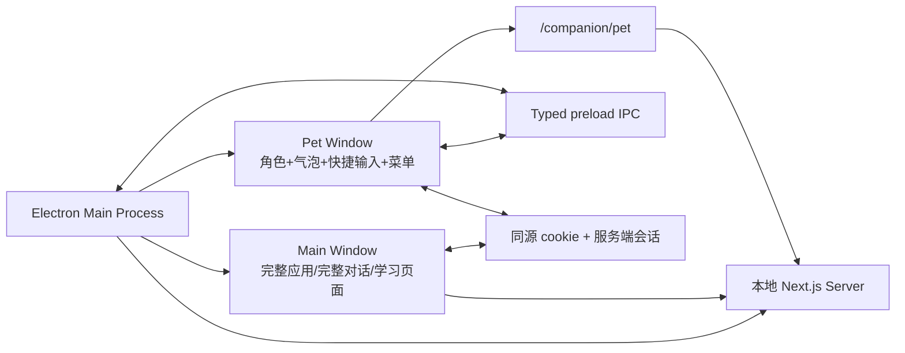

# 桌宠式 AI 学习伴星重构方案：宠物本体、微型气泡、语音与可信学习桥

> 状态：P1 Surface Prototype V2.3 已实施；活动语音已改为角色侧无大气泡的流体语音岛，外置点按式麦克风、无阴影表面和拖动平滑化均完成真实 Electron 回归，见 §22
>
> 日期：2026-08-11
>
> 当前工程审计基线：`v1.0` / `c73f9ea` + 当前未提交工作区实施结果；证据见 §22
>
> 外部源码审计：六个仓库的 README、运行时、窗口、对话、语音、动画与许可证；具体 commit 见 §3
>
> 取代范围：本方案取代 `12-companion-experience-reconstruction.md` 中“非 OS 桌宠”、`anchor → panel → stage` 和“侧板是主要交互面”的产品方向
>
> 继续有效：方案 12 中关于真实 Learning Session、独立评估、canonical write、隐私、故障恢复、真实 E2E 与发布证据的约束
>
> 阶段边界：Owner 已批准 P1、P2、P3，并另行批准 Mao PRO Live2D 作为 P4 正式运行时资产；完整 P4 性能/平台/发布 Gate、P5 学习能力和 P6 发布候选仍必须以真实证据验收，不能把 fixture 或单元测试冒充完成
>
> 规范实施包：[`desktop-pet-handoff/README.md`](./desktop-pet-handoff/README.md)。任何实施 Agent 必须完整读取该目录的 01–04 合同；发生细节冲突时，以 Owner 批准记录和实施包中的 `MUST / MUST NOT / Gate` 为准

---

## 0. 结论先行

用户要的不是“页面右下角放一个人物按钮”，也不是“点击人物后打开传统 AI 侧栏”。

目标产品应被重新定义为：

> **一个长期存在于桌面的 AI 学习伴星。它以角色本体为第一交互面，以角色身旁的小气泡完成日常文字/语音对话，以角色的二级菜单按需打开完整对话、学习任务和设置。**

本次重构的核心决定如下：

1. **桌面端是真桌宠。** Electron 新增透明、无边框、可置顶、可穿透的 Pet Window；不再把网页内固定按钮冒充桌宠。
2. **角色与微型气泡是常态界面。** 用户输入、AI 流式回复和 AI 主动消息在角色身旁的小气泡内完成；活动录音/识别只使用贴近外置麦克风的紧凑语音岛，不占用对话气泡；完整消息列表绝不自动弹出。
3. **完整对话是二级界面。** 从角色二级菜单打开主应用的“完整对话”页面；v1 负责历史、长内容、引用和任务详情，而不是常驻在桌面上。二进制附件与全局检索需另立上传、扫描和索引合同，不属于 P0–P6。
4. **桌面只增加一个透明 Pet Window。** 角色、气泡、快捷输入和二级菜单同窗渲染，避免多个透明窗口的位置同步、焦点竞争和跨屏漂移；现有 Main Window 继续承载完整对话和学习页面。
5. **文字与语音共享同一个对话回合。** 第一阶段采用点按开始、再次点按结束的半双工语音；AI 播报时暂停收音，支持用户主动打断；常开麦克风不是默认能力。
6. **AI 对话与学习真相分层。** 日常陪伴回复可以快速、自然、有人设；任何学习会话创建、回答锁定、评估、Commit、掌握度或调度变更都必须走现有可信服务和明确确认。
7. **角色表现由高层语义驱动。** LLM 只能给出 `emotion / intent / intensity / actionCue`；本地表现引擎负责 VAD、FACS、Idle、眨眼、注视、口型和参数钳制，不能让模型直接写任意 Live2D 参数。
8. **目标角色技术选 Live2D，现有八姿态图只做过渡。** 当前参考图是带棋盘背景的低分辨率动作表，不是可直接绑定的透明分层原画；生产资产必须经过权属确认、真透明清理、分层补绘和人工绑定。
9. **参考项目只提取技术，不复制产品。** MIT/Apache 项目可在履行 NOTICE/许可证义务后选择性复用；两个 GPLv3 项目只做洁净室架构参考，不复制代码、样式或资源。
10. **先做可验证的桌宠纵切，再接学习能力。** P0 只证明透明窗口技术可行，P1 只交付 Surface Prototype；第一个可称为可用桌宠的里程碑是 P0–P3，必须同时具备真实文字对话、完整历史、点按切换录音、ASR/TTS 和打断。不能把后端模块存在、测试图窗口或 fixture 气泡称为桌宠已完成。

---

## 1. 产品定义与不可妥协的体验合同

### 1.1 一句话产品定义

学习伴星是用户桌面上的一个可交互 AI 角色，而不是附着在某个页面上的帮助面板。

### 1.2 第一交互面

正常状态下屏幕上最多出现：

- 角色本体；
- 角色身旁一个小气泡；
- 用户主动唤出的紧凑输入条或二级菜单；
- 必要的麦克风、思考、播报和错误状态指示。

以下界面不得因普通点击角色而自动出现：

- 全高右侧栏；
- 全屏学习舞台；
- 完整聊天记录；
- 大型设置卡片；
- 页面帮助清单。

### 1.3 用户旅程合同

#### 日常文字对话

1. 用户单击角色或气泡；
2. 角色旁展开一行输入框；
3. 用户输入并发送；
4. 气泡立即显示用户消息已收到和 `thinking` 状态；
5. AI 回复按 token/句子流式写入同一气泡；
6. 长回复只在气泡中显示短预览，完整内容已写入历史；
7. 用户若需要上下文，从角色菜单选择“完整对话”。

#### 日常语音对话

1. 用户点按角色旁的外置麦克风开始录音；麦克风不放在 composer 内，也不要求长按；
2. 首次使用由明确用户手势触发系统麦克风授权；
3. 外置麦克风旁展开无阴影的 Siri 式流体语音岛，显示聆听声纹、录音状态和“再点一下结束”提示；活动语音不再生成大气泡或图表式卡片；
4. 用户再次点按麦克风后结束录音并进入识别；同一流体核心原地收束为识别脉冲，逐字稿先回填为可编辑文字；
5. AI 文字回复仍在气泡流式展示，并按偏好播报；
6. 播报期间麦克风暂停，用户点按麦克风可打断播报并开始新回合。

#### AI 主动发来消息

1. 角色以轻量动作和短气泡提示，不抢焦点、不自动打开主应用；
2. 普通提示在可读时长后淡出；
3. 重要或较长内容显示摘要与“查看完整内容”；
4. 用户点击后才打开完整对话或对应学习页面；
5. DND、静音、暂停建议和通知边界继续服从现有账号状态。

#### 打开完整对话

1. 右键、长按角色或单击菜单触点，打开角色二级菜单；
2. 选择“完整对话”；
3. Electron 显示并聚焦已有 Main Window，导航到 `/companion/conversations`；
4. 页面展示会话列表、完整历史、长内容、引用和任务结果；
5. 关闭或隐藏 Main Window 后，Pet Window 继续存在。

### 1.4 产品不变量

- 宠物本体是身份，不是打开面板的图标。
- 气泡是默认消息面，不是 toast，也不是缩小版完整聊天页。
- 历史记录永远按需打开，不因新消息自动展开。
- 输入、转写、思考、播报、打断均有可见状态。
- 角色动作只能表达真实运行时状态，不能伪装“已评估”“已保存”“已掌握”。
- 日常聊天内容不是学习事实，也不能直接改变 canonical 学习状态。
- 语音不是唯一输入；无麦克风、拒绝授权、ASR 失败时始终可文字继续。
- 浏览器环境不冒充 OS 级桌宠，应明确降级为应用内固定角色。

---

## 2. 当前工程偏离点与重构判定

### 2.1 当前实际结构

当前 Web Companion Runtime 的唯一表面状态是：

```text
hidden ↔ anchor ↔ panel ↔ stage
```

实际生产接线只完成了其中一小段：

```text
CompanionRuntimeProvider
  ├─ hidden → null
  ├─ anchor → 右下角 40px 按钮
  └─ panel  → 桌面全高右侧板 / 移动端底部 sheet
```

当前 Electron 只有一个普通窗口：

- `1440 × 900`；
- 有常规应用框架；
- 不透明；
- 不置顶；
- 不跳过任务栏；
- 无宠物窗口；
- preload 没有宠物窗口控制能力；
- 关闭所有窗口即退出应用。

当前语音能力是页面表单式能力：

- `/voice/transcribe` 接收完整音频文件后返回文本；
- `/voice/tts` 返回完整 MP3；
- `VoiceInputPanel` 面向正式学习回答与 transcript 确认；
- 没有桌宠对话所需的 listening/thinking/speaking/interrupted 连续状态机；
- 没有对话级流式音频队列和回声抑制边界。

### 2.2 为什么不能继续补当前 Panel

| 当前假设 | 新目标 | 冲突结果 |
| --- | --- | --- |
| 角色是固定入口 | 角色是常驻第一交互面 | 组件职责反转 |
| 点击后进入 panel | 点击后就地输入/对话 | 主交互路径反转 |
| panel 承载消息与动作 | 小气泡只承载当前回合 | 信息架构反转 |
| stage 是主要学习空间 | 主应用页面按需承载学习 | 窗口所有权反转 |
| Web App 是唯一壳 | Electron Pet Window 是桌面主表面之一 | 进程边界缺失 |
| 语音是一次文件上传 | 语音是可打断的对话状态机 | 运行时模型缺失 |
| 静态动作图代表角色状态 | 连续 Idle/注视/口型/情绪构成生命感 | 表现层缺失 |

因此本次不是换皮，而是以下五层一起重建：

1. 产品 surface；
2. Electron 窗口与 IPC；
3. 对话运行时与持久化；
4. 语音状态机；
5. 角色渲染与表现引擎。

### 2.3 保留、替换与删除候选

#### 保留

- `user_companion_account_state` 的全局启用、presence、动画/语音关闭与通知边界；
- onboarding、邀请预算、审计和跨设备 CAS 的服务端不变量；
- Learning Session、Episode、Artifact、Assessment、Commit 与 Worker 的可信边界；
- 正式学习回答使用的 Voice Artifact 治理；
- Owner 指定角色的八姿态静态图，作为迁移期身份 fallback；
- 现有 Main Window 和完整 Web 应用。

#### 替换

- `CompanionRuntimeProvider` 的 `anchor/panel/stage` 单状态模型；
- `CompanionAnchor`；
- `CompanionPanel` 作为常态入口；
- `pageHelpModel` 的静态帮助内容；
- `AppShell` 内直接挂载桌面版 Companion 的方式；
- 角色只按页面动作切换整张 PNG 的表现方式。

#### 后续确认删除

旧组件只有在新桌宠纵切、浏览器 fallback、迁移回滚和真实 E2E 全部通过后才能删除。方案确认阶段和前两个实现阶段都不得提前清理旧代码。

---

## 3. 六个参考项目的源码结论

### 3.1 调研快照

| 项目 | 审计 commit | 许可证 | 本方案使用方式 |
| --- | --- | --- | --- |
| [EchoBot](https://github.com/KdaiP/EchoBot) | `08e97a4a33b2ab611d24dd997038c1ec95ac6926` | MIT | 可借鉴/选择性改写，保留许可声明 |
| [AIRI](https://github.com/moeru-ai/airi) | `98fa1f0855bd18f1af67cb773d7b05b01e0b3790` | MIT | 可借鉴桌宠窗口、对话运行时和语音生命周期 |
| [Soullink Emotion SDK](https://github.com/nanlingyin/soullink-emotion-sdk) | `06aec408beb4aa2f45971124d57c95bd1373a3a6` | MIT | 候选表现引擎；必须包在本项目 adapter 后并锁版本 |
| [Meochat-APP](https://github.com/Mios-dream/Meochat-APP) | `c2e0f59a392dda1440d6da758360afe1f39f921c` | GPLv3 | 只做洁净室行为/架构参考，不复制代码和资源 |
| [MoeChat](https://github.com/AlfreScarlet/MoeChat) | `f3707e9bae73196dda41820abe0a53c6021269c9` | GPLv3 | 只做洁净室流式管线参考，不复制代码和资源 |
| [see-through](https://github.com/shitagaki-lab/see-through) | `7f139bb25c46a0c8ac720d95ddab185fcda5451c` | Apache-2.0 | 仅作离线原画分层工具候选，保留 NOTICE/专利条款 |

以上 commit 是方案写作时的源码快照，不应在实施中自动跟随主分支。任何直接依赖都必须重新做版本、许可证、供应链和安全审计。

### 3.2 EchoBot：快回复与慢任务必须分层

源码中的 `Decision → Roleplay → Agent` 三层是最适合学习伴星吸收的部分：

- 规则与轻量分类先决定当前消息是闲聊还是需要真实动作；
- Roleplay 层只看干净对话上下文，快速给出自然回复；
- Agent 在后台执行文件、工具或其他慢任务；
- 需要后台执行时，角色先给一个不虚假承诺的短确认，完成后再汇报真实结果；
- 会话锁、后台 job、取消、重试和结果回传有明确边界。

映射到本项目：

- `Dialogue`：日常对话与当前气泡回复；
- `Learning Action Router`：判断是否只是聊学习，还是要创建/继续真实学习会话；
- `Learning Service`：唯一可执行学习状态变更的一层；
- `Presentation`：把真实学习服务结果转换成角色口吻，但不得改变事实。

不采用：

- 给桌宠开放任意系统文件与 shell 权限；
- 把完整生产力 Agent 的工具列表塞入每个日常对话；
- 由角色话术宣称未完成的学习动作已完成。

### 3.3 AIRI：桌宠窗口、完整聊天窗和运行时解耦

AIRI 的 Stage Tamagotchi 源码验证了以下设计：

- 透明、无边框、可置顶窗口承载角色舞台；
- 完整聊天使用独立普通窗口，不挤进角色舞台；
- 角色窗口通过像素/几何命中决定是否把鼠标事件传给下层应用；
- 位置与尺寸是设备侧窗口状态；
- chat orchestrator 是无 UI 的核心运行时，Pinia/Vue 只是 adapter；
- streaming message 与 durable session history 分开；
- 语音输入在 AI 播报期间停止，并在播报结束后经过冷却再恢复，防止自我转写；
- Live2D 口型、眨眼、眼神和表达覆盖层有清晰优先级。

本方案采用：

- Pet Window 与完整对话页分离；
- 对话核心不依赖 React；
- 可恢复的事件流与 durable history；
- AI speech suppression + cooldown；
- renderer adapter 和表现参数优先级。

本方案不采用：

- 第一阶段同时支持 Live2D、VRM、Spine、MMD、Godot 等多渲染器；
- 默认屏幕捕获、游戏控制、前台应用感知；
- 为简单学习伴星引入完整插件平台和多种 overlay window。

### 3.4 Soullink Emotion SDK：把“情绪”变成受控的本地表演

Soullink 的核心价值不是再提供一个聊天 UI，而是提供框架无关的角色表现层：

- 连续 VAD（valence/arousal/dominance）情绪状态；
- FACS / Action Unit 到模型参数的映射；
- 可复现的 Idle 调度、呼吸、微动、眨眼、注视与防重复；
- measured RMS/peak 口型，失败时回退合成口型；
- 模型 profile、能力检测、参数范围与平滑；
- planner、TTS、audio、clock、renderer 都是可替换 port；
- 新请求通过 request id 抢占旧反应/旧语音，避免迟到结果污染当前表现。

实施建议：

- 只把 `@soullink-emotion/engine` 作为候选表现引擎；
- 通过本项目 `CharacterPerformancePort` 隔离，锁定 `0.1.0-beta.1` 或审计后的确切版本；
- 不让 `runtime-core` 接管本项目对话、学习会话或服务端真相；
- `planner-openai` 只能在可信服务端或离线资产工具中使用，浏览器不得持有模型密钥；
- 模型 profile 生成后必须人工校验，不能把猜测的参数映射直接投入生产。

### 3.5 Meochat-APP：透明像素穿透与播放队列的工程细节

Meochat-APP 的代码提供了可验证的桌宠工程样本：

- `assistant` 是 `frame:false / transparent:true / alwaysOnTop:true / skipTaskbar:true` 的窗口；
- chat、tips、settings 被拆成不同窗口；
- 透明像素命中后调用 `setIgnoreMouseEvents`；
- Linux 下 `forward` 行为不一致，因此使用光标轮询恢复交互；
- WebSocket 文本、音频、动作被归一为可串行播放 segment；
- 音频 analyser 驱动 `ParamMouthOpenY`；
- 中断 token 同时终止音频队列和动作曲线；
- Live2D 点击、抚摸、拖动、注视被拆成独立 controller。

本方案只洁净室采用这些原则，因为该仓库是 GPLv3：

- 透明窗口需要主动穿透，透明 CSS 本身不等于可点击下层；
- 文本、音频、动作必须由一个播放协调器排序；
- 点击、拖动、菜单、输入时必须暂时禁用穿透；
- 跨平台命中策略必须有降级，不依赖 `forward:true` 在所有 Linux 环境有效。

不采用：

- 三个以上悬浮窗口之间持续同步坐标；
- `uiohook`、`robotjs` 和常驻全局鼠标监控作为 MVP 依赖；
- 每 150ms 强制 WebGL render + `readPixels` 作为唯一命中机制；
- 常开麦克风作为默认设置。

### 3.6 MoeChat：句子级低延迟文本/TTS 流

MoeChat 的低延迟管线使用两个并行任务：

```text
LLM token stream
  ├─ 立即发 text event
  └─ 句子切分 → TTS queue → audio event
```

它还根据文本情绪选择不同参考音频，并在 SSE 中交错发送文本、音频与完成事件。

本方案洁净室采用：

- 文本 token 立即进入气泡；
- 稳定句子形成后立刻进入 TTS，不等整段回复完成；
- TTS segment 保留顺序、可取消、可丢弃旧 generation；
- 情绪只影响审核过的 voice/style 选择，不让模型提供任意音频路径。

不采用：

- 直接复制 GPLv3 的切句、队列和 SSE 实现；
- 把情绪标签埋在用户可见文本里；
- 将任意本地参考音频路径交给客户端或模型；
- 把陪伴记忆与 canonical 学习事实混为一体。

### 3.7 see-through：只能辅助分层，不能自动生成 Live2D

see-through 可以把单张动漫人物图拆成最多约 23 个语义图层并推断前后顺序，输出分层 PSD。它适合解决被头发、衣服、手臂遮挡区域的离线补图起点。

它明确不提供：

- Live2D rig；
- art mesh；
- deformation；
- physics；
- motion curve；
- 角色艺术意图校正。

因此它只能出现在离线资产流水线中，不能成为客户端运行时依赖。其推理显存需求也不适合普通用户设备。

---

## 4. 目标 Surface：角色、气泡、二级菜单、完整对话

### 4.1 Desktop Pet Window

P1 冻结的窗口摘要如下；精确坐标、缩放档位和 visual token 以 [`desktop-pet-handoff/01-product-ux-character-contract.md`](./desktop-pet-handoff/01-product-ux-character-contract.md) 为准：

| 属性 | 默认值 | 原因 |
| --- | --- | --- |
| 内容尺寸 | `560 × 520` content pixels | 同窗容纳角色与左右气泡，不跨窗同步 |
| `frame` | `false` | 无系统边框 |
| `transparent` | `true` | 角色外区域透明 |
| `resizable` | `false` | Electron 透明窗口在部分平台不可可靠缩放 |
| `hasShadow` | `false` | 避免透明矩形阴影 |
| `skipTaskbar` | `true` | 宠物不占普通任务栏入口 |
| `alwaysOnTop` | 用户可切换，首次默认 `true` | 符合桌宠预期，同时给用户控制权 |
| `focusable` | `true`，默认 `showInactive()` | incoming bubble 不抢焦点，输入时仍可聚焦 |
| `fullScreenable` | `false` | 不参与普通全屏流程 |
| `contextIsolation` | `true` | Electron 安全边界 |
| `nodeIntegration` | `false` | Renderer 不持有 Node 权限 |
| `sandbox` | `true`，若依赖不兼容则必须有记录与隔离方案 | 降低 Web renderer 权限 |

窗口内布局不是“大透明画布随便摆”，而是稳定槽位：

```text
┌──────────────────────────────────────────────┐
│ [左气泡槽]        [右气泡槽]                 │
│                                              │
│                [角色命中区]                  │
│                 [拖动触点]                   │
│          [输入条 / 二级菜单临时槽]            │
└──────────────────────────────────────────────┘
```

渲染器根据窗口接近屏幕左/右边缘自动选气泡方向，角色锚点不变。

### 4.2 微型气泡合同

气泡只显示“当前需要用户看见的一个回合表面”，不是消息列表。

#### 展示规格

- Desktop 宽度：`288px`；compact fallback 最大 `min(360px, calc(100vw - 16px))`；
- ambient/incoming：最多 3 行；
- 用户主动对话：当前 preview 最多 6 行；
- 长内容显示结尾渐隐与“查看完整内容”；
- streaming 时只更新当前 assistant turn，不堆叠多个卡片；
- final 后停留时长按字数估算，最短 4 秒、最长 12 秒；
- 用户 hover、键盘焦点、正在播报或 composer 打开时不自动消失；
- content-hidden/手动隐私模式只显示“伴星有一条消息，内容已隐藏”，不显示主动消息正文。

#### 气泡状态

```text
proactive：hidden → incoming → hidden
用户回合：hidden → turn/client(已收到) → turn/run(thinking → streaming → final) → hidden
高优先级覆盖：error / confirmation / voice_status
```

这只是 Bubble 的可见内容序列，不是总运行时枚举；composer、voice、menu、window 与 turn 正交，不能再次合并成互斥 `surface` 状态。

#### 气泡内容优先级

1. 麦克风/权限/录音错误；
2. 用户主动回合；
3. 学习动作确认；
4. 真实任务完成结果；
5. 主动学习建议；
6. ambient 闲聊与装饰性动作。

低优先级消息不能覆盖用户正在输入或正在阅读的高优先级消息。

### 4.3 快捷文字输入

- 单击角色：若无活跃气泡，打开问候/输入入口；若有气泡，切换 composer；
- composer 是单行/最多三行的紧凑输入，不显示历史；
- Enter 发送，Shift+Enter 换行，Esc 收起；
- 发送后立即清空输入并显示本地确认；
- 支持“停止回复”；
- Pet 不提供附件入口；二进制附件不属于 P0–P6，未来若实现只能放在完整对话页并先补上传、恶意文件扫描、配额、保留与导出合同；
- 用户草稿只存在 renderer 内存，除非明确发送，不写审计或日志。

### 4.4 角色二级菜单

“二级菜单”定义为从角色本体唤出的紧凑 popover，不要求使用难以键盘操作的纯径向菜单。

根层：

- 说句话；
- 语音对话（点按开始、再次点按结束）；
- 学习；
- 更多。

“学习”子层：

- 继续当前学习；
- 开始一小段学习；
- 今日复习；
- 回到当前卡片。

“更多”子层：

- 完整对话；
- 关闭自动播报 / 恢复自动播报；
- 隐私模式开关；
- 锁定/解锁位置；
- 置顶开关；
- 暂时隐藏；
- 设置；
- 退出桌宠模式。

隐私模式由用户手动开启，默认关闭且只保存在当前设备。它不通过截屏、录屏、前台窗口、进程列表或其他应用内容自动推断；开启时仅隐藏主动消息正文并禁止其自动 TTS，不隐藏用户主动发起的 composer 与完整对话内容，也不在关闭后自动补播。

无障碍要求：

- 所有项可 Tab/方向键到达；
- Esc 逐级返回；
- 有正确 role、aria-label 和焦点恢复；
- 右键和长按只是快捷入口，不是唯一入口；
- reduced motion 下不使用旋转、弹跳来表达菜单层级。

### 4.5 完整对话页

新路由：`/companion/conversations`。

职责：

- 会话列表与新建会话；
- 完整消息历史；
- assistant streaming 的长内容；
- 工具/学习动作状态；
- 引用；二进制附件延期，不得由实施 Agent 自行增加上传；
- 会话列表、删除、导出与保留策略；全局检索延期；
- transcript；历史消息语音重播延期，P3 只播报当次新 segment；
- 从任务结果跳到对应学习页面。

不职责：

- 控制 Pet Window 的每帧动画；
- 直接写 canonical 学习事实；
- 以打开完整页为普通对话的必要前提。

### 4.6 浏览器与移动端降级

#### 浏览器桌面

- 复用同一 Pet React surface；
- `position: fixed` 在应用视口内；
- 气泡、composer、二级菜单行为相同；
- 无 OS 置顶、跨应用显示、任务栏和透明窗口穿透；
- 完整对话通过同路由打开。

#### 移动端

- 本节是 P0–P6 之后的 future fallback，不属于当前阶段 Gate；实施 Agent 不得在桌宠阶段顺手扩张移动端范围；
- 不模拟可拖动桌宠覆盖整个页面；
- 角色固定在安全区边缘；
- 气泡使用紧凑 bottom popover；
- 完整对话进入正常页面；
- 语音仍为点按切换录音；
- 不能遮挡底部导航、提交按钮和系统手势区。

---

## 5. 新运行时状态模型

旧模型把 surface 强制成互斥的 `anchor/panel/stage`，无法表达“角色在说话时菜单也可打开、用户可同时编辑下一条消息、主窗口可隐藏”。运行时必须改为七个正交业务域加 context：

```ts
interface PetRuntimeStateV1 {
  lifecycle: PetLifecycleState;
  turn: ConversationTurnState;
  bubble: BubbleDisplayState;
  composer: ComposerState;
  voice: VoiceDialogueState;
  menu: PetMenuState;
  window: PetWindowInteractionState;
  context: PetRuntimeContext;
}
```

### 5.1 唯一状态真相

- Lifecycle 只回答 surface 是否应运行；
- Turn 是 assistant generation 的唯一状态，拥有 `thinking/streaming/acting`；
- Bubble 只选择当前内容来源，不复制 assistant text 或 draft；
- Composer 独立保存 draft，因此可以在 assistant streaming 时编辑；
- Voice 只拥有麦克风、转写与播放状态，不保存 `thinking`；
- Menu 与 Bubble 可以并存；
- Window Interaction 由主进程命中控制器裁决；
- Character 不保存业务状态，只消费 `deriveCharacterPresentation(state)` 的派生结果。

### 5.2 强制不变量

- `listening` 与 `speaking` 不同时为真；
- `text_input` 时窗口不得忽略鼠标或键盘；
- `dragging` 时不触发角色点击、抚摸或菜单；
- 新 `runId/generation` 生效后，旧 delta、旧 TTS 和旧动作全部丢弃；
- `hidden/suspended/auth_required/fatal` 必须停止动画 ticker、麦克风、音频和非必要网络连接；
- `voiceOff` 只关闭 TTS，不关闭文字回复；
- `animationOff` 保留静态角色和所有语义状态文字；
- `globalEnabled=false` 关闭 Pet surface，但不删除对话历史和学习事实；
- Main Window 是否可见不决定 Pet Window 是否存在。

完整类型、事件、转移矩阵、跨窗口播放 leader、点击穿透与生命周期资源释放合同，以 [`desktop-pet-handoff/02-runtime-window-state-contract.md`](./desktop-pet-handoff/02-runtime-window-state-contract.md) 为唯一实现依据。本节只保留架构摘要，实施 Agent 不得从摘要重新发明状态类型。

---

## 6. 桌面端进程与窗口架构

### 6.1 推荐拓扑



明确不新增独立 Bubble Window、Tips Window 或 Settings Window。需要完整内容时复用 Main Window。

### 6.2 Pet Window 生命周期

1. Next.js 本地服务健康后创建 Main Window；
2. 用户账号状态 `globalEnabled=true` 且本机 pet preference 开启时创建 Pet Window；
3. Pet Window 加载同源 `/companion/pet?surface=electron`；
4. `ready-to-show` 后使用 `showInactive()`，不抢当前应用焦点；
5. Main Window 关闭时若桌宠开启，则隐藏 Main Window，不退出应用；
6. 菜单“完整对话/设置/学习”通过 IPC 显示 Main Window 并导航；
7. 只有 Electron 原生 App menu、Dock/System Quit 或 `Cmd+Q` 的明确退出才停止 Pet Window、Next server 和后台连接；Pet 菜单与 renderer preload 不暴露整应用 quit；
8. 单实例唤醒时优先显示 Pet Window 的短提示，并按用户操作显示 Main Window。

### 6.3 点击穿透

Electron 官方说明透明窗口本身不能让透明区域自动点击穿透；需要 `setIgnoreMouseEvents`。本项目采用“交互区域注册 + 宠物命中 mask”的组合，不把 GPU 单像素读取作为唯一方案。

#### 交互区域

Renderer 每次布局变化向 preload 发布：

- bubble DOM rect；
- composer DOM rect；
- menu DOM rect；
- drag handle rect（辅助入口）；
- character coarse bounds；
- 当前 character alpha hit-mask version。

#### 命中流程

1. 主进程以低频光标位置检查判断是否接近任何 coarse interactive rect；
2. 不接近时 `setIgnoreMouseEvents(true, { forward: true })`；
3. 进入 coarse character bounds 时恢复事件；
4. Renderer 对静态 PNG 使用预计算低分辨率 alpha mask，对 Live2D 使用 drawable mesh/hit area；
5. 命中真实透明点时再次进入 ignore；
6. bubble/menu/composer 打开时其 DOM rect 永远可交互；
7. 输入、菜单操作和拖动期间强制 interactive；
8. Linux 不假设 `forward:true` 可用，使用主进程光标轮询恢复；Wayland 作为独立平台 Gate。

不得：

- 因 560×520 透明矩形阻断其下所有应用；
- 在主线程每帧 `readPixels`；
- 在用户不知情时注册全局键盘钩子；
- 用任意网页消息直接切换任意 Electron 窗口权限。

### 6.4 拖动与屏幕边界

MVP 同时支持“直接抓住角色拖动”和明确拖动触点，不引入 native click-drag plugin：

- 角色真实 alpha 命中区域既是主点击区，也是直接拖动区；角色底部/菜单另提供可见、可聚焦的 drag handle 作为辅助入口；
- 角色本体需要保留 click/right-click/long-press，不能整块使用 Electron `app-region: drag`；Renderer 以 `8 CSS px` 阈值仲裁，超过阈值后进入 `dragging` 并通过 typed preload `dragBy` 移动窗口；
- 进入拖动后取消 long-press 并抑制随后 click/menu；未越阈值松开仍只按一次角色点击处理；
- `locked=true` 时角色仍可短按和打开菜单，但直接拖动与 drag handle 移动均失效；位移已超过 `8 CSS px` 的锁定拖动尝试必须抑制 click，不能在抬手时误开 composer；
- 不使用全局鼠标 hook；pointercancel、窗口失焦和生命周期切换必须退出 dragging；
- 保存 `{ displayId, normalizedX, normalizedY, scaleFactor, petScale }`；
- 位置按 display workArea 和 DPI 归一化，不只保存绝对像素；
- 显示器拔插、分辨率/DPI 变化、任务栏位置变化时重新 clamp；
- 至少保留角色 60% 在 workArea 内，并提供“回到屏幕”命令；
- 位置是 device-local，不跨设备写入账号表。

### 6.5 Typed Preload API

Renderer 只暴露窄接口：

```ts
interface DesktopPetApiV1 {
  getCapabilities(): Promise<DesktopPetCapabilitiesV1>;
  getDeviceSessionId(): Promise<string>;
  getWindowState(): Promise<DesktopPetWindowStateV1>;
  registerHitGeometry(input: PetHitGeometryV1): Promise<void>;
  setInteractionMode(mode: "passive" | "interactive" | "text_input" | "dragging" | "accessibility_focus"): Promise<void>;
  dragBy(deltaX: number, deltaY: number): Promise<void>;
  requestTextInputFocus(): Promise<void>;
  setPetModeEnabled(enabled: boolean): Promise<void>;
  setAlwaysOnTop(enabled: boolean): Promise<void>;
  setLocked(enabled: boolean): Promise<void>;
  setPetScale(scale: 0.85 | 1 | 1.15 | 1.25): Promise<void>;
  setPrivacyMode(enabled: boolean): Promise<void>;
  moveToSafePosition(): Promise<void>;
  openMainRoute(route: AllowedMainRouteV1): Promise<void>;
  reportBootstrap(result: PetBootstrapResultV1): Promise<void>;
  hidePet(): Promise<void>;
  onWindowStateChanged(cb: (state: DesktopPetWindowStateV1) => void): () => void;
  onLifecycleEvent(cb: (event: DesktopLifecycleEventV1) => void): () => void;
}
```

安全规则：

- 不暴露原始 `ipcRenderer.send/on/invoke`；
- 每个 IPC 校验 sender window id、sender frame URL 和 payload schema；
- `openMainRoute` 只接受枚举路由，不接受任意 URL；
- Pet Window 禁止导航到非本地应用 origin；
- 外链仍经 allowlist 和系统浏览器；
- preload、main、renderer 共用 `@ailearn/shared` 合同；
- 为 Pet Window 单独设置 CSP 和权限请求处理；
- 麦克风权限只允许本地可信 Pet/Main route 发起。

刻意不向 renderer 暴露 `setIgnoreMouseEvents`。主进程只能根据校验后的 bounded geometry 和 interaction mode 决定穿透；完整合同见 [`desktop-pet-handoff/02-runtime-window-state-contract.md`](./desktop-pet-handoff/02-runtime-window-state-contract.md)。

---

## 7. 对话运行时与服务端边界

### 7.1 三个彼此隔离的域

| 域 | 负责 | 不负责 |
| --- | --- | --- |
| Companion Conversation | 日常文本、语音、历史、角色回复、当前回合 | 掌握度、正式评估、调度真相 |
| Character Performance | emotion/VAD/FACS/Idle/口型/动作 | 生成学习事实、执行业务动作 |
| Learning Session | 创建/恢复 Episode、回答、评估、Commit、返回来源 | 日常闲聊历史和人设表演 |

### 7.2 服务端对话编排

推荐新增 `CompanionDialogueOrchestrator`：

```text
User turn
  → 输入校验/幂等
  → Dialogue Router
       ├─ casual_chat       → 快速角色回复
       ├─ learning_question → 无 mutation 的 bounded/grounded 文字解释
       └─ learning_action   → P5 typed action proposal + user confirmation
  → streamed reply events
  → durable final message
  → optional TTS/performance cues
```

#### Router 输出

```ts
type DialogueRouteV1 =
  | { kind: "casual_chat" }
  | { kind: "learning_question"; entityRefs: string[] }
  | { kind: "learning_action"; payload: ProposedLearningActionPayloadV1 };
```

P2 只允许前两种并只产生文字；P5 才允许第三种，payload 必须来自 03 合同的候选集、strict schema 与实时重新解析。明确菜单导航/本地开关绕过 LLM，直接走 typed IPC 或既有 account endpoint；自然语言不得直接执行系统命令。模糊自然语言才进入受限分类。

### 7.3 快回复与慢动作

借鉴 EchoBot，但收紧到学习域：

- 日常聊天直接流式回复；
- 创建学习会话、生成学习场景或等待 Worker 时，角色先说“我来准备一下”；
- 该确认只代表已接收，不代表任务成功；
- 后台动作产生 durable run；
- 完成后用真实结果生成展示话术；
- 失败后保留真实错误和重试入口；
- 角色 presentation 不得修改 ID、状态、时间、警告、置信度或失败事实。

### 7.4 消息与事件合同

消息使用 versioned content blocks，不使用单一无界 `content` 字符串；流事件使用完整 discriminated union，不允许各端对 `payload: unknown` 自行断言。每个事件至少带：

- `eventId`；
- `seq`；
- `conversationId`；
- `runId`；
- `generation`；
- `accountEpoch`；
- `createdAt`；
- 严格 schema payload。

客户端以 `(conversationId, runId, generation, seq)` 去重和拒绝迟到事件。

权威的 Conversation、Message、Turn、Character cue、SSE envelope、全部 payload、错误码和上限见 [`desktop-pet-handoff/03-conversation-api-data-proactive-contract.md`](./desktop-pet-handoff/03-conversation-api-data-proactive-contract.md) §2–§6。该合同的 shared Zod schema 是唯一 wire truth。

### 7.5 Transport

#### 文本 MVP 核心路由摘要

- `POST /companion/conversations/:id/turns`：持久化用户消息并创建 run；
- `GET /companion/conversations/:id/events?after=<seq>`：SSE，支持 Last-Event-ID 恢复；
- `POST /companion/runs/:id/cancel`：取消当前 run；
- `GET /companion/conversations`：完整对话页列表；
- `GET /companion/conversations/:id/messages`：分页历史。

创建/删除 conversation、proposal decision、proactive delivery、导出、分页参数和错误响应以 03 合同的完整 API 表为准。Web 使用同源 `/api/...`，Fastify 实际 route 不带 Next rewrite 的 `/api` 前缀。

不把整个回复绑定在一次不可恢复的 POST fetch stream 上。Pet Window 隐藏、Main Window 打开、Renderer reload 后都应从 durable cursor 恢复。

#### 语音后续

流式 ASR 才使用独立 WebSocket；文字/动作事件仍以同一规范化 event envelope 进入运行时。

### 7.6 数据模型摘要

新增表应与学习事实分开：

- `companion_conversations`；
- `companion_messages`；
- `companion_turn_runs`；
- `companion_stream_events`（P2 必需，短 TTL 只作用于 event，不删除 durable message/run）；
- `companion_voice_artifacts`（P3 只保存转写 provenance，`raw_audio_persisted=false`）；
- `companion_proactive_deliveries`；
- P5 才新增 `companion_action_proposals` 与 `companion_action_runs`。

列、约束、索引、原子事务、RLS/roles、retention、export/delete 和 migration Gate 全部以 03 合同 §7–§13 为准。

默认 conversation 是 `user-private-in-workspace`：

- `workspace_id + user_id` 双重隔离；
- Pet Window 跟随当前登录 workspace；
- 切 workspace 时停止旧 stream、清空气泡并连接新 scope；
- 不把一个 workspace 的聊天、学习摘要或任务结果带入另一个 workspace；
- account-scoped 只保留角色偏好和桌宠启用状态，不保存跨 workspace 对话内容。

### 7.7 对话记忆

MVP 只使用：

- 当前会话最近 20 条可见消息且总计最多 12k chars；
- 预留但 P2 默认关闭的 conversation-only summary；启用前必须有独立版本、删除和回归 Gate；
- 用户明确提供的当前页面上下文；
- 可信学习投影的最小摘要。

不在 MVP 建立“长期人格记忆自动抽取”。任何后续记忆系统必须：

- 明确区分 conversation memory 与 learning truth；
- 用户可查看、编辑和删除；
- 不从拒绝、dismiss、麦克风背景或未发送草稿推断偏好；
- 不跨 workspace 泄漏；
- 不直接影响 mastery 和 scheduler。

---

## 8. 语音对话方案

### 8.1 第一阶段：点按切换录音的半双工语音

直接复用现有能力的安全部分：

- Pet renderer 仅在用户点按外置麦克风后使用 `MediaRecorder` 收集音频；
- 用户再次点按或达到 `60s` 上限后停止 track，并上传现有 `/voice/transcribe`；
- transcript 作为普通 companion user message 进入对话；
- assistant 回复文本先流式显示；
- 第一个稳定句形成后调用受控 TTS；
- 播放使用 Web Audio，以便音量、停止、analyser 和口型共享一条图；
- raw audio 只保留转写所需短期，不进入长期备份或普通日志。

这条路径足以先交付可用语音，不必在桌宠第一版同时新建流式 ASR 服务。

### 8.2 语音与对话回合时序

```text
Voice capture:
idle
  → requesting_permission
  → listening
  → finalizing
  → transcribing
  → idle

Conversation turn:
idle → submitting → running(thinking/streaming) → final → idle

Voice playback:
idle
  → speaking
  → cooldown
  → idle

Voice 任意状态 → cancelled / error
speaking + user taps mic → stop/clear/fence → listening
```

`thinking` 只属于 Turn，`speaking` 只属于 Voice；Character 的 think/speak 动作是派生表现，不是第三份状态。完整转移矩阵以 02 合同为准。

### 8.3 回声与自我转写防护

- `speaking` 前停止/暂停输入 track；
- 播放结束后增加可配置冷却，默认从 600ms spike 起步；
- 所有等待中的 VAD/ASR segment 绑定 generation；
- 进入 speaking 后生成的旧 segment 一律丢弃；
- 用户主动 barge-in 时先 stop TTS、清空 audio queue、递增本地 voice operationEpoch/audio fence，再打开麦克风；只有新 transcript 真正提交时才由服务端创建新的 conversation generation；
- 不只依赖浏览器 `echoCancellation`；它是辅助，不是状态机替代品。

### 8.4 第二阶段：低延迟流式语音

在文件式点按录音稳定后，再引入：

- `AudioWorklet` 在音频线程输出 16kHz mono PCM；
- client/server VAD；
- `WSS /companion/voice`；
- partial/final transcript；
- 句子级 TTS；
- audio segment queue；
- reconnect 与 session resume；
- provider fallback。

本节只冻结能力边界，不构成 P6 transport 实施授权。当前 `streamingVoiceTransport` 为 blocked；必须先由 Owner 批准 provider，并在 03 合同或独立 addendum 中逐字冻结 WSS URL/subprotocol、鉴权、control/binary frame、codec/sample rate、seq/ack/backpressure、resume、TTL/限额、错误、fallback 与脱敏测试，实施 Agent 不得依据下面的概念清单自行设计 wire protocol。

流式音频协议必须有：

- session id；
- generation；
- sample rate/format；
- monotonic sequence；
- start/stop/cancel 控制帧；
- server ack；
- 最大会话时长和背压；
- 过期与断线清理。

### 8.5 TTS 与角色口型

播放图：

```text
AudioBufferSourceNode
  → GainNode
  → LipSync/AnalyserNode
  → AudioDestination
```

- 静态角色阶段只显示 speaking pose/轻微呼吸，不伪造精确口型；
- Live2D 阶段用 analyser 或 phoneme worklet 驱动受控 mouth parameters；
- mouth opening 与 emotion mouth shape 分层混合；
- speech 结束后平滑闭嘴并交还给 Idle/Expression；
- stop/cancel 必须同时结束 source、口型、speaking motion 和气泡播报状态。

### 8.6 与正式学习语音严格分离

桌宠日常语音 transcript 不是正式学习答案。

只有用户在明确学习 Episode 中执行“提交为答案”，并经过现有 transcript 确认、revision、hash、lock 和 trust 流程，才能创建正式 Voice Artifact。普通聊天中说出的答案、提示或自言自语不得自动进入评估。

### 8.7 隐私默认值

- 默认点按开始、再次点按结束，默认关闭常开麦克风；
- 首次授权前解释用途；
- 录音期间 Pet 气泡和系统均有可见指示；
- 设置中可撤销设备和语音偏好；
- 拒绝权限后不循环弹窗；
- 原始音频短 TTL、no analytics、no prompt logs；
- ASR/TTS provider 继续服从 workspace region、retention、training-use 和 consent policy。

---

## 9. 角色资产与表现引擎

### 9.1 当前角色资产事实

Owner 指定参考图：

`docs/image/learning-companion-character-action-reference.png`

当前事实：

- 源图为 `700 × 1880` RGB PNG；
- 包含 8 个 `350 × 430` 动作格；
- 棋盘格已经烘焙进图像，不是真透明背景；
- 当前 public 目录中的 8 个裁切虽然文件通道是 RGBA，但肉眼仍显示棋盘背景；
- 分辨率适合身份与姿势参考，不足以直接生产高质量全身 Live2D；
- 原图、角色设计与商业使用权仍需 Owner 确认。

因此当前裁切不能被称为完成的桌宠资产。

### 9.2 两级交付策略

#### Level A：真透明静态桌宠

目标是尽快让“就是这个角色”进入 Pet Window：

- 从 Owner 原始透明高清图重新导出；若无原图，人工精修去除棋盘而非简单颜色阈值；
- 8 个 pose 输出统一透明画布、脚底基线和角色锚点；
- 生成 alpha hit-mask；
- 定义 `idle / invite / navigate / analyze / listen / think / encourage / celebrate`；
- speaking 暂用最接近 pose + 轻量呼吸/位移；
- reduced motion 只切静态 pose；
- 作为 Live2D 加载失败时的永久 fallback。

#### Level B：生产 Live2D 桌宠

推荐 Live2D，而不是 Rive/纯 CSS：

- 最符合二次元立绘保真；
- 支持头部 XYZ、眼球、眨眼、嘴形、身体摆动和物理；
- 容易保留长发、披风、导航环的视觉特征；
- 已有参考项目和 Soullink 对 Live2D 参数链路支持最好。

### 9.3 离线资产流水线

```text
权属确认 + 高清原图
  → 选定中性正面基准 pose
  → 真透明清理
  → see-through 离线分层候选
  → 人工补绘遮挡区域/拆分发丝与服装
  → Live2D Cubism Editor art mesh/deformer
  → 表情、嘴形、眨眼、物理、hit areas、motions
  → 导出 model3/moc3/textures/motions/expressions
  → profile 生成与人工校准
  → runtime 验收
```

最低分层：

- 后发/前发/侧发/发饰；
- 脸、耳、眼白、瞳孔、眼皮、眉、鼻、嘴内、上下唇；
- 颈、躯干、左右上臂/前臂/手；
- 外套、内衬、披风/彗尾、裙/短裤、腿、鞋；
- 导航环、星光、问号/分析屏等独立道具。

最低参数：

- `AngleX/Y/Z`；
- `BodyAngleX/Y/Z`；
- `EyeBallX/Y`；
- 左右眼开合；
- 左右眉形；
- `MouthOpenY` 与 mouth form；
- 呼吸；
- 头发/披风/挂饰 physics；
- 导航环显隐/旋转；
- 至少 8 个情绪 expression 和 8 个动作 cue。

### 9.4 Character Driver Port

业务层只依赖统一接口：

```ts
interface CharacterDriver {
  load(manifest: CharacterManifest): Promise<void>;
  setPresence(state: PetPresenceState): void;
  applyCue(cue: CharacterCue): void;
  setLookTarget(target: NormalizedPoint | null): void;
  setSpeechLevel(level: number): void;
  hitTest(point: Point): CharacterHit | null;
  pause(): void;
  resume(): void;
  destroy(): void;
}
```

实现：

- `SpriteCharacterDriver`：Level A；
- `Live2DCharacterDriver`：Level B；
- 测试用 `NullCharacterDriver`。

### 9.5 Character Performance Port

```ts
interface CharacterPerformancePort {
  update(now: number, dt: number): CharacterFrame;
  react(cue: CharacterCue): void;
  setSpeaking(active: boolean): void;
  setAudioLevel(level: number, peak?: number): void;
  interrupt(generation: number): void;
}
```

Soullink 只实现此 port。即使未来替换 SDK，对话、窗口和学习服务也不变。

### 9.6 高层 cue 合同

```ts
interface CharacterCue {
  generation: number;
  intent:
    | "acknowledge"
    | "listen"
    | "think"
    | "explain"
    | "encourage"
    | "celebrate"
    | "uncertain"
    | "warn"
    | "sleep";
  emotion: "neutral" | "happy" | "curious" | "concerned" | "surprised";
  intensity: number; // 0..1, server/client 均钳制
  durationMs?: number;
}
```

LLM 不得返回：

- 任意模型文件路径；
- 任意 parameter id；
- 超范围 parameter value；
- 任意 motion URL；
- 任意音频路径；
- “评估成功/掌握提升”等无真实系统事件支撑的 cue。

### 9.7 渲染性能与降级

- Idle 目标 30fps，活跃/说话目标 60fps，可配置；
- Pet Window hidden/occluded/系统休眠时暂停 ticker；
- battery saver 自动降到静态/15–30fps；
- `animationOff` 使用 Sprite fallback；
- WebGL context lost 时恢复一次，失败后切 Sprite；
- 模型加载采用 latest-wins token，旧 load 完成不得覆盖新角色；
- 每次切换销毁纹理、音频节点、RAF、listener 和 hit mask；
- 建立 idle CPU、active CPU、GPU、内存和首帧耗时基线后再冻结发布预算。

---

## 10. 学习能力如何进入桌宠，而不是吞掉桌宠

### 10.1 学习动作必须是 typed proposal

允许的第一批动作：

```ts
type ProposedLearningAction =
  | { kind: "resume_session"; sessionId: string }
  | { kind: "start_session"; origin: "card" | "review" | "star_map" | "now"; cardId: string; keyPointId: string }
  | { kind: "open_review" }
  | { kind: "open_card"; cardId: string }
  | { kind: "open_star_map"; keyPointId?: string }
  | { kind: "ask_grounded_tutor"; sessionId: string; episodeId: string; question: string };
```

执行规则：

- 服务端基于当前用户/workspace/权限重解引用；
- 气泡显示人类可读影响预览；
- 用户明确确认；
- 使用 idempotency key；
- 调用现有学习服务；
- 根据真实响应显示完成或失败；
- 所有 canonical write 保留原服务事务、hash、trust 和 audit。

### 10.2 宠物气泡只做短协作

适合在气泡完成：

- “要继续刚才那一小段吗？”；
- “今天还有 3 张待复习”；
- 一句 grounded 提示；
- 学习动作确认；
- Worker 准备中/完成/失败；
- 返回原页面的短入口。

必须转主应用页面：

- 正式作答；
- 长证据；
- rubric 与独立评估结果；
- 卡片编辑；
- 星图全局浏览；
- 多步骤设置；
- 完整聊天历史。

### 10.3 Canonical 防火墙

Companion Conversation 绝不直接调用：

- 掌握度更新 SQL；
- scheduler mutation；
- Card canonical fact write；
- assessment verdict write；
- episode commit 内部 port；
- voice answer lock。

它只能调用公开的、受验证的 Learning Session API。所有越过此边界的实现一律拒绝合并。

### 10.4 页面上下文

不采用参考项目中的默认屏幕截图、OCR、前台应用监控或全局鼠标行为推断。

上下文只来自：

- 当前应用 route；
- 页面显式注册的 bounded context；
- 用户当前选中、已授权的 entity ref；
- 服务端重新查询后的可信 public projection；
- 用户主动提交的文本与已授权 bounded entity ref；P0–P6 不上传二进制图片附件。

禁止采集：

- 整页 DOM；
- 未提交输入；
- 其他应用窗口内容；
- 剪贴板；
- 全局键盘；
- 屏幕截图；
- 用鼠标空闲时间推断心理或学习偏好。

---

## 11. 数据、隐私、安全与许可证 Gate

### 11.1 数据分类

| 数据 | 作用域 | 保存策略 |
| --- | --- | --- |
| Pet 窗口位置/屏幕/缩放 | device-local | Electron userData，用户可重置 |
| 置顶/锁定等设备行为 | device-local | 本机配置 |
| global enabled/presence/voiceOff/animationOff | account | 复用现有 CAS 状态 |
| Companion conversation/messages | user-private-in-workspace | 按用户策略保留/删除/导出 |
| stream events | user-private-in-workspace | 短 TTL，仅断线恢复 |
| 日常语音 raw audio | ephemeral | 仅内存/受控 temp；provider 完成即删，crash cleanup hard cap 1h |
| 日常语音 transcript | conversation | 与消息一起保存，可删除 |
| 正式答案语音 | learning artifact | 继续现有严格治理 |
| 角色动作与音量 level | ephemeral | 不写普通日志/analytics |

### 11.2 通知隐私

- Pet Window 默认不展示系统、凭据、完整学习答案或隐藏提示；
- quietHours/DND 不显示 Pet 气泡且不在结束后补弹；手动隐私模式或非 DND 的 content-hidden policy 才显示无正文提示；
- 支持用户手动“演示/屏幕共享隐私模式”：隐藏 proactive 正文/自动 TTS，但用户主动 composer、当前回合和完整对话仍可见；
- `setContentProtection` 只能作为辅助，不能承诺在所有新 macOS 捕获 API 下有效；
- 锁屏、系统休眠、切换用户时隐藏 bubble 并停麦克风；
- 进入正式评估时角色不能在题目旁主动泄露答案。

### 11.3 Electron 安全 Gate

- 升级到仍受支持的 Electron 版本后再发布桌宠；
- `nodeIntegration=false`；
- `contextIsolation=true`；
- sandbox 可用时必须开启；
- 只加载本地受控 origin；
- CSP；
- 禁止任意导航和新窗口；
- 每个 IPC 校验 sender；
- preload 只暴露逐动作 API；
- `shell.openExternal` 严格校验协议和 host；
- 角色 zip/model manifest 校验路径穿越、大小、文件数和 hash；
- 不从远程 URL 执行脚本、Cubism Core 或模型插件。

### 11.4 许可证 Gate

#### 可考虑直接使用

- EchoBot / AIRI / Soullink：MIT；复制或修改实质代码时保留 copyright 和许可；
- see-through：Apache-2.0；保留 LICENSE/NOTICE、变更说明和专利条款。

#### 禁止复制

- Meochat-APP：GPLv3；
- MoeChat：GPLv3。

两个 GPL 项目只能用于“观察公开行为与抽象思路 → 由本项目重新设计与实现”。代码、注释、样式、资源、测试和协议文本都不得直接搬入，除非 Owner 明确接受整个衍生作品的 GPL 义务并完成法律审查。

#### Live2D 单独 Gate

- Soullink 的 MIT 不覆盖 Live2D 模型、Cubism Core 和 Owner 角色原画；
- Cubism Core 受 Live2D Proprietary Software License 约束；
- 上线前必须确认 SDK 使用范围、收入/规模对应许可、模型商业权和再分发权；
- 无法确认时，生产版保留 Sprite Driver，不分发 Cubism runtime/model。

---

## 12. 建议代码结构

### 12.1 Desktop

```text
apps/desktop/src/
  main.ts
  windows/
    main-window.ts
    pet-window.ts
    pet-window-contract.ts
    pet-window-state.ts
    pet-hit-test-controller.ts
  ipc/
    register-pet-ipc.ts
    validate-sender.ts
  preload/
    main-preload.ts
    pet-preload.ts
  persistence/
    device-pet-preferences.ts
```

### 12.2 Web

```text
apps/web/app/(pet)/companion/pet/layout.tsx
apps/web/app/(pet)/companion/pet/page.tsx
apps/web/app/(workspace)/(default)/companion/conversations/page.tsx

apps/web/features/companion-pet/
  runtime/
    PetRuntimeProvider.tsx
    pet-runtime.ts
    pet-reducer.ts
    generation-guard.ts
  surfaces/
    PetSurface.tsx
    PetBubble.tsx
    PetComposer.tsx
    PetMenu.tsx
  conversation/
    conversation-client.ts
    event-stream.ts
    conversation-store.ts
  voice/
    voice-state-machine.ts
    tap-toggle-capture.ts
    speech-playback.ts
  character/
    CharacterDriver.ts
    SpriteCharacterDriver.ts
    Live2DCharacterDriver.ts
    SoullinkPerformanceAdapter.ts
  desktop/
    desktop-pet-adapter.ts
  web-fallback/
    InAppPetHost.tsx
```

### 12.3 API / Worker / Shared / DB

```text
apps/api/src/modules/companion-conversation/
  routes.ts
  conversation-service.ts
  dialogue-orchestrator.ts
  dialogue-router.ts
  event-stream-service.ts
  repository-pg.ts
  learning-action-bridge.ts
  redaction.ts

workers/ai-worker/src/handlers/
  companion-dialogue.ts
  companion-action.ts

packages/shared/src/
  companion-conversation-contracts.ts
  companion-character-contracts.ts
  desktop-pet-contracts.ts

packages/db/src/schema/
  companion-conversations.ts
```

### 12.4 边界要求

- Desktop 模块不导入 React 业务 store；
- Character Driver 不调用 API；
- Conversation client 不操作 Electron window；
- Learning action bridge 不渲染角色；
- Pet surface 不直接访问数据库或 Worker；
- shared contracts 不依赖 Electron、React、Pixi 或 Live2D；
- 旧 `features/companion` 与新 `features/companion-pet` 并存到迁移完成。

---

## 13. 迁移与开关策略

### 13.1 新开关

开关名称与所有权冻结如下：

| 阶段 | 开关 | 所有权与语义 |
| --- | --- | --- |
| P0/P1 | `companion_pet_v1` | 服务端账号 capability；控制用户是否可见新 Pet surface |
| P1 | `NEXT_PUBLIC_COMPANION_PET_ENABLED` | Web build-time fallback 开关；只允许渲染 surface，不授权 API 能力 |
| P0/P1 | `petModeEnabled` | Electron device-local 设置；只决定本机是否创建 Pet Window |
| P2 | `companion_dialogue_v1` | 服务端 capability；授权 conversation/turn/SSE，不由 public env 代替 |
| P3 | `companion_voice_v1` | 服务端 capability；授权日常点按式录音/ASR/TTS，不授权正式 Voice Artifact 提交 |
| P4 | desktop-client Live2D manifest | 合法本地资产 manifest + renderer 校验；失败时进入同一桌面角色的静态故障态 |
| P5 | `companion_learning_actions_v1` | 服务端 capability；授权 typed proposal/confirm bridge，不授权直接 canonical write |
| P6 | `companion_streaming_voice_v1` | 服务端 capability；只授权 streaming transport，P3 文件式点按录音保留回退 |

所有开关默认 fail-closed。有效能力取账号 capability、服务端部署开关、本机设置和阶段依赖的交集；任何 `NEXT_PUBLIC_*` 都不能单独授权服务端操作。不能继续用一个布尔开关同时代表旧 Shell、新 Pet、对话、语音、Live2D 和学习动作。

### 13.2 迁移顺序

1. 新 Pet surface 在新路径独立运行；
2. 旧 Shell 保持不变，默认仍可快速回滚；
3. 内部用户在 Electron 只启用 Pet Window；
4. 浏览器内部用户启用 In-App Pet fallback；
5. 迁移 `globalEnabled/voiceOff/animationOff/presence`；
6. 旧 anchor/panel 不再自动挂载；
7. 经过 soak 后删除旧 surface；
8. 最后清理旧 feature flag、测试和文档。

### 13.3 回滚

- 关闭 `companion_pet_v1` 即销毁 Pet Window 并恢复普通 Main Window 生命周期；
- conversation 数据不删除；
- learning canonical 数据不回滚；
- Live2D 出错可独立回退 Sprite Driver；
- voice 出错可独立回退文字；
- SSE 出错可让完整对话页轮询 durable messages；
- 任何回滚不重新启用会遮挡页面的旧 Anchor，除非 Owner 明确选择。

---

## 14. 分阶段实施计划与 Gate

### P0：产品合同、技术 Spike 与冻结旧方向

目标：证明桌宠窗口在当前 Electron 壳内可行，并冻结本方案。

工作：

- Owner 确认本方案默认决策；
- 旧方案标记 superseded；
- 用纯色/测试 PNG 建透明 Pet Window spike；
- 验证 `transparent/frame/alwaysOnTop/skipTaskbar/showInactive`；
- 验证透明区域点击穿透；
- 验证同源登录 cookie；
- 验证 Main Window 隐藏后 Pet Window 存活；
- 验证 macOS 多屏、Retina、全屏 Space；
- 评估 Electron 升级；
- 记录 Live2D/Cubism/角色权属 Gate 状态；这些外部事项未解决只阻止 P4，不阻止 P0–P3 的 Sprite 路径；
- 记录 Soullink beta 候选与 P4 才允许执行的最小技术评估，不在 P0 安装依赖。

通过标准：

- 真实 Electron 运行，不是浏览器截图；
- 透明区域下方应用可点击；
- 角色交互区可点击；
- Pet Window 不抢焦点；
- Main/Pet 可互相唤醒；
- 无 native global hook；
- 产出录屏、窗口配置快照、CPU/内存基线和已知平台限制。

P0 不交付 AI 对话，也不代表桌宠已完成。

### P1：真透明静态角色 + 微型气泡 + 二级菜单

目标：先把正确的产品外形做出来。

P1 使用明确标记的确定性 fixture 演示 UI 状态，不连接 LLM、不写 conversation 数据、不调用 ASR/TTS；它是 Surface Prototype，不是可用 AI 桌宠。

工作：

- 生产真透明 Level A 角色资产；
- Sprite Driver + alpha hit mask；
- Pet surface；
- bubble/composer/menu；
- 设备侧位置、锁定、置顶和重置；
- 菜单打开完整对话占位页；
- Web in-app fallback；
- reduced motion 和键盘操作。

通过标准：

- 屏幕上不再出现棋盘背景；
- 角色身份与 Owner 参考一致；
- 单击角色就地打开输入，不出现右侧栏；
- 二级菜单可打开 Main Window 路由；
- 气泡在屏幕四边不会越界；
- 透明区域穿透、角色/气泡/菜单可交互；
- 位置跨重启恢复并在显示器变化后可见；
- 浏览器 fallback 不遮挡导航和主操作；
- `01-product-ux-character-contract.md` 的 G01–G12 证据由 Owner 明确批准；
- 宿主机与 Docker 内 Web build 均通过，Web service（通常为 `ailearn-dev-web-1`）日志无 import/build/runtime error。

### P2：真实文字对话 + 完整历史

目标：角色气泡完成可恢复的真实 AI 文字对话。

工作：

- conversation schema/migration/RLS；
- shared contracts；
- 复用 `AI_PLATFORMS_CONFIG` 与既有 `text_generation` 治理的 streaming adapter；
- `companion-persona-v1` 与 dialogue orchestrator；
- POST turn + SSE events + cancel；
- generation/latest-wins；
- durable messages；
- 完整对话页；
- 长内容 preview；
- 复用现有 trigger arbitration、presence、预算和 lease 的主动消息 inbox；
- DND/隐私模式；
- content-free audit。

通过标准：

- 用户消息、assistant delta、final 和错误都在气泡正确呈现；
- Renderer reload 后从 cursor 恢复，不重复消息；
- Pet 与 Main Window 同时打开时不重复提交/播报；
- 取消后旧 token 不再进入 UI；
- 完整历史只从菜单/明确链接打开；
- workspace A 的对话在 workspace B 不可见；
- PostgreSQL RLS、API integration 和真实 SSE 断线测试通过。

### P3：点按切换录音 + 半双工 TTS

目标：完成真正可用且可打断的语音回合。

工作：

- 点按开始、再次点按结束的录音控制；
- 权限与录音状态；
- 复用/加固文件式 ASR；
- transcript 入对话；
- 句子级 TTS 队列；
- Web Audio playback；
- speech suppression/cooldown；
- barge-in；
- 当前 queue 停止与账号级 `voiceOff`；历史消息语音重播延期；
- raw audio TTL 与 redaction。

日常语音 transcript 作为普通聊天 user message 提交，不创建正式 Learning Session Voice Artifact；原始音频默认转写后删除并设一小时硬上限。

通过标准：

- AI 播报不会被重新识别为用户消息；
- 用户按下麦克风可在 200ms 内停止播报并开始新录音状态；
- 拒绝权限、无设备、空音频、超限、ASR/TTS 失败均可文字恢复；
- 旧 audio segment 在新 generation 后不播放；
- 录音指示与实际 track 状态一致；
- 原始音频不进入普通日志、analytics 或长期备份。

### P4：Live2D 生产角色 + 情绪/Idle/口型

目标：从“会换姿势的图片”升级为有连续生命感的同一角色。

工作：

- 高清原画与许可；
- see-through 辅助分层；
- 人工补绘/绑定；
- Live2D Driver；
- model profile；
- SoullinkPerformanceAdapter spike 后决定是否投入；
- VAD/FACS/Idle/eye tracking/lipsync；
- cue validation；
- model package 安全和 fallback。

通过标准：

- 角色仍是 Owner 指定形象，不因重绘变成另一角色；
- idle、listen、think、speak、encourage、celebrate、uncertain 可辨认；
- 口型与播放音量同步，停止后自然闭嘴；
- 眼神、眨眼和动作不互相覆盖失控；
- LLM 无法写任意参数；
- Live2D 加载/上下文丢失时自动回退 Sprite；
- idle 性能预算和长时资源泄漏测试通过。

### P5：可信学习动作桥

目标：让它不只是聊天宠物，而是真正能协助学习，同时不污染真相。

工作：

- dialogue router 的 learning route；
- typed action proposal；
- 气泡确认；
- start/resume/open/tutor bridge；
- Worker 状态回传；
- 角色 presentation；
- page context registry 收紧；
- 评估期间防提示和独立 handoff。

通过标准：

- “开始学习”创建真实 Session；
- “继续”恢复正确 Session；
- 用户拒绝时零副作用；
- 重复确认幂等；
- 角色只汇报真实服务结果；
- 普通聊天无法修改 mastery/scheduler/Card truth；
- Card → Pet → Session → Answer → Assessment → Commit → Return 真实纵切通过。

### P6：语音（本地 ASR + 流式 TTS）、平台硬化与发布

目标：在基础体验稳定后降低语音延迟并完成平台发布条件。

输入 Gate：除 P0–P5 证据外，ASR 采用客户端本地 SenseVoice（sherpa-onnx WASM）+ SiliconFlow 文件转写降级 + edge-tts HTTP audio stream（chunked 透传，非 WSS-only）。`streamingVoiceTransport` 按此收敛：不再要求 WSS wire-contract addendum；改以「本地 ASR transport + SiliconFlow fallback + edge-tts HTTP 音频流」为准。文件式点按录音在无本地能力时保留为降级路径，不冒充 streaming。

ASR 路由（冻结）：

| 路由 | 使用条件 | 行为 |
| --- | --- | --- |
| `local_streaming` | 硬件兼容且性能探测通过 | 客户端运行 SenseVoice 流式/准流式识别 |
| `siliconflow_file` | 硬件不足、模型加载失败、运行过慢 | 停止录音后上传完整音频到 SiliconFlow |
| `text_only` | SiliconFlow 不可用或离线 | 保留录音草稿提示，允许文字输入 |

硬件检测两层：静态兼容检查（x64/arm64、native runtime 可加载、模型 hash、内存/磁盘最低值）+ 实际性能探测（内置 3–5 秒测试音频跑真实模型）。初始 Gate：逻辑核心 ≥ 4；总内存 ≥ 8GB、探测时可用内存 ≥ 1.2GB；模型冷启动 ≤ 3s；warm RTF ≤ 0.5；utility process 峰值内存增量 ≤ 700MB；连续窗口 RTF > 0.8 或模型崩溃时当前录音结束后自动切 SiliconFlow。最终以 RTF 实测为准，不以 CPU 型号判断。

双路径录音：AudioWorklet PCM 喂本地识别 + MediaRecorder 保存有界压缩副本；本地识别成功立即删除副本，本地失败上传副本（SiliconFlow）。API Key 始终留在服务端，不发给 Electron；自动上传云端前一次性明确告知（如「设备性能不足时将使用云端语音识别」），不得静默上传。

edge-tts 流式：edge-tts 容器对 `POST /v1/audio/speech/stream` 用 chunked 流式写出（禁止全量 join + Content-Length）；API 用 ReadableStream 透传（禁止 `arrayBuffer()`）；每个稳定句子独立启动一条 TTS 音频流；Electron 边收边播并维持 `segmentId + ordinal + generation`；用户打断时立即 abort HTTP、停止播放器、清空后续句子并递增 audio fence；edge-tts 失败后只降级为纯文字，不启用本地 TTS。edge-tts 是「固定一句文本输入后音频流式输出」，不得在同一合成请求里不断追加 LLM token；「稳定句子切分 → TTS 队列」设计保留。

工作：

- AudioWorklet + 客户端 SenseVoice（性能探测 Gate + 三路由降级）；
- 双路径录音 + 有界副本 + 上传告知；
- edge-tts 容器 chunked 流式 + API ReadableStream 透传 + 句子级流 + fence/abort；
- Windows 验证；
- Linux X11/Wayland 独立验证或明确不支持；
- tray/menu bar；
- update/rollback；
- accessibility；
- battery/performance；
- soak、故障矩阵和隐私审计。

通过标准：

- 平台支持矩阵逐项真实验证；
- 未通过的平台不会被发布页宣称支持；
- 24h soak 无窗口漂移、音频泄漏、持续麦克风或内存增长；
- release build、签名、升级和回滚演练通过；
- 旧 Shell 删除 Gate 满足。

---

## 15. 测试与证据要求

### 15.1 测试层级

#### 纯逻辑

- 七个业务状态域、context 与 character 派生投影；
- generation guard；
- bubble preview/TTL；
- action schema；
- route policy；
- voice suppression；
- position clamp；
- license manifest validator。

#### API/DB integration

- conversation/message/run 原子性；
- idempotency；
- SSE cursor/replay；
- cancel race；
- workspace RLS；
- retention/delete/export；
- learning action bridge 零越权。

#### Electron integration

- 两个 BrowserWindow 生命周期；
- window options contract；
- sender validation；
- Main route allowlist；
- transparent hit testing；
- focus/showInactive；
- multi-display persistence；
- tray/quit/relaunch。

#### 真实 E2E

- 真实 Electron，不以普通 Chromium 代替；
- 真实 Docker API/Postgres/Worker；
- 真实登录会话；
- Pet 输入 → AI stream → history；
- 点按录音 → ASR → reply → TTS → 点按打断；
- Pet → learning Session 完整纵切；
- refresh/restart/offline/reconnect；
- keyboard/screen reader/reduced motion。

### 15.2 必须检查容器日志

每个涉及 Web/API/Worker 的 Gate 必须同时保存：

- `docker compose ps`；
- `ailearn-dev-web-1` 启动与 build 日志；
- API 容器日志；
- Worker 容器日志；
- 浏览器/Renderer console；
- Electron main 日志。

“宿主 typecheck 通过”不能替代容器内 Next.js build；“组件测试通过”不能替代 Electron Pet Window 实际启动。

### 15.3 视觉证据

至少包含：

- idle 无气泡；
- 左右气泡；
- composer；
- 二级菜单两层；
- listening/thinking/speaking/error；
- 屏幕四角；
- 1×/2× DPI；
- reduced motion；
- browser fallback；
- Live2D 与 Sprite fallback 对比；
- 透明背景检查，不能再出现棋盘格。

### 15.4 完成证据不是文件存在

以下不能单独作为完成证据：

- 新建了 `PetWindow.ts`；
- package.json 出现 Pixi/Live2D；
- 有 8 张 PNG；
- state reducer 单测通过；
- Mock SSE 能流式；
- Docker 镜像能构建但运行日志报错；
- 浏览器里模拟透明背景；
- 录制了一段不含真实 API 的演示视频。

---

## 16. 可用性与性能验收指标

初始指标在 P0/P1 实测后冻结，不以供应商不可控延迟掩盖 UI 延迟。

| 指标 | 初始目标 |
| --- | --- |
| 点击角色到 composer 可见 | p95 ≤ 100ms |
| 发送到 thinking 状态 | p95 ≤ 100ms |
| assistant 首 delta | 独立记录 provider p50/p95，目标 p95 ≤ 4s |
| cancel 到停止接受旧 delta | p95 ≤ 100ms |
| barge-in 到音频停止 | p95 ≤ 200ms |
| 气泡布局跳动 | streaming 期间角色锚点不移动 |
| 拖动 | 视觉无明显掉帧，释放后位置持久化 |
| 透明区穿透 | 自动化样本 + 人工四角验证 100% |
| Pet idle 资源 | P0 建基线，P4 冻结 CPU/GPU/内存预算 |
| 隐藏后资源 | 无麦克风、无 TTS、无动画 ticker；只保留必要事件连接或完全断开 |
| crash/reload 恢复 | durable turn 不丢、不重复、不重播已取消音频 |

---

## 17. 主要风险与控制

| 风险 | 影响 | 控制 |
| --- | --- | --- |
| 当前参考图不是透明高清原画 | 角色边缘差、无法高质量绑定 | Owner 提供原图或批准人工重制；Level A/Level B 分 Gate |
| Live2D/Cubism 许可不清 | 无法合法分发 | 法务/Owner Gate；Sprite 永久 fallback |
| Soullink 仍为 beta | API/行为变动 | adapter、锁版本、contract test、可替换 |
| 透明窗口阻挡下层应用 | 桌宠不可用 | interaction regions + hit mask + 平台 E2E |
| 多屏/DPI/Wayland 差异 | 窗口丢失或不能拖动 | 归一化位置、safe reset、平台支持矩阵 |
| 常开麦克风造成隐私/回声 | 高风险 | 默认点按式单次录音、明确授权、AI 播报时暂停、可见指示 |
| 语音与正式答案混淆 | 污染评估 | 分表/分合同；显式“提交为答案”才进入 Artifact |
| 日常 LLM 越权操作学习事实 | canonical 污染 | typed proposal + 用户确认 + Learning API 防火墙 |
| Pet 与 Main 同时消费事件 | 重复气泡/音频 | 单 playback leader + cross-window lease/generation |
| 多窗口 auth/session 失配 | 反复登录/泄漏 | 同 origin/partition、workspace fence、真实 Electron E2E |
| GPL 代码误搬入 | 许可污染 | 洁净室记录、PR license review、禁止复制清单 |
| 功能范围再次膨胀 | 又做成大平台 | P1–P3 只做宠物、气泡、历史、点按式语音；视觉/学习后置 |

---

## 18. 建议默认决策（Owner 可修改）

为避免方案停在问题列表，先给出可实施默认值：

1. **产品形态**：Electron 真桌宠 + 浏览器应用内 fallback；移动端不承诺 OS 桌宠。
2. **窗口数量**：一个 Main Window + 一个 Pet Window；不拆 Bubble Window。
3. **完整对话**：复用 Main Window 的 `/companion/conversations`。
4. **角色引擎**：Level A 透明 Sprite 先行，Level B Live2D 为目标。
5. **表现引擎**：Soullink engine 作为 adapter 后的候选，不让其 runtime-core 接管对话/学习。
6. **语音**：默认点按开始、再次点按结束，保持半双工；常开麦克风后置且 opt-in。
7. **置顶**：首次默认开启，用户可关闭；incoming bubble 使用 `showInactive()` 不抢焦点。
8. **屏幕感知**：默认完全不做其他应用截图、OCR、前台窗口监听。
9. **对话作用域**：user-private-in-workspace，不跨 workspace 混用。
10. **对话保留**：默认保留，用户可删除/导出；raw audio 短 TTL。
11. **学习动作**：全部 typed proposal + 明确确认；零对话层 canonical write。
12. **首发平台**：先以当前桌面主目标 macOS 验收，Windows 后续；Linux 单独 Gate。

Owner 只需修改不同意的项，不需要重新回答整个方案。

---

## 19. 总体 Definition of Done

只有以下全部成立，才能说“桌宠式 AI 学习伴星已实施”：

- [ ] Electron 中存在真实透明 Pet Window；
- [ ] 透明区域不阻挡下层应用；
- [ ] 角色是 Owner 指定形象且无棋盘背景；
- [ ] 单击角色可就地文字对话；
- [ ] 气泡流式显示当前回复，不自动打开完整聊天；
- [ ] 二级菜单可打开完整对话；
- [ ] 完整历史 durable、可恢复、不重复；
- [ ] 点按切换录音、ASR、TTS、打断和文字 fallback 可用；
- [ ] AI 播报不会被自我转写；
- [ ] idle/listen/think/speak 等表现与真实状态一致；
- [ ] Live2D 失败时可回退同一角色 Sprite；
- [ ] Pet/Main 两窗的焦点、登录和 workspace 隔离正确；
- [ ] 宠物可启动/继续真实 Learning Session；
- [ ] 日常聊天无法越过 canonical 防火墙；
- [ ] 正式学习语音与日常语音严格隔离；
- [ ] reduced motion、键盘、读屏和无麦克风路径可用；
- [ ] 真实 Electron + Docker + Postgres + Worker E2E 通过；
- [ ] `ailearn-dev-web-1` 等容器日志无 build/runtime error；
- [ ] 许可证、角色权属、隐私和 Electron 安全 Gate 通过；
- [ ] 24h soak、故障矩阵、升级和回滚演练通过；
- [ ] 旧 Anchor/Panel 删除前完成回滚验证。

---

## 20. 历史冻结条件（方案确认前）

本节保留最初确认前的冻结记录。当前阶段授权以实施包 README §4 为准：Owner 已批准 P1、P2；P3–P6 仍未批准。以下条目不得被解释为推翻已经批准并有证据的 P0/P1 实施。

- 不安装 Pixi、Live2D、Soullink 或 native hook 依赖；
- 不创建/修改数据库迁移；
- 不删除当前 Companion Runtime；
- 不继续给旧右侧 Panel 增加聊天功能；
- 不生成或替换 Owner 指定角色；
- 不运行 see-through 处理角色原图；
- 不开启麦克风或常驻后台采集；
- 不把参考项目代码复制进当前仓库；
- 不把本方案文档完成称为产品实施完成。

原建议顺序为先 P0、再 P1、再 P2、最后 P3。当前已推进至 P1 Gate 通过且 P2 获批；P2 真实文字纵切通过前仍不得开始 P3，完成 P0–P3 才达到当前核心预期的 Usable Desktop Pet V1。

---

## 21. 参考资料

### 外部项目

- [EchoBot](https://github.com/KdaiP/EchoBot)
- [AIRI](https://github.com/moeru-ai/airi)
- [Soullink Emotion SDK](https://github.com/nanlingyin/soullink-emotion-sdk)
- [Meochat-APP](https://github.com/Mios-dream/Meochat-APP)
- [MoeChat](https://github.com/AlfreScarlet/MoeChat)
- [see-through](https://github.com/shitagaki-lab/see-through)

本地冻结源码与 commit/许可证记录：

- [`../../../reference-projects/learning-companion/README.md`](../../../reference-projects/learning-companion/README.md)
- [`../../../reference-projects/learning-companion/SOURCE_LOCK.md`](../../../reference-projects/learning-companion/SOURCE_LOCK.md)

### 规范实施合同

- [`desktop-pet-handoff/README.md`](./desktop-pet-handoff/README.md)
- [`desktop-pet-handoff/01-product-ux-character-contract.md`](./desktop-pet-handoff/01-product-ux-character-contract.md)
- [`desktop-pet-handoff/02-runtime-window-state-contract.md`](./desktop-pet-handoff/02-runtime-window-state-contract.md)
- [`desktop-pet-handoff/03-conversation-api-data-proactive-contract.md`](./desktop-pet-handoff/03-conversation-api-data-proactive-contract.md)
- [`desktop-pet-handoff/04-phase-runbooks-and-validation.md`](./desktop-pet-handoff/04-phase-runbooks-and-validation.md)

### 平台与运行时

- [Electron BrowserWindow](https://www.electronjs.org/docs/latest/api/browser-window)
- [Electron Custom Window Styles](https://www.electronjs.org/docs/latest/tutorial/custom-window-styles)
- [Electron Context Isolation](https://www.electronjs.org/docs/latest/tutorial/context-isolation)
- [Electron Security](https://www.electronjs.org/docs/latest/tutorial/security)
- [Live2D Cubism SDK for Web](https://docs.live2d.com/en/cubism-sdk-manual/cubism-sdk-for-web/)
- [MDN getUserMedia](https://developer.mozilla.org/en-US/docs/Web/API/MediaDevices/getUserMedia)
- [MDN AudioWorklet](https://developer.mozilla.org/en-US/docs/Web/API/AudioWorklet)

---

## 22. 2026-08-11 角色交互表面 V2 / V2.1 / V2.3 实施记录

### 22.1 本轮结论与阶段真相

本轮按 Owner 要求彻底重构角色本体、气泡、输入、确认卡和角色功能菜单，并补正“角色本体可点击且可直接拖动”的实施合同。结论如下：

| 范围 | 结果 | 准确声明 |
| --- | --- | --- |
| 角色交互表面 V2.1 | 已完成 | 统一视觉层级、图标、状态色、焦点与命中区域已落地；所有浮层移除灰黑投影与 backdrop 暗底 |
| 语音表面 V2.3 | 已完成 P1 fixture UI | 撤销大语音气泡、图表波形和声音转文字流程卡；改为角色侧 `178×58` 流体语音岛，聆听与识别由同一彩色核心连续变形 |
| 角色本体点击/直接拖动 | 已完成 | `8 CSS px` 仲裁；短按打开 composer，拖动移动原生窗口且不误触点击 |
| 锁定与菜单 | 已完成 | 锁定后短按/右键仍可用，窗口不移动；明显拖动尝试也不误开 composer |
| 气泡/composer/菜单/确认卡 | 已完成 | 当前回合单气泡、长文滚动、草稿保留、2×2 根菜单、两级命令面板和独立确认 dialog |
| Browser fallback | 已完成本轮 UI 回归 | standard 可在应用内拖动，compact 使用角色按钮 + 自适应 popover；不冒充 OS 桌宠 |
| 点按式语音表面 | 已完成 P1 fixture UI | 麦克风位于角色外层；单击开始、再次单击结束；listening/recognizing 共用流体核心并切换声纹/识别脉冲，识别结果回填 composer |
| P2 真实文字对话 | **本轮未宣称完成** | 当前 Pet Surface 仍显示 `P1 · Fixture`；不能把已有合同/基础代码称为真实 AI 纵切已通过 |
| P3 真实语音 / P5 学习动作 | **未因本轮宣称完成** | 根层语音入口仅运行 fixture UI；真实 MediaRecorder/ASR/TTS 仍需 P3 Gate，自动播报与 P5 学习项继续 disabled |
| P4 生产 Live2D | 仍受 Gate 约束 | 开发预览失败时回退同一角色 Sprite；生产资产与 Cubism 许可未因本轮自动放行 |

因此，本轮可准确称为：**P1 Surface Prototype 的角色交互表面 V2.3 重构完成并通过真实 Electron 回归**。仍不能称为 `Usable Desktop Pet V1` 或“完整 AI 学习伴星”。

### 22.2 冻结后的交互设计

1. 角色本体是主操作面：短按进入对话；右键/`Shift+F10`/Menu/ArrowDown 打开菜单；触摸或笔长按 `500ms` 打开菜单；本体和辅助 handle 都可拖动。
2. pointerdown 后先保持待判定，使用稳定 `screenX/screenY` 累计位移；超过 `8 CSS px` 即锁存“已移动”，首帧补齐阈值前位移。renderer 以 animation frame 合帧并保持单请求 in-flight，pointerup flush 最终位移后再退出 dragging。
3. 气泡只承载当前上下文：header 明确身份与真实状态，正文最大高度内滚动，final 保留真实预览文本；hover/focus 暂停自动消失。
4. composer 只做紧凑输入：最多三行、IME-safe Enter、Shift+Enter、Esc、停止回复、1200 字上限；打开菜单时草稿留在 reducer，发送成功才清空。
5. 根菜单改为 2×2 动作卡；学习/更多改为结构化命令面板。focus 与 `aria-checked` 选中线向内绘制，首尾项不再被 overflow 裁切；P5 项不可用时仍可聚焦并说明阶段，但 Enter 不触发伪动作。
6. 确认操作从普通气泡拆成独立 dialog，显示动作、目标、影响和“未确认不修改学习状态”；出现时接管焦点并隐藏角色快捷工具。
7. idle hover/focus 才显示“对话/菜单”快捷 toolbar 和辅助 drag handle；bubble/composer/confirmation/menu/dragging 或活动语音时收起，避免与语音岛叠层。角色本体在语音期间仍保持可点击、可直接拖动。
8. 主进程交互 geometry 来自实际 `[data-pet-region]` DOM rect + `ResizeObserver` revision，不再使用旧面板固定高度。
9. Bubble/Menu/Composer/Confirmation 和 browser fallback 全部使用单层不透明语义 surface、清晰边框和 `box-shadow:none`；角色 renderer 也移除灰黑 `drop-shadow`。
10. 外置麦克风是独立 `voice_control` 命中区：P1 fixture 中第一次点按进入 listening，第二次点按进入 finalizing/transcribing；识别中防重复，完成后回填可编辑文字。活动时只在按钮旁展开 `178×58` 无阴影流体语音岛，禁止复用对话气泡、通用卡片、柱状图或“声音 → 文字”流程图；在 menu/confirmation/dragging 时整组收起。

精确坐标、视觉 token 与输入映射已同步到 [`desktop-pet-handoff/01-product-ux-character-contract.md`](./desktop-pet-handoff/01-product-ux-character-contract.md)；typed `dragBy`、interaction mode 与锁定语义已同步到 [`desktop-pet-handoff/02-runtime-window-state-contract.md`](./desktop-pet-handoff/02-runtime-window-state-contract.md)。

### 22.3 主要实现位置

- `apps/web/features/companion-pet/surfaces/PetSurface.tsx`：直接拖动/点击/长按仲裁、快捷 toolbar、真实 DOM geometry；
- `apps/web/features/companion-pet/surfaces/character-gesture.ts`：`8px/500ms/320ms` 纯逻辑合同；
- `apps/web/features/companion-pet/surfaces/PetBubble.tsx`：状态化单气泡、长文滚动与完整内容入口；
- `apps/web/features/companion-pet/surfaces/PetComposer.tsx`：紧凑输入、IME/键盘/草稿/停止；
- `apps/web/features/companion-pet/surfaces/PetMenu.tsx`：根动作卡、学习/更多命令、开关与阶段禁用；
- `apps/web/features/companion-pet/surfaces/PetConfirmationCard.tsx`：独立确认 dialog 与焦点接管；
- `apps/web/features/companion-pet/surfaces/PetIcon.tsx`：统一 SVG 图标语言；
- `apps/web/features/companion-pet/surfaces/PetVoiceControl.tsx`、`PetVoiceVisualizer.tsx`：外置点按麦克风、紧凑流体语音岛，以及聆听/识别/播报的连续状态动画；
- `apps/web/features/companion-pet/surfaces/drag-transport.ts`：拖动 animation-frame 合帧、单请求队列与最终 flush；
- `apps/web/app/(pet)/companion/pet/pet.css`：Surface V2 视觉系统与 560×520 布局；
- `apps/web/features/companion-pet/web-fallback/**`：standard/compact fallback 与 viewport 内拖动；
- `apps/web/features/companion-pet/runtime/pet-reducer.ts`：dragging interaction mode、surface 互斥和草稿保留；
- `apps/web/features/companion-pet/desktop/desktop-pet-adapter.ts`：Electron typed bridge 与浏览器等价降级；
- `apps/desktop/src/main.ts`：拖动期间只移动窗口，结束后单次持久化/广播，消除逐帧同步写盘；
- `apps/web/features/companion-pet/character/PetCharacterCanvas.tsx`、`Live2DCharacterDriver.ts`：Live2D 失败安全回退并避免销毁 React 持有 canvas；
- `apps/web/scripts/pet-surface-v2-check.mjs`：真实 Electron 角色点击/拖动/锁定/菜单回归。

### 22.4 验证结果与证据

- Web 默认测试命令已纳入 `features/**`：`842/842` 通过；本轮 reducer / gesture / drag transport / voice visualizer 聚焦测试 `33/33` 通过，并覆盖点按语音、流体两态、合帧、串行与 final flush；
- Desktop：`14/14`；Web/Desktop typecheck 通过；Web lint 零 warning；Host Web build 与 Desktop build 通过；
- Docker dev 栈 6 个服务在线；容器 Web typecheck 通过；显式 `NODE_ENV=production` 的容器 Web build 通过；
- 真实 Electron 自动回归 `14/14`：原角色点击/拖动/锁定/菜单 9 项继续通过，并新增释放后不回弹、第一次点按 listening、第二次点按 transcribing、transcript 回填、外置麦克风不覆盖 composer；
- 原生窗口位置实测见 `interaction-report.json`：本体拖动产生 `(-96,-64)` 位移，typed bridge 再产生 `(+48,+32)` 位移，锁定拖动位移为 `(0,0)`；
- 长文本气泡实测 `scrollable=true` 且自动跟随底部；
- G01–G12（含 listening/recognizing/transcript review）与 I01–I07 交互截图已人工视觉复核；V2.3 额外确认活动语音无大气泡/图表卡、无灰黑投影，并修复 Electron hover 下快捷 toolbar/drag handle 与语音岛叠层。

最新证据目录：[`../../evidence/learning-companion-desktop-pet/P1/20260811-surface-v2-3/`](../../evidence/learning-companion-desktop-pet/P1/20260811-surface-v2-3/)。其中 [`interaction-report.json`](../../evidence/learning-companion-desktop-pet/P1/20260811-surface-v2-3/interaction-report.json) 是机器可读的真实 Electron 断言结果；V2 与 V2.1 证据保留作历史差异基线，被否决的中间视觉方向不得作为当前金标准。

### 22.5 已知边界与下一阶段

- Dev server 在重构期间有一次 Fast Refresh full reload 历史记录；最终生产构建与重新启动的 Electron renderer 无运行时错误，不能把历史 HMR 重载写成发布错误已通过而不说明。
- 不带 `NODE_ENV=production` 的临时 Docker build 会继承开发栈环境并在 Next `/404` 预渲染失败；显式生产环境复跑通过。后续应把 build runbook 固定为生产 `NODE_ENV`，避免环境歧义。
- 仓库级 `make verify` 当前在本轮未触及的 P2 PostgreSQL 集成测试生命周期 Gate 停止：`apps/api/src/integration-tests/companion-conversation-postgres.integration.ts` 仍以 `JSON.stringify(...)` 向 postgres.js JSON 参数传值；27/28 个前置仓库脚本测试通过，后续 schema-mirror Gate 尚未执行。该红灯需在 P2 数据工作流内修复，本轮未借 UI 重构越界改动。
- 本轮流体语音岛、动画和 transcript 是 P1 fixture，用于冻结交互与视觉，不调用麦克风、ASR 或 TTS；不得把 `voice_single_tap_starts_listening` 等 UI 回归断言当作 P3 provider Gate。
- 下一步若继续 P2，必须把 Pet route 真正接入 bootstrap/POST/SSE/history 的完整纵切并保存 provider、Docker、Postgres、Worker 与断线恢复证据；完成前继续保留 `P1 · Fixture` 标签。
