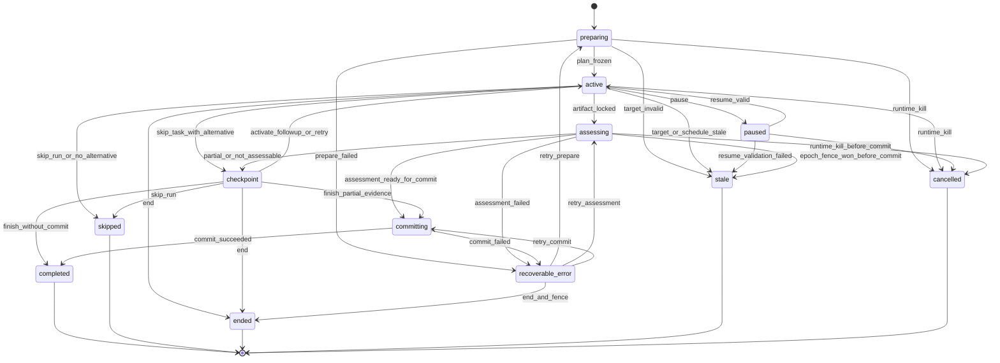
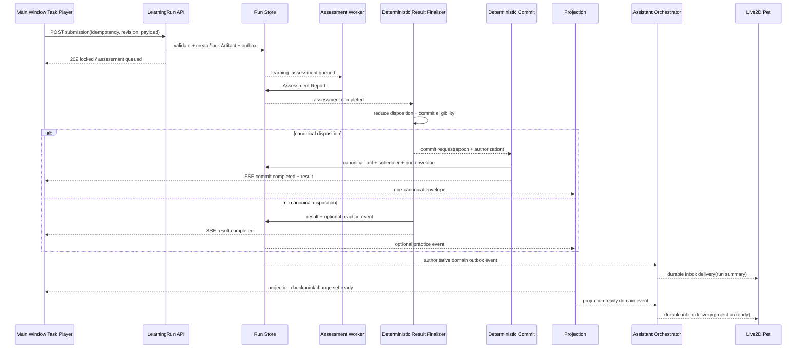

# 统一 LearningRun 与 Live2D 系统伴星重构方案

> 副标题：以 Task / Artifact / Assessment 统一学习底座，以三分钟微旅程构成最终产品体验
>
> 状态：**Proposed — 待 Owner 评审后冻结**
>
> 文档类型：产品需求文档（PRD）+ 技术实施设计（TDD）
>
> 版本：0.1
>
> 日期：2026-08-13
>
> 适用范围：注册后首次引导、资料与生成任务、学习卡巩固、首次验证、到期复习、理解星图、AI 伴星、完整对话历史
>
> 核心产品决策：**方案二作为底座，方案三作为最终产品形态；现有 Live2D 桌宠是唯一伴星前台。**

---

## 0. 结论先行

本方案不是在现有文字题旁增加几个按钮，也不是继续给独立聊天助手增加页面入口，而是同时重构学习内核与产品交互：

1. **底座统一为 LearningRun。** 学习卡巩固、首次验证、到期复习、星图发起、新手首练和伴星发起不再各有一条流程，全部进入同一套 `LearningRun → Task → Artifact → Assessment / Result Finalizer →（符合资格时）canonical Commit` 主链。
2. **最终体验统一为三分钟微旅程。** 用户一次只处理一个 Key Point，在十秒内开始一个低摩擦动作，通常三分钟内知道自己证明了什么、哪里仍不稳、是否改变了复习安排。
3. **能力意图与作答 UI 解耦。** `explain / example / apply / paraphrase` 表示要证明的能力，不再等同于一块大文本框。用户可以说、写、排、连、修、演，也可以明确跳过或声明不会。
4. **Live2D 桌宠成为唯一伴星前台。** 删除页面内联伴星卡、右侧伴星面板、旧 Anchor 和浏览器内桌宠副本。桌宠负责引导、解释、提议、确认、主动提醒与结果收尾；主窗口负责材料、卡片、正式作答、星图和长内容。
5. **完整对话历史保留。** 它是同一伴星的档案与审计页，不是第二套伴星运行时；历史中的会话、工具提议、确认和结果均可追溯，并可唤起桌宠继续。
6. **理解星图升级为行动入口。** 星图不再只是可看的关系图，而是发现薄弱点、解释原因、选择路线、开始 LearningRun、返回查看真实变化的学习决策面。
7. **学习真相仍由确定性内核掌管。** 伴星和模型可以规划、解释与提出动作，但不能判卷、直接写掌握度、消费复习计划或点亮星图。正式变化只能来自锁定 Artifact、独立 Assessment、确定性 Commit 与可重放 projection。

一句话产品定义：

> **用户桌面上的 Live2D 学习伴星，持续理解用户正在进行的学习任务，带领用户完成一个个可信、低摩擦、可恢复的三分钟微旅程，并让每次真实理解变化在卡片、复习计划和星图中一致显现。**

---

## 1. 文档权威性与冲突裁决

### 1.1 本文档的裁决范围

本文档将此前分散在多模态练习、桌宠、首次引导、星图和 Learning Session 文档中的产品与实施方向合并为一个裁决源。

发生冲突时，按以下优先级处理：

1. Owner 在本文档及后续评审中明确确认的决定；
2. 本文档冻结的产品形态、统一对象模型和唯一写路径；
3. 既有 canonical、RLS、隐私、Trust、幂等和调度硬约束；
4. 旧方案中不冲突的实现细节。

### 1.2 被本文档替换的旧方向

以下旧方向不再作为目标产品：

- 页面内 `CompanionShell`、Anchor、右侧 Panel、内联 intervention；
- 浏览器页面内模拟 OS 桌宠的 `InAppPetHost`；
- 首页六步 onboarding 大卡作为新手主路径；
- 学习卡 companion 流与复习 `ValidationFocus` 双轨运行；
- 将 `explain / example / apply` 直接映射成长文本题；
- 由前端分别提交答案、再发起评估的两步编排；
- 星图只消费旧 validation 聚合、只提供浏览和“打开实体”；
- 以组件存在、纯函数存在或单元测试存在作为“产品已完成”的口径。

### 1.3 继续有效的既有硬约束

以下约束继续有效，并被纳入本文档：

- 一条正式学习写路径；
- Public Task / Private Solution / Safety Report 物理隔离；
- 不把点击、浏览、提示后完成冒充整体理解；
- Agent 不直接写学习真相；
- Assessment 与 Tutor/伴星角色隔离；
- Artifact 锁定、hash、幂等、stale、cancel 与 exposure 规则；
- 复习 schedule 只能被一个可信、获授权的 Commit 消费一次；
- 星图共享知识平面与个人学习投影分离；
- 0 个没有 canonical event 的正式点亮；
- RLS、跨工作区隔离、数据导出/删除和审计要求。

---

## 2. 背景与问题定义

### 2.1 用户问题

当前产品把“证明理解”近似等同于“写一段长文本”。典型题面包括：

- `explain`：解释为什么；
- `example`：举一个具体例子；
- `apply`：说明在什么场景下使用；
- `paraphrase`：用自己的话写下理解。

这类题本身有学习价值，但当前交互把认知任务和输入负担绑死，产生五个问题：

1. 用户可能愿意思考，但不愿组织长篇文字；系统无法区分“不想打字”“暂时没精力”和“确实不会”。
2. 同一 Key Point 可能连续多次遇到相同题面与相同 textarea，单调且缺少针对性。
3. 卡片巩固和到期复习体验割裂，用户需要重新理解另一套页面与规则。
4. 结构题、语音和情境题没有统一可信边界，容易把低信息量互动包装成掌握。
5. 用户无法预期一轮还要多久，也不知道操作是否真的影响复习计划。

### 2.2 系统问题

当前实现存在多条未闭环链路：

- 旧 `ValidationFocus` 仍以大 textarea 为核心；
- 新 learning companion 页面与旧复习链路并存；
- Task prompt、目标、rubric facet 没有成为完整公共合同，前端仍硬编码泛化问题；
- 结构化交互的实际操作可能在提交时丢失，或被 JSON 字符串塞进文字答案；
- 一个 Episode 渲染多个 Scene 时，第一次提交可能提前锁住 Episode；
- Assessment 仍可能返回 `not_assessable`，页面却提前声称“评估和记录已保存”；
- Learning Session Commit 与星图旧 reader 的数据源没有完全对齐；
- 伴星页面上下文、学习事件、工具、记忆和主动介入多数停留在合同或脚手架；
- 主窗口到桌宠没有可靠的上下文与事件通道，桌宠无法知道用户当前在哪张卡、哪道题或哪颗星。

### 2.3 根因

根因不是题目文案或角色造型，而是产品对象和系统边界错误：

- 把认知意图当成了 UI 类型；
- 把页面当成了学习运行容器；
- 把伴星当成了独立聊天窗口；
- 把星图当成了只读可视化；
- 把“代码存在”当成了“真实用户闭环存在”。

本方案用统一运行对象、统一证据合同和唯一伴星前台同时解决这些问题。

---

## 3. 产品目标、非目标与不变量

### 3.1 产品目标

1. 任意学习入口都创建或恢复同一种 LearningRun。
2. 用户进入 Run 后十秒内看到第一个可执行动作，不先经过冗长模式选择页。
3. 每个主观能力至少提供一种不要求连续键盘输入的路径。
4. 用户始终可以换方式、暂停、结束、跳过或声明不会。
5. 一次微旅程只处理一个 Key Point，计划主动操作时间不超过 180 秒。
6. 每次结算清楚回答：证明了什么、缺什么、是否改变复习时间、下一步是什么。
7. 伴星从注册后的第一刻开始参与，并能跨页面持续理解与恢复当前任务。
8. 星图能从真实学习事实推荐目标、启动行动并显影真实变化。
9. 所有正式结果可追溯到锁定 Artifact、Assessment、Commit 与 canonical event。
10. 桌宠关闭、离线或崩溃时，主应用的学习能力仍可独立完成。

### 3.2 非目标

- 不引入 XP、金币、宝箱、排行榜、连续签到、断签惩罚或固定每日任务；
- 不以更多选择题掩盖主观理解问题；
- 不用模型润色后的内容冒充用户原始回答；
- 不让一次点击、判断或看答案直接升级整体掌握；
- 不在一次微旅程覆盖多个 Key Point；
- 不自动连播下一轮；
- 不让伴星常开麦克风、监听其他应用、读取剪贴板或抓取整页 DOM；
- 不在主窗口重新创建伴星头像、聊天框、侧栏或引导卡；
- 不为尚未上线的旧客户端长期维护双 API、双表或双写路径。

### 3.3 十五条产品与工程不变量

1. **一个 Run 一个 Key Point。**
2. **认知意图不等于交互形式。**
3. **最长三分钟是规划预算，不是倒计时压力。**
4. **第一步就是有效学习动作，不设置强制热身。**
5. **用户换模态没有负面副作用。**
6. **Skip 与 Declared Unable 是不同事实。**
7. **提示发生前先记 exposure，随后降低 Trust。**
8. **Artifact 锁定后不可原地修改。**
9. **Assessment 失败时 fail closed，不猜结果。**
10. **伴星只 propose，业务服务才 execute。**
11. **Practice、浏览和陪聊均不能改变正式投影。**
12. **没有真实回执就不能宣称已打开、已评估、已保存或已掌握。**
13. **一个 Assessment 只评一个 Task 的一个 locked Artifact；互补结构证明属于同一个 structured bundle Task。**
14. **一次 canonical Commit 只发布一个 canonical envelope，星图 personal projector 只消费这一入口。**
15. **Live2D Pet 是唯一实时伴星前台，但不是主应用可用性的单点依赖。**

---

## 4. 目标产品架构

```mermaid
flowchart LR
  User["用户"] <--> Pet["Live2D 桌宠窗口\n唯一伴星前台"]
  User <--> Main["主窗口\n材料、卡片、Task Player、星图、历史"]

  Main -->|"Context + UI Event"| Bridge["Main ↔ Pet 安全桥"]
  Pet -->|"Typed Command"| Bridge
  Bridge --> Main
  Bridge --> Pet

  Pet <--> AO["Assistant Orchestrator\n旅程、工具、主动策略、记忆"]
  Main <--> RunAPI["LearningRun API"]
  AO <--> RunAPI

  RunAPI --> Task["Task Planner"]
  Task --> Artifact["Immutable Artifact"]
  Artifact --> Assess["Independent Assessment"]
  Assess --> Commit["Deterministic Commit"]
  Commit --> Facts["Canonical 学习事实与 Scheduler"]
  Facts --> Projection["卡片 / Review / 星图 Projection"]
  Projection --> Main
  Projection --> AO

  AO --> History["完整对话、动作与结果历史"]
  History --> Main
```



### 4.1 三个职责域

| 域 | 负责 | 明确不负责 |
| --- | --- | --- |
| Live2D 桌宠 | 对话、首次引导、下一步建议、短解释、动作提议、确认、主动提醒、真实结果收尾 | 正式作答、长证据、直接判卷、直接改掌握度/调度 |
| 主窗口 | 材料输入、内容阅读、编辑、正式 Task、Assessment 等待、结果详情、星图、完整历史 | 渲染第二套伴星、根据本地 UI 自行宣称学习变化 |
| 服务端内核 | 目标冻结、Task 规划、权限、Artifact、Assessment、Commit、Scheduler、Projection、Assistant 工具 | 任意操作 DOM、自动代表用户作答、以模型输出直接写真相 |

### 4.2 单脑双窗

“唯一桌宠形态”不意味着把所有复杂内容塞进一个小气泡，而是采用单脑双窗：

- **Pet Window**：唯一实时伴星形象和短协作表面；
- **Main Window**：普通学习工作台和完整历史页；
- **同一个 Assistant Orchestrator**：两处读取同一服务端 session、action 和历史，不存在两套人格或两套记忆；
- **主窗口无伴星 UI**：普通按钮、聚焦描边、星图路线和错误提示仍属于产品原生 UI，不算第二个伴星表面。

---

## 5. 统一领域模型：LearningRun / Task / Artifact / Assessment

### 5.1 四个用户与系统对象

| 对象 | 定义 | 负责 | 不负责 |
| --- | --- | --- | --- |
| `LearningRun` | 一次用户可感知的微旅程 | 冻结入口、目标、预算、步骤、暂停恢复和结算 | 不保存正确答案，不直接代表掌握 |
| `LearningTask` | 一个待完成的认知动作 | 描述要证明什么、如何交互、用途与最高 Trust | 不保存答案，不直接改排程 |
| `ResponseArtifact` | 用户真实产生的不可变证据 | 保存文字、确认转写、排序、关系、修复或情境决策 | 不包含模型代写内容，锁定后不可修改 |
| `Assessment` | 对锁定 Artifact 的独立评估 | 逐 rubric 给出 covered/partial/missing/contradicted/not_assessable | 不直接写 mastery 或 schedule |

确定性 `Commit` 不是第五个用户对象，而是把可信 Assessment 归约为 canonical validation/review outcome、调度和投影事件的唯一事务边界。

### 5.2 最关键的三维解耦

```text
Task.intent       = 要证明什么
Task.variant      = 当前被激活的交互合同
Variant.purpose   = 这次结果最多可以算到哪里
```

示例：

```text
intent: explain
variant.interaction: voice_teachback
variant.purpose: formal

intent: explain
variant.interaction: causal_relation
variant.purpose: facet

intent: example
variant.interaction: candidate_choice_with_rationale
variant.purpose: diagnostic | facet
```

因此 `explain` 不再等于 textarea，`apply` 也不再等于“请写一个场景”。

### 5.3 聚合关系

- 一个 LearningRun 只绑定一个 Key Point；
- 一个 Run 计划 1–3 个 Task；
- 最多一个核心证据 Task、一个在 PREPARE 时预授权的补充证据 Task、一个可选 practice 修补 Task；
- **结构化正式证明的互补 Scene 必须属于同一个 `structured_bundle` Task**，由一个 bundle Artifact 一次原子提交、一次 Assessment；不得用两个 Task 拼成一个跨 Task Assessment；
- 补充证据 Task 是上一 Task 独立评估后的条件分支，拥有自己的 Artifact 和 Assessment，最终由确定性 Commit reducer 组合多个 Task assessment；
- 一个 Task 可产生多个 Artifact revision，但只有一个当前 locked Artifact；
- 一个 Assessment 只评一个 Task 的一个 locked Artifact；
- Run result 只能由服务端确定性 Result Finalizer 根据用户动作、locked Artifact、Assessment 与 Commit receipt 派生；只有需要 canonical 副作用的 disposition 才要求 Commit；
- 现有 Episode 可作为服务端冻结 target/scheduler/epoch 的内部对象，但不再暴露为前台概念。

### 5.4 LearningRun 来源

```ts
type LearningRunOrigin = LearningRunOriginV1; // 完整 strict contract 见 §12.1
```

来源只决定语义、授权与返回位置，不决定另一套学习流程。星图的视觉 viewport 完全保存在设备本地，以 `runId` 为索引；服务端只持久化可跨设备恢复的 lens/filter/selected Key Point 等语义来源。

---

## 6. 三分钟微旅程 PRD

### 6.1 产品承诺

> 用户进入后十秒内开始一个适合自己的动作，通常三分钟内知道自己刚证明了什么、哪里还不稳、系统接下来会怎样安排。

“三分钟”指服务端 `plannedActiveSeconds <= 180`：

- 不显示制造压力的强制倒计时；
- 用户可以四十秒结束，也可以主动多说一会儿；
- Provider 等待时间不计入主动操作预算；
- 150 秒后不再生成新 Task，只允许完成当前动作或结算；
- 结算后“再来一个”必须创建新 Run；
- 系统绝不自动连播。

### 6.2 标准节奏

| 预算 | 阶段 | 产品行为 |
| ---: | --- | --- |
| 0–10 秒 | `PREPARE` | 冻结 Key Point、权限、rubric、exposure、用户偏好、设备能力与调度授权；直接呈现推荐动作 |
| 10–80 秒 | 核心 Task | 用户说、写、排、连、修或演；始终可换方式、跳过、声明不会 |
| 80–110 秒 | Lock + Assessment | 原子锁定 Artifact 并排队独立评估；展示真实状态，允许用户离开 |
| 110–155 秒 | 条件分支 | 已证明则结算；partial 可选一次微修补，或激活 PREPARE 时已授权的补充证据 Task |
| 155–180 秒 | Commit + Result | 展示证明点、缺口、调度影响与返回入口，默认结束 |

Assessment 等待超过 20 秒时，前台明确允许“先离开”；Run 保持 `assessing`，完成后由原页面状态或桌宠 durable delivery 被动告知，绝不要求用户盯着动画。Provider 等待不触发新 Task，也不计入 active time。

### 6.3 Run 状态机



### 6.4 结果语义

| 结果 | 含义 | 学习与调度副作用 |
| --- | --- | --- |
| `demonstrated` | required rubric 被可信 Artifact 覆盖 | 按授权 Commit；可创建/更新 schedule |
| `partial` | 已证明一部分，仍有明确缺口 | 只写允许的 facet 或不改整体；UI 明示 |
| `needs_repair` | 存在关键误解或矛盾 | 记录真实缺口；给一个可选修复动作 |
| `not_assessable` | 输入不可辨、Artifact 损坏或证据不足 | 0 正负副作用；允许重录或换模态 |
| `practice_completed` | 完成了提示后、diagnostic 或 sandbox 练习 | 可记录 practice trail；0 mastery、0 official schedule；UI 不说“已证明” |
| `skipped` | 用户本次不想做 | 0 Assessment、0 mastery、0 schedule 副作用 |
| `declared_unable` | 用户明确表示不会 | 走确定性 `canonical_unable`；到期复习获授权时消费当前 schedule 并创建恰好一个短间隔 successor，但不视为掌握或成功 |

### 6.5 自主性要求

- “换个方式”在每个 Task 一步可达；
- “先跳过”和“我不会”必须同时存在且文案可区分；
- 换模态不消费正式机会，不产生负向事件；
- Pause 保存精确 Task、interaction 和 renderer state；
- End 保留已 Commit 结果，取消未提交 Task；
- 请求提示时先写 exposure，再返回提示；冻结的 Variant purpose/ceiling 不被修改，Artifact 锁定时由 assistance snapshot 将 `effectiveTrustClass` 降到允许级别；
- 用户在正式回答期间，桌宠保持静默；
- 用户无需完成 companion 对话才能继续主窗口学习。

---

## 7. Task 题型、交互与可信度设计

### 7.1 Intent × Interaction 主矩阵

| 能力意图 | 用户真正要证明的内容 | 默认低摩擦交互 | 其他可选交互 | 最低有效 Artifact | 最高可信边界 | 目标用时 |
| --- | --- | --- | --- | --- | --- | ---: |
| `recall` 回忆 | 不看答案提取关键概念 | 15–30 秒语音回忆 | 短文字、关键词自填 | 用户自产 transcript/text | required rubric 全覆盖可 formal；词云点选仅 diagnostic | 20–45 秒 |
| `paraphrase` 自述 | 保留原意并重组表达 | 20–45 秒口头复述 | 1–3 句文字 | 未经模型改写的 transcript/text | 开放表达可 formal；排列系统给出的句块最多 practice/facet | 30–60 秒 |
| `explain` 解释 | 机制、因果链和关键理由 | 口头 teach-back | 因果关系重建、修复错误解释、短文字 | transcript/text 或主动构建的 relation Artifact | 开放讲解可 formal；单 Scene 通常 facet，认证 bundle 才可升级 | 35–75 秒 |
| `example` 举例 | 生成实例并说明与概念的对应 | 说一个例子并指出依据 | 候选情境 + 用户给出理由、短文字 | 自生成 voice/text，或候选 + 理由 Artifact | 自产开放回答可 formal；V1 候选/choice-with-rationale 最高 diagnostic | 30–60 秒 |
| `apply` 应用 | 在新情境中选择行动、预测后果并说明依据 | 多步情境或故障修复 | 语音说明决策、文字 | 路径/修复轨迹 + 用户理由 | voice/text 可 formal；单个 qualified repair 最高 facet；V1 scenario 最高 diagnostic | 40–80 秒 |
| `boundary` 边界 | 识别何时不成立、构造反例 | 找错误情境并修复 | 口头反例、短文字 | counterexample/repair Artifact | 开放反例可 formal；V1 单个 qualified repair 最高 facet；只点错误为 diagnostic | 30–60 秒 |
| `procedure` 步骤 | 重建顺序、前置条件与异常处理 | 排序 + 修复 | 口头讲步骤、短文字 | ordering/repair Artifact | 无提示单题通常 facet；认证互补 bundle 可 formal | 25–55 秒 |
| `relate` 关联 | 说明组成、因果、对比和依赖 | 连线、分类、对比 | 口头比较、短文字 | relation graph + interaction trace | 单 Scene 通常 facet；开放说明可覆盖更多 rubric | 25–60 秒 |
| `repair` 修补 | 针对已识别缺口完成一次定向纠正 | 修复错误步骤/关系 | 语音或一句话说明修改原因 | repair operations + rationale | 默认 practice/facet；不能倒灌冒充此前独立证明 | 20–40 秒 |

### 7.2 Task Public Contract 必须直接给出具体任务

前端不得再硬编码“请写下你对这个要点的理解”之类泛化题。每个 Task 必须包含：

- `prompt`：用户真正要完成的具体任务；
- `targetSummary`：本轮只针对哪个 Key Point；
- `intent`：要证明的认知能力；
- `activeVariant.purpose`：formal / facet / diagnostic / practice；
- `activeVariant`：当前确定性 renderer 合同与该 Variant 的 purpose/ceiling；
- `estimatedActiveSeconds`；
- `availableAlternativeDescriptors`：只含不泄题的模态摘要；
- `assistancePolicy`；
- `publicPayloadHash` 与 `inputSchemaHash`。

### 7.3 通用 Interaction 类型

```ts
type RelationEdgeKindV1 =
  | "causes"
  | "depends_on"
  | "part_of"
  | "contrasts_with"
  | "supports"
  | "precedes";

type TaskInteractionV1 =
  | { kind: "voice_teachback"; maxSeconds: number }
  | { kind: "text_response"; maxChars: number }
  | { kind: "ordering"; publicTokenIds: string[] }
  | {
      kind: "relation_canvas";
      publicNodeIds: string[];
      allowedEdgeKinds: RelationEdgeKindV1[];
    }
  | {
      kind: "repair";
      publicElementIds: string[];
      allowedOperationKinds: Array<"move" | "replace" | "remove" | "insert">;
      replacementOptionIds: string[];
    }
  | {
      kind: "scenario";
      steps: Array<{ stepId: string; publicOptionIds: string[] }>;
    }
  | {
      kind: "choice_with_rationale";
      publicOptionIds: string[];
      rationaleModes: Array<"voice" | "text">;
    }
  | {
      kind: "structured_bundle";
      parts: [StructuredPartPublicV1] | [StructuredPartPublicV1, StructuredPartPublicV1];
    };
```

模型只能生成符合已签名 schema 的内容，不能生成任意 HTML、React、Canvas 脚本或事件处理逻辑。Renderer Registry 是唯一激活 UI 的位置。

### 7.4 可信度矩阵

| 用户行为 | 最高结果 |
| --- | --- |
| 无提示语音/文字开放回答且 required rubric 覆盖 | `mastery_eligible` |
| 同一 `structured_bundle` Task 内两个互补、通过资格与 Gold 的 Scene part | `mastery_eligible` |
| 单个排序、连线、修复或情境 Task | 通常 `facet_eligible` |
| 普通单选、判断、配对、只挑一个例子 | `diagnostic_only` |
| 看答案、要提示、伴星讲解后再做 | `practice_only` |
| 关键输入不可辨或 Artifact 不完整 | `not_assessable` |
| 跳过 | `no_effect` |

每个 Variant 的 `purpose` 与 `templateTrustCeiling` 必须由服务端在看到答案前冻结。客户端不能把 practice 改成 formal，模型也不能因用户表现好而临时抬高 ceiling。

换模态不会原地改写当前 Variant。服务端 `switch_variant` 动作会废止尚未提交的旧 Variant revision，并激活一个已经预授权或重新经过 Task Activation Service 签发的新 Variant；新 Variant 带自己的 public/private/safety/disclosure hashes 与 ceiling。客户端只有在收到新 public contract 后才能渲染和提交。

Artifact 的最终资格取以下各项的最小值：

```text
Run scheduling authorization
∩ active Variant templateTrustCeiling
∩ structured profile qualification
∩ assistance/exposure snapshot
∩ input completeness
∩ Assessment verdict
```

任何一项降低都只降低 `effectiveTrustClass`，永远不能在作答后抬高冻结 ceiling。

上式只适用于用户回答证据；`declared_unable` 走独立的 `canonical_unable` disposition，不被换算成某个 TrustClass，也不参与“答得好/坏”的比较。

Exposure ledger 以 `(userId, keyPointId, taskPresentedAt, runtimeEpoch)` 汇总服务端事件：Run hint、查看答案、打开该 Key Point 的 evidence/claim、Tutor 教学、伴星解释答案，以及跨窗口/跨设备的相同内容暴露。Artifact lock 在事务中读取该 ledger 并冻结 assistance snapshot；客户端“我没看”不是证据。普通页面在 Task 呈现前的历史阅读不自动污染本轮，Task 呈现后的 answer-bearing 暴露则降为 practice。无法确认是否泄题时 fail closed 到较低 Trust。

### 7.5 语音规则

- 正式语音答案以用户确认的逐字 transcript 为 canonical Artifact；
- 评估前不得自动润色、补全或重写；
- 手工修改 transcript 必须产生新 revision，并标记 correction method；
- 关键术语低置信进入 `not_assessable`，不判为不会；
- 原始音频遵循独立 TTL、删除和导出策略，不作为长期学习真相；
- 日常伴星语音与正式学习 Voice Artifact 使用不同授权与数据生命周期。

### 7.6 结构化 Interaction 规则

- renderer 必须把真实排序、连线、修复和情境操作作为结构化 payload 提交；
- 禁止把结构化答案 `JSON.stringify` 后塞进文字字段；
- 一个 `structured_bundle` Task 一次原子提交一个 bundle Artifact；part 只保存在 draft 中，任一 part 都不能单独 lock 或排队 Assessment；
- 拖拽必须有 tap-select-place、键盘与读屏等价路径；
- 操作轨迹只保留评估所需的最小引用，不采集无关鼠标行为；
- 结构化 Task 未通过 Gold/eligibility 时只能 practice 或 facet，不得以 UI 完整为由开放 formal。

### 7.7 Interaction Qualification 与首发上限

“最终可达到 formal”不等于“首版即可 formal”。每个 interaction family 必须绑定不可变 qualification profile：

```ts
type InteractionQualificationV1 = {
  version: 1;
  qualificationId: string;
  family:
    | "open_text"
    | "open_voice"
    | "ordering"
    | "relation"
    | "repair"
    | "scenario"
    | "choice_with_rationale"
    | "structured_bundle";
  locale: string;
  datasetVersion: string;
  rubricSetHash: string;
  sampleSize: number;
  adversarialSampleSize: number;
  annotatorCount: number;
  adjudicationVersion: string;
  metrics: {
    falseUpgradeRate: number;
    falseDowngradeRate: number;
    abstainRate: number;
    interRaterAgreement: number;
  };
  approvedCeiling: "practice_only" | "diagnostic_only" | "facet_eligible" | "mastery_eligible";
  approvedAt: string;
  expiresAt: string | null;
};
```

资格开发 Gate：facet 候选至少 100 个双人标注样本，formal 候选至少 200 个双人标注样本，其中至少 50 个为提示污染、歧义输入、边界案例或对抗样本；分歧必须仲裁。formal 的严重 false-upgrade 样本数必须为 0，普通 false-upgrade 的 95% 单侧上置信界不高于 3%，人工一致性不低于 0.80。未达到时只允许降低 ceiling，不得通过改指标口径放行。RC 阶段还需用未参与开发的 holdout 重跑同一 Gate。

V1 首发上限冻结为：

| Interaction family | V1 最高 ceiling | 升级条件 |
| --- | --- | --- |
| `open_text` | `mastery_eligible` | intent-specific rubric（含 paraphrase/example）通过既有 + 本文 Gold |
| `open_voice` | `mastery_eligible` | confirmed transcript、ASR abstain 与 intent-specific Gold 通过 |
| 单个 `ordering/relation/repair` | `facet_eligible` | 各 family 独立 qualification 通过；否则 practice |
| `structured_bundle` | `mastery_eligible` | 两个互补 part、bundle profile、整体 Assessment 均通过 formal Gold |
| `scenario` | `diagnostic_only` | V1 不升 formal；未来至少通过独立 scenario Gold 后可提至 facet |
| `choice_with_rationale` | `diagnostic_only` | 选项本身永不 formal；未来可把用户自产 rationale 作为独立开放 Artifact 另行评估 |

example/paraphrase 是 intent，不是新的 UI family：用户自产 voice/text 可按开放回答 Gold 获得正式资格；从系统候选中挑选、拼句或看过示例后作答仍受 exposure 与 interaction ceiling 限制。

### 7.8 题面轮换与针对性

Task Planner 不得继续复用“同一个 active question 有效 30 天”的旧策略。除恢复同一个 Run 外，同一用户、同一 Key Point、同一 intent 的新 Run 必须查询 `TaskPresentationHistory`：

```ts
type TaskPresentationHistoryV1 = {
  userId: string;
  keyPointId: string;
  intent: TaskIntentV1;
  publicPayloadHash: string;
  interactionFamily: TaskInteractionV1["kind"];
  presentedAt: string;
  outcome: LearningRunResultV1["outcome"] | "not_answered";
  exposed: boolean;
};
```

轮换规则：

- 最近 30 天或最近 5 次正式呈现中，不得再次激活相同 `publicPayloadHash`，除非候选库确实耗尽且用户明确选择“再做一次”；
- 先按上次缺失 facet 改变认知角度，再考虑改变 interaction family；不能只换几个同义词冒充新题；
- 用户上次 Skip 只影响交互推荐，不降低难度、不推断态度；用户上次暴露答案/提示时，新正式 Task 必须使用不等价的新题面；
- 动态新题仍须经过 private solution、Safety/Critic、disclosure、qualification 与 activation hash 闭包；库存不足时宁可给合格的 voice/text 新 prompt，也不能临时放宽 Trust；
- Planner 不把用户上一份答案正文直接拼进下一道公开题；仅使用 canonical facet/verdict/reason code 做定向规划，避免泄露、迎合和隐私扩散；
- 结果与埋点按 `promptFamilyId + publicPayloadHash` 追踪，确保“轮换”可被验证，而非仅靠随机文案。

---

## 8. 核心用户旅程

### 8.1 新用户：注册到第一条学习闭环

新用户旅程由 Live2D 桌宠主导，但主窗口始终可独立操作。它不是六张说明页，而是一条由真实业务事件推进、可暂停恢复的 Journey V2。

#### 8.1.1 首次邀请

注册成功并进入个人工作区后：

1. Desktop main 收到 `session.ready(newUser=true)`；
2. 如果 Pet Window 不存在则创建，而不只是尝试 reload；
3. Pet bootstrap 完成鉴权；
4. 服务端 CAS 发放一次性 onboarding invitation permit；
5. 桌宠以小气泡给出三个同级选择：
   - “用我的资料走一遍”；
   - “体验 90 秒示例”；
   - “我先自己看看”。

邀请另有不突出的“稍后”，只延期而不等于跳过。它不抢焦点、不自动打开主窗口、不遮挡首页。跳过后不再自动邀请，但用户可以从桌宠菜单或设置手动重播。

用户接受后，桌宠用最多两个短回合完成边界说明，并可选采集陪伴强度（安静/适中/积极）、回答偏好（自适应/语音/文字）和当前目标。每项都可跳过，默认 `moderate + adaptive`；未回答偏好绝不阻塞材料入口，模型推断也不能代替用户选择。

#### 8.1.2 自有资料路线

```text
注册完成
→ 桌宠说明边界与相处方式
→ 打开并聚焦材料入口
→ source.created：保存精确 sourceId
→ source.ready：建议打开该材料
→ note.created：打开精确 noteId
→ card generation succeeded：打开精确 card/key point
→ evidence.opened：解释可追溯性
→ 创建 onboarding LearningRun
→ 完成首次三分钟微旅程
→ trusted commit：获授权时创建首次复习计划，否则明确说明为何不创建
→ 返回星图查看真实节点/变化
→ Journey completed
```

每一步必须等待真实 Domain Event。桌宠不能因为用户点击“下一步”就假装 source 已解析、卡片已生成或复习已安排。

第一次真正需要调用外部模型时，若用户尚未同意对应数据边界，桌宠应结合当前动作解释用途并打开明确确认；不得把“先去设置页看一眼”当成同意，也不把 AI consent 作为注册后的第一道无上下文关卡。

#### 8.1.3 示例路线

- 使用隔离的 `onboarding_sample` 数据域；
- 不进入用户知识真值、mastery、scheduler 或正式星图；
- 示例结果明确标记“体验，不计入学习记录”；
- 结束时允许用自己的资料开始或直接退出；
- 示例可一键清除。

#### 8.1.4 Journey 完成点

自有资料路线的完整完成点是：

- 用户完成一条真实、可评估的首次 LearningRun；
- 系统已经明确创建或不创建后续复习计划；
- 用户知道如何找到证据、换作答方式和召唤桌宠；
- 用户无需等待未来到期日才算完成 onboarding。

示例路线可以在用户明确选择“结束体验”后完成 **companion onboarding journey**，但不得伪造 `first_real_learning_run`、`first_validation` 或复习计划等业务里程碑。后续用户第一次使用真实资料时，桌宠只在合适上下文中被动提供继续入口，不重新弹首次邀请。

### 8.2 首张学习卡 → 首次巩固

1. 卡片页原生 CTA 显示“用三分钟巩固一下”；
2. 桌宠也可以提出 `start_learning_run` typed proposal；
3. 服务端为当前 Key Point PREPARE 一个 Run；
4. 用户直接进入推荐 Task，可切语音、文字或合格结构题；
5. Artifact 锁定后独立评估；
6. trusted Commit 在 `create_initial` 授权下创建首次复习计划；无该授权时明确返回 `scheduleImpact=none`；
7. 结果页只突出：证明点、缺口、下一次复习；
8. 桌宠收到真实 `run.completed` 后做一句收尾；
9. 默认返回卡片，不自动出下一题。

### 8.3 到期复习

1. 用户从 Review、Today、桌宠提醒或星图进入精确 schedule；
2. PREPARE 冻结 `consume_pending` 授权与 schedule generation；
3. Run 展示一个正式 Task；
4. 只有 trusted Assessment + 幂等 Commit 才消费旧 schedule 并创建恰好一个 successor；
5. Skip、提示后完成、not_assessable 或评估失败时，原 schedule 保持 active；
6. 结算明确显示“本次是否改变复习时间”；
7. 桌宠在正式作答期间静默，Commit 后才解释结果。

### 8.4 “我不想打字”分支

1. 用户点击“换个方式”，不产生负向记录；
2. 有语音能力时优先提供 15–45 秒口述；
3. 知识结构适合时提供排序、连线、修复或情境操作；
4. 系统明确结构题能证明的能力范围；
5. 用户仍不想做，可一键 Skip；
6. Skip 只记录本次交互事实，不推断懒惰、人格或学习态度；
7. 用户明确选择“我不会”时才形成 `declared_unable` Artifact。

### 8.5 中断与恢复

| 中断位置 | 恢复行为 |
| --- | --- |
| Artifact 未锁定 | 恢复原 Task、模态、draft 与结构操作状态 |
| Artifact 已锁定、评估中 | 恢复 progress/result，禁止重复提交 |
| Commit 已成功 | 只显示结算，禁止重复改 schedule |
| 内容 fingerprint 或 schedule generation 变化 | Run 进入 stale，解释原因并创建新 Run |
| 桌宠关闭或重载 | Run 不终止；主窗口继续可用，桌宠恢复后重新附着 |
| 跨设备恢复 | 重新校验 user/workspace/target/permission/schedule generation |

### 8.6 日常系统级陪伴

首次旅程完成后，桌宠贯穿但不喧宾夺主：

| 场景 | 桌宠可以做什么 |
| --- | --- |
| Today | 解释下一推荐项原因、恢复 Run、发起短路线 |
| Source | 播报解析完成/失败、打开精确资料、解释后续流程 |
| Note | 打开证据来源、建议生成卡片、解释生成状态 |
| Card | 讲当前 Key Point、打开证据、发起 Run、定位星图 |
| Review | 打开精确到期项、提供换方式/缩短路线、说明 schedule 结果 |
| LearningRun | 解释操作和退出方式；正式作答时禁知识提示 |
| Star Map | 讲选中节点、解释推荐、铺路线、发起 Run、恢复视口 |
| Settings/Error | 解释设置影响和真实恢复步骤，不代用户修改 |

---

## 9. Live2D 桌宠：唯一 AI 伴星前台

### 9.1 前台形态冻结

唯一允许的实时伴星 UI：

- Live2D 角色本体；
- 角色旁一个短气泡；
- 用户主动打开的紧凑文字输入；
- 点按式语音入口与语音状态岛；
- 二级菜单；
- typed action 确认卡；
- 执行结果或错误恢复卡。

明确删除：

- 页面内联伴星卡；
- 右侧伴星面板；
- 首页伴星 onboarding 大卡；
- 普通网页中的桌宠副本；
- 页面内另一套实时聊天输入；
- 历史页中的第二套伴星人格与运行时。

平台边界同时冻结：完整伴星体验只在 Electron Desktop 提供。Web-only 环境保留普通学习页面与历史读取能力，但不渲染页面内桌宠、伴星侧栏或替代人格；若未来要为 Web-only 用户提供引导，应另做无 AI 角色的原生产品引导，不能重新引入第二种伴星形态。

因此本版本的“注册后桌宠在场”和 Journey Gate 只对 Electron Desktop 注册/登录链路承诺。独立 Web 是兼容性学习客户端：允许注册和完成核心学习，但只展示普通的“下载桌面应用以启用学习伴星”产品链接，不创建 AI 引导。发布、埋点和支持文档必须把 Desktop full experience 与 Web compatibility 分开，不能用 Web 用户缺失 Pet 计为 Companion 故障，也不能宣称 Web 已满足系统伴星体验。

### 9.2 Live2D 资产与表现保留

保留并升级现有：

- Pet BrowserWindow、安全导航、命中区域与点击穿透；
- Live2D Character Driver、manifest、动作、表情和口型；
- PetSurface、Bubble、Composer、Voice、Menu、Confirmation；
- 拖拽、锁定、置顶、缩放、隐私和安全位置；
- 休眠、唤醒、主窗口关闭和账号切换生命周期。

`reduced-motion` 使用同一个 Live2D 角色的低动作/静止模式，不切换成另一位 Sprite 角色。WebGL 或模型加载失败时显示明确的安静故障态，并保证主应用不受影响。

动作/表情由确定性 presentation policy 绑定真实状态：`canonical demonstrated` 才允许短庆祝；`partial/needs_repair` 使用专注或鼓励；`practice_completed` 明示练习完成但不庆祝掌握；`not_assessable/recoverable_error` 使用安静恢复状态。模型可以生成话术候选，不能自行选择会暗示“已掌握/已保存”的动作。

### 9.3 Pet Runtime 正交状态

不要把全部状态压成一个巨型枚举。Runtime 至少包含：

```ts
type PetRuntimeV2 = {
  lifecycle: "boot" | "auth" | "onboarding" | "ready" | "suspended" | "off" | "fault";
  attention: "passive" | "cue_pending" | "cue_visible" | "engaged" | "dnd";
  task: "none" | "attached" | "assisting" | "proposing" | "confirming" | "executing" | "reporting";
  turn: "idle" | "receiving" | "thinking" | "streaming" | "speaking" | "failed";
  journey: "not_offered" | "offered" | "active" | "paused" | "skipped" | "completed" | "recoverable_error";
  activeContext: AssistantContextSnapshotV2 | null;
  proactiveQueue: ProactiveCueV2[];
  memorySync: "idle" | "reading" | "writing" | "failed";
};
```

渲染优先级：

```text
安全/off
> 用户输入或语音
> 当前回答
> 操作确认
> 执行结果
> 主动提示
> idle
```

### 9.4 桌宠气泡协议

伴星输出不能只有一段自由文本，应支持受控结构：

```ts
type PetPresentationV2 = {
  messageId: string;
  speechMode: "text_only" | "speak_message";
  choices?: Array<
    | { kind: "reply"; choiceId: string; label: string; replyText: string }
    | { kind: "proposal"; choiceId: string; label: string; proposalId: string }
  >;
  proposedAction?: { proposalId: string; impactSummary: string };
  progressCue?: { state: "waiting" | "processing" | "ready" | "failed" };
  contextRef?: { contextId: string; revision: string };
  dismissPolicy: "auto" | "explicit" | "persistent_until_result";
};
```

普通气泡最多提供 2–3 个短选择。长解释、长引用和完整 rubric 打开主窗口相应页面或完整历史，不把桌宠气泡膨胀成侧栏。

`PetPresentationV2.messageId` 必须引用同一响应中已持久化的 AssistantMessage；Live2D 朗读的只能是该 message text，不能另生成一份未入历史、可能含不同承诺的 speech。Choice 只能是显式短回复或已持久化 proposal 引用。

### 9.5 “主导但不阻塞”的权限边界

伴星允许：

- 读取当前授权上下文；
- 解释当前状态和下一步；
- 展示一个可忽略的主动提示；
- 用户点击后打开页面、聚焦实体或恢复任务；
- 提议创建/恢复 LearningRun、请求提示、切换练习方式；
- 根据真实回执汇报结果。

伴星禁止：

- 抢焦点或无确认自动导航；
- 自动开始 Run、自动进入下一题；
- 自动开启麦克风；
- 在正式评估前泄露答案或 private rubric；
- 自动提交答案；
- 静默修改材料、卡片、掌握度或复习计划；
- 因桌宠故障阻止页面学习；
- 将普通聊天内容计为学习证据。

用户隐藏/关闭某台设备的 Pet 后，系统不得因主动 cue 自动重新显示窗口；Journey 和 Run 可在后台随真实事件更新，用户通过 tray/快捷键/设置显式召回后再附着。账号级 `globalEnabled=false` 时不生成普通 proactive delivery，已在运行的 LearningRun 继续独立完成，完整历史仍按用户权限可读。

---

## 10. Journey V2、主动策略与记忆

### 10.1 Journey V2 数据职责

现有两套 onboarding 状态不再各自驱动 UI，而是拆成三种职责明确的真相：

- `CompanionInvitation` 是账号级一次性邀请状态，决定是否已经 offer、dismiss、skip 或 replay；换 workspace 不得重复首邀；
- `CompanionJourney` 是 workspace 级旅程进度，保存当前步骤、精确对象引用、中断原因和恢复租约；同一账号最多一个自动活跃的新手旅程；
- workspace onboarding facts 保留为只读的真实业务里程碑投影，回答用户是否真的完成 source/note/card/evidence/formal run，不能被 Journey 或桌宠直接写入。

页面不再渲染六步伴星清单。Journey 只能消费权威领域事件推进；Pet 气泡的“下一步”只是展示已批准的 Journey transition，不能自行宣布完成。

```ts
type CompanionInvitationV2 = {
  version: 2;
  userId: string;
  status: "not_offered" | "offered" | "deferred" | "accepted" | "skipped";
  offeredAt: string | null;
  decidedAt: string | null;
  deferredUntil: string | null;
  replayRequestedAt: string | null;
  revision: number;
};

type CompanionJourneyStepV2 =
  | "boundary_intro"
  | "preference_capture"
  | "goal_capture"
  | "choose_start"
  | "first_source"
  | "source_processing"
  | "first_note"
  | "first_card"
  | "first_evidence"
  | "first_run"
  | "first_schedule"
  | "sample_orientation"
  | "closing";

type CompanionJourneyV2 = {
  version: 2;
  journeyId: string;
  userId: string;
  workspaceId: string;
  assistantSessionId: string | null;
  status: "active" | "paused" | "skipped" | "completed" | "recoverable_error";
  branch: "own_material" | "blank_note" | "sandbox_sample";
  currentStep: CompanionJourneyStepV2 | null;
  stepRevision: number;
  dismissedNarrationSteps: CompanionJourneyStepV2[];
  refs: {
    sourceId?: string;
    generationJobId?: string;
    noteId?: string;
    cardSetId?: string;
    cardId?: string;
    keyPointId?: string;
    runId?: string;
    reviewScheduleId?: string;
    sandboxNamespaceId?: string;
  };
  lastDomainEventId: string | null;
  pausedAt: string | null;
  pauseReason: "user" | "offline" | "object_unavailable" | "workspace_changed" | null;
  resumeTokenRef: string | null;
  resumeExpiresAt: string | null;
  completionKind: "real_first_loop" | "sample_orientation" | null;
  error: {
    code: "object_deleted" | "permission_revoked" | "generation_failed" | "run_unavailable" | "internal_error";
    retryable: boolean;
    sourceEventId: string | null;
  } | null;
  revision: number;
};
```

Journey transition 必须由 CAS 执行：

| 当前状态 | 输入 | 新状态 | 约束 |
| --- | --- | --- | --- |
| invitation `offered` | “稍后” | invitation `deferred` | 设置 `deferredUntil`，到期前不重弹；关闭 Pet 本身不改变 invitation |
| invitation `offered/deferred` | “我自己看看” | invitation `skipped` | 终态，不创建 Journey；仅显式 replay 可再次邀请 |
| 无 Journey | invitation accepted | `active` | 创建 onboarding `AssistantSession`，绑定当前 workspace |
| `active` | 跳过这段讲解 | `active` | 只记录 dismissed narration；不伪造业务事实 |
| `active` | 用户点“稍后” | `paused` | 保存 step、refs、lastDomainEventId 与租约 |
| `paused` | 用户明确继续 | `active` | 重新校验 workspace、对象、权限与业务事实；不可盲用旧 ref |
| `active/paused` | 跳过全部引导 | `skipped` | 终态；不伪造任何业务里程碑；仅显式 replay 可新建 Journey |
| `active` | 真实可评估首轮结算，且 scheduleImpact 已明确 | `completed` | `completionKind=real_first_loop`；允许 created 或有明确原因的 none，不要求伪造 schedule |
| `active` | sandbox 讲解闭环完成 | `completed` | `completionKind=sample_orientation`；真实业务里程碑仍为 false |
| 任意非终态 | 对象已删除/权限变化 | `paused/recoverable_error` | 能回退到最近安全步骤则 paused，否则保存明确错误与安全恢复动作 |
| `recoverable_error` | 重试/选择替代分支 | `active/paused` | 重新校验业务事实与 refs 后继续，禁止伪造已完成步骤 |

完成 sandbox 只表示“用户已经理解产品基本使用方式”，不表示用户已经创建真实卡片、证明理解或建立复习计划。之后首次出现真实材料时，Policy Engine 可以给一次上下文建议，但不得重新播放注册邀请。

`resumeTokenRef` 只是一次性恢复凭证，过期后可在重新认证、重新校验 workspace 与 refs 后签发新 token；Journey 状态本身不因 token 过期而丢失。跨 workspace 不迁移实体 refs：系统暂停原旅程，用户可回原 workspace 继续，或显式在新 workspace 新建分支。

“用户真的打开过卡片/证据”不能由临时 UI Event 直接推进。主窗口在实体成功渲染后调用幂等 `POST /content-engagement-events`：

```ts
type CreateContentEngagementEventV1 = {
  version: 1;
  kind: "card_opened" | "evidence_opened";
  entityRef: { kind: "card"; cardId: string } | { kind: "evidence"; evidenceId: string };
  journeyId: string | null;
  contextId: string;
  contextRevision: string;
  idempotencyKey: string;
};
```

服务端校验 user/workspace/entity/RLS/page context lease 后写 engagement fact 与 outbox；它只用于 Journey/产品行为，不是 mastery evidence。重复打开同一 `(userId, workspaceId, entityRef, journeyId)` 只产生一个 milestone，且绝不证明用户已读懂内容。

Journey 公共 API 只暴露用户意图，不暴露 `next_step/complete/update_refs`：

| 接口 | 用途 |
| --- | --- |
| `GET /companion/journey/bootstrap` | 返回 invitation、当前 workspace Journey、可恢复 Journey 摘要和 account preferences |
| `POST /companion/invitation/actions` | `defer / skip / start_journey / replay`，账号级 CAS |
| `POST /companion/journeys/:journeyId/actions` | `pause / resume / skip / retry / switch_branch`，workspace/RLS/CAS |
| `GET /companion/journeys/:journeyId` | 读取最新 step/refs/error/revision；事件交付仍走 Assistant inbox |

```ts
type CompanionInvitationActionV2 =
  | { kind: "defer"; deferredUntil: string }
  | { kind: "skip" }
  | { kind: "start_journey"; workspaceId: string; branch: CompanionJourneyV2["branch"] }
  | { kind: "replay"; workspaceId: string; branch: CompanionJourneyV2["branch"] };

type CompanionInvitationActionRequestV2 = {
  version: 2;
  expectedRevision: number;
  action: CompanionInvitationActionV2;
  idempotencyKey: string;
};

type CompanionJourneyActionV2 =
  | { kind: "pause" }
  | { kind: "resume"; resumeToken: string | null }
  | { kind: "dismiss_step_narration"; step: CompanionJourneyStepV2 }
  | { kind: "skip" }
  | { kind: "retry" }
  | { kind: "switch_branch"; branch: CompanionJourneyV2["branch"] };

type CompanionJourneyActionRequestV2 = {
  version: 2;
  expectedRevision: number;
  action: CompanionJourneyActionV2;
  idempotencyKey: string;
};
```

只有内部 `JourneyReducer` 可以根据 source/generation/card/engagement/LearningRun/schedule 的权威 outbox 更新 currentStep/refs/completionKind；它以 `(journeyId, domainEventId)` 幂等并用 expected revision CAS。乱序事件先入 pending buffer，缺失前置事实时不得越级推进；重放必须得到同一 Journey projection。

Pet 明确区分“跳过这段讲解”和“结束全部引导”：`dismiss_step_narration` 只隐藏当前叙事并写入 dismissed list，不填充 source/note/card/evidence/Run 等业务里程碑；`skip` 才把整个 Journey 置为终态 skipped。对于纯叙事步骤，Reducer 可以进入下一叙事/选择步骤；对于等待业务事实的步骤，主窗口仍可自由操作，Journey 在真实事件到达前保持等待。

`switch_branch` 只在 `choose_start` 或尚未创建分支专属对象时允许；已有 source/note/card/Run 时返回 `409 branch_locked`，用户可暂停/跳过后显式 replay，系统不删除真实内容。已有 active Journey 时 replay 返回 conflict，防止同一账号同时跑两条自动新手旅程。

Replay 先从当前 workspace 业务事实推导最高安全步骤：已有真实 formal Run/schedule 时只重播边界、偏好和功能讲解，不重复创建材料/卡片/复习；已有 source 无 note 时从对应 source 继续；对象已删除时回退到最近可执行步骤。Replay 是新 Journey revision/ID，并通过 parentJourneyId（内部审计字段）关联旧旅程。

### 10.2 主动介入 Policy Engine

主动行为由确定性策略批准，模型只负责在批准后生成表达。

账号可用状态与介入强度是两个独立枚举，禁止再把 `online/dnd/offline` 直接传给 `quiet/moderate/active` 解析器：

```ts
type CompanionAvailabilityV1 = "online" | "dnd" | "offline";
type CompanionInterventionLevelV1 = "quiet" | "moderate" | "active";
```

`dnd/offline` 总是抑制主动 cue；`online` 仅表示可以投递，最终仍需经过 intervention level、输入/录音状态、正式测评、冷却和日预算。

允许触发：

- 首次注册；
- source/generation 完成或失败；
- 暂停 Run 可恢复；
- 同类 Task 连续 Skip；
- 同一 facet 连续薄弱；
- review 到期且用户处于空闲浏览；
- Run Commit 完成；
- 星图 projection 已追上，可以查看真实变化；
- 可恢复业务错误。

必须抑制：

- 正在输入、录音或播报；
- 正式作答尚未提交；
- 已有确认卡或对话 turn；
- DND、quiet hours、锁屏、休眠、临时隐藏；
- context/实体/revision 已过期；
- 用户刚 dismiss 同类提示。

主动队列规则：

- 同一时刻最多一个可见 cue；
- 每条有 dedupe key、TTL、cooldown 和 snooze；
- 不自动打开主窗口；
- 不因用户忽略而换措辞重弹；
- 用户可以查看触发原因并关闭同类建议。

预算冻结为：用户刚触发的 action result、确认结果和明确订阅的任务完成通知不算主动打扰；除此之外，`quiet` 每日 0 条（首次 onboarding invitation 与明确可恢复故障各可一次），`moderate` 每日最多 3 条且相隔至少 30 分钟，`active` 每日最多 6 条且相隔至少 15 分钟。单个 review schedule 每个到期日最多提醒一次；同类 dismiss 后至少 7 天不再主动出现；snooze 期间同类 dedupe key 全部 suppressed。预算按账号时区日历日计算并由服务端原子扣减，多设备共享。

主动消息不是一次性 SSE 文本，而是持久化 `AssistantDelivery`。状态固定为 `queued → delivered → displayed → acted | dismissed | snoozed | expired | suppressed`；重连按游标重放，客户端 ACK 幂等。Policy Engine 只能对权威 Domain Event 创建 delivery，UI Event 最多影响“现在是否适合展示”，不能产生学习事实。

```ts
type ProactiveCueV2 = {
  version: 2;
  cueId: string;
  assistantSessionId: string;
  triggerEventId: string;
  reasonCode:
    | "onboarding_invitation"
    | "journey_next_step"
    | "generation_ready"
    | "generation_failed"
    | "run_resumable"
    | "run_result_ready"
    | "projection_ready"
    | "review_due"
    | "repeated_skip"
    | "repeated_gap";
  dedupeKey: string;
  priority: "normal" | "high";
  displayAfter: string;
  expiresAt: string;
  cooldownPolicyId: string;
};
```

### 10.3 分层记忆

| 层 | 内容 | 写入来源 | 生命周期 |
| --- | --- | --- | --- |
| Working | 当前页面、选中对象、当前 Run、最近回合 | Context/Turn | 分钟级 TTL |
| Run Memory | 本轮目标、Task、提示、Artifact、结果 | LearningRun 事件 | 随 Run 持久化 |
| Learner Model | facet、常见误解、复习状态 | canonical learning facts | 业务投影 |
| Preference | 主动程度、回答方式、语音/动画偏好 | 用户明确设置或确认 | 账号级 |
| Episodic | 值得保留的长期目标与计划 | 有来源的候选 + 用户控制 | 可查看/删除 |
| Conversation Summary | 对话语义连续性 | durable messages | 不替代学习事实 |

模型推断的偏好只能成为候选，不能静默写入。普通聊天、情绪表达和桌宠陪聊不得改变 Learner Model。

账号级陪伴偏好与设备偏好分开：主动程度、语气、默认回答方式属于账号；Pet 位置、缩放、置顶、动画降级与窗口可见性属于设备。关闭某台设备上的 Pet 不得改成账号级 `global_off`。

```ts
type CompanionAccountPreferencesV2 = {
  version: 2;
  userId: string;
  globalEnabled: boolean;
  interventionLevel: CompanionInterventionLevelV1;
  responsePreference: "adaptive" | "voice" | "text" | "structured";
  voiceOutputEnabled: boolean;
  quietHours: { startLocal: string; endLocal: string; timezone: string } | null;
  revision: number;
};

type CompanionDevicePreferencesV2 = {
  version: 2;
  userId: string;
  deviceId: string;
  petVisible: boolean;
  alwaysOnTop: boolean;
  locked: boolean;
  scale: number;
  reducedMotion: boolean;
  position: { displayId: string; x: number; y: number } | null;
  revision: number;
};
```

账号偏好通过 `PATCH /companion/preferences` 使用 expected revision + idempotency 更新并同步多设备；设备偏好保存在 Desktop device store，登录切换时按 `(userId, deviceId)` 隔离。任何迁移都必须把现有 `online/dnd/offline` presence 与介入强度拆列，不能用默认值覆盖用户明确的 global off/quiet 设置。

所有可长期保存的语义记忆必须使用显式合同：

```ts
type AssistantMemoryItemV1 = {
  version: 1;
  memoryId: string;
  userId: string;
  scope: "account" | "workspace";
  workspaceId: string | null;
  kind: "goal" | "preference" | "study_constraint" | "episodic_note";
  value: string;
  source:
    | { kind: "user_confirmed"; messageId: string }
    | { kind: "system_fact"; canonicalEventId: string }
    | { kind: "model_candidate"; messageId: string };
  confidence: "explicit" | "derived" | "candidate";
  status: "active" | "candidate" | "rejected" | "deleted";
  createdAt: string;
  expiresAt: string | null;
  revision: number;
};
```

`model_candidate` 默认不可用于主动干预，必须经用户确认或被确定性偏好规则接受。删除记忆时同步清理检索索引、缓存和后续 summary 引用；canonical 学习事实不随对话记忆删除，但必须在界面中说明两者差异。

候选默认 30 天过期；rejected 只保留 7 天最小去重 tombstone，正文立即清除；用户删除 active memory 后正文与向量索引立即不可检索，异步备份按数据保留政策到期清除。账号级导出必须列出每条 memory 的来源、scope、confidence 与过期时间。

### 10.4 完整对话历史

伴星运行的服务端权威聚合是 `AssistantSession`，而不是 Pet localStorage 中的 dialogueId：

```ts
type AssistantSessionV1 = {
  version: 1;
  assistantSessionId: string;
  userId: string;
  workspaceId: string;
  kind: "onboarding" | "general" | "learning_task";
  scope:
    | { kind: "journey"; journeyId: string }
    | { kind: "learning_run"; runId: string }
    | { kind: "workspace" };
  parentSessionId: string | null;
  status: "active" | "closed" | "archived";
  nextMessageSequence: number;
  revision: number;
  createdAt: string;
  updatedAt: string;
};

type AssistantMessageBlockV1 =
  | { kind: "text"; text: string }
  | { kind: "voice_transcript"; text: string; audioRef: string | null }
  | { kind: "proposal_ref"; proposalId: string }
  | { kind: "action_run_ref"; actionRunId: string }
  | { kind: "learning_result_ref"; runId: string }
  | { kind: "route_plan_ref"; routePlanId: string }
  | { kind: "error_ref"; errorEventId: string };

type AssistantMessageV1 = {
  version: 1;
  messageId: string;
  assistantSessionId: string;
  sequence: number;
  role: "user" | "assistant" | "system";
  origin: "pet_input" | "assistant_turn" | "proactive" | "action_result" | "system_record";
  blocks: AssistantMessageBlockV1[];
  contextUsed: {
    contextId: string;
    revision: string;
    entityRefs: EntityRefV2[];
  } | null;
  status: "committed" | "redacted";
  createdAt: string;
  redactedAt: string | null;
};

type AssistantActionRunV1 = {
  version: 1;
  actionRunId: string;
  assistantSessionId: string;
  proposalId: string;
  toolKind: AssistantProposalKindV1;
  argumentsHash: string;
  state: "proposed" | "confirmed" | "executing" | "succeeded" | "failed" | "cancelled" | "expired";
  confirmation: {
    confirmedByUserId: string;
    confirmedAt: string;
    confirmationRevision: number;
  } | null;
  resultRefs: EntityRefV2[];
  failureCode:
    | "policy_denied"
    | "confirmation_expired"
    | "context_stale"
    | "permission_denied"
    | "business_api_failed"
    | "main_command_failed"
    | null;
  idempotencyKey: string;
  createdAt: string;
  updatedAt: string;
};
```

解析当前 session 的确定性顺序是：当前 Active LearningRun 的 `learning_task` session → 当前 `active` Journey 的 `onboarding` session → 当前 workspace 最近 active `general` session → 创建 general session。`paused` Journey 不得劫持日常对话；只有用户点“继续旅程”、当前 route/entity 与其 refs 匹配，或 delivery 明确绑定该 journey 时才恢复 onboarding session。历史记录中点击“继续”时，若原 session 已关闭、scope 已失效或当前已有另一 Active Run，不得偷偷复用；系统应恢复原 Run、要求用户确认切换，或以 `parentSessionId` fork 新 session。

LearningRun/Journey 的业务事务不依赖 Assistant Orchestrator 可用性，因此其 `assistantSessionId` 允许短暂为 `null`。`AssistantSessionBinder` 通过 Run/Journey outbox 幂等创建对应 session 并 CAS 回填；期间学习事件仍保存在各自 event store，绑定成功后按 event cursor 补入历史。伴星不可用绝不能阻止创建 Run、提交 Artifact、Assessment 或 Commit；也不得为了补历史重放业务写操作。

数据库唯一约束保证同一 `(userId, workspaceId, kind, scope)` 最多一个 active session；`nextMessageSequence` 在消息事务中原子递增。Run/Journey 终态关闭对应 task/onboarding session，但保留只读历史；后续一般讨论 fork 到 general session，不把终态 task session重新打开。

消息 append 以 `(assistantSessionId, sequence)` 唯一并以 request id 幂等；流式 token 只是瞬时传输，只有最终 committed message 进入历史和搜索。Action proposal、确认与执行状态保存为 `AssistantActionRunV1`，消息仅引用它，避免对话正文和业务审计互相冒充。

完整历史页是独立主窗口全页，保留以下能力：

- 按 LearningRun、日期、来源和模式筛选；
- 全文游标分页与搜索；
- 展示用户消息、伴星回复、主动消息；
- 结构化展示 action proposal、确认/取消、执行、失败和结果；
- 关联材料、卡片、schedule、Run、星图 change set；
- 导出与删除；
- “在伴星中继续”。

历史接口使用 opaque cursor：

| 接口 | 语义 |
| --- | --- |
| `GET /assistant/sessions?cursor=&kind=&origin=&from=&to=` | 按 `updatedAt, assistantSessionId` 稳定分页；默认 30，不硬截断总数 |
| `GET /assistant/sessions/:id/messages?before=&limit=` | 以 message sequence 向前分页；动作/结果 block 不丢失 |
| `GET /assistant/history/search?q=&cursor=&filters=` | workspace/RLS 下全文搜索；redacted 内容不得命中 |
| `GET /assistant/sessions/:id/export` | 导出消息、动作审计和关联 ref；不导出 private rubric/solution |
| `DELETE /assistant/sessions/:id` | 执行正文 redaction、索引/summary/memory 级联与最小审计留痕 |

所有 cursor 均签名并绑定 user/workspace/filter hash；篡改、跨工作区复用或过期返回明确错误，不退化为第一页造成重复或漏读。

“在伴星中继续”只在 Electron Desktop 显示，负责唤起 Pet、恢复服务端 assistant session 和可恢复 Run；Web-only 只显示“在桌面应用中打开”的普通产品链接。历史页不保留第二套实时输入和 AI 回复运行时。

删除历史采用“内容删除、最小审计留痕”：消息正文、附件、全文索引、conversation summary、由该消息派生且无其他来源的 episodic memory 一并清除；确认过的业务动作仅保留不可反推正文的 action tombstone、actor、时间、结果哈希和 canonical 引用。删除对话绝不回滚已经提交的学习事实或 schedule。

---

## 11. 理解星图：从只读图到学习决策面

### 11.1 产品定位

星图变为统一 LearningRun 的行动入口：

```text
发现问题
→ 理解推荐原因
→ 选择/调整路线
→ 从 Key Point 启动 LearningRun
→ 完成可信评估与 Commit
→ 返回原视口
→ 显影真实变化
```

星图仍不是第二套掌握度或关系真值。它只投影：

- workspace-owned 的 Source / Note / Card / Key Point / Evidence 与确定性血缘；
- user-private 的 validation/review outcome、facet、assistance 和 practice trail；
- 服务端冻结的当前目标和路线计划。

### 11.2 桌宠主导的星图交互

用户可以对桌宠说：“带我看看目前最该补哪里。”

1. 伴星携带 bounded context 请求 RoutePlan；
2. 服务端根据 official schedule、canonical gap 和用户目标返回节点与 reason code；
3. 桌宠短气泡解释原因并询问是否前往；
4. 用户确认后才打开主窗口星图；
5. 主窗口发出 `page.ready` 后执行 `graph.focus`；
6. 星图选中并聚焦目标，返回 `command.completed`；
7. 桌宠此时才说“已经定位”，并用 Live2D 动作指引；
8. 用户在图中换选节点后，下一轮对话必须使用新 keyPointId/revision。

星图原生保留搜索、缩放、筛选、节点详情、证据与路线画层，但不显示 AI 卡片、伴星头像或右侧伴星面板。

### 11.3 星图动作

选中 Key Point 后，桌宠可提供：

- 讲讲这颗星；
- 为什么现在推荐它；
- 展示证据路径；
- 展示前置/后续血缘；
- 铺一条修复路线；
- 练习这一颗；
- 回到上次视口。

“练习这一颗”创建 `start_learning_run` proposal。确认卡必须说明目标、预计时长、结果边界以及“只有独立评估和 Commit 后星图才可能变化”。

### 11.4 返回与变化显影

从星图发起 Run 时冻结：

- 服务端语义来源：keyPointId、lens、typed filter、routePlanId、projection baseline checkpoint；
- 设备本地视觉来源：zoom、offset、selected node，以 `(userId, workspaceId, deviceSessionId, runId)` 为键保存；视觉坐标永不进入服务端学习事实。

返回顺序：

1. 查询 Run return contract；
2. projection 尚未覆盖本次 canonical event 时返回 `202 projection_pending` 与 `Retry-After`；
3. ready 后打开星图并加载目标 checkpoint 对应的 projection slice；
4. 恢复 lens/filter/selected node；
5. 尝试读取设备本地 viewport；快照缺失、过期或布局版本不兼容时确定性聚焦原节点；
6. 获取服务端 delta；
7. 主窗口只显影 delta 指定节点；
8. 主窗口回执 `graph.delta_applied`；
9. 桌宠再根据真实 change kind 庆祝、鼓励或中性说明。

变化规则：

| Delta kind | 主窗口 | 桌宠 |
| --- | --- | --- |
| `canonical` | 只对指定节点/切面显影一次 | 说明具体变化，可短庆祝 |
| `practice_only` | 只显示短期航迹，不改正式状态 | 明示练习已记录但未形成正式变化 |
| `none` | 零点亮 | 零庆祝，只说明 Run 已结束 |

浏览、聚焦、朗读、打开证据、看答案和普通对话必须始终是 0 正式点亮。

---

## 12. 技术设计：公共合同

### 12.1 LearningRun Public Contract

```ts
type LearningRunOriginV1 =
  | { kind: "card"; cardId: string; keyPointId: string }
  | { kind: "review"; scheduleId: string; keyPointId: string; scheduleGeneration: number }
  | {
      kind: "star_map";
      keyPointId: string;
      lens: UnderstandingLensV1;
      filter: UnderstandingGraphFilterV1;
      routePlanId?: string;
      baselineCheckpoint: ProjectionCheckpointV1;
    }
  | { kind: "today"; recommendationId?: string; keyPointId: string }
  | { kind: "onboarding"; sampleMode: "own_content" | "sandbox"; keyPointId: string };

type LearningRunReturnTargetV1 =
  | { kind: "card"; cardId: string; keyPointId: string }
  | { kind: "review"; scheduleId?: string; keyPointId: string }
  | {
      kind: "star_map";
      keyPointId: string;
      lens: UnderstandingLensV1;
      filter: UnderstandingGraphFilterV1;
      routePlanId?: string;
    }
  | { kind: "today" }
  | { kind: "onboarding"; destination: "today" | "card" | "star_map" };

type LearningTaskSummaryV1 = {
  taskId: string;
  sequence: number;
  intent: TaskIntentV1;
  status: "pending" | "active" | "answered" | "skipped" | "completed" | "stale";
  estimatedActiveSeconds: number;
};

type LearningRunFailureV1 =
  | {
      stage: "prepare";
      code: "planner_unavailable" | "task_generation_failed" | "task_activation_denied";
      retryable: boolean;
    }
  | {
      stage: "assessment";
      code: "critic_unavailable" | "assessment_timeout" | "assessment_contract_mismatch";
      retryable: boolean;
    }
  | {
      stage: "commit";
      code: "commit_conflict" | "scheduler_unavailable" | "canonical_outbox_failed";
      retryable: boolean;
    };

type LearningRunTerminalReasonCodeV1 =
  | "user_ended"
  | "runtime_cancelled"
  | "target_fingerprint_changed"
  | "schedule_generation_changed"
  | "permission_revoked";

type LearningRunPublicV1 = {
  version: 1;
  runId: string;
  workspaceId: string;
  userId: string;
  assistantSessionId: string | null;
  origin: LearningRunOriginV1;
  returnTarget: LearningRunReturnTargetV1;
  target: {
    kind: "key_point";
    keyPointId: string;
    fingerprint: string;
  };
  projectionBaselineCheckpoint: ProjectionCheckpointV1 | null;
  goal: "stabilize" | "clarify" | "repair" | "transfer" | "explore";
  schedulePolicySummary:
    | { kind: "create_on_canonical_outcome"; eligibleOutcomes: ["demonstrated", "declared_unable"] }
    | {
        kind: "consume_on_canonical_outcome";
        scheduleId: string;
        scheduleGeneration: number;
        eligibleOutcomes: ["demonstrated", "declared_unable"];
      }
    | { kind: "no_schedule_effect"; reasonCode: "practice" | "diagnostic" | "sandbox" | "not_eligible" };
  phase:
    | "preparing"
    | "active"
    | "assessing"
    | "checkpoint"
    | "committing"
    | "paused"
    | "completed"
    | "ended"
    | "skipped"
    | "cancelled"
    | "stale"
    | "recoverable_error";

  timeBudgetSeconds: number;       // 30..180，默认 180
  plannedActiveSeconds: number;    // <= timeBudgetSeconds
  activeSecondsUsed: number;
  planningClosesAtActiveSecond: 150;
  activeTaskId: string | null;
  taskSummaries: LearningTaskSummaryV1[];
  activeTask: LearningTaskPublicV1 | null;
  activeAssessment: AssessmentPublicV1 | null;
  checkpoint: {
    kind: "partial" | "not_assessable" | "skipped_task";
    allowedFollowupIds: string[];
  } | null;
  failure: LearningRunFailureV1 | null;
  projectionStatus: "not_requested" | "pending" | "ready" | "retrying" | "failed";
  revision: number;
  runtimeEpoch: number;
  eventCursor: number;
  result: LearningRunResultV1 | null;
};
```

只有当前 active Task 返回完整 public contract。尚未激活的 Task 只返回 `LearningTaskSummaryV1`，不得预取 prompt、token、option 或 Scene payload；Task 在激活事务中写 `learning_task.presented` 与 exposure 后才可读取完整合同。

### 12.2 LearningTask Public Contract

```ts
type TaskIntentV1 =
  | "recall"
  | "paraphrase"
  | "explain"
  | "example"
  | "apply"
  | "boundary"
  | "procedure"
  | "relate"
  | "repair";

type TaskPurposeV1 = "formal" | "facet" | "diagnostic" | "practice";

type TrustClassV1 =
  | "mastery_eligible"
  | "facet_eligible"
  | "diagnostic_only"
  | "practice_only"
  | "not_assessable";

type StructuredPartPublicV1 =
  | {
      kind: "ordering";
      partId: string;
      publicTokenIds: string[];
      partTrustCeiling: "facet_eligible" | "practice_only";
      qualificationProfileHash: string | null;
    }
  | {
      kind: "relation";
      partId: string;
      publicNodeIds: string[];
      allowedEdgeKinds: RelationEdgeKindV1[];
      partTrustCeiling: "facet_eligible" | "practice_only";
      qualificationProfileHash: string | null;
    }
  | {
      kind: "repair";
      partId: string;
      publicElementIds: string[];
      allowedOperationKinds: Array<"move" | "replace" | "remove" | "insert">;
      replacementOptionIds: string[];
      partTrustCeiling: "facet_eligible" | "practice_only";
      qualificationProfileHash: string | null;
    }
  | {
      kind: "scenario";
      partId: string;
      steps: Array<{ stepId: string; publicOptionIds: string[] }>;
      partTrustCeiling: "diagnostic_only" | "practice_only";
      qualificationProfileHash: string | null;
    }
  | {
      kind: "choice";
      partId: string;
      publicOptionIds: string[];
      rationaleModes: Array<"voice" | "text">;
      partTrustCeiling: "diagnostic_only" | "practice_only";
      qualificationProfileHash: string | null;
    };

type TaskVariantPublicV1 = {
  variantId: string;
  purpose: TaskPurposeV1;
  interaction: TaskInteractionV1;
  templateTrustCeiling: TrustClassV1;
  estimatedActiveSeconds: number;
  publicPayloadHash: string;
  inputSchemaHash: string;
  disclosureProfileHash: string;
  revision: number;
};

type TaskAlternativeDescriptorV1 = {
  alternativeId: string;
  family: "voice" | "text" | "structured";
  estimatedActiveSeconds: number;
  maximumPurpose: TaskPurposeV1;
};

type LearningTaskPublicV1 = {
  version: 1;
  taskId: string;
  runId: string;
  sequence: number;
  intent: TaskIntentV1;
  prompt: string;
  targetSummary: string;
  activeVariant: TaskVariantPublicV1;
  availableAlternatives: TaskAlternativeDescriptorV1[];
  assistancePolicy: {
    hintLevels: 0 | 1 | 2 | 3;
    exposureLowersTrust: true;
  };
  status: "pending" | "active" | "answered" | "skipped" | "completed" | "stale";
  revision: number;
};
```

Public contract 严禁包含：private solution、正确顺序、正确边、distractor 身份、hidden rubric、答案文本或能推导答案的调试字段。

### 12.3 Artifact 通用提交

```ts
type RationaleAnswerV1 =
  | { kind: "text"; text: string }
  | { kind: "voice"; confirmedTranscript: string; voiceArtifactRef?: string };

type RepairOperationV1 =
  | { op: "move"; elementId: string; toIndex: number }
  | { op: "replace"; elementId: string; replacementOptionId: string }
  | { op: "remove"; elementId: string }
  | { op: "insert"; afterElementId: string | null; replacementOptionId: string };

type StructuredPartAnswerV1 =
  | { kind: "ordering"; partId: string; orderedTokenIds: string[] }
  | {
      kind: "relation";
      partId: string;
      edges: Array<{ fromNodeId: string; toNodeId: string; edgeKind: RelationEdgeKindV1 }>;
    }
  | { kind: "repair"; partId: string; operations: RepairOperationV1[] }
  | {
      kind: "scenario";
      partId: string;
      decisions: Array<{ stepId: string; optionId: string; rationale?: RationaleAnswerV1 }>;
    }
  | {
      kind: "choice";
      partId: string;
      selectedOptionIds: string[];
      rationale?: RationaleAnswerV1;
    };

type ArtifactPayloadV1 =
  | {
      kind: "voice";
      confirmedTranscript: string;
      voiceArtifactRef?: string;
    }
  | { kind: "text"; text: string }
  | {
      kind: "ordering";
      orderedTokenIds: string[];
      interactionRefs: string[];
    }
  | {
      kind: "relation";
      edges: Array<{ fromNodeId: string; toNodeId: string; edgeKind: RelationEdgeKindV1 }>;
      interactionRefs: string[];
    }
  | {
      kind: "repair";
      operations: RepairOperationV1[];
      interactionRefs: string[];
    }
  | {
      kind: "scenario";
      decisions: Array<{ stepId: string; optionId: string; rationale?: RationaleAnswerV1 }>;
    }
  | { kind: "choice"; selectedOptionIds: string[]; rationale?: RationaleAnswerV1 }
  | {
      kind: "structured_bundle";
      partAnswers: [StructuredPartAnswerV1] | [StructuredPartAnswerV1, StructuredPartAnswerV1];
      interactionRefs: string[];
    }
  | {
      kind: "declared_unable";
      reasonCode?: "not_learned_yet" | "cannot_recall" | "concept_unclear";
    };

type SubmitTaskArtifactV1 = {
  version: 1;
  variantId: string;
  variantRevision: number;
  runRevision: number;
  taskRevision: number;
  inputSchemaHash: string;
  payload: ArtifactPayloadV1;
  baseArtifactId?: string;
  baseRevision?: number;
  idempotencyKey: string;
};

type SubmitTaskArtifactReceiptV1 = {
  version: 1;
  runId: string;
  taskId: string;
  artifactId: string;
  artifactRevision: number;
  artifactStatus: "locked";
  assessment: {
    assessmentId: string;
    status: "queued";
  };
  runRevision: number;
  taskRevision: number;
  eventCursor: number;
};
```

提交事务必须原子执行：

1. 校验 user/workspace/RLS；
2. 校验 Run/Task epoch、revision、target fingerprint 和 allowlisted IDs；
3. 从 exposure ledger 生成 assistance snapshot，不信任客户端自报“无提示”；
4. 创建 immutable Artifact；
5. 锁定 Artifact；
6. 写入 Assessment outbox；
7. 返回 `202 locked + queued`。

客户端不再公开调用第二个 `assess` 接口。

`declared_unable` 只通过该 submission 入口创建 Artifact，Action API 不提供第二条同义写入口。它使用 `assessmentSource=user_declared_unable` 的确定性评估器，不调用生成式 Critic，但仍经过同一 Commit 防火墙。

### 12.4 Assessment Public Contract

```ts
type AssessmentPublicV1 = {
  version: 1;
  assessmentId: string;
  runId: string;
  taskId: string;
  artifactId: string;
  source: "assessment_critic" | "deterministic_declared_unable";
  status: "queued" | "running" | "completed" | "not_assessable" | "failed";
  rubricResults: Array<{
    rubricItemId: string;
    facet: TaskIntentV1;
    verdict: "covered" | "partial" | "missing" | "contradicted" | "not_assessable";
    userFacingReason: string;
  }>;
  trustClass: TrustClassV1 | null;
  reportHash: string | null;
};
```

Assessment 只读 locked Artifact 和 Private Task Contract。Tutor、Assistant Orchestrator、Task Planner 与当前回答模型不能兼任 Assessment Critic。

`queued/running/failed` 时 `rubricResults=[]`、`trustClass=null`、`reportHash=null`；Critic 的 `completed/not_assessable` 才返回相应 Trust 与不可变 report hash。`source=deterministic_declared_unable` 完成时 `trustClass=null`、reportHash 非空，并以缺失 rubric 摘要说明其不是掌握评估。SSE 丢失后 `GET LearningRun` 的 `activeAssessment` 必须足以重建等待、失败或报告 UI。

### 12.5 Run Result

```ts
type LearningRunResultV1 = {
  outcome:
    | "demonstrated"
    | "partial"
    | "needs_repair"
    | "not_assessable"
    | "practice_completed"
    | "skipped"
    | "declared_unable";
  demonstratedFacets: TaskIntentV1[];
  gapFacets: TaskIntentV1[];
  scheduleImpact:
    | {
        kind: "none";
        reasonCode:
          | "not_authorized"
          | "facet_only"
          | "record_only"
          | "practice_only"
          | "diagnostic_only"
          | "sandbox"
          | "not_assessable"
          | "skipped"
          | "ended"
          | "stale";
      }
    | { kind: "created"; dueAt: string; policyReason: "demonstrated" | "declared_unable" }
    | {
        kind: "rescheduled";
        dueAt: string;
        consumedScheduleId: string;
        policyReason: "demonstrated" | "declared_unable";
      };
  returnTarget: LearningRunReturnTargetV1;
  projection?: {
    baselineCheckpoint: ProjectionCheckpointV1;
    sourceChange: ProjectionSourceChangeV1;
  };
};
```

`scheduleImpact` 对所有带 `LearningRunResultV1` 的学习结算都存在；只有 Commit 成功后可以是 `created/rescheduled`，其余必须为 `none`。单纯 `ended/cancelled/stale` 可使用 terminal reason 而没有学习 result。Assessment 完成、Commit 未完成期间 `result=null` 且 phase=`committing`，不能提前说“已安排复习”。

PREPARE 对所有非 sandbox Run 从 Projection Service 读取并冻结 `projectionBaselineCheckpoint`。客户端提交的 star-map checkpoint 只用于 optimistic concurrency；服务端校验 scope 后仍以权威当前 checkpoint 记录基线。这样 Card、Review、Onboarding 和 Pet 发起的 Run 也能生成可追溯 delta。Projection 暂时不可用不能阻塞正式学习，字段可先为 `null`，但之后只能从 `run.created` 时保存的 canonical event watermark 补建基线，不能拿完成后的图冒充 before。

### 12.6 Server-private Task、Safety 与 Trust 闭包

Public Task 只是可见合同。每个可激活 Variant 还必须物理隔离保存 private solution、safety、disclosure、qualification、activation 与 Artifact trust 闭包：

```ts
type PrivateTaskSolutionV1 =
  | {
      kind: "open_response";
      rubricTargetIds: string[];
      evidenceRefIds: string[];
      contradictionRuleIds: string[];
    }
  | { kind: "ordering"; correctTokenIds: string[]; rubricTargetIds: string[] }
  | {
      kind: "relation";
      requiredEdges: Array<{ fromNodeId: string; toNodeId: string; edgeKind: RelationEdgeKindV1 }>;
      forbiddenEdges: Array<{ fromNodeId: string; toNodeId: string; edgeKind: RelationEdgeKindV1 }>;
      rubricTargetIds: string[];
    }
  | {
      kind: "repair";
      acceptedOperationSignatures: string[];
      rubricTargetIds: string[];
    }
  | {
      kind: "scenario";
      acceptedDecisionPaths: string[];
      rubricTargetIds: string[];
    }
  | {
      kind: "choice";
      acceptedOptionSets: string[][];
      rationaleRubricTargetIds: string[];
    }
  | {
      kind: "structured_bundle";
      partSolutionRefs: [string] | [string, string];
      bundleQualificationId: string;
      rubricTargetIds: string[];
    };

type TaskSafetyReportV1 = {
  version: 1;
  taskId: string;
  variantId: string;
  publicPayloadHash: string;
  inputSchemaHash: string;
  privateSolutionHash: string;
  disclosureProfileHash: string;
  qualificationProfileHash: string | null;
  runPlanHash: string;
  injectionScan: "passed";
  privateLeakageScan: "passed";
  schemaValidation: "passed";
  accessibilityProfile: "passed" | "restricted";
  activationDecision: "allowed" | "denied";
  reportHash: string;
};

type DisclosureProfileV1 = {
  version: 1;
  disclosedFieldPaths: string[];
  hiddenFieldPaths: string[];
  answerBearingFieldsHidden: true;
  profileHash: string;
};

type ArtifactTrustDecisionV1 = {
  version: 1;
  artifactId: string;
  runEvidenceAuthorization: "mastery_candidate" | "facet_candidate" | "record_only" | "no_effect";
  variantPurpose: TaskPurposeV1;
  templateTrustCeiling: TrustClassV1;
  structuredPartCeilings: Array<{
    partId: string;
    ceiling: TrustClassV1;
    qualificationProfileHash: string | null;
  }>;
  qualificationId: string | null;
  assistanceSnapshotHash: string;
  inputCompleteness: "complete" | "incomplete";
  assessmentTrust: TrustClassV1 | "canonical_unable";
  effectiveTrustClass: TrustClassV1 | "canonical_unable";
  reasonCodes: Array<
    | "run_not_authorized"
    | "variant_ceiling"
    | "qualification_ceiling"
    | "hint_exposure"
    | "evidence_exposure"
    | "input_incomplete"
    | "assessment_abstained"
    | "assessment_lowered"
  >;
  decisionHash: string;
};

type LearningArtifactStoredV1 = {
  version: 1;
  artifactId: string;
  runId: string;
  taskId: string;
  variantId: string;
  revision: number;
  status: "locked" | "superseded" | "abandoned";
  payload: ArtifactPayloadV1;
  payloadHash: string;
  publicPayloadHash: string;
  inputSchemaHash: string;
  privateSolutionHash: string;
  safetyReportHash: string;
  disclosureProfileHash: string;
  assistanceSnapshotHash: string;
  qualificationProfileHash: string | null;
  supersedesArtifactId: string | null;
  lockedAt: string;
};

type TaskActivationDecisionV1 = {
  version: 1;
  runId: string;
  taskId: string;
  variantId: string;
  runtimeEpoch: number;
  runPlanHash: string;
  publicPayloadHash: string;
  inputSchemaHash: string;
  privateSolutionHash: string;
  safetyReportHash: string;
  disclosureProfileHash: string;
  qualificationProfileHash: string | null;
  decision: "activate" | "deny";
  reasonCode: "all_checks_passed" | "hash_mismatch" | "unsafe" | "unqualified" | "stale";
  decisionHash: string;
};

type SchedulingAuthorizationV1 =
  | {
      kind: "create_initial";
      keyPointId: string;
      targetFingerprint: string;
      schedulerPolicyId: string;
    }
  | {
      kind: "consume_pending";
      scheduleId: string;
      scheduleGeneration: number;
      keyPointId: string;
      targetFingerprint: string;
      dueAt: string;
      schedulerPolicyId: string;
    }
  | { kind: "record_only"; reasonCode: "facet_only" | "not_published_target" }
  | {
      kind: "no_effect";
      reasonCode: "practice" | "diagnostic" | "sandbox" | "not_authorized";
    };

type PrivateRunContractV1 = {
  version: 1;
  runId: string;
  workspaceId: string;
  userId: string;
  keyPointId: string;
  targetFingerprint: string;
  runtimeEpoch: number;
  timeBudgetSeconds: number;
  planningClosesAtActiveSecond: number;
  schedulingAuthorization: SchedulingAuthorizationV1;
  taskPlanHash: string;
  projectionBaselineCheckpointToken: string | null;
  contractHash: string;
};
```

Task Activation Service 只有在 public/private/safety/disclosure/qualification hashes 与 `PrivateRunContractV1` 的 plan closure 全部匹配时才能激活 Variant。动态生成结构题必须先经过独立 Scene/Task Critic；任一缺失或 hash 不匹配均 fail closed，不渲染 formal Variant。

`SchedulingAuthorizationV1` 与 Variant purpose/Trust 是不同维度：Artifact trust 决定证据最多能算什么，Private Run Contract 决定本 Run 是否获准创建或消费哪个 generation 的 schedule。Commit 必须同时满足两者，客户端、Planner 和伴星都不能把 `formal` 推导成 `consume_pending`。

`structured_bundle` 的最终 ceiling 还要取所有 part ceiling 的最小值。V1 只有“恰好两个、kind 仅为 ordering/relation/repair、每个 part 已独立批准 facet、bundleQualificationId 已批准 mastery”的组合可以达到 `mastery_eligible`；包含 scenario/choice、单 part、缺 qualification 或任一 practice part 的 bundle 绝不能绕过 §7.7 上限。

`canonical_unable` 不参与 Trust 的 min 运算。只有 active Task 上由用户明确触发、结构合法、未被代提交的 `declared_unable` Artifact 才能得到这一 disposition；服务端确定性报告确认“用户声明不会”这一事实，不对 rubric 覆盖度做生成式判断。

### 12.7 Draft 与跨设备恢复合同

未锁定回答通过独立 draft 合同保存，不写 Artifact、不入 Assessment、不进入历史或 analytics：

```ts
type LearningRendererDraftStateV1 =
  | { kind: "voice"; asrState: "idle" | "transcribing" | "ready" | "failed" }
  | { kind: "text"; selectionStart: number; selectionEnd: number }
  | { kind: "structured"; activePartId: string | null; focusedElementId: string | null };

type LearningDraftPayloadV1 =
  | { kind: "voice"; unconfirmedTranscript: string }
  | Exclude<ArtifactPayloadV1, { kind: "voice" } | { kind: "declared_unable" }>;

type LearningTaskDraftV1 = {
  version: 1;
  runId: string;
  taskId: string;
  variantId: string;
  taskRevision: number;
  draftRevision: number;
  payload: LearningDraftPayloadV1 | null;
  rendererState: LearningRendererDraftStateV1;
  savedAt: string;
  expiresAt: string;
};

type PutLearningTaskDraftRequestV1 = {
  version: 1;
  variantId: string;
  variantRevision: number;
  taskRevision: number;
  expectedDraftRevision: number | null;
  payload: LearningDraftPayloadV1 | null;
  rendererState: LearningRendererDraftStateV1;
  idempotencyKey: string;
};
```

- `PUT /learning-runs/:runId/tasks/:taskId/draft` 使用 CAS/If-Match；
- `DELETE .../draft` 在 lock、Skip、End 和 terminal 后执行；
- draft 是 user-private/workspace-scoped，静态加密、RLS、默认终态后 24 小时清理；
- 正在录制的原始音频不跨设备保存；ASR 完成后的未确认 transcript 可以保存；
- draft payload 可以不满足最终 completeness（例如 bundle 只完成一个 part），但所有 ID/operation kind 仍必须属于当前 Variant allowlist；final submission 才执行完整 input schema；
- 服务端 draft 只为恢复提供，不可被模型、Tutor、Assessment 或主动策略读取。

---

## 13. 技术设计：API、事件与执行流

### 13.1 HTTP / SSE API

| 接口 | 用途 |
| --- | --- |
| `POST /learning-runs` | 以 origin、精确 target、goal、偏好创建并 PREPARE Run；预算夹在 30–180 秒 |
| `GET /learning-runs/:runId` | 获取 Run/Task/Assessment/result 公共快照；支持 ETag/revision |
| `GET /learning-runs/:runId/events` | SSE；支持 Last-Event-ID 和断线恢复 |
| `PUT /learning-runs/:runId/tasks/:taskId/draft` | CAS 保存未锁定 draft；不产生学习副作用 |
| `DELETE /learning-runs/:runId/tasks/:taskId/draft` | 删除未锁定 draft |
| `POST /learning-runs/:runId/tasks/:taskId/submissions` | 原子锁定通用 Artifact 并排队 Assessment |
| `POST /learning-runs/:runId/actions` | 严格 action union；每个动作携带 revision、epoch 和幂等键 |
| `GET /learning-runs/:runId/result` | 有学习结算时返回 result；无结算的 terminal 返回 terminal reason；其余返回 202 + 当前 phase |
| `GET /learning-runs/:runId/return-contract` | 返回持久语义来源、projection checkpoint 与 change set |

```ts
type CreateLearningRunRequestV1 = {
  version: 1;
  origin:
    | { kind: "card"; cardId: string; keyPointId: string }
    | { kind: "review"; scheduleId: string; keyPointId: string; scheduleGeneration: number }
    | {
        kind: "star_map";
        keyPointId: string;
        lens: UnderstandingLensV1;
        filter: UnderstandingGraphFilterV1;
        routePlanId?: string;
        expectedCheckpointToken: string;
      }
    | { kind: "today"; recommendationId?: string; keyPointId: string }
    | { kind: "onboarding"; sampleMode: "own_content" | "sandbox"; keyPointId: string };
  goal: LearningRunPublicV1["goal"];
  requestedTimeBudgetSeconds?: number; // 服务端 clamp 30..180
  responsePreference?: "adaptive" | "voice" | "text" | "structured";
  clientRequestId: string;
  idempotencyKey: string;
};

type LearningRunActionV1 =
  | { kind: "pause" }
  | { kind: "resume" }
  | { kind: "switch_variant"; alternativeId: string }
  | { kind: "request_hint"; level: 1 | 2 | 3 }
  | { kind: "skip_task"; taskId: string }
  | { kind: "skip_run" }
  | { kind: "activate_followup"; followupId: string }
  | { kind: "finish_current_evidence" }
  | { kind: "finish_without_commit" }
  | { kind: "retry_prepare" }
  | { kind: "retry_assessment"; assessmentId: string }
  | { kind: "retry_commit" }
  | { kind: "end"; abandonLockedEvidence: boolean };

type LearningRunActionRequestV1 = {
  version: 1;
  runRevision: number;
  taskRevision?: number;
  runtimeEpoch: number;
  action: LearningRunActionV1;
  idempotencyKey: string;
};

type LearningRunActionResponseV1 = {
  version: 1;
  acceptedActionId: string;
  actionResult:
    | { kind: "state_changed" }
    | {
        kind: "hint_revealed";
        hintId: string;
        level: 1 | 2 | 3;
        text: string;
        exposureEventId: string;
        resultingTrustCeiling: "practice_only";
      }
    | { kind: "variant_switched"; previousVariantId: string; activeVariantId: string };
  snapshot: LearningRunPublicV1;
};

type GetLearningRunResultResponseV1 =
  | { status: "pending"; httpStatus: 202; phase: LearningRunPublicV1["phase"]; revision: number }
  | { status: "learning_result"; httpStatus: 200; result: LearningRunResultV1 }
  | {
      status: "terminal_without_result";
      httpStatus: 200;
      phase: "ended" | "cancelled" | "stale";
      reasonCode: LearningRunTerminalReasonCodeV1;
    };
```

统一错误码至少包括：`stale_run_revision`、`stale_task_revision`、`epoch_mismatch`、`invalid_phase`、`artifact_already_locked`、`schedule_generation_changed`、`variant_not_authorized`、`context_stale`、`permission_denied`、`idempotency_conflict`。

动作语义：

- `request_hint`：先写 exposure，再返回提示；冻结 Variant 不变，lock 时降低 Artifact effective Trust；
- `switch_variant`：只在 Artifact 未锁定前允许；激活新签发 Variant revision，旧 revision 随即不可提交；0 负面学习副作用；
- `skip_task`：不创建 Assessment，不消费 schedule；
- `declared_unable` 只走 submission，不是 action；
- `pause`：保存 activeTask、draft ref 与 revision；
- `activate_followup`：只在 checkpoint 且 followup 已于 PREPARE 授权时允许；
- `finish_current_evidence`：只对 `partial` checkpoint 有效，按已有可信证据进入 Commit；
- `finish_without_commit`：只对 `not_assessable` checkpoint 有效，生成 0 学习副作用的结果并 completed；
- `end`：未锁定时立即结束；Assessment 中必须明确 `abandonLockedEvidence=true` 才能使 epoch 前移并阻止迟到 Commit；locked Artifact/已有报告保留审计并标记 abandoned，不物理删除、不进入 canonical；Commit 已获得事务锁后不能取消，只能离开页面等待后台完成；
- Assessment 与 Commit 只能由内部 outbox/worker 驱动。

Action response 一律 `Cache-Control: no-store`。`hint_revealed` 的 exposure write 与返回提示必须同一事务/outbox boundary：写入失败就不返回 hint；重放同一 idempotency key 返回原 hintId/text，不新增 exposure，也不重复降低 Trust。

### 13.2 状态转换、终态优先级与竞态

| 当前 phase | 允许的用户动作 | 服务端转换 |
| --- | --- | --- |
| `preparing` | end | `ended`；PREPARE Worker 以 epoch fence 停止 |
| `active` 且无 locked Artifact | pause / switch_variant / hint / skip_task / skip_run / submit / end | skip_task 有预授权替代时进入 checkpoint，否则 skipped；其余进入 paused/active/skipped/assessing/ended |
| `paused` | resume / end | 重新校验后 active，或 ended/stale |
| `assessing` | end with abandon / leave UI | 正常到 checkpoint/committing；abandon CAS 赢则 ended 且迟到结果无副作用 |
| `checkpoint(partial)` | activate_followup / finish_current_evidence / end | active / committing / ended |
| `checkpoint(not_assessable)` | activate_followup / finish_without_commit / end | active / completed（0 Commit）/ ended |
| `checkpoint(skipped_task)` | activate_followup / skip_run / end | active / skipped / ended |
| `committing` | leave UI | 不接受取消；成功 completed，失败 recoverable_error |
| `recoverable_error` | retry_prepare / retry_assessment / retry_commit / end | 按 failure.stage 回 preparing/assessing/committing，或 epoch fence 后 ended |
| terminal | 只读 | mutation 返回 `invalid_phase`；幂等重放返回原结果 |

竞态裁决冻结如下：

1. 每次 Pause/End/Skip/Stale/Cancel 都使用 Run row lock + expected revision/epoch CAS；
2. Assessment Worker 写报告前验证 Artifact lock、run epoch 与 target fingerprint；报告可保留审计，但 epoch 失效时不得触发 Commit；
3. Commit 事务按固定顺序锁 Run → target → 支撑本次 disposition 的 Artifacts（按 artifactId 排序）→ input schedule，重新校验每个 Assessment/Artifact closure、terminal、epoch、schedule generation 与 idempotency key；
4. 如果 End/Stale/Cancel 在 Commit 获得 Run lock 前成功，epoch 前移，Commit 必须 no-op；
5. 如果 Commit 先获得 Run lock并通过全部校验，Commit 获胜并原子完成，随后到达的 End 返回 completed snapshot；
6. `global_off` 只关闭伴星，不能取消 Run；只有显式 runtime kill/capability epoch 变更才产生 `cancelled`；
7. `recoverable_error` 的 `result` 必须为 null；若重读发现相同 idempotency Commit 已成功，应恢复为 completed；Commit 成功后 projection 失败只记录 `projectionStatus=failed/retrying`，不得把已完成 Run 倒退为错误态；
8. 必测竞态：double submit、submit vs switch、hint vs lock、end vs assessment、end vs commit、stale vs commit、duplicate worker、schedule generation change、epoch kill、SSE 重放。

### 13.3 三分钟 Active Time 算法

- `plannedActiveSeconds` 是 PREPARE 时冻结的静态预算，必须 `<= timeBudgetSeconds <= 180`；
- Run 保存 `activeSecondsUsed` 与 `planningClosesAtActiveSecond=150`；
- Player 在页面可见、Task active 且用户未暂停时每 15 秒续一个 activity lease；服务端按接收时间计费，每个 lease 最多增加 20 秒，重复/重叠 lease 幂等去重；
- Provider 等待、后台、暂停、结果阅读和桌宠对话不增加 active time；
- 离线恢复时，服务端对未确认区间最多补计 30 秒；客户端 reported duration 不作为权威值；
- 当 `activeSecondsUsed >= 150`，或激活新 Task 会使计划总时长超过 180 秒时，Planner 只能完成当前 Task 或结算；
- 用户可以继续完成已激活 Task，因此实际墙钟可以超过三分钟，但系统不能借此追加内容。

### 13.4 LearningRun 领域事件

```text
learning_run.created
learning_run.prepared
learning_run.started
learning_run.paused
learning_run.resumed
learning_run.completed
learning_run.ended
learning_run.skipped
learning_run.stale
learning_run.cancelled
learning_run.recoverable_error

learning_task.presented
learning_task.variant_switched
learning_task.hint_requested
learning_task.skipped
learning_task.declared_unable

learning_artifact.started
learning_artifact.draft_saved
learning_artifact.locked
learning_artifact.superseded

learning_assessment.queued
learning_assessment.started
learning_assessment.completed
learning_assessment.not_assessable
learning_assessment.failed

learning_commit.completed
learning_commit.failed
learning_result.viewed
```

每个 durable event 必须带：

- `eventId`、`schemaVersion`、单调 `sequence`；
- `correlationId`、`causationId`；
- `workspaceId`、`userId`、`runId`；
- `actor`、`occurredAt`、`idempotencyKey`；
- 安全摘要，不把答案正文写入 analytics/event bus。

### 13.5 唯一执行主链



Commit 和 Projector 不直接向 Pet renderer 推送任意消息。所有主动展示必须先经过 Assistant Orchestrator 的策略、权限、去重与 durable delivery。

### 13.6 Disposition Reducer、Result Finalizer 与 Commit eligibility

`LearningDispositionReducer` 用确定性纯函数将用户动作、Artifact、Assessment、Trust、Variant purpose、`SchedulingAuthorizationV1`、stale/exposure 状态归约为唯一 disposition：

```text
mastery_and_schedule
facet_only
record_only
practice_only
not_assessable
skipped
declared_unable
sandbox_only
stale
rejected
```

只有 `mastery_and_schedule`、`facet_only` 与 `declared_unable` 进入 canonical Commit；一个 Commit 只能消费一个 disposition。`record_only`、`practice_only`、`not_assessable`、`skipped`、`sandbox_only`、`stale` 与 `rejected` 由 Result Finalizer 收尾，不创建 canonical envelope，也不得消费正式 review schedule。`practice_only` 可发布 PracticeTrailEvent；`sandbox_only` 只能写隔离 namespace。

`facet_only` 是否写 canonical facet observation 由 `runEvidenceAuthorization=facet_candidate` 决定，但 `SchedulingAuthorizationV1` 必须是 `record_only/no_effect` 或由 policy 明确禁止 schedule 消费；facet 证据永不通过“顺便 Commit”消费 due review。

| Disposition | Result / phase | Canonical / schedule |
| --- | --- | --- |
| `mastery_and_schedule` | `demonstrated` | canonical envelope；按 create/consume 授权恰一 schedule effect |
| `facet_only` | `partial` 或 `needs_repair` | canonical facet observation；0 schedule effect |
| `record_only` | `partial` 或 `needs_repair` | 保留 Artifact/Assessment；0 canonical、0 schedule |
| `practice_only` | `practice_completed` | 最多一个 official PracticeTrailEvent；0 canonical、0 schedule |
| `not_assessable` | `not_assessable` | 0 canonical、0 schedule |
| `skipped` | `skipped` | 0 Artifact/Assessment/canonical/schedule |
| `declared_unable` | `declared_unable` | canonical unable；按授权创建/消费并续排短间隔 schedule |
| `sandbox_only` | `practice_completed` | 仅 sandbox namespace；官方 projection/schedule 为 0 |
| `stale` | phase `stale` + terminal reason | 0 新副作用；已成功 Commit 不会再变 stale |
| `rejected` | `recoverable_error` 或 `ended` | 0 新副作用；根据错误是否可恢复决定 |

`declared_unable` 使用确定性 Assessment：初次巩固写 `canonical_unable` 并按 policy 创建恰好一个短间隔 schedule；到期复习在 `consume_pending` 授权与 generation 校验通过后消费当前 schedule，并创建恰好一个短间隔 successor。UI 必须说“已记录为暂时不会，并安排了更近的复习”，不能说“掌握”或“复习通过”。授权或 stale 校验失败时不消费 schedule。

`sandbox_only` 的用户结果固定为 `practice_completed + scheduleImpact.none(sandbox)`；永远不写 canonical learning fact、mastery、official scheduler 或正式星图，只写隔离的 onboarding Run/history 事件。

---

## 14. Main ↔ Pet Context / Event / Command Bridge

### 14.1 设计原则

Electron main process 是 Main Window 与 Pet Window 的唯一 broker。两个 renderer 仅获得窄、强类型 preload API，禁止暴露原始 `ipcRenderer`、任意 URL、DOM script 或窗口对象。

四条通道严格分离：

1. **UI Context/Event**：Main renderer → Electron broker → Pet，短生命周期，只服务当前表面；
2. **Domain Event**：业务事务 outbox → Assistant Orchestrator，权威、durable，不经过 renderer；
3. **Assistant Command**：Pet → Orchestrator / Tool Gateway，产生 proposal、confirmation、action run 与 result；
4. **Assistant Delivery**：Orchestrator → durable inbox/SSE → Pet，所有主动消息与业务结果的唯一交付通道。

Run SSE、Assistant inbox SSE 与单页 UI sequence 各有独立游标，禁止相互比较。Pet 启动或断线后先读服务端 snapshot，再从各自 Last-Event-ID 继续。

### 14.2 Entity、Route 与 Context 合同

```ts
type EntityRefV2 =
  | { kind: "source"; sourceId: string }
  | { kind: "note"; noteId: string }
  | { kind: "card_set"; cardSetId: string }
  | { kind: "card"; cardId: string }
  | { kind: "key_point"; keyPointId: string }
  | { kind: "evidence"; evidenceId: string }
  | { kind: "review_schedule"; scheduleId: string }
  | { kind: "learning_run"; runId: string }
  | { kind: "learning_task"; runId: string; taskId: string }
  | { kind: "companion_journey"; journeyId: string }
  | { kind: "assistant_session"; assistantSessionId: string }
  | { kind: "route_plan"; routePlanId: string }
  | { kind: "change_set"; changeSetId: string };

type AllowedMainRouteV2 =
  | { kind: "today" }
  | { kind: "source"; sourceId?: string }
  | { kind: "note"; noteId: string }
  | { kind: "card_set"; cardSetId: string }
  | { kind: "card"; cardId: string }
  | { kind: "review"; scheduleId?: string }
  | { kind: "star_map"; keyPointId?: string }
  | { kind: "learning_run"; runId: string }
  | { kind: "conversation"; assistantSessionId?: string }
  | { kind: "settings"; section?: "companion" | "privacy" | "voice" | "accessibility" };

type UiTargetRefV2 =
  | { kind: "quick_capture" }
  | { kind: "source_generate_note"; sourceId: string }
  | { kind: "note_generate_cards"; noteId: string }
  | { kind: "card_evidence"; cardId: string; keyPointId?: string }
  | { kind: "run_current_task"; runId: string; taskId: string };

type MainCommandKindV2 =
  | "open_route"
  | "focus_ui_target"
  | "graph.focus"
  | "graph.present_route"
  | "graph.advance_route"
  | "graph.restore"
  | "graph.reveal_delta";

type AssistantContextSnapshotV2 = {
  version: 2;
  contextId: string;
  accountSessionId: string;
  deviceSessionId: string;
  workspaceId: string;
  userId: string;
  pageInstanceId: string;
  revision: string; // canonical hash，不与 Run revision 混用
  routeRef: AllowedMainRouteV2;
  pageKind:
    | "today"
    | "source"
    | "note"
    | "card"
    | "review"
    | "star_map"
    | "learning_run"
    | "conversation"
    | "settings"
    | "other";
  entityRefs: EntityRefV2[];
  interactionState: "idle" | "editing" | "formal_answer" | "processing";
  graph?: {
    lens: UnderstandingLensV1;
    selectedKeyPointId: string | null;
    activeRoutePlanId: string | null;
    checkpoint: ProjectionCheckpointV1;
  };
  capabilityHints: MainCommandKindV2[]; // 仅提示，不是授权
  sensitivity: "normal" | "formal_assessment" | "credential_surface";
  issuedAt: string;
  expiresAt: string;
};

type MainPageContextV2 = AssistantContextSnapshotV2;
```

Main renderer 只提交 pageKind、routeRef、entityRefs、interactionState、graph 与 capability hints；Electron broker 校验 sender/schema 后，覆盖 account/device/workspace/user/pageInstance、计算 canonical revision，并写入 issuedAt/expiresAt，renderer 不能自报这些安全字段。账号与 workspace 来自登录后服务端签发、绑定当前 webContents/device 的 `DesktopSessionLease`，不是从 renderer 普通字段复制；账号切换或登出立即吊销。Pet 每次 turn 携带完整 bounded snapshot；服务端仍把它视为不可信提示，校验 authenticated user/workspace、lease 与 RLS，并按 `EntityRefV2` 重新 hydration。页面每 10 秒续租，默认 lease 30 秒；lease 过期后所有 contextual tool fail closed。

preload 只暴露固定方法：

```ts
type MainWindowCompanionBridgeV2 = {
  publishPageContext(input: Omit<AssistantContextSnapshotV2,
    "contextId" | "accountSessionId" | "deviceSessionId" | "workspaceId" |
    "userId" | "pageInstanceId" | "revision" | "issuedAt" | "expiresAt">): Promise<{
      contextId: string;
      pageInstanceId: string;
      revision: string;
      expiresAt: string;
    }>;
  renewPageContext(input: {
    contextId: string;
    expectedRevision: string;
  }): Promise<{ revision: string; expiresAt: string }>;
  revokePageContext(input: { contextId: string; expectedRevision: string }): Promise<void>;
  publishUiEvent(input: Omit<MainUiEventV2,
    "eventId" | "pageInstanceId" | "pageSequence" | "contextRevision" | "occurredAt">): Promise<{
      accepted: true;
      eventId: string;
      pageSequence: number;
    }>;
  onMainCommand(handler: (command: NavigationCommandEnvelopeV2 | InPageCommandEnvelopeV2) => void): () => void;
  reportMainCommandResult(result: MainCommandResultV2): Promise<void>;
};

type PetWindowCompanionBridgeV2 = {
  onPageContext(handler: (context: AssistantContextSnapshotV2) => void): () => void;
  onUiEvent(handler: (event: MainUiEventV2) => void): () => void;
  dispatchMainCommand(command: NavigationCommandEnvelopeV2 | InPageCommandEnvelopeV2): Promise<{
    accepted: boolean;
    reasonCode?: "invalid_sender" | "invalid_schema" | "expired" | "stale_context";
  }>;
};
```

两个 preload 都不暴露原始 channel 名、`ipcRenderer`、任意 listener、任意 URL 或任意 payload。`publishPageContext` 创建 context；内容未变时只用 `renewPageContext` 续租，route/entity/interaction 改变时重新 publish 并立即 revoke 旧 context。Electron broker 维护唯一 Main/Pet webContents ID、账号会话、page sequence 与 command registry；窗口销毁、账号切换、workspace 切换时撤销全部 lease 和 pending command。

Context 禁止包含整页 DOM、未提交输入、private solution、hidden rubric、截图、剪贴板、全局键盘、其他应用内容、凭据字段或无关实体正文。

正式作答防泄题采用双重门禁：

- 服务端以权威 LearningRun/Task/Artifact phase 决定是否开放知识工具、solution、rubric 和 evidence；renderer 的 `interactionState` 不能授权；
- Pet 本地再根据 formal state、输入、录音、锁屏和 DND 抑制展示；
- Context lease 过期、IPC 中断或页面卸载失败时，一律按 formal/unknown 高敏状态处理。

### 14.3 UI Event、Domain Event 与 Delivery

```ts
type MainUiEventV2 = {
  version: 2;
  eventId: string;
  pageInstanceId: string;
  pageSequence: number;
  contextRevision: string;
  commandId?: string;
  type:
    | "page.ready"
    | "route.entered"
    | "selection.changed"
    | "interaction.started"
    | "interaction.ended"
    | "command.completed"
    | "command.rejected"
    | "command.failed"
    | "graph.delta_applied";
  occurredAt: string;
  safeRefs: EntityRefV2[];
};

type CompanionSystemEventTypeV2 =
  | "learning_run.created"
  | "learning_run.resumable"
  | "learning_run.completed"
  | "learning_run.recoverable_error"
  | "projection.ready"
  | "journey.step_changed"
  | "journey.completed"
  | "generation_job.completed"
  | "generation_job.failed"
  | "review.due";

type CompanionSystemPayloadRefV2 =
  | { kind: "learning_run"; runId: string; eventCursor: number }
  | { kind: "projection_change"; changeSetId: string; checkpointToken: string }
  | { kind: "journey"; journeyId: string; stepRevision: number }
  | { kind: "generation_job"; jobId: string; sourceId?: string; noteId?: string }
  | { kind: "review_schedule"; scheduleId: string; scheduleGeneration: number };

type CompanionSystemEventV2 = {
  version: 2;
  eventId: string;
  sequence: number;
  source: "learning_run" | "projection" | "journey" | "generation_job" | "review";
  workspaceId: string;
  userId: string;
  runId?: string;
  commandId?: string;
  checkpoint?: ProjectionCheckpointV1;
  eventType: CompanionSystemEventTypeV2;
  occurredAt: string;
  payloadRef: CompanionSystemPayloadRefV2;
};

type AssistantDeliveryPayloadRefV2 =
  | { kind: "message"; messageId: string }
  | { kind: "proposal"; proposalId: string }
  | { kind: "action_result"; actionRunId: string }
  | { kind: "proactive_cue"; cueId: string }
  | { kind: "system_event"; systemEventId: string };

type AssistantDeliveryV2 = {
  version: 2;
  deliveryId: string;
  assistantSessionId: string;
  userId: string;
  workspaceId: string;
  inboxSequence: number;
  dedupeKey: string;
  state:
    | "queued"
    | "delivered"
    | "displayed"
    | "acted"
    | "dismissed"
    | "snoozed"
    | "expired"
    | "suppressed";
  kind: "message" | "proposal" | "action_result" | "proactive_cue" | "system_event";
  payloadRef: AssistantDeliveryPayloadRefV2;
  displayLease: {
    deviceSessionId: string;
    leaseToken: string;
    expiresAt: string;
  } | null;
  createdAt: string;
  expiresAt: string;
};

type AssistantDeliveryAckV2 = {
  version: 2;
  deliveryId: string;
  inboxSequence: number;
  deviceSessionId: string;
  leaseToken: string;
  transition: "displayed" | "acted" | "dismissed" | "snoozed";
  snoozedUntil?: string;
  idempotencyKey: string;
};
```

权威 Domain Event 使用业务 outbox 内部 schema，Orchestrator 消费后生成 `CompanionSystemEventV2` 或 action result，并经过 Policy Engine 写入 `AssistantDeliveryV2`。Inbox 以 `(userId, workspaceId)` 分区，`inboxSequence` 只在该分区内单调；切换账号或 workspace 必须断开旧流。Pet 使用 `AssistantDeliveryAckV2` 幂等确认。跨设备只允许一个未过期 display lease；lease 丢失的设备不得展示或 ACK。`snoozed` 到期后回到 queued，但仍受原 TTL/cooldown；断线重连从 durable inbox sequence 恢复，过期项先由服务端转为 expired，不能在客户端复活。

### 14.4 Pet → Main 表面命令

```ts
type PetMainCommandV2 =
  | { kind: "open_route"; route: AllowedMainRouteV2 }
  | { kind: "focus_ui_target"; target: UiTargetRefV2 }
  | { kind: "graph.focus"; keyPointId: string; lens?: UnderstandingLensV1 }
  | { kind: "graph.present_route"; routePlanId: string; revision: string }
  | { kind: "graph.advance_route"; routePlanId: string; ordinal: number }
  | { kind: "graph.restore"; runId: string }
  | { kind: "graph.reveal_delta"; changeSetId: string };

type NavigationCommandEnvelopeV2 = {
  version: 2;
  scope: "navigation";
  commandId: string;
  sourceContextRevision?: string;
  expiresAt: string;
  command: Extract<PetMainCommandV2, { kind: "open_route" }>;
};

type InPageCommandEnvelopeV2 = {
  version: 2;
  scope: "in_page";
  commandId: string;
  targetPageInstanceId: string;
  expectedContextRevision: string;
  expiresAt: string;
  command: Exclude<PetMainCommandV2, { kind: "open_route" }>;
};

type MainCommandResultV2 = {
  version: 2;
  commandId: string;
  status: "accepted" | "completed" | "rejected" | "failed";
  pageInstanceId?: string;
  contextRevision?: string;
  resultRefs: EntityRefV2[];
  reasonCode?:
    | "stale_page"
    | "stale_context"
    | "expired"
    | "unsupported_route"
    | "target_missing"
    | "permission_denied"
    | "renderer_unavailable"
    | "internal_error";
  occurredAt: string;
};
```

导航执行链：`command.accepted → new pageInstanceId → page.ready(commandId) → command.completed`。只有 `open_route` 可不带 target page/revision；所有页内命令强制携带 freshness 字段。桌宠只有收到 completed 后才能说“已经打开/聚焦”。超时、未知 route、过期 revision、非可信 sender 全部 fail closed。

### 14.5 Assistant business command 与权限

Pet 发出的业务动作先进入 Orchestrator，而不是直接通过 IPC 修改主应用：

```text
user intent / explicit menu action
→ AssistantCommandRequest(context + assistantSessionId)
→ deterministic policy + RLS
→ proposal persisted
→ Pet confirmation
→ ActionRun(idempotency)
→ public business API or signed Main command
→ durable result
```

| 动作 | 规则 |
| --- | --- |
| 打开、聚焦、切 lens、恢复视口 | 用户明确点击/发话后可执行；页内动作必须 revision 校验 |
| 创建/恢复 LearningRun | typed proposal + confirmation + idempotency |
| 请求提示、切换 Variant | 走 LearningRun action policy |
| 延后复习、创建草稿、修改内容 | 必须确认并调用公开业务 API |
| 提交答案、写 Assessment、改 mastery/schedule | Pet Tool Gateway 永不暴露 |

显式本地菜单中的纯导航可以绕过模型，但仍必须使用同一 route contract、sender 校验与 command result；业务写操作不得绕过 Orchestrator。

### 14.6 Context Adapter 覆盖

每个核心页面只增加无 UI Adapter：Home/Today、Source list/detail、Note detail/editor、Card detail、Review list/focus、LearningRun Player、Star Map、Conversation history、Settings/error/import/generation status。

页面卸载、实体选择、Task 切换、提交和 interaction state 变化后必须刷新 context hash；旧 revision 命令 fail closed。所有 Adapter 都要有“未注册/过期/多窗口/账号切换/工作区切换”负向测试。

---

## 15. Star Map Projection、Route 与 Delta API

### 15.1 唯一 canonical 输入与 Projection Checkpoint

星图 personal plane 的**正式状态**只消费一种权威输入：`CanonicalLearningEventEnvelopeV1`；非正式 practice trail 只消费 `PracticeTrailEventV1`，由独立 reducer 写入，绝不修改正式 facet/state/schedule。一次成功 Commit 可以在同一事务内写 validation/review/schedule/understanding 所需的规范化业务行，但必须只发布一个 canonical envelope；personal projector 禁止再分别订阅这些底层表的 outbox，否则同一次学习会被重复消费和重复显影。Commit 也禁止直接写星图 projection。

```ts
type CanonicalLearningFactKindV1 =
  | "initial_validation"
  | "scheduled_review"
  | "facet_observation"
  | "canonical_unable";

type CanonicalAssessmentRefV1 =
  | {
      source: "assessment_critic";
      assessmentId: string;
      reportHash: string;
      trustClass: "mastery_eligible" | "facet_eligible";
    }
  | {
      source: "deterministic_declared_unable";
      assessmentId: string;
      reportHash: string;
    };

type CanonicalLearningEventEnvelopeV1 = {
  version: 1;
  canonicalEventId: string;
  eventHash: string;
  commitId: string;
  workspaceId: string;
  userId: string;
  runId: string;
  taskIds: [string, ...string[]];
  artifactIds: [string, ...string[]];
  keyPointId: string;
  targetFingerprint: string;
  fact: {
    kind: CanonicalLearningFactKindV1;
    factId: string;
    disposition: "mastery_evidence" | "facet_evidence" | "unable_evidence";
  };
  assessments: [CanonicalAssessmentRefV1, ...CanonicalAssessmentRefV1[]];
  occurredAt: string;
};

type PracticeTrailEventV1 = {
  version: 1;
  practiceEventId: string;
  eventHash: string;
  workspaceId: string;
  userId: string;
  runId: string;
  taskIds: [string, ...string[]];
  keyPointId: string;
  targetFingerprint: string;
  artifactIds: string[];
  scope: "official_user" | "sandbox";
  reasons: [
    "hint_used" | "diagnostic_only" | "practice_task" | "sandbox",
    ...Array<"hint_used" | "diagnostic_only" | "practice_task" | "sandbox">
  ];
  occurredAt: string;
  expiresAt: string | null;
};

type ProjectionCheckpointV1 = {
  version: 1;
  workspaceId: string;
  userId: string;
  token: string;
  capturedAt: string;
};
```

`token` 封装并签名 server-private shared/canonical-practice watermarks。客户端不得比较字符串、解析 watermark 或自行推断“已追上”；只能把 token 交回服务端。服务端解码后判断 checkpoint 是否覆盖某个 canonical/practice event。正式 reducer 以 `canonicalEventId` 幂等，practice reducer 以 `practiceEventId` 幂等；重放同一 event 必须得到完全相同的 projection 和 change set。Result Finalizer 每个 Run 最多发布一个聚合 PracticeTrailEvent，且只在本 Run 没有 canonical Commit 时发布；一旦产生 canonical envelope，它就是该 Run 唯一 projection source change。`scope=sandbox` 的 practice event 永不进入官方 personal plane。

Canonical envelope 的 `taskIds/artifactIds/assessments` 必须等长、同序、无重复，V1 长度只能为 1–2；它允许核心 Task 与一个补充证据 Task共同支撑一次 Commit，同时保持“每个 Assessment 只评一个 Artifact”的不变量。

### 15.2 Understanding Projection V2

```http
GET /understanding/projection?lens=current_target&targetKeyPointId=<uuid>&minimumCheckpoint=<opaque>&continuation=<opaque>
```

```ts
type UnderstandingLensV1 = "current_target" | "evidence" | "provenance" | "issues";

type UnderstandingReasonCodeV1 =
  | "review_due"
  | "missing_required_facet"
  | "recent_misconception"
  | "weak_prerequisite"
  | "new_card_unvalidated"
  | "user_selected";

type UnderstandingGraphFilterV1 = {
  showArchived: boolean;
  sourceId?: string;
  cardId?: string;
  relationKinds?: Array<"derived_from" | "supports" | "contains" | "prerequisite" | "next">;
};

type UnderstandingNodeRefV1 =
  | { kind: "source"; sourceId: string }
  | { kind: "note"; noteId: string }
  | { kind: "card"; cardId: string }
  | { kind: "key_point"; keyPointId: string }
  | { kind: "evidence"; evidenceId: string };

type UnderstandingFacetProjectionV1 = {
  facet: "recall" | "paraphrase" | "explain" | "example" | "apply" | "boundary" | "procedure" | "relate";
  state: "unknown" | "covered" | "partial" | "missing" | "contradicted";
  lastCanonicalEventId: string | null;
};

type UnderstandingPersonalStateV1 = {
  state: "unknown" | "forming" | "stable" | "fragile" | "needs_repair";
  facets: UnderstandingFacetProjectionV1[];
  nextReviewAt: string | null;
  activeScheduleId: string | null;
  lastCanonicalEventId: string | null;
  practiceTrailCount: number;
};

type UnderstandingNodeProjectionV2 = {
  nodeRef: UnderstandingNodeRefV1;
  label: string;
  shared: {
    archived: boolean;
    sourceFingerprint: string;
  };
  personal: UnderstandingPersonalStateV1 | null;
};

type UnderstandingEdgeProjectionV2 = {
  edgeId: string;
  from: UnderstandingNodeRefV1;
  to: UnderstandingNodeRefV1;
  kind: "derived_from" | "supports" | "contains" | "prerequisite" | "next";
  provenanceHash: string;
};

type UnderstandingProjectionV2 = {
  version: 2;
  generatedAt: string;
  checkpoint: ProjectionCheckpointV1;
  planes: { shared: "workspace_owned"; personal: "user_private" };
  request: {
    lens: UnderstandingLensV1;
    filter: UnderstandingGraphFilterV1;
    targetKeyPointId: string | null;
    routePlanId: string | null;
  };
  slice: {
    kind: "target_centered" | "route" | "search";
    continuationToken: string | null;
  };
  nodes: UnderstandingNodeProjectionV2[];
  edges: UnderstandingEdgeProjectionV2[];
  currentTarget: {
    keyPointId: string;
    reasonCodes: UnderstandingReasonCodeV1[];
  } | null;
};
```

要求：

- Key Point 有独立 personal state，不能只继承 Card 聚合；
- route projection 必须完整包含 RoutePlan 的所有 step node 与连接边，不得因分页截断；普通大图使用 continuation token；
- `minimumCheckpoint` 尚不可满足时返回 `202`，而不是偷偷返回旧 projection；
- projection 响应使用 checkpoint-aware ETag；Run return contract、delta 与 pending 查询强制 `no-store`；
- 节点颜色、展开状态、动画与布局坐标只是客户端视图，不是学习事实。

### 15.3 RoutePlan

```http
POST /understanding/routes/plan
```

```ts
type CreateUnderstandingRoutePlanRequestV1 = {
  version: 1;
  intent: "repair_gap" | "prepare_review" | "explore_neighbors";
  targetKeyPointId?: string;
  maxSteps: number; // 1..5
  lens: UnderstandingLensV1;
  filter: UnderstandingGraphFilterV1;
  expectedCheckpointToken: string;
  idempotencyKey: string;
};

type UnderstandingRoutePlanV1 = {
  version: 1;
  routePlanId: string;
  workspaceId: string;
  userId: string;
  revision: number;
  baseCheckpoint: ProjectionCheckpointV1;
  targetKeyPointId: string;
  expiresAt: string;
  steps: Array<{
    ordinal: number;
    nodeRef: Extract<UnderstandingNodeRefV1, { kind: "key_point" }>;
    incomingEdgeIds: string[];
    reasonCode: UnderstandingReasonCodeV1;
  }>;
  sourceFactHashes: string[];
};
```

RoutePlan 只由确定性服务选择节点、边、顺序与 reason code。模型只能解释返回值。以下任一发生时 plan 失效并返回 `409 route_plan_stale`：过期、workspace/user 不匹配、target fingerprint 变化、任一 source fact hash 变化，或调用方 checkpoint 不属于同一 projection scope。请求 route projection 时，所有 steps 必须一次返回。

### 15.4 Return Contract

```http
GET /learning-runs/:runId/return-contract
```

```ts
type ProjectionSourceChangeV1 =
  | { kind: "canonical"; canonicalEventId: string }
  | { kind: "practice_only"; practiceEventId: string }
  | { kind: "none" };

type LearningRunReturnContractV1 =
  | {
      version: 1;
      status: "run_active";
      runPhase: "preparing" | "active" | "assessing" | "checkpoint" | "committing" | "paused" | "recoverable_error";
      returnTarget: LearningRunReturnTargetV1;
    }
  | {
      version: 1;
      status: "no_projection_change";
      sourceChange: { kind: "none" };
      returnTarget: LearningRunReturnTargetV1;
    }
  | {
      version: 1;
      status: "projection_pending";
      sourceChange: Exclude<ProjectionSourceChangeV1, { kind: "none" }>;
      currentCheckpoint: ProjectionCheckpointV1;
      returnTarget: LearningRunReturnTargetV1;
      retryAfterMs: number;
    }
  | {
      version: 1;
      status: "ready";
      sourceChange: Exclude<ProjectionSourceChangeV1, { kind: "none" }>;
      targetCheckpoint: ProjectionCheckpointV1;
      returnTarget: LearningRunReturnTargetV1;
      changeSetId: string;
    }
  | {
      version: 1;
      status: "unavailable";
      reason:
        | "run_not_found"
        | "return_target_deleted"
        | "permission_revoked"
        | "projection_failed";
      fallbackTarget: LearningRunReturnTargetV1 | null;
    };
```

`projection_pending` 只有在 projector 尚未覆盖 `sourceChange` 时返回，并同时设置 HTTP `Retry-After`；服务端不能比较 opaque token 字符串大小来代替 event coverage。`skipped/not_assessable/ended/stale/cancelled` 且无 practice trail 的 Run 直接返回 `no_projection_change`。Commit 已成功但 projection 暂时失败时，Run 保持 completed，return contract 返回 `projection_pending` 或 `unavailable(projection_failed)`，后台按 canonical event 重试。

### 15.5 Projection Delta 与一次性显影

```http
GET /understanding/projection/deltas/:changeSetId
```

```ts
type CanonicalChangeEvidenceV1 = {
  kind: "canonical";
  commitId: string;
  canonicalEventId: string;
  canonicalEventHash: string;
  factKind: CanonicalLearningFactKindV1;
  factId: string;
  taskIds: [string, ...string[]];
  artifactIds: [string, ...string[]];
  assessmentRefs: [CanonicalAssessmentRefV1, ...CanonicalAssessmentRefV1[]];
};

type PracticeChangeEvidenceV1 = {
  kind: "practice_only";
  practiceEventId: string;
  practiceEventHash: string;
  taskIds: [string, ...string[]];
  artifactIds: string[];
  reasons: PracticeTrailEventV1["reasons"];
};

type UnderstandingFacetChangeV1 = {
  facet: UnderstandingFacetProjectionV1["facet"];
  before: UnderstandingFacetProjectionV1["state"] | null;
  after: UnderstandingFacetProjectionV1["state"] | null;
};

type UnderstandingProjectionDeltaBaseV1 = {
  version: 1;
  changeSetId: string;
  runId: string;
  runBaselineCheckpoint: ProjectionCheckpointV1 | null;
  fromCheckpoint: ProjectionCheckpointV1;
  toCheckpoint: ProjectionCheckpointV1;
  changedEdges: [];
};

type UnderstandingCanonicalNodeChangeV1 = {
  keyPointId: string;
  before: UnderstandingPersonalStateV1 | null;
  after: UnderstandingPersonalStateV1 | null;
  changedFacets: UnderstandingFacetChangeV1[];
};

type UnderstandingPracticeTrailChangeV1 = {
  keyPointId: string;
  beforeCount: number;
  afterCount: number;
};

type UnderstandingProjectionDeltaV1 = UnderstandingProjectionDeltaBaseV1 &
  (
    | {
        kind: "canonical";
        evidence: CanonicalChangeEvidenceV1;
        changedNodes: UnderstandingCanonicalNodeChangeV1[];
        practiceTrailChanges: [];
      }
    | {
        kind: "practice_only";
        evidence: PracticeChangeEvidenceV1;
        changedNodes: [];
        practiceTrailChanges: UnderstandingPracticeTrailChangeV1[];
      }
  );
```

`fromCheckpoint` 是 source event 应用前一刻的 projector checkpoint，`toCheckpoint` 是应用后一刻；changedNodes 只表示这个 source event 的直接效果，不能把 Run 期间并发发生的其他学习变化归因给当前 Run。`runBaselineCheckpoint` 仅用于来源、恢复和审计。

`changeSetId` 由 `(runId, canonicalEventId | practiceEventId, fromCheckpoint.token, toCheckpoint.token)` 确定性派生；重复请求返回同一对象。canonical delta 只能改变正式 personal state，practice delta 只能改变 practice trail，两者不能在同一 payload 混合。V1 不允许 LearningRun 自动发布共享语义边，因此 `changedEdges` 固定为空。客户端禁止自行 diff 两次 graph JSON 后声称掌握提升。

Projector 应在应用 source event 的同一幂等事务中物化 immutable change set，保存经过授权的 event-local before/after 摘要与 from/to checkpoint；Delta API 不在请求时临时重算历史。Run baseline 缺失不影响 event-local delta，但字段必须诚实为 null，不能拿完成后的 checkpoint 冒充启动基线。

投影应用与视觉显影是两层幂等：

- 服务端 projector 按 sourceEventId 应用事实并物化 changeSet；客户端必须先加载 `checkpoint >= targetCheckpoint` 的当前 projection，Delta 只作为“哪些节点/切面该显影”的注释，绝不能把 before/after 当补丁覆盖更新的当前状态；
- 动画层在设备本地保存 `(userId, deviceSessionId, changeSetId, displayedAt)` receipt，同一设备只播放一次；换设备可以看到当前状态，但默认不重播庆祝动画；
- `graph.delta_applied` 只表示该设备已渲染，不是 canonical ACK，丢失该回执不得影响学习事实。

### 15.6 视口生命周期与缓存

星图视觉快照仅保存在设备本地：

```ts
type LocalGraphViewportSnapshotV1 = {
  version: 1;
  userId: string;
  workspaceId: string;
  deviceSessionId: string;
  runId: string;
  layoutVersion: string;
  zoom: number;
  offsetX: number;
  offsetY: number;
  selectedNode: UnderstandingNodeRefV1 | null;
  lens: UnderstandingLensV1;
  filter: UnderstandingGraphFilterV1;
  savedAt: string;
  expiresAt: string;
};
```

实现必须限制坐标与 zoom 范围、每用户每设备最多 50 条、默认 TTL 7 天，并在退出账号时清理。跨设备只恢复 semantic target/lens/filter，不同步像素坐标。projection checkpoint 或 target 不兼容时丢弃旧快照并确定性聚焦目标。

缓存与错误语义：

- Projection GET 使用 `ETag + checkpoint token`，但带 `minimumCheckpoint` 时不得由陈旧 30 秒缓存直接命中；
- Return Contract 与 Delta 一律 `Cache-Control: no-store`；pending 同时返回 `Retry-After`；
- RoutePlan 与 Delta 的已签发版本不可变，可按 ID 读取，但权限和 workspace 必须每次重验；
- continuation/checkpoint/route token 过期或篡改一律 fail closed，不回退到“看起来差不多”的图。

---

## 16. 数据模型与迁移策略

### 16.1 目标数据模型

项目尚未上线，不维持长期双模型。目标物理模型建议：

| 目标表/聚合 | 来源 | 处理 |
| --- | --- | --- |
| `learning_runs` | `learning_sessions` | 直接演进/重命名；增加 phase、budget、activeTask、revision、pause/checkpoint |
| `learning_run_private_contracts` | `learning_episodes` | 与公共 Run 物理隔离；保留 target、private rubric、scheduler authorization、epoch、planHash |
| `learning_tasks` / `learning_task_variants` | `learning_session_probes` | 仅保存 Task intent 与 Public Variant/purpose/interaction/hash，不保存答案或 hidden rubric |
| `learning_task_private_solutions` | 现有 private scene/solution 演进 | server-private schema 与 privateSolutionHash；公共 API 账号无 SELECT 路径 |
| `learning_task_safety_reports/disclosure_profiles/activation_decisions` | 现有 Critic/Safety 基础演进 | 保存独立报告、qualification 引用与完整 hash closure；Activation Service 专用 |
| `interaction_qualifications` | 现有 Gold/quality 资产演进 | dataset/rubric/metrics/approval/expiry；决定每个 family ceiling |
| `learning_artifacts` | `learning_response_artifacts` | 保留 immutable/hash/supersedes；改为 discriminated payload |
| `learning_assessments` | `learning_assessment_reports` | 绑定 task/artifact，保存 rubric 摘要与 Trust；仍非 canonical outcome |
| `learning_task_drafts` / `learning_exposure_ledger` | 新建/现有 assistance 事件演进 | 私有草稿恢复与跨窗口曝光；二者不进入模型上下文或 analytics 正文 |
| `learning_task_presentation_history` | `learning_task.presented` 投影 | 支撑 prompt 轮换、exposure 与 interaction 适配；不保存答案正文 |
| `learning_run_events` | 现有 session/outbox 事件 | 统一 Run lifecycle 和 SSE replay |
| `assistant_sessions/messages/action_runs/deliveries` | 现有 companion conversation/message/action | 收敛为服务端 session、顺序消息、动作审计和耐久主动队列 |
| `companion_invitations/journeys` | 两套 onboarding 状态 | invitation 账号级；journey workspace 级；业务里程碑只读投影 |
| `assistant_memory_items` | 新建 | 保存有来源、可审计、可删除的长期语义记忆，不复制 Learner Model |
| `canonical_learning_event_outbox` | 现有 commit outbox 演进 | 每次 canonical Commit 恰好一个 envelope；personal projector 的唯一输入 |
| `practice_trail_event_outbox` | Run Result Finalizer | 每个无 canonical Commit 的 Run 最多一个聚合 practice event；sandbox scope 不进官方图 |
| `understanding_projection_checkpoints/change_sets` | 旧 graph cache/read model | V2 checkpoint、target slice、route 与可追溯 delta |

实施时可选择物理 rename 或保留旧表名作为内部细节，但必须满足：

- 公共 API 和代码聚合只使用 LearningRun 语言；
- 不新建一套并行表再双写；
- 不同时保留 `/learning-sessions` 和 `/learning-runs` 给产品消费者；
- 旧 adapter 仅存在于单次迁移窗口，所有消费者迁完即删除。

### 16.2 Canonical 事实继续复用

LearningRun 不成为第二套 mastery 真相。Commit 在一个事务内按 disposition 写入必要的 canonical 业务行：

- initial validation 写 validation fact，并创建恰好一个 active successor schedule；
- due review 写 review attempt、消费指定 generation，并创建恰好一个 successor schedule；
- declared unable 写 canonical unable fact，并按短间隔策略消费/续排；
- 每次成功 Commit 只发布一个 `CanonicalLearningEventEnvelopeV1`；
- mastery/facet/map 都从这一 canonical envelope 或其规范化 fact 投影，不接受 Companion/Player 直写。

最终 disposition 为 practice/diagnostic/sandbox 的 Run 只能发布 `PracticeTrailEvent`，不得发布 canonical envelope；hint exposure 只是 Finalizer 选择 disposition/Trust 的输入，若本 Run 最终产生 canonical envelope 则不再额外发布 practice event。旧 Understanding reader 必须迁到 §15 的 V2 projector；validation/review/understanding 的底层 outbox 不再被 map 分别消费。上线一致性断言是：`successful canonical commit count = canonical envelope count = personal projector unique consumption count`。

数据库唯一约束至少包括：`canonical envelope(commitId)` 唯一、`canonicalEventId` 唯一、`practice event(runId, scope)` 唯一、projector consumption `(projectorName, sourceEventId)` 唯一、change set `(runId, sourceEventId, fromCheckpointTokenHash, toCheckpointTokenHash)` 唯一。Outbox publish 使用事务内 insert + at-least-once delivery；所有下游依靠这些键幂等，不依赖消息系统恰好一次。

### 16.3 对现有用户数据的迁移

虽然产品尚未正式上线，开发数据仍应可解释迁移：

- 一个旧 Session 可能包含 1–5 个 Episode，而新 Run 只能绑定一个 Key Point，因此必须按 Episode 拆分；每个新 Run 保存 `legacySessionGroupId`、`legacyEpisodeId` 与 `legacyOrdinal`，历史页可按 group 还原旧旅程顺序；
- 当前 active Episode 转为 active/paused Run；未开始的未来 Episode 不自动生成 Run，只保留 legacy history summary；
- 已完成且有 canonical event 的 Episode 转为 completed Run；同一旧 Session 的多个 Episode 绝不合并成一个 Run；
- Assessment 缺失或 `not_assessable` 的 session 不补造成功结果；
- 旧文本/语音答案按实际 modality 转为 Artifact；
- JSON 字符串结构答案只能迁为 legacy opaque Artifact，不得提升 Trust；
- 旧 onboarding 业务事实用于推导 Journey V2 起点；
- 旧 skipped 状态保持 skipped；
- 已完成旧 v1 且已有正式 validation 的用户可直接标记 Journey completed；
- 旧 companion conversation 迁成 `AssistantSession`；可识别的 Journey/Run 绑定原 scope，不可识别的会话归入 workspace general session，不伪造 Run ref；
- 消息 sequence、action result 和时间保持原样；本地单 dialogueId 仅用于一次 migration lookup，完成后删除。

所有 backfill 必须可重复运行，并输出逐类计数、孤儿引用、hash 不一致与 canonical event 对账报告。无法证明来源的数据标为 `legacy_untrusted`，宁可少展示结果，也不得推导“已掌握”。

### 16.4 Sandbox 隔离合同

`sandbox_sample` 是隔离的产品教学空间，不是特殊 TrustClass：

- 每次创建独立 `sandboxNamespaceId`，所有 Source/Note/Card/Run/Artifact 都带该 namespace；
- RLS 同时校验 user、workspace 与 sandbox namespace；sandbox ref 不能用于普通 API；
- sandbox target 永远 `publishedTargetEligibility=false`，Commit disposition 固定 `sandbox_only`；
- 禁止写 validation/review schedule/mastery/canonical envelope/正式 star-map personal plane；最多写带 TTL 的 practice trail；
- 默认 24 小时清理内容，用户提前退出可立即删除；最小 Journey/action 审计可保留但不得含材料正文；
- 负向测试必须证明把 sandbox artifact、taskId、keyPointId 或 namespace token 传给正式 submission/Commit/RoutePlan 会被拒绝。

Sandbox 分支完成时 Journey 可 `completed(sample_orientation)`，workspace 的 source/note/card/evidence/formal-run milestone 仍保持原值。

### 16.5 无双写切换与可回滚窗口

由于尚未上线，推荐在同一个未发布版本内完成迁移，不把中间态发布给用户。允许 shadow read 和 shadow projection 对账，不允许同一业务对象被新旧 writer 双写。

| 阶段 | 旧 writer/UI/reader | 新链路 | 退出 Gate |
| --- | --- | --- | --- |
| Expand | writer 继续；UI 继续；reader 继续 | 新表/列、contracts、projector shadow，仅回放副本 | schema/backfill 可逆，0 生产消费者 |
| Shadow | writer 仍唯一；旧 UI 继续 | Run/Projection 对旧事实重放并对账，不产生第二 canonical 事实 | canonical、schedule、projection 对账 100% |
| Atomic cutover | 对指定 capability 一次关闭旧 writer 与旧 UI | 同一次部署开启 Run writer、Player/Pet 入口和 V2 reader | Card/Review/Journey 真实纵切通过；无入口落入两套 writer |
| Stabilize | 旧代码只读、不可达 | 新链路唯一；监控 orphan、重复 commit、checkpoint lag | 观察窗内 P0 指标为 0 |
| Contract | 删除旧 writer/adapter/UI；旧表按迁移计划归档 | 新合同冻结 | rollback drill 与数据保留审批通过 |

切流必须以 capability 为原子单位，例如 `learning_run_v1` 同时控制 Card/Review 创建、Player、submission、assessment/commit 消费者；`understanding_projection_v2` 同时控制 canonical envelope projector 和 graph reader。若新 writer 已产生事实，回滚只能关闭新入口并让旧 UI 以只读方式显示这些事实，不能重新开启旧 writer 覆盖同一 target，也不能删除 Artifact、Assessment、events 或已生效 schedule。

Shadow 期允许一个只读 migration translator 将旧已提交事实确定性映射成 envelope：`canonicalEventId = hash(legacy fact kind + factId + legacy commit identity)`，不回写业务表、不触发 scheduler。Cutover 时冻结 translator 的终止 watermark；新 Commit 只为 watermark 之后的事实直接发布 envelope。唯一约束与对账必须证明同一 logical commit 不会同时被 translator 和新 Commit 发布。

---

## 17. 前端实施设计

### 17.1 统一 LearningRunPlayer

卡片巩固与到期复习全部使用同一个 `LearningRunPlayer`。页面只通过 origin adapter 提供返回语义，不再分别维护提交、评估和结果状态机。

建议结构：

```text
features/learning-run/
  api/
    contracts.ts
    client.ts
    sse.ts
  runtime/
    LearningRunProvider.tsx
    learning-run-reducer.ts
    recovery.ts
  player/
    LearningRunPlayer.tsx
    TaskChrome.tsx
    ResultView.tsx
    AssessmentProgress.tsx
  renderers/
    registry.ts
    VoiceTeachbackTask.tsx
    TextResponseTask.tsx
    OrderingTask.tsx
    RelationTask.tsx
    RepairTask.tsx
    ScenarioTask.tsx
    ChoiceWithRationaleTask.tsx
  origins/
    card-origin.ts
    review-origin.ts
    star-map-origin.ts
    today-origin.ts
    onboarding-origin.ts
```

### 17.2 Player Shell 统一能力

所有 renderer 共用：

- Run/Task 加载、stale 和恢复；
- 具体 prompt、目标与用途标识；
- 换模态；
- Skip / Declared Unable；
- Pause / End；
- Hint exposure；
- Artifact 锁定；
- Assessment/Commit 真实进度；
- 结果、schedule impact 与返回来源；
- 键盘、读屏、reduced motion 与错误降级。

Renderer 只负责收集合法 payload，不能：

- 调用 Assessment；
- 推进 Run phase；
- 自己计算 Trust；
- 自行拼接 schedule 结果；
- 在 `structured_bundle` 的单个 part 完成时锁定/提交；part 只能保存 draft，所有 required parts 完成后才一次提交整个 Artifact；
- 直接写 analytics 答案正文。

### 17.3 模态推荐

推荐由服务端 Task Planner 冻结，考虑：

- Task intent、rubric 与证据完整度；
- structured proof eligibility 和 Gold；
- review 的 consume authorization；
- exposure/cooldown；
- 用户显式偏好；
- 麦克风、Canvas、读屏与 reduced motion 能力；
- 上次 Skip/切换只作为交互适配信号，不推断态度。

进入 Run 后直接呈现推荐交互，不先显示一整页模式选择。用户通过“换个方式”查看合法替代。

### 17.4 页面入口

| 页面 | 原生入口 | 创建 Run 时的 origin |
| --- | --- | --- |
| Card | 用三分钟巩固一下 | `card` |
| Review | 打开精确到期项 | `review` + schedule authorization |
| Star Map | 练习这一颗 | `star_map` + viewport/projection baseline |
| Today | 开始推荐项 | `today` |
| Onboarding | 第一次微旅程 | `onboarding` |
| Pet | typed proposal，经确认 | 使用当前实体对应 origin |

页面 CTA 是正常产品 UI，不显示伴星头像或伴星话术。

### 17.5 完整历史渲染

历史页需要识别所有 content block/message kind：

- text / voice transcript；
- proactive；
- action_ref；
- result_ref；
- route/ref；
- error/recovery。

`action_ref` 和 `result_ref` 必须渲染成结构化时间线项，不能被当前只提取 text 的逻辑忽略。列表和消息使用真实 cursor，不在客户端固定截断 50 个会话或 100 条消息。

---

## 18. Assistant Orchestrator 与工具设计

### 18.1 Orchestrator 输出

```ts
type AssistantResponseV2 = {
  message: { messageId: string; text: string };
  presentation: PetPresentationV2;
  proposedActions: Array<{
    proposalId: string;
    kind: AssistantProposalKindV1;
    impactSummary: string;
    confirmationRequired: boolean;
    expiresAt: string;
  }>;
  contextUsed: {
    contextId: string;
    revision: string;
    entityRefs: EntityRefV2[];
  };
  followUpPolicy: "none" | "wait_for_event" | "offer_once";
};

type AssistantProposalKindV1 =
  | "open_route"
  | "focus_ui_target"
  | "start_learning_run"
  | "resume_learning_run"
  | "pause_learning_run"
  | "switch_task_variant"
  | "request_hint_level"
  | "defer_review"
  | "plan_understanding_route"
  | "focus_graph_node"
  | "restore_graph_viewport"
  | "open_conversation_history"
  | "propose_memory_candidate"
  | "confirm_or_reject_memory"
  | "delete_assistant_memory";

type AssistantToolArgumentsV1 =
  | { kind: "open_route"; route: AllowedMainRouteV2 }
  | { kind: "focus_ui_target"; target: UiTargetRefV2 }
  | { kind: "start_learning_run"; request: CreateLearningRunRequestV1 }
  | { kind: "resume_learning_run"; runId: string }
  | { kind: "pause_learning_run"; runId: string }
  | { kind: "switch_task_variant"; runId: string; taskId: string; alternativeId: string }
  | { kind: "request_hint_level"; runId: string; taskId: string; level: 1 | 2 | 3 }
  | {
      kind: "defer_review";
      scheduleId: string;
      scheduleGeneration: number;
      deferredUntil: string;
      reasonCode: "user_requested" | "temporary_unavailable";
    }
  | { kind: "plan_understanding_route"; request: CreateUnderstandingRoutePlanRequestV1 }
  | { kind: "focus_graph_node"; keyPointId: string; lens: UnderstandingLensV1 }
  | { kind: "restore_graph_viewport"; runId: string }
  | { kind: "open_conversation_history"; assistantSessionId?: string }
  | {
      kind: "propose_memory_candidate";
      memoryKind: AssistantMemoryItemV1["kind"];
      value: string;
      sourceMessageId: string;
    }
  | { kind: "confirm_or_reject_memory"; memoryId: string; revision: number; decision: "confirm" | "reject" }
  | { kind: "delete_assistant_memory"; memoryId: string; revision: number };

type AssistantToolRequestV1 = {
  version: 1;
  requestId: string;
  assistantSessionId: string;
  contextId: string;
  expectedContextRevision: string;
  arguments: AssistantToolArgumentsV1;
  idempotencyKey: string;
};
```

### 18.2 第一批只读工具

- `get_current_page_context`；
- `get_active_learning_run`；
- `get_current_task_public_contract`；
- `get_last_committed_result`；
- `get_card_claim_and_evidence`；
- `get_weak_facets`；
- `get_due_queue_summary`；
- `get_graph_neighborhood`；
- `get_generation_job_status`；
- `get_journey_checkpoint`；
- `get_confirmed_assistant_memories`。

### 18.3 第一批动作工具

- `open_route`；
- `focus_entity`；
- `start_learning_run`；
- `resume_learning_run`；
- `pause_learning_run`；
- `switch_task_variant`；
- `request_hint_level`；
- `defer_review`；
- `plan_understanding_route`；
- `focus_graph_node`；
- `restore_graph_viewport`；
- `open_conversation_history`；
- `propose_memory_candidate`；
- `confirm_or_reject_memory`；
- `delete_assistant_memory`。

工具分级：

- read：用户发起的回答中可直接读取，仍需 RLS；
- navigation：用户明确请求/点击后执行；
- reversible task action：根据 policy 可能需要确认；
- business write：必须确认、idempotency 与公开业务 API；
- canonical write：永远不暴露给 Assistant Tool Gateway。

`start/resume LearningRun`、`request_hint_level`、`defer_review` 和任何会改变业务状态的动作必须形成持久 proposal；Pet 显示明确影响，用户确认后才执行。`request_hint_level` 调用 Run API 的 exposure-first 动作，伴星模型不得自行生成题目提示。`defer_review` 校验 schedule generation，只写用户队列的 `deferredUntil` 展示层，不修改 official dueAt、不消费 schedule、不创建 successor；确认卡必须明确“只是稍后提醒，不算完成复习”。每次 action run 保存 request、policy decision、confirmation、执行回执与结果 ref。

Memory Gateway 只向模型返回当前 authenticated scope 下 `active + explicit/derived` 且未过期的 memory；candidate 默认不进入 prompt。模型只能调用 `propose_memory_candidate` 创建候选，不能直接写 active memory；确认/拒绝/删除均由确定性 API、RLS、revision 与审计控制。Learner Model 继续通过专用 projection 只读，绝不复制成可编辑 AssistantMemoryItem。

### 18.4 Context Hydration

Pet turn 携带 §14 的 bounded `AssistantContextSnapshotV2`（含 contextId/revision，但不含页面正文），不把整页内容截断后塞给模型。Orchestrator 不信任 snapshot 中的 capability hints，而是：

1. 校验 context 未过期；
2. 校验 workspace/user；
3. 按 pageKind 和 allowlist 选择 hydration adapter；
4. 读取当前实体的 public projection；
5. 根据 formal answer 状态隐藏会泄题的信息；
6. 生成工具 allowlist；
7. 将真正使用的 context refs 记录进历史和 audit。

---

## 19. 功能需求与非功能需求

### 19.1 功能需求（FR）

- **FR-1 统一入口**：card/review/star_map/today/onboarding/Pet 均只创建或恢复 LearningRun。
- **FR-2 服务端规划**：看到答案前冻结 target、Task plan、private rubric、Trust、exposure、budget 与 schedule authorization。
- **FR-3 通用 Player**：所有交互 renderer 共用 Run shell，模型不得生成任意 UI。
- **FR-4 通用 Artifact**：所有模态通过同一 submissions API 原子锁定并入队 Assessment。
- **FR-5 独立 Assessment**：只读 locked Artifact 与 private contract；失败 fail closed。
- **FR-6 结果透明**：明确展示 outcome、facet、Trust 的用户语言与 schedule impact。
- **FR-7 用户自主**：每 Task 一步 Skip/Declared Unable；每 Run 一步 Pause/End；无自动续题。
- **FR-8 多模态降级**：麦克风、ASR、Canvas、Live2D 或模型失败时有可完成替代路径。
- **FR-9 唯一桌宠前台**：主应用不出现伴星侧栏、内联卡、头像或第二套实时输入。
- **FR-10 系统上下文**：核心页面均发布 bounded context；旧 revision 动作被拒绝。
- **FR-11 Journey V2**：一次性邀请、真实事件推进、精确恢复、skip/pause/replay 语义完整。
- **FR-12 星图行动**：可规划、聚焦、发起 Run、恢复与应用服务端 delta。
- **FR-13 完整历史**：Pet、action、Run 和结果使用同一服务端 session，可分页、搜索、导出、追溯。
- **FR-14 非阻塞**：Pet 隐藏、离线或崩溃不影响主窗口核心学习路径。
- **FR-15 题面轮换**：同 Key Point/intent 的历史 prompt、exposure 与缺失 facet 参与规划；除显式重做外不得在冻结窗口内重复相同 public payload。

### 19.2 安全与隐私（NFR-S）

- strict versioned schema；未知枚举 fail closed；
- 主进程校验 IPC sender、channel、route、command、revision 与 expiry；
- 任意 URL、任意 DOM command、跨 workspace ref 全部拒绝；
- private solution 不进入 public payload、DOM、network cache 或历史；
- 未提交输入不进入 Pet context；
- 凭据页不读取表单、不请求麦克风、不建画像；
- 原始语音按用途分域和 TTL 管理；
- 所有工具、确认、执行与 canonical 结果可审计；
- 用户可导出/删除对话和允许删除的记忆；
- 日常对话不成为 mastery evidence。

### 19.3 可访问性（NFR-A11y）

- 390 / 768 / 1440 宽度与 200% zoom；
- 全流程键盘操作；
- Voice 有文字等价；
- Drag 有 tap-select-place 与键盘等价；
- 图变化有文字和静态描边等价；
- reduced motion 不丢失状态语义；
- Live2D 可冻结动作但保持同一角色身份；
- Pet 气泡、选择与确认卡有可读名称和文字字幕；主动 cue 不抢键盘/读屏焦点，只有用户点开 composer 后才进入可交互焦点序列；
- 屏幕阅读器能读出 purpose、Trust 边界、Assessment 状态和 schedule impact；
- Skip/End/换方式始终可达，不被视觉弱化。

### 19.4 性能与可靠性（NFR-P）

- 本地输入到视觉反馈 p95 < 100ms；
- 已缓存合法 Task plan 后，Task 切换到首个可交互帧 p95 < 300ms；
- `POST /learning-runs` 被服务端接受到首个可交互 Task 帧：已有预生成合同 p95 < 1s，冷生成 p95 < 8s；超过 8s 必须提供可离开的 preparing 状态，不能显示空白页；
- 用户点击有效入口到首个可交互 Task 帧（含客户端、网络与服务端）p95 ≤ 10s，兑现“十秒内开始动作”的产品承诺；
- Artifact 提交重试不产生重复行；
- SSE 支持 Last-Event-ID；
- Main Window 导航命令只投递一次；
- 注册成功的 `SESSION_READY` 被 Desktop main 接收到 Pet shell 首帧可见：热启动 p95 ≤ 2s、全新冷启动 p95 ≤ 5s；Live2D 首帧可晚于 shell，但 p95 ≤ 8s，期间使用同一 Pet 的 loading/fault 状态而不是第二角色；
- Live2D 故障不影响 Main Window；
- projection pending 有明确 202 和重试，不以动画掩盖延迟。

RC 可靠性目标：Artifact lock/幂等 receipt 与 canonical Commit API 月度可用率 ≥99.9%；已成功锁定且输入完整的 Assessment 在 2 分钟内得到 completed/not_assessable 的比例 ≥99.5%；超时进入可恢复错误/重试队列，绝不丢 Artifact 或自动猜结果。Projection lag 不阻塞学习 Commit，p95 目标 ≤5 秒，超时使用 pending/unavailable 诚实显影。

性能样本固定在发布候选构建、推荐最低配置、正常家庭网络与冷/热各至少 50 次；起止点使用同一 monotonic clock trace。Provider 故障可以按预注册规则从产品时延分位数中单列，但仍计入可用性与失败率，不能静默剔除。

---

## 20. 指标、埋点与发布 Gate

### 20.1 埋点原则

只记录引用、状态和行为元数据，不在 analytics 中记录答案正文、原始语音或 private rubric。

所有 funnel 按以下维度分层：

```text
origin × task.intent × interaction.kind × variant.purpose × effectiveTrustClass
```

不能把普通选择题的高完成率直接与开放解释题比较。

### 20.2 硬工程 Gate

| 类别 | 必须满足 |
| --- | --- |
| 三分钟 | 100% 新 Run `plannedActiveSeconds <= 180`；最多 3 Task；150 秒后不创建新 Task；自动续题 = 0 |
| 交互覆盖 | explain/example/apply/paraphrase 各至少 2 种输入，且至少 1 种不要求连续键盘；Skip/End 可达率 100% |
| 可信性 | practice/diagnostic/not_assessable/skip 导致 mastery/schedule 升级 = 0；Agent 直接改 outcome/schedule = 0 |
| 幂等 | 一个 input schedule 成功消费超过一次 = 0；成功 schedule-bearing Run successor 数必须为 1 |
| 泄漏 | public payload/DOM/network/cache 出现 private solution = 0；跨 workspace/user 泄漏 = 0 |
| Artifact | 正式 Artifact 结构完整率 100%；结构交互不得丢 payload；重复请求不得重复锁定 |
| Assessment | 关键 ASR 不可辨进入 not_assessable = 100%；每个结果可追溯到 report/hash |
| Trust closure | formal Artifact 的 public/private/safety/disclosure/qualification/activation hash 完整率 100%；scenario/choice 绕过 V1 ceiling = 0 |
| Projection | `successful canonical commit = unique envelope = unique projector consumption`；无 canonical event 点亮 = 0；practice-only 正式点亮 = 0；delta 之外点亮 = 0 |
| Sandbox | sandbox 写 official canonical/schedule/personal projection = 0；sandbox ref 被正式 API 接受 = 0 |
| Companion | 正式输入/录音期间主动提示 = 0；未经点击自动导航 = 0；未经确认业务写入 = 0；同一 delivery 多设备同时获得 display lease = 0 |
| 恢复 | locked Artifact 重载不重复提交；Commit 重放不重复调度；Run/viewport 恢复 E2E 全覆盖 |
| A11y | 键盘、读屏、reduced motion、200% zoom 和拖拽替代主路径通过 |

### 20.3 内测可用性 Gate

建议至少 24 名参与者，其中至少 8 名明确不喜欢长文本输入或依赖无键盘路径：

- 至少 22/24 人无需额外讲解完成一条微旅程；
- 100% 在 5 秒内找到“换个方式”和“先跳过”；
- 至少 21/24 人能正确回答“本次是否改变复习时间”；
- explain/example/apply/paraphrase 各至少 5 人真实走通非键盘路径；
- 在本轮样本中，将 practice 误认为掌握、将 Skip 误认为完成复习、误解 schedule impact 的严重事件均为 0；
- 新用户能在不阅读首页清单的情况下，由桌宠完成或明确跳过首次引导。

严重理解事件定义为：用户基于界面明确断言“这次已经算掌握/已完成到期复习/已经改了复习时间”，而权威 result 与之相反。24 人 Gate 是发现阻断问题的最低门槛，不被解释为总体发生率等于 0。

### 20.4 灰度扩量 Gate

- `task_presented → assessable_artifact_locked` 相对旧 text-only 基线提升 ≥20%；
- 主观题无解释离开率下降 ≥20%；
- `run_started → completed | paused | skipped | ended` ≥85%；
- 无法解释中断率 ≤15%；
- 完成 Run 的中位主动操作时长 ≤150 秒；
- 多模态 false-upgrade/false-downgrade/abstain 达到冻结 Gold 阈值后，才允许对应 interaction 进入 formal；
- 下一次到期独立 recall 不劣于 text-only 基线；完成率提升但后续 recall 下降时不得扩量。

项目未上线时，旧 text-only baseline 先通过同版本、同题目池的受控可用性研究冻结；进入封闭灰度后改用随机分流。扩量分析至少包含每组 200 条可评估 Run、每个核心 intent 每组至少 40 条；`≥20%` 指相对提升，且 95% 置信区间下界必须高于 0。下次独立 recall 的非劣界值冻结为绝对 -5 个百分点，95% 置信区间下界低于 -5pp 即失败。所有结果按 intent、origin、interaction family 分层报告；服务故障样本可从行为 funnel 单列，但必须计入可靠性并同时展示，不能事后选择性排除。

### 20.5 只观察、不作为强迫目标

- 无键盘 Run 占比；
- 各模态选择率；
- Skip 率；
- 伴星建议采纳率；
- 对话轮数；
- 单轮时长；
- DAU 与回访。

高 Skip 率优先用于检查题型、时机或难度，不授权隐藏 Skip、增加催促或制造债务感。

### 20.6 关键可观测关联 ID

```text
journeyId
assistantSessionId
pageInstanceId
contextRevision
commandId
proposalId
actionRunId
learningRunId
taskId
artifactId
assessmentId
routePlanId
projectionBaselineCheckpointToken
projectionTargetCheckpointToken
canonicalEventId | practiceEventId
changeSetId
```

---

## 21. 保留、重建与删除清单

### 21.1 保留并升级

- Live2D 模型、Character Driver、动作/表情/口型；
- Pet BrowserWindow、安全导航、透明命中、拖动、锁定、置顶、缩放、隐私；
- Pet Bubble、Composer、Voice、Menu、Confirmation；
- durable conversation/messages/SSE 与完整历史页基础；
- onboarding CAS 的一次性 invitation、skip/pause/resume/replay 语义；
- Learning Session 的 target/rubric/epoch/budget/hash/Artifact/Assessment 基础；
- canonical validation/review/scheduler、outbox、RLS 与审计；
- 星图两数据平面和 0 无事件点亮约束；
- 现有 Source/Note/Card/Evidence 业务事实。

### 21.2 彻底重建

- 公共 `LearningRun` API 与四对象合同；
- Task Planner 和 TaskRendererRegistry；
- 通用 Artifact submission + assessment outbox；
- Card/Review 共用 `LearningRunPlayer`；
- Journey V2 精确 checkpoint；
- Main ↔ Pet Context/Event/Command Bridge；
- Assistant Orchestrator、工具权限与分层记忆；
- proactive event consumer 与确定性 Policy Engine；
- Understanding Projection V2、RoutePlan、Return Contract、Delta；
- 完整历史的分页、搜索和 action/result 时间线。

### 21.3 删除或停用

- `ValidationFocus` 作为正式复习/验证主运行时；
- `/cards/[id]/companion` 中独立的页面级业务状态机；
- 页面内 `CompanionRuntimeProvider` / `CompanionShell` / Anchor / Panel；
- `components/learning-companion` 中未接生产的 onboarding UI；
- 首页 `OnboardingGuide` 大卡及其伴星式文案；
- `InAppPetHost` 浏览器桌宠 fallback；
- 前端显式 `submit answer → assess episode` 双请求；
- 只支持 `userAnswer: string` 的正式答案边界；
- 将 structured proof stringify 进 text 的 adapter；
- 旧 star map reader 和陈旧缓存语义；
- localStorage 单 dialogueId 作为当前伴星会话真相；
- 历史页中独立实时对话运行时。

删除发生在对应新纵切通过 Gate 后，不以文件未被引用作为唯一删除依据。

---

## 22. 分阶段实施计划

### 22.1 总原则

- 先建立真实纵切，再扩 interaction；
- 每阶段必须同时覆盖前端、API、DB、Worker、事件、恢复和真实 E2E；
- 不允许用 fixture、注入状态或纯函数测试宣称阶段完成；
- 项目未上线，采用一次收敛而不是长期兼容双轨。

### P0：冻结合同与纠正完成口径（2–4 天）

工作：

- Owner 审批本文档；
- 将冲突旧方案标记为 superseded/partially superseded；
- 建立“合同存在 / 组件存在 / 生产接线 / 真实可评估 / 真实 Commit”五级完成口径；
- 冻结 LearningRun、Task、Artifact、Assessment 与 Commit contracts；
- 冻结 Pet-only surface 与删除清单；
- 在新链路真实 Critic/Commit 贯通前关闭当前不可评估 companion v2 的默认入口，或明确标成 practice beta；删除“评估和学习记录都已保存”等与事实不符的完成文案；
- 修复文档中与生产事实矛盾的 Complete 声明。

Gate：共享合同通过 strict schema/negative tests；没有第二套 API/写路径获准进入后续阶段。

### P1：桌宠启动与唯一前台（3–5 天）

工作：

- 修复全新安装默认偏好与 Pet 创建不一致；
- 注册/重新登录后 Pet 不存在时主动创建；
- 冻结首页 onboarding 大卡、内联伴星、右侧 Panel 与浏览器桌宠 fallback，不再新增能力；此阶段先不切除可用的新手 fallback；
- 建立 `AssistantSession` bootstrap 与 Pet/server session 解析，停止新增 localStorage dialogue 真相；
- 合并互相矛盾的 surface/live2d flags。

Gate：注册后按 §19.4 时延显示 Live2D Pet；重启、登录切换和首装不产生双 Pet；Pet 故障不阻塞应用。旧 fallback 仅维持现状且不可新增入口，等待 P6 原子切流。

### P2：LearningRun 数据与 API 底座（6–10 天）

工作：

- 演进现有 session/episode/probe/artifact/report 为四对象；
- 上线 `/learning-runs` 公共 API；
- 实现通用 submissions 原子事务；
- Assessment/Result Finalizer/Commit 完全由 outbox 驱动；
- 加入 Run event store、SSE、pause/resume/stale/idempotency；
- 删除公共显式 assess 调用；
- 迁移开发数据并做一致性核验；
- 实现唯一 canonical envelope，并让 Understanding Projection V2 在 shadow 模式重放、对账；此阶段不改变用户所见 graph reader。

Gate：text/voice 正式分支从 PREPARE 到 canonical Commit、schedule、事件重放与 shadow projection 全通；另有一条 practice/not_assessable 分支由 Result Finalizer 完成且 0 canonical/schedule；重复提交/Commit 0 重复副作用；`commit = envelope = projector unique consume` 对账 100%。

### P3：统一 Player 与 Card/Review 迁移（7–12 天）

工作：

- 建 `LearningRunPlayer` 和 renderer registry；
- 先接 text + voice；
- Card 与 Review 同时迁移；
- 接 Skip/Declared Unable/换模态/Pause/End；
- 结果页显示真实 schedule impact；
- 以 `learning_run_v1` capability 原子切换 Card/Review writer、Player、Assessment/Commit consumer；
- 同一部署将 graph reader 切到已对账的 Projection V2 基础读模型，旧 `ValidationFocus` 和 card companion 进入不可达只读 adapter，但暂不物理删除。

Gate：Card 首练和到期 Review 使用同一 API/Player；正式 review 恰好消费一个 schedule；Run 完成后基础星图个人状态可追上；capability 关闭时只读回退可解释新事实，所有失败分支 fail closed。

### P4：结构 Task 与三分钟 Planner（8–14 天）

工作：

- 接 ordering/relation/repair/scenario/choice-with-rationale；
- 实现单个 `structured_bundle` Task 的多 part draft 与一次原子提交；
- 修复真实 placements/operations payload；
- Task Planner 强制 30–180 秒、最多 3 Task、150 秒后不追加；
- explain/example/apply/paraphrase 至少两种交互；
- 按 §7.7 开发集 Gold 从 practice → diagnostic/facet → formal 逐级开放；scenario 与 choice 不突破 V1 上限。

Gate：结构 payload 不丢失、不 stringify；任一 part 不可单独 lock/assessment；practice 0 正式副作用；合格 bundle 的开发集 Assessment 与人工 Gold 达标。

### P5：Main ↔ Pet Bridge 与系统级上下文（6–10 天）

工作：

- typed preload/IPC；
- 页面 Context Adapters；
- page.ready 和 command result；
- Pet turn 自动携带最新 context ref；
- Assistant Orchestrator 服务端 hydration；
- 动态 Pet 菜单和 typed LearningRun proposal；
- 修复 route serializer、参数名与错误路径。
- 接入 durable `AssistantDelivery` inbox、ACK 与断线重放的最小闭环；主动策略先只开放注册邀请和用户触发动作结果。

Gate：固定 context corpus 中所有 page/entity/revision 解析正确；切页、过期、跨 workspace 与正式作答泄漏测试全部拒绝；导航只有收到真实回执后才汇报成功；SSE 重连不丢 confirmation/result。

### P6：Journey V2 新用户竖切（6–10 天）

工作：

- 合并两套 onboarding 职责；
- Journey V2 保存精确 refs/revision；
- 串起注册 → source → note → card → evidence → Run → schedule → star map；
- 实现 sandbox 示例；
- skip/pause/resume/replay 与跨 workspace 分支；
- 根据角色权限选择自有资料、现有资料或 sandbox。
- 在 Pet + Bridge + Journey 纵切 Gate 通过后的同一次 capability 切换中，停用首页 onboarding 大卡、页面内联伴星、右侧 Panel 与浏览器桌宠 fallback；完整历史页保留为只读/管理 surface。

Gate：真实领域事件推进；重启精确恢复；邀请只出现一次；成员无权限时不提出不可执行动作；sandbox 0 canonical/schedule/star-map 副作用；主窗口 DOM 无伴星 UI，Pet 故障时核心学习流程仍 100% 可用。

### P7：星图行动与真实 Delta（7–12 天）

工作：

- 在 P2/P3 的 Projection V2 基础上开放 checkpoint-aware action surface；
- RoutePlan；
- graph focus/route/restore commands；
- runId 绑定的设备本地 viewport；
- Run return contract；
- projection pending 和 delta；
- 移除会遮蔽即时变化的陈旧缓存。

Gate：从 Pet 找薄弱点 → 聚焦 → Run → 返回恢复 → canonical delta 显影真实 E2E；practice/none 零正式点亮。

### P8：主动策略、记忆与完整历史（6–10 天）

工作：

- 权威 Domain Event 接主动策略；
- 扩展权威 Domain Event 主动策略；修复 presence 枚举并完成全部 delivery 状态；
- cooldown/dedupe/TTL/snooze；
- 分层记忆、候选确认、删除级联与用户控制；
- 历史 cursor/search/filter/export；
- action/result 时间线与“在伴星中继续”。

Gate：正式作答/DND/输入期间 0 主动提示；SSE 重连恢复 pending action；Pet 与历史顺序一致；删除测试证明正文、索引、summary 和无独立来源 memory 全部清除，canonical 学习事实保持不变。

### P9：删除旧栈与 Release Candidate（5–8 天）

工作：

- 删除旧 UI、writer、flags、dead registry 和 adapters；
- 全量安全、隐私、A11y、性能、故障和多窗口测试；
- 内测可用性与独立 holdout Gold 评估；
- 生产式环境真实 E2E；
- 文档、运行手册、观测和 rollback drill。

Gate：本文 §20 全部硬 Gate、§24 DoD 与真实证据通过后才可声明 Ready。

### 22.2 唯一切流依赖

| Capability | 必须同时开启 | 禁止出现的中间态 |
| --- | --- | --- |
| `learning_run_v1` | Card/Review create、Player、submission、Assessment/Commit consumer、result | 新 Player 写旧 validation；旧 UI 写新 Run；两套 writer 同时可达 |
| `understanding_projection_v2` | canonical envelope projector、graph reader、checkpoint API | 新 Commit 后仍读旧聚合；底层多 outbox 重复消费 |
| `system_pet_v2` | Pet bootstrap、AssistantSession、Bridge、durable delivery、历史只读连接 | Pet 使用本地 dialogue；历史页拥有第二实时 runtime |
| `journey_v2` | 先决条件 `system_pet_v2`；invitation、workspace Journey、domain event reducer、Pet steps、sandbox guard、旧 fallback 同步切除 | 先删首页 fallback 而 Pet 无法推进；Journey 直接写里程碑；Journey 已开而 Bridge/inbox/session 未开 |
| `star_map_action_v1` | RoutePlan、typed commands、return contract、delta、local viewport | 能启动 Run 但不能确定性返回；客户端自行 diff 点亮 |

这些 capability 只在内部未发布构建中逐步验证；面向用户的 Release Candidate 必须全部处于目标组合。`system_pet_v2 + journey_v2` 属于同一个体验发布组：前者可提前 shadow 验证，但首次移除首页/页面伴星 fallback 时两者必须原子开启。P9 前旧代码可以留作不可达只读回退，但不得重新成为 writer。

### 22.3 粗略工期

两条受控并行流建议：

- Run/Core：API、DB、Worker、Assessment、Commit、Projection；
- Experience：Player、Interaction、Desktop/Pet、Journey、Star Map。

在既有代码基础上，P0–P9 预计 8–12 周；若 Assessment Critic、结构化 Gold 或真实 Provider 未达到门禁，工期必须延长，不能通过降低 Trust 或伪造完成状态压缩。

---

## 23. 风险与控制

| 风险 | 影响 | 控制 |
| --- | --- | --- |
| 一次重构范围大 | 跨模块协作和回归复杂 | 以真实纵切分阶段；共享合同先冻结；每阶段可独立验收 |
| 旧 session 与新 Run 混用 | 出现第二套状态真相 | 公共 API 一次切换；禁止双写；短期 adapter 到期删除 |
| 结构题看似有趣但证据弱 | false mastery | Variant purpose/trust ceiling 前置冻结；Gold 未过只 practice/facet |
| Assessment 仍不完整 | UI 虚假完成 | Commit 前不得显示完成；not_assessable 0 副作用 |
| 桌宠变成强打扰 | 用户关闭或反感 | 确定性主动策略、预算、DND、dismiss/snooze、无自动导航 |
| 桌宠“小气泡承载一切” | 退化成拥挤面板 | 气泡只做短协作；正式 Task/长内容/历史在主窗口 |
| Main/Pet 上下文过期 | 操作错误对象 | pageInstance + revision + expiry + server hydration |
| 星图提前点亮 | 信任破坏 | canonical envelope/checkpoint/return contract/delta；0 无 event 点亮指标 |
| Live2D 渲染故障 | 伴星不可见 | 同一角色低动作模式；故障不阻塞主应用；恢复与诊断 |
| 三分钟变成任务压力 | 与产品初衷冲突 | 不显示强制倒计时、不自动连播、Pause/End/Skip 一步可达 |
| 完成率提升但学习变差 | 表面指标优化 | 下次到期 recall 不劣于基线是扩量 Gate |
| 文档与生产再次脱节 | 重复“测试剧场” | 五级完成口径；真实端点/DB/outbox/E2E 证据才算完成 |

---

## 24. Definition of Done

只有同时满足以下条件，整个方案才可标记完成。

### 24.1 产品

- Card、Review、Star Map、Today、Onboarding 和 Pet 均进入同一 LearningRun；
- explain/example/apply/paraphrase 均有真实非键盘完成路径；
- 用户能换方式、Skip、Declared Unable、Pause 和 End；
- 每次结算明确证明点、缺口和 schedule impact；
- 三分钟规划约束、无自动续题和单 Key Point 约束全部成立；
- 星图成为可行动、可返回、可显影的学习决策面。

### 24.2 伴星

- Live2D Pet 是唯一伴星前台；
- 注册后首次邀请和完整 Journey V2 可用；
- 用户无需解释当前页面，伴星能使用正确上下文；
- 伴星可以打开、聚焦、发起、恢复和汇报，但不能代答或改学习真相；
- 主动策略在正式作答、输入、DND 等状态完全抑制；
- 完整历史与 Pet 使用同一 session、消息和动作记录。

### 24.3 可信学习

- Artifact 结构化、不可变、可追溯；
- Assessment 独立且 fail closed；
- practice/diagnostic/skip/not_assessable 0 错误升级；
- schedule 幂等消费和 successor 数量满足硬约束；
- canonical Commit 是唯一正式写入边界；
- 每个正式星图变化有 event/ref/hash 可追溯。

### 24.4 工程与证据

- 旧 writer、旧 UI 和双轨状态机已经删除；
- strict contracts、RLS、IPC sender、stale、idempotency、replay 全测试；
- 真实桌面端、真实 API/DB/Worker/provider 环境走通关键旅程；
- 容器日志、数据库事实、canonical envelope、projection checkpoint 与视觉证据一致；
- 无 fixture 注入、mock 状态或手工数据库修改冒充 E2E；
- §20 硬 Gate 和内测 Gate 全部通过；
- 操作手册、故障恢复、数据导出/删除与回滚演练完成。

### 24.5 固定验收旅程 Corpus

以下不是示例清单，而是 RC 必跑的最小真实 E2E corpus；每条都要保存 UI trace、API trace、DB/outbox/projector 断言和最终用户可见截图：

| ID | 旅程 | 必须断言 |
| --- | --- | --- |
| E01 | 全新安装注册 → 自有资料 → Note → Card → Voice Run | Pet 只邀请一次；真实事件推进；confirmed transcript → Assessment → Commit → 恰一 schedule |
| E02 | 全新用户选择 sandbox | Journey 可完成；0 canonical envelope、0 official schedule、0 正式星图变化；namespace 按 TTL 清理 |
| E03 | Card 首练 text formal | 一个 Key Point、一个 Run；结果只在 Commit 后显示 created schedule |
| E04 | 到期 Review voice formal + 重放请求 | 指定 generation 恰消费一次、恰一 successor；重复提交/worker/Commit 0 重复副作用 |
| E05 | `structured_bundle` 两 part | part 仅 draft；一次锁一个 Artifact、一次 Assessment；缺 part/伪造 ID fail closed |
| E06 | ASR 关键内容不可辨 | `not_assessable` → 可换 Variant/无 Commit 结算；原 schedule 保持 active |
| E07 | 用户“我不会” | deterministic unable；明确非掌握；初练创建或到期消费并创建恰一短间隔 schedule |
| E08 | 请求提示后回答正确 | exposure 先落库；effective Trust 降级；0 mastery/schedule 错误升级 |
| E09 | End vs Assessment/Commit 竞态 | 按 §13.2 两种锁顺序分别验证；无迟到副作用、无半 Commit |
| E10 | 星图 → Route → Run → 返回（含并发其他 Run） | route slice 完整；delta 只归因当前 source event、不夹带并发变化；本地视口恢复；动画同设备一次 |
| E11 | 星图 practice-only / none | practice 只有航迹；none 零点亮零庆祝；客户端不能自行 diff |
| E12 | 页面切换/过期/跨 workspace 命令 | 旧 pageInstance/revision/lease/ref 全拒绝；Pet 不声称完成 |
| E13 | 正式输入、录音、DND、锁屏时触发 cue | 所有 cue suppressed/queued，不可见；解除后只显示未过期且预算允许的一条 |
| E14 | Assistant inbox 断线、多设备争抢 | Last-Event-ID 恢复；单 display lease；消息/action/result 顺序一致且不重复执行 |
| E15 | 删除对话与记忆 | 正文、附件、索引、summary、无独立来源 memory 删除；action tombstone 与 canonical 学习事实保留 |
| E16 | Pet crash/global off/Web-only | Main 核心学习 100% 可用；global off 不取消 Run；Web-only 无第二伴星前台 |
| E17 | 旧多 Episode Session 迁移 | 按 Episode 拆 Run、group/order 可还原、opaque Artifact 不提 Trust、canonical 对账一致 |
| E18 | Live2D/reduced-motion/WebGL failure | 同一角色低动作或明确故障态；无 Sprite 第二人格；主窗口不受影响 |

“用户无需说明当前页面”使用固定页面状态 corpus 验收：Today 空/有推荐、Source processing/ready/failed、Note clean/dirty、Card/evidence、Review active/stale、Run active/assessing/result、Star Map 无选中/已选中/route active，共至少 16 个 context fixture；每个 fixture 都验证正确 hydration、允许工具、禁止工具和 stale negative case。Fixture 只生成输入，成功证据必须来自真实服务与窗口链路，不能直接注入最终状态。

---

## 25. Owner 已明确的产品决策

以下决定来自本轮 Owner 指示，可在本文档评审时直接冻结：

1. **方案二作为底座**：统一 Task / Artifact / Assessment 与 LearningRun，删除学习卡和复习双轨。
2. **方案三作为最终体验**：伴星驱动的三分钟微旅程，而不是单一长文本验证。
3. **Live2D 桌宠是唯一伴星前台**：不做页面内联伴星卡和右侧伴星面板。
4. **现有 Live2D 形态必须保留**：不退回普通聊天按钮或纯页面角色。
5. **完整对话历史保留**：作为同一伴星的档案、审计和恢复页。
6. **伴星从新用户注册后开始主导引导**：并贯穿材料、笔记、卡片、复习、星图、错误恢复和长期学习。
7. **项目未上线，可大刀阔斧改造**：不以兼容未发布旧流程为理由长期维持双轨。

---

## 26. 关联实现与参考文档

### 26.1 当前关键实现位置

- Live2D Pet surface：`apps/web/features/companion-pet/surfaces/PetSurface.tsx`
- Pet runtime：`apps/web/features/companion-pet/runtime/`
- Pet IPC：`apps/desktop/src/ipc/contract.ts`
- Desktop main lifecycle：`apps/desktop/src/main.ts`
- 完整对话页：`apps/web/app/(workspace)/(default)/companion/conversations/page.tsx`
- 旧首页 onboarding：`apps/web/components/study/OnboardingGuide.tsx`
- 旧复习 Focus：`apps/web/components/ValidationFocus.tsx`
- 当前 Card learning companion：`apps/web/app/(workspace)/(focus)/cards/[id]/companion/page.tsx`
- Learning Session service：`apps/api/src/modules/learning-sessions/`
- 现有学习表：`packages/db/src/schema/learning-sessions.ts`
- Review attempt：`apps/api/src/modules/review/attempt-service.ts`
- Understanding graph：`apps/api/src/modules/understanding/`
- 伴星对话与动作：`apps/api/src/modules/companion-conversation/`

### 26.2 继续作为细节参考的旧文档

- `00-2-core-decisions.md`：可信内核与单写路径；
- `01-2-session-scene-artifact-trust-contracts.md`：Public/Private/Artifact/Trust；
- `04-1-voice-pipeline.md` / `04-2-voice-artifact-governance.md`：正式语音；
- `04-4-assessment-critic.md`：独立评估；
- `05-1-silent-proof-profile.md` / `05-2-scene-runtime.md`：结构证明与 renderer safety；
- `06-2-episode-commit-outbox.md`：Commit/outbox；
- `06-5-official-scheduler-fsrs-shadow.md`：调度；
- `07-6-star-map-two-planes.md`：星图两数据平面与 0 点亮约束；
- `13-desktop-pet-ai-learning-companion-reconstruction.md`：Pet Window、Live2D、语音和表现层；
- `desktop-pet-handoff/`：现有桌宠实施合同与真实窗口要求。

本文档批准后，应在这些文档顶部补充冲突裁决说明，并在总索引中将本文档登记为当前统一方案。
