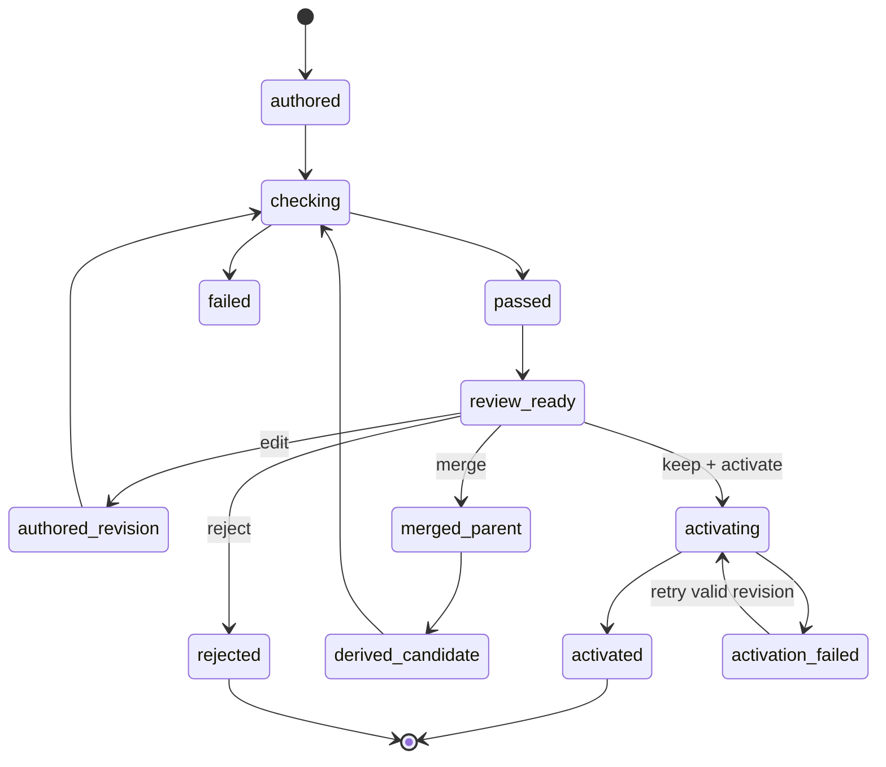
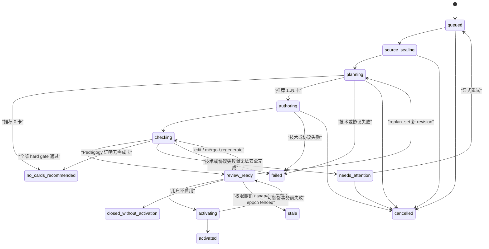
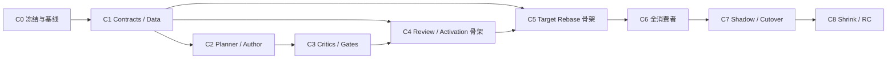

# 学习卡 V2 重构方案：价值优先生成、候选治理与 LearningTarget 重基

> 副标题：让系统判断什么值得学，只生成少量可回忆、可判分、可追溯的学习目标
>
> 状态：**Proposed — 待 Owner 评审后冻结**
>
> 文档类型：产品需求文档（PRD）+ 技术实施设计（TDD）
>
> 版本：0.1
>
> 日期：2026-08-14
>
> 强制前置：[`16-unified-learning-run-micro-journey-live2d-system-companion.md`](./16-unified-learning-run-micro-journey-live2d-system-companion.md) 视为**已经实施并冻结的学习运行底座**
>
> 适用范围：Note → 学习卡生成规划 → 候选创作与质量门禁 → 候选审核 → Card/LearningObjective 激活 → LearningRun handoff → Card/Review/Today/Journey/Pet/Star Map 目标读取
>
> 阅读导航：决策与边界见 §0–5；产品体验与内容标准见 §6–8；技术合同与链路见 §9–25；实施、验收与交付见 §26–32

---

## 0. 结论先行

当前学习卡问题不是单个模型、一次采样或几句 Prompt 的问题，而是产品合同和系统目标共同导致的稳定结果：系统把原文拆成原子事实，要求高覆盖，再做表面改写并尽量全部发布；正式卡片只保存标题、摘要、claim 和引文，最终自然表现为“很多张重新排版的笔记”。

本方案不继续修补旧链路，而是把学习卡生成主干重构为：

```text
NoteVersion
→ GenerationSpecV2
→ Learnability Planner
→ CardPlanV2（允许 0 张）
→ 内部 Candidate Authoring
→ Grounding Critic
→ Global Selector / Merge / Dedup
→ Pedagogy Critic
→ 用户候选审核
→ 原子激活 CardV2 + stable LearningObjective
→ LearningTargetSnapshotV2
→ 方案 16：LearningRun → Task → Artifact → Assessment → Commit
```

本方案冻结三条最重要的技术与产品事实：

1. **Candidate 不是 Card。** 只有通过完整质量闭包并由用户激活的对象才是正式学习卡。
2. **Card 不是排程主体。** `LearningObjective` 才是 LearningRun、Schedule、个人学习投影和星图中的稳定主体。
3. **LearningRun 不读取变化中的 Card 内容。** 它只评估 PREPARE 时冻结的 `LearningTargetSnapshotV2`。

一句话产品定义：

> **学习卡不是原文缩写，而是一个值得未来反复提取、可以独立作答和判分、并且有可信来源的稳定学习目标。**

---

## 1. 文档权威性、前置与冲突裁决

### 1.1 与方案 16 的关系

方案 16 被视为已经实施的前置底座，负责：

- 用户如何进入一次三分钟微旅程；
- Task 如何呈现和切换 interaction；
- 用户回答如何形成不可变 Artifact；
- Assessment 如何独立评估；
- Commit 如何成为唯一 canonical 学习写入边界；
- 何时创建或消费复习 Schedule；
- 如何通过 Pet、Today、Review、Star Map 和 Journey 进入同一 LearningRun。

本文负责其上游：

- 什么内容值得成为学习卡；
- 一篇笔记应该生成几张卡；
- 原子事实如何被合并、支持、丢弃或制卡；
- 候选如何编辑、合并、拒绝和激活；
- CardV2 如何提供稳定、版本化、可评估的 Learning Objective；
- Card 浏览、答案暴露和正式 LearningRun 之间如何衔接。

两份方案的边界是：

```text
本文：可信学习目标生产与激活
──────────────────────────────────────
方案 16：围绕冻结目标进行可信学习、评估与调度
```

本文不得建立第二套 Learning Session、Assessment、mastery、scheduler、projection 或 Pet runtime。

### 1.2 继续有效且不得回退的方案 16 约束

以下约束直接继承，不在本文重新发明：

1. 一个 LearningRun 只处理一个稳定学习目标；
2. `Task.intent` 与 `Variant.interaction` 解耦；
3. Artifact 不可变，锁定后不能原地修改；
4. Assessment 独立、严格解析且 fail closed；
5. 只有 trusted Commit 可以创建或消费正式 Schedule；
6. 浏览、朗读、看答案、提示后完成不能冒充掌握；
7. Pet 只能 propose，业务服务才 execute；
8. canonical envelope 是正式个人学习投影的唯一输入；
9. RLS、workspace/user 隔离、epoch、stale、幂等和审计必须成立；
10. Card、Review、Today、Star Map、Onboarding 和 Pet 仍进入同一 LearningRun。

### 1.3 本文替换或废止的旧方向

以下旧方向不再作为目标产品或正式实现：

- `overview / standard / complete` 作为数量策略；
- 任意全局最少卡数；
- standard 必须 5–15 张、overview 必须 3–8 张等区间；
- 原子事实天然等于候选卡；
- supported candidate 原则上必须全部发布；
- 一 candidate 一 card 的机械 fallback；
- 通过换语序、换连接词规避 n-gram 的“改写质量”；
- `title + summary + claim + quote` 作为正式学习卡核心语义；
- 总览卡作为可调度学习目标；
- 生成成功后自动发布、自动激活或自动创建复习计划；
- 非空、长度正确、标题不同就称为“自动 human evaluation”；
- LearningRun Planner 从 live `claim + quoteText` 临时拼通用问题；
- 结构题按标点或固定字数切 claim 生成；
- Assessment Worker 在执行时重新读取可能变化的 live Card 内容。

### 1.4 冲突裁决顺序

发生冲突时，按以下顺序裁决：

1. Owner 对本文的明确确认；
2. 方案 16 已冻结的 LearningRun / Trust / Commit / Schedule 不变量；
3. 本文冻结的 CardV2、LearningObjective、Candidate 和 TargetSnapshot 合同；
4. canonical、RLS、隐私、审计和幂等硬约束；
5. 旧方案中不冲突的实现细节。

### 1.5 立即生效的 Stop Line

本文进入评审后，在 `LearningTargetSnapshotV2` 接通前暂停扩展以下内容：

- 基于 `claim` 拼题面的最终 Task Planner；
- 按标点或每固定字数切 claim 的 ordering/relation/repair；
- Assessment 对 live `claim/quoteText` 的重新读取；
- 标题/摘要式 Card 页面的最终形态；
- 假定“生成成功必有 Card”的 Journey 最终串联；
- 以旧 claim/quote 为准的最终 Gold 和正式内容质量 Gate。

可以继续推进且无需暂停，但只允许严格按方案 16 已冻结合同实施、测试和修复缺陷：

- LearningRun 状态机、Artifact、Assessment、Commit；
- SSE、幂等、RLS、恢复、outbox、Schedule 和 Projection；
- LearningRunPlayer shell 与 renderer 基础；
- Pet、Bridge、History、durable delivery；
- 不依赖旧 Card 语义的安全、性能和可访问性工作。

CardV2 不得借“重接目标”修改方案 16 的 phase/terminal priority、Trust/purpose/disposition、Artifact-lock exposure、Commit 锁序、单 canonical envelope、schedule generation/恰一 successor、V1 事件序列化或历史 hash。任何这些语义变化必须另立版本化 amendment，不得混入本文实施。

---

## 2. 背景、现状与根因

### 2.1 用户问题

当前体验有四个核心问题：

1. 极短笔记也会生成 5–7 张卡；
2. 内容只是把原文换一种说法；
3. 卡片不产生回忆、判断、解释或应用动作；
4. 用户看卡片不如直接看笔记舒服，却承担了更多管理和复习负担。

这不是“卡片文案略差”，而是核心产品价值未成立。

### 2.2 当前系统为何稳定过度生成

现有链路包含相互强化的数量约束：

- 前端未提供有效的学习目标和数量控制；
- API 静默回退到 standard；
- standard Prompt 要求 5–15 张；
- 同一 Prompt 又为避免输出截断建议不超过 6 张；
- Extractor 强调全覆盖和复合句拆分；
- required bundle、candidate exactly-once 和 publish-all 倾向继续推高数量；
- validator 只校验自报 budget，不计算内容适配的合理数量。

因此 standard 的实际稳定区间正好接近 5–6 张。这不是随机异常，而是当前合同的合理产物。

### 2.3 当前内容为何照本宣科

旧 Extractor 的核心产物是 `claim`，Prompt 明确要求：

- 改写重述原文；
- 调整语序和连接词；
- 加入“是指”“作用是”等解释性套话；
- 将字符 n-gram 重合压到阈值以下；
- 不补充来源外信息。

这会奖励表面换皮，而不是教学转换。最终 canonical schema 又只保留标题、摘要、claim 和 quote，哪怕生成阶段短暂产生过 `learningObjective`，发布后也无法表达真正的检索任务、答案结构和评分标准。

### 2.4 当前质量门禁为何放行

现有 Critic 和 deterministic validator 主要保证：

- 有证据；
- 没有明显冲突；
- 字段齐全；
- coverage、hash 和协议完整。

以下真正决定用户体验的问题通常不阻断发布：

- 只是原文表面改写；
- 没有主动回忆要求；
- 学习目标不可验证；
- 多张卡语义重复；
- 过度拆分；
- 用户看原文成本更低；
- 卡数不适配当前笔记。

结果是 grounded 的低价值复述可以“完美通过”。

### 2.5 当前评测为何发现不了

现有 generation Gold 从 `2k_text` 起，缺少几十到几百字的 micro-note，也难以表达“应生成 0 张”。所谓 automated human evaluation 主要检查非空、长度、标题不同和概念子串召回；它会奖励术语复述，却无法判断卡片是否比重读原文更值得练。

### 2.6 根因结论

根因不是模型能力不足，而是系统目标错误：

```text
当前目标：尽量覆盖原文事实，并让表面措辞不同
目标产品：选择少量值得反复提取的目标，并形成可作答、可判分的学习任务
```

仅换模型、改温度、切换 overview 或提高相似度阈值，都不能解决这一结构性问题。

---

## 3. 产品目标、非目标与不变量

### 3.1 产品目标

1. 短笔记默认产生 0–2 张高价值卡，而不是按句子拆卡；
2. 允许并善于返回 0 张；
3. 每张激活 Card 恰好对应一个稳定、可调度的 Learning Objective；
4. 卡片正面要求一次认知动作，答案默认不泄漏；
5. 用户可以在发布前快速保留、编辑、合并或拒绝；
6. Card 激活不代表学会，也不创建复习计划；
7. LearningRun 可以直接消费 objective、canonical answer、rubric 和 evidence snapshot；
8. 卡片编辑、归档、来源删除不破坏历史 Run、Artifact、Assessment 或 Commit；
9. 生成质量可以由 micro-note Gold、确定性 Gate、独立 Judge 和真人盲评共同验证；
10. 最终以延迟回忆收益和复习负担衡量成功，而不是生成卡数。

### 3.2 非目标

- 不在本文重建 LearningRun、Task Player、Assessment 或 scheduler；
- 不让 Card 固定未来每次 LearningRun 的交互 UI；
- 不以“越不像原文”作为唯一质量目标；
- V1 不使用来源外知识补全应用场景或扩展解释；
- 不让生成模型直接决定用户 mastery、schedule 或星图状态；
- 不通过隐藏拒绝、弱化编辑或默认多选提升候选保留率；
- 不为未上线旧客户端长期维护双 writer 和双 canonical schema；
- 不以更多卡、更长卡或更多 Agent 步骤包装价值；
- 不让 overview/导读进入正式复习队列；
- 不把 Candidate Review 变成高摩擦的卡片制作器。

### 3.3 二十条产品与工程不变量

1. **允许 0 张。** 任意模式均无卡数下限。
2. **一张激活 Card 恰好一个 stable LearningObjective。**
3. **原子事实只是内部材料，不天然等于卡。**
4. **每个可靠来源信息点必须有处理决策，但不要求全部制卡。**
5. **Candidate 不能进入 LearningRun、Schedule、mastery、Today 或正式星图。**
6. **Card 激活也不能创建 Schedule；首次 trusted Commit 才可以。**
7. **Card strategy 不等于 Task intent，更不等于 interaction。**
8. **Card 正面不得直接泄漏 required answer。**
9. **答案和原文证据默认折叠，显式 reveal 必须先记 exposure。**
10. **不自动发布、不自动开始 Run、不自动创建 Schedule。**
11. **Active Card 页面只有一个主学习行动：开始/继续三分钟巩固。**
12. **用户数量设置是上限，不是需要凑满的目标。**
13. **最多 1 张时只选最高价值目标，不把无关目标塞进一张杂烩卡。**
14. **Candidate edit/merge/repair 创建新 immutable revision。**
15. **Card 激活后的目标变化必须版本化；无法证明语义等价时创建新 Objective ID。**
16. **历史 Run 永远使用 PREPARE 时冻结的 TargetSnapshot。**
17. **归档或删除 Card 不得级联删除正式学习历史。**
18. **Provider/Critic 失败不得降级发布复述卡；可以重试、保留其他已完整过门禁的少量卡，或明确失败；只有语义决策才可返回 0 卡成功。**
19. **卡数、候选数和 Agent 步骤数不作为成功指标。**
20. **任何正式个人学习变化仍只来自方案 16 的 trusted Commit。**

---

## 4. 目标产品架构

```mermaid
flowchart LR
  N["NoteVersion\nsealed source"] --> GS["GenerationSpecV2"]
  GS --> E["Evidence / Knowledge Atoms"]
  E --> LP["Learnability Planner"]
  LP -->|"0 cards"| Z["No Cards Recommended\nsuccess"]
  LP -->|"objectives"| CP["CardPlanV2"]
  CP --> A["Candidate Author"]
  A --> GC["Grounding Critic"]
  GC --> S["Global Selector\nmerge / dedup / rank"]
  S --> PC["Pedagogy Critic"]
  PC --> CR["Candidate Review"]
  CR --> ACT["Atomic Activation"]
  ACT --> C["CardV2"]
  ACT --> O["Stable LearningObjective"]
  ACT --> EV["Immutable Evidence Snapshot"]
  O --> TS["LearningTargetSnapshotV2"]
  TS --> LR["方案 16 LearningRun"]
  LR --> T["Task"]
  T --> AR["Artifact"]
  AR --> AS["Assessment"]
  AS --> CM["Commit"]
  CM --> SC["Schedule / Projection"]
```



### 4.1 五个职责域

| 域 | 负责 | 明确不负责 |
| --- | --- | --- |
| Source / Evidence | 封存 NoteVersion、精确引用、图片区域、内容 hash、证据可追溯性 | 不决定卡数，不评价学习价值 |
| Learnability Planner | 识别独立学习目标、合并关系、边际价值、数量上限、零卡决策 | 不写最终文案，不直接发布 |
| Candidate Author + Critics | 生成 CardV2 草案，验证 grounding、教学价值、去重和可判分性 | 不代表用户保留，不写 mastery/schedule |
| Candidate Review / Activation | 用户保留、编辑、合并、拒绝；原子创建 Card/Objectives/Revisions | 不判定用户学会，不创建 Schedule |
| 方案 16 LearningRun | 生成本轮 Task、收集 Artifact、Assessment、Commit、调度和投影 | 不读取 generation draft，不修复低质卡 |

### 4.2 核心对象关系

```text
一个 GenerationRun
→ 一个 immutable GenerationSpec
→ 一个或多个 CardPlan revision
→ 零个或多个 Candidate
→ 每个 Candidate 有多个 immutable revision

一个已激活 Card
→ 恰好一个 stable LearningObjective
→ Card 与 Objective 各自版本化
→ 一个 Objective revision 绑定一组 immutable Evidence Snapshot

一个 LearningRun
→ 绑定一个 stable LearningObjective ID
→ PREPARE 冻结一个 LearningTargetSnapshot
→ 后续不再读取 live Card 内容
```

---

## 5. 核心领域模型与身份裁决

### 5.1 Card、LearningObjective 与 LearningTarget

三个概念必须明确区分：

| 对象 | 定义 | 稳定性 |
| --- | --- | --- |
| `LearningCard` | 用户浏览和进入学习的内容载体 | stable ID + presentation revisions |
| `LearningObjective` | 用户未来需要独立提取和验证的学习目标 | stable ID + semantic revisions |
| `LearningTargetSnapshot` | 某次 LearningRun 在 PREPARE 时冻结的目标全量快照 | immutable，按 Run 唯一 |

卡片是展示和入口，不是 mastery 或 schedule 的稳定身份。LearningObjective 才是：

- LearningRun target；
- review schedule subject；
- presentation history 与 exposure scope；
- canonical learning event subject；
- Personal Projection / Star Map 的学习节点身份。

### 5.2 迁移期 Key Point 语义

为保护方案 16 已存在的 Run、Schedule、Projection 和事件引用，迁移期优先复用现有 Key Point UUID：

```ts
type KeyPointId = LearningObjectiveId;
```

物理列和部分 wire contract 可以在单次迁移窗口继续叫 `keyPointId`，但其业务语义必须从“原文拆出的一条 claim”升级为“稳定、可调度的 Learning Objective”。

最终公共合同只保留 `learningObjectiveId`，不长期双写两个同义字段。

### 5.3 一张卡一个目标

一张 Card 可以包含多个 supporting facts，只要它们共同服务于同一个检索动作。

合法：

- “从低到高写出 OSI 七层”——七层名称是同一顺序目标的答案单元；
- “比较 TCP 与 UDP”——多个比较维度属于同一 comparison 目标；
- “重建光合作用主要过程”——多个步骤属于同一 sequence/procedure 目标。

不合法：

- 同一卡同时要求记住定义、解释机制、列出历史人物和完成无关应用题；
- 为满足“最多 1 张”把多个独立目标拼成一张；
- 一张 Card 内放多个独立可调度 Key Point，再让用户分别复习。

### 5.4 Objective 身份与 Revision 分类

```ts
type ObjectiveRevisionClassV2 =
  | "presentation_only"
  | "target_equivalent"
  | "semantic_change";

type ObjectiveEquivalenceReportV2 = {
  version: 2;
  reportId: string;
  objectiveId: string;
  priorObjectiveRevisionId: string;
  priorTargetRevisionHash: string;
  proposedCandidateRevisionId: string;
  proposedCandidateRevisionHash: string;
  proposedSemanticContentHash: string;
  proposedEvidenceBindingPlanHash: string;
  verdict: "equivalent" | "semantic_change" | "abstain";
  checks: {
    objectiveMeaningEqual: boolean;
    canonicalAnswerMeaningEqual: boolean;
    requiredRubricEqual: boolean;
    boundaryEqual: boolean;
  };
  policyVersion: string;
  authorizedBy: "deterministic_policy_and_human" | "migration_adjudication";
  reportHash: string;
};

type ObjectiveEquivalenceBindingV2 = {
  reportId: string;
  reportHash: string;
  priorObjectiveRevisionId: string;
  resultingObjectiveRevisionId: string;
  resultingTargetRevisionHash: string;
  activatedCandidateRevisionId: string;
  evaluatedCandidateEvidenceBindingPlanHash: string;
  resultingEvidenceBindingSetHash: string;
  bindingHash: string;
};
```

Equivalence Report 在激活前只评估 exact Candidate revision 与当前 Objective revision，不能引用尚未创建的正式 revision/hash。Activation 事务先重算 Candidate 的 semantic content 与 `candidateEvidenceBindingPlanHash` 是否完全匹配 report，再创建新 Objective revision/canonical bindings，并原子写 `ObjectiveEquivalenceBindingV2`，把 pre-activation plan hash 映射到 resulting binding set/revision/target hash。任何输入漂移、`semantic_change` 或 `abstain` 都不得走 `target_equivalent_update`。这样不存在“先要正式 revision/binding ID 才能生成 report、又先要 report 才能创建 revision”的闭包循环。

#### `presentation_only`

只创建 Card revision，不创建 Objective revision：

- 标题、排版、提示语；
- front 的非答案性措辞优化；
- media、视觉层级和不改变学习内容的展示格式；
- 估计复习时间和推荐 strategy；
- 不改变目标、canonical answer、required rubric 或 evidence meaning 的修正。

影响：进行中的 Run 不 stale，Schedule 和历史 mastery 保留。

#### `target_equivalent`

保留同一 Objective ID，但创建新 objective revision：

- objective statement 的等价澄清；
- evidence 定位修复或更换为同义、同强度的来源；
- canonical answer 的非语义性错字修正；
- 不改变 required rubric 集合和答案边界的解释补充。

影响：已经 PREPARE 的 Run 继续使用其 frozen snapshot，不切换内容也不因等价修订自动 stale；Schedule 继续绑定 stable Objective；历史 mastery 保留；下一次 Run 使用新 revision。新旧 revision 必须有服务端认可的 equivalence decision，模型不能自行声明等价。

#### `semantic_change`

必须创建新 Objective ID：

- canonical answer 核心含义变化；
- required rubric 增删或边界变化；
- 从记住定义变成比较、应用或边界判断；
- merge 或 split；
- 原结论被修正、否定或证据不再支持；
- 无法证明新旧目标语义等价。

影响：创建新的 Card + Objective pair；旧 pair superseded；旧 pending Schedule 显式关闭；历史 mastery 不自动迁移；新目标必须重新完成首次 trusted LearningRun。

### 5.5 身份继承的保守原则

模型不能单独决定新目标继承旧 mastery。same-ID 只允许白名单变化；一旦涉及 answer meaning、required rubric、merge/split 或不确定性，默认新建 Objective ID。

---

## 6. 核心产品体验

### 6.1 首次从笔记生成

```text
保存精确 NoteVersion
→ 点击“生成学习卡”
→ 展示智能默认摘要，可展开设置
→ 异步分析学习目标
→ 返回推荐候选或零卡结果
→ 用户保留、编辑、合并或拒绝
→ 原子激活选中卡
→ 明确告知尚未创建复习安排
→ 用户选择现在开始首次 LearningRun 或稍后再做
```

生成可以后台运行，用户可以离开。前台只显示真实阶段：

```text
正在封存当前笔记版本
→ 正在判断哪些内容值得反复学习
→ 正在合并重复或过碎的信息
→ 正在核对答案与原文依据
→ 正在检查卡片是否真正可练
→ 候选已就绪 / 暂不建议制卡
```

不显示无法由真实工作量支撑的伪百分比，也不以 Agent 活动条数包装质量。

### 6.2 生成前的智能默认

默认入口保持轻量，不要求用户先填写完整表单。生成按钮附近显示一行摘要：

> 当前全文 · 以理解为主 · 智能数量（可能为 0）

可展开设置包括：

#### 来源范围

- 当前选区；
- 当前章节；
- 整篇笔记。

存在有效选区时默认当前选区，否则默认整篇笔记。无论选哪种范围，都必须保存并绑定精确 NoteVersion、block/selection manifest 和内容 hash。

#### 学习目标

- 理解并能解释：默认；
- 记住关键事实；
- 能够应用；
- 考试复习。

它表示 CardPlan 的取向，不直接等于方案 16 的 `LearningRun.goal`。

“考试复习”只提高来源内 critical Objective、易混点和边界的优先级，不授权编造考题、外部知识或增加最低卡数。

#### 细节倾向

- 精简；
- 平衡：默认；
- 深入。

它只调整 optional Objective 的纳入阈值与 explanation 深度。`深入` 不恢复全覆盖或卡数下限；`精简` 也不能遗漏 critical Objective。

#### 数量

- 智能数量：默认，可为 0；
- 最多 N 张。

`hardMaxCards` 永远只是上限。系统不得为了凑满上限生成低价值卡。

#### 卡片策略偏好

可选但不必默认展开：

- 回忆；
- 填空；
- 比较；
- 顺序；
- 原因；
- 边界；
- 应用。

这些只是候选展示与学习结构偏好，不锁定未来 LearningRun interaction。

### 6.3 候选审核页

候选审核页首先回答“为什么是这些卡”，而不是强调系统产出了多少。

默认 quick review 首屏只展示题面、一句价值理由、选中状态和“启用 N 张”；答案、来源、未制卡决策、类型、预计时间与高级编辑进入二级展开。目标是让用户在不校对答案时，用一次扫读完成决策，而不是先阅读一份比原笔记更复杂的报告。

顶部显示：

- 建议保留 N 张；
- 预计单轮复习负担；
- “X 个信息点已整合为 Y 个学习目标”；
- 未制卡内容的折叠摘要；
- 如果与已有 active cards 重复，展示已覆盖关系。

每个候选显示：

- 用户语言的学习目标；
- 正面题面；
- knowledge form / 推荐策略；
- “为什么建议保留”；
- 折叠的答案；
- 折叠的原文依据；
- 预计复习时间；
- 与现有卡或同组候选的重复提示。

支持：

- 保留或取消保留；
- 编辑题面、答案或学习目标；
- 选择两张或多张后合并；
- 单张重做；
- 拒绝；
- 整组重新规划；
- 查看原文依据；
- 拒绝全部。

### 6.4 审核交互原则

- `recommended=true` 是服务端推荐，不是用户 `keep` 决定；UI 可以把推荐项作为本地 review draft 默认选中，用户可以一键取消；
- 1–3 张候选应能在极短时间内完成审核；
- 高级编辑默认折叠；
- 合并不依赖拖拽，支持“选择 → 合并”；
- 合并不是字符串拼接，必须生成新 derived candidate 并重新过全部 Gate；
- 无关目标不得因为用户请求合并而越过“一卡一目标”；
- 用户编辑 Objective、answer 或 evidence 选择后，服务端重新派生 rubric；旧 Critic 报告立即失效；用户不直接编辑 server-private 判分合同；
- 点击激活时，最终选中集合随 Activation Request 提交，并在同一事务中固化 selected=`keep`、其余=`reject:not_selected_at_activation`；用户无需逐卡再点一次“保留”；
- 选中 0 张时，主行动改为“不保留这些候选”；
- 拒绝全部是合法结果，不是失败。

### 6.5 原子激活

候选审核必须明确提供两条路线：

1. **直接启用并开始验证**：不 reveal/编辑 canonical answer，可在激活后立即进入方案 16 的 formal eligibility 判断；
2. **先校对内容**：reveal 或编辑答案后明确标记“已预习”，立即 Run 默认为 practice；系统将非正式 `initial_validation_reminder` 延后到版本化 cooldown 到期，再从 Today/Card 进入首次可信验证。该 reminder 不是 Schedule、mastery 或 canonical learning fact。

每个新 Objective 激活时都创建 Initial Validation Reminder：未 reveal 的 `qualificationNotBefore=activatedAt`，用于“稍后再学”；已 reveal 的按 cooldown 延后。立即开始验证的用户仍共享同一 Reminder，trusted first Commit 后原子完成它。

V1 的 `preRunRevealPolicyVersion` 默认 cooldown 为 24 小时；真实 beta 数据可通过版本化 policy 调整，但不得追溯改写已有 Exposure/reminder。用户再次 reveal 会重新计算 `qualificationNotBefore`。若方案 16 Planner 能生成经独立 disclosure qualification 证明不等价的 transfer Task，可以在 cooldown 前 formal；简单定义/事实默认无法取得该资格。

“启用选中的 N 张”必须原子执行：

- 所有选中候选重新校验 current revision；
- 重新校验双 Critic、deterministic report 和 plan hard max；
- 任一候选失效时整组不产生部分激活；
- 幂等重放返回同一 activation receipt；
- 成功后才创建 stable LearningObjective、Objective revision、Card、Card publication revision 和 Objective EvidenceBindings；Evidence Snapshot 已在 Author 前 seal，Support Report 已在 quality 阶段生成，激活只绑定而不首次创建它们；
- 未选、拒绝、过期或合并父候选永远不成为正式目标。

成功文案：

> 已启用 2 张学习卡。它们还没有进入复习安排；完成第一次可信巩固后，系统才会安排复习。

主行动：

- 未 reveal：“用三分钟开始第一次验证”；
- 已 reveal：“现在练一下（不计掌握）”或“到可验证时提醒我”。

次行动：

- “稍后再学”；
- “查看已启用的卡”。

激活后不得自动跳入 LearningRun。

### 6.6 零卡体验

`no_cards_recommended` 是成功终态，必须与技术失败分离。

合法原因包括：

- 内容只是临时提醒、事件记录或装饰信息；
- 没有值得未来重复提取的独立目标；
- 内容过于含糊，无法形成可判分答案；
- 当前 active cards 已完整覆盖；
- 用户选择应用，但来源不足以构造有依据的应用目标；
- 来源本身无法支持任何有教学增值的转换；
- 新增卡的复习成本高于边际学习收益。

默认文案：

> 已完成分析。这段内容更适合直接阅读，暂不建议制作学习卡。

按原因提供：

- 继续阅读笔记；
- 补充上下文；
- 改为记忆或理解目标；
- 查看已经覆盖它的卡片；
- 选择另一篇资料。

不能使用红色错误态，也不能写“AI 没生成出来”。

若 Planner 已确认存在值得学习的 Objective，但本轮 Author 只写出了表面复述，这是生成质量失败，必须进入 `needs_attention`，不能用零卡文案掩盖。

### 6.7 Active Card 页面

默认展示：

- 学习目标；
- 正面题面；
- 当前个人学习状态；
- 唯一主行动：“开始/继续三分钟巩固”。

答案、解释、常见误区和原文证据是次级折叠工具。卡片列表不得直接展开完整答案。

Card 页面可以帮助阅读和预习，但正式学习证明仍进入方案 16 的 LearningRun。

### 6.8 卡片更新与重新生成

对已有 active Card 的笔记重新生成时，CardPlan 必须输出 change proposal：

```text
keep_existing
propose_new
propose_replace
propose_archive
```

新候选在用户确认前不得覆盖旧卡；新 change set 原子激活前，旧卡和旧 Schedule 保持可解释状态。

变更分类遵守 §5.4：

- presentation-only 只升 Card revision；
- target-equivalent 升 Objective revision；已 PREPARE Run 继续用 frozen snapshot，新 Run 使用新 revision；
- semantic change 创建新 Objective ID，旧 Schedule 不自动迁移。

### 6.9 用户反馈

Set 级反馈：

- 卡太多；
- 卡太少或漏重点；
- 太像原文；
- 学习目标不对；
- 与已有卡重复；
- 整体不值得制卡。

Card 级反馈：

- 只是换句话说；
- 太简单；
- 太宽泛；
- 拆得太碎；
- 与另一张重复；
- 答案不清楚；
- 原文依据不对；
- 内容错误；
- 我不想学这个。

反馈最多一步、允许跳过，不阻塞拒绝或激活。自由文本可选且受长度、加密和日志脱敏约束。

---

## 7. CardV2 内容模型与学习策略

### 7.1 Knowledge Form

```ts
type KnowledgeFormV2 =
  | "fact"
  | "definition"
  | "relationship"
  | "comparison"
  | "sequence"
  | "procedure"
  | "causal_model"
  | "boundary"
  | "application_rule";
```

Knowledge Form 描述目标的知识结构，用于 Planner 选择适合的 Task intents 和 interaction candidates。

### 7.2 Card Strategy

```ts
type CardStrategyV2 =
  | "recall"
  | "cloze"
  | "compare"
  | "sequence"
  | "why"
  | "boundary"
  | "application";
```

Card Strategy 是当前卡片 presentation 的推荐学习方式，不是方案 16 的 Task interaction。

本文出现的 `TaskIntentV1` 直接复用方案 16 的 shared contract 与枚举版本，不在 Card 域复制一套近似 enum。

映射示例：

| Card Strategy | 推荐 Task intent | 可用 interaction |
| --- | --- | --- |
| recall / cloze | recall | text、voice |
| compare | relate | open response、relation canvas |
| sequence | procedure | voice、ordering、repair |
| why | explain | voice、text、relation |
| boundary | boundary | text、voice、repair |
| application | apply | voice、text、scenario |

同一 procedure 卡可以在不同 LearningRun 中使用排序、口述步骤或修复错误顺序，不能被 Card strategy 永久锁死。

### 7.3 Card 正面标准

正面必须包含一个清晰认知动作：

- 回忆一个事实或定义；
- 解释机制或因果；
- 比较关键维度；
- 重建顺序或流程；
- 识别适用边界；
- 在来源支持的情境中应用。

正面不得：

- 直接陈述完整答案；
- 仅用标题替代问题；
- 把原文段落整体搬过来；
- 同时要求多个无关目标；
- 使用无法判分的“谈谈你的感受”；
- 暗含来源外知识才能作答。

`publicSummary` 只说明“要练什么能力/主题”，不得用一句陈述把答案提前说完；它与 front 一起进入 answer-leakage Gate。

### 7.4 Card 背面标准

背面必须提供：

- canonical answer；
- 简洁解释；
- exact evidence refs；
- 必要时提供 common mistake；
- 能支持方案 16 Assessment 的 server-private rubric。

背面不是另一篇摘要。它应当使用户能快速核对自己遗漏了什么。

### 7.5 V1 来源边界

V1 不引入来源外事实。对于用户选择“应用”但原文没有边界、条件或应用材料的情况：

- 不编造场景；
- 返回 `unsupported_for_requested_goal`；
- 建议补充来源或切换为理解/记忆目标；
- 如果仅能生成来源内回忆卡，则明确解释目标降级并要求用户确认。

### 7.6 正向教学转换规范与 Annotated Gold

反复学习的增值主要发生在正面：它隐藏答案并要求提取、重建、比较、判断或应用。背面为了忠实和便于核对，可以与原文措辞接近；“背面像原文”本身不是失败。失败的是 `front + answer` 只把同一段重新排版，用户无需回忆即可完成。

每个 Candidate 至少声明一种 `transformationKind`，并通过对应结构 Gate：

```ts
type TeachingTransformationV2 =
  | "retrieval_definition"
  | "mechanism_reconstruction"
  | "structured_comparison"
  | "procedure_reconstruction"
  | "boundary_discrimination"
  | "misconception_correction"
  | "source_grounded_application";
```

| 类型 | 来源片段（简化） | 不合格卡 | 合格正面 / 答案结构 | 增值原因 |
|---|---|---|---|---|
| 定义 | “机会成本是选择一个方案而放弃的最佳替代方案的价值。” | “机会成本是指什么？”背面原句，且正面摘要已经写出“放弃的最佳替代价值” | 正面：“做出选择时，机会成本取哪一个被放弃方案的价值？”；答案：`最佳替代方案` + 完整定义 | 隐藏判别点，required unit 可判分；不是把定义提前放在标题 |
| 机制 | “升高温度使粒子碰撞更频繁且有效碰撞增加，因此反应更快。” | 拆三张：“温度升高怎样？”“碰撞怎样？”“反应怎样？” | 正面：“温度升高为什么会加快该反应？重建中间链条。”；答案：`温度↑ → 碰撞频率/有效碰撞↑ → 速率↑` | 将同一因果链组合成一次机制重建，减少碎片复习 |
| 比较 | “TCP 可靠、有连接；UDP 无连接、开销低。” | 两张孤立摘要：“TCP 特点？”“UDP 特点？” | 正面：“按连接、可靠性、开销三个维度比较 TCP 与 UDP。”；答案：comparison rows | 以相同维度对齐差异，支持关系/开放任务和完整判分 |
| 流程 | “先解析，再规划，再执行，最后验证。” | 四张“第一步是什么” | 正面：“从输入到结果重建这四步，并指出验证为什么必须在最后。”；答案：ordered units；若来源未说明原因，则只问顺序 | 形成整体程序模型；严格受来源边界约束 |
| 边界 | “只有样本独立同分布时，该推导成立。” | “该推导成立条件是独立同分布。” | 正面：“样本只满足独立但不同分布，能否直接使用该推导？缺了哪个条件？”；答案：不能 + 同分布 | 要求识别适用边界，而非复述条件清单 |
| 纠错 | “缓存能降低平均延迟，但不能保证每次请求都更快。” | “缓存有什么作用？” | 正面：“判断并纠正：用了缓存后，每次请求都会更快。”；答案：错误 + 平均延迟/命中条件边界 | 激活常见误解；错误命题必须由来源明确支持 |
| 应用 | “当任务可拆为互不依赖子任务时可以并行。” | 编造与原文无关的复杂业务场景 | 正面：“来源中的任务存在共享可变状态，能否直接按该规则并行？先判断前提。”；答案：不能直接；互不依赖前提不满足 | 在来源已给边界内做新判断，不引入外部事实 |

OSI 短笔记的 annotated Gold：

- 不合格：每层一张“X 层负责什么”，再额外一张总览；
- 合格 A：“从低到高重建七层” → `ordered_steps`；
- 合格 B：“把比特流、帧、路由、端到端传输等职责匹配到层” → `mapping`；
- `concise` 只保留 B 或 Planner 认为边际价值最高的一张；`balanced` 最多 A+B；不得因七个名词生成七张。

Author Prompt 不得只列禁令，必须要求输出：`transformationKind`、被隐藏的 answer units、可判分 rubric、为什么相对重读具有边际价值。Critic 只保存结构化 verdict/reason，不要求或存储 chain-of-thought。

---

## 8. Learnability Planner 与数量决策

### 8.1 数量原则

卡片数量由独立、高价值、可检索的 Learning Objective 数量决定，不由字符数、段落数、标题数、bundle 数或 atomic fact 数直接决定。

数量规则：

- 永远没有最小卡数；
- 用户 `hardMaxCards` 是 hard cap，不是目标；
- micro-note 通常 0–2 张，超过 2 张必须给出彼此独立且高价值的目标证据；
- overview/导读不计入学习卡数，也不进入 scheduler；
- 同一目标的多个 facts 优先组合成结构化答案；
- 新增一张卡必须有相对已有卡的边际学习价值；
- 如果直接重读原文更快且没有损失，Planner 应返回 0 张；
- 完整覆盖只改变选择阈值，不能恢复 publish-all 或数量下限。

### 8.2 Planner 输入

Planner 读取：

- sealed NoteVersion；
- 当前 generation learning goal；
- 用户设置的 hard cap；
- source/evidence manifest；
- 当前 workspace 已有 active Objectives，用于去重；
- 同次生成中的 Knowledge Atoms；
- 上一轮结构化反馈；
- 不包含个人回答正文、音频、mastery 或复习表现。

Generation 侧不得根据个人学习表现为单个用户重写共享 Card。如果未来产品引入个人私有卡，必须另行冻结隔离模型；本文 V1 不授权该扩展。

### 8.3 Knowledge Atom 不是 Candidate

完整解析仍可形成细粒度 Knowledge Atom：

```ts
type KnowledgeAtomV2 = {
  atomId: string;
  proposition: string;
  evidenceRefIds: string[];
  sourceSectionKeys: string[];
  importanceBps: number;
  learnabilityBps: number;
  confidenceBps: number;
};
```

每个提取出的 Atom 都必须得到一个决策；不可靠 Atom 也要显式标记 `omit_unreliable`：

```ts
type AtomDecisionV2 =
  | {
      atomId: string;
      decision: "create_objective";
      objectiveLocalId: string;
    }
  | {
      atomId: string;
      decision: "support_objective";
      objectiveLocalId: string;
    }
  | {
      atomId: string;
      decision: "covered_by_existing_objective";
      existingLearningObjectiveId: string;
    }
  | {
      atomId: string;
      decision:
        | "omit_trivial"
        | "omit_duplicate"
        | "omit_not_learnable"
        | "omit_unreliable"
        | "unsupported_for_requested_goal";
    };
```

Coverage 的新含义是“每个可靠信息点都有可解释决策”，不是“每个信息点都必须变成卡”。

### 8.4 边际学习价值

Planner 为每个潜在 Objective 评估：

- `importance`：对当前主题是否关键；
- `retrievalValue`：未来离开原文后是否值得提取；
- `testability`：能否形成明确题面、答案和 rubric；
- `distinctiveness`：是否与现有或同组目标重复；
- `transferPotential`：来源是否支持解释、边界或应用；
- `evidenceConfidence`：答案是否有可靠来源；
- `estimatedReviewCost`：每次复习成本；
- `marginalGain`：相对已选目标新增了什么。

不要求暴露模型 chain-of-thought。服务端只保存结构化分数、reason codes、选择结果和可审计摘要。

### 8.5 CardPlan 结果

Planner 只能返回两类结果：

```ts
type NoCardReasonCodeV2 =
  | "no_learnable_objective"
  | "review_cost_exceeds_value"
  | "already_covered_by_active_objectives"
  | "source_is_temporary_or_operational"
  | "insufficient_reliable_evidence"
  | "no_pedagogically_useful_transformation"
  | "unsupported_for_requested_goal";

type PlannedObjectiveV2 = {
  objectiveLocalId: string;
  objectiveStatement: string;
  priority: "critical" | "important" | "optional";
  knowledgeForm: KnowledgeFormV2;
  sourceAtomIds: string[];
  reasonCodes: string[];
  estimatedReviewCostSeconds: number;
  changeContext:
    | { kind: "create_new" }
    | {
        kind: "update_existing";
        cardId: string;
        objectiveId: string;
        expectedPublicationRevision: number;
        expectedObjectiveRevision: number;
        expectedObjectiveLifecycleEpoch: number;
      };
};

type PlannedExistingLifecycleActionV2 = {
  actionId: string;
  kind: "keep_existing" | "propose_archive";
  cardId: string;
  objectiveId: string;
  expectedPublicationRevision: number;
  expectedObjectiveLifecycleEpoch: number;
  reasonCodes: string[];
};

type CardPlanV2 = {
  version: 2;
  planRevisionId: string;
  runId: string;
  inputSnapshotHash: string;
  cardContentEpoch: number;
  planVersion: number;
  previousPlanRevisionId: string | null;
  result:
    | {
        kind: "no_cards_recommended";
        reasonCodes: NoCardReasonCodeV2[];
      }
    | {
        kind: "author_candidates";
        recommendedCardCount: number;
        activationHardMax: number;
        objectives: PlannedObjectiveV2[];
        existingActions: PlannedExistingLifecycleActionV2[];
      };
  atomDecisions: AtomDecisionV2[];
  planHash: string;
};
```

不变量：

- `recommendedCardCount >= 0`；
- 存在 request hard cap 时，`activationHardMax <= request hard cap`；无论是否存在客户端 hard cap，都不得超过服务端 policy cap；
- Planner 输出 budget 由服务端冻结，Author 不能扩大；
- `no_cards_recommended` 是成功结果；
- 计划 reason 只保存 reason code 和短摘要；
- CardPlan 发生修改必须升 `planVersion` 并改变 `planHash`。
- Generation Run 通过 `currentPlanVersion` CAS 指向当前 immutable plan revision；replan 不原地修改，所有 Candidate/Report/Gate/Activation 都绑定 exact `planRevisionId + planHash`；旧计划下未激活 Candidate 自动 supersede。

### 8.6 OSI micro-note 目标结果

对于约 153 字、列出 OSI 七层及主要职责的笔记，默认理解目标应优先规划：

1. 顺序目标：“从低到高写出 OSI 七层”；
2. 职责匹配目标：“把比特流、帧与纠错、路由、端到端传输、会话、表示、应用接口匹配到对应层”。

不得接受：

- 按原文段落机械拆成 4–7 张摘要卡；
- 每层一张“某层负责什么”的低价值改写卡；
- 同时创建总览卡并额外计入复习负担。

如果用户选择快速理解，Planner 可以只推荐职责匹配目标。

---

## 9. GenerationSpec 与完整版本闭包

本文架构图中的 `GenerationSpecV2` 是 `GenerationSemanticSpecV2 + GenerationInputSnapshotV2` 的统称：前者描述可复用的生成语义与运行时策略，后者描述本次 Run 的来源、transport 审计与写代际。实现中不得把两者重新塞回一个 hash-unique JSON 对象。

### 9.1 客户端请求

```ts
type CardLearningGoalV2 =
  | "remember"
  | "understand"
  | "apply"
  | "exam";

type CardGenerationFeedbackReasonV2 =
  | "too_many"
  | "missing_key_objective"
  | "surface_paraphrase"
  | "wrong_learning_goal"
  | "duplicate_existing_card"
  | "not_worth_reviewing";

type SourceScopeV2 =
  | { kind: "whole_note" }
  | { kind: "section"; sectionKey: string }
  | {
      kind: "selection";
      blockRanges: Array<{
        blockId: string;
        startOffset: number;
        endOffset: number;
      }>;
    };

type CreateCardGenerationRunRequestV2 = {
  version: 2;
  noteVersionId: string;
  sourceScope: SourceScopeV2;
  learningGoal: CardLearningGoalV2;
  detailThreshold: "concise" | "balanced" | "deep";
  quantity: { kind: "adaptive"; hardMaxCards?: number };
  preferredStrategies?: CardStrategyV2[];
  feedbackContext?: {
    previousRunId: string;
    reasonCodes: CardGenerationFeedbackReasonV2[];
    optionalNote?: string;
  };
  reusePolicy?: "allow_exact_reuse" | "force_recompute";
  clientRequestId: string;
};
```

约束：

- `hardMaxCards` 只表示用户可选的额外上限；服务端 policy cap 永远同时生效；
- 允许 0 张是服务端永久不变量，客户端不能关闭；
- Prompt、模型、Critic 和 policy 版本不能由客户端指定；
- `feedbackContext` 必须进入 fingerprint；
- `Idempotency-Key` 只由 HTTP header 提供；同一 key、不同请求内容必须返回冲突；
- `force_recompute` 只控制是否跳过结果复用，不进入 semantic fingerprint；`clientRequestId` 与 header idempotency key 同样不进入 semantic fingerprint；

产品与 API 只允许以下一份控件映射：

| UI 控件 | 默认 | API 字段 | hard/soft | 进入 semantic spec hash |
|---|---|---|---|---|
| 来源范围 | 有选区则选区，否则全文 | `sourceScope` | hard | 是 |
| 学习目标 | 理解并能解释 | `learningGoal`（remember/understand/apply/exam） | Planner objective | 是 |
| 细节倾向 | 平衡 | `detailThreshold` | soft inclusion threshold，不是卡数目标 | 是 |
| 最多 N 张 | 默认不展示/未设置 | `quantity.hardMaxCards` | hard cap | 是 |
| 卡片策略 | 无强制偏好 | `preferredStrategies` | soft prior | 是 |
| 根据上次反馈重做 | 无 | `feedbackContext` | soft + audit | 是 |

不得在 Web、API 或 worker 另设 `density/overview/standard/complete`；“精简/平衡/深入”只调整 Objective 纳入证据阈值，不能定义最小或目标卡数。

### 9.2 服务端 Semantic Spec 与 Run Input Snapshot

```ts
type GenerationStageRuntimeSnapshotV2 = {
  stage: "planner" | "author" | "grounding_critic" | "pedagogy_critic";
  providerId: string;
  modelSnapshot: string;
  deploymentId: string;
  capabilityFingerprint: string;
  promptVersion: string;
  sampling: { temperature: number; topP?: number; seed?: number };
  outputSchemaVersion: string;
};

type GenerationSemanticSpecV2 = {
  version: 2;
  semanticRequest: Pick<
    CreateCardGenerationRunRequestV2,
    | "sourceScope"
    | "learningGoal"
    | "detailThreshold"
    | "quantity"
    | "preferredStrategies"
    | "feedbackContext"
  >;
  policies: {
    plannerPolicyVersion: string;
    deterministicGateVersion: string;
    evidencePolicyVersion: string;
    targetPolicyVersion: string;
    cardContractVersion: "learning-card-v2";
    targetSnapshotVersion: "learning-target-snapshot-v2";
    stageRuntimes: GenerationStageRuntimeSnapshotV2[];
  };
  governancePolicyVersion: string;
  semanticSpecHash: string;
};

type GenerationInputSnapshotV2 = {
  version: 2;
  generationRunId: string;
  workspaceId: string;
  idempotencyKey: string;
  rawRequest: CreateCardGenerationRunRequestV2;
  sourceSnapshot: {
    sourceSnapshotId: string;
    noteId: string;
    noteVersionId: string;
    sourceSnapshotHash: string;
    sourceContentHash: string;
    blockManifestHash: string;
    assetManifestHash: string;
    scopeManifestHash: string;
  };
  semanticSpecHash: string;
  generationFingerprint: string;
  cardContentEpoch: number;
  inputSnapshotHash: string;
};
```

两者都不可变，但职责不同：

- `GenerationSemanticSpecV2` 可按 `semanticSpecHash` 复用，保存完整策略与每阶段精确 provider/model/deployment/sampling/schema snapshot；
- `GenerationInputSnapshotV2` 每个 Run 唯一，保存 source、raw request、semantic spec 引用、generation fingerprint 与 `cardContentEpoch`；
- semantic hash 明确排除 `noteVersionId/clientRequestId/Idempotency-Key/reusePolicy` 等 transport/source identity 字段；source 内容进入 generation fingerprint；
- worker 只能从这两个 frozen objects 读取，不能各自回退默认 density、budget、provider、model 或 prompt；
- `sourceSnapshotId/sourceSnapshotHash` 是 Evidence 与 Activation closure 的唯一来源。

### 9.3 Generation fingerprint

```text
generationSemanticSpecHash =
  H(
    request sourceScope / learningGoal / detailThreshold / quantity
    / preferredStrategies / feedbackContext semantic projection
    + planner / author / critics / gates / evidence / target / card versions
    + exact stage runtime snapshots
    + governance policy version
  )

generationFingerprint =
  H(
    "card-generation-v2"
    + workspaceId
    + noteVersionId
    + sourceContentHash
    + blockManifestHash
    + assetManifestHash
    + scopeManifestHash
    + generationSemanticSpecHash
  )
```

相同内容但不同目标、数量、反馈、模型能力或质量策略不能误复用同一结果。

### 9.4 可重放与审计

每次 generation run 必须可以回答：

- 用户请求了什么；
- 使用了哪个精确 NoteVersion 和范围；
- Planner、Author、Critic、deterministic gate 的版本；
- 每阶段 exact provider/model/deployment/sampling/schema snapshot；
- 生成了什么 plan；
- 哪些候选被过滤、合并或拒绝；
- 用户最终激活了什么；
- 哪些是零卡或技术失败；
- 为什么没有发生复用或发生了复用。

审计只保存结构化输入 hash、reason code 和必要的受保护 payload，不保存 chain-of-thought。

### 9.5 Hash Canonicalization V2

所有本文 hash 共用一个版本化 canonical serializer；不得由各模块直接 `JSON.stringify`：

- 算法：`SHA-256`，输入前加入明确 domain separator 与 schema version；
- object key 按 UTF-8 字节序排序；array 默认保序，只有合同明确标注 set 的数组才按稳定 element hash 排序；
- 字符串使用 Unicode NFC；换行统一 LF；不做同义改写或普通空白折叠，除非该字段合同明确指定 normalization；
- integer 十进制无前导零；比例使用 integer basis points；禁止浮点非确定序列化；
- `null`、字段缺失和空数组严格区分；unknown field 在 parse 阶段 fail closed；
- ID 一律 canonical lowercase UUID/string form；时间为 UTC RFC3339 固定毫秒精度；
- 代码按 exact bytes/hash 处理，公式按 canonical AST/LaTeX policy 处理，不能套普通文本 normalization；
- media、Evidence region 和 source offsets 使用整数坐标/offset 与 asset version hash；
- 每个 hash 类型有独立 test vector；跨 Node/worker/database language 输出必须一致；
- serializer 版本变化必须改变 domain separator，不能重算历史 hash。

---

## 10. 生成链路与复杂度分流

### 10.1 标准链路

```text
1. Seal SemanticSpec + GenerationInputSnapshot + Evidence Snapshots
2. Evidence Normalizer / Knowledge Atom extraction
3. Learnability Planner
4. 若 no_cards_recommended：成功结束
5. Candidate Author
6. Deterministic precheck
7. Grounding Critic
8. Global Selector / Merge / Dedup
9. 任何 merge/rewrite 创建新 Candidate revision，并回到 6–7
10. Pedagogy Critic（card-level + set-level）
11. 最多一次 bounded repair；新 revision 回到 6–10
12. Deterministic final gates
13. Candidate Review
14. 用户 keep/edit/merge/reject；内容变化回到 6–12
15. Atomic Activation
16. Objective/Card outbox
17. 用户主动进入 LearningRun
```

### 10.2 Micro-note 轻链路

满足以下条件时优先使用轻链路：

- 纯文本；
- 无复杂图片、公式或代码；
- evidence 数量和上下文在安全范围内；
- 可在单次上下文中完成全局规划；
- 未命中 contradiction、prompt injection、cross-section dependency 等复杂标记。

轻链路：

```text
Source seal
→ 一次 bounded Planner 调用并冻结 CardPlan
→ 一次 bounded Author 调用
→ deterministic grounding precheck
→ 独立 Grounding Critic
→ 独立 Pedagogy Critic
→ final gates
```

Planner 与 Author 不能合并成一次可自行扩预算的调用。Grounding 仍必须成立；轻链路只减少 Supervisor 编排和候选 fan-out，不减少质量要求。

### 10.3 复杂内容链路

以下内容使用 planned/specialist 路径：

- 长文档或跨章节目标；
- 图片/OCR/图表；
- 代码或公式；
- 否定、矛盾、边界密集；
- 多来源证据；
- context 超过单次安全窗口；
- 需要视觉、代码或公式 specialist。

复杂链路可以复用现有 source snapshot、evidence、queue、cancel、retry、epoch 和 observability 基础，但仍必须收敛到同一 CardPlan、Candidate、双 Critic 和 Activation 合同。

### 10.4 Authoring budget

Author 可以在内部生成少量备选方案供 Selector 比较，但必须满足：

- authoring budget 由 CardPlan 冻结；
- 内部备选不是用户可见 Candidate；
- 不得用扩大 proposal 数量提高最终卡数；
- 不得为了 coverage 把每个 Atom 各生成一张；
- Selector 只把最小充分集合送入 Candidate Review；
- 用户看到的是经过全局选择的候选，而不是模型的原始 brainstorming。

### 10.5 禁止 fallback

以下 fallback 永久禁止：

- `title = claim`；
- `summary = claim`；
- `learningObjective = 理解：claim`；
- 一 candidate 一 card 强制推进；
- 过滤后重新放回“最不差的复述项”；
- Critic 不可用时绕过门禁；
- 为保证 run success 把失败解释成 0 卡；
- 把 OCR/provider 故障伪装为 `no_cards_recommended`。

Provider 或 Critic 失败时只能：

- 返回 retryable failure；
- 进入 `needs_attention`；
- 幂等重试；
- 如果 Planner 已可信确定某些目标不需该失败阶段，返回更少候选；
- 在真正经过完整决策后返回 0 卡。

---

## 11. Candidate Authoring 与版本模型

### 11.1 Candidate 内容

```ts
type LearningObjectiveDraftV2 = {
  objectiveStatement: string;
  publicSummary: string;
  knowledgeForm: KnowledgeFormV2;
  preferredTaskIntents: TaskIntentV1[];
  canonicalAnswer: CanonicalAnswerV2;
  learningSupport: {
    explanation: string;
    boundary?: string;
    misconception?: string;
    workedExample?: string;
  };
  rubric: ObjectiveRubricV2;
  relations: ObjectiveRelationV2[];
  difficulty: "introductory" | "intermediate" | "advanced";
  evidenceRefIds: string[];
};

type CardPresentationDraftV2 = {
  strategy: CardStrategyV2;
  transformationKind: TeachingTransformationV2;
  front: {
    cue: string;
    context?: string;
    prompt: string;
    mediaRefs?: string[];
  };
  estimatedReviewSeconds: number;
};

type LearningCardCandidateRevisionV2 = {
  version: 2;
  candidateRevisionId: string;
  candidateId: string;
  revision: number;
  runId: string;
  planRevisionId: string;
  planVersion: number;
  planHash: string;
  cardContentEpoch: number;
  planObjectiveLocalId: string;
  recommendation: {
    recommended: boolean;
    reasonCodes: string[];
  };
  derivedFromCandidateRevisions: Array<{
    candidateRevisionId: string;
    candidateId: string;
    revision: number;
    revisionHash: string;
  }>;
  objective: LearningObjectiveDraftV2;
  presentation: CardPresentationDraftV2;
  evidenceSetHash: string;
  candidateRevisionHash: string;
};
```

Candidate/Active Card 的 back/reveal 必须从 `objective.canonicalAnswer + objective.learningSupport` 派生，不另存第二份可独立编辑的答案真相。

### 11.2 Canonical Answer

```ts
type CanonicalAnswerV2 =
  | { kind: "text"; unit: { unitId: string; text: string } }
  | {
      kind: "bullets";
      items: Array<{ unitId: string; text: string }>;
    }
  | {
      kind: "ordered_steps";
      steps: Array<{ unitId: string; text: string }>;
    }
  | {
      kind: "mapping";
      pairs: Array<{ unitId: string; left: string; right: string }>;
    }
  | {
      kind: "comparison";
      columns: string[];
      rows: Array<{ unitId: string; dimension: string; values: string[] }>;
    }
  | {
      kind: "formula";
      unitId: string;
      latex: string;
      variableMeanings: Array<{ symbol: string; meaning: string }>;
    }
  | {
      kind: "code";
      unitId: string;
      language: string;
      code: string;
      explanation?: string;
    };
```

结构化答案让 Card 和 LearningRun 能直接表达顺序、匹配、比较、公式和代码，不再把所有内容压成一条 claim。

### 11.3 Objective Rubric

```ts
type ObjectiveRubricUnitV2 = {
  rubricUnitId: string;
  facet: TaskIntentV1;
  criterion: string;
  required: boolean;
  answerUnitIds: string[];
  evidenceRefIds: string[];
  contradictionRules?: string[];
};

type ObjectiveRubricV2 = {
  version: 2;
  units: ObjectiveRubricUnitV2[];
  passingPolicy: {
    requireAllRequiredUnits: true;
    allowContradiction: false;
  };
  rubricHash: string;
};

type ObjectiveRelationV2 = {
  relationId: string;
  fromAnswerUnitId: string;
  toAnswerUnitId: string;
  kind: "before" | "depends_on" | "causes" | "contrasts_with";
  evidenceRefIds: string[];
  relationHash: string;
};
```

Rubric 属于 server-private 合同：

- 不进入 Card list API；
- 不进入普通 generation event；
- 不进入 Task public payload；
- 不在答案提交前下发给客户端；
- 只供 Grounding Critic、LearningTargetSnapshot、Private Task Contract 和 Assessment 使用。

### 11.4 Candidate 三维状态

质量状态、用户决策和发布状态不得混成一个 enum：

```ts
type CandidateQualityStateV2 =
  | "authored"
  | "checking"
  | "passed"
  | "failed";

type CandidateReviewDecisionV2 =
  | "undecided"
  | "keep"
  | "reject"
  | "merged";

type CandidatePublishStateV2 =
  | "unpublished"
  | "activating"
  | "activated"
  | "activation_failed"
  | "superseded"
  | "expired";
```

`review_ready` 是派生视图：`qualityState=passed && reviewDecision=undecided && publishState=unpublished`，不是第四个可被独立写入的状态字段。

### 11.5 Candidate 状态流



不变量：

- edit 不原地修改；
- merge 创建新 derived candidate，父候选不能同时激活；
- repair 创建新 revision；
- objective/answer/rubric/evidence 变化使所有旧质量报告失效；
- 仅 presentation-only 变化可以复用 Grounding report，但仍需重跑 leakage 和 Pedagogy；
- activation 只接受 current revision；
- 模型无权设置 keep、reject 或 activated；
- `(workspaceId, candidateRevisionId)` 最多激活一次。

### 11.6 Candidate revision hash

```text
candidateRevisionHash =
  H(
    contractVersion
    + generationRunId
    + planHash
    + stable objective draft
    + stable presentation draft
    + evidenceSetHash
    + lineage
  )
```

只要 Candidate、Evidence、Plan 或 policy 发生变化，旧 Critic 报告都不能继续使用。

---

## 12. Grounding Critic 与 Pedagogy Critic

### 12.1 四类 Critic 必须物理区分

系统中存在四种不同问题，不能由一个角色混合回答：

| Critic | 回答的问题 | 所属阶段 |
| --- | --- | --- |
| Card Grounding Critic | 这张候选的答案和 rubric 是否被来源支持 | Card 生成 |
| Card Pedagogy Critic | 这张卡是否值得练，是否过碎、重复、泄题或只是改写 | Card 生成 |
| Task Safety Critic | 当前动态 Task 是否安全、合规、无答案泄漏 | 方案 16 PREPARE |
| Assessment Critic | 用户这次 Artifact 覆盖了哪些 rubric | 方案 16 Assessment |

前三者决定“能不能给用户学”，最后一个决定“用户是否证明学会”。它们不能共享 verdict、角色权限或写入边界。

### 12.2 Grounding Critic

Grounding Critic 只判断来源支持，不评价教学价值：

```ts
type GroundingCriticReportV2 = {
  version: 2;
  reportId: string;
  candidateRevisionId: string;
  candidateRevisionHash: string;
  evidenceSetHash: string;
  evidenceEligibilityVectorHash: string;
  inputHash: string;
  verdict: "pass" | "fail" | "abstain";
  answerUnits: Array<{
    answerUnitId: string;
    verdict: "entailed" | "contradicted" | "insufficient";
    evidenceSnapshotIds: string[];
  }>;
  learningSupport: Array<{
    field: "explanation" | "boundary" | "misconception" | "workedExample";
    verdict: "entailed" | "contradicted" | "insufficient";
    evidenceSnapshotIds: string[];
  }>;
  relationSupport: Array<{
    relationId: string;
    verdict: "entailed" | "contradicted" | "insufficient";
    evidenceSnapshotIds: string[];
  }>;
  rubricSupport: Array<{
    rubricUnitId: string;
    verdict: "supported" | "unsupported";
    evidenceSnapshotIds: string[];
  }>;
  hardIssues: string[];
  criticVersion: string;
  reportHash: string;
};
```

通过条件：

- 所有 required rubric supported；
- 所有 canonical answer units entailed；
- 所有存在的 learning support fields entailed；
- 所有声明的 Objective relations entailed；
- 无 contradiction；
- 否定、数字、单位、公式、条件和例外保真；
- evidence source hash 匹配；
- 报告开始时全部 Evidence 均 `usable`，其 eligibility vector 进入 `inputHash/reportHash`；
- `abstain` 一律 fail closed。

Grounding 通过后，由确定性 assembler 生成 `CandidateEvidenceBindingPlanV2`，把每个 answer/rubric/relation/support unit 绑定到该 report 支持的 Evidence。它晚于 report、早于 Equivalence/Activation，因此不能反向进入 Grounding report 自身的 hash；Activation 再把该 plan 映射为含正式 `objectiveRevisionId/bindingId` 的 canonical bindings。

Assembler 不调用模型，也不选择新事实：它只能消费 exact Candidate revision、通过的 Grounding report 和 sealed Evidence manifest；每个声明的 target unit 必须与 report 中对应 supported/entailed unit 一一对齐，缺失、多余、跨 workspace、非 usable Evidence 或 derived binding 缺 derivation report 均 fail closed。`CandidateEvidenceBindingPlanV2` 与 Candidate revision 1:1 immutable，`bindingPlanHash/evidenceEligibilityVectorHash` 必须进入 Pedagogy、Deck Gate、Activation Request 和 activation quality closure。Activation 只能把 plan 中完全相同的 target-unit relations 换绑为新 `objectiveRevisionId/bindingId`，不能新增、删除或改变支持强度；结果 set hash 连同 plan→result 映射写入 activation receipt。普通 `create_new` 与 update intent 都遵守同一规则。

### 12.3 Pedagogy Critic

Pedagogy Critic 必须同时读取 source、CardPlan、候选集合和已有 active Objective 摘要，判断“是否比重读原文更值得练”。

```ts
type PedagogyIssueCodeV2 =
  | "not_retrievable"
  | "front_leaks_answer"
  | "surface_paraphrase_only"
  | "multiple_learning_objectives"
  | "too_fragmented"
  | "duplicate_objective"
  | "better_merged"
  | "unscorable"
  | "low_marginal_value"
  | "review_cost_exceeds_value"
  | "card_count_not_minimal"
  | "goal_mismatch";

type PedagogyCriticReportV2 = {
  version: 2;
  runId: string;
  candidateRevisionHashes: string[];
  candidateEvidenceBindingPlanHashes: string[];
  planRevisionId: string;
  planVersion: number;
  planHash: string;
  inputHash: string;
  verdict: "pass" | "repair" | "fail" | "no_cards";
  perCandidate: Array<{
    candidateId: string;
    verdict: "keep" | "rewrite" | "merge" | "drop";
    hardIssues: PedagogyIssueCodeV2[];
  }>;
  setIssues: PedagogyIssueCodeV2[];
  recommendedFinalCount: number;
  criticVersion: string;
  reportHash: string;
};
```

以下问题均为 hard failure：

- 没有实际回忆要求；
- 正面泄漏答案；
- 只是原文表面换词；
- 一卡多个独立目标；
- 跨卡语义重复；
- 明显可以合并却被拆开；
- 无法判分；
- 超过 CardPlan；
- 新增卡片的复习成本高于边际收益；
- 与用户 generation learning goal 不匹配。

### 12.4 独立性要求

- Author、Grounding Critic 与 Pedagogy Critic 必须是三个独立调用；
- Critic 不接收 Author 自评或隐式推理过程；
- quality report 绑定 exact input hash；
- Critic 输出采用 strict schema；
- 未知 issue code、缺少 Candidate、重复 verdict 或 hash 不一致均 fail closed；
- 可以使用同一 provider 的不同 model snapshot，但 RC 必须验证共享偏差；正式评测 Judge 应尽可能使用独立模型或人工盲评校准；
- Card Pedagogy Critic 无权激活 Candidate。

### 12.5 Repair 规则

- 每个失败 Candidate 最多局部 repair 一次；
- repair 必须产生新 immutable revision；
- 新 revision 重跑 deterministic precheck 和相关 Critics；
- set-level duplicate/fragmentation repair 可以触发 merge/drop；
- 第二次仍失败则 drop 或进入人工处理。只有 Pedagogy Critic 能以完整、可审计的“这些 Objective 本就不值得成卡”结论把整个 set 转为成功的 `no_cards_recommended`；Author、Grounding、schema、provider 或超时失败只能进入 `failed/needs_attention`，不得伪装成 0 卡；
- 不允许 progressive fallback 恢复被过滤的复述项。

---

## 13. Deterministic Quality Gates

LLM Critic 负责语义判断，确定性 Gate 负责不可协商的协议、安全和一致性。任何一个 hard gate 失败，Candidate 都不得进入 `review_ready`；任何 set-level hard gate 失败，整个集合都不得激活。

### 13.1 Candidate 级 Gate

| Gate | 规则 | 失败处理 |
|---|---|---|
| schema | strict schema、无未知字段、枚举合法 | fail closed |
| identity | Candidate、revision、source、plan、prompt 版本闭包完整 | fail closed |
| evidence | 每个 answer/rubric unit 至少有一个合法 Evidence Snapshot | repair 或 drop |
| evidence span | offset、quote hash、block hash 与冻结 source 一致 | fail closed |
| front leakage | 正面与 public summary 不得包含 canonical answer 的关键结论、数值或选项答案 | repair |
| objective atomicity | 只允许一个稳定 Objective；不得用“以及/分别/同时”拼接独立目标 | repair 或 split 后重审 |
| answer completeness | rubric.required units 均能在 answer 中定位 | repair |
| unsupported content | 不允许无 evidence 的事实、解释、例子或边界 | repair 或 drop |
| malformed content | 空值、占位符、模板残留、截断 JSON、不可见字符 | drop |
| safety | prompt injection、跨租户标识、秘密字段和内部 prompt 不得出现在 Card | fail closed |

字符重合只能作为风险信号，不能作为“教学转换已经发生”的充分条件。不得再向模型暴露 n-gram 阈值或规避技巧。

### 13.2 Deck 级 Gate

```ts
type CardSetGateReportV2 = {
  version: 2;
  runId: string;
  planRevisionId: string;
  planVersion: number;
  planHash: string;
  candidateRevisionHashes: string[];
  candidateEvidenceBindingPlanHashes: string[];
  finalCandidateIds: string[];
  finalCount: number;
  recommendedCount: number;
  activationHardMax: number;
  semanticClusters: Array<{
    clusterId: string;
    candidateIds: string[];
    relation: "distinct" | "mergeable" | "duplicate";
  }>;
  issues: Array<{
    code:
      | "count_out_of_plan"
      | "semantic_duplicate"
      | "mergeable_fragmentation"
      | "objective_overlap"
      | "critical_objective_missing"
      | "unsupported_overview"
      | "candidate_revision_mismatch";
    candidateIds: string[];
    hard: true;
  }>;
  passed: boolean;
  gateVersion: string;
  reportHash: string;
};
```

Deck 级 Gate 必须做到：

- 最终数量不超过 Planner 的 `activationHardMax`；运行时不存在必须达到的 `minCards`；
- Planner 返回 `no_cards_recommended` 时 Author 不应运行；
- 全集合做语义聚类去重，而不是逐卡字符 Jaccard；
- 同一 Objective 的定义、原因、例子只有在各自具有独立复习价值时才可拆卡；
- overview 只能替代若干细卡，不能作为额外凑数卡；
- 被标为 `critical` 的 Objective 必须有明确决策：成卡、合并或带原因地拒绝；
- 所有 surviving Candidate 的 revision 必须与 Critic 和人工审核看到的 revision 完全一致。

### 13.3 激活前 Gate

激活事务必须再次验证：

1. Note 与 source snapshot 仍属于当前 workspace；
2. `GenerationSemanticSpec`、`GenerationInputSnapshot`、`CardPlan`、Candidate revisions、Critic reports 和用户审核版本均匹配；
3. `expectedCardContentEpoch` 与 server current、Input、Plan、Candidate 全部相同；更新旧 Objective 时 `expectedObjectiveLifecycleEpoch` 也必须匹配；
4. 按稳定 Evidence ID 顺序锁定 selected Candidates 引用的全部 Eligibility rows；状态必须为 `usable`，epoch/vector 必须与最终 quality closure 一致；否则返回 `409 stale_evidence`，整组 0 canonical side effects；
5. Activation Request 中所有 selected revisions 均 `qualityState=passed` 且未被显式 reject；事务内再把 selected 固化为 `reviewDecision=keep`、其余固化为 `reject:not_selected_at_activation`；
6. 未 reveal 的 Candidate 可以激活，但服务端仍持有完整私有答案；
7. 已 reveal 的 Candidate 已写入 Exposure Ledger；
8. merge/edit 后不存在旧 revision 被激活；
9. 幂等键未被其他不同 payload 使用；
10. 一个 Objective 最多绑定一个 active Card；
11. Candidate 尚未产生任何 Review Schedule、LearningRun 或图谱掌握度副作用；
12. 激活后的 Card public/private payload hash 与待激活 hash 相同。

### 13.4 禁止“尽量产出”的失败语义

以下行为均视为发布级缺陷：

- Critic 失败后降级发布原始 Candidate；
- 无卡时用最长 claim 补一张；
- evidence 不足时保留“最不差”的 quote；
- 超时后按 `one candidate = one card` 机械组装；
- 将 schema/模型/网络错误伪装成“0 张卡”；
- 为满足下限保留重复、低价值或不可判分内容。

`no_cards_recommended` 是成功的产品结论；`failed` 是技术失败；`needs_attention` 是存在潜在目标但无法安全完成；`closed_without_activation` 是用户选择不启用。四者必须有独立状态、文案、事件和指标。

---

## 14. Evidence Snapshot 与来源闭包

Evidence 不再只是 `quoteText`。它是 Card、Objective、Critic 与 LearningRun 能共同审计的不可变来源快照。

### 14.1 文本 Evidence

```ts
type TextEvidenceSnapshotV2 = {
  version: 2;
  evidenceSnapshotId: string;
  evidenceSnapshotHash: string;
  workspaceId: string;
  noteId: string | null;
  noteVersionId: string | null;
  sourceSnapshotId: string;
  blockId: string | null;
  startOffset: number;
  endOffset: number;
  protectedQuoteRef: string | null;
  quoteHash: string;
  blockContentHash: string;
  sourceContentHash: string;
  createdAt: string;
};
```

Evidence envelope 与 hashes 不可变；正文保存在独立加密 content blob，通过 protected ref 访问。用户删除、合规或保留策略采用单调 redaction overlay + cryptographic erasure 清除 blob key，不原地改写 Snapshot/hash。

```ts
type EvidenceRedactionV2 = {
  evidenceSnapshotId: string;
  redactionRevision: number;
  scope: "quote_content" | "extracted_text" | "asset" | "all_content";
  reasonCode: string;
  redactedAt: string;
  tombstoneHash: string;
};

type EvidenceEligibilityStateV2 = {
  evidenceSnapshotId: string;
  workspaceId: string;
  eligibilityEpoch: number;
  status: "usable" | "restricted" | "revoked";
  reasonCode: string | null;
  stateHash: string;
  changedAt: string;
};
```

已提交的 Run、Assessment 与 Schedule 历史必须仍能通过原 Snapshot hash、Objective revision 和允许保留的最小 tombstone 完成审计。清除不等于改写历史；读取 Evidence 时同时应用最新 redaction overlay。

Evidence 内容快照不可变，但“还能否支持新的 trusted learning”是可变资格，必须由独立 `EvidenceEligibilityStateV2` 表达。任何 redaction、权限撤销、来源完整性失效或重新授权都在同一事务中前移 `eligibilityEpoch` 并写 outbox；不得只删 blob 而不 fencing 正在进行的 Run。`restricted/revoked` Evidence 可以留作历史审计，但不能用于新的 PREPARE 或 trusted Commit。

### 14.2 图片、公式与代码 Evidence

```ts
type RegionEvidenceSnapshotV2 = {
  version: 2;
  evidenceSnapshotId: string;
  evidenceSnapshotHash: string;
  workspaceId: string;
  noteId: string | null;
  sourceSnapshotId: string;
  assetId: string;
  assetVersionHash: string;
  region: { x: number; y: number; width: number; height: number } | null;
  page: number | null;
  protectedExtractedTextRef: string | null;
  extractedTextHash: string | null;
  modality: "image" | "diagram" | "formula" | "code" | "table";
  supportDescription: string;
  createdAt: string;
};
```

不得把 OCR 结果自动当作事实；OCR、公式解析和代码解析只是提取层，仍需进入 Grounding Critic。对暂不支持的复杂来源，系统应明确提示“当前无法可靠制卡”，不得回退为无来源的文本猜测。

### 14.3 Evidence Unit 与 Rubric 绑定

```ts
type EvidenceBindingV2 = {
  bindingId: string;
  objectiveRevisionId: string;
  targetUnit:
    | { kind: "answer"; answerUnitId: string }
    | { kind: "rubric"; rubricUnitId: string }
    | { kind: "relation"; relationId: string }
    | {
        kind: "learning_support";
        field: "explanation" | "boundary" | "misconception" | "workedExample";
      };
  evidenceSnapshotId: string;
  relation: "entails" | "defines_boundary" | "supports_example" | "supports_contrast";
  supportStrength: "direct" | "derived";
  semanticSupportReportId: string;
  semanticSupportReportHash: string;
  derivationReportId?: string;
  derivationReportHash?: string;
  bindingHash: string;
};

type CandidateEvidenceBindingPlanV2 = {
  version: 2;
  bindingPlanId: string;
  candidateRevisionId: string;
  candidateRevisionHash: string;
  evidenceSetHash: string;
  evidenceEligibilityVectorHash: string;
  bindings: Array<{
    targetUnit: EvidenceBindingV2["targetUnit"];
    evidenceSnapshotId: string;
    evidenceSnapshotHash: string;
    relation: EvidenceBindingV2["relation"];
    supportStrength: EvidenceBindingV2["supportStrength"];
    semanticSupportReportId: string;
    semanticSupportReportHash: string;
    derivationReportId?: string;
    derivationReportHash?: string;
  }>;
  bindingPlanHash: string;
};
```

跨层 hash 闭包固定如下，所有 set 都按 element hash 排序后再序列化：

```text
evidenceSnapshotHash =
  H(
    "evidence-snapshot-v2" + evidence kind + workspaceId + sourceSnapshotId
    + note/block/asset exact locator + protected content hash
    + source/block/asset version hashes + modality/support metadata
  )

candidateEvidenceSetHash =
  H("candidate-evidence-set-v2" + sorted(evidenceSnapshotId + evidenceSnapshotHash))

candidateEvidenceBindingPlanHash =
  H(
    "candidate-evidence-binding-plan-v2" + candidateRevisionId
    + sorted(targetUnit + evidenceSnapshotId + evidenceSnapshotHash
      + relation + supportStrength + semanticSupportReportId/hash
      + optional derivationReportId/hash)
  )

evidenceBindingHash =
  H(
    "objective-evidence-binding-v2" + objectiveRevisionId + targetUnit
    + evidenceSnapshotId + evidenceSnapshotHash + relation + supportStrength
    + semanticSupportReportId/hash + optional derivationReportId/hash
  )

evidenceBindingSetHash =
  H("objective-evidence-binding-set-v2" + sorted(bindingId + evidenceBindingHash))

evidenceEligibilityVectorHash =
  H(
    "evidence-eligibility-vector-v2"
    + sorted(evidenceSnapshotId + eligibilityEpoch + status + stateHash)
  )
```

Candidate 的 `evidenceSetHash` 必须等于 `candidateEvidenceSetHash`。`candidateEvidenceBindingPlanHash` 是激活前的 domain-separated 计划闭包，故意不含尚不存在的 `objectiveRevisionId/bindingId`；Activation 创建正式 bindings 后才计算 `evidenceBindingHash/evidenceBindingSetHash`，并把 plan→result 映射写入 activation/equivalence receipt。TargetSnapshot 中的 `evidenceSnapshotHash/bindingHash/evidenceBindingSetHash` 必须从同一份 sealed records 重算。任何层不得用裸 ID、引用顺序或未版本化 JSON 另算一个“近似相同”的 hash。

每个 answer unit、存在的 learning support field、Objective relation 和 `required` rubric unit 都必须至少有一个 `direct` 或经明确推导链验证的 evidence binding。`derived` 必须保存可审计的推导说明，不能用来偷偷引入外部知识。

构造顺序必须是单向的：

```text
Source Snapshot
→ source-only Evidence Snapshot（Author 前已 immutable seal）
→ Candidate Revision
→ Grounding / Semantic Support Report（引用 Candidate + Evidence）
→ Objective Evidence Binding（引用 report）
```

Evidence Snapshot 不内嵌尚未产生的 semantic support report，避免 hash 环。Activation 只把已 seal 的 Evidence 与通过的 Support Report 绑定到 Objective，不在此时首次创建来源证据。

### 14.4 Source Snapshot 生命周期

- 生成创建时冻结 source snapshot；
- 用户在生成期间继续编辑 Note，不改变本次输入；
- UI 明示“基于笔记版本 X 生成”，并在 source 过期时提供重新生成；
- Candidate 的 edit 只能改学习表达，若新增事实必须重新绑定 evidence 并重跑 Critic；
- Note 删除不级联删除已激活 Objective、Run 或 Assessment；
- 所有 Evidence 查询强制 workspace scope，禁止只凭 UUID 跨租户读取。

---

## 15. Activated Card 与 Learning Objective 契约

### 15.1 Public Card

列表、详情首屏、Today 和 Star Map 只能读取 Public Card。Public payload 不包含 canonical answer、rubric、完整 evidence quote 或 Critic 私有报告。

```ts
type LearningCardPublicV2 = {
  version: 2;
  cardId: string;
  publicationRevision: number;
  cardRevision: number;
  objectiveId: string;
  objectiveRevision: number;
  lifecycle: "active" | "archived" | "superseded";
  front: {
    cue: string;
    context?: string;
    prompt: string;
    mediaRefs?: string[];
  };
  publicSummary: string;
  knowledgeForm: KnowledgeFormV2;
  strategy: CardStrategyV2;
  sourceLabel: string | null;
  createdAt: string;
  updatedAt: string;
  publicPayloadHash: string;
};
```

### 15.2 Reveal Card

```ts
type LearningCardRevealV2 = {
  version: 2;
  cardId: string;
  publicationRevision: number;
  cardRevision: number;
  objectiveId: string;
  objectiveRevision: number;
  reveal: {
    canonicalAnswer: CanonicalAnswerV2;
    explanation: string;
    boundary?: string;
    misconception?: string;
    workedExample?: string;
  };
  evidencePreviews: Array<{
    evidenceSnapshotId: string;
    preview: string;
    sourceLabel: string | null;
  }>;
  exposureId: string;
  exposedAt: string;
  revealPayloadHash: string;
};

type ExposureV2 = {
  version: 2;
  exposureId: string;
  workspaceId: string;
  userId: string;
  subject:
    | { kind: "candidate"; candidateId: string; candidateRevision: number }
    | {
        kind: "objective";
        objectiveId: string;
        objectiveRevision: number;
        cardId?: string;
        cardRevision?: number;
      };
  exposureKind: "answer_reveal" | "evidence_reveal" | "answer_editor_view";
  contextHash: string;
  idempotencyKey: string;
  exposedAt: string;
};
```

```text
candidateRevealContextHash =
  H("candidate-reveal-v2" + workspaceId + userId + candidateRevisionId
    + candidateRevisionHash + canonicalAnswerHash + revealPolicyVersion)

cardRevealContextHash =
  H("card-reveal-v2" + workspaceId + userId + objectiveId + exposureScopeId
    + publicationRevision + publicPayloadHash + revealPayloadHash
    + canonicalAnswerHash + revealPolicyVersion)
```

`sameCueRecentlyRevealed` 以同一 user/objective exposure scope 内的 publication/public payload hash 与 policy 判断；无法证明“不等价”时按相同 cue 处理。`(workspaceId,userId,idempotencyKey)` 对 reveal mutation 唯一。

Reveal endpoint 必须：

- 先持久化 `ExposureV2`，再返回答案；
- 使用 `Cache-Control: private, no-store`；
- 校验 Card 与 workspace 权限；
- 同一 `Idempotency-Key` 的 reveal 重放返回同一 Exposure；用户新的显式 reveal 追加新 Exposure，Ledger 以最大时间计算最近暴露；
- 不返回 Objective 私有 rubric 的判分细节；
- 将 exposure 提供给方案 16 的 PREPARE：刚看过答案的 Objective 不得立即用相同 cue 形成可信掌握结论。

### 15.3 Private Objective Revision

```ts
type LearningObjectiveV2 = {
  version: 2;
  objectiveId: string;
  workspaceId: string;
  semanticIdentityClassId: string;
  semanticIdentityPolicyVersion: string;
  semanticTargetFingerprint: string;
  lifecycle: "active" | "archived" | "superseded";
  lifecycleEpoch: number;
  currentObjectiveRevisionId: string;
  currentRevision: number;
};

type LearningObjectiveRevisionV2 = {
  version: 2;
  objectiveRevisionId: string;
  objectiveId: string;
  revision: number;
  workspaceId: string;
  objectiveStatement: string;
  publicSummary: string;
  knowledgeForm: KnowledgeFormV2;
  preferredIntents: TaskIntentV1[];
  canonicalAnswer: CanonicalAnswerV2;
  learningSupport: {
    explanation: string;
    boundary?: string;
    misconception?: string;
    workedExample?: string;
  };
  scoringRubric: ObjectiveRubricV2;
  relations: ObjectiveRelationV2[];
  evidenceBindings: EvidenceBindingV2[];
  supersedesObjectiveRevisionId: string | null;
  semanticTargetFingerprint: string;
  targetRevisionHash: string;
  privatePayloadHash: string;
  createdAt: string;
};
```

### 15.4 Card Revision 与 Objective Revision 分离

- 改文案、排版、提示顺序、source label：只升 Card revision；
- 修正 answer 表达但 Objective 与评分含义不变：升 Objective revision，保留 objective ID；
- Evidence 位置改变但语义不变：升 Objective revision；
- 学习目标、正确答案、适用边界或 required rubric unit 实质变化：新建 Objective ID 与新 Card ID，旧 pair supersede 并保留 lineage；
- merge/split：必须产生新的 Objective ID，并记录 lineage；
- active Objective 不允许原地 mutation；
- 旧 Run 永远读取它在 PREPARE 时冻结的 revision snapshot。

### 15.5 Card Publication Revision

Public/Reveal DTO 同时包含 Card revision 与 Objective revision，因此不能让“最新 Objective”在不升发布版本时悄悄改变同一个 Card 响应。每次公开组合都冻结一个 publication revision：

```ts
type LearningCardPublicationRevisionV2 = {
  version: 2;
  cardId: string;
  publicationRevision: number;
  cardRevision: number;
  objectiveId: string;
  objectiveRevision: number;
  lifecycleAtPublication: "active" | "archived" | "superseded";
  publicPayloadHash: string;
  revealPayloadHash: string;
  activatedAt: string;
};
```

- `(cardId, publicationRevision)` unique 且 immutable；
- 每次 Card revision 或 Objective revision 变更都创建新 publication revision；
- Card/Objective lifecycle 变化也创建新 publication revision，固定新的 public lifecycle hash；
- Public/Reveal 响应必须来自同一 publication revision，不动态拼“最新”两边；
- List/Today/Review 可以只返回 current publication，但历史 Run/Card audit 按 exact revision 读取；
- public/reveal payload hash 必须包含 publication revision 及配对的 card/objective revisions。
- `publicSummary` 由 Objective revision 拥有，Card revision 不存第二份；Publication serializer 把它与 front 组合并计算 public payload hash。
- `revealPayloadHash` 只覆盖静态 answer/support/evidence refs 与 policy，不包含每次请求动态产生的 `exposureId/exposedAt`。

### 15.6 Target、Presentation 与 Exposure Fingerprints

```text
semanticTargetFingerprint =
  H(
    "learning-objective-semantic-identity-v2"
    + workspaceId
    + objectiveId
    + semanticIdentityClassId
    + semanticIdentityPolicyVersion
  )

targetRevisionHash =
  H(
    semanticTargetFingerprint
    + objectiveRevision
    + normalized objective semantic content
    + canonicalAnswerHash
    + learningSupportHash
    + rubricHash
    + relationsHash
    + evidenceBindingSetHash
    + semanticSupportReportSetHash
  )

cardPresentationHash =
  H(
    "learning-card-presentation-v2"
    + workspaceId
    + cardId
    + cardRevision
    + normalized front / strategy / media refs
    + publicSerializationPolicyVersion
  )

cardPublicationPublicPayloadHash =
  H(
    "learning-card-publication-public-v2"
    + workspaceId + cardId + publicationRevision
    + cardPresentationHash
    + objectiveId + objectiveRevision + publicSummaryHash + knowledgeForm
    + lifecycle + sourceLabel + publicSerializationPolicyVersion
  )

cardPublicationRevealPayloadHash =
  H(
    "learning-card-publication-reveal-v2"
    + workspaceId + cardId + publicationRevision
    + targetRevisionHash + evidencePreviewPolicyVersion
  )

exposureScopeId =
  H("learning-objective-exposure-v2" + workspaceId + objectiveId)
```

- `semanticTargetFingerprint` 供方案 16 的 Schedule/mastery identity 与 target semantic-stale 判断：经服务端认证的 target-equivalent revision 保持不变，semantic change 必须改变并使用新 Objective ID；
- `semanticIdentityClassId/policyVersion` 在 Objective 首次激活时冻结；same-ID target-equivalent revision 必须复制 aggregate 上已有的 exact fingerprint，不得按新 policy 重算。Policy 升级只影响新 Objective 或触发显式 migration adjudication，不能让旧 Schedule 身份漂移；
- `targetRevisionHash` 绑定 exact Objective revision/evidence/report，供 Snapshot/Task/Assessment/Commit 审计；revision 改变即改变，但不会单凭这一点重置 Schedule；
- Target revision 与 Presentation hash 必须分开，换提示/排版不重置 mastery；
- Exposure scope 绑定 stable Objective，不绑定 Card prompt、revision、模型或 Critic；
- 同一 Objective 换一种 cue 不能恢复“从未看过答案”的资格；
- semantic change 使用新 Objective ID，因此自然产生新 target identity 与 exposure scope；
- user-scoped exposure key 由服务端在 `exposureScopeId + userId` 上派生，不能跨用户共享。

### 15.7 生命周期与删除

```text
draft -> active -> archived
              -> superseded
```

- Candidate 激活前可物理清理；
- active Card/Objective 只允许 archive 或 supersede；
- 一旦 Objective 被 Run、Schedule、Exposure、Assessment 或 Commit 引用，禁止 cascade delete；
- “删除卡片”在产品上默认是 archive，并停止新的展示与排程；
- 合规删除采用内容清除 + 审计 tombstone，不伪造历史；
- archived Objective 已存在的 Run 可继续完成还是中止，由方案 16 的 lifecycle policy 决定，但不得静默切换到新 revision。

---

## 16. LearningTargetSnapshotV2：与方案 16 的唯一连接面

方案 16 的 Run 状态机、Task/Artifact/Assessment/Commit、调度幂等、SSE、RLS、Player、Renderer、Pet Bridge 和 Projection 全部保留。本文只重接其 canonical learning target input。

### 16.1 Server-private Snapshot

```ts
type LearningTargetSnapshotV2 = {
  version: 2;
  snapshotId: string;
  workspaceId: string;
  userId: string;
  runId: string;
  cardContentEpoch: number;
  objectiveLifecycleEpoch: number;
  target: {
    objectiveId: string;
    objectiveRevision: number;
    cardId: string;
    publicationRevision: number;
    cardRevision: number;
    publicPayloadHash: string;
    revealPayloadHash: string;
    objectiveStatement: string;
    publicSummary: string;
    knowledgeForm: KnowledgeFormV2;
    preferredIntents: TaskIntentV1[];
    canonicalAnswer: CanonicalAnswerV2;
    learningSupport: {
      explanation: string;
      boundary?: string;
      misconception?: string;
      workedExample?: string;
    };
    scoringRubric: ObjectiveRubricV2;
    relations: ObjectiveRelationV2[];
    evidence: Array<{
      bindingId: string;
      targetUnit: EvidenceBindingV2["targetUnit"];
      evidenceSnapshotId: string;
      evidenceSnapshotHash: string;
      expectedEvidenceEligibilityEpoch: number;
      relation: EvidenceBindingV2["relation"];
      supportStrength: EvidenceBindingV2["supportStrength"];
      bindingHash: string;
      semanticSupportReportId: string;
      semanticSupportReportHash: string;
      derivationReportId?: string;
      derivationReportHash?: string;
    }>;
    evidenceBindingSetHash: string;
    evidenceEligibilityVectorHash: string;
    semanticTargetFingerprint: string;
    targetRevisionHash: string;
  };
  planningExposure: {
    scope: "objective";
    lastExposedAt: string | null;
    exposureIds: string[];
    sameCueRecentlyRevealed: boolean;
    qualificationNotBefore: string | null;
    preRunRevealPolicyVersion: string;
  };
  lifecycleAtPrepare: "active";
  publishedTargetEligibility: "eligible" | "practice_only" | "blocked";
  preparedAt: string;
  snapshotHash: string;
};
```

该对象只存在于服务端/private contract 中，不得完整下发浏览器。浏览器只能看到：

```ts
type LearningRunTargetPublicV2 = {
  objectiveId: string;
  objectiveRevision: number;
  cardId: string;
  publicationRevision: number;
  cardRevision: number;
  publicPayloadHash: string;
  publicSummary: string;
  semanticTargetFingerprint: string;
  targetRevisionHash: string;
};
```

```text
snapshotHash =
  H(
    "learning-target-snapshot-v2"
    + workspaceId
    + userId
    + runId
    + objectiveId / objectiveRevision / semanticTargetFingerprint / targetRevisionHash
    + cardContentEpoch / objectiveLifecycleEpoch
    + cardId / publicationRevision / cardRevision / publicPayloadHash / revealPayloadHash
    + canonicalAnswerHash / learningSupportHash / rubricHash
    + evidenceBindingSetHash / evidenceEligibilityVectorHash
    + planning exposure cutoff / qualifying exposure IDs / pre-run reveal policy
    + lifecycleAtPrepare / publishedTargetEligibility
    + targetSnapshotPolicyVersion
  )
```

Snapshot hash 绑定本次 Run 的 exact target 与 PREPARE 时 planning exposure cutoff；同一 Objective 的不同 Run 可以拥有不同 Snapshot，因为其初始 exposure 和 eligibility 不同。它不能代替方案 16 在 Artifact lock 时冻结的 assistance snapshot。

与方案 16 的 fingerprint adapter 固定如下，任何模块不得自行二选一：

| 方案 16 消费位置 | V2 字段 |
|---|---|
| `SchedulingAuthorizationV1.targetFingerprint`、mastery identity、semantic stale | `semanticTargetFingerprint` |
| Task/Private Contract/Artifact lock/Assessment/Commit 的 exact content closure | `targetRevisionHash + snapshotHash` |
| Presentation history / disclosure 判定 | `publicationRevision + publicPayloadHash + exposureScopeId` |

迁移期若 wire 仍叫 `targetFingerprint`，adapter 值必须是 `semanticTargetFingerprint`；exact revision 永远通过新增版本化字段传递，不得把两种 hash 互换。

### 16.2 PREPARE 冻结流程

方案 16 的 PREPARE 在本方案之后必须按以下顺序执行：

1. 解析 Run Origin，获得 objective ID；
2. workspace-scoped 查询 active Objective 与关联 Card；
3. 读取 exact Objective/Card revisions，不读取最新 live claim；
4. 校验 canonical answer、rubric 与 evidence closure；按稳定 ID 顺序读取所有 Evidence Eligibility rows，要求均为 `usable`，并冻结 epoch vector/hash；
5. 读取 objective-scoped Exposure Ledger；
6. 根据 lifecycle、evidence、exposure 和运行目标计算 eligibility；
7. 生成并持久化 `LearningTargetSnapshotV2`；
8. 对本方案切流后新建的 V2 Run，将 `snapshotHash` 纳入版本化的 V2 private contract hash closure；历史 V1 Run 不执行此步；
9. Planner、Task variants、Assessment Critic 和 Commit 只能消费该 Snapshot 或其派生闭包；
10. 后续 Card/Objective 变化永远不替换当前 Run 的 Snapshot：presentation-only/已认证 target-equivalent 修订不使其 stale；semantic supersede、archive 或 evidence 撤销按方案 16 的 Artifact lock/Commit eligibility 竞态规则决定能否继续，但即使中止也不得改用新内容。

任一步失败均在 PREPARE fail closed。禁止在 PROCESSING tick 中重新查询 live Objective 来“补齐”答案。

Epoch 分工不可混用：

- `cardContentEpoch` 只 fence Card V2 generation/action/activation 与新 Run PREPARE 起点；全局提升后拒绝旧代际继续激活或新 PREPARE；
- Snapshot 一旦在合法 epoch 下落库，后续 Run 由方案 16 的 `runtimeEpoch` 管理；提升 `cardContentEpoch` 不自动取消或重写 in-flight Run；
- `objectiveLifecycleEpoch` 是单个 Objective archive/supersede 的 OCC。V2 PrivateRunContract 冻结 `expectedObjectiveLifecycleEpoch`，Commit 按方案 16 锁序复验；不匹配按 §16.7 stale/竞态矩阵处理；
- 每个 `expectedEvidenceEligibilityEpoch` 与 `evidenceEligibilityVectorHash` 同样进入 V2 PrivateRunContract；Artifact lock 与 trusted Commit 按稳定 evidence ID 顺序锁定并复验，任一状态不再 `usable` 或 epoch 不匹配即 fail closed；
- `cardContentEpoch`、`runtimeEpoch`、`objectiveLifecycleEpoch` 与各 Evidence `eligibilityEpoch` 不能互相比较、复制或共用字段名。

#### PREPARE Exposure 与 Artifact-lock Exposure 的边界

本文对方案 16 增加的是**版本化的 pre-run reveal eligibility policy**，不是取消或替换其 lock-time Trust 机制：

- `planningExposure` 只用于 PREPARE 选择 Task、判断 cooldown 与冻结初始 eligibility ceiling；
- Task 呈现后，方案 16 的 Exposure Ledger 仍按 `(userId, objectiveId, taskPresentedAt, runtimeEpoch)` 汇总本窗口和跨窗口 answer-bearing 行为；
- Artifact lock 必须在原事务内重新读取 Ledger 并冻结 `assistanceSnapshot/assistanceSnapshotHash`；
- Artifact lock 还必须按固定顺序复验 Objective lifecycle 与全部 Evidence eligibility epoch；任何已 restricted/revoked 或 epoch 漂移都不能锁成 trusted Artifact；
- 最终 `effectiveTrustClass` 继续取方案 16 全部因素与 PREPARE eligibility ceiling 的下限，绝不能因 PREPARE 快照较早而抬高；
- `LearningTargetSnapshotV2.snapshotHash` 不能代替 `assistanceSnapshotHash`，两者都进入新 V2 Run 的审计闭包；
- PREPARE 后在另一窗口 reveal、随后提交，必须降为 `practice_only`；无法确认时 fail closed；
- Task 呈现前的普通 Note 阅读仍遵守方案 16，不自动污染；只有本文受控 Reveal/答案编辑会创建 objective-scoped pre-run Exposure，并触发 cooldown/transfer qualification。

### 16.3 Run Origin

```ts
type LearningRunOriginV2 =
  | { kind: "card"; cardId: string; objectiveId: string }
  | {
      kind: "review";
      scheduleId: string;
      objectiveId: string;
      scheduleGeneration: number;
    }
  | {
      kind: "star_map";
      objectiveId: string;
      lens: UnderstandingLensV1;
      filter: UnderstandingGraphFilterV1;
      routePlanId?: string;
      baselineCheckpoint: ProjectionCheckpointV1;
    }
  | { kind: "today"; recommendationId?: string; objectiveId: string }
  | {
      kind: "onboarding";
      sampleMode: "own_content" | "sandbox";
      objectiveId: string;
    };

type LearningRunReturnTargetV2 =
  | { kind: "card"; cardId: string; objectiveId: string }
  | { kind: "review"; scheduleId?: string; objectiveId: string }
  | {
      kind: "star_map";
      objectiveId: string;
      lens: UnderstandingLensV1;
      filter: UnderstandingGraphFilterV1;
      routePlanId?: string;
    }
  | { kind: "today" }
  | { kind: "onboarding"; destination: "today" | "card" | "star_map" };
```

`UnderstandingLensV1/UnderstandingGraphFilterV1/ProjectionCheckpointV1` 与 return-contract 语义全部原样复用方案 16，不由本文重定义。迁移期 wire field 可以继续叫 `keyPointId`，但 shared contract 必须把语义写明为 stable Objective ID，并提供无损 adapter；不得让新代码继续认为它是“一段 claim”。V1 历史 serializer 字节级冻结，V2 只把该字段版本化为 `objectiveId`，不能省略 schedule OCC、Star Map route/checkpoint 或 onboarding sandbox 信息。

### 16.4 Planner 重接

现有基于 `claim + quote` 拼题的逻辑必须替换为：

- `objectiveStatement` 决定当前 Run 要验证的目标；
- `canonicalAnswer + scoringRubric` 决定正确性和覆盖单元；
- `preferredIntents` 与 `knowledgeForm` 只是 Planner prior；
- 方案 16 的 goal、history、exposure、预算和设备能力仍决定最终 `Task.intent` 与 `variant.interaction`；
- Card `strategy` 不得绑定为某个 UI 题型；
- Task public payload 只能包含完成本轮交互所需的信息，不能泄漏 private answer/rubric；
- Planner 选择题、开放题、排序、关系、语音等 renderer 的能力保持不变。

### 16.5 Structured Task 重接

禁止继续用标点、固定字符数或 `claim` 切片生成排序/关系题。结构化题只能来自：

- `CanonicalAnswerV2` 的 `ordered_steps/mapping/comparison` 等显式结构及其中稳定 `unitId`；
- Rubric 的 `dependsOn` / `before` / `causes` / `contrastsWith` 关系；
- Evidence 支持的实体关系；
- 经 deterministic validator 验证且不泄漏答案的 distractors。

若 Objective 没有足够结构，不生成结构题，Planner 选择其他 interaction。不得为了 UI 丰富度伪造片段或关系。

### 16.6 Assessment Critic 重接

Assessment Critic 输入必须从 Snapshot 获得：

- exact learning objective；
- canonical answer units；
- required/optional rubric units；
- evidence hashes 与允许引用的 evidence preview；
- Task intent、interaction、public payload hash、Artifact；
- semantic target fingerprint、exact target revision hash、snapshot hash、Critic/version closure。

不得再回查 `card_key_points.claim/quoteText`。判分结果必须指出 rubric unit coverage，并将 unsupported inference、missing required unit、contradiction 和 abstain 按方案 16 的 fail-closed 原则处理。

### 16.7 Schedule 与 Commit

- Review Schedule 的 subject 是 objective ID；
- 用户激活 Card 不创建 Schedule；
- 只有方案 16 的 trusted first-run Commit 才能创建或推进 Schedule；
- practice-only Run 不得产生可信掌握 Commit；
- reveal 后立即启动的同 cue Run 默认降级 practice-only，或由 Planner 换用不泄漏的独立 task；
- Objective 实质变更产生新 ID，因此不会继承旧 mastery；
- presentation-only 与已认证 target-equivalent revision 保留 ID，已经 PREPARE 的 Run 继续使用 frozen snapshot；semantic change 使用新 ID；
- archive 生效后不允许新的 Run/Commit 取得 schedule authorization，但必须遵守下面与已经并发进行的 Commit 的锁竞态；不删除历史 Schedule、Run、Artifact 或 Assessment。

#### Objective lifecycle 与 Commit 的锁竞态

本文不得弱化方案 16 “到期 Schedule 被成功消费后恰一 successor”的不变量：

| 竞态结果 | 必须行为 |
|---|---|
| Archive/Supersede 先获得 target lifecycle lock | 前移 objective lifecycle epoch；尚未 Commit 的 Run 进入 stale；0 schedule consume、0 successor；pending schedule 以 lifecycle reason 关闭并保留历史 |
| Due Commit 先按方案 16 锁序获得授权锁 | 完整消费指定 generation 并创建恰一 successor；Archive 随后获得锁，将新 successor 以 lifecycle reason 关闭；不得省略 successor 或改写 Commit |
| Initial trusted Commit 先获得锁 | 按方案 16 创建恰一 initial schedule；Archive 随后关闭它并保留行 |
| Archive 先于 initial Commit | Run stale；0 canonical Commit、0 initial schedule |

Archive 事务不得抢在已获 Commit 锁的事务中途修改 eligibility，也不得删除 successor。两条竞态路径都必须保留 Run、Artifact、Assessment、Commit、Schedule generation 和 canonical event 审计历史。

Evidence redaction/revocation 与 Commit 也使用同一“先锁者决定本次资格”的原则，并把 Evidence eligibility rows 放入方案 16 授权锁序：

| 竞态结果 | 必须行为 |
|---|---|
| Redaction/Revocation 先锁定任一 Evidence eligibility row | 前移该 Evidence `eligibilityEpoch` 并改为 restricted/revoked；尚未 lock/Commit 的 Run fail closed；0 canonical Commit、0 schedule consume/create |
| Artifact lock 先锁定完整 Objective + Evidence vector | 只在所有 expected epochs 仍匹配且 usable 时形成 Artifact；redaction 等待事务结束，随后对未来 Run 生效 |
| Trusted Commit 先按固定顺序锁定完整授权闭包 | 本次 Commit 按方案 16 原子完成；redaction 随后前移 epoch，未来 PREPARE/Commit 禁用该 Evidence；不得回写或删除已提交历史 |

禁止只复验 `objectiveLifecycleEpoch` 而忽略 Evidence vector，也禁止以“Snapshot 当时可用”为由绕过 lock-time 检查。法律/安全策略若要求立即阻止所有提交，必须先取得这些锁或使用方案 16 已版本化的全局 runtime fencing，不能异步删除内容后继续让旧 Run canonical commit。

### 16.8 方案 16 Journey 的零卡分支

方案 16 的首次旅程不能再假定 `note -> card -> run` 必然成立：

```text
generation
  ├─ review_ready -> user activates -> card -> trusted first run
  ├─ no_cards_recommended -> explain result -> return to note / choose another note
  └─ failed -> retry / support path
```

`no_cards_recommended` 不触发 `first_card`、`first_run` 或 mastery 里程碑；但可以记录“首次完成学习价值分析”的独立产品事件。

---

## 17. API、状态机与领域事件

### 17.1 Generation Run API

| Method | Path | 用途 |
|---|---|---|
| `POST` | `/notes/:noteId/card-generation-runs` | 创建 SemanticSpec/InputSnapshot 与异步 Run |
| `GET` | `/card-generation-runs/:runId` | 获取状态和只读摘要 |
| `GET` | `/card-generation-runs/:runId/events` | SSE 进度流；支持 cursor 恢复 |
| `GET` | `/card-generation-runs/:runId/plan` | 获取用户可解释的 CardPlan 摘要 |
| `GET` | `/card-generation-runs/:runId/candidates` | 获取审核列表，不含未 reveal 答案 |
| `POST` | `/card-generation-runs/:runId/candidates/:candidateId/reveal` | 记录 exposure 后返回该 revision 背面 |
| `POST` | `/card-generation-runs/:runId/candidate-actions` | keep/reject/edit/merge；幂等 |
| `POST` | `/card-generation-runs/:runId/activate` | 原子激活已保留 revisions |
| `POST` | `/card-generation-runs/:runId/close` | 用户拒绝全部或暂不启用；无 canonical side effects |
| `POST` | `/card-generation-runs/:runId/cancel` | 取消尚未激活的 Run |

所有 mutation API 必须包含 `Idempotency-Key`、workspace auth、expected revision/hash；不得以 last-write-wins 覆盖并发审核。

`close` 以 expected review draft revision 做 CAS，把仍 undecided 的 Candidate 固化为 `reject:user_closed_without_activation` 并写 receipt；不得删除 Candidate/feedback，也不得产生 Card/Objective/Reminder。

### 17.2 Generation Run 状态

```ts
type CardGenerationRunStatusV2 =
  | "queued"
  | "source_sealing"
  | "planning"
  | "authoring"
  | "checking"
  | "review_ready"
  | "no_cards_recommended"
  | "needs_attention"
  | "activating"
  | "activated"
  | "closed_without_activation"
  | "failed"
  | "cancelled"
  | "stale";
```



`no_cards_recommended`、`activated` 与 `closed_without_activation` 都是成功终态；`review_ready` 是等待用户决策的稳定态，不应因 worker 重启丢失。`needs_attention` 表示存在潜在学习价值，但系统无法安全完成，不得计入零卡成功率。

Note 在 seal 后继续编辑只产生派生提示 `sourceOutdated=true`，不使旧 Run stale；用户仍可审核并明确激活旧版本或基于最新版重开。只有权限撤销、sealed snapshot 完整性失败或 epoch fencing 等不可恢复条件才进入 `stale`。

### 17.3 Initial Validation Reminder

该 Reminder 只解决“新 Card 尚未完成首次 trusted validation”的回访，包括用户选择稍后学习或先校对答案两种情况；它不属于 scheduler：

```ts
type InitialValidationReminderV2 = {
  version: 2;
  reminderId: string;
  workspaceId: string;
  userId: string;
  objectiveId: string;
  exposureScopeId: string;
  qualificationNotBefore: string;
  lastExposureId: string | null;
  policyVersion: string;
  status: "pending" | "ready" | "completed" | "cancelled" | "superseded";
  reminderRevision: number;
  createdAt: string;
  updatedAt: string;
};
```

- 每个 `(userId, objectiveId)` 最多一个 pending/ready Reminder；
- Candidate Exposure 向 Objective 映射时保持原 `userId`，绝不把一个协作者看过答案扩散为全 workspace Exposure；activation 为激活用户以及实际存在 Candidate Exposure 的用户创建对应 Reminder，其他成员首次与 Card 交互时再创建自己的状态；
- 每个新 Objective activation 都创建 Reminder：无 answer Exposure 时立即 `ready`，有 Candidate lineage Exposure 时按 policy 延后；仅对尚无 trusted first Commit 的 Objective，Active Card 后续 reveal 才在 Exposure 事务内原子 upsert 并延后 `qualificationNotBefore`；已经完成 initial validation 的 Objective 不重开 Reminder，但 Exposure 仍由方案 16 Trust ledger 消费；
- Today/Card 只在 `ready` 后显示“完成第一次验证”，但 PREPARE 仍重验完整 Ledger，Reminder 不是 formal 资格凭证；
- durable timer/notification worker 在 `qualificationNotBefore` 后以 `(reminderId, reminderRevision)` CAS 将 pending 标为 ready 并幂等发事件；延后 Exposure 赢得 CAS 时旧 timer 变 stale；
- trusted first Commit 在方案 16 Commit 事务/outbox boundary 内将其标 completed；Objective archive/supersede 在 lifecycle 事务中将其 cancelled/superseded；
- practice Run、Reminder 点击或时间到达都不创建 Schedule/mastery/canonical envelope；
- 事件 `initial_validation_reminder.created|deferred|ready|completed|cancelled` 只供 Today/Card 通知投影，不进入 personal learning projector。

### 17.4 Candidate Action

```ts
type CandidateEditablePatchV2 = {
  objectiveStatement?: string;
  front?: {
    cue?: string;
    context?: string;
    prompt: string;
  };
  canonicalAnswer?: CanonicalAnswerV2;
  explanation?: string;
  boundary?: string | null;
  misconception?: string | null;
  workedExample?: string | null;
  knowledgeForm?: KnowledgeFormV2;
  strategy?: CardStrategyV2;
  evidenceRefIds?: string[];
};

type CandidateActionV2 =
  | {
      type: "keep";
      candidateId: string;
      expectedRevision: number;
      expectedRevisionHash: string;
    }
  | {
      type: "reject";
      candidateId: string;
      expectedRevision: number;
      expectedRevisionHash: string;
      reasonCode:
        | "not_useful"
        | "duplicate"
        | "too_trivial"
        | "wrong"
        | "too_fragmented"
        | "other";
      note?: string;
    }
  | {
      type: "edit";
      candidateId: string;
      expectedRevision: number;
      expectedRevisionHash: string;
      patch: CandidateEditablePatchV2;
    }
  | {
      type: "merge";
      candidateIds: [string, string, ...string[]];
      expectedRevisions: Array<{ candidateId: string; revision: number; hash: string }>;
      mergedDraft: CandidateEditablePatchV2;
    }
  | {
      type: "undo_decision";
      candidateId: string;
      expectedRevision: number;
      expectedRevisionHash: string;
    }
  | {
      type: "regenerate_candidate";
      candidateId: string;
      expectedRevision: number;
      expectedRevisionHash: string;
      feedbackReasonCodes: CardGenerationFeedbackReasonV2[];
    }
  | {
      type: "replan_set";
      feedbackReasonCodes: CardGenerationFeedbackReasonV2[];
    };

type CandidateActionCommandV2 = {
  version: 2;
  runId: string;
  expectedCardContentEpoch: number;
  expectedPlanVersion: number;
  expectedPlanHash: string;
  expectedReviewDraftRevision: number;
  action: CandidateActionV2;
};
```

Edit、merge 与 regenerate 一律创建新 revision，重新执行 precheck、Grounding Critic、Pedagogy Critic 和 set-level Gate。Replan 创建新的 immutable CardPlan revision，并 supersede 旧计划的未激活 Candidate；前端不得乐观显示“已通过”。所有 action 以 review draft revision 做 CAS。

任何 `edit/merge` 只要请求或现有编辑器状态触及 `canonicalAnswer/explanation/boundary/misconception/workedExample`，Candidate Action 事务必须在写新 revision 前原子写一条 user-scoped `answer_editor_view` Exposure；其 context hash 绑定 exact parents、patch hash、将产生的 revision 和 editor policy version，同一 action idempotency key 重放返回同一 Exposure/revision。无法持久化 Exposure 时整个 action 失败，不能写 revision。服务端不能相信 UI “折叠答案”状态；即使客户端绕过 reveal endpoint 直接提交答案 patch，也必须被视为已预习。仅修改不含答案的 cue/front 可不创建该 Exposure，但 leakage gate 仍需重跑。

### 17.5 Activation Request

```ts
type ActivateCardCandidatesRequestV2 = {
  version: 2;
  runId: string;
  sourceSnapshotHash: string;
  semanticSpecHash: string;
  inputSnapshotHash: string;
  expectedCardContentEpoch: number;
  planRevisionId: string;
  expectedPlanVersion: number;
  planHash: string;
  selectedCandidates: Array<{
    candidateRevisionId: string;
    candidateId: string;
    revision: number;
    revisionHash: string;
    candidateEvidenceBindingPlanHash: string;
    qualityReportHashes: string[];
    intent: ActivationIntentV2;
  }>;
  existingLifecycleActions: Array<{
    actionId: string;
    kind: "keep_existing" | "archive_existing";
    cardId: string;
    objectiveId: string;
    expectedPublicationRevision: number;
    expectedObjectiveLifecycleEpoch: number;
  }>;
  expectedReviewDraftRevision: number;
  clientReviewHash: string;
};

type ActivationIntentV2 =
  | { kind: "create_new" }
  | {
      kind: "presentation_update";
      cardId: string;
      expectedPublicationRevision: number;
      expectedPublicPayloadHash: string;
    }
  | {
      kind: "target_equivalent_update";
      cardId: string;
      objectiveId: string;
      expectedPublicationRevision: number;
      expectedCardRevision: number;
      expectedPublicPayloadHash: string;
      expectedObjectiveRevision: number;
      expectedTargetRevisionHash: string;
      equivalenceReportHash: string;
      presentationChange: "unchanged" | "create_candidate_card_revision";
    }
  | {
      kind: "semantic_replace";
      replacedCardId: string;
      replacedObjectiveId: string;
      expectedObjectiveLifecycleEpoch: number;
    };

type CardActivationReceiptV2 = {
  version: 2;
  receiptId: string;
  workspaceId: string;
  userId: string;
  runId: string;
  idempotencyKey: string;
  requestHash: string;
  mappings: Array<{
    candidateRevisionId: string;
    candidateEvidenceBindingPlanId: string;
    candidateEvidenceBindingPlanHash: string;
    cardId: string;
    objectiveId: string;
    objectiveRevisionId: string;
    publicationRevision: number;
    resultingEvidenceBindingSetHash: string;
  }>;
  lifecycleResults: Array<{
    actionId: string;
    cardId: string;
    objectiveId: string;
    resultingLifecycle: "active" | "archived" | "superseded";
    resultingLifecycleEpoch: number;
  }>;
  responseHash: string;
  committedAt: string;
};
```

`clientReviewHash = H(runId + expectedReviewDraftRevision + sorted selected candidateId/revision/revisionHash + reviewUiContractVersion)`；服务端会从数据库与请求选中集合重建同一 hash，客户端提供值只用于检测 stale UI，不能作为授权或质量真相。

`semantic_replace` 必须创建新的 Card + Objective pair，再原子 supersede 旧 pair；`target_equivalent_update` 原子写新 Objective revision，并依据显式 `presentationChange` 复用旧 Card revision 或同时创建 Candidate 对应的新 Card revision，最后把组合冻结为一个新 publication revision；`presentation_update` 只写 Card revision + publication revision。这样同一次审核中合法的“答案等价澄清 + cue/front 改写”不会丢掉任一侧，也不允许实现偷偷写未声明的 revision。独立 `archive_existing` lifecycle action 不创建新目标并进入 §16.7 lifecycle/Commit 锁竞态。模型不能自行选择 revision class，服务端 policy + equivalence report 决定。

激活必须在一个数据库事务中：

1. 获取 Run/Candidate 审核锁；对 update/replace/archive intent 按方案 16 固定锁序获取 Objective lifecycle 与 Schedule authorization 锁；随后按稳定 Evidence ID 顺序锁定 selected set 的全部 Eligibility rows；
2. 校验 review draft、最终选中集合与所有版本闭包；
3. 重跑 activation deterministic gates，并要求 Evidence 全部仍 `usable`、eligibility epoch/vector 与最终 quality closure 匹配；redaction/revocation 使用同一锁序，任何漂移返回 `stale_evidence` 且整组 0 Card/Objective；
4. 原子写 selected=`keep`、未选=`reject:not_selected_at_activation`；
5. 为每个 selected Candidate 分配/确认 stable objective ID；
6. 写 Objective 与 immutable revision；
7. 写 private answer/rubric/evidence bindings；
8. 写 Card 与 Card publication revision；
9. 从 exact `CandidateEvidenceBindingPlanV2` 机械映射 canonical bindings，并把 plan ID/hash → resulting Objective revision/binding set hash 写入 Candidate lineage 与 activation receipt；
10. 保守地把该 Candidate 及 edit/repair/merge lineage 祖先的答案 Exposure 映射到新 Objective exposure scope；
11. 按 user-scoped Exposure 映射为每个新 Objective 写 Initial Validation Reminder：未 reveal 的激活用户立即 ready，实际 reveal 用户写 cooldown `qualificationNotBefore`（非 Schedule）；
12. 执行 selected existing lifecycle actions，并按 §16.7 关闭/保留 Schedule 与 Reminder；
13. 写 outbox/domain events；
14. 标记 Generation Run 为 activated；
15. 在同一事务写 activation receipt/mutation ledger；
16. 提交事务；
17. 由 outbox 异步更新 Card 列表、搜索与 shared topology；personal projection 保持 0 变化。

该事务不创建 Review Schedule，不启动 LearningRun，也不提交 mastery。

### 17.6 Card API

```ts
type RevealCandidateRequestV2 = {
  candidateId: string;
  expectedCandidateRevision: number;
  expectedCandidateRevisionHash: string;
};

type RevealCardRequestV2 = {
  cardId: string;
  expectedPublicationRevision: number;
  expectedPublicPayloadHash: string;
};

type ArchiveCardRequestV2 = {
  cardId: string;
  expectedPublicationRevision: number;
  expectedPublicPayloadHash: string;
  expectedObjectiveLifecycleEpoch: number;
};
```

若用户看到的 front 与待 reveal 的 exact revision/publication 不一致，返回 `409 stale_presentation` 并要求刷新；不得把旧题面配上新答案。

| Method | Path | 说明 |
|---|---|---|
| `GET` | `/cards/:cardId` | Public Card |
| `POST` | `/cards/:cardId/reveal` | exposure-first reveal |
| `POST` | `/cards/:cardId/archive` | archive；幂等 |
| `POST` | `/cards/:cardId/revisions` | 仅 presentation-only patch；携带 expected publication/hash；仍重跑 leakage Gate |
| `POST` | `/cards/:cardId/regeneration-runs` | Objective/answer/evidence 变化必须先生成 Candidate change-set，再按 ActivationIntent 激活 |
| `GET` | `/initial-validation-reminders?status=ready` | Today/Card 获取当前用户可验证目标 |
| `POST` | `/initial-validation-reminders/:reminderId/cancel` | 用户关闭回访；不影响 Card/Schedule |

答案绝不应出现在列表 DTO、SSE、日志字段、埋点属性、HTML 预取数据或公开缓存中。

### 17.7 领域事件

事件至少包括：

```text
card_generation.created
card_generation.source_sealed
card_generation.plan_completed
card_generation.no_cards_recommended
card_generation.needs_attention
card_generation.failed
card_generation.closed_without_activation
card_candidate.authored
card_candidate.grounding_passed
card_candidate.grounding_failed
card_candidate.pedagogy_passed
card_candidate.pedagogy_failed
card_candidate.review_ready
card_candidate.revealed
card_candidate.edited
card_candidate.merged
card_candidate.rejected
card_candidate.activation_requested
learning_objective.activated
learning_objective.revised
learning_objective.superseded
learning_objective.archived
learning_card.activated
learning_card.revised
learning_card.archived
learning_card.revealed
initial_validation_reminder.created
initial_validation_reminder.deferred
initial_validation_reminder.ready
initial_validation_reminder.completed
initial_validation_reminder.cancelled
```

每个 event envelope 必须包含 `eventId/workspaceId/aggregateId/aggregateRevision/occurredAt/causationId/correlationId/idempotencyKey/schemaVersion/payloadHash`。Consumer 必须按 `(eventId, consumerName)` 幂等，不能以至少一次投递为由产生重复 Schedule 或投影。

事件路由采用消费者白名单：

| 事件族 | 允许消费者 | 禁止副作用 |
|---|---|---|
| generation/candidate | 审核 UI、运营指标、质量分析 | Card/Run/Schedule/mastery/personal projection |
| card/objective/reminder lifecycle | Card reader、search、shared topology/label、Today notification | personal mastery、学习庆祝、schedule create/consume |
| 方案 16 `CanonicalLearningEventEnvelope` | personal formal projector/scheduler 的既有白名单 | 不由 Card activation 产生 |
| 方案 16 `PracticeTrailEvent` | personal practice projector 的既有白名单 | 不改变 official mastery/schedule |

Objective archive 关闭 pending Schedule 走显式 lifecycle command + reason，并遵守 §16.7 锁竞态；它不是学习结果，不能伪装成 canonical envelope。

---

## 18. 数据模型与数据库约束

以下为目标逻辑模型。为降低方案 16 的返工，第一阶段允许保留 `learning_cards`、`card_key_points` 和 `keyPointId` 物理命名，但新代码必须经 repository/adapter 读取 V2 语义，禁止新增 claim-centric 依赖。

### 18.1 Generation 域

| 表 | 关键字段 | 关键约束 |
|---|---|---|
| `card_generation_runs_v2` | run/workspace/status/semantic spec/input snapshot/current plan/review draft revision/cardContentEpoch/idempotency/error | workspace scope；合法状态迁移；同请求幂等 |
| `card_content_capability_state` | server-owned current epoch/mode/changedAt/change receipt | 单一权威；epoch 单调递增；与方案 16 runtime epoch 分离 |
| `card_generation_semantic_specs_v2` | semantic spec JSON/version/hash/stage runtimes/policies | immutable；semantic hash unique |
| `card_generation_input_snapshots_v2` | run/source snapshot/raw request/generation fingerprint/cardContentEpoch/hash | immutable；run 1:1；input hash unique |
| `card_generation_plans_v2` | plan revision/run/hash/recommended count/max count | immutable revisions；run 1:N；`UNIQUE(run_id, plan_version)` |
| `card_candidates_v2` | candidate/run/plan revision+hash/current revision/quality/review/activation | Candidate 不得被 formal Run/Schedule FK 引用 |
| `card_candidate_revisions_v2` | revision ID/candidate/revision/content/private payload/hash | `revision_id` unique；`(candidate_id, revision)` unique；immutable |
| `card_candidate_quality_reports_v2` | type/input hash/report/version/hash | exact revision closure；immutable |
| `card_candidate_evidence_binding_plans_v2` | exact Candidate revision/evidence+eligibility vector/unit bindings/support reports/plan hash | Grounding 后 immutable；Activation 映射为 canonical bindings |
| `card_candidate_lineage_v2` | exact parent/child revision IDs+hashes/relation(edit/merge/split/repair) | 防循环；可审计；禁止只记 candidate ID |
| `card_candidate_feedback_v2` | action/reason/free text/model exposure | workspace scope；敏感文本分级保留 |
| `card_activation_receipts_v2` | workspace/user/idempotency key/request hash/status/canonical mappings/response hash | mutation 同事务；幂等键 unique；unknown response 可恢复 |

### 18.2 Canonical Card 域

| 表 | 关键字段 | 关键约束 |
|---|---|---|
| `learning_objectives` | stable objective ID/workspace/semantic identity class+policy+fingerprint/lifecycle epoch/current revision | active identity；same-ID revision 不重算 fingerprint；禁止 hard delete once referenced |
| `learning_objective_revisions` | revision ID/objective/revision/objective text/form/intents/semantic fingerprint/target revision hash/private hash | `revision_id` unique；`(objective_id, revision)` unique；immutable |
| `learning_objective_equivalence_reports` | prior revision + exact proposed Candidate revision/content/evidence hashes + decision basis/policy/authorized actor | 激活前 immutable；不得引用尚未创建的 resulting revision |
| `learning_objective_revision_equivalence` | report + prior/resulting revision/target hash + activated Candidate revision + binding hash | 与 resulting revision 在 activation 事务原子写；target-equivalent 才允许写 |
| `learning_objective_private_contracts` | canonical answer/learning support/rubric/payload hash | server-private；objective revision 1:1 |
| `learning_cards` | card/workspace/objective/lifecycle/current card revision/current publication | active Card 与 Objective 1:1 unique |
| `learning_card_revisions` | front/strategy/media/presentation hash | immutable；不得复制 Objective public summary 或私有 rubric |
| `learning_card_publication_revisions` | publication revision/card revision/objective revision/public+reveal hashes | immutable 配对；current publication 由 Card 指向 |
| `learning_objective_lineage` | predecessor/successor/relation/reason | merge/split/supersede 可追踪 |
| `learning_candidate_exposures` | exposure/candidate revision/kind/time/context hash/mapped objective | append-only；activation 时映射 lineage |
| `learning_exposures` | exposure/objective/card revisions/kind/time/context hash/source candidate exposure | objective-scoped；append-only |
| `initial_validation_reminders` | user/objective/qualification time/last exposure/policy/status/revision | pending/ready partial unique；不是 Schedule |

如选择原地升级 `card_key_points`：

- `card_key_points.id` 即 stable objective ID；
- 增加 revision/private contract/evidence relation，而不是继续把 `claim` 当 canonical truth；
- `claim`、`quoteText` 只作为 legacy migration source，标注 deprecated；
- repository 返回 `LearningObjectiveV2`，不得把 legacy columns 透传给新 Planner/Critic；
- wire `keyPointId` 通过 type alias 和 deprecation 注释逐步迁移为 `objectiveId`。

### 18.3 Evidence 域

| 表 | 说明 |
|---|---|
| `evidence_snapshots_v2` | immutable text/region envelope、protected content refs、source hashes |
| `evidence_redactions_v2` | 单调 overlay/tombstone/key erasure audit；不重算 snapshot hash |
| `evidence_eligibility_state_v2` | 每个 Evidence 当前 usable/restricted/revoked 状态与单调 eligibility epoch；trusted Run OCC 输入 |
| `learning_objective_evidence_bindings_v2` | answer/rubric/relation/learning-support unit 到 evidence 的精确关系 |
| `semantic_support_reports_v2` | Candidate revision + Evidence Snapshot 的 Grounding 输入/输出/version/hash；不反向嵌入 Evidence |

Evidence Snapshot 不得 `ON DELETE CASCADE` 到 Objective/Run 历史；允许把受限内容变为 tombstone + hash。

### 18.4 LearningRun Rebase 域

| 表 | 说明 |
|---|---|
| `learning_run_target_snapshots_v2` | 每个新 V2 Run 唯一的 server-private target snapshot，含 semantic fingerprint/revision hash/objective lifecycle epoch/cardContentEpoch |
| `learning_run_target_public_v2` | 可由 snapshot 派生或作为安全 projection 缓存 |
| `legacy_target_snapshot_attachments_v2` | 历史 V1 Run additive sidecar；不得进入旧 hash/Commit |
| 方案 16 `learning_run_private_contracts` expand | 新 V2 Run 增 target snapshot ID/hash、semantic fingerprint、target revision hash、expected objective lifecycle epoch；V1 row/hash 不变 |
| 方案 16 Review Schedule expand | content eligibility/blocked-upgrade、lifecycle close reason/closed generation；保留原 schedule ID/generation/dueAt/OCC |

`learning_runs.keyPointId` 迁移期仍引用 stable objective ID，但 FK 必须由 `ON DELETE CASCADE` 改为 `RESTRICT/NO ACTION` 或可保留历史的等价策略。Run target snapshot 一旦创建不可修改。

### 18.5 索引与数据库不变量

至少需要：

- 所有业务主表以 `(workspace_id, id)` 支持 scope 查询；
- active Card 对 objective 的 partial unique index；
- Objective/Card revision 唯一索引；
- Candidate current revision 与 revision hash 一致性约束；
- Generation Run `current_plan_version` CAS，plan `UNIQUE(run_id, plan_version)`；Candidate/Report/Activation FK 到 exact plan revision；
- generation `(workspace_id, idempotency_key)` unique；
- objective exposure `(workspace_id, user_id, objective_id, exposed_at desc, id)` 与 reveal idempotency `(workspace_id, user_id, idempotency_key)` unique；
- candidate exposure `(workspace_id, user_id, candidate_id, exposed_at desc, id)`；
- initial validation reminder `(user_id, objective_id)` pending/ready partial unique；
- evidence binding `(objective_id, objective_revision, target_unit_kind, target_unit_id)`；
- evidence eligibility `(workspace_id, evidence_snapshot_id)` unique，`eligibility_epoch > 0`；Artifact lock/Commit 查询必须使用统一稳定排序索引；
- Run target `(run_id)` unique；
- lineage 防 self-reference；
- lifecycle 与 activated/archived/superseded timestamps 的 check constraints；
- outbox event ID、consumer receipt 幂等索引。

ORM 不足以表达的 partial index、check constraint、FK delete policy 和 immutable trigger 必须写显式 SQL migration 并有数据库集成测试。

### 18.6 事务边界

- source sealing：source snapshot + SemanticSpec ref + GenerationInputSnapshot + Generation Run 原子；
- evidence normalization：Author 前原子写 immutable Evidence Snapshot batch + evidence manifest hash；
- Candidate revision：revision + quality invalidation 原子；
- Candidate action：action + answer-bearing edit Exposure（适用时）+ revision/review state 原子；
- activation：Objective/Card/private/evidence/lineage/outbox/run status 原子；
- reveal：Exposure +（若 initial validation 未完成）Reminder upsert 原子持久化，提交后才返回 answer；
- PREPARE：Run target snapshot + private contract hash closure 原子；
- archive/supersede：lifecycle + objectiveLifecycleEpoch + pending Schedule/Reminder close reason/generation + outbox 原子，并遵守 §16.7 Commit 锁竞态；
- evidence redaction/revocation：redaction overlay + eligibility status/epoch + content key erasure request + outbox 原子；实际 blob erasure 可异步，但 eligibility fencing 必须先提交；
- Schedule Commit 仍沿用方案 16 的事务，不纳入 Card activation。

---

## 19. Web 产品状态与前端实施设计

### 19.1 Note Editor 入口

生成按钮打开轻量设置，而非直接按隐藏的 `standard` 发请求：

- 默认模式：`智能推荐`；
- 学习目的：记住核心 / 理解机制 / 应用与边界 / 考试复习；默认理解机制；
- 细节倾向：精简 / 平衡 / 深入，解释其改变的是纳入阈值，不承诺数量；
- 高级设置可选“最多 N 张”，它是 hard cap；未设置时仍受服务端 policy cap；
- 明示“可能建议 0 张卡”；
- 显示本次基于的 Note version；
- 提交后按钮变为可恢复的 Generation Run 状态，不重复创建请求。

高级参数不得默认展开，也不得让用户用“生成 20 张”绕过服务端 policy cap。所有控件、默认值、hard/soft 语义和 fingerprint 映射以 §9.1 表为唯一真相，前端不得另建 density。

### 19.2 Progress 状态

进度文案使用用户语义：

```text
正在分析哪些内容值得练习
正在设计回忆线索
正在核对来源与答案
候选学习卡已准备好
```

不要展示“提取了 12 个候选事实”“覆盖率 100%”等会鼓励数量的内部指标。刷新页面后由 Run GET + SSE cursor 恢复；SSE 断开不得重复生成。

### 19.3 Candidate Review

页面结构：

```text
[结果说明：推荐 2 张；3 条信息仅作支持，1 条被合并]

[Candidate 1]
  正面回忆线索
  学习目标 / 推荐理由
  [查看答案] [来源]
  [保留] [编辑] [合并] [删除]

[Candidate 2] ...

[启用 2 张学习卡]
```

要求：

- 默认展示正面，不提前泄漏答案；
- “查看答案”触发真实 Exposure API；
- 显示“为什么做成这张卡”和“哪些内容没有单独成卡”；
- 支持逐项 keep/reject/edit/merge；
- Reject 必须即时从待激活集合移除，但可撤销；
- Edit/merge 进入 `rechecking`，通过前不可激活；
- 激活按钮显示确切数量；
- 不以彩带、分数、完整度奖励卡片更多；
- Candidate 不显示为正式 Card，不进入导航、Today、Star Map 或 Companion 上下文。

### 19.4 Zero-card 页面

零卡页面需要有完成感而非错误感：

- 标题：“这段笔记暂时不需要单独做学习卡”；
- 解释具体原因，例如“主要是待办事项”“只有上下文，没有可独立回忆的目标”“已被现有学习目标覆盖”；
- 若被现有 Objective 覆盖，展示有权限的现有 Card 链接，而不是再生成重复卡；
- 提供查看 Planner 决策摘要；
- 操作：返回笔记、换一篇笔记、修改学习目的后重试；
- 不提供“仍然强制生成 5 张”按钮；
- V1 不提供“强制手工创建”绕过零卡的入口；未来手工制卡必须先成为 user-authored Candidate，并完整经过 evidence/rubric/Critics/Activation，另行设计 API。

### 19.5 Active Card 页面

Active Card 页面默认只显示 front：

- 正面：cue/context/prompt；
- `开始学习`：创建方案 16 的正式 LearningRun；
- `查看答案`：进入 quick-study reveal 并记录 Exposure；
- `为什么值得学`：显示 public objective summary；
- `来源`：展示权限过滤后的 evidence preview；
- `编辑`、`归档`、`重新生成`；
- 不再让用户从一张 Card 的多个 key points 中选择 Run target。

查看答案后再点“开始学习”，UI 必须说明：“你刚看过答案，本次将作为练习；到可验证时系统会提醒你。若系统能提供不等价的迁移任务，会单独说明。”Reveal 事务同步延后 Initial Validation Reminder；具体可信度仍由方案 16 PREPARE 与 Artifact-lock ledger 裁决。

### 19.6 推荐组件边界

建议新建明确的 V2 feature boundary，而不是继续扩张 Note Editor hook：

```text
apps/web/features/card-generation-v2/
  api/
  contracts/
  generation-controls/
  generation-progress/
  candidate-review/
  candidate-editor/
  activation/
  zero-card/

apps/web/features/learning-card-v2/
  public-card/
  reveal/
  source-evidence/
  feedback/
  lifecycle-actions/
```

所有 server state 以 `runId/candidateId/revision` 为 key；draft edit state 与 server revision 分开。对并发冲突显示可恢复提示，不静默覆盖。

### 19.7 Loading、错误与恢复

- 创建请求超时后先按幂等键查询，不盲目重试；
- SSE 失败转 polling，不改变业务状态；
- Candidate action 冲突返回 latest revision 与 diff；
- activation 未知结果按 idempotency key 查询；
- 页面离开不取消 Run，用户显式取消才进入 cancelled；
- 技术失败保留可诊断 error code，不展示内部 prompt/provider 信息；
- source stale 提供“继续审核旧版本”或“基于最新版重新生成”，不得自动换源。

### 19.8 无障碍与移动端

- 所有操作可键盘完成；
- reveal、keep/reject、merge 和 error 状态有 ARIA live 提示；
- Card front/back 不是只能 hover 的翻转动画；
- 动效遵守 `prefers-reduced-motion`；
- 颜色不作为唯一质量/选择标识；
- merge 多选有清晰焦点与取消路径；
- 移动端底部激活栏不遮挡最后一张 Candidate；
- 答案 reveal 后焦点移到 reveal 标题，屏幕阅读器能感知；
- 中英文、公式、代码与长文本在 320px 宽度不横向溢出（代码块除外且需可滚动）。

---

## 20. 反馈闭环与个性化

### 20.1 显式反馈

用户在不同阶段可提供：

- Candidate reject reason；
- Candidate edit/merge diff；
- Card “有帮助 / 没帮助”；
- 没帮助原因：太简单、太像原文、问题不清楚、答案不完整、拆得太碎、内容错误、已会；
- 重新生成时的自然语言偏好；
- Run 后由方案 16 产生的行为信号，但不能把答错简单解释为“卡片不好”。

### 20.2 Feedback Summary

```ts
type CardGenerationPreferenceProfileV2 = {
  version: 2;
  workspaceId: string;
  userId: string;
  preferences: {
    detailThreshold: "concise" | "balanced" | "deep";
    favoredKnowledgeForms: KnowledgeFormV2[];
    disfavoredPatterns: CardStrategyV2[];
    languageStyle?: "plain" | "technical";
  };
  evidence: Array<{
    signalType: "reject" | "edit" | "merge" | "rating" | "regenerate";
    count: number;
    lastSeenAt: string;
  }>;
  profileVersion: number;
  profileHash: string;
};
```

该 Profile 只能作为 Planner/Author 的 soft input，并被纳入 GenerationSemanticSpec。它不能：

- 绕过 Grounding/Pedagogy hard gate；
- 让用户历史偏好成为事实来源；
- 允许模型读取其他 workspace 的反馈；
- 因“喜欢更多卡”取消 note-adaptive hard cap；
- 因少量反馈永久锁死卡型；
- 将自由文本反馈不经清理直接拼入 system prompt。

### 20.3 隐式信号的解释边界

| 信号 | 可推断 | 不可直接推断 |
|---|---|---|
| 大量删除 Candidate | 当前集合可能过生成 | 用户永远不喜欢某知识类型 |
| 合并 Candidate | 粒度可能太碎 | 所有该主题都只需一张卡 |
| 查看答案后不启动 Run | 可能只想快速复习 | Card 一定无价值 |
| 多次编辑 cue | 提示表达不适合 | canonical answer 错误 |
| Run 中答错 | 需要进一步练习 | 生成质量必然低 |
| 首次正确后长期保持 | 目标可学习 | Card 是唯一原因 |

### 20.4 闭环治理

- 个性化模型/摘要必须版本化、可清空；
- 用户可关闭“根据我的反馈调整”；
- RC 与 shadow eval 使用不含个性化的基准路径，防止质量问题被偏好掩盖；
- 反馈自由文本按敏感用户内容处理，不进入普通日志；
- 定期抽样人工审查 reject/edit/merge 原因，但必须脱敏并受权限控制；
- 对错误答案反馈建立高优先级 Grounding incident，而非只作为推荐信号。

---

## 21. 迁移、切流与回滚设计

项目尚未上线，因此本文优先选择单一正确架构，不为长期双栈兼容牺牲核心体验。但方案 16 已实施产生的 Run/Artifact/Assessment/Commit/Schedule/Event 历史仍视为不可丢失数据。

### 21.1 Rebase Gate

在 `LearningTargetSnapshotV2` contract、数据表和 adapter 冻结前，立即暂停：

- 扩展 `run-planner.ts` 的 claim-based 题面模板；
- 打磨 `run-structured.ts` 按标点/固定字符切片的 ordering/relation/repair；
- 让 processing tick 继续回查 live claim/quote；
- 固化 P6 为必然的 note → card → Run Journey；
- 围绕旧 title/summary/key point 建最终 Card UI 或 Gold；
- 给旧 generation fallback 增加新的兼容分支。

可以继续推进且应保留：

- Run/Task/Artifact/Assessment/Commit 状态机；
- 幂等、outbox、SSE、RLS、审计与 projection；
- LearningRunPlayer 与 renderer registry；
- 调度纯策略与 Commit 事务；
- Companion Bridge/Pet 基础设施；
- 与内容语义无关的性能、可访问性和安全工作。

### 21.2 迁移原则

1. 复用现有 keyPoint UUID 作为 stable objective ID；
2. 不让 LearningRun 改绑 Card revision；
3. Card 与 Objective 都采用 stable identity + immutable revision；
4. 旧 Run 保持原始 V1 contract/hash；迁移只允许追加不参与旧 Commit 的 legacy attachment；
5. 新 Run 不读 legacy claim/quote；
6. Candidate 从不写入 canonical Card/Objective 表；
7. 新写路径只能有一个 writer；
8. 迁移后不允许新卡写旧 KeyPoint 内容模型，也不允许旧生成器写 V2 target；
9. active 历史对象只 archive/supersede；
10. 删除 cascade 在切流前修正。

### 21.3 旧数据分类

| 旧对象 | 迁移结果 | 正式学习资格 |
|---|---|---|
| 已有 Run/Assessment/Commit 引用的 key point | 保留 ID；追加只读 `LegacyTargetSnapshotAttachmentV2`；禁止删除 | 保留历史，不自动宣称 V2 内容质量 |
| 有 Schedule 但无 V2 rubric 的 key point | 保留 ID；标 `legacy_unreviewed` | 新 trusted Run 前需 V2 upgrade/校验 |
| 一张 Card 多个 key points | 每个 key point 拆成一张展示 Card；objective ID 保持 | 逐 objective 评估 |
| 无任何正式引用的旧草稿/失败产物 | 清理或转 V2 Candidate | 无 |
| 旧 active Card，仅 title/summary/claim | 生成 legacy revision；不伪造 evidence/rubric | 默认 practice-only 或进入 upgrade queue |
| 旧 evidence quote | 尽可能 seal 为 Evidence Snapshot；hash 失败则标缺失 | 缺失时禁止新的 trusted assessment |

旧卡不得通过批量套模板自动获得 `eligible`。必须经过 V2 evidence closure、Grounding Critic、Pedagogy Critic，或经授权的人工 review 流程。

已有 pending Schedule 不得因 `legacy_unreviewed` 从 UI 消失，必须逐条落入以下一个终态：

| 迁移结果 | Schedule 行为 |
|---|---|
| Objective upgrade 通过 | 保留原 `scheduleId/generation/dueAt`，仅更新 eligible content adapter；下一次 consume 仍按原 OCC |
| 等待 upgrade | 可见状态 `blocked_content_upgrade`，不可启动/consume；提供内容修复入口；不创建 successor |
| 永久无效或 Objective archived | 以明确 lifecycle reason 关闭 pending 行，保留 generation/history；0 fake Review、0 successor |

Migration verifier 必须对账每个旧 active/pending Schedule 的 ID、generation、dueAt 与迁移终态，禁止静默丢弃。

```ts
type LegacyTargetSnapshotAttachmentV2 = {
  version: 2;
  attachmentId: string;
  legacyRunId: string;
  workspaceId: string;
  legacyKeyPointId: string;
  mappedObjectiveId: string | null;
  sourceRefs: string[];
  integrityClass:
    | "verified_source_only"
    | "partial_source"
    | "unverifiable";
  attachmentHash: string;
  backfilledAt: string;
};
```

该 attachment 是 additive sidecar：不得写入或重算既有 `PrivateRunContract/Artifact/Assessment/CanonicalLearningEventEnvelope`，不得改变任何旧 `contractHash/reportHash/eventHash/sequence`。V1 event serializer 字节级冻结；新字段必须进入明确的 V2 envelope schema 或独立 sidecar event，不能偷偷扩展旧 payload。

### 21.4 一卡多 Key Point 的迁移

对旧 Card 的每个 key point：

1. 保留 key point UUID 作为 objective ID；
2. 新建独立 Card ID 或使用确定性 migration mapping；
3. title/summary 仅作为 legacy public revision；
4. claim/quote 进入 upgrade input，不直接成为 V2 canonical answer；
5. 原 Card ID 写 lineage 到拆分后的 Cards；
6. 旧 deep link 进入兼容路由，展示拆分选择或首个合法 Objective；
7. Review Schedule 继续按 objective ID 对齐；
8. Star Map/Today/Pet projection 重建为一卡一 Objective；
9. 迁移记录可重复执行并校验行数/hash；
10. 未通过 upgrade 的 Card 明示“旧版内容，需重新生成”，不静默参与可信 Run。

### 21.5 原子 capability 切流

`learning_card_v2` 不是只控制某一个 prompt 的灰度开关，而是以下原子 capability bundle：

- generation endpoint 与 worker；
- Candidate review/edit/merge/activation；
- Card public/reveal reader；
- LearningRun target resolver 与 snapshot；
- Review/Today/Journey 的 Objective origin adapter；
- Companion/Pet 与 Star Map 的 public label/identity adapter；
- feedback/event/metrics schema。

该 bundle 依赖方案 16 的 `learning_run_v1/understanding_projection_v2` 已启用，但不拥有也不切换：Player、submission、Artifact lock、Assessment、Commit、scheduler、canonical/personal projector、Pet runtime 或方案 16 `runtimeEpoch`。Card/objective lifecycle 事件最多更新 shared topology/search/label，personal formal state 仍只来自 `CanonicalLearningEventEnvelope`，practice plane 仍只来自 `PracticeTrailEvent`。

禁止的混合状态：

- V2 Candidate 被旧 activation 直接写成 claim card；
- 旧 generator 向 V2 Objective writer 写半完整 target；
- V2 Card 创建后 Run 仍用 claim/quote 拼题；
- V2 reveal 未写 Exposure；
- V2 objective 被旧删除路径 cascade 清除 Run；
- Today/Review 选择 V2 objective，但 Card reader 返回旧 multi-keypoint UI；
- 某些实例 dual-write、另一些实例 single-write，且无 epoch fencing。

切流采用 server-owned `cardContentEpoch`。每个 Generation Input、CardPlan、Candidate revision、Activation Request 与新 LearningRun PREPARE 都保存/校验该 epoch；不匹配的 writer 请求必须拒绝，不能“尽力兼容”。它与方案 16 `runtimeEpoch` 物理分字段：提升 `cardContentEpoch` 只阻止旧代际继续写或开始新 PREPARE，不取消已经冻结 Snapshot 的 in-flight Run。

### 21.6 Expand / Migrate / Cut / Shrink

#### Expand

- 新增 V2 tables、columns、repository 与 contracts；
- 修正 destructive FK；
- 旧路径仍读旧数据，但所有新表只 shadow write 测试数据；
- 建 migration verifier、backfill dry-run 与 dashboard。

#### Migrate

- 给方案 16 的历史 Run追加 legacy attachment sidecar，不改变任何 V1 hash closure；
- 映射 keyPoint ID → objective ID；
- 拆分旧 multi-keypoint Card；
- rebuild Card/Objective shared topology、label adapter 与 V2 read models；不得从 Card migration 重算方案 16 personal projection；
- 对无可靠 evidence 的对象标记，而非猜补。

#### Cut

- 先停旧 writer 并等待 in-flight jobs 排空；
- 提升 `cardContentEpoch`；
- 原子启用 V2 generation/activation/Card readers/target resolver/origin+public-label adapters；方案 16 runtime consumers 不切换所有权；
- 运行 smoke corpus 与 production-like E2E；
- 校验 outbox lag、双写探针、Run PREPARE hash 和跨租户拒绝。

#### Shrink

- 删除旧 prompt、旧 composer、机械 fallback 与 legacy writer；
- 删除新代码的 claim/quote 依赖；
- 保留只读 legacy adapter 到历史保留期结束；
- 删除临时 feature flag 和 dual-read 分支；
- 文档与测试只承认 V2 contract。

### 21.7 回滚

切流前可整体关闭 V2 shadow 路径。产生首个 V2 canonical fact 后，回滚必须 forward-only：

- 停止创建新的 Generation Run；
- 保持 V2 Card 与历史只读；
- 禁止把 V2 Objective 反写成旧 claim schema；
- 修复/前滚 writer 和 consumer；
- 未完成 activation 根据事务状态恢复或重试；
- 已提交 activation 不删除；
- LearningRun 若已冻结 V2 snapshot，可按方案 16 继续完成；无法保证安全时 fail closed；
- 任何回滚都不得恢复会发布低质量内容的 progressive fallback。

### 21.8 切流 Go/No-Go

Go 必须同时满足：

- 数据迁移 verifier 100% 通过；
- legacy history 行数、FK 和 hash closure 无丢失；
- 不存在新旧双 writer；
- 固定 E2E corpus 全通过；
- Grounding/隐私/权限 hard gate 100%；
- micro-note 数量和复述率达到 RC 门槛；
- V2 target 的 Run/Assessment/Commit 全链路通过；
- zero-card Journey 可达且不伪造 milestone；
- dashboard、告警、runbook、停写开关可用；
- on-call/owner 完成签字。

任何一个条件不满足均 No-Go，不能通过降低质量门槛临时上线。

---

## 22. 安全、隐私、权限与内容防护

### 22.1 权限模型

- 所有 API 首先解析 workspace membership，再按 `(workspaceId, resourceId)` 查询；
- 不允许先按 UUID 查询再在应用层过滤；
- Candidate、Critic report、private contract、Evidence Snapshot 和 Target Snapshot 默认 server-private；
- Card 分享能力若未来存在，默认只分享 Public Card，不分享 reveal/evidence/private rubric；
- Note 权限变化必须传播到新的 evidence preview，但不能破坏已提交 Run 的最小审计闭包；
- 管理员/客服调试答案需要独立审计权限，不能通过普通日志获得。

### 22.2 Prompt Injection

Note、Candidate 用户编辑和反馈文本均视为不可信数据：

- prompt 中使用明确 data delimiters 和 schema-only output；
- source 内“忽略系统指令”“调用工具”“输出秘密”等文本只能作为学习材料，不得改变 agent policy；
- Author/Critic 没有任意网络、文件、消息或数据库工具权限；
- model output 不能指定 endpoint、table、SQL、tool invocation 或 activation action；
- prompt injection fixture 必须覆盖直接、间接、Unicode 混淆、Markdown/HTML、代码注释和图片 OCR；
- 检测到 injection 不等于整篇 Note 必须失败：安全隔离后仍可对合法内容规划；无法隔离则 fail closed。

### 22.3 Answer Leakage

必须防止答案通过以下路径泄漏：

- Card front、列表摘要、SEO/metadata、HTML hydration；
- SSE 进度 payload；
- URL/query string；
- analytics 属性、error tracking、structured logs；
- public Task payload、distractor labels、DOM 隐藏节点；
- CDN/service-worker/browser shared cache；
- Companion/Pet 的 public context；
- Star Map node description；
- 前端 source map 或静态 mock fixture。

Reveal 与 LearningRun private contract 采用最小字段返回。安全测试必须抓取网络响应和 HTML，而不仅检查 UI 是否折叠。

### 22.4 内容渲染安全

- Candidate/Card/Note 派生 Markdown 使用 allowlist sanitizer；
- 禁止 raw HTML、`javascript:` URL、事件属性和任意 iframe；
- 代码块纯文本渲染；
- 数学渲染禁止危险宏和远程资源；
- 图片代理校验 MIME、大小、workspace 权限和恶意 SVG；
- evidence highlight offset 在服务端校验，不能拼接未转义 HTML；
- 用户编辑长度、嵌套、数组数量均设上限，防止存储与渲染 DoS。

### 22.5 数据保留与日志

- raw Note、exactQuote、canonical answer、feedback free text 不进入普通日志；
- 日志使用 ID、hash、长度、枚举和 latency；
- provider request/response 的采样、保留期和访问权限显式配置；
- 非生产环境 fixture 不得复制真实用户 Note；
- 支持用户删除/导出时列出 Card、Objective、Evidence 与 feedback；
- 审计需要保留的 hash/tombstone 与可删除原文分开；
- 数据保留任务本身幂等，并验证不会 cascade 删除方案 16 历史。

### 22.6 滥用与资源防护

- workspace/user 维度生成并发与速率限制；
- source size、图片数、Candidate 数、repair 次数 hard cap；
- 重试使用同 idempotency key 与 bounded backoff；
- provider failure 不触发指数级 fan-out；
- cancel 能停止尚未开始的调用，已开始调用结果只可安全丢弃；
- 成本异常时优先停止新生成，不降低 Grounding/Pedagogy 门禁。

---

## 23. 评测体系、数据集与 Release Gate

旧评测偏向 coverage、术语命中和协议正确性，无法证明学习卡比原文有用。V2 评测必须同时约束数量、教学转换、grounding、集合质量、用户选择和延迟学习效果。

### 23.1 数据集组成

首版 RC 集不少于 300 条：

| 分组 | 数量 | 要求 |
|---|---:|---|
| micro-note | 180 | 1–500 字；单定义、单机制、两事实、重复 bullet、标题噪声、待办、观点、空内容 |
| 中长文本 | 60 | 多节、层级、重复、重要/次要混合；不以全覆盖为目标 |
| 代码/公式/表格/图片 | 30 | 含不支持时应拒绝的样本 |
| 零卡/安全/对抗 | 30 | 无可学内容、prompt injection、跨租户诱导、矛盾或证据不足 |

全体样本至少 20% 的 gold 允许或要求 0 卡。micro-note 不得被“2k 字以上”样本替代。

数据按 source family 划分 dev/validation/holdout，避免同一笔记的同义改写落入不同 split。每条 gold 由两名标注者独立标注，分歧由第三人 adjudicate。

### 23.2 Fixture Schema

```ts
type FixtureSourceV2 = {
  title?: string;
  content: string;
  assets?: Array<{ assetId: string; modality: string; fixturePath: string }>;
};

type FixtureRangeV2 = {
  startOffset: number;
  endOffset: number;
  exactTextHash: string;
};

type CardGenerationFixtureV2 = {
  fixtureId: string;
  language: string;
  modality: "text" | "code" | "formula" | "table" | "image" | "mixed";
  source: FixtureSourceV2;
  generationSpec: Partial<CreateCardGenerationRunRequestV2>;
  acceptableCardCountRange: { min: number; max: number };
  requiredLearningObjectives: Array<{
    id: string;
    description: string;
    priority: "critical" | "important";
  }>;
  supportOnlyFacts: string[];
  mustMerge: string[][];
  mustNotMerge: string[][];
  mustNotCard: string[];
  acceptableTransformations: Array<
    "retrieval" | "mechanism" | "contrast" | "boundary" | "application" | "correction" | "procedure"
  >;
  forbiddenFrontLeaks: string[];
  evidenceExpectations: Array<{
    objectiveId: string;
    sourceRanges: FixtureRangeV2[];
  }>;
  zeroCardReasonCodes?: string[];
  safetyExpectations?: string[];
};
```

Scorer 必须真实消费 `acceptableCardCountRange/mustMerge/mustNotCard/supportOnlyFacts`，不能像旧 Gold 一样只把字段写在 fixture 里。

### 23.3 四层评测

#### Level 1：确定性协议

- strict schema、hash closure、evidence spans、ID/revision；
- 数量范围、front answer token leakage；
- duplicate exact/near-exact、activation eligibility；
- permission、HTML/cache/log leakage；
- Candidate 无 formal side effects；
- zero-card 与 failed 状态区分；
- 变形测试与 E2E。

#### Level 2：语义 Judge

Judge 同时查看 source、gold rubric、完整 Candidate set 与旧版结果，评估：

- Objective 是否值得主动回忆；
- 是否只有表面改写；
- cue 是否产生真实 retrieval demand；
- answer/rubric 是否可判分；
- 是否过度拆分或语义重复；
- 是否漏掉 critical Objective；
- 0 卡是否合理。

Judge prompt/version 固定，输出 strict schema，并用人工集校准 precision/recall。Judge 不能代替 Grounding hard gate。

#### Level 3：人工盲评

同一 Note 随机展示：原文、旧卡、V2 卡，隐藏系统来源。问题至少包括：

1. 哪个更能帮助你在不看原文时回忆？
2. 哪个更能帮助你解释原因或处理一个新例子？
3. 卡片数量是否值得未来复习成本？
4. 哪些卡只是复述、重复或拆得太碎？
5. 如果只能保留一个方案，你选哪个？

人工评测报告 inter-rater agreement、置信区间和分组结果，不只报平均分。

#### Level 4：学习效果实验

必须拆成两个实验，避免把 Card 内容质量与主动练习机制混淆：

1. **内容隔离实验**：旧卡 + 同一方案 16 LearningRun 对比 V2 Card + 同一 LearningRun；interaction、时长、提示与评分策略一致，只改变 Target/Card 内容；
2. **产品净收益实验**：等时长直接阅读原文，对比 V2 Card + 方案 16 完整体验，衡量实际学习收益、总时间和复习负担。

用未见过的等价/迁移题测即时、24 小时和 7 天效果；同时记录生成等待、审核、学习与复习总时间。不能用生成卡片自身的原句作为唯一测题，也不能把内容实验的提升归因给整个产品或反之。

### 23.4 Hard Release Gates

以下任何一项失败都阻止 RC：

| 指标 | 门槛 |
|---|---:|
| Evidence/rubric required unit closure | 100% |
| unsupported/contradicted published unit | 0 |
| critical answer leakage on front/public payload | 0 |
| cross-workspace/permission leakage | 0 |
| Candidate 触发 Run/Schedule/mastery/graph | 0 |
| Critic bypass 或被过滤内容 fallback 恢复 | 0 |
| mixed old/new writer | 0 |
| destructive cascade 导致历史丢失 | 0 |
| activation 幂等重复 canonical objects | 0 |
| failed 被误记为 zero-card | 0 |

### 23.5 内容质量 Release Gates

首版建议门槛：

| 指标 | 门槛 |
|---|---:|
| micro-note count 落在 gold range | ≥ 95% |
| over-generation（超过 gold max） | ≤ 5% |
| severe over-generation（超过 max + 2） | 0 |
| zero-card precision | ≥ 90% |
| zero-card recall | ≥ 90% |
| critical Objective recall | ≥ 95% |
| important Objective recall | ≥ 90% |
| surface paraphrase-only rate | ≤ 5% |
| deck semantic duplicate rate | ≤ 5% |
| non-critical front leakage | ≤ 2% |
| 人工“整组可接受” | ≥ 85% |
| Candidate 无编辑直接保留率 | ≥ 80% |
| 人工偏好 V2 而非直接重读 | ≥ 70% |
| V2 对旧卡盲评胜率 | ≥ 65%，且 95% CI 下界 > 50% |

上述指标必须按 micro/long/zero/safety/modality/language 分桶。总平均达标不能掩盖 micro-note 退化。

### 23.6 学习效果 Gate

- 24 小时迁移题正确率相对“只读原文”提升至少 5 个百分点，95% CI 下界不低于 0；
- 7 天保持率相对可接受基线非劣界为 -2 个百分点；
- 单位有效 Objective 的总学习+复习时间不得显著恶化；
- 若学习效果未达统计把握，可以有限 beta，但不得宣称“已证明提升”，并保持内容 hard gate 不变。

### 23.7 性能与可靠性 Gate

建议以 production-like 环境测量：

| 指标 | 门槛 |
|---|---:|
| 创建 Generation Run API p95 | ≤ 1s |
| 首个可见进度 p95 | ≤ 2s |
| micro-note 到 review/zero-card p95 | ≤ 20s |
| micro-note review-ready 后完成决策（≤2 候选）p50 / p90 | ≤ 10s / ≤ 30s |
| micro-note 从点击生成到开始首练 p50 / p90 | ≤ 30s / ≤ 60s |
| quick review 首屏交互可用 p95 | ≤ 1s（数据到达后） |
| 非 provider 原因成功终态率 | ≥ 98% |
| Candidate repair rate | ≤ 20% |
| provider retry amplification | ≤ 1.25 |
| activation API p95 | ≤ 2s |
| reveal exposure-first 成功率 | 100% |
| Run PREPARE target snapshot 成功率 | ≥ 99.9%（合法 active target） |

### 23.8 变形测试

每个适用 fixture 自动派生：

- 将同一段复制一次，不应增加 Card 数；
- 添加装饰性标题，不应增加；
- 同义改写，Objective 与数量应等价；
- 调换不相关段落顺序，结果应稳定；
- 增加一个独立 critical Objective，最多增加一张；
- 增加 support-only 例子，不应必然增加；
- `concise -> deep` 可以降低纳入阈值，但不得让低价值噪声成卡；
- 去掉 evidence，相关 Candidate 必须失败或被删；
- 插入 prompt injection，不得改变策略或泄密；
- 在生成期间编辑 Note，本次结果仍绑定旧 source snapshot。

### 23.9 防止“对评测集过拟合”

- holdout 在 RC 前保持封闭；
- 定期加入真实失败样本但不删除旧回归；
- 不向生产 prompt 暴露 fixture gold wording；
- Judge 与 Author 不共享少样本答案；
- 评测报告保存版本闭包：model、prompt、policy、dataset、judge、code commit；
- 任一阈值调整需书面原因和前后结果，不能为了过门禁静默放宽。

---

## 24. 可观测性、成本与运行手册

### 24.1 贯穿关联标识

日志、trace、event 和质量报告需要能沿以下链路关联：

```text
workspaceId
noteId / noteVersionId / sourceSnapshotId
generationRunId / semanticSpecHash / inputSnapshotHash / cardContentEpoch
cardPlanId / planHash
candidateId / candidateRevisionId / candidateRevision / candidateRevisionHash
cardId / publicationRevision / cardRevision / publicPayloadHash
objectiveId / objectiveRevision / semanticTargetFingerprint / targetRevisionHash
exposureId / initialValidationReminderId / objectiveLifecycleEpoch
learningRunId / targetSnapshotId / snapshotHash
taskId / artifactId / assessmentId / commitId
scheduleId / scheduleGeneration
```

关联字段只包含 ID/hash/enum，不包含原始 Note、cue、answer、quote 或用户反馈正文。

### 24.2 核心漏斗

```text
generation created
→ source sealed
→ plan: zero-card | candidates
→ candidate review
→ keep/edit/merge/reject
→ activation
→ card viewed
→ first LearningRun
→ trusted Commit
→ initial Schedule
→ delayed Review
```

必须把内容生成漏斗与正式学习漏斗分开。Candidate 被保留不是掌握，Card 被激活也不是学习完成。

### 24.3 核心指标

#### 数量与价值

- 按 source 长度、knowledge form、learning goal 分桶的 plan/activated Card 数分布；
- micro-note median、P90、P95 Card 数；
- zero-card rate、reason distribution 与 decision stage（Planner/Pedagogy）；post-author zero-card 过高视为 Planner/Author 质量信号；
- support-only/drop/merge 的 atom 比例；
- Candidate keep/edit/merge/reject/activate rate；
- reject reason、regeneration reason；
- existing Objective dedup 命中率。

#### 质量

- Grounding/Pedagogy pass、repair、drop；
- paraphrase-only、front leakage、duplicate、fragmentation；
- required rubric/evidence closure；
- Candidate reveal 后激活率；
- post-activation “没帮助/错误”反馈；
- blind eval 与 holdout 版本趋势。

#### 工程

- 每阶段 latency、queue wait、provider latency、token、cost；
- retry amplification、repair amplification、cancel effectiveness；
- SSE disconnect/recovery；
- idempotency replay/conflict；
- activation transaction abort/retry；
- outbox lag、projection lag；
- stale revision、source mismatch、target snapshot failure；
- migration reconciliation、orphan object、legacy reader/writer hit。

#### 方案 16 接缝

- Candidate formal side-effect count；
- Schedule before trusted Commit count；
- Run direct live claim/quote read probe；
- target snapshot hash mismatch；
- reveal 后 formal same-cue Run count；
- archived/superseded Objective 新建 Schedule count；
- Objective revision 与 Run history rendering mismatch。

### 24.4 告警

下列告警为 page 或高优先级：

- 切流后 legacy writer 命中 `> 0`；
- Critic bypass、机械 fallback、filtered-content restore `> 0`；
- active Card 缺 Objective/private contract/evidence closure `> 0`；
- Candidate 产生 Run/Schedule/mastery/graph `> 0`；
- micro-note Card 数中位数连续窗口 `> 2`；
- unsupported/contradicted active unit `> 0`；
- public answer/permission leakage `> 0`；
- historical target snapshot 不可读 `> 0`；
- migration、canonical、outbox 或 schedule reconciliation 不一致 `> 0`；
- `cardContentEpoch` 混写 `> 0`；
- provider cost/Run 或 retry amplification 超预算。

### 24.5 SLO 与容量降级

- 控制面创建/状态查询保持快速，不与模型调用同事务；
- 队列积压时显示预计等待，允许取消；
- 容量紧张可暂停 `deep` 或复杂多模态生成，但不得跳过 Critics；
- 可将非关键离线 Judge 推迟，不能推迟发布所需 Grounding/Pedagogy Gate；
- provider 不可用时保持 Run 可重试状态，不返回低质 fallback；
- cache 仅复用 exact generation fingerprint 的 sealed artifacts；
- Candidate edit/merge 后旧 Critic cache 一律失效。

### 24.6 成本预算

每个 Generation Run 固定服务端 budget：

- Planner 最多一次主调用；
- Author micro path 最多一次，复杂 path 按 plan bounded；
- Grounding 与 Pedagogy 各一次；
- repair 最多一次且只处理失败 Candidate；
- 不允许 Supervisor 无界循环；
- 不允许因单 Candidate 失败重跑整个 source extraction；
- budget 用尽时 drop/0-card/明确失败，不发布未经检查内容。

成本 dashboard 同时展示“每个激活 Objective 成本”和“每个通过 quality gate 的 Objective 成本”，防止用大量被拒 Candidate 美化成功率。

### 24.7 Runbook 最小目录

正式切流前必须具备：

1. provider/model degradation；
2. generation queue backlog；
3. Critic/schema widespread failure；
4. answer leakage incident；
5. cross-workspace permission incident；
6. activation partial/unknown result；
7. `cardContentEpoch` mixed writer；
8. outbox/projection lag；
9. target snapshot mismatch；
10. migration reconciliation failure；
11. evidence redaction/delete request；
12. pause generation / resume / forward-fix 操作。

每份 runbook 写清检测信号、用户影响、立即停写范围、数据核对、恢复条件和事后回归样本。不得把“关闭质量校验”列为恢复手段。

---

## 25. 代码影响面与模块实施边界

本节是实施导航，不意味着必须机械沿用现有文件结构。若旧模块的职责与 V2 冲突，应建立新 boundary 并在切流后删除旧路径，而不是在同一个 Supervisor 中堆开关。

### 25.1 Shared Contracts

建议新增：

```text
packages/shared/src/card-generation-v2-contracts.ts
packages/shared/src/learning-card-v2-contracts.ts
packages/shared/src/learning-target-v2-contracts.ts
packages/shared/src/card-quality-v2-contracts.ts
```

需要重接：

- `packages/shared/src/learning-run-contracts.ts`：增加 Objective/Target Snapshot identity 和迁移 alias；
- `packages/shared/src/companion-bridge-contracts.ts`：语义由 key point claim 改为 Objective；
- `packages/shared/src/published-learning-asset-contract.ts`：标 legacy/deprecate，最终删除 V1 writer contract；
- `packages/shared/src/card-agent-contracts.ts`：V2 后不再作为 canonical authoring contract；
- `packages/shared/src/feature-flags.ts`：只保留原子 `cardContentEpoch`，删除 fast/planned 组合漂移；
- `packages/shared/src/index.ts`：只导出 public-safe 与 server-private 明确分区的 contracts。

所有契约必须有 strict parse、negative tests、unknown-field tests、hash stability tests 和 public/private serialization tests。

### 25.2 Database

主要入口：

- `packages/db/src/schema/card.ts`：stable Objective/Card revisions/private contract；
- `packages/db/src/schema/card-generation.ts`：GenerationSpec/Plan/Candidate/quality/lineage；
- `packages/db/src/schema/evidence.ts`：typed Evidence Snapshot/bindings 与 Schedule subject 语义；
- `packages/db/src/schema/learning-runs.ts`：target snapshot 与非 cascade FK；
- `packages/db/src/schema/learning-exposure.ts`：objective-scoped reveal/exposure；
- `packages/db/src/schema/outbox.ts`：V2 event schemas/receipts；
- `packages/db/src/schema/index.ts`：导出与 migration ordering。

数据库迁移需独立目录保存 expand/backfill/cut/shrink 及 verifier。不得在 schema ORM change 中隐含破坏性迁移。

### 25.3 API

现有：

```text
apps/api/src/modules/card-generation/
  routes.ts
  schema.ts
  service.ts
```

建议拆成：

```text
apps/api/src/modules/card-generation-v2/
  routes.ts
  contracts.ts
  generation-run-service.ts
  source-sealing-service.ts
  candidate-review-service.ts
  activation-service.ts
  reveal-service.ts
  repositories/
  policies/
```

Card reader/lifecycle 可建立独立 `learning-cards-v2` 模块。API service 不执行模型 prompt，只编排持久化、权限、幂等、事务和 worker commands。

### 25.4 Worker

现有下列方向保留其基础设施能力，但内容决策需要重建：

```text
workers/ai-worker/src/agent/prepare-phase.ts
workers/ai-worker/src/agent/context-fingerprint.ts
workers/ai-worker/src/agent/evidence-persist.ts
workers/ai-worker/src/agent/request-packer.ts
workers/ai-worker/src/agent/complexity-router.ts
```

建议新建清晰流水线：

```text
workers/ai-worker/src/card-generation-v2/
  source-normalizer.ts
  learnability-planner.ts
  card-author.ts
  grounding-critic.ts
  pedagogy-critic.ts
  deterministic-gates.ts
  global-selector.ts
  bounded-repair.ts
  pipeline.ts
  prompts/
  schemas/
```

切流后删除或退役：

- `agent/supervisor-auto-fallback.ts`；
- `agent/roles/supervisor-policy.ts` 中数量下限、publish-all、换词攻略与 direct compose；
- `agent/tools/deck-draft.ts` 的 model-reported cardBudget 语义；
- `agent/coverage-ledger.ts` 中“required candidate 必须存活为卡”的发布解释；
- `agent/fast-path.ts`、`planned-path.ts` 的 title/summary-only compose；
- `agent/critic.ts` 忽略 soft pedagogy issues 的 pass 逻辑；
- `lib/card-quality.ts` 中会恢复被拒内容的 progressive fallback（若路径不同，以代码搜索结果为准）。

旧 agent 可以在迁移期用于 sealed shadow baseline，但不得拥有 canonical writer 权限。

### 25.5 LearningRun API

必须重接：

- `apps/api/src/modules/learning-runs/run-service.ts`：Origin resolver → Target Snapshot；
- `run-planner.ts`：读取 Objective/rubric/evidence，不拼 claim；
- `run-structured.ts`：读取显式 answer structure；
- `run-critic.ts`：按 rubric units 判分；
- `run-processing-tick.ts`：删除 live claim/quote hydration；
- `run-view.ts`：历史从 snapshot 渲染；
- `run-events.ts`：仅新 V2 envelope/sidecar 带 objective revision 与 fingerprints；V1 envelope serializer、event hash 和历史序列字节级冻结；
- `run-routes.ts`：public/private serializers 物理分离。

方案 16 的 state transition、submission lock、Artifact/Assessment/Commit/outbox 逻辑不重写；只替换 target adapter，并补 snapshot closure 测试。

### 25.6 Review、Understanding 与 Companion

- `apps/api/src/modules/review/service.ts`：DTO 从 claim/quote 改为 Card Public + Objective ID；
- `apps/api/src/modules/review/consumer-eligibility.ts`：只接受 eligible active Objective；
- `apps/api/src/modules/review/scheduling-policy.ts`：保留算法，subject 语义改名；
- `apps/api/src/modules/understanding/graph.ts`：节点 label/description 改为 objective/public summary；
- Companion context hydration：只传 public summary、状态和 ID，不传 canonical answer；
- 旧 conversation learning action bridge 用 objective/title 替换 claim，并按方案 16 的删除计划收敛；
- Journey reducer 增加 no-card 与 candidate-review 分支。

### 25.7 Web

现有 `apps/web/components/note-editor/useGenerationActions.ts` 不再直接发送缺省 `standard` 请求，改调用 V2 feature client。`GenerationPanel`、`GenerationOverlay` 等可复用视觉容器，但状态与成功口径必须换成 V2。

Card 详情 `apps/web/app/(workspace)/(focus)/cards/[id]/page.tsx` 需要从 multi-keyPoint selector 变为单 Objective front/reveal/Run CTA。`apps/web/features/learning-run/player/` 与 renderer 基本保留，只接收更新后的 public target contract。

### 25.8 Quality Package

旧 Supervisor Gold 保留为历史对照，不再作为 V2 Release Gate。建议新增：

```text
packages/ai-quality/src/card-generation-v2/
  fixture-schema.ts
  corpus/
  deterministic-scorer.ts
  semantic-judge.ts
  human-export.ts
  metamorphic-runner.ts
  rc-gate.ts
```

每个 fixture 字段必须在 scorer 或人工 rubric 中有明确 consumer；CI 增加 unused-gold-field 检查，防止再次出现“schema 写了 cardBudget/mustMerge，但 scorer 不读取”。

### 25.9 保留、重建、删除总表

| 结论 | 内容 |
|---|---|
| 保留 | sealed Note/source、blocks/assets、provider governance、queue/idempotency/cancel/retry、RLS/hash/outbox |
| 保留 | 方案 16 Run/Task/Artifact/Assessment/Commit/Schedule/Projection/Player/Pet Bridge |
| 重建 | GenerationSpec、Learnability Planner、CardPlan、Candidate、Card/Objective revisions、Target Snapshot |
| 重建 | 双 Critic、deterministic selector、候选审核/激活、Card reveal/feedback |
| 重接 | Run target resolver、Planner、Structured generator、Assessment hydration、Review/Today/Journey/Pet/Star Map DTO |
| 删除 | density 对应的固定卡数下限、publish-all、model self-budget、overview 复习卡 |
| 删除 | 一 candidate 一 card fallback、复述恢复、自动发布、激活即排程 |
| 删除 | `title + summary + claim + quote` 作为正式内容模型和新代码直接依赖 |

---

## 26. 分阶段实施计划与 Gate

以下工期是两条工作流并行、已有方案 16 底座可用时的工程估算，不是上线承诺。质量 Gate 未通过时阶段自动延长，不能以日期覆盖 Gate。

### C0：冻结与坏例基线（3–5 个工程日）

工作：

- 批准本文权威性与 Stop Line；
- 保存当前生成器在固定 corpus 上的原始输出、成本和延迟；
- 建立首批 micro-note/zero-card Gold；
- 代码搜索全部 `claim/quoteText/keyPointId` 生产消费者；
- 给每个消费者标记 preserve/rebase/delete；
- 为旧 writer/fallback 增加命中探针。

Gate：

- OSI 短笔记等已知坏例成为不可变回归；
- 没有新功能继续依赖 claim 语义；
- 所有旧 writer 与 fallback 可观测；
- Product/AI/API/Web/Data/方案 16 owner 对身份和零卡裁决签字。

### C1：Contracts 与 Data Expand（6–10 个工程日）

工作：

- Shared strict contracts、canonical hashes 与 public/private serializers；
- SemanticSpec/InputSnapshot、Plan revisions、Candidate/quality/lineage/activation receipt 表；
- Objective/Card stable identity + revisions + publication revision + private contract；
- Evidence Snapshot/binding；
- LearningTargetSnapshot；
- Reminder、destructive FK 修复、migration verifier、legacy classifier；
- `cardContentEpoch/objectiveLifecycleEpoch` 与 writer/Commit fencing。

Gate：

- schema positive/negative/hash stability tests 全通过；
- Candidate 无 formal FK 可达；
- 相同 Note、不同 spec/version 不共享 fingerprint；
- 历史 Run 不因 Card/Note 删除而 cascade；
- migration dry-run 可重复且 reconciliation 为 0 差异。

### C2：Learnability Planner 与 Author（6–10 个工程日）

工作：

- Source Normalizer/Knowledge Atom 决策；
- note-adaptive `no_cards | card_plan`；
- marginal learning value、existing Objective dedup；
- micro 与 complex bounded pipeline；
- Card Candidate prompt/answer/objective/rubric/evidence；
- 删除模型自报预算和数量下限。

Gate：

- Planner 允许 0 卡且不调用 Author；
- 所有 Atom 有决策但不强制成卡；
- micro-note 数量 preliminary gate 达标；
- 复制段落/装饰标题 metamorphic 不增卡；
- model 无权扩大 server hard max。

### C3：Grounding、Pedagogy 与 Gates（6–10 个工程日）

工作：

- 两个物理独立 Critics；
- Candidate/Deck/Activation deterministic gates；
- semantic cluster merge/dedup；
- bounded repair 与 fail-closed；
- quality reports/version closure；
- RC scorer 和独立 Judge。

Gate：

- unsupported/contradicted published unit 为 0；
- critical front leakage 为 0；
- surface paraphrase、duplicate、count 达首轮阈值；
- hard issue 无法被 soft verdict 覆盖；
- Critic invalid/timeout 产生 0 发布；
- 机械/渐进 fallback 完全不可达。

### C4：Candidate Review 与 Activation（6–10 个工程日）

工作：

- Note 生成设置、progress、zero-card；
- Candidate front/reveal/source；
- keep/reject/edit/merge/recheck；
- exposure-first；
- direct formal vs prelearn+Reminder 双路线；
- atomic activation/outbox；
- Active Card front/reveal/feedback/lifecycle UI。

Gate：

- 未激活 Candidate 的 formal side effects 为 0；
- 重放 activation 不重复创建；
- stale edit/merge 可恢复且不覆盖；
- reject all 与 0 卡均为成功；
- public API/HTML/log 无答案；
- 键盘、读屏、移动端关键旅程通过。

### C5：LearningRun Target Rebase（5–8 个工程日）

工作：

- Origin adapter 与 Target Snapshot PREPARE；
- Planner/rubric/structured generator 重接；
- Assessment Critic hydration 重接；
- exposure/trust 与 schedule subject 语义；
- PREPARE planning exposure + Artifact-lock ledger 双栅栏；
- Archive/Commit 恰一 successor 锁竞态；
- history snapshot rendering；
- `keyPointId` deprecation adapter。

Gate：

- 正式 Run 路径代码搜索无 direct claim/quote read；
- Card 首练与 due Review 都冻结同一 Target contract；
- reveal 后 formal/practice 裁决正确；
- Objective 编辑/归档不改变既有 Run；
- trusted Commit 后恰好一个 Schedule；
- structured task 不做字符串切片猜结构。

### C6：全消费者重接（5–8 个工程日）

工作：

- Card、Today、Review、Journey、Pet、Star Map；
- no-card onboarding；
- legacy read adapter 与 projection rebuild；
- multi-keypoint Card split UI/deep link；
- feedback/metrics/event schema 全面切换。

Gate：

- 固定 Context Corpus 对同一 Objective/revision 解析一致；
- Candidate 不能从任何入口启动 formal Run；
- archived/superseded 目标不继续推荐；
- 主窗口、Today、Pet、Star Map 状态一致；
- no-card 不伪造 first_card/first_run/schedule。

### C7：Shadow、盲评与切流演练（5–8 个工程日）

工作：

- V2 对 frozen source 做隔离 shadow；
- 两轮 immutable provider/model snapshot RC；
- 旧版 vs V2 人工盲评；
- migration/`cardContentEpoch`/cutover/rollback drill；
- production-like 性能、故障、权限和删除测试。

Gate：

- Section 23 hard/quality/performance gates 全通过；
- holdout 未参与 prompt/策略调优；
- shadow namespace 无 activation 权限；
- 原子切流演练无双 writer；
- data reconciliation、Run E2E 与安全测试全绿。

### C8：Shrink 与 RC（3–5 个工程日）

工作：

- 停旧 writer，提升 `cardContentEpoch`；
- 删除旧 prompt/预算/fallback/reader/flags；
- 归档旧 Gold 与只读 baseline；
- 固定真实 E2E、runbook、dashboard、告警；
- shrink schema 仅在稳定观察期后另行批准。

Gate：

- 本文 DoD 全部通过；
- legacy writer/fallback hit 连续观察窗口为 0；
- 无 mixed read/write；
- 真实 provider 全链路证据齐备；
- rollback/pause/forward-fix 演练通过；
- Product、Learning Science、Engineering、Security、Data owner 签字。

### 26.1 依赖关系与并行建议



推荐两条主流并行：

- Content Quality：C0 → C2 → C3 → Corpus/Judge；
- Platform/Product：C1 → C4 骨架 → C5 → C6。

C4 的最终 activation 必须等待 C3 quality closure，C5 正式接入必须等待 C1 Target contract 冻结。整体粗估 7–10 周；评测或安全不达标时不承诺按最短时间结束。

### 26.2 每阶段证据包

每阶段完成必须提交：

- 对应 contract/schema/migration 文档；
- 自动测试与覆盖的 invariant 清单；
- 固定 fixture 输入与完整结构化输出；
- UI/API/DB/outbox trace（适用时）；
- 质量/性能/成本比较；
- 已知问题与未放行能力；
- 回滚/停写步骤；
- owner 签字和日期。

Mock 或单元测试可以支撑开发，但不能单独作为 C7/C8 的真实纵切证据。

---

## 27. 风险、权衡与控制

| 风险 | 后果 | 控制 |
|---|---|---|
| 为减少卡数而漏掉关键目标 | 用户学不到核心内容 | critical/important recall 与 card-count range 同时门禁；不以少为唯一目标 |
| 0 卡被理解为系统失败 | 用户失望或重复点击 | 独立成功状态、具体原因、清晰下一步；与 technical failed 分开 |
| Candidate 审核增加摩擦 | 生成到使用转化下降 | 智能默认、少量高质候选、一键启用保留项；高级设置折叠 |
| 双 Critic 增加时延/成本 | micro-note 体验变慢 | 确定性前置、micro bounded path、局部 repair；不牺牲 hard gate |
| 质量门禁过严导致大量 0 卡 | 核心内容被拒绝 | 用人工 Gold 校准；报告 false negative；不得恢复数量下限或复述 fallback |
| Author 与 Critic 共享偏差 | 低价值内容互相放行 | 独立上下文/版本、人工 holdout、独立 Judge、真实盲评 |
| semantic duplicate 对中文误杀 | 合理的相近卡被合并 | exact/high-confidence 才 deterministic；边界交 Pedagogy + 人工 corpus |
| Card strategy 绑死题型 | 与方案 16 intent/interaction 解耦冲突 | strategy 仅为 prior；Planner 按 goal/history/exposure 决定 interaction |
| Reveal 后仍被当作正式首测 | 错误 mastery 与 Schedule | exposure-first、objective scope、PREPARE trust 降级/换题 |
| Objective 语义变化误保留 ID | 错误继承 mastery/schedule | same-ID 白名单；answer/boundary/required rubric 实变默认新 ID |
| merge/split 自动继承历史 | 新目标获得虚假掌握度 | 永远新 Objective ID；不自动迁移 mastery/schedule |
| Card edit 改写旧 Run 真相 | 历史不可审计 | immutable revisions + frozen Target Snapshot |
| Note 删除级联清除学习历史 | 数据丢失 | FK restrict、snapshot、redaction/tombstone、专用 purge orchestrator |
| 迁移把旧 claim 包装成 V2 | 旧低质内容继续生效 | `legacy_unreviewed/practice_only`；必须重新过 V2 门禁 |
| 新旧 writer 同时可达 | 重复/半完整 canonical facts | 原子 `cardContentEpoch`、writer fencing、命中即告警 |
| 反馈个性化 Goodhart | 迎合多卡/易卡而非学习 | 延迟学习效果为主；偏好仅 soft；hard gate 不可个性化 |
| 模型升级导致质量漂移 | 同输入突然退化 | 完整 fingerprint、immutable model snapshot、两轮 RC、canary/shadow |
| Prompt Injection/PII 扩散 | 安全与合规事故 | sealed allowlist source、无工具权限、strict output、脱敏/删除 |
| 复杂多模态证据不可靠 | 幻觉或错卡 | typed evidence、置信失败即拒绝、逐模态 Gold；不假装支持 |
| 用户编辑绕过质量门禁 | 错误内容被激活 | edit creates revision，完整 recheck，报告绑 exact hash |
| 指标总平均掩盖短笔记 | 核心痛点复发 | micro bucket 设独立 Gate 和告警 |
| 长期保留 legacy adapter | 双语义腐化 | C8 删除计划、hit metric=0、明确 sunset owner/date |

### 27.1 核心权衡裁决

#### 少卡 vs 完整

目标是“最小充分”，不是“越少越好”。来源覆盖体现为每个 Atom 有决策；Card 覆盖只要求 critical/important Learning Objective，不要求所有细节成卡。

#### 忠于来源 vs 教学转换

答案必须忠于来源，正面必须完成教学转换。禁止以追求词面不同引入幻觉，也禁止以忠实为理由把原文直接复制成卡。

#### 自动化 vs 用户控制

系统负责给出少量高质量默认；用户负责启用、编辑、合并或拒绝。模型无发布权，用户编辑也无绕过安全/grounding 门禁的权力。

#### 浏览卡片 vs 正式学习

浏览/reveal 是 quick study；LearningRun 是正式验证。两者共享 Objective identity 和 Exposure Ledger，但不能共享“已掌握”的结论。

#### 快速切换 vs 历史安全

项目未上线允许大幅重构和删除旧链路，但方案 16 已形成的正式历史仍不允许被改写。选择单版本重基，不选择破坏历史的清库捷径。

---

## 28. 固定真实 E2E Corpus

以下用例是在方案 16 的 E01–E18 之上追加的 Card V2 纵切。C7/C8 必须走真实 Web/API/DB/Queue/Worker/Provider；每条保存脱敏 UI trace、API trace、关键表/outbox 断言、截图和版本闭包。

| ID | 场景 | 必须断言 |
|---|---|---|
| C01 | OSI 153 字短笔记 → Auto | 推荐 1–2 张；无 5–7 张分层摘要；目标可检索可判分 |
| C02 | 单一重要定义 | 0–1 张；正面不包含定义答案；背面有 evidence |
| C03 | 临时待办、购物清单或纯感想 | `no_cards_recommended` 成功；0 Candidate/Card/Objective/Schedule |
| C04 | 重复两次相同段落 | 卡数不增加；Atom 有重复决策记录 |
| C05 | 两条强相关事实 | 合并为一个检索目标；不是两个换词卡 |
| C06 | 两个真正独立目标 | 两张、互不泄漏/重复；各自 rubric 完整 |
| C07 | 否定、数字、单位与适用边界 | Grounding 完全保真；错误 Candidate 不可 review-ready |
| C08 | 步骤流程 | Answer units 顺序正确；structured task 不按字数切 claim |
| C09 | 比较材料 | 以同一比较维度成卡；答案结构可判分；不拆成两个孤立定义 |
| C10 | 公式与短代码 | 类型化 answer/evidence；代码和公式不被文本归一化破坏 |
| C11 | 图片/图表笔记 | region evidence 完整；OCR/视觉不确定时 fail closed |
| C12 | Prompt Injection Note | source 指令不能改 budget/policy/tool/activation，也不能泄露 prompt |
| C13 | Candidate 纯改写原文 | Pedagogy hard fail；repair 仍失败则 drop，不 fallback |
| C14 | 两个语义重复 Candidate | global merge/drop；不可同时激活 |
| C15 | 审核中 edit cue/answer | 创建新 revision；旧 Critic reports 失效；recheck 后才可 keep |
| C16 | merge 两个 Candidate | 新 derived Candidate 与 lineage；父 Candidate 不可激活 |
| C17 | reject all | 成功结果；0 active Card；不视为技术失败 |
| C18 | reveal Candidate 后激活并首练 | exposure 映射到 Objective；相同 cue 只能 practice 或换独立 task |
| C19 | Card reveal 后立即 LearningRun | answer 未进 public payload；Trust 正确降级；无虚假 Schedule |
| C20 | 反馈“太多/太像原文”后重生成 | 新 spec/fingerprint；偏好为 soft；旧 revision 不覆盖 |
| C21 | 生成期间编辑 Note | 本次绑定 sealed old version；UI 显示 `sourceOutdated` 但可明确激活旧版本；可按最新版另建 Run |
| C22 | cancel/retry/idempotency 并发 | 无孤儿、重复 Candidate/Objective/Card 或双发布 |
| C23 | Activation request 重放/未知结果 | 返回同 receipt；每个 Candidate revision 恰一 canonical mapping |
| C24 | Critic timeout/非法 schema/hash mismatch | fail closed 或 retryable；0 低质激活 |
| C25 | Card activation → first Run → Commit | activation 时 0 Schedule；trusted Commit 后恰一 initial Schedule |
| C26 | due Review → Commit | 指定 objective/schedule generation；恰一 successor；snapshot 冻结 |
| C27 | presentation-only Card edit | 旧 Run 可读；mastery/schedule identity 不重置 |
| C28 | answer/rubric semantic change | 新 Objective ID；旧 mastery/schedule 不迁移；lineage 完整 |
| C29 | merge/split active Objective | 新 IDs；旧对象 supersede；历史 Run/Assessment 保留 |
| C30 | archive Card/Objective | 停止新推荐/排程；旧 Run/Artifact/Assessment/Commit 可读 |
| C31 | 删除来源 Note / evidence redaction 与 trusted Commit 竞态 | 无 cascade 历史丢失；redaction 先锁=epoch 前移且 0 canonical Commit，Commit 先锁=本次原子完成、随后 future eligibility 禁用；两路最小审计闭包正确 |
| C32 | 跨 workspace 伪造 Candidate/Card/Objective/Evidence ID | 全部拒绝；响应、日志、timing 不泄漏内容 |
| C33 | Public API/HTML/SSE/cache 抓包 | canonical answer/private rubric/完整 quote 泄漏为 0 |
| C34 | V1 multi-keypoint Card 迁移 | 一 Objective 一 Card；stable target ID/历史关系不丢 |
| C35 | legacy_unreviewed Card 启动正式 Run | practice-only/upgrade required；不伪造 V2 eligibility |
| C36 | zero-card onboarding/Journey | 可正常结束或换 Note；不伪造 first_card/first_run/schedule |
| C37 | Today/Review/Pet/Star Map 同一 Objective | ID、revision、状态、public summary 一致；无 claim DTO |
| C38 | Objective 在 Run PREPARE 后做已认证的 target-equivalent 修订 | 当前 Run 仍读 frozen snapshot 且不换内容；新 Run 用新 revision |
| C39 | `cardContentEpoch` cutover 与 rollback drill | 无双 writer；不取消已冻结 Run；V2 facts 后只 pause/forward-fix，不反写旧 schema |
| C40 | 键盘/读屏/320px/reduced-motion | 生成、审核、merge、reveal、activate、zero-card 全旅程可用 |
| C41 | PREPARE 后另一窗口 reveal，再提交 Artifact | lock-time Ledger 捕获 Exposure；最终 `practice_only`；0 false formal Commit |
| C42 | Archive 与 due Commit 双锁序故障注入 | Archive 先赢=0 consume；Commit 先赢=恰一 successor 后 lifecycle close；两路历史完整 |
| C43 | legacy pending Schedule 三路迁移 | upgrade 保留 ID/generation/dueAt；blocked 可见不可 consume；invalid 带 reason 关闭 |
| C44 | 候选校对 → Reminder → 再 reveal → 首次验证 | cooldown 原子延后；Reminder 非 Schedule；trusted first Commit 后 completed 且恰一 initial Schedule |

### 28.1 每条 E2E 的数据库断言模板

```text
- generation run / status / semanticSpecHash / inputSnapshotHash / planHash / cardContentEpoch
- source snapshot exact version and hash
- candidate count, revisions, quality reports, lineage, review decisions
- active card/objective count and 1:1 mapping
- evidence/rubric/private contract closure
- exposure rows and reveal ordering
- outbox event count and consumer receipts
- learning target snapshot identity/hash
- artifact/assessment/commit/schedule count where applicable
- forbidden side effects = 0
- cross-workspace rows returned = 0
```

### 28.2 故障注入矩阵

至少覆盖：

- provider timeout/rate limit/partial JSON；
- worker crash 在 source seal、Author、Critic、activation 前后；
- DB deadlock/serialization retry；
- outbox publish failure/duplicate delivery；
- SSE 断开、刷新、跨设备继续；
- stale Candidate revision 与并发 merge；
- `cardContentEpoch` 在 in-flight Run 中提升；
- evidence asset 删除/权限变化；
- Critic abstain 与 contradictory reports；
- Target 在 PREPARE、submission lock、Commit 各竞态点 archive/supersede。

所有故障都要证明：不发布未经门禁内容、不重复 canonical fact、不错误推进 mastery/schedule、不丢历史。

---

## 29. Definition of Done

只有以下全部成立，Learning Card V2 才可从 `Proposed` 变更为 `Ready`。单纯“模型能返回 JSON”或“页面能显示卡片”不算完成。

### 29.1 产品体验

- [ ] 默认 `adaptive`，没有全局最少卡数；
- [ ] 0 卡是完整、可解释、可继续的成功结果；
- [ ] micro-note 不再稳定产出 5–7 张；
- [ ] 用户可在激活前逐卡查看理由、保留、编辑、合并、拒绝；
- [ ] 候选默认不泄漏答案；reveal 明确且 exposure-first；
- [ ] 激活数量与用户最终选择完全一致；
- [ ] Active Card 一卡一 Objective，有 clear front/reveal/Run CTA；
- [ ] quick-study 与 formal LearningRun 的 Trust 边界可理解；
- [ ] zero-card、failed、cancelled、stale 文案和恢复路径不同；
- [ ] Web/移动端/键盘/读屏关键旅程通过。

### 29.2 内容质量

- [ ] 每张卡有 cue/prompt、canonical answer、explanation、Objective、rubric、evidence 与 revision；
- [ ] 每张卡产生真实 retrieval demand，不是摘要块；
- [ ] 一张卡恰好一个稳定 Objective；
- [ ] 所有 required answer/rubric units 由 evidence 支持；
- [ ] Deck 是最小充分集合，无语义重复和可避免碎片；
- [ ] overview 不作为额外排程卡；
- [ ] Author 无 publish 权，用户 edit 无绕 Gate 权；
- [ ] Grounding/Pedagogy 各自独立且 hard issue 真正阻断；
- [ ] repair bounded，再失败 drop/0-card/明确失败；
- [ ] 不存在机械、渐进或“最不差”fallback。

### 29.3 领域与数据

- [ ] Candidate、Card、Objective、Objective Revision、Target Snapshot 身份分明；
- [ ] 复用 legacy keyPoint UUID 作为迁移期 stable objective ID；
- [ ] 一个 active Card 对一个 active Objective；
- [ ] Card/Objective revision immutable；merge/split/语义变化新 ID；
- [ ] Evidence Snapshot 与 rubric unit 形成可审计 closure；
- [ ] Public/Reveal/Private contracts 物理分离；
- [ ] active/historical 对象不 cascade delete；
- [ ] activation/outbox、reveal exposure、PREPARE snapshot 均有正确事务边界；
- [ ] `cardContentEpoch/objectiveLifecycleEpoch/runtimeEpoch` 分工、CAS 与故障注入通过；
- [ ] semantic fingerprint、target revision hash、publication hashes、snapshot hash 使用同一 canonical serialization spec；
- [ ] 幂等、并发、stale revision、epoch fencing 数据库测试通过；
- [ ] migration/backfill/reconciliation 可重复且无丢失。

### 29.4 与方案 16 集成

- [ ] 方案 16 的 Run/Task/Artifact/Assessment/Commit/Schedule/Projection 不被重建；
- [ ] LearningRun PREPARE 冻结 `LearningTargetSnapshotV2`；
- [ ] Planner/Structured/Assessment 只消费 snapshot/rubric/evidence；
- [ ] 正式链路不再直接读取 `claim/quoteText`；
- [ ] `keyPointId` 只作为 Objective ID alias，禁止 claim 语义扩散；
- [ ] Card strategy 仅为 prior，不绑 Task interaction；
- [ ] activation 不创建 Schedule；trusted first Commit 才创建；
- [ ] reveal/exposure 能正确降级或改变 formal task；
- [ ] PREPARE planning exposure 与 Artifact-lock assistance snapshot 都存在；跨窗口 reveal 无法绕过 Trust；
- [ ] 先校对答案的用户拥有可恢复的 Initial Validation Reminder，且它不冒充 Schedule；
- [ ] Archive/Commit 两种锁竞态都保持方案 16 的恰一 successor 与历史不变量；
- [ ] Objective edit/archive/supersede 不改写既有 Run；
- [ ] no-card Journey 不伪造任何学习 milestone。

### 29.5 全产品接缝

- [ ] Card、Today、Review、Journey、Pet、Star Map 都读取 Objective/public Card contract；
- [ ] Candidate 不可出现在上述正式消费者；
- [ ] 同一 Objective 在各 surface 的 ID/revision/state 一致；
- [ ] archived/superseded/legacy_unreviewed eligibility 正确；
- [ ] 历史页使用 frozen snapshot；
- [ ] Companion public context 不包含 canonical answer/private rubric；
- [ ] multi-keypoint legacy Card migration/deep link 可解释。

### 29.6 评测与上线证据

- [ ] ≥300 条 RC corpus 和 sealed holdout；
- [ ] 所有 fixture rubric 字段被 scorer/人工流程真实消费；
- [ ] Section 23 hard/content/performance gates 全部通过；
- [ ] 两轮 immutable provider/model snapshot 通过；
- [ ] 人工盲评与 inter-rater/CI 报告完整；
- [ ] 学习效果实验达到 Gate，或明确按有限 beta 与非宣称口径批准；
- [ ] C01–C44 真实 E2E 全部通过；
- [ ] Prompt Injection、权限、泄漏、删除、并发、故障注入通过；
- [ ] shadow 无 canonical side effects；
- [ ] cutover、pause、forward-fix/rollback drill 通过。

### 29.7 收缩与运营

- [ ] 旧数量策略、publish-all、旧 prompt、机械 fallback、legacy writer 已删除；
- [ ] 新代码无 title/summary/claim/quote canonical 依赖；
- [ ] `cardContentEpoch` 已切换且 legacy writer hit 为 0；
- [ ] Dashboard、告警、runbook、成本上限和 owner 可用；
- [ ] 数据导出、隐私清除、evidence redaction 流程通过；
- [ ] 旧 adapter 有明确 sunset 或已删除；
- [ ] 不以 Mock Provider、fixture-only、自动“human proxy”或手工改库冒充 Ready 证据；
- [ ] Product、Learning Science、AI Quality、API、Web、Data、Security、方案 16 owner 共同签字。

---

## 30. 已冻结决策、待验证假设与后续版本

### 30.1 本文冻结的决策

以下不是实施时可自行更改的细节；如需修改，必须先更新本文并重新评估方案 16 接缝：

1. Candidate 不是 Card；
2. 只有用户激活且完整质量闭包通过的对象才成为 Card/Objective；
3. 一张 active Card 恰好一个 stable Learning Objective；
4. Objective 是 Run/Schedule/Mastery/Star Map 的稳定主体；
5. LearningRun 永远评估 PREPARE 冻结的 Target Snapshot；
6. 默认允许 0 卡，无任何模式卡数下限；
7. Planner 的数量上限由服务端决定，Author 无权扩大；
8. 来源信息必须有决策，但不要求全部成卡；
9. Grounding 与 Pedagogy 是不同职责，教学 hard issue 阻断发布；
10. 不允许任何恢复低质量内容的 fallback；
11. Card strategy 不等于 Task interaction；
12. Reveal 必须先写 Exposure；
13. Card activation 不创建 Schedule；
14. merge/split/实质语义变化产生新 Objective ID；
15. active/historical learning facts 不物理 cascade 删除；
16. V2 capability 原子切流，不长期双写；
17. legacy claim/quote 不是 V2 正式真相；
18. zero-card 与 technical failure 是不同终态；
19. 评测必须包含 micro-note、零卡、真人盲评和延迟学习效果；
20. 方案 16 除 target adapter 外保持权威。

### 30.2 需要数据验证、但不阻塞设计冻结的假设

| 假设 | 验证方式 | 若不成立 |
|---|---|---|
| micro-note 多数只需 0–2 张 | Gold + 真实候选审核 | 调整 Planner阈值/分桶，不恢复全局下限 |
| 候选审核不会造成不可接受摩擦 | prototype usability + activation funnel | 优化默认与批量操作，不自动发布 |
| cue/answer/rubric 比 title/summary 更有学习价值 | blind eval + 24h/7d experiment | 调整 Card strategy/Author，不退回摘要模型 |
| 双 Critic 可在 20s micro p95 内完成 | production-like load/cost test | 更强 deterministic precheck/更快独立模型，不跳 Gate |
| 复用 keyPoint UUID 能覆盖方案 16 历史 | migration dry-run/reconciliation | 引入显式 ID mapping，但仍保留 stable identity |
| 用户 reveal 后可通过换用独立 task 保持部分 formal 资格 | exposure qualification corpus | 默认 practice-only，绝不虚假 formal |
| 0 卡文案能建立信任 | usability/pairwise research | 改进理由与下一步，不伪造卡片 |
| 少量高质 Card 的激活率更高 | V1/V2 funnel 对照 | 诊断原因；激活率不覆盖学习/质量 Gate |

### 30.3 V1 明确不做、后续可扩展

- 自动引入互联网或教材外部知识；
- 多来源知识融合与争议观点仲裁；
- 自动 mastery transfer across merge/split Objectives；
- 用户自定义无限 Card DSL；
- 社区共享含答案/证据的 Card；
- 完全自动从任意复杂视频/音频制卡；
- 把 Card strategy 固化为一种 renderer；
- 用生成卡的流畅度替代实际学习效果；
- 以用户偏好取消事实与教学质量门禁。

这些能力未来若进入设计，必须复用 Objective/Revision/Evidence/Target Snapshot/Exposure 边界，不能建立第二套 canonical truth。

---

## 31. 术语表

| 术语 | 定义 |
|---|---|
| Source Snapshot | 某次生成冻结的 Note/block/asset 版本闭包 |
| Knowledge Atom | 从来源识别出的最小信息单元；不等于卡 |
| Learnability Planner | 决定哪些目标值得练、如何合并以及数量上限的服务端策略 |
| CardPlan | Planner 的不可变决策产物，包含所有 Atom 的去向与 Objective 草案 |
| Candidate | 尚未进入正式学习域的可审核草案 |
| Card | 用户看到和操作的学习界面对象 |
| Learning Objective | 可被 Run 验证、Schedule 调度、Mastery 追踪的稳定语义主体 |
| Objective Revision | Objective 内容/evidence/rubric 的不可变版本 |
| Canonical Answer | Objective 对应的结构化正确答案，不是随意摘要 |
| Rubric Unit | 可判分的答案单元及其 required/optional/contradiction 规则 |
| Evidence Snapshot | 支撑某个 rubric/answer unit 的不可变来源证据 |
| Grounding Critic | 判断内容是否被来源支持 |
| Pedagogy Critic | 判断内容是否形成有价值的主动回忆且集合是否最小充分 |
| Activation | 用户确认后把通过质量闭包的 Candidate 原子写为 Card/Objective |
| Reveal | 返回答案前先记录 Exposure 的 quick-study 行为 |
| Exposure | 用户已经接触答案的信息，用于 Trust/资格裁决 |
| LearningTargetSnapshot | 方案 16 PREPARE 为单个 Run 冻结的 Objective 私有真相 |
| Semantic Target Fingerprint | stable Objective 的语义身份；供 Schedule/mastery/semantic stale，target-equivalent revision 不变 |
| Target Revision Hash | exact Objective revision/answer/support/rubric/evidence/report 闭包；供 Snapshot/Task/Assessment/Commit 审计 |
| Presentation Hash | Card 的 cue/展示/布局闭包，不等同于 Target identity |
| Card Content Epoch | 保证 Card V2 新旧 writer 与 PREPARE 起点不混用的服务端切流代际；不同于方案 16 runtime epoch |
| zero-card | Planner 判断当前来源没有值得进入重复复习的目标，是成功状态 |
| legacy_unreviewed | 保留历史但尚未证明满足 V2 内容门禁的旧目标 |

---

## 32. 参考与权威文件

### 32.1 产品与系统前置

- `docs/plans/learning-companion/16-unified-learning-run-micro-journey-live2d-system-companion.md`：本文唯一正式学习链路前置；视为已实施；冲突时按 Section 1 裁决。

### 32.2 当前实现审计入口

- `apps/web/components/note-editor/useGenerationActions.ts`
- `apps/api/src/modules/card-generation/schema.ts`
- `apps/api/src/modules/card-generation/service.ts`
- `workers/ai-worker/src/agent/prepare-phase.ts`
- `workers/ai-worker/src/agent/roles/supervisor-policy.ts`
- `workers/ai-worker/src/agent/tools/deck-draft.ts`
- `workers/ai-worker/src/agent/critic.ts`
- `workers/ai-worker/src/agent/supervisor-auto-fallback.ts`
- `packages/shared/src/card-agent-contracts.ts`
- `packages/shared/src/published-learning-asset-contract.ts`
- `packages/db/src/schema/card.ts`
- `packages/db/src/schema/learning-runs.ts`
- `apps/api/src/modules/learning-runs/run-service.ts`
- `apps/api/src/modules/learning-runs/run-planner.ts`
- `apps/api/src/modules/learning-runs/run-structured.ts`
- `apps/api/src/modules/learning-runs/run-critic.ts`
- `apps/api/src/modules/learning-runs/run-processing-tick.ts`
- `apps/api/src/modules/review/service.ts`
- `apps/api/src/modules/understanding/graph.ts`

这些文件用于说明现状与迁移落点，不赋予旧 contract 高于本文的权威性。

### 32.3 实施开始前的最后检查

开始 C0/C1 前，负责人与实施代理必须确认：

- 方案 16 当前 migration/branch 状态和已完成阶段；
- 当前数据库是否只有开发数据，哪些历史必须保留；
- provider/model snapshots 和测试凭证可用于 RC；
- OSI 及其他已知坏例的准确 source fixture；
- Product/AI/API/Web/Data/Security owner；
- capability pause 与真实 provider 测试窗口；
- 本文仍为最新 approved revision。

确认后从 C0 开始，不直接跳到改 prompt。Learning Card 是本项目的核心功能，验收对象必须是实际学习体验，而不是一次生成调用是否成功。
