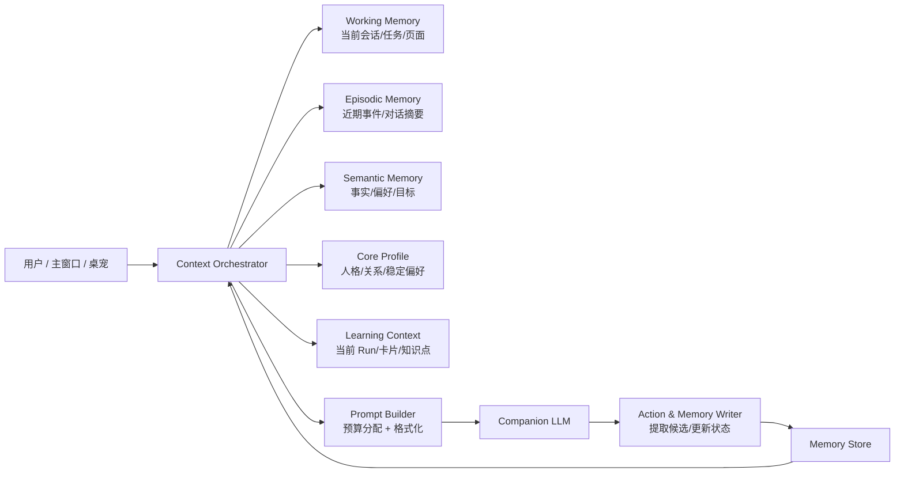

# 真桌宠记忆与上下文设计方案

> 状态：**Superseded — 已由 [22-real-desktop-pet-memory-context-prd-tdd.md](./22-real-desktop-pet-memory-context-prd-tdd.md) 取代并实施**
> 日期：2026-08-16
> 目标：让桌宠不只是“聊天机器人”，而是真正记得用户、理解当前任务、有稳定人格、会主动帮忙的桌面 AI 助手。
>
> 注（2026-08-19）：本方案的全部决策已经过 Owner 确认并落地为 22 号 PRD/TDD
> （状态 Implemented）。实施细节、字段命名与本文有出入处（如 `summary_of`
> 未采用、`source_type` 增加 `confirmed/summary/legacy` 枚举等）一律以 22 号
> 文档及其后续修订为准；本文保留作为设计背景阅读材料，不再单独维护。

---

## 1. 背景与目标

当前桌宠已经有：
- 基础对话（最近 20 条消息的有界上下文）；
- 长期记忆表 `assistant_memory_items`（目标/偏好/情境/互动备注）；
- 记忆管理页 `/companion/memory`；
- 简单记忆注入（最近 30 条活跃记忆直接拼进 prompt）。

但这些还不足以成为“真桌宠”：

1. **记忆没有分层**：所有记忆混在一起，没有“核心画像 / 长期事实 / 近期事件 / 当前工作区”的区分。
2. **没有自动压缩**：长对话超过窗口后，旧内容直接丢出上下文，桌宠会“失忆”。
3. **没有智能检索**：只是取最近 N 条，没有按相关度/重要性/时效排序。
4. **记忆没有进入学习上下文**：桌宠不知道用户当前在哪张卡、哪个知识点、正在做什么任务。
5. **人格不稳定**：人格只靠 system prompt，缺少“关系状态 / 说话风格 / 已确认偏好”的持久化。
6. **主动能力弱**：记忆没有被用于“什么时候该提醒、建议什么、怎么帮忙”。

本方案要解决这些问题，把桌宠从“会聊天的气泡”升级成“有记忆、有上下文、有性格、会主动”的桌面伙伴。

---

## 2. 设计原则

1. **记忆是助手能力的燃料，不是聊天记录堆**。
2. **上下文永远有预算**：不无限膨胀，按“当前任务 > 相关长期记忆 > 最近对话 > 系统人格”分配。
3. **记忆可解释、可审计、可删除**：每条记忆有来源、时间、确认状态；用户始终能看和删。
4. **学习真相与记忆解耦**：记忆不能直接修改掌握度、复习计划、卡片事实。
5. **候选优先，确认生效**：AI 提取的记忆默认只是候选，不自动影响行为。
6. **隐私优先**：记忆默认本地/工作区可见，不做跨用户共享；敏感内容可单独删除。
7. **渐进实施**：先做“上下文装配 + 自动摘要 + 记忆管理”，再做“人格档案 + 主动助手”。

---

## 3. 现状与差距

| 能力 | 现状 | 差距 |
| --- | --- | --- |
| 短期对话上下文 | 最近 20 条消息，硬截断 | 无摘要、无重要性排序 |
| 长期记忆存储 | `assistant_memory_items` 表 | 只有一种平铺结构，无分层/关联 |
| 记忆注入 | 最近 30 条活跃记忆拼进 user content | 无检索排序、无预算分配 |
| 记忆提取 | 学习结算时生成候选 | 日常对话中不提取 |
| 记忆遗忘 | 无 | 无衰减/过期/冲突处理 |
| 人格一致性 | 固定 persona prompt | 无用户画像、无关系状态 |
| 学习上下文 | 有 page context bridge | 未与记忆/对话上下文统一装配 |
| 主动提醒 | 有 intervention level / deliveries | 未充分使用记忆做个性化建议 |

---

## 4. 目标架构



核心思想：**所有输入先进入一个“上下文编排器”**，由它决定这次回复该看到什么，而不是把全部数据都塞给模型。

---

## 5. 记忆分层模型

### 5.1 Core Profile（核心画像）
- 用户长期稳定信息：称呼、语言偏好、学习目标、作息、喜欢/不喜欢。
- 桌宠自身人格设定：名字、性格、说话风格、边界。
- 关系状态：熟悉度、最近互动频率、当前默契话题。

### 5.2 Semantic Memory（语义长期记忆）
- 事实型：用户提到过的目标、偏好、重要约束。
- 来自 `assistant_memory_items`，但需要增加：
  - `importance`（重要性 0-1）
  - `confidence`（置信度）
  - `scope`（全局/工作区/学习任务）
  - `expiresAt`（过期时间，可选）
  - `lastUsedAt`（最近被使用时间，用于检索排序）
  - `sourceType`（user_stated / model_inferred / confirmed）

### 5.3 Episodic Memory（情景记忆）
- 最近发生过的事：今天聊了什么、上次学到哪、最近卡在哪。
- 由对话/学习运行自动生成摘要，而不是保存原始聊天记录。
- 示例：
  - “用户今天完成了‘光合作用’的复习，正确率不错。”
  - “用户昨晚说这周想重点突破有机化学。”
  - “桌宠上次建议用户先看第三章，用户还没回应。”

### 5.4 Working Memory（工作记忆）
- 当前正在发生的事情，不需要长期保存：
  - 当前页面上下文（卡片/星图/学习 Run）；
  - 当前对话的最近几轮；
  - 当前正在执行的 action/proposal；
  - 本次会话内用户刚给出的临时指令。
- 由 Bridge 的 page context + 对话 session 提供。

### 5.5 Procedural / Preference Memory（程序性偏好）
- 桌宠应该如何做事：
  - 默认语音还是文字；
  - 主动提醒强度；
  - 是否自动播报；
  - 安静时段；
  - 回答长度偏好。
- 一部分已在 `user_companion_account_state`，后续统一纳入记忆编排。

---

## 6. 上下文装配管线

### 6.1 输入收集
每次生成回复前，Context Orchestrator 收集：

1. **当前工作记忆**
   - 最近 6–10 条对话（比现在的 20 条更聚焦，避免噪声）；
   - 当前页面/学习上下文（来自 Main↔Pet Bridge）；
   - 当前 action/proposal 状态。
2. **相关长期记忆**
   - 从 Semantic Memory 检索与当前消息/页面相关的记忆；
   - 从 Episodic Memory 检索“最近 1–7 天”的相关事件摘要。
3. **核心画像**
   - 用户核心偏好 + 桌宠人格 + 关系状态。
4. **系统约束**
   - 安全边界、不编造、不越权、隐私规则。

### 6.2 检索与排序
- 关键词/向量混合检索（先关键词 + 后期可加 embedding）。
- 排序分 = `相关度 × 重要性 × 新鲜度衰减 × 确认权重`。
- 候选记忆必须经过确认/非候选过滤；候选不进入上下文，除非用户明确要求“看看候选”。

### 6.3 预算分配
- 给不同上下文类型设置预算，例如：
  - System/Persona：约 15%
  - Working Memory：约 30%
  - Semantic Memory：约 25%
  - Episodic Memory：约 20%
  - Learning Context：约 10%
- 超预算时按排序截断，而不是简单“取最近 N 条”。

### 6.4 Prompt 格式化
- 记忆以结构化块注入，而不是大段散文：
  ```
  长期记忆（你确定知道的用户信息）：
  - [偏好] 用户喜欢语音交流
  - [目标] 这周想掌握光合作用
  - [情境] 当前在复习“光合作用”卡片

  最近发生：
  - 昨天完成了“细胞呼吸”的复习
  - 上次对话中用户提到想早点睡
  ```
- 同时告诉模型：
  - 记忆可能过时，不确定时先问；
  - 不要把记忆当权威事实，以用户最新表达为准；
  - 不要主动背诵记忆，只在相关时自然使用。

---

## 7. 自动压缩与遗忘

### 7.1 对话摘要
- 当会话超过预算时，把旧对话按“主题 + 用户目标 + 关键事件 + 待办/承诺”压缩成 Episodic Memory。
- 触发时机：
  - 每轮对话结束且会话长度超过阈值；
  - 学习 Run 结算；
  - 用户主动要求“记住这段”。
- 摘要由模型生成，但**只作为候选记忆**，重要内容需用户确认才进入长期语义记忆；情景摘要可自动保留但低优先级。

### 7.2 记忆冲突
- 当新记忆与旧记忆冲突时：
  - 保留两者并标记 `conflictGroup`；
  - 优先相信用户最新明确表达；
  - 在管理页展示冲突，让用户决定。

### 7.3 遗忘与衰减
- 记忆带 `lastUsedAt` 和 `importance`；
- 长期未使用且低重要性的记忆自动降级为候选或归档；
- 用户可手动固定重要记忆（pin），固定记忆不衰减。

---

## 8. 记忆生命周期与用户控制

```text
对话/学习事件
   ↓
模型提取候选（candidate=true）
   ↓
管理页/桌宠气泡确认 or 拒绝
   ↓
活跃记忆（active）
   ↓
使用/衰减/固定/删除
```

- **候选**：不进入上下文、不参与主动策略。
- **活跃**：参与上下文检索和主动提醒。
- **固定（pin）**：高优先级、不衰减。
- **归档**：不再参与检索，但可恢复。
- **删除**：soft delete，审计保留。

---

## 9. 桌宠人格一致性

### 9.1 人格档案
新增 `pet_profile` 概念（可由默认值初始化 + 用户微调）：
- 名字、性格标签、说话风格；
- 边界：是否允许撒娇、是否主动催学习、是否使用口头禅；
- 语气偏好：简洁/活泼/温柔/理性。

### 9.2 关系状态
- 记录“熟悉度/亲密度”和“当前关系阶段”；
- 随着互动次数、确认记忆数、主动帮助次数缓慢变化；
- 不搞“恋爱模拟”，只做“越来越懂你”的助手感。

### 9.3 人设一致性机制
- 人格档案进入每次 prompt 的 Core Profile；
- 记忆管理页可查看/重置人格偏好；
- 模型输出后做风格校验（可选）：是否过于机械、是否偏离人设。

---

## 10. 主动助手能力

有了记忆和上下文后，桌宠可以：
- 在用户打开某张卡时主动说：“上次你说这块有点绕，要不要先用例子过一遍？”
- 在复习到期前提醒：“你今天还有 2 张卡，预计 8 分钟。”
- 在用户重复问同一类问题时说：“你上次也问过这个，我帮你把上次结论找出来？”
- 在用户表达“最近很累”后，降低主动打扰频率。

这些由 **Proactive Policy + Memory Retrieval** 共同决定，不打扰时不打扰。

---

## 11. 数据模型与 API

### 11.1 表结构演进
在现有 `assistant_memory_items` 上扩展：

```sql
-- 建议新增字段（迁移）
ALTER TABLE assistant_memory_items
  ADD COLUMN importance REAL NOT NULL DEFAULT 0.5,
  ADD COLUMN confidence REAL NOT NULL DEFAULT 0.5,
  ADD COLUMN scope TEXT NOT NULL DEFAULT 'workspace',
  ADD COLUMN pinned BOOLEAN NOT NULL DEFAULT false,
  ADD COLUMN archived_at TIMESTAMPTZ,
  ADD COLUMN last_used_at TIMESTAMPTZ,
  ADD COLUMN expires_at TIMESTAMPTZ,
  ADD COLUMN conflict_group UUID,
  ADD COLUMN summary_of TEXT;  -- 若是情景摘要，指向来源会话/run
```

新增表：
- `pet_profiles`：桌宠人格档案。
- `memory_links`：记忆 ↔ 实体（card/keyPoint/note/source/run）关联。
- `memory_usage_log`：检索/使用日志（用于衰减和可解释性）。
- `conversation_summaries`：会话摘要（Episodic Memory 的存储）。

### 11.2 API
- `GET /companion/memory?scope=&q=&includeArchived=`
- `POST /companion/memory/:id/pin`
- `POST /companion/memory/:id/archive`
- `POST /companion/memory/:id/restore`
- `GET /companion/memory/conflicts`
- `GET /companion/pet-profile`
- `PATCH /companion/pet-profile`
- `POST /companion/conversations/:id/summarize`（手动触发摘要）
- 现有 confirm/reject/delete 保留。

---

## 12. UI/UX

### 12.1 桌宠设置里新增“记忆与人格”
在 **设置 → 桌宠伴星** 下增加两块：
1. **记忆管理**（已有入口，继续增强）
   - 搜索、筛选（偏好/目标/情境/互动）；
   - 固定/归档/删除；
   - 冲突提示；
   - 数量统计。
2. **桌宠人格**
   - 名字/性格/说话风格；
   - 主动程度；
   - 重置人格。

### 12.2 桌宠气泡内轻量记忆交互
- 当模型使用某条记忆时，可在气泡下方显示“我记得你说过：…”；
- 用户可以直接在该气泡上“纠正/删除这条记忆”；
- 候选记忆出现时，桌宠可以问：“这个我记住了，对吗？”

### 12.3 记忆可视化
- 可选“记忆星图”：把记忆挂到相关卡片/知识点上，让用户看到桌宠记住了什么。

---

## 13. 安全与隐私

- 记忆默认只属于当前 user + workspace；
- 删除记忆必须 soft delete 并保留审计；
- 导出/删除工作区时，记忆一并处理；
- 敏感信息（密码/API key/健康等）由现有 redaction/隐私策略过滤；
- 候选记忆不能自动进入任何跨用户/主动外发场景；
- 所有记忆写入都有来源事件，可追溯。

---

## 14. 分阶段实施计划

### Phase 1：上下文装配（基础）
- 扩展记忆表字段（importance/scope/pinned/lastUsedAt）。
- 实现 Context Orchestrator：收集 working/semantic/episodic/learning context。
- 实现排序与预算截断。
- 把当前“最近 30 条记忆”替换成“检索 Top K + 预算”。
- 管理页支持固定/归档/搜索。

### Phase 2：自动记忆与摘要
- 对话结束时自动生成会话摘要（candidate）。
- 学习 Run 结算后生成情景记忆（已有雏形，增强）。
- 冲突检测与展示。
- 记忆衰减/归档定时任务。

### Phase 3：人格档案与关系状态
- 新增 pet_profile 表 + 设置 UI。
- 人格进入 prompt 的 Core Profile。
- 关系状态随互动缓慢变化。

### Phase 4：主动助手
- 用记忆 + 学习上下文生成个性化 proactive cue。
- 桌宠气泡内轻量记忆确认/纠正。
- 记忆星图可视化（可选）。

---

## 15. 验收指标

- 长对话 50 轮后，桌宠仍能准确引用早期关键信息（摘要命中）。
- 用户说“我上次说过…”时，桌宠能正确回忆。
- 记忆管理页可搜索、固定、归档、删除，操作不报错。
- 记忆注入后回复质量不下降，反而更个性化。
- 记忆不泄露给错误用户/工作区。
- 主动提醒率不因记忆增加而打扰用户（仍受干预等级约束）。

---

## 16. 风险与回滚

- **记忆污染**：模型提取错误记忆 → 候选机制 + 用户确认 + 可删除。
- **上下文预算失控**：统一 Orchestrator + 上限 + 监控 token 使用。
- **人格不稳定**：人格档案冻结 + 风格校验 + 可重置。
- **隐私风险**：默认不跨用户、soft delete、审计。
- **回滚**：所有新表/字段可迁移回滚；Prompt 版本以冻结版本链为基础（撰写时为 persona-v3，2026-08-24 起切 **persona-v4**——标签全表移出、few-shot 内嵌，见 `packages/shared/src/companion-persona.ts` 头注），新增记忆块可独立开关。

---

## 17. 待确认问题

1. 是否接受“情景摘要自动生成但低优先级保留，重要记忆仍需确认”的机制？
2. 是否需要向量检索（embedding）？初期可先用关键词 + 规则排序。
3. 桌宠人格是否允许用户自定义名字/性格？还是只提供预设档位？
4. 记忆星图是否本期要做？还是先做设置页管理？
5. 主动提醒是否允许基于记忆的个性化文案，还是保持模板文案？
