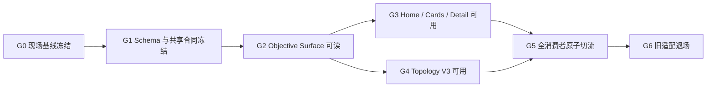
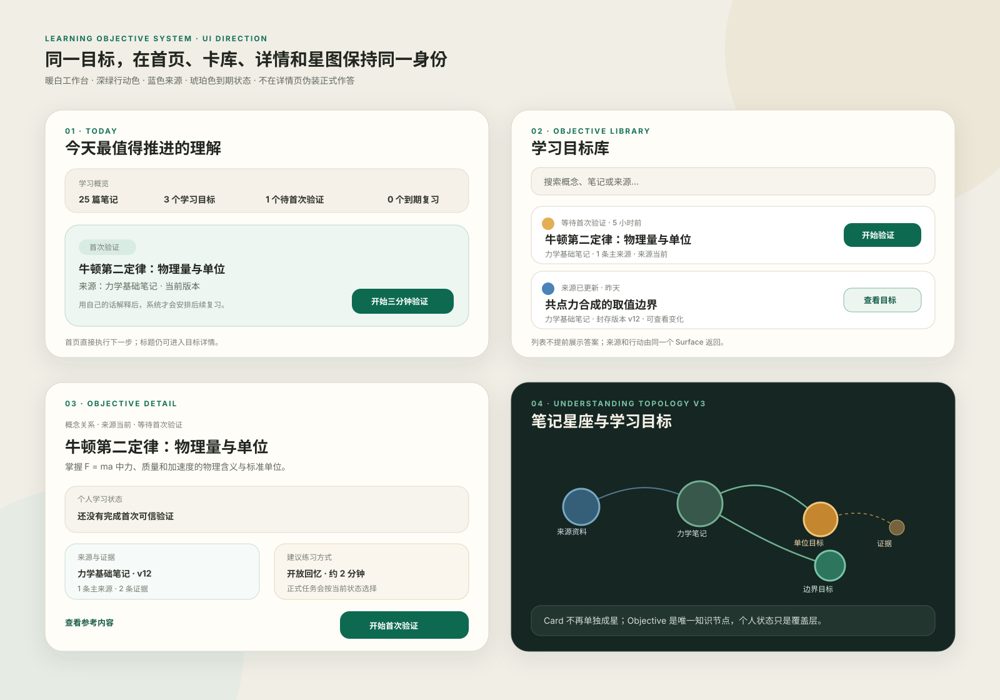
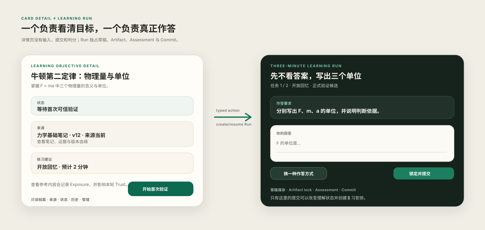

# Learning Objective 系统重接方案：修复 Card V2 后的首页、详情、微旅程与理解星图断链

> **目标流程覆盖说明（2026-09-24）：**现有 Objective/Card 消费链的实施记录仍有效；未来用户从整篇笔记直接初学、复习，查看历次结果并自愿加入长期复习，按[方案 38](./38-source-note-learning-journey-prd-2026-09-24.md)改造。本文中“Card/Objective 是所有学习活动前置”及“单个三分钟 Run 就是完整学习体验”的产品假设已被覆盖；正式评估和可信事实边界继续有效。

> 副标题：让学习卡重新成为可追溯的知识目标，让三分钟旅程成为唯一正式作答场，让首页与星图围绕同一事实工作
>
> 状态：**Implemented（核心链路已实施；WBS 任务以简化形式落地，剩余 DoD 见 §0.1）**
>
> 文档类型：问题复盘 + 产品需求文档（PRD）+ 技术实施设计（TDD）
>
> 版本：0.3（实施状态回写）
>
> 日期：2026-08-16（2026-08-19 回写实施状态）
>
> ### 0.1 实施状态回写（2026-08-19）
>
> 本方案评审期间即已开工，并已完成核心链路实施（git: `5145b143` 及后续
> `ffa6cba1` / `43283ed4` / `19e33d4e` 等修复提交）。实际落地与本文 WBS 的对应关系：
>
> - **已实施**：迁移 `0175_learning_objective_content_topology.sql`
>   （origins 表 + concept_label + compatibility_role + legacy_route_mappings_v2 +
>   surface_revision）；`learning-objectives` / `learning-dashboard` /
>   `understanding-v3` 三个 API 模块及路由注册；首页 DashboardHome +
>   LearningDashboardV2；卡库 ObjectiveLibrary（单一 Objective list，不再合并旧
>   DTO）；详情页 Objective 化且无本地作答 renderer；UnderstandingGraphV3；
>   parity / leakage / reconcile / immutability / origin-backfill / search /
>   topology-v3 / dashboard 等 11 个集成测试；§36 objective 视觉 token 落地
>   （objective-system.css 等 6 个样式文件）。
> - **以简化形式落地**：RL 系列中的 shadow read 演练、ETag 分层缓存、topology
>   deltas 端点等多人团队/上线期纪律未按原样建设——项目未上线、单人开发，
>   以集成测试对账替代 shadow diff 清零流程。
> - **未实施 / 待决**：§27 DoD 中依赖真实浏览器视觉 QA 的条目（320px/读屏/
>   reduced-motion 验收矩阵）尚未系统性执行；legacy 物理清理保持冻结（符合 §21.1）。
>

>
> ### 0.2 审查修复补充（2026-08-23）
>
> 独立审查发现并已修复的三项（详见方案 24 文档 §9.2 的签收记录）：
>
> 1. **缓存体系实际无效**：dashboardRevision 哈希混入每次请求重新生成的
>    `snapshotAt` → 304 分支永不可达；topologyRevision 用节点/边计数、
>    checkpointToken 用 `Date.now()`。已改为确定性内容哈希，Cache-Control 调整为
>    `private, no-cache` 使协商缓存生效。
> 2. **首页双事实源**：右侧"今日队列"仍拉 legacy `listSanitizedReviews` +
>    `listJobs`。已收口到 Dashboard 单一聚合（primaryFocus + queue 驱动，
>    typed action 渲染）。
> 3. **集成测试依赖手工魔法工作区** `4f825f38-…`（0176 清库后失效）：九个套件
>    已改为自播种夹具（helpers/pure-v2-workspace-fixture.ts），全部实跑转绿。
>
> 另：LearningRun 公开合同的 origin/returnTarget 形状漂移（V2 存储原样返回、
> resume_run 主行动失效）属方案 16/20 域，修复与回归锁定见 learning-run-origin-contract
> 集成测试与 run-view/run-service 内注释；graph V3 使用全局 `--color-*` token
> （非 §36 objective token）确认为有意的设计修订。
>
> 强制前置：
> - [`16-unified-learning-run-micro-journey-live2d-system-companion.md`](./16-unified-learning-run-micro-journey-live2d-system-companion.md) 视为**已经实施并冻结的 LearningRun / Trust / Commit / Schedule 底座**；
> - [`20-learning-card-v2-value-first-generation-and-learning-target-rebase.md`](./20-learning-card-v2-value-first-generation-and-learning-target-rebase.md) 视为**已经实施的 Card V2 生成、候选、激活和 LearningObjective 基础**。
>
> 适用范围：Card V2 激活后的正式消费链路，包括首页、学习卡库、学习卡详情、Today、Review、Search、Pet/Companion、LearningRun handoff、理解星图、统计与历史兼容。
>
> 阅读导航：结论与边界见 §0–4；产品体验见 §5–11；技术合同见 §12–20；迁移、实施和验收见 §21–28；细粒度任务、前端 Demo 与执行顺序见 §29–38。
>
> **合并说明（2026-08-16）**：本文已合并原独立调研报告中的现场证据。两版如有对冲，**以本文正文（23 文档）为准**；被合并内容降级为“Phase 0 现场证据（压缩版）”，见文末附录 A。

---

## 0. 结论先行

Card V2 上线后的主要问题不是某个页面漏字段，也不是把旧 `summary` 补回来就能解决，而是系统只完成了“生成和卡片展示”的切换，没有完成“正式消费者主实体”的整体切换。

当前系统同时存在三套互不一致的事实：

1. 旧消费者认为正式主体是 `learning_cards → card_key_points`；
2. Card V2 认为正式主体是 `LearningObjective → Card Presentation`；
3. Understanding Projection 又把 V2 Objective 临时塞回 `keyPointId`，并手工拼接部分 V2 节点。

这导致以下稳定结果：

- Card V2 在卡库可见，但首页、Stats、Search 或旧消费者看不到；
- 首页拿到 legacy cardId，却跳到 V2 路由，出现“卡片不存在”；
- V2 已经携带 `noteId/noteVersionId`，前端兼容适配时又主动丢弃；
- 理解星图能画出 V2 Card 和 Objective alias，却没有 `Note → Objective` 血缘；
- 一张 V2 卡在星图中同时表现为 Card 星体和 KeyPoint 卫星，知识语义重复；
- 学习卡详情以完整题面为视觉主体，但真正作答、提交和评估全部发生在三分钟旅程，详情页退化成“看起来能答、实际上不能答”的中转页；
- 旧隐藏 alias 会让系统判断“工作区不为空”，却又无法提供任何 active Card，最终出现空首页。

本方案冻结五项核心决策：

1. **`LearningObjective` 是所有正式消费者共同使用的稳定主实体。**
2. **学习卡是 Objective 的可阅读、可管理呈现，不是正式答题播放器。**
3. **LearningRun / 三分钟旅程是唯一正式作答、Artifact、Assessment 和 Commit 场。**
4. **理解星图展示 Source、Note、Objective 和 Evidence，不再把 Card Presentation 当成独立知识节点。**
5. **首页、卡库、Today、Review、Search、Graph 和 Pet 必须通过同一 Objective Read Model 原子切流，不允许继续各自拼接 V1/V2。**

一句话产品定义：

> **学习卡是“要学的东西”，三分钟旅程是“如何证明自己学会了”，理解星图是“这些东西从哪里来、彼此如何关联、我理解到了什么程度”。**

---

## 1. 文档权威性与冲突裁决

### 1.1 与方案 16 的关系

方案 16 的以下合同继续冻结，本文不得修改：

- LearningRun phase 与 terminal priority；
- Task / Variant / interaction 的运行时选择；
- Artifact 不可变与 lock-time exposure 复验；
- Assessment fail closed；
- trusted Commit 是正式学习事实的唯一写入边界；
- Schedule generation、消费与恰一 successor；
- canonical event、PracticeTrail、Projection 和 Pet Bridge 的正式边界；
- 历史事件、合同和 hash 不得重写。

本文只重接 LearningRun 之前和之外的目标读取、内容拓扑与页面职责，不建立第二套 Session、Assessment、mastery 或 scheduler。

### 1.2 与方案 20 的关系

方案 20 已经建立的以下事实继续有效：

- Candidate 不是正式 Card；
- 激活后形成 stable `LearningObjective`；
- 一张 active Card 对应一个 active Objective；
- canonical answer、rubric、完整 evidence 不能进入公共 Card DTO；
- Reveal 必须 exposure-first；
- Objective revision、Card presentation revision 和 publication revision 分离；
- LearningRun 通过 `LearningTargetSnapshotV2` 冻结目标；
- 新 V2 Objective 可在迁移期复用 `keyPointId = objectiveId` 的 wire identity。

本文补上方案 20 未完成的下游系统重接：

- Objective 如何成为首页与卡库的统一对象；
- Objective 如何保留 Note / Source 血缘；
- Card 详情和 LearningRun 如何避免功能重复；
- Objective 如何成为 Understanding Graph 的唯一知识目标节点；
- legacy alias 如何退出所有正式消费面；
- 所有消费者如何一次性完成原子切流。

### 1.3 冲突裁决顺序

发生冲突时按以下顺序裁决：

1. Owner 对本文的明确确认；
2. 方案 16 已冻结的 Trust / Commit / Schedule / Event 不变量；
3. 方案 20 已冻结的 Candidate / Objective / Revision / Exposure 合同；
4. 本文冻结的 Objective Read Model、Content Topology 和页面职责；
5. 旧 V1 Card / CardSet / KeyPoint 的兼容实现。

### 1.4 立即生效的 Stop Line

本文评审期间，暂停继续扩展以下方向：

- 首页继续基于旧 `/cards`、`schemaJson.title/summary` 增加功能；
- 把 `PublicLearningCardV2` 转成 legacy `CardListItem` 后再开发新功能；
- 在星图中继续增加 `Card → alias key_point` 临时补丁；
- 让 Card 详情重新承载本地作答、填空、排序、判断或提交；
- 把公开 Card 的 `front.prompt` 当成系统内的知识标题或知识摘要；
- 为 legacy archived alias 增加正式统计、搜索或图谱可见性；
- 为 Home、Today、Graph、Pet 分别实现不同的 V1/V2 合并逻辑。

可以继续实施和修复：

- 方案 16 LearningRun、Artifact、Assessment、Commit、Schedule 和 Projection 的既有合同；
- 方案 20 Candidate、Activation、Reveal、Revision 和 TargetSnapshot 的正确性；
- 安全、RLS、幂等、性能和无障碍缺陷；
- 不依赖旧 Card 内容模型的 UI 基础设施。

---

## 2. 用户问题与运行时事实

### 2.1 首页“完全空”

当前首页并非真正理解 Card V2，而是并发读取：

- 旧 Stats；
- Notes；
- 旧 `/cards`；
- Review；
- Jobs。

V2 激活为了兼容旧外键，会创建 archived legacy Card + alias KeyPoint。于是只存在 V2 Card 时：

```text
legacy all card count > 0
legacy active card count = 0
V2 active objective count > 0
```

首页由 `legacy all card count > 0` 判断“不是首次使用”，但又因 `legacy active card count = 0` 无法生成今日重点和最近卡片，最终显示一个结构存在、内容为空的首页。

### 2.2 首页显示“未命名学习卡”

旧 `listCards` 为性能排除了 `schemaJson`，首页却继续读取：

```text
card.schemaJson.title
card.schemaJson.summary
```

因此旧数据也会显示“未命名学习卡”“没有摘要”。这是 API contract 与页面消费不一致，不是内容生成失败。

### 2.3 首页主行动进入错误路由

首页从旧 `/cards` 获取 legacy `cardId`，却把主行动统一指向：

```text
/learning-cards/:cardId
```

V2 详情只接受 V2 `cardId`，因此 legacy 卡会进入“卡片不存在”。

### 2.4 卡库来源信息退化

Card V2 公共合同已经包含可选的 `noteId/noteVersionId`，但卡库当前把 V2 DTO 转成 legacy `CardListItem` 时：

- 将 `noteVersionId` 写成空字符串；
- 丢弃 `noteId`；
- 用 `publicSummary` 同时冒充 title 和 summary；
- 丢弃 Card V2 的公开 front、revision 和 lifecycle 语义。

因此列表只能显示泛化的“来源笔记”，无法打开真实来源，也无法正确表达 source freshness。

### 2.5 理解星图与笔记断开

当前星图的完整血缘只为 legacy Card 构建：

```text
Source → Note → Legacy Card → KeyPoint
```

V2 Card 通过后置补丁只增加：

```text
V2 Card → Objective alias
```

没有增加：

```text
Source → Note → V2 Objective
```

同时 V2 一卡一目标仍被画成 Card 和 KeyPoint 两个节点，导致同一知识目标重复出现。

### 2.6 学习卡详情与三分钟旅程职责重叠

当前生产详情页已经移除了可作答输入，但仍以完整 `front.prompt` 为视觉主体，并提供“查看答案”和“开始首次验证”。正式输入、草稿、提交、Assessment 和 Commit 则全部发生在 LearningRun。

因此页面关系变成：

```text
Card 详情：展示一道完整题，但不能作答
       ↓ 开始验证
LearningRun：再次展示本轮任务并真正作答
```

这使详情页退化成多余中转页，也让用户误以为 Card 上的交互会形成学习记录。

### 2.7 迁移状态没有成为发布门禁

当前 consumer audit 中大量模块仍处于 `dual`，只有极少数模块完成 `done`。但 capability 和发布流程没有阻止 Home、Stats、Graph 等核心消费者在半迁移状态下工作。

“登记为 dual”目前只是文档事实，不是可执行的 release gate。

### 2.8 2026-08-16 本地运行时基线

以下数字只用于记录本次诊断时的开发数据快照，不作为长期产品指标：

- 首页显示 25 篇笔记、80 张 legacy active Card，但最近卡片因列表 DTO 不含 `schemaJson` 全部显示为“未命名学习卡”；
- 学习卡库首屏合并后共 53 项，其中 50 项来自 legacy `/cards`，3 项来自 V2 `/v2/cards`；
- 3 张 V2 Card 在卡库有正确 Objective 文案，但没有进入首页的最近学习卡和今日重点；
- 首页使用 legacy cardId 打开 `/learning-cards/:id` 时，V2 详情返回“卡片不存在”；
- 理解星图显示 83 颗学习恒星、95 个 KeyPoint/Objective 卫星、287 个总节点；其中 V2 Card/Objective 被补入，但没有 Note 血缘边；
- V2 详情页显示完整问题、“查看答案”和“开始首次验证”，不存在正式作答输入；点击验证会创建/进入独立 LearningRun。

这组基线必须转化为迁移前的回归 fixture。实施完成后应得到：

- 首页、卡库、搜索和星图对同一批 active Objective 数量可对账；
- V2 Objective 在首页可见；
- 旧 route 不再进入 V2 404；
- 星图每个 native Objective 都有合法 Note/Source 血缘（manual 除外）；
- Card 详情不再以完整问题伪装成答题页。

---

## 3. 根因分析

### 3.1 错误一：把 Card UI 对象继续当成系统聚合根

旧系统依赖 Card 的 `title/summary/claim/quote` 承担：

- 首页内容；
- 搜索索引；
- 星图节点；
- 验证题面；
- 复习标签；
- Pet 上下文。

Card V2 将正式语义拆成 Objective、Card Presentation、Reveal 和 TargetSnapshot，但下游仍期待“一个 Card DTO 包含所有东西”，于是各页面只能自己做有损兼容。

### 3.2 错误二：把 Presentation 当成 Knowledge Identity

`front.prompt` 是练习呈现，不是知识身份。它可以随用户历史、目标、设备和 interaction 改变。

如果首页、星图或搜索依赖 prompt：

- 换题型会导致知识对象看起来被替换；
- 同一 Objective 可能产生多个标题；
- 问句无法稳定表达概念关系；
- 用户看到的问题与 LearningRun 实际选择的 Task 可能不一致。

### 3.3 错误三：Note 血缘挂在 Card，而不是 Objective

当前 `learning_cards_v2.note_version_id` 能表达一个生成来源，但无法完整表达：

- merge 后一个 Objective 来自多段或多篇笔记；
- supporting evidence 来自不同 Source；
- target-equivalent revision 继承哪些来源；
- semantic change 后旧 Objective 和新 Objective 的来源关系；
- 手工创建 Objective 没有 Note 的合法情况。

知识血缘应属于 Objective revision，而不是可替换的 Card Presentation。

### 3.4 错误四：个人学习状态与共享内容拓扑混在页面临时拼接

共享事实包括：

- Source、Note、Objective、Evidence；
- 生成与修订血缘；
- Objective 之间的语义关系。

个人事实包括：

- 未验证、学习中、稳定、脆弱、需修复；
- active Run；
- initial validation reminder；
- due schedule；
- practice trail。

当前各页面分别查询并拼接这些事实，造成同一 Objective 在不同页面状态不一致。

### 3.5 错误五：兼容 alias 被正式消费者误用

archived legacy Card + alias KeyPoint 的唯一目的，是保留旧 FK、历史 Run、Schedule 和 wire identity。

它不应：

- 被首页计数；
- 出现在 Card 列表；
- 生成星图 Card 节点；
- 参与搜索；
- 被当作真实来源 Card；
- 决定首次使用状态。

当前缺少“alias 只用于历史引用”的强制边界。

---

## 4. 目标产品模型

### 4.1 四层模型

```text
Content Topology（共享）
Source → Note / NoteVersion → LearningObjective ← Evidence
                              ↕ semantic relations

Presentation（共享、可替换）
LearningObjective → LearningCardPresentation

Learning Runtime（个人）
LearningObjective → LearningRun → Task → Artifact → Assessment → Commit

Learning State（个人投影）
LearningObjective → Initial Validation / Active Run / Review / Understanding
```

### 4.2 LearningObjective

LearningObjective 是稳定、可调度、可追溯的知识目标，负责回答：

- 要学会什么；
- 如何判断学会；
- 有哪些可信来源；
- 与其他目标是什么关系；
- 当前语义版本是什么。

它不是固定题型，也不是页面。

### 4.3 LearningCard Presentation

Card Presentation 是 Objective 的公共呈现，负责：

- 可识别的名称与一句话说明；
- 可选的练习建议；
- 来源标签；
- 生命周期和公开 revision；
- Reveal 的入口。

`front.prompt` 只能作为 preferred practice seed，不得作为系统主标题、图谱身份或正式提交合同。

### 4.4 LearningRun

LearningRun 是唯一正式练习和验证场，负责：

- 根据 Objective、历史状态和入口 goal 选择 Task；
- 选择文字、语音、排序、关系、修复、情境等 interaction；
- 保存草稿；
- 锁定 Artifact；
- Assessment；
- Commit；
- Schedule 和 Projection。

### 4.5 Objective Surface

所有正式消费者读取同一个公共 Read Model：

```text
LearningObjectiveSurfaceV2
```

它不是数据库表，而是稳定的跨页面读取合同。

---

## 5. 产品原则与非目标

### 5.1 产品原则

1. 同一 Objective 在所有页面使用同一个 `objectiveId`；
2. 内容标题、来源和个人状态必须来自同一版本化 Read Model；
3. Card 详情不接受正式答案；
4. 只有 LearningRun 形成 Artifact 和学习结果；
5. Reveal 是阅读行为，不能冒充验证；
6. Presentation-only 修改不能改变星图身份；
7. Note 更新不能静默断开 Objective；
8. 0-card Note 仍是合法 Note 和星图节点；
9. hidden alias 不得进入任何正式产品面；
10. 页面不得根据自由文本猜测生命周期、复习或理解状态。

### 5.2 非目标

本文不负责：

- 重新设计生成 Planner、Author 和 Critic；
- 修改 LearningRun Trust 或 Commit；
- 新建第二套复习调度；
- 用 LLM 在线生成首页摘要；
- 自动推断 Objective 之间所有语义关系；
- 通过客户端倒计时自行决定 formal eligibility；
- 为兼容旧页面继续扩大 CardSet 产品概念。

---

## 6. 信息架构重划

### 6.1 页面职责矩阵

| 页面 | 核心问题 | 可以做 | 不可以做 |
|---|---|---|---|
| 首页 | 我现在最值得做什么 | 继续 Run、到期复习、首次验证、进入目标详情 | 自己拼装 Objective 状态、展示 hidden alias |
| 学习卡库 | 我有哪些学习目标 | 搜索、筛选、看来源、直接开始/继续、进入详情 | 把 V2 降级成 legacy CardListItem |
| 学习卡详情 | 这个目标是什么、从哪来、现在什么状态 | 看目标、来源、证据、历史、Reveal、管理生命周期 | 正式作答、提交、评估 |
| 三分钟旅程 | 我如何练习并证明它 | 所有交互、草稿、提交、Assessment、Commit | 改写 Objective、充当知识档案 |
| Today / Review | 今天应完成什么 | 基于 server action 直接创建/恢复 Run | 根据 Card 文案猜测动作 |
| 理解星图 | 知识从哪来、如何关联、我理解多少 | 浏览 Source/Note/Objective/Evidence 与个人状态 | 把 Card Presentation 画成独立知识实体 |
| Search | 我能找到什么知识目标 | 搜索 Objective label、summary、来源和关系 | 索引私有答案、隐藏 alias |
| Pet / Companion | 当前用户在处理什么目标 | 读取公开 Objective context，提出动作 | 读取 canonical answer 或直接写学习结果 |

### 6.2 导航语义

正式页面必须区分两个动作：

- `view_objective`：查看学习目标详情；
- `start_or_resume_learning`：直接创建或恢复 LearningRun。

列表项标题、来源和星图节点默认执行 `view_objective`；明确的“开始/继续/复习”按钮执行 `start_or_resume_learning`。

---

## 7. 学习卡详情页 PRD

### 7.1 页面定位

学习卡详情页改为“学习目标档案”，而不是答题页。

它应回答：

1. 目标是什么；
2. 为什么值得学；
3. 来自哪里；
4. 当前学习状态；
5. 下一步应该做什么；
6. 历史上做过什么；
7. 是否需要查看参考内容或管理目标。

### 7.2 默认结构

```text
返回学习卡库

概念标签 / 学习目标
一句话公开说明
知识形式 · 来源笔记 · 来源版本状态

个人学习状态
- 等待首次验证 / 学习进行中 / 到期复习 / 已安排 / 稳定
- 服务端计算的唯一下一步

来源与证据
- 笔记标题、版本、片段
- 可展开证据引用

理解支持
- 为什么值得学
- 适用边界 / 常见误区 / 关联目标（按权限与 Reveal 状态）

历史
- 最近 Run、最近结果、下次复习

次级工具
- 查看参考内容
- 编辑公开呈现
- 重新生成
- 归档
```

### 7.3 不再默认展示完整题面

详情页不再把 `front.prompt` 作为 H1/H2 主内容。它可作为折叠的“练习预览”存在，但必须满足：

- 默认折叠；
- 不包含输入控件；
- 不保存草稿；
- 不显示正确/错误；
- 明确标注“正式练习会根据当前状态选择题型，实际任务可能不同”。

推荐默认只显示：

```text
建议练习方式：开放回忆 / 情境应用
预计用时：1–3 分钟
```

### 7.4 Reveal 语义

“查看答案”改名为更准确的“查看参考内容”。

点击时：

1. 服务端先持久化 Exposure；
2. 成功后才返回 canonical answer、explanation、misconception、boundary 和 evidence；
3. 页面个人状态立即刷新；
4. 主行动从“开始首次验证”变成“带着参考内容练一下”；
5. 当前 LearningRun 由 PREPARE 和 lock-time ledger 决定 `practice_only`，客户端不得自行决定 Trust。

### 7.5 唯一主行动

主行动由服务端返回的 typed action 决定：

```ts
type LearningObjectivePrimaryActionV2 =
  | { kind: "create_run"; origin: "card"; objectiveId: string; cardId: string; goal: string }
  | { kind: "resume_run"; runId: string }
  | { kind: "create_review_run"; objectiveId: string; scheduleId: string; generation: number }
  | { kind: "practice_only"; objectiveId: string; cardId: string; reasonCodes: string[] }
  | { kind: "wait_for_initial_validation"; reminderId: string; qualificationNotBefore: string }
  | { kind: "view_successor"; successorCardId: string }
  | { kind: "refresh" }
  | { kind: "none" };
```

前端不得根据 label 或本地时间推断 action。

### 7.6 移除无效交互

以下组件不得进入生产 Card 详情：

- scratchpad；
- cloze inputs；
- compare matrix inputs；
- ordering track；
- cause chain builder；
- boundary decision；
- application choice。

这些交互只能：

- 作为 Lab / prototype 预览；或
- 被改造成 LearningRun `TaskRenderer`，接入 draft、submit、Assessment 和 revision contract。

---

## 8. 三分钟旅程 PRD

### 8.1 唯一正式作答场

任何能够形成以下结果的用户输入，只能发生在 LearningRun：

- Artifact；
- 正式 Assessment；
- canonical learning event；
- mastery / understanding state；
- Schedule 创建或消费。

### 8.2 入口一致性

Card、Home、Today、Review、Graph、Onboarding、Pet 进入同一个 `createRunV2` 合同，只改变 `originV2` 和 goal，不改变运行时语义。

### 8.3 Card Presentation 与 Task 的关系

Card 的 practice seed 只是 Planner 的参考输入之一。Planner 可以基于：

- Objective knowledge form；
- preferred intents；
- 历史薄弱面；
- 上次 interaction；
- 当前 goal；
- 设备能力；
- Exposure / hint 状态；

选择不同 Task。

因此 Card 详情不得承诺“接下来一定做这道题”。

### 8.4 返回语义

从 Card 进入的 Run 完成、暂停或安全结束后，返回同一 Objective 详情，详情页刷新：

- 最新 Run；
- 最新理解状态；
- 新 Schedule；
- next action；
- Projection change summary。

---

## 9. 首页 PRD

### 9.1 首页不再拼接五套旧接口

新增单一聚合读取：

```text
GET /v2/learning-dashboard
```

服务端在同一 workspace/user snapshot 下返回：

- counts；
- primary focus；
- queue；
- recent objectives；
- content availability；
- source freshness summary；
- error/degradation metadata。

### 9.2 今日唯一主行动优先级

```text
1. 恢复未完成 LearningRun
2. 处理到期 Review
3. 完成 ready 的首次验证
4. 继续 active 但未开始的 Objective
5. 对已有 Note 生成学习目标
6. 添加第一份材料
```

优先级由服务端 resolver 冻结，前端只渲染。

### 9.3 首页状态

首页必须显式区分：

- `first_use`：无 Note、无 Objective、无 Run；
- `notes_without_objectives`：有 Note，但没有 active Objective；
- `objectives_ready`：有 active Objective；
- `run_in_progress`；
- `review_due`；
- `degraded`：部分数据不可用；
- `empty_after_filter`：所有 Objective 已归档或不可用。

只要存在 active Objective，页面不得显示空白内容面。

### 9.4 首页展示内容

首页不显示 canonical answer，也不直接复用完整 prompt。推荐使用：

- `conceptLabel`；
- `publicSummary`；
- 来源 Note；
- 个人状态；
- 唯一下一步。

---

## 10. 学习卡库、Today、Review、Search 与 Pet PRD

### 10.1 学习卡库

卡库只读取 Objective Surface，不再合并 `CardListItem[] + PublicLearningCardV2[]`。

列表项显示：

- concept label；
- public summary；
- 真实 Note / Source；
- current personal state；
- source freshness；
- next action；
- recent activity。

支持：

- 点击标题查看 Objective；
- 点击主按钮直接进入 Run；
- 按状态、来源、知识形式、更新时间过滤；
- 搜索已加载内容或服务端搜索。

### 10.2 Today

Today 读取同一 Objective Surface 和 action resolver，不再读取 `claim` 组装任务说明。

### 10.3 Review

Review 继续由 Schedule 授权，展示内容通过 `objectiveId` 读取 Objective Surface。入口必须携带：

- objectiveId；
- scheduleId；
- generation。

### 10.4 Search

搜索索引包含：

- conceptLabel；
- publicSummary；
- knowledgeForm；
- Note / Source title；
- 可公开的关系标签。

不得索引：

- canonicalAnswer；
- scoringRubric；
- protected quote；
- hidden alias；
- Candidate。

### 10.5 Pet / Companion

Companion public context 使用：

- objectiveId；
- conceptLabel；
- publicSummary；
- current action kind；
- public source label；
- active Run ID（如有）。

Pet 可以建议“继续这个目标”或“查看来源”，不能读取答案、代替用户作答或直接写状态。

---

## 11. 理解星图 V3 PRD

### 11.1 星图语义

V3 星图展示“知识拓扑 + 个人理解覆盖层”，而不是 Card UI 对象集合。

节点类型：

```ts
type UnderstandingNodeRefV3 =
  | { kind: "source"; sourceId: string }
  | { kind: "note"; noteId: string }
  | { kind: "objective"; objectiveId: string }
  | { kind: "evidence"; evidenceSnapshotId: string };
```

Card 不再是知识节点。Objective 节点携带 `activeCardId` 作为导航目标。

### 11.2 关系类型

```ts
type UnderstandingEdgeKindV3 =
  | "contains_note"
  | "derived_from"
  | "supported_by"
  | "prerequisite"
  | "related"
  | "contrasts_with"
  | "applies_to"
  | "supersedes";
```

基础血缘：

```text
Source ─contains_note→ Note
Note ─derived_from→ Objective
Evidence ─supported_by→ Objective
Objective ─prerequisite/related/...→ Objective
```

### 11.3 个人状态覆盖层

Objective 节点的亮度、颜色和行动状态由个人投影提供：

- unknown；
- forming；
- stable；
- fragile；
- needs_repair；
- active_run；
- review_due。

激活 Card 只能创建共享 topology，不得把节点点亮为“已理解”。只有 canonical learning event 可以改变正式个人理解状态；practice trail 只显示练习轨迹。

### 11.4 Note 与 Objective 的视觉关系

- Note 是星座/知识区域；
- Objective 是学习恒星；
- Evidence 默认折叠为可选图层；
- 一卡一目标不再额外创建“Card 星体 + Objective 卫星”；
- 0-card Note 仍然可见，但没有 Objective 子节点；
- source_outdated Objective 保留原边并显示版本提示，不自动断开。

### 11.5 Objective 操作

点击 Objective：

- 默认打开目标详情侧面板或详情页；
- 显示 Note / Source、公开说明、状态和关联目标；
- “开始/继续/复习”按钮直接进入 LearningRun；
- 不在星图内嵌正式答题。

---

## 12. Canonical 数据模型

### 12.1 继续保留的表

继续使用：

- `learning_objectives_v2`；
- `learning_objective_revisions_v2`；
- `learning_cards_v2`；
- `learning_card_publication_revisions_v2`；
- `learning_objective_evidence_bindings_v2`；
- `evidence_snapshots_v2`；
- `learning_target_snapshots_v2`；
- 方案 16 的 Run / Task / Artifact / Assessment / Commit / Schedule / Projection 表。

### 12.2 新增 Objective Origin

新增：

```text
learning_objective_origins_v2
```

建议字段：

```ts
interface LearningObjectiveOriginRowV2 {
  id: string;
  workspaceId: string;
  originId: string;
  objectiveId: string;
  objectiveRevisionId: string;
  originKind: "note" | "manual" | "imported" | "legacy";
  relation: "primary" | "supporting";
  noteId: string | null;
  noteVersionId: string | null;
  sourceId: string | null;
  sourceSnapshotId: string | null;
  evidenceSnapshotIds: string[];
  sourceContentHash: string | null;
  anchorHash: string;
  eligibility: "usable" | "restricted" | "revoked";
  createdAt: string;
}
```

约束：

- `originKind=note` 时 noteId、noteVersionId 必填；
- `relation=primary` 每个 Objective revision 至少一个，manual 除外；
- anchorHash 覆盖 exact revision、来源和 evidence identities；
- origin 不可原地修改，只能新增 revision 或 eligibility overlay；
- source deletion/redaction 不物理删除历史 origin；
- merge 后允许多个 primary/supporting origins；
- Presentation-only revision 不创建新 origin。

### 12.3 Concept Label

Objective revision 增加或正式化：

```ts
conceptLabel: string;
```

规则：

- 8–60 个中文字符为建议范围；
- 使用陈述式概念名称，不使用完整问句；
- 不泄漏 canonical answer；
- 可稳定用于首页、卡库、搜索和星图；
- target-equivalent presentation change 不改变 conceptLabel；
- semantic change 可产生新 Objective 或经等价审查更新。

`objectiveStatement` 继续用于精确学习目标，`publicSummary` 用于公开说明，`conceptLabel` 用于稳定识别。三者不得互相冒充。

### 12.4 Presentation Seed

`learning_cards_v2.front` 的产品语义改名为 `preferredPracticeSeed`。物理字段可分阶段迁移，但 shared contract 必须表达：

```ts
interface PreferredPracticeSeedV2 {
  strategy: CardStrategyV2;
  cue?: string;
  context?: string;
  prompt?: string;
  seedVersion: number;
}
```

它：

- 不作为 Objective identity；
- 不作为星图 label；
- 不作为首页 summary；
- 不保证与下一次 LearningRun Task 完全相同；
- 只作为 Planner 和可选练习预览的输入。

---

## 13. 统一 Objective Read Model

### 13.1 LearningObjectiveSurfaceV2

```ts
interface LearningObjectiveSurfaceV2 {
  version: 2;

  identity: {
    objectiveId: string;
    objectiveRevisionId: string;
    objectiveRevision: number;
    semanticTargetFingerprint: string;
    lifecycleEpoch: number;
  };

  content: {
    conceptLabel: string;
    objectiveStatement: string;
    publicSummary: string;
    knowledgeForm: string;
    preferredIntents: string[];
  };

  presentation: {
    cardId: string | null;
    cardRevision: number | null;
    publicationRevision: number | null;
    publicPayloadHash: string | null;
    preferredPracticeSeed: PreferredPracticeSeedV2 | null;
    sourceLabel: string | null;
  };

  origins: Array<{
    originId: string;
    relation: "primary" | "supporting";
    noteId: string | null;
    noteVersionId: string | null;
    noteTitle: string | null;
    sourceId: string | null;
    sourceTitle: string | null;
    sourceSnapshotId: string | null;
    freshness: "current" | "source_outdated" | "restricted" | "revoked";
  }>;

  personal: {
    state: "unknown" | "forming" | "stable" | "fragile" | "needs_repair";
    initialValidation: null | {
      status: "pending" | "ready";
      reminderId: string;
      reminderRevision: number;
      qualificationNotBefore: string | null;
    };
    activeRun: null | { runId: string; phase: string };
    review: null | {
      status: "due" | "scheduled";
      scheduleId: string;
      generation: number;
      dueAt: string;
    };
    practiceTrailCount: number;
    lastCanonicalAt: string | null;
  };

  lifecycle: {
    status: "active" | "archived" | "superseded" | "blocked_content_upgrade";
    successorObjectiveId: string | null;
  };

  primaryAction: LearningObjectivePrimaryActionV2;
  createdAt: string;
  updatedAt: string;
}
```

### 13.2 公共与私有边界

Surface 不得包含：

- canonicalAnswer；
- scoringRubric；
- protected full quote；
- private critic report；
- unrevealed learning support；
- other-user personal state。

### 13.3 Legacy Union

迁移期由服务端 repository 将 legacy KeyPoint 转成同一 Surface，而不是由每个前端页面做适配。

Legacy Surface 必须明确：

```ts
compatibility: {
  source: "legacy_migrated" | "v2_native";
  contentIntegrity: "verified" | "legacy_unreviewed";
}
```

正式前端不得再接触 `CardListItem` 和 `PublicLearningCardV2` 的数组拼接。

---

## 14. Home Dashboard 合同

```ts
interface LearningDashboardV2 {
  version: 2;
  snapshotAt: string;
  dashboardRevision: string;

  counts: {
    notes: number;
    activeObjectives: number;
    activeRuns: number;
    reviewsDue: number;
    needsRepair: number;
  };

  mode:
    | "first_use"
    | "notes_without_objectives"
    | "objectives_ready"
    | "run_in_progress"
    | "review_due"
    | "degraded";

  primaryFocus: null | {
    objective: LearningObjectiveSurfaceV2;
    reasonCodes: string[];
    action: LearningObjectivePrimaryActionV2;
  };

  queue: Array<{
    objective: LearningObjectiveSurfaceV2;
    reasonCodes: string[];
    action: LearningObjectivePrimaryActionV2;
  }>;

  recentObjectives: LearningObjectiveSurfaceV2[];
  suggestedNote: null | {
    noteId: string;
    noteVersionId: string;
    title: string;
    reasonCodes: string[];
  };

  degradation: null | {
    unavailableSections: string[];
    retryable: boolean;
  };
}
```

一致性要求：

- counts、primaryFocus、queue 和 recentObjectives 使用同一 eligibility cutoff；
- hidden alias 永不计数；
- archived/superseded 不进入 activeObjectives；
- Dashboard 不因 Review 或 Jobs 单个依赖失败而整体伪成空工作区；
- degraded 必须显式展示，不得用空数组掩盖错误。

---

## 15. Understanding Topology V3 合同

### 15.1 Shared Topology

```ts
interface UnderstandingTopologySnapshotV3 {
  version: 3;
  workspaceId: string;
  topologyRevision: string;
  checkpointToken: string;
  nodes: UnderstandingNodeProjectionV3[];
  edges: UnderstandingEdgeProjectionV3[];
  continuationToken: string | null;
  integrity: {
    truncated: boolean;
    missingOriginObjectiveIds: string[];
  };
}
```

Objective node：

```ts
interface ObjectiveNodeProjectionV3 {
  nodeRef: { kind: "objective"; objectiveId: string };
  label: string;
  publicSummary: string;
  activeCardId: string | null;
  lifecycle: string;
  freshness: string;
  personal: {
    state: string;
    activeRunId: string | null;
    activeScheduleId: string | null;
    nextReviewAt: string | null;
    practiceTrailCount: number;
    lastCanonicalEventId: string | null;
  };
}
```

### 15.2 Shared 与 Personal 事件路由

| 事件 | 更新 Shared Topology | 更新 Personal Understanding | 更新 Schedule |
|---|---:|---:|---:|
| Objective Activated | 是 | 否 | 否 |
| Objective Revision Published | 是 | 否 | 否 |
| Objective Archived/Superseded | 是 | 否，保留历史 overlay | 通过 lifecycle command 关闭/阻断 |
| Canonical Learning Event | 否 | 是 | 由方案 16 Commit 决定 |
| Practice Trail Event | 否 | 仅 trail | 否 |
| Reveal Exposure | 否 | 不改变理解状态 | 可延后 initial reminder |

### 15.3 星图不得依赖 Card 列表查询

Topology repository 直接读取：

- Objective；
- Objective Origin；
- Objective Evidence Binding；
- Objective Relations；
- personal projection。

不得先查 active Card，再反推 Note 和 Objective。

---

## 16. API 设计

### 16.1 Objective

```text
GET /v2/learning-objectives
GET /v2/learning-objectives/:objectiveId
GET /v2/learning-objectives/:objectiveId/history
```

查询支持：

- cursor；
- lifecycle；
- personalState；
- noteId/sourceId；
- knowledgeForm；
- freshness；
- updatedSince。

### 16.2 Dashboard

```text
GET /v2/learning-dashboard
```

响应必须 private/no-store 或使用 user-scoped ETag；不得跨用户缓存 personal state。

### 16.3 Topology

```text
GET /v3/understanding/topology
GET /v3/understanding/topology/deltas/:changeSetId
POST /v3/understanding/route-plans
```

V3 参数使用 `objectiveId`，不再对外暴露 `targetKeyPointId`。

### 16.4 Card Reveal

继续沿用 V2 exposure-first Reveal，但成功响应必须返回更新后的 Objective personal state 或 refetch token，避免客户端以本地状态猜测 eligibility。

### 16.5 Run Actions

Objective Surface 返回的 action 只提供安全参数，真正 create/resume 仍调用方案 16 的 LearningRun API。

---

## 17. Shared Event 与 Outbox

### 17.1 新增共享拓扑事件

```ts
type LearningObjectiveTopologyEventV2 =
  | { kind: "objective_activated"; objectiveId: string; objectiveRevisionId: string; originIds: string[] }
  | { kind: "objective_revision_published"; objectiveId: string; objectiveRevisionId: string; revisionClass: string; originIds: string[] }
  | { kind: "objective_lifecycle_changed"; objectiveId: string; lifecycle: string; lifecycleEpoch: number }
  | { kind: "objective_relation_changed"; objectiveId: string; relationRevision: number };
```

要求：

- 与 Activation / Revision / Lifecycle 事务同库 outbox；
- 幂等键覆盖 aggregate + revision；
- 只更新 shared topology/search/read model；
- 不伪造 canonical learning event；
- 不点亮 mastery；
- 失败可重放。

### 17.2 Personal Projection

继续只接受：

- CanonicalLearningEventEnvelope；
- PracticeTrailEvent。

Objective 激活、Reveal、浏览、编辑和归档不得冒充学习结果。

---

## 18. Revision 与生命周期

### 18.1 Presentation-only

修改 cue、context、practice seed 或视觉文案：

- Card / Publication revision 增加；
- Objective identity 不变；
- Objective Origin 不变；
- semanticTargetFingerprint 不变；
- 星图节点不变；
- active Run 使用冻结 snapshot，不受影响。

### 18.2 Target-equivalent

目标语义等价但 Objective revision 更新：

- objectiveId 保持；
- semanticTargetFingerprint 保持；
- targetRevisionHash 更新；
- Origin 按 exact revision 复制或重新封存；
- Schedule 和星图节点保持；
- 新 Run 使用新 revision；
- 旧 Run 不重写。

### 18.3 Semantic change

目标含义改变：

- 创建新 objectiveId；
- 旧 Objective superseded；
- 创建 `supersedes` edge；
- 旧历史和 personal overlay 保留；
- pending schedule 按生命周期竞态矩阵关闭或消费后关闭 successor；
- 页面主行动指向新 Objective。

### 18.4 Note 新版本

Note 发布新版本时：

- 旧 Objective 不自动 stale；
- Origin 继续指向封存的 noteVersionId；
- freshness 标记 `source_outdated`；
- 用户可查看差异并发起 regenerate；
- 只有激活 change set 后才更新 Objective / Card。

---

## 19. Error、Empty 与降级语义

### 19.1 不得混用的状态

以下状态必须独立：

- 没有 Objective；
- Objective 被归档；
- Objective 来源待升级；
- Dashboard 部分依赖失败；
- Card Presentation stale；
- LearningRun stale；
- 0-card generation success；
- generation failure；
- Reveal failure。

### 19.2 首页降级

如果 Objective inventory 成功、Review 失败：

- 仍展示 Objective；
- Review 区域显示暂不可用；
- 不得显示“还没有学习卡”。

如果 Objective inventory 失败：

- 显示明确 retry；
- 不得根据空数组进入 first-use。

### 19.3 星图完整性

存在 active Objective 却没有合法 Origin 时：

- Objective 进入 `missing_origin` integrity list；
- 默认不伪造 Note 边；
- 运维和用户修复入口可见；
- release gate 阻止新增 native V2 Objective 进入该状态。

---

## 20. 安全、隐私与 Trust

### 20.1 公共读取

Dashboard、Objective Surface、Search 和 Topology 不得包含：

- canonical answer；
- rubric；
- protected quote；
- private assessment；
- other-user schedule/run/state；
- raw Candidate；
- internal critic report。

### 20.2 Reveal

- write-before-read；
- private/no-store；
- revision/hash 匹配失败 fail closed；
- 失败不显示答案；
- 成功后更新 reminder / exposure state；
- PREPARE snapshot 不能替代 Artifact lock 时重读 exposure ledger。

### 20.3 RLS

所有 Origin、Surface、Dashboard 和 Topology 查询必须同时按 workspaceId/userId 隔离。Shared topology 可 workspace 共享，Personal overlay 必须 user-scoped。

---

## 21. Legacy 迁移与 Backfill

### 21.1 迁移目标

项目未上线，允许大范围切流，但仍保留当前开发数据和历史 Run 的审计一致性。

目标状态：

- 新正式消费者只读 Objective Surface；
- legacy active Card 全部迁移或明确归档；
- alias 仅用于旧 FK；
- 历史 Run / Schedule / event hash 不重写。

### 21.2 Legacy Card → Objective

每个 legacy KeyPoint 映射为一个 Objective：

```text
objectiveId = legacy keyPointId
```

旧 Card 含多个 KeyPoint 时：

- 每个 KeyPoint 生成一个 Objective；
- 每个 Objective 可生成独立 V2 Card Presentation；
- 旧 Card ID 保存 route migration mapping；
- 不再把多 KeyPoint legacy Card 作为一个 active 学习目标。

### 21.3 Origin Backfill

优先级：

1. `learning_cards_v2.note_version_id`；
2. Objective evidence binding → evidence snapshot → noteId/sourceSnapshotId；
3. legacy Card noteVersionId；
4. 无法验证时标记 `legacy_unreviewed` 或 `blocked_content_upgrade`。

不得通过相似文本猜测 Note 关系后静默发布。

### 21.4 Route Mapping

新增迁移映射或 resolver：

```text
legacy cardId/keyPointId → objectiveId/current cardId
```

旧 `/cards/:id`：

- 能唯一映射时 308/客户端 replace 到新详情；
- 多 KeyPoint 时展示迁移选择页或跳到卡库过滤视图；
- 无法映射时显示明确 legacy history，不跳 V2 404。

### 21.5 Alias 隔离

archived legacy alias 必须增加明确标识或可确定识别规则，例如：

```text
compatibility_role = 'objective_fk_alias'
```

所有正式 consumer predicate 必须排除该角色。仅以下路径允许读取：

- 旧 FK 解析；
- 历史 Run hydration；
- Schedule 兼容；
- migration / audit。

---

## 22. 原子切流与 Capability

### 22.1 单一 Capability Bundle

新增：

```text
learning_objective_system_v1
```

该 capability 同时拥有：

- Objective repository / Surface；
- Home Dashboard；
- Card library/detail；
- Today / Review labels and actions；
- Search Objective index；
- Understanding Topology V3；
- Pet public context；
- Card/Today/Graph origin adapters。

禁止按页面独立开启，避免再次出现卡库 V2、首页 V1、星图 V1.5。

### 22.2 不拥有的能力

该 capability 不拥有：

- LearningRun runtime epoch；
- Player；
- Artifact / Assessment / Commit；
- scheduler；
- canonical personal projector；
- Pet runtime。

### 22.3 Cutover Gate

切流前必须同时满足：

- native V2 active Objective 100% 有 Origin；
- legacy active KeyPoint 迁移覆盖率 100% 或进入显式 blocked；
- Home / Cards / Search / Graph active Objective 数量对账；
- 所有入口 action 能进入正确 Run；
- 旧 route mapping 完成；
- public payload leakage gate 通过；
- alias 可见性为 0；
- consumer audit 中正式消费者全部 `done`。

---

## 23. 实施阶段

### Phase A：Rebase Gate 与审计

交付：

- 冻结 Stop Line；
- 将首页纳入 consumer audit；
- 增加 V1/V2/alias 数据对账命令；
- 统计每个消费者真实 read path；
- 为当前断链建立回归 fixture。

退出条件：能够回答每个 active Objective 在 Home、Cards、Graph、Search 中是否可见、使用哪个 ID、链接到哪里。

### Phase B：Objective Origin 与 Surface

交付：

- `learning_objective_origins_v2`；
- conceptLabel；
- unified repository；
- `LearningObjectiveSurfaceV2`；
- action resolver；
- legacy backfill / compatibility mapping。

退出条件：服务端可只通过 objectiveId 返回内容、来源、个人状态和下一步。

### Phase C：首页与卡库

交付：

- `/v2/learning-dashboard`；
- 首页切流；
- 卡库不再合并旧 DTO；
- 真实 Note / Source 链接；
- 正确的详情与 Run 双动作。

退出条件：仅有 V2 Card 的工作区首页完整可用，所有 CTA 正确。

### Phase D：Card 详情与 LearningRun 边界

交付：

- Objective Overview；
- 移除完整题面主视觉和全部无效作答；
- 来源、证据、历史、状态与次级工具；
- Reveal 后 practice-only 文案；
- Run 完成返回刷新。

退出条件：详情页没有任何会让用户误以为已经提交答案的交互。

### Phase E：Understanding Topology V3

交付：

- V3 nodes / edges / APIs；
- Source → Note → Objective 血缘；
- Objective-only learning star；
- personal overlay；
- source freshness；
- route plan 使用 objectiveId。

退出条件：每个 active native Objective 在星图中恰好一个节点，且至少一条合法来源边（manual 除外）。

### Phase F：全消费者切流与 Legacy Shrink

交付：

- Today、Review、Search、Pet、Export、Stats 切流；
- capability bundle 原子开启；
- 旧正式 consumer 关闭；
- alias 仅历史使用；
- 删除前端 V1/V2 merge adapter；
- 更新 consumer audit 为 done。

退出条件：正式页面不再读取 `schemaJson.summary/claim/quoteText` 作为当前 Objective 内容。

---

## 24. 代码实施地图

### 24.1 当前需要替换的核心入口

| 当前位置 | 问题 | 目标 |
|---|---|---|
| `apps/web/app/(workspace)/(default)/page.tsx` | 首页读旧 Stats + `/cards`，客户端拼装 | 读取 Dashboard V2 |
| `apps/api/src/modules/stats/service.ts` | 只统计 legacy active Card | Objective-based stats / Dashboard repository |
| `apps/api/src/modules/card/service.ts` | legacy Card list，且列表排除 schemaJson | 仅保留 legacy/history；正式卡库读 Objective Surface |
| `apps/web/app/(workspace)/(default)/cards/page.tsx` | V1/V2 数组合并和有损转换 | 单一 Objective list |
| `apps/web/lib/learning-card-library.ts` | 依赖 legacy CardListItem/CardSet | Objective Surface presentation |
| `apps/web/app/(workspace)/(focus)/learning-cards/[cardId]/page.tsx` | 完整题面 + Run 跳转的中转页 | Objective detail controller |
| `apps/web/features/learning-card-v2/ActiveLearningCardV2.tsx` | Card front 仍占主视觉 | Objective overview + state + tools |
| `apps/web/features/learning-card-v2/renderers/*` | 本地交互不提交 | Lab-only 或迁入 LearningRun renderer |
| `apps/api/src/modules/understanding/projection-routes.ts` | legacy 血缘 + V2 后置补丁 | Topology V3 repository |
| `apps/web/features/understanding/projection-adapter.ts` | objective 仍映射成 key_point | V3 objective-native adapter |
| `apps/web/app/(workspace)/(default)/graph/page.tsx` | Card/key_point 双实体 | Source/Note/Objective/Evidence UI |
| `apps/api/src/modules/card-generation-v2/legacy-read-adapter.ts` | 目标正确但未成为正式统一入口 | 升级为 Objective Surface repository |
| `apps/api/src/modules/card-generation-v2/legacy-consumer-audit.ts` | dual 状态不是 gate，首页缺席 | 可执行 CI/release gate |

### 24.2 新模块建议

```text
apps/api/src/modules/learning-objectives/
  repository.ts
  surface-service.ts
  action-resolver.ts
  origin-service.ts
  legacy-migration.ts
  routes.ts

apps/api/src/modules/learning-dashboard/
  service.ts
  routes.ts

apps/api/src/modules/understanding-v3/
  topology-repository.ts
  topology-service.ts
  routes.ts

apps/web/features/learning-objective/
  ObjectiveOverview.tsx
  ObjectiveSourcePanel.tsx
  ObjectiveLearningState.tsx
  ObjectiveHistory.tsx
  ObjectivePrimaryAction.tsx
```

---

## 25. 测试策略

### 25.1 Contract Tests

- Surface schema 拒绝 answer/rubric/protected quote；
- Objective action union exhaustive；
- Origin note/manual 条件约束；
- Topology V3 不接受 card/key_point node；
- Dashboard mode 与 counts 一致；
- legacy alias 不进入 active Surface。

### 25.2 Repository Integration Tests

覆盖：

1. native V2 Objective + one Note；
2. merged Objective + multiple Notes；
3. legacy migrated Objective；
4. manual Objective；
5. source_outdated；
6. archived/superseded；
7. active Run；
8. review due；
9. Reveal 后 initial reminder deferred；
10. missing/revoked evidence。

### 25.3 Cross-surface Parity Tests

同一 fixture 必须断言：

```text
Cards.objectiveId
= Home.primaryFocus.objectiveId
= Search.result.objectiveId
= Graph.objectiveNode.objectiveId
= Review.objectiveId
= Run.originV2.objectiveId
```

数量对账：

```text
active Objective inventory
= Home active objective count
= Cards active list count
= Search active objective count
= Graph active objective node count
```

允许差异必须有显式 reason code，例如权限、分页或 lifecycle filter。

### 25.4 UI 行为测试

- Card 详情初始 DOM 无 answer/rubric/full quote；
- Card 详情没有 textarea、填空、排序或提交作答；
- 点击标题查看 Objective；
- 点击“开始验证”创建 V2 Run；
- Reveal 失败答案不出现；
- Reveal 成功后 CTA 变为 practice-only 语义；
- in-progress 恢复 exact run；
- review due 携带 exact scheduleId/generation；
- archived/superseded 不创建 Run；
- Run 返回详情后状态刷新；
- 320px、键盘、ARIA live、reduced motion 合格。

### 25.5 首页 E2E

必须覆盖：

- 只有 Note；
- 只有 native V2 Objective；
- legacy + V2 混合；
- active Run；
- review due；
- Stats/Review 部分失败；
- 所有 Objective archived；
- hidden alias only。

关键断言：只有 V2 Objective 时首页不得空，也不得进入 first-use。

### 25.6 星图 E2E

- Note 激活 2 个 Objective → 1 Note + 2 Objective nodes + 2 source edges；
- V2 一卡一目标 → 不出现 Card + KeyPoint 双节点；
- presentation-only revision → node/edge identity 不变；
- target-equivalent revision → objective node 不变；
- semantic change → 新 node + supersedes edge；
- Note 新版本 → 原边保留 + source_outdated；
- 0-card Note → Note node 存在、Objective node 为 0；
- canonical Commit → personal overlay 更新；
- practice-only → 只增加 trail，不点亮 mastery。

### 25.7 Mutation / Leakage Tests

- `schemaJson.summary` 删除或为空不影响正式页面；
- legacy alias status 改变不能进入正式读模型；
- public payload 注入 `canonicalAnswer` 必须被 schema 拒绝；
- V2 Card noteVersionId 丢失时激活/切流 gate 失败；
- 前端不得通过 label 文本推断 action；
- Objective Surface revision 变化时迟到 Reveal response 被拒绝。

---

## 26. 可观测性与运行指标

### 26.1 数据一致性指标

```text
objective_surface_active_total
dashboard_active_objective_total
card_library_active_objective_total
search_active_objective_total
graph_active_objective_total
objective_missing_origin_total
legacy_alias_visible_total
broken_objective_route_total
surface_revision_mismatch_total
```

### 26.2 产品指标

- 首页 primary action 可用率；
- 首页空内容异常率；
- Card 详情 → Run 转化率；
- Card 详情 Reveal 后 practice 启动率；
- Run 完成后详情返回率；
- 星图 Objective → Note 可追溯率；
- 星图 Objective → Run 启动率；
- source_outdated 修复率；
- 用户从详情进入来源 Note 的比例。

### 26.3 告警

P0：

- active Objective > 0 且 Dashboard primary/queue/recent 全空；
- native active Objective 无 usable Origin；
- alias 在正式 API 出现；
- Home action 产生 Card 404；
- Graph active Objective 数与 inventory 差异超过阈值且无 reason code。

---

## 27. Definition of Done

### 27.1 产品 DoD

- [ ] 用户能明确区分“查看学习目标”和“开始学习”；
- [ ] Card 详情不再像一个不能提交的答题页；
- [ ] 所有正式作答只发生在三分钟旅程；
- [ ] 只有 V2 Objective 的工作区首页完整可用；
- [ ] Card 列表展示真实 Note / Source；
- [ ] 理解星图中 Objective 与 Note 有明确血缘；
- [ ] 一卡一目标不再生成重复知识节点；
- [ ] source_outdated、archived、superseded 有一致体验；
- [ ] 0-card Note 在系统中仍然完整存在。

### 27.2 技术 DoD

- [ ] Objective Surface 成为唯一正式读取合同；
- [ ] Dashboard 使用同一 snapshot/eligibility cutoff；
- [ ] Objective Origin 支持多来源并完成 backfill；
- [ ] Topology V3 使用 objective-native node；
- [ ] Home/Cards/Today/Review/Search/Graph/Pet 原子切流；
- [ ] legacy alias 正式可见性为 0；
- [ ] 所有旧 route 有明确迁移行为；
- [ ] 历史 Run/Schedule/event/hash 未被重写；
- [ ] consumer audit 正式消费者全部 done；
- [ ] capability rollback 不破坏 in-flight Run。

### 27.3 质量 DoD

- [ ] Cross-surface parity tests 全通过；
- [ ] Home、Card detail、Run、Graph E2E 全通过；
- [ ] public leakage gate 全通过；
- [ ] migration reconciliation 无未解释差异；
- [ ] 320px、键盘和读屏验收通过；
- [ ] P0 一致性指标连续稳定；
- [ ] 视觉 QA 覆盖桌面、移动、夜间和降级状态。

---

## 28. 最终裁决摘要

本次问题不能通过给首页补一个 V2 请求、给星图补一条 Note 边、或给 Card 详情增加一个提交按钮分别解决。那会继续扩大三套事实并存的范围。

必须一次性完成以下重接：

```text
Note / Evidence
      ↓
LearningObjective（稳定知识身份）
      ├─ Objective Surface → Home / Cards / Today / Review / Search / Pet
      ├─ Content Topology → Understanding Graph
      ├─ Card Presentation → 详情阅读、Reveal 与管理
      └─ LearningTargetSnapshot → LearningRun → Assessment → Commit
```

最终边界只有三句话：

1. **学习卡详情负责让用户看清“这是什么、从哪来、现在怎样”。**
2. **三分钟旅程负责让用户真正作答并形成可信学习结果。**
3. **首页和理解星图都围绕 LearningObjective 工作，不再依赖旧 Card summary 或 Card UI prompt。**

---

## 29. 任务拆分规则与执行约束

### 29.1 任务粒度

本节开始的每个任务均按以下标准拆分：

- 预估工作量为 **0.5–2 人日**，超过 2 人日必须继续拆分；
- 一个任务只允许有一个主要交付物，不同时横跨 DB、API、Web 和 E2E 四层；
- 实现任务必须同时提交本层 scoped test，不把基础正确性全部推迟到最后；
- 每个任务建议对应一个独立 PR 或一个可单独 revert 的 commit；
- 任务完成必须产生可观察结果：schema、接口、页面状态、迁移报告、测试或指标之一；
- 方案 16 的 Run / Trust / Commit / Schedule 冻结项不得借本次任务顺手改语义。

估时含义：

| 估时 | 适用任务 |
|---|---|
| 0.5d | 类型补充、单一 resolver、样式 token、静态约束或小范围适配 |
| 1d | 单表迁移、单个 repository、单个页面区块、单个状态集合 |
| 1.5d | 带权限/分页/OCC 的接口、较完整组件、跨两个相邻模块的适配 |
| 2d | 独立 read model、幂等 backfill、复杂图查询或完整 E2E 场景 |

### 29.2 通用完成标准

每个任务只有同时满足以下条件才可标记 `done`：

1. 交付物与表中描述一致；
2. scoped typecheck / lint / test 通过；
3. 没有把 answer、rubric、完整 quote 或 private assessment 放入公共 DTO；
4. 新读取逻辑以 `objectiveId` 为身份，不重新依赖 legacy Card summary；
5. 新写入有 workspace / user 权限边界、幂等或 OCC 约束；
6. 涉及 UI 时覆盖 loading、empty、error、stale 和窄屏；
7. 涉及迁移时提供 dry-run、reconciliation 与 rollback 证据。

### 29.3 Gate 与切流纪律



- Gate 未通过时可并行开发下一阶段的纯 UI 或 fixture，但不得打开生产 capability；
- 首页、卡库、Today、Review、Search、Graph、Pet 的正式读取切换必须作为同一个 capability bundle 发布；
- 新版读模型上线前，不能让某些消费者读 Objective、另一些继续把 alias 当正式 Card；
- 已创建的 LearningRun 继续由方案 16 的 runtime epoch 管理，不因内容读模型切流而被取消。

---

## 30. Wave 0：现场基线、冻结线与可回归数据

> 目标：把附录 A 的现场证据变成可重复执行的基线，防止实施过程中“修好一个页面、又弄断另一个页面”。

| ID | 估时 | 任务 | 依赖 | 主要落点 | 完成标准 |
|---|---:|---|---|---|---|
| W0-01 | 0.5d | 把本文 Stop Line 转成代码审查清单 | 无 | `docs/`、PR 模板或实施记录 | 明确禁止新增 legacy summary 消费、Card/alias 图节点和详情本地正式作答 |
| W0-02 | 0.5d | 扩充 Consumer Audit，加入首页与 Stats | W0-01 | §21 consumer audit、审计脚本 | Home、Stats、Today、Review、Search、Graph、Pet、Export、Note lifecycle 均有 owner/status |
| W0-03 | 1d | 建立 legacy 字段静态扫描 | W0-01 | `scripts/` 或测试目录 | CI 能报告正式消费者中新出现的 `schemaJson.summary`、`card_key_points.claim` 读取 |
| W0-04 | 1d | 建立 V1/V2/alias inventory CLI | 无 | `scripts/`、DB read-only query | 按 workspace 输出 legacy、V2、alias、Objective、Origin、Schedule 数量且不写数据 |
| W0-05 | 1d | 固化“纯 V2 工作区”测试夹具 | W0-04 | API fixture / test seed | active legacy=0、active V2>0；能稳定复现旧首页为空 |
| W0-06 | 1d | 固化“V1+V2 混合工作区”测试夹具 | W0-04 | API fixture / test seed | 同时含 legacy、V2、hidden alias、active Schedule 与历史 Run |
| W0-07 | 1d | 固化 Origin 缺失/版本过期夹具 | W0-04 | API fixture / test seed | 覆盖 native note、legacy 回退、manual、missing_origin、source_outdated |
| W0-08 | 1d | 冻结历史不可变回归 | W0-05,W0-06 | LearningRun / event tests | 保存既有 contractHash、eventHash、schedule generation 基线，后续测试字节级不变 |
| W0-09 | 0.5d | 建立 capability bundle 空壳，默认关闭 | W0-01 | shared feature flags / capability | `learning_objective_system_v3` 可配置但 OFF 时无行为变化 |
| W0-10 | 0.5d | 输出 Phase 0 基线报告 | W0-02…W0-09 | `docs/implementation/` | 报告包含附录 A 三类数据、未解释差异与 Gate G0 结论 |

**Gate G0：** W0-03、W0-05、W0-06、W0-07、W0-08 必须进入 CI；否则不得开始迁移写入。

---

## 31. Wave 1：数据结构、共享合同与公共泄漏边界

### 31.1 数据库小任务

| ID | 估时 | 任务 | 依赖 | 主要落点 | 完成标准 |
|---|---:|---|---|---|---|
| W1-01 | 1d | 新增 Objective Origin 表迁移骨架 | G0 | `packages/db/src/schema/card-generation-v2.ts`、migration | 表、主键、workspace/objective/revision 字段可生成迁移 |
| W1-02 | 1d | 增加 Origin 类型约束 | W1-01 | 同上 | note/manual/imported/legacy_migrated 的条件字段由 DB check 约束 |
| W1-03 | 1d | 增加 Origin 索引与唯一性 | W1-01 | 同上 | objective/revision、note/version、source 查询有索引；重复绑定被拒绝 |
| W1-04 | 1d | 增加 Origin RLS / workspace 隔离 | W1-01 | DB policy / repository test | 跨 workspace 读写均失败，service role 路径有显式测试 |
| W1-05 | 0.5d | 增加 `conceptLabel` 字段及长度约束 | G0 | Objective revision schema | 不把 cue/prompt 当概念标题；空值只允许迁移期记录 |
| W1-06 | 1d | 增加 alias `compatibilityRole` | G0 | Card / alias schema | 能区分 hidden_identity、legacy_surface、migration_only，不复用 lifecycle 假表达 |
| W1-07 | 1d | 新增 legacy route mapping 表 | G0 | DB schema / migration | old card/keyPoint route 可稳定映射 objective/publication 或明确 gone |
| W1-08 | 0.5d | 新增 Objective Surface revision/ETag 存储字段 | W1-01,W1-05 | DB schema | surface revision 不复用 semantic fingerprint，支持缓存失效 |

### 31.2 Shared contract 小任务

| ID | 估时 | 任务 | 依赖 | 主要落点 | 完成标准 |
|---|---:|---|---|---|---|
| W1-09 | 1d | 定义 `ObjectiveOriginV3` discriminated union | W1-02 | `packages/shared/src/` 新合同 | note/manual/imported/legacy 类型穷尽，条件字段不使用可选字段堆叠 |
| W1-10 | 1d | 定义 `ObjectivePrimaryActionV3` | W1-09 | shared contracts | create/resume/review/refresh/view_successor/none 均携带必要稳定 ID |
| W1-11 | 1.5d | 定义 `ObjectiveSurfaceV3` 公共合同 | W1-09,W1-10 | shared contracts | 内容、来源、个人状态、唯一行动分区；无 private answer/rubric |
| W1-12 | 1d | 定义 Objective list item 与 cursor page | W1-11 | shared contracts | 列表合同不靠 detail DTO 裁剪，包含 total/nextCursor 的明确语义 |
| W1-13 | 1d | 定义 `LearningDashboardV2` | W1-11 | shared contracts | summary、primaryFocus、queues、recent、mode、snapshot cutoff 可解析 |
| W1-14 | 1.5d | 定义 `ContentTopologyV3` | W1-09 | `packages/shared/src/understanding-projection-contracts.ts` | node 只允许 source/note/objective/evidence；无 card/key_point node |
| W1-15 | 1d | 定义 topology edge 与 personal overlay | W1-14 | 同上 | sourced_from/supported_by/relates_to/supersedes 与 mastery overlay 分离 |
| W1-16 | 1d | 定义 Surface/Topology 失效事件 | W1-11,W1-14 | shared events/outbox | activation、revision、origin、lifecycle、commit 能定向失效读模型 |
| W1-17 | 1d | 新增公共合同泄漏测试 | W1-11…W1-15 | shared contract tests | 递归拒绝 canonicalAnswer、rubric、fullQuote、privateReport 等字段 |
| W1-18 | 1d | 新增合同版本兼容测试 | W1-11…W1-16 | shared contract tests | V1 serializer 字节冻结；V3 只通过新 endpoint/capability 暴露 |

**Gate G1：** migration 可回滚、RLS 通过、Shared 合同冻结、public leakage tests 通过。Gate G1 后前端才允许以正式类型开发，不再复制 fixture interface。

---

## 32. Wave 2：Origin、Objective Surface 与行动解析器

### 32.1 Origin 与迁移准备

| ID | 估时 | 任务 | 依赖 | 主要落点 | 完成标准 |
|---|---:|---|---|---|---|
| W2-01 | 1d | 实现 Origin 写 repository | G1 | `apps/api/src/modules/learning-objectives/` | 幂等 create/bind，校验 workspace、objective revision 与来源存在性 |
| W2-02 | 1d | 实现 Origin 读 repository | W2-01 | 同上 | 可按 objective、note、source 双向查询；结果顺序稳定 |
| W2-03 | 1.5d | native V2 Origin dry-run planner | W2-02,W0-07 | migration service | 输出可迁移、missing、ambiguous 三类，不落库 |
| W2-04 | 1.5d | legacy alias Origin dry-run planner | W2-02,W0-06 | migration service | 只把可证明的 Note/Source lineage 升级，禁止猜测 |
| W2-05 | 2d | 实现幂等 Origin backfill executor | W2-03,W2-04 | migration job | 支持 batch cursor、重跑、断点恢复、审计 receipt |
| W2-06 | 1d | 实现 `missing_origin` 修复队列 | W2-05 | migration/read model | 无法自动迁移的 Objective 仍可见但有显式 reason 与修复入口 |
| W2-07 | 1d | 实现 Objective activation 写 Origin | W2-01 | card-generation-v2 activation | 新激活事务绑定已 seal 来源；失败时 0 canonical Objective/Card |
| W2-08 | 1d | 实现 Note version 更新后的 freshness 计算 | W2-02 | note lifecycle / read model | 新 Note 版本不改写旧 origin，只产出 source_outdated 状态 |

### 32.2 Objective Surface 读取

| ID | 估时 | 任务 | 依赖 | 主要落点 | 完成标准 |
|---|---:|---|---|---|---|
| W2-09 | 1d | 实现 Objective 内容 reader | G1 | `apps/api/src/modules/learning-objectives/` | 读取 conceptLabel、public summary、presentation、lifecycle，不读 legacy summary |
| W2-10 | 1.5d | 实现 Origin enrichment | W2-02,W2-09 | 同上 | 返回主来源、次来源、Note 标题/版本与 freshness reason |
| W2-11 | 1.5d | 实现个人学习状态 loader（初次验证） | W2-09 | reminder/exposure adapters | ready/deferred/idle 基于服务端状态，不用客户端倒计时推断 |
| W2-12 | 1.5d | 实现个人学习状态 loader（Run） | W2-09 | learning-run adapter | 只返回当前用户可恢复的 exact runId/phase |
| W2-13 | 1.5d | 实现个人学习状态 loader（Review） | W2-09 | review adapter | due/scheduled 携带 exact scheduleId/generation/dueAt |
| W2-14 | 1d | 实现生命周期/freshness 合并器 | W2-10…W2-13 | read model | archived/superseded/stale/source_outdated 优先级固定并有单元测试 |
| W2-15 | 1.5d | 实现 Primary Action 基础解析 | W2-11,W2-14 | `objective-action-resolver.ts` | initial ready/deferred/idle/source_outdated 的唯一行动正确 |
| W2-16 | 1.5d | 实现 Primary Action Run/Review 解析 | W2-12,W2-13,W2-15 | 同上 | resume 优先于新建；review due 带精确 OCC 参数 |
| W2-17 | 1d | 实现 detail Surface assembler | W2-09…W2-16 | objective service | 单事务或同一 cutoff 返回内容、来源、状态、action 与 surfaceRevision |
| W2-18 | 1.5d | 实现 list Surface assembler | W2-17 | objective service | 批量加载无 N+1，支持 lifecycle/action/source filter 与稳定 cursor |
| W2-19 | 1d | 实现 Objective history reader | W2-17 | objective service | 只返回 revision/lifecycle/可信学习摘要，不泄漏 private assessment |
| W2-20 | 1d | 实现 legacy route resolver | W1-07,W2-17 | objective routes | old id 301/redirect、gone、forbidden 分开，不返回模糊 404 |

### 32.3 API 与一致性测试

| ID | 估时 | 任务 | 依赖 | 主要落点 | 完成标准 |
|---|---:|---|---|---|---|
| W2-21 | 1d | 新增 Objective list endpoint | W2-18 | API routes/schema | cursor、total、filter、ETag 与权限行为有 integration test |
| W2-22 | 1d | 新增 Objective detail endpoint | W2-17 | API routes/schema | 返回 Public Surface；404/410/409 语义固定 |
| W2-23 | 1d | 新增 Objective history endpoint | W2-19 | API routes/schema | 分页、权限、空历史与 legacy migrated history 有测试 |
| W2-24 | 1d | 新增 Objective route resolution endpoint | W2-20 | API routes/schema | 旧 Card/keyPoint URL 可确定性跳转，不产生 V2 Card 404 |
| W2-25 | 1.5d | Surface repository integration suite | W2-21…W2-24 | API tests | 覆盖 §25.2 十类状态和纯 V2/混合 workspace |
| W2-26 | 1d | Surface public leakage integration test | W2-21,W2-22 | API tests | JSON、日志、cache payload 均不含私有字段 |
| W2-27 | 1d | Surface 性能基线与索引校正 | W2-18,W2-25 | query plan / metrics | 100/1000 Objective 数据集无 N+1，P95 与 query count 有基线 |

**Gate G2：** 纯 V2 与混合 fixture 均能通过 Objective API 读到稳定、可行动、可追溯且无私有泄漏的 Surface。

---

## 33. Wave 3：首页、学习目标库、详情页与 LearningRun 交接

### 33.1 Dashboard API

| ID | 估时 | 任务 | 依赖 | 主要落点 | 完成标准 |
|---|---:|---|---|---|---|
| W3-01 | 1d | Objective inventory/count query | G2 | `apps/api/src/modules/dashboard/` | active/ready/due/in-progress 计数全部按 Objective，hidden alias=0 |
| W3-02 | 1d | primary focus candidate query | W3-01 | 同上 | 只返回当前用户可执行 Surface，稳定排序且有 reason code |
| W3-03 | 1.5d | primary focus priority resolver | W3-02 | dashboard policy | resume > review due > first validation > practice 建议，规则表有单测 |
| W3-04 | 1.5d | queue/recent 聚合 | W3-01,W2-18 | dashboard service | queues/recent 与 summary 使用同一 cutoff，不出现互相矛盾的数量 |
| W3-05 | 1d | Dashboard degraded modes | W3-03,W3-04 | dashboard service | stats/review 部分失败仍返回 explicit degraded mode，不伪装空首页 |
| W3-06 | 1d | Dashboard route、ETag 与缓存 | W3-05 | routes | workspace/user 隔离、If-None-Match、失效事件行为可测 |
| W3-07 | 1.5d | Dashboard integration suite | W3-06 | API tests | 覆盖 §25.5 所有场景，特别是 pure V2 首页非空 |

### 33.2 Web 共享基础

| ID | 估时 | 任务 | 依赖 | 主要落点 | 完成标准 |
|---|---:|---|---|---|---|
| FE-01 | 1d | 建立 Objective Surface 视觉 token | G1 | `apps/web/app/styles/` | §36 色彩、圆角、间距、阴影和 focus ring 形成 CSS variables |
| FE-02 | 1d | 建立 `ObjectiveStatusChip` | FE-01,W1-11 | `apps/web/features/learning-objective/` | ready/due/run/scheduled/outdated/archived 不只靠颜色区分 |
| FE-03 | 1d | 建立 `ObjectiveSourceLine` | FE-01,W1-11 | 同上 | 展示真实 Note/Source/version/freshness，不显示兜底“来源笔记” |
| FE-04 | 1.5d | 建立 `ObjectivePrimaryAction` | FE-01,W1-10 | 同上 | typed action exhaustive；不能由 label 文本决定跳转 |
| FE-05 | 1d | 建立 Surface loading/empty/error primitives | FE-01 | 同上 | skeleton、inline error、page empty、stale refresh 共用且可访问 |
| FE-06 | 0.5d | 建立 Objective API client 与 query keys | W2-21,W2-22 | `apps/web/lib/api.ts` 或 feature API | list/detail/dashboard 不复用 legacy `CardListItem` 类型 |

### 33.3 首页任务

| ID | 估时 | 任务 | 依赖 | 主要落点 | 完成标准 |
|---|---:|---|---|---|---|
| FE-07 | 1d | 首页 Dashboard controller | W3-06,FE-06 | `apps/web/app/(workspace)/(default)/page.tsx` | 一次请求驱动页面；无客户端 V1/V2 union merge |
| FE-08 | 1d | 首页学习概览区 | FE-02,FE-07 | Home components/CSS | 笔记、目标、首次验证、到期复习口径与服务端一致 |
| FE-09 | 1d | 首页 primary focus card | FE-03,FE-04,FE-07 | Home components/CSS | 标题进入详情，唯一主 CTA 执行 server action |
| FE-10 | 1d | 首页 queue/recent 区 | FE-02…FE-07 | Home components/CSS | 不重复展示 primary item；状态与来源均来自 Surface |
| FE-11 | 1d | 首页 empty/degraded/first-use | FE-05,FE-07 | Home components/CSS | active Objective>0 时永不进入 first-use；降级有解释和重试 |
| FE-12 | 1d | 首页响应式与无障碍验收 | FE-08…FE-11 | component tests / visual QA | 320px、键盘、读屏、reduced motion、夜间主题通过 |

### 33.4 学习目标库任务

| ID | 估时 | 任务 | 依赖 | 主要落点 | 完成标准 |
|---|---:|---|---|---|---|
| FE-13 | 1d | 卡库数据 controller 切到 Objective list | FE-06,W2-21 | `apps/web/app/(workspace)/(default)/cards/page.tsx` | 页面只消费 V3 list，不再调用 CardSet 或 legacy union adapter |
| FE-14 | 1d | 重绘 Objective list row | FE-02…FE-04,FE-13 | Cards components/CSS | 标题、状态、来源、时间、唯一行动层级符合 §36 Demo |
| FE-15 | 1.5d | 自定义搜索/筛选/排序控件 | FE-13,FE-14 | Cards components/CSS | 不使用裸原生 select/number 样式；键盘 listbox/menu 行为完整 |
| FE-16 | 1d | 卡库分页与 loaded/total 语义 | FE-13,W2-21 | Cards controller/UI | 搜索范围、总数、nextCursor 明确，不用加载数冒充 total |
| FE-17 | 1d | 卡库 empty/error/mobile 状态 | FE-05,FE-13…FE-16 | Cards CSS/tests | 无目标、无筛选结果、接口失败、窄屏抽屉均有专用状态 |
| FE-18 | 1d | 卡库 UI 行为与泄漏测试 | FE-14…FE-17 | web tests | 初始 DOM、serialized props、搜索索引均无 summary/answer/rubric |

### 33.5 学习目标详情任务

| ID | 估时 | 任务 | 依赖 | 主要落点 | 完成标准 |
|---|---:|---|---|---|---|
| FE-19 | 1d | 详情页 controller 切到 Objective Surface | FE-06,W2-22 | `apps/web/app/(workspace)/(focus)/learning-cards/[cardId]/page.tsx` | route 可经 resolver 找 objective；响应更新会清除旧 reveal |
| FE-20 | 1d | 详情头部与目标概览 | FE-02,FE-19 | `ObjectiveOverview.tsx` | 只读呈现 concept/summary/state；没有伪输入区 |
| FE-21 | 1.5d | 来源、证据与版本血缘面板 | FE-03,FE-19 | `ObjectiveSourcePanel.tsx` | 支持多来源、missing、outdated、权限失败的独立状态 |
| FE-22 | 1d | 个人学习状态区 | FE-02,FE-19 | `ObjectiveLearningState.tsx` | initial/run/review/scheduled 状态来自 typed projection |
| FE-23 | 1d | 目标历史时间线 | FE-19,W2-23 | `ObjectiveHistory.tsx` | presentation/semantic/lifecycle/learning history 语义分开 |
| FE-24 | 1.5d | Reveal exposure-first 交互 | FE-19 | reveal components/API | response 成功前答案不进 DOM；409 清空旧 payload 并要求刷新 |
| FE-25 | 1d | Lifecycle 管理工具 | FE-19 | lifecycle components/API | archive/supersede/edit 按权限与 lifecycle 裁剪，全部携带 OCC closure |
| FE-26 | 0.5d | 移除生产详情中的答题 renderer | FE-20 | `InteractionRendererRegistry` 消费点 | 生产详情无输入、排序、判断、提交；Lab 可继续保留纯原型 |
| FE-27 | 1d | 详情页状态/无障碍测试 | FE-20…FE-26 | web tests / visual QA | §25.4 全状态、焦点转移、窄屏、夜间与 no-answer SSR 通过 |

### 33.6 LearningRun 交接任务

| ID | 估时 | 任务 | 依赖 | 主要落点 | 完成标准 |
|---|---:|---|---|---|---|
| RUN-01 | 1d | typed action → create Objective Run | W2-16,FE-04 | web run client / API adapter | create 命令只传稳定 objective/origin，不由 Card 页选择 key point |
| RUN-02 | 1d | typed action → resume exact Run | RUN-01 | web run client | 只恢复服务端给出的 runId，失效返回明确 stale 行为 |
| RUN-03 | 1d | typed action → review Run | RUN-01 | web run client | 必须携带 scheduleId/generation/objectiveId，OCC 冲突 fail closed |
| RUN-04 | 1d | Run 完成后的返回与 Surface 刷新 | RUN-01…RUN-03 | Player return target / detail controller | 返回详情/首页后重新读取状态，不沿用创建 Run 前的 CTA |
| RUN-05 | 1d | 移除详情本地作答的无效状态 | FE-26,RUN-01 | detail state/components | 不再保存“详情页回答”；草稿只属于 Run Artifact |
| RUN-06 | 1.5d | Detail → Run → Commit → Detail E2E | RUN-04,RUN-05 | web E2E | 只在 Run 提交；可信 Commit 后详情状态和首页行动同步更新 |

**Gate G3：** 首页、卡库和详情页使用同一个 Objective Surface；详情无正式作答；LearningRun 是唯一提交边界；纯 V2 workspace 的首页与卡库完整可用。

---

## 34. Wave 4：理解星图 V3 与其余正式消费者

### 34.1 Topology API

| ID | 估时 | 任务 | 依赖 | 主要落点 | 完成标准 |
|---|---:|---|---|---|---|
| TP-01 | 1.5d | Source/Note node query | W2-02,G1 | `apps/api/src/modules/understanding/` | source/note 在 0-card 情况仍存在，workspace 权限正确 |
| TP-02 | 1.5d | Objective node query | W2-09,W2-10 | understanding repository | node label 用 conceptLabel；不生成 Card Presentation node |
| TP-03 | 1.5d | Note → Objective source edges | TP-01,TP-02 | understanding repository | multi-origin、legacy migrated、missing origin 均有确定结果 |
| TP-04 | 1d | Evidence support edges | TP-02 | understanding repository | 只暴露 evidence metadata；权限/撤销状态不会泄露文本 |
| TP-05 | 1d | Objective relation/supersedes edges | TP-02 | understanding repository | semantic change 产生新 node+edge；equivalent revision 不换 identity |
| TP-06 | 1.5d | Personal mastery overlay loader | TP-02 | projection service | 只从 canonical learning event / practice trail 读取，不污染 shared topology |
| TP-07 | 1.5d | Topology integrity 与分页 | TP-03…TP-06 | topology service | 无 dangling edge；cursor 稳定；节点/边计数有 reason code |
| TP-08 | 1d | Topology V3 routes | TP-07 | `projection-routes.ts` / routes | V3 contract、checkpoint、ETag 与权限集成测试通过 |
| TP-09 | 1d | Topology outbox invalidation | W1-16,TP-08 | projection/outbox consumer | origin/revision/lifecycle/commit 只失效对应 shared/personal plane |
| TP-10 | 1.5d | Topology repository test suite | TP-01…TP-09 | API tests | §25.6 八类场景和 no Card/key_point node 断言全部通过 |

### 34.2 星图 Web

| ID | 估时 | 任务 | 依赖 | 主要落点 | 完成标准 |
|---|---:|---|---|---|---|
| TP-11 | 1.5d | V3 projection client/adapter | TP-08 | `apps/web/features/understanding/` | 不再把 V2 Objective 适配成 keyPoint/Card 双节点 |
| TP-12 | 1d | Source/Note/Objective/Evidence 视觉语义 | TP-11,FE-01 | graph canvas/CSS | 四类节点形状/颜色/图例可区分，状态不只靠颜色 |
| TP-13 | 1d | 删除 Card + alias 重复渲染 | TP-11 | `projection-adapter.ts` | 一张 V2 卡只产生一个 Objective 知识节点 |
| TP-14 | 1.5d | Objective 侧栏 | TP-11,FE-02…FE-04 | graph side panel | 显示来源、个人状态和 typed action，不展示答案 |
| TP-15 | 1d | 星图直接启动/恢复 Run | TP-14,RUN-01…RUN-03 | graph actions | action 参数与详情/首页相同，旧链接不 404 |
| TP-16 | 2d | Route Plan 切到 objectiveId | TP-11,TP-15 | `route-plan-service.ts` / web route view | 规划不再输出 Card/keyPoint 双身份，历史 checkpoint 不改写 |
| TP-17 | 1d | Graph empty/degraded/loading states | TP-11,FE-05 | graph UI | 0 Objective 仍展示 Note；缺 origin 有修复提示而非消失 |
| TP-18 | 1.5d | Graph 桌面/移动/交互 E2E | TP-12…TP-17 | web E2E / visual QA | 缩放、键盘选点、侧栏、来源追溯、Run handoff 均通过 |

### 34.3 其余消费者单点重接

| ID | 估时 | 任务 | 依赖 | 主要落点 | 完成标准 |
|---|---:|---|---|---|---|
| CS-01 | 1.5d | Today 切到 Objective queue | G2 | Today API/page | pure V2 Objective 可见；action 与 Dashboard 一致 |
| CS-02 | 1.5d | Review 卡面切到 Objective Surface | G2 | `review/service.ts`、Review page | Schedule identity 保留，展示内容不再回查 live claim/summary |
| CS-03 | 1.5d | Search 建立 Objective 索引 | G2 | `search/service.ts`、search schema | conceptLabel/source/note 可搜；answer/rubric 不进索引 |
| CS-04 | 1d | Stats 改为 Objective 口径 | G2 | `stats/service.ts` | active/validated/due 与 Dashboard 对账，hidden alias=0 |
| CS-05 | 1d | Companion Bridge 读取 Objective label/state | G2 | companion bridge hydration | typed IDs 保留；不再用 claim/summary 拼标题 |
| CS-06 | 1d | Companion 建议行动改用 typed action | CS-05,W2-16 | companion action bridge | Pet 不自行推断 review/run 参数，也不伪造学习完成 |
| CS-07 | 1d | Export 增加 Objective/Origin | G2 | `export/service.ts` | 导出含身份、来源、状态与历史引用，不导出私有 rubric |
| CS-08 | 1.5d | Note lifecycle 处理 Objective Origin | W2-02,W2-08 | `note/service.ts` | Note archive/version update 产生正确 freshness/lifecycle 事件 |
| CS-09 | 1d | 旧 Card/KeyPoint URL 统一重定向 | W2-24 | web middleware/routes | 旧收藏链接确定性进入 Objective 或明确 gone，不进入错误 V2 ID |
| CS-10 | 1d | 移除前端 lossy V2→legacy adapter | FE-13,CS-01…CS-04 | `learning-card-adapters.ts` 等 | 正式页面不再构造 `CardListItem`/summary 兼容对象 |

**Gate G4：** 星图中 Note 与 Objective 有完整来源边；没有 Card/alias 重复节点；所有列入 Consumer Audit 的消费者都已有 Objective-native 实现与 scoped test。

---

## 35. Wave 5：一致性、迁移、切流与旧路径退场

| ID | 估时 | 任务 | 依赖 | 主要落点 | 完成标准 |
|---|---:|---|---|---|---|
| RL-01 | 1.5d | Cross-surface identity parity test | G3,G4 | API integration tests | 同一 fixture 的 Home/Cards/Search/Graph/Review/Run objectiveId 完全一致 |
| RL-02 | 1.5d | Cross-surface count reconciliation | G3,G4 | integration/metrics | active inventory 与 Home/Cards/Search/Graph 数量差异均有 reason code |
| RL-03 | 1.5d | native/legacy Origin migration reconciliation | W2-05,RL-02 | migration report | migrated/skipped/missing/ambiguous 数量可追溯，0 静默丢失 |
| RL-04 | 1d | legacy history/hash immutability复验 | W0-08,W2-05 | regression tests | migration 后旧 run/event/assessment/schedule hash 与基线一致 |
| RL-05 | 1.5d | 全 Surface private leakage mutation test | G3,G4 | API/Web tests | 任意注入 private 字段都会在 schema/serializer/DOM gate 被拒绝 |
| RL-06 | 1.5d | 纯 V2 workspace 全链路 E2E | G3,G4 | web E2E | Home→Detail→Run→Commit→Graph/Review 更新完整通过 |
| RL-07 | 1.5d | 混合 workspace 全链路 E2E | G3,G4 | web E2E | legacy route 可迁移，hidden alias 不进入计数/搜索/图谱 |
| RL-08 | 1d | 0-card Note 与 missing_origin E2E | G3,G4 | web E2E | Note 不消失；0 Objective 语义正确；missing 有修复入口 |
| RL-09 | 1d | 性能预算与慢查询告警 | W2-27,TP-07,W3-06 | observability | Dashboard/List/Graph P95 和 query count 有预算与告警阈值 |
| RL-10 | 1d | 一致性指标与 P0 告警落地 | RL-01,RL-02 | metrics/alerts | §26 指标可查；active>0 但页面空等 P0 条件能触发 |
| RL-11 | 1d | capability shadow read | RL-01…RL-10 | capability service | OFF 状态并行比较 legacy/V3，不改变用户响应，记录差异 |
| RL-12 | 1.5d | shadow 差异清零与签字 | RL-11 | rollout report | 连续窗口内无未解释 identity/count/route 差异，Owner 签字 |
| RL-13 | 1.5d | 原子切流演练 | RL-12 | staging | Home/Cards/Today/Review/Search/Graph/Pet 同一 bundle 开启并通过 smoke |
| RL-14 | 1d | rollback 演练 | RL-13 | staging | 关闭 bundle 不取消 in-flight Run；历史/新写入可继续读取 |
| RL-15 | 1d | 正式切流与观测窗口 | RL-13,RL-14 | production/pre-launch env | capability 开启，P0 指标稳定，未触发即刻 rollback 条件 |
| RL-16 | 1d | legacy 正式可见性归零 | RL-15 | API/query/feature cleanup | alias 仅保留 identity/history；正式 API 返回 alias 数为 0 |
| RL-17 | 1.5d | 删除 dead adapters 与旧 UI 分支 | RL-16 | API/Web cleanup | CardSet/summary/claim 正式消费代码删除，相关测试改为负断言 |
| RL-18 | 1d | 汇总 DoD 证据并关闭 Gate G6 | RL-17 | implementation record | §27 每一项链接到测试、截图、指标或迁移 receipt，无口头完成 |

---

## 36. 前端视觉 Demo 与统一样式合同

> **Superseded（2026-08-23）**：本节定义的独立 `--objective-*` 静态色板已被
> Owner 裁决废除——objective 四份样式已整体迁移到 tokens.css 的 `--color-*`
> 体系（`--objective-*` 现为 `--color-*` 的别名映射，见 objective-system.css
> 头注），夜间主题自动生效；星图 V3 按 Owner 指示恢复深空星空皮肤
> （understanding-graph-v3.css 文末 `--g3s-*` 层）。本节的信息层级、页面职责
> 与状态矩阵仍有效，色彩/圆角/阴影建议值不再作为实施依据。
>
> 下图是实施方向，不是把页面做成不可变像素稿。信息层级、页面职责、状态色和主行动位置属于合同；具体字号和间距可在视觉 QA 中微调。

### 36.1 四个核心页面



四个页面共享同一套 Objective 身份，但承担不同职责：

| 页面 | 用户此刻要解决的问题 | 唯一主行动 | 明确禁止 |
|---|---|---|---|
| 首页 | 今天最值得推进什么 | 服务端 Primary Action | 自己拼 V1/V2、展示空壳统计、把标题直接当答题 |
| 学习目标库 | 我有哪些目标、来自哪里、当前怎样 | 行级 Primary Action | CardSet 组视图、泄漏 summary/answer、裸原生筛选控件 |
| 学习目标详情 | 这是什么、从哪来、我现在怎样 | 开始/继续/复习/刷新中的一个 | 本地输入、判题、提交和 mastery 写入 |
| 理解星图 | Note、Objective、Evidence 如何关联 | 选中 Objective 后执行同一 typed action | Card+alias 双节点、把 presentation 当知识身份 |

### 36.2 详情与三分钟旅程边界



视觉上也必须让两者明确分工：

- 详情使用暖白“档案页”语言，强调目标、来源、状态、历史与管理；
- LearningRun 使用更聚焦的深色“行动场”，只在这里出现输入、排序、选择、提交与反馈；
- 详情 CTA 发送 typed command，不把详情页本地交互结果传给 Run；
- Reveal 是查看参考内容，不是提交答案。Reveal 成功后由服务端更新 Exposure/资格，CTA 可能变为 practice-only；
- 同一 Objective 在不同 Run 中可以选择不同 interaction，Card 详情不等于固定的一问一答模板。

### 36.3 视觉 token

| Token | 建议值 | 用途 |
|---|---|---|
| `--objective-canvas` | `#f1eee6` | 页面底色，区别于纯白后台系统 |
| `--objective-surface` | `#fffdf8` | 主内容面板 |
| `--objective-surface-muted` | `#f7f4ed` | 来源、状态、次级信息 |
| `--objective-ink` | `#242720` | 正文主色 |
| `--objective-muted` | `#686d64` | 辅助说明，需满足对比度 |
| `--objective-primary` | `#116b51` | 主行动、可信 Objective |
| `--objective-source` | `#4b82b8` | Source / Note 血缘 |
| `--objective-due` | `#c4862f` | 到期、等待首次验证 |
| `--objective-danger` | `#a64b43` | stale、冲突、破坏性操作 |
| `--objective-border` | `#ddd5c6` | 浅色边界 |
| `--objective-radius-panel` | `28px` | 页面级面板 |
| `--objective-radius-control` | `14px` | 按钮、筛选器、输入控件 |
| `--objective-shadow` | `0 12px 36px rgb(37 52 45 / 10%)` | 浮层与焦点卡片 |

建议落地为：

```css
:root {
  --objective-canvas: #f1eee6;
  --objective-surface: #fffdf8;
  --objective-surface-muted: #f7f4ed;
  --objective-ink: #242720;
  --objective-muted: #686d64;
  --objective-primary: #116b51;
  --objective-source: #4b82b8;
  --objective-due: #c4862f;
  --objective-danger: #a64b43;
  --objective-border: #ddd5c6;
  --objective-radius-panel: 28px;
  --objective-radius-control: 14px;
  --objective-shadow: 0 12px 36px rgb(37 52 45 / 10%);
}

.objective-surface {
  color: var(--objective-ink);
  background: var(--objective-surface);
  border: 1px solid var(--objective-border);
  border-radius: var(--objective-radius-panel);
  box-shadow: var(--objective-shadow);
}

.objective-primary-action {
  min-block-size: 44px;
  padding-inline: 20px;
  color: #fff;
  background: var(--objective-primary);
  border: 0;
  border-radius: var(--objective-radius-control);
}

.objective-primary-action:focus-visible {
  outline: 3px solid color-mix(in srgb, var(--objective-primary), white 55%);
  outline-offset: 3px;
}
```

### 36.4 自定义组件而非浏览器默认外观

以下控件必须使用项目级自定义组件和 token，不能直接暴露系统默认外观：

- 卡库来源/状态筛选器：自定义 button + listbox/menu；
- 卡库排序器：自定义 popover menu；
- 星图图例、层级筛选与侧栏 tab；
- 详情的 lifecycle menu、版本选择器和来源展开器；
- 状态 chip、Primary Action、分页和空状态。

自定义不意味着牺牲原生语义：listbox/menu/dialog 必须支持方向键、Home/End、Enter/Space、Escape、焦点回归、外部点击关闭和读屏名称。普通文本输入仍可使用原生 `input` 语义，但视觉由 token 完整接管。

### 36.5 页面状态矩阵

| 状态 | 首页 | 卡库 | 详情 | 星图 |
|---|---|---|---|---|
| loading | 概览 + focus skeleton | 行 skeleton | 概览/来源 skeleton，答案不存在 | 保留画布框架 + loading legend |
| empty | Note 存在时推荐生成；无内容才 first-use | “暂无学习目标”，给出来源入口 | 不适用 | Note 可存在，Objective 可为 0 |
| error | 保留可用分区并标 degraded | inline retry，不清空已加载行 | 无 answer DOM，提供重试 | 保留最近 checkpoint 并标 stale |
| source_outdated | focus 次级提醒 | 蓝色来源状态 | 展示封存版本与查看变化 | 原边保留，来源边标 outdated |
| archived | 不进入 active focus | 默认隐藏，可筛选查看 | 无学习 CTA，仅历史/恢复能力 | 可选历史层，不进入 active mastery |
| superseded | 指向 successor | 行显示“已由新版替代” | 主行动“查看新版” | 旧新节点以 supersedes edge 连接 |
| in_progress | “继续本次巩固”优先 | 行 CTA 继续 | 精确恢复 runId | 侧栏同一 typed action |
| review_due | 到期优先级高 | 琥珀状态 + 开始复习 | 携带 schedule generation | personal overlay 标 due |

### 36.6 响应式规则

- `>= 1180px`：首页双栏、详情来源与状态双列、星图侧栏常驻；
- `720–1179px`：主内容单列，侧栏变 drawer，行 CTA 仍固定可见；
- `< 720px`：页面 gutter 16px、面板圆角 20px、搜索与筛选分两行；
- `< 420px`：列表 row 改为纵向，主 CTA 占满可用宽度，但不做底部悬浮遮挡内容；
- 所有页面不允许水平滚动；图谱 canvas 可缩放，但工具栏必须保持在安全区；
- `prefers-reduced-motion` 下取消位移动画、节点漂浮和 skeleton shimmer，仅保留即时状态变化。

---

## 37. 前端任务的逐项视觉验收

| 任务 | 必须提交的 Demo/截图 | 必测视口 | 关键视觉断言 |
|---|---|---|---|
| FE-01～FE-06 | token/component story 或 Lab | 1440、390 | 自定义控件无系统默认 select/number 外观；focus ring 可见 |
| FE-07～FE-12 | 首页 normal、pure V2、empty、degraded | 1440、1024、390 | primary focus 明确；active Objective>0 时不显示 first-use |
| FE-13～FE-18 | 卡库 loaded、filter、empty、error、分页 | 1440、768、390 | 单目标为主对象；来源/状态/行动有稳定层级；无 CardSet 视觉 |
| FE-19～FE-27 | 详情 hidden、revealed、run、due、outdated、archived、stale | 1440、390 | 页面没有答题输入；Reveal 前答案不在 DOM；唯一主行动正确 |
| RUN-01～RUN-06 | Detail→Run→Detail 录屏或截图序列 | 1440、390 | 输入与提交只在 Run；返回后状态刷新 |
| TP-11～TP-18 | 星图 normal、0 Objective、missing origin、due overlay | 1440、1024、390 | Objective 唯一知识节点；Note 边可见；侧栏行动一致 |

视觉 QA 必须记录：

```text
route / fixture / viewport / theme / console errors / axe result / screenshot path / reviewer
```

静态字符串测试不能替代真实浏览器验收。至少要检查 computed style 中的布局、背景、边框、focus、overflow 和对比度，避免再次出现“新 DOM 类名已上线，但只有响应式壳、没有基础样式”的问题。

---

## 38. 建议执行顺序、并行边界与里程碑

### 38.1 关键路径

```text
W0 基线
  → W1 Schema/Contract
  → W2 Origin + Surface
  → W3 Dashboard / FE Home-Cards-Detail
  → RUN handoff
  → RL parity / E2E / shadow / atomic cutover
```

Topology 可在 G2 后与首页/卡库并行，但必须在原子切流前汇合：

```text
W2 Origin + Surface
  ├─ W3 + FE + RUN
  └─ TP API + TP Web
          ↓
      CS consumers
          ↓
      RL atomic cutover
```

### 38.2 建议里程碑

| 里程碑 | 包含任务 | 可对用户展示的结果 | 不得提前声称 |
|---|---|---|---|
| M0 基线冻结 | W0-* | 问题可稳定复现、数量可对账 | “链路已修复” |
| M1 合同冻结 | W1-* | 类型和 DB 结构可评审 | 页面已接真实数据 |
| M2 Surface 可读 | W2-* | API 能返回统一目标、来源、状态、行动 | 所有消费者已切换 |
| M3 核心体验完成 | W3-*、FE-*、RUN-* | 首页、卡库、详情、Run 边界完整 | 星图和旧消费者已完成 |
| M4 拓扑与消费者完成 | TP-*、CS-* | 星图 Note→Objective 贯通，消费者同源 | 已安全删除兼容层 |
| M5 原子切流 | RL-01～RL-16 | 全系统使用 Objective；指标稳定 | legacy 可立即物理删除 |
| M6 收尾 | RL-17～RL-18 | dead adapter 清理、DoD 证据闭合 | 重写历史 Run/event/hash |

### 38.3 工作量汇总

以下为顺序累加的人日估算，不等于日历工期；DB/合同、前端基础、测试夹具和 Topology 可按 Gate 规则并行：

| 工作流 | 任务数 | 预估人日 |
|---|---:|---:|
| W0 现场基线 | 10 | 8.0 |
| W1 数据与共享合同 | 18 | 18.0 |
| W2 Origin / Surface / API | 27 | 33.0 |
| W3 Dashboard API | 7 | 8.5 |
| FE 核心前端 | 27 | 28.0 |
| RUN 交接 | 6 | 6.5 |
| TP 理解星图 | 18 | 23.5 |
| CS 其他消费者 | 10 | 12.0 |
| RL 一致性与切流 | 18 | 22.5 |
| **合计** | **141** | **160.0** |

该估算覆盖实现、scoped test、迁移证据和视觉 QA。若只统计“写功能代码”会显著更低，但会重新制造这次出现的链路断裂，因此不应删除 reconciliation、leakage、E2E 和 rollback 任务来压缩表面工期。

### 38.4 推荐首批可领取任务

为了减少相互等待，Gate G0 之后可按以下四条工作流领取：

1. **数据与迁移流：** W1-01～W1-08 → W2-01～W2-08；
2. **合同与读模型流：** W1-09～W1-18 → W2-09～W2-27；
3. **前端基础流：** FE-01～FE-05 可用冻结的 Shared contract + fixture 先行，G2 后接真实 API；
4. **回归基础流：** W0 fixtures 持续扩成 RL parity/E2E，避免到切流前才补测试。

任务看板建议字段：

```text
Task ID / Owner / Estimate / Depends on / Status / PR / Test evidence / Visual evidence / Rollback note
```

如果某一任务实施中出现以下任一情况，必须停止并重新拆分：

- 预计超过 2 人日；
- 同时修改三个以上业务模块；
- 需要改变方案 16 的 Trust/Commit/Schedule 语义；
- 需要让前端自行推断 action、eligibility 或 lifecycle；
- 需要以复制 summary/claim 作为临时正式事实；
- 无法通过单独 feature flag 或 commit 安全回退。

---


## 附录 A：Phase 0 现场证据（压缩版）

> 本附录只保留问题定位与回归素材，临时止血项已删除。  
> 凡与正文冲突的内容，一律以正文（23 文档）为准。

### A.1 断链代码定位

| 问题 | 文件 |
|---|---|
| 首页不读 V2 卡 | `apps/web/app/(workspace)/(default)/page.tsx` |
| 统计不读 V2 卡/证据/复习 | `apps/api/src/modules/stats/service.ts` |
| 星图 V2 卡无 Note 血缘 | `apps/api/src/modules/understanding/projection-routes.ts` |
| 星图 V2 卡链接错误 | `apps/web/features/understanding/projection-adapter.ts` |
| 今日页不读 V2 卡 | `apps/web/app/(workspace)/(default)/today/page.tsx` |
| 搜索不索引 V2 卡 | `apps/api/src/modules/search/service.ts` |
| 笔记生命周期不处理 V2 卡 | `apps/api/src/modules/note/service.ts` |
| 导出不包含 V2 卡 | `apps/api/src/modules/export/service.ts` |
| V2 列表无 total | `apps/web/lib/api.ts` |

### A.2 数据基线

- 纯 V2 工作区：`4f825f38-...`，`learning_cards` active = 0，`learning_cards_v2` active = 3，旧逻辑首页必空。
- 混合工作区：`5f128f8f-...`，legacy active = 80，V2 active = 3，V2 不进入首页/今日。
- V2 卡来源状态：新卡有 `note_version_id`；早期/测试卡可能为空，需从 legacy alias 回退或标记 `missing_origin`。

### A.3 验证建议

- 纯 V2 工作区首页非空、不进入 first-use、链接进入 `/learning-cards/:id`。
- 星图 V2 卡可追溯到 Note/Source，点击不 404。
- 旧卡工作区回归不变。
- Home / Cards / Search / Graph 的 active Objective 数量对账一致，hidden alias 不进入正式计数。
