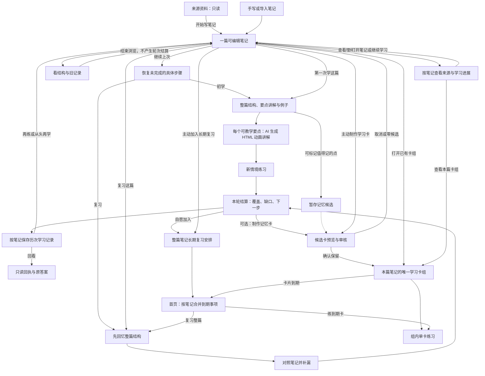

# 从笔记开始学习：初学、复习与长期复习的统一旅程

> 状态：**已确认的目标产品方案；尚未实施**  
> 日期：2026-09-24  
> 类型：产品需求文档（PRD）与客户端体验合同  
> 适用端：当前 Electron 桌面客户端  
> 产品决策：用户确认来源资料作为不可编辑的材料层，经现有「开始写笔记」进入可编辑笔记；笔记内提供「第一次学」「复习已有笔记」「长期复习」三个动作。初学遵循要点理解 → 例子 → 应用练习，复习遵循回忆 → 对照 → 补漏。学习卡可在学习中轻量标记、结算后自愿审核制作，也可从笔记页主动制作；同一笔记生成一个卡组。本方案据此定义入口、状态、正反馈和落地边界。
>
> 2026-09-24 补充裁决：来源页不设置学习入口，也不要求先筛选片段；现有整篇来源转笔记可以继续作为默认起稿方式。每篇笔记是一个完整学习对象，不设置「学这段」或按选区创建学习范围。初学、复习、学习记录和重做都以笔记为中心。项目尚未上线，不为旧测试数据保留兼容页面与双轨实现。详情见 §2、§7、§12。
>
> 2026-09-24 动态讲解补充裁决：**AI 生成的 HTML 动画是第一次学这篇时逐点理解的必备环节，也是第一阶段的交付门槛**，不是用户另点「看动画」才有的可选增强。进入初学路线的每个可教学要点默认呈现与笔记依据绑定的动态讲解；机制、过程、空间或状态变化展示其变化，静态概念用逐步显现、对比或反例解释，不制作仅为装饰的运动。动画无法可靠生成时如实标记该要点未完成动态讲解，允许继续读笔记或稍后重试，不冒充已交付。减少动态效果时提供内容等价的静态分镜。详见 §4、§10–§12。

## 0. 本版的裁决范围

本版是**今后学习流程的产品合同**。来源到笔记、笔记初学与复习、长期复习、学习卡定位、首页下一步和这些流程的游戏化表现，若与旧产品方案冲突，按本版执行。当前代码和旧文档仍描述已实现状态；本版的“应当”不代表功能已经上线。

| 旧方案或当前实现 | 本版裁决 | 仍然有效的部分 |
| --- | --- | --- |
| [方案 16](./16-unified-learning-run-micro-journey-live2d-system-companion.md) 的「所有学习入口先有一个 Key Point」「三分钟微旅程是完整学习体验」 | 三分钟以内的单目标运行成为整篇笔记学习旅程中的**一个可选练习/验证步骤**；一篇笔记无需先制卡即可开始。 | 作答证据锁定、独立评估、可信提交、暴露降级、幂等、权限与恢复原则。 |
| [方案 20](./20-learning-card-v2-value-first-generation-and-learning-target-rebase.md) 的 Note → 候选 → 审核激活 → Run 主路径 | 制卡是用户为长期记忆主动选择的支线；笔记初学、复习及加入长期复习均无需先生成、审核或激活卡。 | 用户确实选择制卡时的候选质量、证据、审核与激活要求。 |
| [方案 23](./23-learning-objective-content-topology-system-rebase.md) 的 Card/Objective 作为全部正式消费者前置，以及星图主要由卡片 Objective 点亮 | 内容范围与学习记录先于卡存在；星图以笔记及其真实学习进展为中心，没制卡的笔记也完整可见。卡是适合记忆的内容呈现，不成为第二颗知识星；正式验证仍经过可信作答链。 | 来源、笔记、要点、证据的拓扑关系，以及结果、历史的可信事实边界。 |
| [阶段 00](./00-decision-and-scope.md) 与[多模态总方案](../learning-companion-multimodal-understanding-universe.md)关于学习入口、游戏化的旧安排 | 采用本文以笔记为中心的三个动作与“轻压力、可持续”的游戏循环；旧 XP、连胜、每日债务与强制关卡继续不采用。 | 用户自愿、低摩擦、一个伴星、一个学习事实写入边界。 |
| [PRODUCT.md](../../../PRODUCT.md) 的「资料 → 笔记 → 学习卡 → 验证 → 复习」成功路径 | 保留“来源 → 笔记”的信息架构；移除“必须制卡后才能学习”的门槛。 | 来源、笔记、卡、证据、复习可追溯的产品使命。 |

裁决顺序：用户此轮确认的方向 → 本版用户旅程与结果语义 → 当前安全、隐私、可信作答及唯一调度写入边界 → 旧文档中不冲突的实现细节。实施时必须改造与新入口冲突的数据模型、路由和 UI；不得长期维护两条学习主线。**新流程上线后形成的每次学习记录必须可回看；上线前测试数据不要求迁移或兼容。**

## 1. 用户要解决的事

学习者收录一篇不能编辑的来源，先把它变成可编辑的笔记，再想弄懂里面的内容；过些时候，想知道自己还记得多少；掌握不稳时，想在以后自然接着学。当前来源转笔记会复制全部片段，这是可接受的默认起稿方式。真正的阻碍是笔记被要求先变卡，再由卡进入单目标题目，用户无法从一次题目的结果看清整篇笔记的学习位置。

**产品目标**：用户从可编辑笔记开始整篇学习；系统把长笔记拆成旅程内部的若干要点，初学每个可教学要点都由 AI 生成与依据绑定的 HTML 动画来动态讲解，再进入例子和应用练习；复习时给出可追溯的回忆引导。每一步都能看到正在推进的具体内容；结束时知道本次覆盖、薄弱处和下一步，并能自愿把笔记加入长期复习。来源转成的笔记、手写笔记、粘贴和导入的笔记都能学习；有来源就提供回看出处，无来源不伪造出处。

### 成功条件

1. 来源详情保留「开始写笔记／继续写笔记」，不添加学习入口；现有整篇转入笔记的默认行为可保留，用户在笔记里删改整理并回看出处。
2. 一篇新笔记从阅读页一键开始初学，已有笔记可一键复习；两者都不要求先制卡。
3. 一次学习固定以整篇笔记为对象；长笔记可分步讲解、练习、暂停和续学，内部步骤不产生独立学习入口、独立历史列表或独立复习安排。每轮结束与整篇覆盖分别记录，做完本轮建议的 3–4 点不能冒充学完整篇。筛选或编辑不是开始学习的强制步骤。
4. 学习结束不把“一题做对”“看过讲解”“长期记住”混为一个状态。
5. 用户能退出、稍后继续、拒绝长期复习，所有选择均有明确回执。
6. 正反馈让用户愿意再次打开书房，但不制造签到压力或用虚假掌握状态换取短期参与。
7. 笔记详情能列出这篇笔记的历次学习；每轮可回看，完成后可再练或从头再学，旧结果不被覆盖。来源详情只显示关联笔记并可跳转。
8. 一篇笔记生成的学习卡在卡库里形成**一个学习卡组**；卡库先展示卡组，点开后才看组内卡片。笔记页可直达本篇卡组；新版本再次生成仍进入同一组。
9. 用户在理解中可以轻量标记「值得记住」，结算后选择是否把合适要点制成卡；同一笔记的整篇复习与到期卡在首页合并呈现，但各自的学习事实和排程不混算。
10. 初学路线中每个可教学要点默认提供 AI 生成的 HTML 动画讲解，用户无需另行开启；动画能逐步解释该要点，支持暂停、单步、重播及内容等价的减少动效呈现。生成失败不得静默退化成一段文字并宣称该要点已讲解。
11. 一轮学习冻结当时实际使用的正文、出处和教学产物；后续自动保存、来源重解析和权限变化不得悄悄改写旧回执。无法可靠组织或验证的内容明确降级，不硬造要点、动画或掌握结论。

### 本版不做

- 不要求用户先填写学习目标表、审核卡片或挑选题型才开始初学；保留“先形成笔记”的产品边界。
- 不把整篇笔记拆成必须逐个通关的每日关卡、可分别报名的章节或「学这段」入口，也不在来源转笔记前增加必做筛选步骤。
- 本版不做笔记分类、主题、文件夹或自动归类；建笔记与学习不增加分类步骤。
- 不复制《集合啦！动物森友会》的角色、美术、音乐、图标、文字或具体界面；借鉴其温暖、探索、收集、按自己节奏生活的体验原则。任天堂官方将其核心体验描述为按自己的节奏探索、收集、装饰与展示收藏。[官方产品介绍](https://www.nintendo.com/us/store/products/animal-crossing-new-horizons-switch/)
- 不把浏览、点选、提示后作答、卡片翻面计为正式掌握；不做 XP、连胜、排行榜、随机开箱、断签惩罚或必须完成的日常任务。

## 2. 以当前客户端为起点的流程改动

以下是代码现状，不是本版已实现的承诺。

| 当前页面与入口 | 现有动作 | 本版主动作与去向 | 保留/调整 |
| --- | --- | --- | --- |
| Home V2：书桌的「今日下一步 / 今日复习」，书架的「来源资料 / 当前研究册」；入口由 `home-feature-registry.ts` 管理 | 下一步主要围绕已有目标、活跃 Run 和到期卡 | 今日下一步优先恢复未完学习旅程，其次呈现用户主动加入的到期复习；资料仍从书架进入。 | 继续用书桌、书架、星窗、休息角和功能签条；增加“学过的内容”的真实进度，不用虚构总数。 |
| 来源库 `source-library-surface.tsx` → 来源详情 `source-detail-surface.tsx` | 详情正文完整铺开；主按钮引导写笔记/前往笔记；`createNoteFromSource` 将整篇片段起稿到笔记并保留片段引用 | 保留「开始写笔记／继续写笔记」为主动作；来源只承担收录、解析、只读原文、出处与关联笔记导航；无学习记录和学习旅程按钮。 | 不新增选择性筛选门槛；解析中、失败、无正文、归档等状态如实说明能否起稿。 |
| 研究册 `notebook-surface.tsx` | 阅读/编辑、保存、规划学习卡；“版本历史”只处理正文版本 | 阅读和编辑视图都可找到「第一次学这篇」「复习这篇」「加入长期复习」；「快速回顾」为浏览入口；「学习记录 · N 轮」进入历次学习；「制作学习卡」是次动作，已有卡时「学习卡组 · N 张」直达本篇卡组。 | 编辑与保存不受阻；未保存内容须先处理，学习冻结已提交内容的独立快照；制卡不挡住初学和复习。 |
| 学习卡库/目标详情 `WorkspaceLibrarySurface.tsx` | 列表接口已有 `primaryNoteTitle`，搜索能匹配它；当前顶层仍逐张列卡，笔记名一般要进简报才能看到 | 顶层改为**一篇笔记一个卡组**，显示笔记标题、卡数、待复习数；点组进入组内卡片列表，再点卡进入简报。 | 卡组按笔记身份组织，状态和进度仍在组内逐卡呈现；卡不再是笔记初学和复习的门槛。 |
| 理解星图 `graph-surface.tsx` / `understanding-v3` | 已有来源、笔记、Objective、证据拓扑；目标星体及状态主要依赖激活卡，空态仍提示先制卡 | 笔记是默认可见的主知识区域；没有卡的笔记也能显示“未开始/学习中/待补学/到期”等真实状态。点笔记看本篇要点覆盖、历次记录、来源和下一步；卡组只作为可选记忆信息入口。 | 保留真实来源/证据光路与星图操作方式；移除“先制卡才有星图”的空态和按卡数冒充理解程度的筛选/计数。 |
| 今日学习 `StudySurface.tsx`、到期队列 `ReviewSurface.tsx` | 今日页是按当天时间排序的活动日志；队列按卡/目标启动到期 Run | 同一笔记的整篇到期复习与到期卡合并为一条可展开事项，分别完成；进入整篇复习后优先处理上次薄弱要点。 | 今日日志保留为跨笔记回顾，不代替某篇笔记的完整历史；队列保留恢复、延后和笔记入口；两种结果和排程仍独立。 |
| `learning-run-surface.tsx` 的任务与结果 | 单目标练习、逐项评分、排程说明、印章与发现卡 | 作为旅程里的独立应用/回忆节点；旅程结果汇总实际覆盖，单题结果仍保留可追溯详情。 | 不新增第二个正式评分器或排程写入器；结果仪式只依据真实事件。 |

首页和星图要跟随新主线改文案：空态引向“收录资料并开始写笔记”或“新建笔记”，学习中的焦点是“接着学这篇笔记的下一点”，卡片数只是可选收藏的数量。旧的“形成学习卡才有真实学习路径”提示不再适用。

**来源与笔记的边界：**现有 `createNoteFromSource` 把全部来源片段映射为带 `sourceRef` 的笔记块，并打开笔记编辑页。它生成可编辑初稿，不代表用户已经筛过或理解过，也不要求用户立刻筛选、改写。原文留在来源页，只读且可追溯；初学、复习、长期复习、学习记录集中到笔记页。从来源起稿后，用户可在笔记页直接选择「第一次学这篇」，也可以先编辑。手写笔记无需来源即可进入同一套学习流程。学习空间继续用于数据、成员与权限边界；本版不把多个空间当作笔记分类，也不新增分类能力。

## 3. 用户看得懂的三个动作

| 用户意图 | 明确入口 | 系统的第一步 | 完成后的选择 |
| --- | --- | --- | --- |
| 第一次学资料或新笔记 | 来源详情「开始写笔记」进入笔记；笔记阅读页「第一次学这篇」 | 给出笔记要解决的问题、建议要点；有来源的要点可回看原文位置 | 继续下一点、编辑笔记、把适合记忆的内容做卡、加入长期复习或就此结束 |
| 写过笔记，想巩固 | 笔记阅读页「复习这篇」或「快速回顾」，即使没有本产品内的初学记录也可开始 | 主动复习先遮住正文回忆结构；快速回顾直接呈现结构与差异 | 补学遗漏、安排以后复习或结束 |
| 想长期记住 | 笔记阅读页或学习结果页「加入长期复习」；以后从首页「今日复习」进入 | 展示整篇笔记下次复习的预计方式和可调整时间 | 优先回忆上次薄弱内容；没有历史时从整篇结构开始，不凭空称其为薄弱点 |

在笔记入口附近写清“这篇”指当前已提交内容的整篇笔记。系统可以建议内部学习顺序和本次先走的 3–4 个要点，但不能把学习对象缩成一段；页面同时显示整篇结构、本轮计划、实际进度与整篇尚未覆盖的要点。用户可暂停后继续，结算分别列出本轮未完成与整篇未覆盖。来源转笔记无需预筛选，开始学习也不要求先删改笔记。

图中「标记值得记」「制作学习卡」「加入长期复习」均由用户选择；标记不会立即生成或发布卡。首页可以把同一笔记的整篇复习与到期卡合成一条可展开事项，但两种完成结果与排程事实分开保存，练一张卡不代表整篇笔记已经复习。

### 一轮何时结束

学习对象始终是一篇笔记；「本轮」只是用户一次可暂停的尝试，路线可先建议少量要点。**轮次状态**与**整篇覆盖**分开：暂停/离开保留进行中的同一轮，首页显示「继续上次」；用户选择「本次先到这里」时封存一条“本轮部分完成”回执，下一次按整篇剩余内容新开一轮；走完本轮冻结的计划记“本轮完成”，若整篇仍有未覆盖内容，笔记主动作是「接着学未覆盖」，不是「复习这篇」。只有当前已提交正文的整篇可教学要点均有实际教学记录，才可说“这篇已走完初学路线”；待核对内容单列，这也不等于每点已独立会用或长期记住。用户主动按当前内容重开时，旧轮次记“中断”，旧作答保留。

一轮启动只建立一次轮次身份；暂停与恢复不增计数，完成、部分完成或中断是终态，不再复用该轮次写新作答。即使本轮安排了 4 点，也要同时显示“本轮 2/4”和“整篇已接触/待补学/未覆盖”的实际分布；本轮计划外的要点不能从整篇分母消失。快速回顾只是浏览入口，打开、翻看或反复进入不会生成学习轮次，也不计入「学习记录 · N 轮」。

## 4. 从笔记第一次学资料的完整体验

### A0. 进入与要点路线

- 来源解析完成后，用户按现有「开始写笔记」取得带来源引用的可编辑初稿，无须先选片段或删改；手写笔记也可直接使用。空笔记提示先添加内容，不创建空旅程。
- 用户在笔记页点击「第一次学这篇」，进入这篇笔记的学习页，不先打开制卡或题型规划。若该笔记已有暂停的轮次，主动作改为「继续上次」；若最近一轮已封存但当前已提交内容仍有未覆盖要点，主动作是「接着学未覆盖」；当前已提交内容的初学路线已走完后主动作才改为「复习这篇」，若还有待核对内容须同时显示，不能称整篇全部学会。即使没有产品内初学记录，用户仍可从次级动作选择「复习这篇」，因为笔记可能是此前已经学过的内容；「从头再学」可从学习记录或次级动作进入。
- 首屏用一页回答「这篇笔记想解决什么」「整篇有哪些核心意思」「每点在笔记哪里」。有来源引用的要点可展开原文；无来源的只展示笔记依据。系统可建议内部顺序，用户可调整下一步，但整篇笔记仍是唯一学习对象。
- 遇到无法独立解释的要点，显示必要前文/定义并说明原因；不为该要点生成另一个学习入口。
- 默认建议一条可分次完成的整篇路线，不暗示用户已经覆盖整篇。页面显示预计量级，不启动秒级倒计时。

### 内容资格与降级

非空笔记都能进入整篇学习入口，但系统须先区分**可教学要点、只适合整理/回顾的内容、需要用户核对或补充的主张**。来源整篇复制的初稿、零散摘录、代码、个人观点和手写总结都按实际内容处理；有笔记依据不等于有外部事实依据。可教学要点才进入 A1，并必须获得 AI HTML 动画讲解；无法支持讲解或正式评估的内容仍出现在整篇目录及未解决清单，允许用户阅读、补充笔记或主动快速回顾，不编出动画、例子或正确答案来填满路线。若整篇都无法形成可信可教学要点，首屏说明缺什么材料或结构，提供回笔记整理与稍后重试，不创建“已学完”结果。

路线生成须给出每个要点覆盖的笔记块/主张和未纳入的内容范围，不能把长笔记压成漂亮的 3–4 点后暗示整篇已被概括完。正文过长时仍展示完整目录，本次只推进一部分，明确剩余量级；系统无法可靠列出全篇要点时标明“目录待核对”，不计算虚假的整篇覆盖率。用户可以继续阅读或自愿拆分笔记，但拆分不是开始学习的必做门槛。对笔记与来源冲突、仅有观点或缺少依据的内容，只能提供标注为“依据这篇笔记的解释/类比”的教学帮助；正式判断需满足独立证据资格。

### A1. 逐点理解

每个进入初学路线的可教学要点采用同一节奏：**一句话抓核心 → 指向笔记段落与可用的原文出处 → AI 生成 HTML 动画逐步讲解 → 给出具体例子 → 用户可以追问或换一个解释 → 自己用一个新例子试一试**。动态讲解在要点主纸面默认出现，不另设「看动画」开关，也不把动画推迟到学习结束或书房装饰阶段。解释、动画和例子必须标出哪些来自笔记、哪些可追溯至来源、哪些是系统为教学补充的示意或类比。出处不足、来源与笔记互相矛盾时显示“不确定/需要核对”，不能补出看似可信的引用，更不能把未核实的因果关系画成确定过程。

AI 为每个要点编写实际的 HTML/SVG/CSS 动画内容，按可理解的步骤呈现概念的组成、关系或变化。机制、流程和空间关系展示关键状态及转变；定义、条件和辨析用逐步揭示、并排对照或反例展示其边界。每段动画须有明确的教学问题、关键帧文字和最后的归纳，不以循环装饰代替讲解。用户能暂停、单步前进/后退、重播并查看对应笔记依据；页面加载后默认提供动画，但不要求用户等待固定时长或看完播放才允许继续。用户进入后跳过该要点时标为「待补学」，尚未进入的要点才标为「未覆盖」；不能把跳过记作完成讲解。

动画必须绑定本轮冻结的笔记内容和可用来源，保存生成版本、依据、关键步骤与渲染产物，供退出恢复和历史回看。若材料不足以可靠解释某点，该点标为「待核对」，不生成貌似有据的动画，也不把它算进已完成讲解。生成或渲染失败时显示可重试原因与笔记原文，用户可继续其他要点；该点标为「动态讲解未就绪」，第一阶段验收不能把文字回退算作动画能力达标。减少动态效果时将同一内容按静态分镜逐步呈现，保留控制、文字和依据。

操作常驻但安静：「看笔记」「看来源」（有引用时）「暂停/单步/重播」「再解释一次」「换个例子」「先跳过」「稍后继续」。伴星可以提供短对话和鼓励，动画与长解释仍放在主纸面；任务呈现后再求助须记录暴露，正式评估按现有 Trust 规则降级。

遇到值得长期记住的术语、公式或适用条件，用户可轻点「值得记住」留下一个**记忆候选标记**。标记只保存该笔记版本、要点与用户意图，不打开制卡页面、不生成题目、不计为学会；用户可以撤销，退出后恢复时仍能看到。系统可在结算时提出有笔记依据的候选，但不得在用户正理解或正式作答时弹出制卡流程。

### A2. 低压力应用

只有用户已经接触到该要点的动态讲解或减少动效下的等价分镜后才出现应用或回忆动作。动画可能展示了解题线索，须按现有暴露规则记录；正式验证使用与动画和讲解不同的新例子。题型由知识形态决定：机制可解释或判断情境，步骤可排序，术语可举例或辨析；不为凑趣味强塞选择题。正式证明要求独立作答和合格的评分闭包；看完动画、点过步骤或在同一演示里预测正确都只算接触/练习，未达到条件时写“完成练习”，不提升掌握。

用户可选语音、短文字或合格的结构化交互；“暂时不会”可一键说明，无失败惩罚。“跳过”只表示本次不做。一次小练习通常沿用现有短 Run 的交互与可信内核；整篇旅程不被 180 秒预算截断，允许在要点之间退出和恢复。

### A3. 整篇结算

结果先回答三件事：**这次覆盖了什么、哪些仍需解释或练习、下次从哪接着来**。显示“已讲解 / 本次独立用过 / 借助提示完成 / 待补学 / 未覆盖”的要点分布，每项可回笔记，有出处时还可回来源。一次新例子的成功只写“本次能在这个例子中用出来”，不宣称长期记住整篇。

示例结算文案：“这次计划了 4 点：2 点在新例子中独立用过，1 点借助提示完成，1 点还没有进入。下次从『问题的适用条件』接着学。”各数字与要点标题来自真实旅程记录；没有相应证据的句子不出现。

主下一步只给一个：本轮仍进行中时是「继续这一点」；用户封存本轮但整篇仍有未覆盖内容时是「接着学未覆盖」；已进入但未理解或缺证据时是「补这一步」；当前已提交内容的初学路线走完后才可建议「加入长期复习」或「完成并返回笔记」，待核对内容仍单列。旁边只做一次安静的可选建议，例如「本次有 2 个适合反复记住的点，查看学习卡候选」；带入用户标记、已覆盖且可核对的稳定事实。未理解或证据不足的要点留在「补学」，不能因为做错了就机械制卡。用户可忽略、删除建议或进入同一审核流程；结算不自动建卡组。编辑笔记和打开来源也是自愿后续动作。暂停时保存本轮进度，首页能从准确位置恢复；明确选择「本次先到这里」才封存部分完成回执。

## 5. 复习已有笔记的完整体验

### B0. 两种深度

「快速回顾」直接展示笔记结构、上次学习位置和最近遗漏，适合看一眼；它只记为浏览活动，不创建学习轮次、不增加「学习记录 · N 轮」，也不改变掌握与排程。「复习这篇」进入主动回忆：先只显示标题、时间与用户可选的章节线索，让用户自己口述、写下或逐点点选想起的结构，再打开原笔记对照。页面须清楚标出“你刚才提到的”“笔记里有但你没提到的”“你提到了但笔记未写的”，后一类作为待核对线索，不能自动判错；这份差异属于回忆线索，正式判定仍需独立题目和可信评估。

### B1. 对照补漏

针对遗漏或混淆给出一段短解释，允许跳回原笔记和关联来源。笔记可能是用户自己的观点或尚未核实的总结；系统不能把笔记内容默认当成原文事实。要做独立检验时，仍要求新的情境和可信评估条件。

某个**已理解但多次忘记的具体事实**可在复习结算时获得一次「做成学习卡」建议；仍由用户审核并加入原笔记卡组。机制没理解、解释互相矛盾或笔记依据不足时继续补学，不通过制卡绕过理解。

无关联来源的手写笔记也可复习，原文引用区说明“仅依据这篇笔记”；不伪造来源。编辑中有未保存内容时，用户选择先保存并复习更新后的已提交内容，或按上次已提交内容复习。结算保留本次笔记内容快照与差异，防止日后编辑让历史反馈失去参照。

## 6. 从笔记自愿加入长期复习

- 只有用户在非空笔记阅读页或学习结果页明确选择「加入长期复习」，才为这篇笔记建立首个安排；不要求此前一定有初学轮次。没有学习记录时，首次到期复习从整篇结构出发，不假称已有薄弱点。不因完成一次初学或生成一张卡就自动订阅。新流程中已有安排不得被重复创建或静默删除；上线前旧测试安排无需迁移。
- 默认复习主体是**一篇笔记**，内部记录薄弱要点。一篇笔记在队列中显示为一项，避免长文产生几十条提醒；点开后优先处理上次薄弱部分，再抽查其余已覆盖部分。
- 同一笔记的整篇复习和卡组中到期卡若落在同一天，首页合成**一条可展开的笔记事项**，分别标明「整篇复习」和「到期卡 N 张」。用户可分别做；卡片作答只更新那张卡的证据和日程，整篇回忆只更新笔记复习事实。完成其一不自动完成另一项，也不向用户发两条重复提醒。只有卡到期、整篇未订阅时，这条事项仍可只显示到期卡。
- 排程的日期、提醒方式和暂停/移除入口可见可改。用户选择“暂时不会”可以促成更早的后续建议，但只有在已加入排程且可信提交后才改变正式日程。
- 到期复习先回忆，后揭示原文与解释，再针对薄弱处练习；阅读与提示后的表现如实标记。完成后说明“这次复习了什么、下次何时、尚有哪些未覆盖”。
- 来源重解析不自动改写笔记；已提交正文变化后，已有学习记录仍绑定当时的笔记快照。页面提示“内容有更新”，由用户选择看旧记录或按当前内容重新学习/复习。不能把旧结论直接套到变化后的内容。

### 到期复习的完成判据

每次进入整篇到期复习，先冻结**本次复习计划**：整篇结构回忆、此前明确的薄弱要点，以及从其余已覆盖内容中抽取的代表性要点；已提交正文有改动时先标出新增/修改部分。长笔记可以在同一轮内分次做完，不能因为只答了其中一道题就完成整篇到期事项。计划里逐点显示“已独立尝试 / 借助完成 / 跳过 / 资格不足”，没有抽查到的要点仍显示“本次未复习”，不宣称整篇每一点都重新记住了。

完成回执与正式排程回执分开：用户走完本轮计划但只阅读、受提示或评估不可用，保存“本次回顾/练习完成，尚待独立验证”，整篇到期项仍待处理；可明确选择“今天先延后”将它从今日展示暂移，正式下次日期不因此伪称已复习。只有本轮冻结计划里的必需回忆和验证点均形成可信独立提交，才能由**唯一调度写入边界**结算整篇到期事项并写下次日期；可信提交中答错同样是真实证据，由原调度策略安排更早的复习，不要求全部答对。只完成部分要点、只练到期卡、快速回顾或看完 AI 动画都不推进整篇日程。若某个计划点始终无法构成合格验证，显示“该点待核对/本次无法完成正式复习”，允许用户暂停、改进笔记或显式延后，不能陷入一个看似已完成却无法结算的状态。用户主动改提醒日期属于单独的手动日程调整，记录操作者与时间，可以改变下次提醒展示，但不写成可信复习完成，也不冒充自动调度结果。

到期事项始终显示两层状态：“这轮做了什么”和“正式日程是否已更新”。暂停/延后/移除订阅是用户显式动作，不等于可信复习成功；同一天的卡片到期部分独立结算。当前笔记正文变化后，下一轮从当前已提交内容创建快照和计划，先前快照的回执仍留在历史，不把旧内容的到期完成写成当前内容的验证。

协作笔记撤销共享或成员离开空间后，该用户的未完成整篇复习与卡片待办停止展示受保护标题、正文和题面，也不从旧快照继续发起练习或自动推进日程；原有个人排程保留为不可执行的权限状态，恢复权限后重新核对当前内容再继续。订阅移除仍由用户显式操作，不能用权限变化伪装成已完成。

### 6.1 笔记修改后的学习状态

**保存笔记会更新已提交正文：它可能继续写入当前未封存版本的正文块，也可能创建新版本；两种情况都不清空学习记录、整篇长期复习安排或学习卡组。** 笔记身份仍是同一个 `noteId`；历次学习记录当时的 `noteVersionId`、正文内容哈希与不可变学习输入快照，版本 ID 本身不充当当时所见内容的唯一证明。版本历史回答“笔记版本怎样改”，学习记录回答“当时具体学了什么”，两者可以互相跳转。旧结果在历史里仍真实有效，但当前正文发生实质变化时不能继续展示“当前内容已学会”；状态写成“先前内容已学过 · 当前内容待回顾”。仅改标题、排版或未改变教学依据的保存，不制造新的学习任务。以下用户界面出现的“旧版/新版”只表示学习时快照与当前已提交内容之间的差异，不能据此假定 `noteVersionId` 已变化。

| 修改情况 | 笔记页和下一次学习 | 旧记录与长期复习 | 学习卡 |
| --- | --- | --- | --- |
| 新增内容 | 显示“有新内容待学”；仍以整篇笔记为范围，先看新版结构，再优先学习新增要点；结算把旧版覆盖标为“历史参考”，与本轮实际覆盖分开。 | 旧记录不变；已订阅的整篇安排继续，下一次到期优先检查新内容，不因保存自动制造额外提醒。 | 不自动生成新卡；用户可在笔记页或结算后主动补卡。 |
| 修改或删除原有要点 | 显示“有内容已修改”；下次复习先确认新版结构，针对受影响的要点重新解释、练习；改动较大时建议“从头再学”，由用户选择。 | 旧版结论只留在旧版回执中；新版受影响要点标为“待重新验证”，未受影响的证据仍可供参考，不把旧成绩整体复制成新版成绩。 | 依据落在被修改/删除内容上的卡标为“待核对”，暂不进入正式到期练习；用户可批量保留并更新依据、修改卡面或停用。其他卡照常练。 |

系统以当前已提交正文与学习/制卡时的不可变依据快照之间的正文块和引用差异找出**可能受影响**的要点和卡片，即使两边的 `noteVersionId` 相同也要比较；不声称能可靠判断每处修改是否改变了知识含义。判断不清时显示“待核对”，让用户看当前与当时依据；不能静默改写卡的答案或继续用已失效的依据验证掌握。核对后卡仍留在同一个笔记卡组，保留它原来的练习历史，并从确认后的快照开始记录新证据。被停用的卡在卡组历史中可回看，但不进入到期队列。

每轮要点身份只在该轮冻结的学习快照内稳定。跨快照对照须保存当时要点与当前要点的显式对应及依据，至少区分「确认同一主张且依据未变」「内容改变/拆分/合并」「无法确定」。只有第一类可在页面上作为历史参考并做同口径的两轮对比；后两类标“当前内容待核对/待重新验证”，不能按标题相似、位置相邻或模型猜测自动继承独立作答证据。新增要点从未覆盖开始；删除的要点仅留在旧回执。即使确认同一主张，旧快照作答仍是历史，不产生一次当前内容的作答或到期完成。

如果用户编辑时已有未完成旅程，原旅程继续绑定旧版。返回时提示“笔记已更新”，让用户选择“继续旧版这一次”或“按新版重新开始”；前者的结算明确标成旧版结果，后者将旧旅程记为中断并新建一轮，不覆盖旧作答。新一轮仍学习**整篇笔记**，只是优先处理变化部分，不产生“学这段”入口。长期复习的订阅身份不变，下一次复习基于当前已保存版本；不能把旧版的到期完成直接记作新版已复习。

学习卡继续服务于术语、公式、定义和需要反复提取的事实。**它保留，但不需要为了学习整篇笔记而生成。**用户确实想把部分内容做成可反复练习的卡，才从笔记页或结算页主动启动现有候选审核链；第一次学、复习已有笔记、加入长期复习都不自动生成卡，也不以制卡作为前置。用户确认生成后，这些卡进入该笔记的同一个学习卡组。

### 6.2 可选的「制作学习卡」入口与流程

**主动入口在笔记页，情境入口在学习/复习结算页。**阅读和编辑视图的次级区域显示「制作学习卡」；尚无卡时，这也是「学习卡组」空态的动作。有卡后笔记页改为「学习卡组 · N 张」，组内提供「再制作一批」。结算页若有经过本轮学习、适合记忆且可核对的候选，才显示一次次级建议「查看值得记住的点」；可带入用户在学习中标记的要点，点击后打开同一篇笔记的审核流程。若没有合适内容，结算页不出现制卡提示。来源页和首页的笔记初学入口不发起生成。当前客户端的「规划学习卡」已能从笔记阅读/编辑页开启，本版将它降为次动作并改用用户一眼能懂的名称。

1. 点击后以**整篇已保存笔记**为输入；不要求划选段落、先做一次学习或先加入长期复习。若编辑中有未保存内容，明确选择先保存并按新版制作，或按上个已保存版本制作；不能默默忽略新内容。
2. 系统从笔记里提出适合独立反复提取的候选，例如定义、术语辨析、公式适用条件或步骤顺序；每张卡指出对应笔记依据，有来源引用时继续指向原文。从结算进入时，用户的「值得记住」标记和系统建议作为候选优先级，不能绕过笔记依据与质量门槛；从笔记页主动进入时直接扫描整篇。默认由系统决定卡型和数量；若用户明确想记某个术语或公式，可在「调整方案」写下它的名称作为重点，系统仍须在整篇笔记中找到对应依据，找不到就说明，不能凭名称生编。张数上限和偏重方向也放在「调整方案」，不要求先填表。内容不适合制卡时允许零候选，并解释原因，不为凑满卡组硬造题。
3. 候选逐张进入审核：用户看问题、答案与依据，再决定「保留」或「不保留」；明确确认后才激活进卡组。看过答案、接受提示等暴露仍按现有可信作答规则记录，不能因为用户审核过就把首次正式验证写成独立作答。生成中可以返回笔记并稍后接续，不重复开同一批任务。
4. 激活后回到《该笔记》学习卡组，看到新增卡和当前总数。之后可从卡组逐张练习或处理到期卡。制卡与练卡都不修改整篇笔记的初学完成状态，也不会自动给整篇笔记加入长期复习；反之，整篇笔记的长期复习无需拥有学习卡。

### 6.3 一张学习卡长什么样、怎么练

**一张卡对应一个清楚的记忆目标，不永久绑定一道固定题，也不内置一套必须做完的题库。** 卡片正面是一句不泄露答案的提问或提示，背面是简短答案、必要解释、对应笔记位置，以及可用时的来源出处。用户可以打开卡片阅读或核对；仅打开、翻面和看答案记为接触/预习，不记为独立答对。卡面内容与每次练习题目分开保存；一道练习题是该卡在某一次复习中的提问方式，通常一次只需答一题。重复复习时可在依据充分的前提下换例子或角度；同一记忆目标仍留在同一张卡和同一条历史中。若实际需要考两个互不相干的目标，则拆成两张卡；整篇机制的理解交给笔记学习旅程。

| 卡片要记什么 | 默认优先的作答方式 | 可用的其他方式 |
| --- | --- | --- |
| 术语、公式、明确事实 | 词语或一句话的短答、填空；不要求长篇手打 | 有可核对选项时用选择/判断练习；也可语音短答 |
| 条件辨析、步骤或顺序 | 判断、选择、匹配或排序，题面明确要辨别什么 | 简短文字或语音说明理由 |
| 原因、机制或新情境应用 | 一两句话用自己的话解释，或语音回答 | 有充分依据时用结构化步骤、关系或情境题辅助练习 |

系统依据卡的记忆目标与可核对材料推荐一种答法，用户可在作答前选择实际可用的其他方式；没有可靠选项、干扰项或步骤依据时，退回简短开放回答，不为凑趣味硬造客观题。选项题不会变成猜答案游戏：提交后呈现正确答案、错因和笔记依据，不能单凭一次选中正确项声称“已掌握”。当前客户端以文字短答为主要正式作答通道，语音与有条件的选择、判断、排序等为可用变体；现有结构化客观题只形成练习反馈，尚不足以独立证明全部正式评分条件。本版保留这个可信边界；若以后让某种客观题改变正式掌握或排程，必须先证明它能够覆盖目标的必要条件并通过同一评估/提交链。

用户在组内卡片和首页到期事项进入的是同一张卡的练习；结果显示本次题型、本人原回答或选项、答案、判定与下次安排。用户需要时可回看原题，但新一次正式验证应独立作答；看过答案后立刻重复原题只算练习。题型变了也不新建卡组或复制卡片，更不把答对一张卡当成复习了整篇笔记。

## 7. 历次学习记录、回看与重做

**每篇笔记都有自己的学习记录列表。**笔记阅读页列该笔记发起的“第一次学/主动复习/到期复习/再练”历次轮次，包含本轮完成、部分完成与中断；入口靠近主学习按钮，名称统一为「学习记录 · N 轮」。快速回顾仅记浏览活动，不进入这个轮次总数。学习记录与「版本历史」并列且明确区分：版本历史记录正文怎样改，学习记录记录用户每次怎样学。首页「今日学习」继续是跨笔记的当天活动日志，不承担一篇笔记的完整历史。

一篇来源可以关联多篇笔记，笔记也可能没有来源；因此列表按 **noteId** 归属，不因为共享一个 `sourceId` 就混成一条时间线。来源页仅列关联笔记，用户打开具体笔记后查看其记录。笔记正文可以在同一版本内继续保存，也可以产生新版本；历次记录仍归属同一笔记，但每轮须指向当时版本与内容快照，不能仅凭版本 ID 混算表现。

### 7.1 列表与详情

| 列表行展示 | 点开某一轮的只读详情 |
| --- | --- |
| 日期时间、初学/主动复习/到期复习/再练、当时笔记版本、本轮完成/部分完成/中断状态 | 当时的整篇要点路线、实际走过的步骤与不可变学习快照；当时看到的讲解和示例；本人提交的原话/选项；提示与揭示使用情况；逐项判定、未覆盖部分、结算与排程回执 |
| 简短结果，如“4 点中讲解 3 点 · 2 点本次独立用过 · 1 点待补学” | 对每个要点可从旧快照跳到当前内容相应位置；若定位失效，仍能读当时快照，不伪造当前位置 |

初学历史详情还应按当时冻结的版本重现每个要点的 HTML 动态讲解、关键步骤和对应依据；回看只能播放或单步查看，不能重新生成内容来冒充当时所见，也不因此产生新学习事实。动画生成失败的轮次保留失败回执，不能用事后生成的动画补写旧记录。

列表按时间倒序分页；结果缺失或评估失败的轮次仍可见，标注“未形成可靠判定”。进行中的轮次显示「继续」，已封存的轮次显示「回看」。列表可按初学/复习筛选，但默认一条连续时间线。只展示本人的学习结果；协作空间里其他成员读得到共享来源，不因此读得到本人的作答和判定。若后来失去笔记权限，本人的轮次日期、模式、状态等不含内容的元数据仍可见；笔记快照、来源摘录、原题、正确答案、反馈以及可能复制了受保护内容的本人原回答须遮蔽并说明原因，恢复权限后才完整回看。“可回看”不授权绕过当前访问权限。

### 7.2 四个不同动作

| 动作 | 用户预期 | 记录规则 |
| --- | --- | --- |
| 「继续上次」 | 回到尚未完成的同一旅程、同一步 | 不新建一次学习；继续使用原旅程 ID 与冻结内容版本。 |
| 「接着学未覆盖」 | 上一轮已经结束，从当前笔记尚未走过的要点继续 | 按当前已提交内容创建新快照与新轮次；旧轮次的部分完成回执不改写，学习对象仍是整篇笔记。 |
| 「回看这次」 | 只读重现那一轮的路线、题目、本人回答与反馈 | 不提交作答、不改掌握或排程；不会触发新的奖励。 |
| 「再练一次」 | 围绕这篇笔记重新做一轮练习，优先薄弱要点，用**新例子/新角度** | 新建该笔记的独立轮次；旧结果保留。满足可信条件才可能形成新的能力证据。 |
| 「从头再学」 | 从整篇笔记的结构与讲解重新走一遍 | 新建该笔记的独立旅程；旧记录保留。若当前内容已变化，先明确选择回看旧快照还是按当前内容重学。 |

用户若要“再做当时那道原题”，可从历史详情进入**原题练习回放**，保留原题与用户上次答案供对照；它只记录为练习，不冒充新的独立证明。结果页提供「回看这次」「再练一次」「从头再学」；首页只对未完成旅程显示「继续上次」，避免四个动词都争主按钮。

同一笔记、内容哈希相同或要点谱系明确对应的最近两轮可显示简洁对比，例如“上次需解释的 2 点，这次有 1 点独立用过”；没有可靠对应时并列展示，不计算虚假的进步百分比。历史总数与最近一次结果来自同一条权威记录查询；重复提交、刷新或重试不产生重复轮次。当前卡片详情只有“上一次留下的学习记录”，今日页只有当天活动；两者均不能替代本节的完整、按笔记查询的列表。

### 7.3 一篇笔记一个学习卡组

学习卡库的**顶层对象是卡组，不是散开的单张卡**。用户看到「《笔记标题》学习卡组 · 12 张 · 3 张待复习」；点开后才进入该组的卡片列表，逐张看概念、摘要、练习状态，再点卡看简报与证据。组标题可回到笔记。笔记页提供「学习卡组 · N 张」直达这一组；它和「学习记录 · N 轮」并列：卡组是用户主动制作的记忆材料，学习记录是本人历次学整篇笔记的过程与结果，两者不混算。

卡组身份由所在 workspaceId 与稳定的 `noteId` 决定：**一篇笔记至多一个卡组**。第一次主动生成学习卡时出现；同一笔记后来编辑、再次生成或补充卡片，仍进入原卡组，不按版本、生成批次或学习者不断新建卡组。组内每张卡保留生成时的 `noteVersionId`、实际使用的不可变生成依据快照及生成批次，卡详情可追到当时的笔记内容以及可用的原始来源；版本 ID 不单独充当依据快照。组标题显示笔记现名；卡的生成依据仍以当时快照为准。一个来源关联多篇笔记时，它们各有卡组，不因为来源相同而合并。卡组只是浏览与管理容器，**不是另一种学习完成状态或新的复习排程主体**；组上的待复习数是当前查看者本人组内到期卡的真实汇总，不能把“练过一张卡”显示为“整篇笔记已掌握”。

协作空间里，卡面、依据及卡组属于有权访问该笔记的空间材料；当前产品只允许空间 Owner 发起生成、审核与修改，Member 可阅读已共享笔记的卡并进行个人练习，不能修改公共卡面。每人的作答、可信判定、暴露记录和到期日程始终按 userId 隔离；成员甲练卡不会改变成员乙的待复习数或整篇笔记进度。私人笔记的卡组只对该笔记当前可访问者可见；笔记共享状态变化后重新校验可见性，不因卡组存在泄露笔记标题、卡面或来源。将来若开放成员制卡，须另行确定审核与公共内容修改权限，不能在本版暗中创建“每人一个同名卡组”。

卡库顶层搜索可按笔记标题定位卡组，也可按卡片内容找到其所在卡组并在打开后定位该卡；状态筛选展示有匹配卡的组和匹配数量，不能把部分匹配数冒充组内总卡数。当前学习卡列表投影已有 Objective 的 `primaryNoteTitle`，但那是主证据笔记，不能单凭它确定卡的生成卡组；实现时按卡的生成笔记版本回到 `noteId`。组内的其他支持笔记只在卡详情「参考依据」展示。无笔记来源的独立卡若仍属当前产品，单列「独立创建」容器，不伪造笔记卡组；笔记已删除或无权限时按真实可访问状态处理。分页、组内总数和待复习数由服务端按当前权限计算，不能只汇总客户端已载入的卡。

### 7.4 理解星图：以笔记为中心的进展地图

星图回答三个问题：**我正在学哪些笔记、每篇学到哪里、它们的内容从哪里来。** 默认层仍是「来源 → 笔记」；来源是只读材料节点，笔记是可编辑、可学习的主星座。新建或导入一篇有正文的笔记即可在图上找到它，无需先生成学习卡、参加测验或加入长期复习。没有关联来源的手写笔记也可独立出现；空笔记只作导航，不显示虚构的学习进展。一个来源连接多篇笔记时保持多条真实边，不把它们合并成一个学习对象。

一篇笔记在图上只有一个稳定身份（`noteId`），不因每次保存、重新学习或制卡而新增一座星座。默认图保持简洁；展开笔记后，才可查看当前版本旅程中已有的内部要点及其证据位置。这些要点是**整篇学习路线的可视化**，不是「学这段」的独立入口、独立日程或一组必须逐个打卡的关卡。没有形成可信要点路线时只显示笔记本身和实际存在的记录，不为填满星空自动造点或造连线。跨笔记关系只展示可追溯的引用/明确关系，不能把模型猜测画成确定知识光路。

| 图上对象 | 用户看到的真实信息 | 点击后的动作 |
| --- | --- | --- |
| 来源 | 标题、可读/解析状态、关联笔记 | 打开只读来源或关联笔记；没有“学来源”按钮 |
| 笔记星座 | 当前版本、最近一次学习时间、实际覆盖/遗漏、是否有未完旅程或到期复习；尚未学习则写“未开始” | 打开笔记，或从详情选择「继续上次」「第一次学这篇」「复习这篇」「学习记录」 |
| 展开的要点与证据 | 仅显示当前笔记版本中确实形成的要点、已讲解/练习/待补学/未覆盖事实和可用出处 | 查看本篇笔记中的位置与回执；学习动作仍回到整篇笔记旅程 |
| 本篇学习卡组 | 在笔记详情里作为可选的「学习卡组 · N 张」链接及真实到期数 | 打开同一 `noteId` 的卡组；不额外画一颗与要点重复的“卡片知识星” |

星图可用柔和亮度表现“这篇笔记有真实学习足迹”，但**不能用一颗星的亮度给整篇笔记打掌握分**。状态旁必须有文字，例如“4 个计划要点中，本次讲解 2 个、独立用过 1 个、2 个未覆盖”；做过一张卡、翻过卡面、看过讲解均不能把整篇点成“已掌握”。整篇到期复习和卡片到期是不同标记；筛选“待处理/学习中/未开始”以笔记的真实旅程与安排为准，卡片数只在卡组信息中显示。

笔记改版仍是同一个星座；当前版本被修改的要点显示“新版待回顾”，旧版学习痕迹留在历史详情，不能直接染成新版的已理解状态。受影响的卡按 §6.1 待核对，不因此复制卡片星或清空整张图。星图是浏览与导航表面，正式作答仍在笔记旅程或卡片练习页进行；回到星图后从权威学习记录刷新状态，不根据前端动效推断成绩。

## 8. 动森式学习循环：探索、发现、留痕、再来看看

本产品借鉴的是“慢慢经营一个属于自己的地方”的节奏。用户每次回来都能做一件小事、看见一点真实变化，并且随时可以停下。循环是：**从书房选择想探索的内容 → 完成一小段有意义的学习 → 看到收获或待解线索 → 把痕迹留在自己的书房 → 以后自然接续**。

本节描述完整目标体验；第一阶段只落实学习页由真实事实驱动的一次性反馈，持续化发现簿、书房陈设和相关首页入口按 §12 放在第三阶段。

### 8.1 四种可感知的反馈

| 触发事实 | 当下反馈 | 持久痕迹 | 不暗示的事 |
| --- | --- | --- | --- |
| 完成某个笔记要点讲解 | 纸页轻翻、该要点的笔记线索被收进“发现簿” | 发现簿记录笔记标题、段落、可用出处与已讲解时间 | 尚未证明已理解、会用、会记 |
| 独立完成一个新例子的合格应用 | 要点旁出现一枚小型“本次用过”印记，伴星一句具体反馈 | 该要点的本次作答回执与例子 | 一题证明整篇掌握 |
| 主动标记“暂时不会”、找出笔记遗漏 | 温和的“找到一条待解线索”反馈，给出下一步 | 待补学清单及返回位置 | 把诚实的不确定说成失败 |
| 主动标记「值得记住」 | 要点旁出现一枚可撤销的小书签，不打断当前讲解 | 本轮结算可回看的记忆候选标记 | 已生成学习卡、已经掌握或必须制卡 |
| 完成一次已订阅的到期复习 | 一次短暂的完成仪式，显示日程变化 | 发现簿中的复习足迹；首页当日事项自然减少 | 在没有可信提交时称为“已记牢” |

**发现簿**是现有结果页“发现卡”的持续化延伸，不是抽奖箱。每条发现都可点开真实出处、当时做过的练习和自己的困惑；只有事件真实完成才出现。重复点击、切页、刷新不再掉落新的奖励。用户可收藏一句自己的“我现在懂了什么”，系统生成的句子必须标注为建议，不能代替用户陈述。

**书房成长**采用可选的轻装饰：一个主题学习路线完成后，可得到与该主题相关、由产品原创的书签、植物标牌或纸质摆件；用户可以摆放，也可以完全忽略。装饰的解锁来自已经记录的真实学习里程碑，不能由答题正确率、学习时长或连续天数决定；它不改变模型评分、复习顺序和知识状态。发现簿、书签/贴纸与书架进度痕迹在第三阶段建设；第一阶段只保留学习页对真实步骤的一次性轻反馈，不先建设家具经济系统。

### 8.2 趣味落在学习动作里

- **探索感**：笔记结构像一张可展开的地图，当前要点有路标，未覆盖区域可见但不施压；点回笔记段落或关联来源像翻开找到的线索。
- **参与感**：初学的 AI HTML 动画是逐点理解的必备讲解，先让用户看见机制、过程或条件怎样变化，再在新情境里自己尝试；机制类内容可用“替一个角色做选择”的小情境，程序类内容可整理顺序，概念类内容可找反例。题型由学习目标与证据资格决定，动画不能把弱证据伪装成证明。
- **陪伴感**：伴星回应具体行为，如“你把条件说清了”“这一点留作下次”，避免空泛的“太棒了”轰炸。正式作答时保持安静、待机，不主动泄题。
- **惊喜感**：结算可揭示“笔记里还有一个你可能感兴趣的关联点”，指向实际笔记段落；有来源时可附原文位置。由用户决定是否探索，不无限推荐或自动连播。

反馈分三级：要点互动后轻微按压/点亮（约 100–250ms）；完成一段路线后一次小印章（约 400–700ms）；真正完成一篇本次计划时一次可跳过的书房庆祝（最长约 1.2s）。同一事件只播一次，恢复页面不重播；系统“减少动态效果”、应用 Lite/Off、静音分别生效，所有状态另有文字表达。错误、网络等待、评估失败不播放庆祝或积极印章。

## 9. 页面与视觉合同

现有 [DESIGN.md](../../../DESIGN.md) 和 HUD 页面已具备暖木、奶油纸、手绘书房、双轴不等圆角、克制阴影及 Live2D 伴星。本版延续这些已成形的视觉规则，扩展“探索地图、发现簿、书签”三种局部组件，不另造一套 UI 色板。任务正文使用清晰的纸面排版；装饰与低对比纹理不降低阅读、输入和评分原因的可读性。

| 页面 | 主要布局与视觉焦点 | 游戏化位置 | 必须看得清的事实 |
| --- | --- | --- | --- |
| 首页小屋 | 书桌放“接着学/今天复习”，书架放资料与发现簿；沿用四区域聚焦和目录 | 书架留下完成路线的书签，休息角可见伴星待机 | 一条最值得做的下一步、到期数量、未完旅程位置 |
| 来源详情 | 原文为大面积主纸面；「开始写笔记／继续写笔记」指向研究册 | 关联笔记像书签，方便返回原文 | 来源解析状态、关联笔记和原文出处 |
| 笔记初学 | 左侧短路线/当前位置，中间默认呈现 AI 生成的 HTML 动态讲解、文字与例子，笔记以就地展开或旁页查看 | 动画逐步展示内容关系；每走完一小点，路线贴一张轻量便签；可点「值得记住」留下可撤销小书签 | 动画每一步的含义和依据、正在学笔记哪一点、有无来源、还有哪些没覆盖；看过动画还不是学会 |
| 笔记复习 | 先呈现干净的回忆纸；揭示后用并排/切换视图对照原笔记 | 找到遗漏时收下一条“待解线索” | 用户原话、笔记原文与系统判断分别标识 |
| 学习卡库 | 顶层是一篇笔记一册卡组：笔记标题、总卡数、待复习数；打开后是本组卡片列表 | 每组像书架上的一册索引，不增加装饰性徽章遮挡归属 | 顶层看清有哪些卡组；组内看清每张卡的内容和进度 |
| 理解星图 | 来源连接笔记；笔记星座默认可见，展开后才看本篇真实要点、证据与卡组入口 | 学过的笔记留下克制光痕，视觉变化与学习事实同步 | 没卡也能看见笔记；明示覆盖、缺口、版本与下一步，不把卡数或亮度当掌握分 |
| 到期复习 | 现有抽卡手势仍可用于逐项切换；队列先显示笔记标题与推荐薄弱点 | 复习足迹出现在发现簿，不做限时连击 | 今天为何复习、是否可延后、会不会改变安排 |
| 结算 | 一张“本次学习手记”：覆盖、收获、缺口、下次位置；有合格候选时显示一次可忽略的制卡建议 | 一次印章/发现卡和可收藏书签 | 哪些只是看过、哪些本次独立完成、哪些未覆盖；制卡需要再次审核确认 |
| 学习记录 | 笔记详情中的时间线列表，点开进入只读的当次手记 | 当时获得的发现可再次查看，回看不重新播放奖励 | 每次的范围、版本、原回答、判定与重做入口 |

主按钮使用直白中文动词：“开始写笔记”“第一次学这篇”“复习这篇”“继续这一点”“加入长期复习”；「制作学习卡」是笔记页的次级动作。趣味文案放在标题、说明和伴星短句中，不用“出航”“开盲盒”等词代替操作含义。所有关键操作支持鼠标和键盘；要点路标只负责整篇旅程内的定位与续学，不提供逐段开始按钮。窗口缩放到当前产品的最小视口与 200% 系统缩放时，正文、主动作和状态不得被伴星、浮层或装饰挡住。

## 10. 学习事实、排程与数据边界

### 10.1 用户可见的五种状态

| 状态 | 成立条件 | 展示措辞示例 |
| --- | --- | --- |
| 已接触 | 笔记内容/讲解确实呈现，用户主动进入该要点 | “这点的讲解已看过” |
| 本次独立用过 | 对新情境的有效作答通过该点适用的可信评估 | “这次你能用它解释这个例子” |
| 借助完成 | 提示、揭示、辅导后完成，或只能构成练习证据 | “借助提示完成，留作以后独立试一次” |
| 待补学 | 用户声明暂不会、评估指出缺口，或对照笔记发现遗漏 | “这点需要再解释/练一次” |
| 未覆盖 | 这篇笔记中尚未进入本次路线的部分 | “这次还没有学到这里” |

“已经长期记住”必须依赖后续跨时间的独立提取证据，本版的单次初学不提供该结论。评估不可用、引用无法核实或目标质量不足时只保留可确认的过程事实，结算不得猜测作答质量。已有 `LearningRun` 的逐项评估、结果和日程回执继续作为正式任务的事实源；整篇旅程只**汇总**这些事实与讲解/回顾事件，不另立一个掌握评分器。

动画的生成、呈现、暂停与步骤查看属于教学过程事实；实际看到动画时可记「已接触」，动画生成失败则只记失败与重试，不计「已讲解」。动画中的预测、点击或拖动只提供练习反馈，不能自行提升「本次独立用过」；后续正式验证仍按新的题面、暴露记录和可信评估闭包判定。

### 10.2 必要的领域对象（概念合同，实施前细化 schema）

| 对象 | 职责 | 关键字段/约束 |
| --- | --- | --- |
| `StudyAttempt` | 一次可暂停、恢复且可回看的整篇笔记学习轮次，历史的唯一身份 | workspaceId、userId、attemptId、noteId、snapshotId、初学/主动复习/到期复习/再练模式、开始与结束时间、进行中/暂停/本轮完成/部分完成/中断状态、本轮计划覆盖与整篇实际覆盖、关联 Run 与结果回执；终态不可复用或覆盖 |
| `StudyJourney` | `StudyAttempt` 进行中时的路线与恢复投影，不另算一轮 | 与 attemptId 一一对应，保存冻结的整篇目录、本轮计划、当前步骤和恢复点；快速回顾不创建 Journey/Attempt，不另建段落级学习身份 |
| `StudyContentSnapshot` | 冻结本轮实际使用的学习输入，供生成、评估与历史回放 | snapshotId、workspaceId、noteId、noteVersionId、内容哈希、当时标题、按序正文块和锚点、可用来源摘录/引用及其版本或内容哈希、生成路线的输入；创建后不可改写，教学产物和题目都引用该快照 |
| `StudyUnit` | 系统内部的笔记要点，用于组织讲解和薄弱点 | 快照内身份、主张、笔记锚点、可用来源引用、教学示例、质量/可评估资格；跨快照只通过明确的“相同/变化或拆合/不确定”谱系对应，不按标题猜测，也不自动生成用户可见学习卡 |
| `LearningObservation` | 记录看过、追问、回忆差异、练习结果、未覆盖与用户「值得记住」标记 | 事件源、actor、时间、版本、Trust 类别、关联 Run/Assessment；标记可撤销、随旅程恢复，不能单独提升掌握或激活卡 |
| `ReviewSubject` | 一位用户在一个空间里对一篇笔记的自愿复习安排 | 唯一 workspaceId+userId+noteId 身份、已学习快照、内部优先要点、自动到期日、手动提醒调整与原因、暂停/移除；正式结果仍由唯一权威调度服务写入，卡片日程另存 |

卡库需提供按 `noteId` 聚合的卡组列表与按 `noteId` 分页的组内卡片列表。组投影至少有笔记 ID、可见标题、活跃卡总数、真实到期数和可访问状态；组内卡保留卡 ID、生成时的 `noteVersionId`、生成批次与个人练习状态。归组依据取自**卡的生成笔记版本**，不能把现有 Objective 的 `primaryNoteTitle` 当作分组键。笔记页「学习卡组」与卡库打开同一 noteId 的组；服务端在分页前施加权限和 noteId 条件。组可以是 `noteId` 上的投影，不要求单独建设持久化卡组表；手动卡用独立来源类型，不靠标题相同、原始来源相同或多条支持证据猜归组。项目未上线，可直接调整现有列表合同与无用的旧兼容投影。

星图投影必须从**可访问的来源与笔记、当前笔记版本、整篇学习记录/安排和真实要点证据**构建；没有卡也要返回笔记节点及其真实状态。卡组数量和到期数只作为笔记详情的辅助投影，不是生成笔记节点或学习状态的前置条件。现有 Objective 若继续用作要点的正式评估身份，应允许它从可信笔记要点建立而不要求先激活 Card；卡片只关联相应记忆目标，不再产出重复的知识节点。版本变化和权限变化必须同步到星图边与个人状态，不能读取旧版结果后给新版着色。

现有正式 `LearningRun` 的 origin 仅支持 card/review/star_map/today/onboarding，且创建时冻结 active Objective+Card；现有调度查找 `subjectType=card`。因此实施本版必须为笔记学习范围增加可信目标来源和范围级调度支持，或重构 Objective 与 Card 一一绑定的假设。**不能用后台偷偷造一张用户未审核的学习卡来绕过入口问题。** 只有达到证据与评分资格的 `StudyUnit` 才能进入正式独立验证；其余走教学/练习，结算明确标注。改造沿用现有 Artifact → Assessment → Commit 和一个 Scheduler 写入边界。

来源重解析可能改变片段；当前笔记版本下的正文块也可能继续自动保存，因此只记录 `noteVersionId` 不足以重现当时实际内容。启动轮次前须处理未提交编辑，读取一致的已提交笔记正文与当时可用来源摘录，原子地创建不可变 `StudyContentSnapshot` 与首个 `StudyAttempt`；无法取得一致内容时不启动。要点、AI 动画、例子、题目、评估依据与结果均绑定 snapshotId 和各自产物哈希，恢复与历史回放只读原快照，不重新查询当前正文或重解析后的来源来替换旧内容。删除/归档、权限变化与跨空间访问按现有工作区权限失败关闭；旧快照仍用于内部可追溯事实，但对失去内容权限的用户按 §7.1 遮蔽受保护部分，不把它拼到公开结果中。AI 使用仍遵守账号级同意与数据外发政策。

记录服务提供按 `noteId`、当前用户和工作区查询的分页列表，以及通过 `attemptId` 读取一次完整回执；列表必须返回稳定总数/分页信息和“是否还有更多”，不能把首页当天日志或 Objective 的 `latestResult` 当成全量历史。历史详情用当次冻结的快照与作答、Assessment 事实渲染；重做创建新 `StudyAttempt`，不复用已结束 Run 的 ID。来源详情不新增学习记录查询。

### 10.3 AI HTML 动画的生成与运行合同

初学动画是正式教学内容，不是书房动效。每个进入 A1 的可教学要点须产出可重放的 HTML/SVG/CSS 动画产物及步骤说明，绑定当前学习快照、要点主张、笔记锚点和可用来源。AI 可以决定图形、布局、运动与教学顺序；每个关键画面必须能用文字说明它在解释什么。生成前先判定材料是否足以支持该解释，生成后核对关键文字、关系和变化是否与依据一致。未经核对的系统类比需明确标注，不能变成原文事实。

AI 生成的是实际的 HTML/SVG/CSS 内容；播放、单步、重播等控制由可信客户端执行。生成内容不得包含任意脚本、事件处理器、外部资源、导航、表单、存储或应用 IPC 调用。服务端解析并按允许的元素、属性和样式重建产物，再在没有外网与应用权限的隔离渲染面展示；设置大小、节点数、动画时长和运行资源上限。当前 Electron 客户端禁止子框架和 WebView，实施前须设计并验证专用隔离渲染面及对应 CSP，不能将 AI 原始代码直接插入主界面，也不能为了显示动画放宽主界面的脚本权限。

生成和校验采用同一学习快照的幂等任务；进入旅程先生成当前要点，系统自动预生成下一要点，不要求等整篇动画全部生成才开始。恢复页面复用已通过检查的产物，用户主动要求换一种解释才生成新版本。历史保存当时通过检查的产物及其内容哈希，不能只保存提示词、回看时重新生成。关键帧必须可逐步查看，所有承载知识的信息都有文字等价呈现；系统减少动态效果、应用动效 Off 或运行环境不支持动画时显示同一产物的静态分镜。动画内容不得遮挡笔记依据、正式作答区或主操作。

## 11. 异常与可恢复状态

| 情况 | 用户看到什么 | 允许动作/记录原则 |
| --- | --- | --- |
| 来源解析中、空文、解析失败 | 如实显示可读性与原因 | 继续读已有正文、重试解析；不启动空学习计划 |
| 笔记超长、结构混乱或非说明性内容 | 显示可核对的整篇目录与建议先走的要点；无可信主线时直说 | 分次推进、暂停续学；结算保留未覆盖清单，不创建章节/选段学习对象 |
| 原文与笔记说法冲突 | 并列展示两处文字与各自出处 | 标为“待核对”，不自动改写笔记或判用户错 |
| 生成讲解/练习失败 | 已完成步骤可见，失败步骤可重试 | 不补发虚构结果、不重复奖励；可改为直接读原文 |
| AI HTML 动画生成、校验或渲染失败 | 该要点标「动态讲解未就绪」，显示原因、重试和笔记依据 | 可继续其他要点或稍后恢复；失败点不算已完成讲解，不用静态文字冒充必备动画已交付 |
| 动画内容无依据、与笔记冲突或触发安全限制 | 不显示有问题的产物，指出待核对或生成失败 | 留存失败回执并可重试；不执行不受信任代码，不以动画画面判断用户掌握 |
| 用户中途离开或设备中断 | 首页显示精确恢复点 | 继续、从头看、结束；已提交结果保持幂等 |
| 评估失败或质量不足 | “这次无法可靠判断” | 保留作答原文/练习事实，不升级掌握，不改变正式排程 |
| 已有到期安排或当前卡片 Run | 显示当前日程/任务来源 | 不创建重复提醒；可返回卡、笔记或原文 |
| 当前内容已更新 | 显示“先前内容已学过 · 当前内容待回顾”和变更摘要；旧记录仍指向原快照 | 看旧快照、按当前内容复习或从头再学；旧成绩不自动迁移，受影响的卡先核对依据 |
| 历史轮次只有练习、无可靠评分 | 列表仍显示这一轮的时间和“练习完成/评估未确认” | 可回看当时作答；不补造结论，重做时开新轮次 |

## 12. 实施顺序与验收

### 第一阶段：笔记无卡初学与历次记录

来源详情「开始写笔记」→ 当前笔记编辑页「第一次学这篇」→ 整篇要点路线 → AI HTML 动画讲解与例子 → 新例子练习 → 覆盖结算 → 笔记「学习记录」与首页恢复。保留来源到笔记的整篇起稿及现有编辑页落点，不增加筛选或来源学习入口。先实现已提交内容的一致读取与不可变学习快照、内容资格判定、本轮计划与整篇覆盖分账、暂停/部分完成/中断/恢复，再补齐 `StudyAttempt` 和 `StudyJourney` 的按笔记分页列表与只读详情；不引入选段学习范围实体。旅程中可留下可撤销「值得记住」标记，先让它在结算和历史里正确呈现；该阶段不依赖制卡功能完成初学。首期反馈只在真实完成的步骤旁轻量呈现，不建设持续化发现簿。正式评估资格不足时完整显示“练过、未证明”，不能拿现有卡片 Run 假装完成。

**第一阶段交付门槛：**把上述「讲解/例子」实现为每个可教学要点默认呈现的 AI HTML 动画讲解、文字说明与依据，并完成安全校验、隔离渲染、暂停/单步/重播、减少动效静态分镜、失败重试、退出恢复及历史原样回看。动画能力不能移入第三阶段的书房动效，也不能由一段文字、预置装饰动画或用户另点的附加入口代替。若首期没有可用动画，第一阶段的笔记初学闭环不算验收通过。

第一阶段先做小范围真实笔记试用，再决定扩大入口：样本至少覆盖整篇来源直接起稿、手写总结、结构混乱的摘录、公式/过程与无可靠来源的观点。逐例检查整篇目录是否漏点、动画是否准确解释依据、用户能否用新例子独立说明、首点等待是否可接受，以及部分完成与历史是否可信。每次试用把“生成失败”“内容不适合教学”“评估不能确认”作为独立结果统计；任何越权读取、执行未信任代码或无证据却推进正式掌握/日程的情况均阻止阶段验收。体验与理解指标的具体阈值在试用前写入验收表，不能上线后按漂亮数据倒选。

### 第二阶段：笔记复习、重做与长期日程

笔记页加入主动复习/快速回顾，完成跨版本差异对照；学习记录提供「继续上次」「回看这次」「再练一次」「从头再学」，每次完成后的新轮次保留旧回执。笔记改版时标明新版待回顾，未完旅程由用户选择继续旧版或按新版开始，受影响的卡先核对依据再进入正式到期练习。结果页提供显式加入、暂停和移除长期复习；首页与到期队列将同一笔记的整篇复习和到期卡合并展示，分别提交结果。卡库顶层改为笔记卡组列表，组内才展示单卡；服务端补齐卡组与组内分页投影。星图改为笔记优先的投影，没有卡也能显示笔记与真实学习状态，旧的制卡空态、按卡状态计笔记进度和重复的卡片知识星随之移除。笔记页保留现有整篇生成和候选审核内核，入口改为次级的「制作学习卡」；学习与复习结算只有在有合格候选时才提出一次可忽略建议，带入用户标记后仍逐张审核，已生成的卡组在笔记页可直达。旧测试数据无需回填；按实际调用图迁移入口后，删除已无调用方的强制制卡页面、路由、类型、测试和文案，不维护双轨。涉及 schema 历史先确认开发数据库可重建，再清理迁移。

整篇笔记到期排程须先按 §6 的可信完成判据接入唯一调度边界，再展示为正式完成；手动调日期与“今天先延后”均单独记录。

### 第三阶段：书房的持续反馈

发现簿按笔记与薄弱点回访，有来源的条目可继续追到原文；书房书签/摆件表现真实里程碑；伴星提供个性化但克制的短反馈。主题情境、更多题型与季节变化仅在主学习流程可用、可信、可恢复后扩展。

### 端到端验收案例

1. 新用户收录一篇来源，点击「开始写笔记」取得可编辑初稿，不筛选、不制卡；在笔记页点击「第一次学这篇」完成要点路线。来源页没有学习按钮；结算区分已接触、独立用过、未覆盖。
2. 长笔记建议本轮先走 4 点，用户只学 2 点后直接离开：本轮保持暂停，首页显示“继续上次：第 3 点”，恢复不新增轮次；若明确选「本次先到这里」，封存一轮部分完成记录，列出本轮剩余 2 点及整篇其他未覆盖点，下次按当前笔记新开一轮“接着学未覆盖”。走完建议的 4 点但整篇还有未覆盖内容时，不能显示“整篇学完”或把主动作改为复习。不出现「学这段」或章节独立历史。
3. 用户从笔记页直接主动复习，先回忆后对照，能看到自己遗漏的部分；快速回顾只算浏览，不新建 Journey/Attempt、不增加「学习记录 · N 轮」、不改变正式排程。
4. 用户在笔记阅读页或学习结果页明确加入长期复习后首页出现该笔记的一条到期项；拒绝加入时无排程。没有初学记录的手写笔记也能直接选择主动复习或加入长期复习，首次到期不虚构薄弱点。重复点击、刷新、断网重试不会产生重复安排或重复奖励；只浏览或借助提示走完本轮时显示“待独立验证”，不自动推进到期日。
5. 有提示的新例子完成只算练习；无可信评估、原文证据失效和内容更新时均不得出现“已掌握整篇”。
6. 语音不可用、Live2D 加载失败、动效关闭、200% 缩放与键盘操作下，三条主路径仍完整可达、可读、可结束。
7. 一篇笔记完成两次练习，笔记页的「学习记录 · 2 轮」列出两轮，能分别只读回看题目、原答案和判定；「再练一次」产生新轮次，「从头再学」重走整篇，「继续上次」只恢复未完成轮次。原记录不被覆盖，回看不改排程；多次快速回顾也不改变“2 轮”。
8. 来源关联多篇笔记时，来源页仅显示笔记链接；各笔记的学习记录互不混合。笔记改版后旧回执仍指向当时快照；当前页标明新版待回顾，新学习按新版开始。新增内容优先学习但不自动生成卡；修改了卡片依据时只将受影响的卡标为待核对，核对前不进入正式到期练习，其他卡照常练。改版中断的旅程可选择继续旧版或按新版另开一轮，旧作答不被覆盖。
9. 仍属于当前产品的学习卡可打开、练习和查看历史；新流程不要求用户经由卡库才发现“学习”。已无调用方的旧强制入口被删除，受影响模块类型检查和测试通过。
10. 一篇笔记生成 12 张卡后，卡库顶层只有一个《该笔记》卡组，显示 12 张及真实待复习数；打开后才看到 12 张卡。再次从该笔记生成卡仍进入同一组，笔记页「学习卡组」直达此组。另一篇引用同一来源的笔记不会混入；组内卡详情分别说明生成版本、支持笔记和原始来源。分页后的卡不因客户端只查当前页而漏掉。
11. 用户仅做笔记初学、主动复习或加入长期复习，不点「生成学习卡」时，卡库没有为该笔记自动建立空卡组，也没有后台暗生卡片；学习旅程与到期复习仍可完成。
12. 用户在一篇已有内容的笔记页点「制作学习卡」，按已保存的整篇笔记取得候选；可在「调整方案」指定想记的术语或公式，但无笔记依据时不能造卡。逐张不保留或保留，再确认激活；只激活保留的卡，进入该笔记已有或新建的唯一卡组。编辑中未保存、生成中离开、零候选和审核后看过答案的状态都有明确回执。
13. 初学时用户在一个已解释要点上点「值得记住」，继续练新例子而不中断；退出恢复后标记还在。结算显示该标记及有依据的制卡建议；用户忽略后不生成卡、不改变本轮结果，用户进入制卡后仍须逐张审核。未理解或来源不足的要点只进入补学，不被自动推荐为卡。
14. 同一笔记当天同时有整篇复习和 3 张到期卡，首页只显示一条可展开事项，明确列出两个待做部分；只练 3 张卡不会把整篇复习标成完成，只复习整篇也不会清掉卡片到期状态。卡片和整篇结果各写入原本对应的事实与排程边界。
15. 卡组内一张“记住公式适用条件”的卡，正面只提示目标，背面有简短答案和笔记依据；打开或翻面不算掌握。一次可用短答，另一次有可靠材料时可用判断情境；两次仍归同一张卡的历史。无可靠选项时不硬造选择题；猜对一次客观题只记录练习，提示后重做原题不产生新的独立证明。用户无需每次写长篇答案。
16. 用户仅新建一篇手写笔记、没有来源也没有学习卡，星图仍显示这篇笔记并标“未开始”；初学后按实际覆盖更新，不能因为没制卡而空白。展开笔记可看本篇要点与出处，点“继续/复习”进入整篇旅程；练一张卡不改变整篇状态。笔记改版后同一星座提示新版待回顾，旧版亮度不直接迁移。
17. 用户进入一篇有可教学要点的笔记初学路线，每个进入 A1 的要点在主纸面默认获得 AI 生成、与本轮笔记依据绑定的 HTML 动画讲解，无需另点「看动画」。过程要点展示状态变化，定义或条件要点逐步对照或揭示；动画可暂停、前后单步、重播并回看依据。之后用不同的新例子练习；仅播放或操作动画不记为独立用过。退出恢复及历史回看仍呈现当时通过检查的同一动画版本。
18. 动画生成失败、证据矛盾、生成代码含脚本/外部请求或渲染资源超限时，受影响产物不执行，该要点不冒充已讲解；用户看到重试和继续其他要点的路径。系统减少动态效果或应用动效 Off 时，同一教学内容按静态分镜、文字与依据完整可读。隔离渲染面只能显示经校验的本轮动画产物，不能访问外网、客户端 IPC、产物之外的笔记私有数据或正式作答内容。
19. 用户在有未保存编辑时开始学习，先得到明确的保存/按已提交内容开始选择；完成保存后，系统在一致读取下冻结实际正文与来源摘录，创建一个 snapshotId 和 attemptId。此后同一 `noteVersionId` 的正文块被自动保存、来源重新解析或标题改变，恢复与历史仍显示当时的正文、出处、动画、例子与原题；哈希或一致性校验失败时不启动新轮次。
20. 整篇来源直接复制的长笔记、零散摘录、公式过程、个人观点与无来源手写笔记都能进入笔记入口；系统如实区分可教学、只适合回顾和待核对内容。不能教学的部分仍在整篇目录与未解决清单，不能用 AI 捏造讲解、答案或独立掌握；整篇无合格要点时说明原因并回到笔记整理，不产生“已学完”回执。
21. 到期笔记本轮必需回忆与验证点均可信提交后，整篇到期项由唯一调度边界结算一次；答错时仍记录真实结果并可安排更早回访。只完成部分、评估失败、提示后重做或仅练到期卡时，整篇正式日程不前进；“今天先延后”只改变今日展示，用户手动改提醒日期留下独立调整记录。协作空间中两人复习同一共享笔记时，各自的到期日、作答与卡片待办互不影响；撤销共享后，失去权限者的到期事项不泄露标题和题面、不从旧快照继续练习或自动推进日程。

### 判断产品是否真的变好

观察从来源详情到笔记、从笔记到首次理解步骤的转化、无需制卡完成首轮学习的比例、初学要点的动画生成/校验/渲染成功率与等待时间、用户能否根据动画解释关键变化并在新例子中独立使用、错误或无依据动画的发现率、减少动效下的理解表现、未完旅程恢复率、笔记学习记录回访率、卡库按笔记查找与笔记反查卡的成功率、主动复习完成率、自愿加入长期复习率、七天后再次独立回忆的表现，以及“我知道自己学了什么、接下来做什么”的用户反馈。游戏化要看它是否帮助用户继续学习与理解；若仅提高点击/停留时长，却降低独立回忆、引发催促感或使结果理解出错，就应削减相应机制。

本方案只确认目标产品与验收口径。任何章节的“第一阶段/第二阶段/第三阶段”都不表示已有实现或给当前客户端新增承诺。
