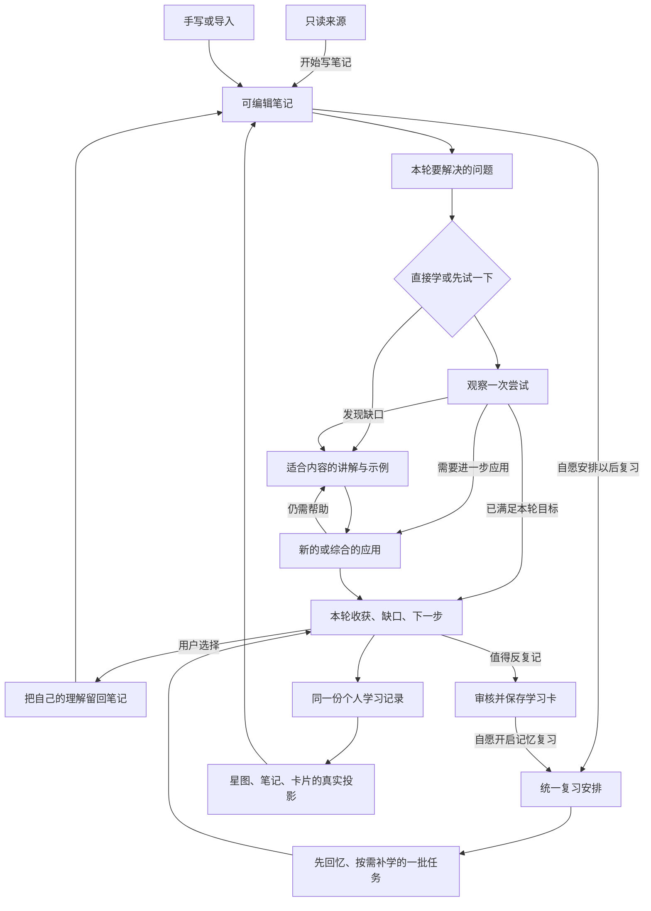

# 理解引擎：以笔记为入口、以问题牵引的自适应学习系统

> 日期：2026-09-24
>
> 状态：**独立产品提案，供评审；尚未实施，不自动替换现行产品合同**
>
> 范围：Electron 桌面端的来源、笔记学习、学习卡、复习、理解星图、首页和伴星协同
>
> 核心主张：从一篇笔记出发，围绕值得解决的问题，根据用户实际表现组织讲解与练习；把理解留回笔记，把记忆需求交给卡片，把后续学习放进一个可持续的安排。

## 0. 提案的地位与阅读方式

本文从完整用户任务重新设计产品，不是方案 38 的补丁清单，也不是数据库或接口实施稿。阅读者不需要先读旧方案即可理解目标体验。

用户已认可前轮讨论的改进方向，并要求形成独立完整方案；本文将其整理为可评审的具体决策。现有 [PRODUCT.md](../../../PRODUCT.md)、[方案 38](./38-source-note-learning-journey-prd-2026-09-24.md) 与运行代码仍各自描述现行目标和实现。本文获采用后，再同步修改产品合同并制定技术实施方案；39 系列的增补与修订本身不修改运行行为、现行产品合同或数据库。

建议先读 §1–5 的定位和主旅程，再读 §7–11 的复习、学习卡和星图，最后检查 §16–18 的场景、实施次序与验证方法。

伴星的当前能力、代码缺陷、共用能力与分期依据另见 [伴星调研与接入附件 39b](./39b-companion-capability-audit-and-integration-2026-09-24.md)。本次将伴星纳入同一产品方案，核心接入不留到后续单独重构。

学习卡整套 AI 执行链按 [重做方案 39c](./39c-card-ai-lifecycle-rebuild-2026-09-24.md) 设计，包含生成、检查/改写、任务准备、提示、文本/语音作答、评估与结算交接；范围不只限于制卡长事务拆分。

本文的目标产品规则是 39 系列的共同依据；39a 是跨阶段行为演练，39b 的现状发现和 39c 的代码事实是调研当时的快照，均不代表新功能已实施。附件细化本文规则，不能以历史代码行为或演练方便为由放宽授权、学习证据和结束条件。实施前仍需按 §15.3 把关键合同落实为技术设计与验收。

### 0.1 相比方案 38，主动改变的产品决策

| 议题 | 本提案的选择 | 保留的边界 |
| --- | --- | --- |
| 整篇笔记与完成标准 | 笔记是稳定的内容、入口与记录容器；每轮围绕明确问题，可有充分的结束感，不默认以覆盖全部可教学内容为目标 | 完整目录和未涉及内容仍可查看，不把一轮完成写成整篇掌握；不增加选段学习入口 |
| 初学顺序 | 提供直接讲解和轻量先试两条路径，按表现补学，允许绕过已会内容 | 无需填表或先考试；不知道时可以直接听解释 |
| 动态讲解 | 对适合展示变化的内容默认提供 AI 动态讲解；表达方式服从知识形态 | 保留真实生成、依据、隔离渲染、单步、减少动效与历史回放；取消每点必须交付动画才算学习成立 |
| 到期复习 | 活动结束、能力证据、下次安排分别判定；提示后完成、自评和评估失败有各自可结束路径 | 不虚构独立掌握；保留一个获授权的调度写入边界 |
| 复习安排的单位 | 笔记承载持续授权与汇总展示，实际回访按目标和维度维护；不再增加一份竞争的整篇日程 | 初次回访与纯回顾提醒标明性质，不伪装能力或记忆估计 |
| 笔记与卡片复习 | 组成同一批学习任务，合格证据按目标复用，避免重复提问 | 卡片记忆与综合应用不互相冒充，记录与日程可追溯 |
| 学习产出 | 用户的解释、反例和疑问可自愿留回笔记，成为下次学习材料 | 不自动改正文，不要求每轮写总结 |
| 星图 | 按笔记总览、局部知识关系、具体证据逐层展开，帮助选择下一步 | 不依赖制卡建节点，不按亮度判整篇掌握，不把模型猜测变成确定关系 |
| 首轮验证 | 第一阶段就验证初学后隔天再回忆的连续体验 | 完整自动日程、卡库重组与跨笔记关系分阶段交付 |

### 0.2 不变的产品与平台约束

- 来源只读，经「开始写笔记／继续写笔记」进入可编辑笔记；整篇来源直接起稿是可接受的默认方式。无须先筛片段、整理或制卡。
- 手写、粘贴、导入和来源起稿的笔记共用学习流程。有来源可追溯；没有来源不伪造出处。
- 不新增来源页学习入口，不新增章节独立订阅、选段学习历史或分类必填步骤。
- 沿用暖纸书房、现有首页区域、窗口内 Live2D 伴星；不重做视觉品牌，不新增自由漫游或场景级 3D。
- 学习事实、权限、个人数据隔离、不可变作答与历史、幂等、AI 同意和唯一调度写入边界继续成立。调度接受的证据类别需要显式扩展，不暗改现有可信语义。现状是调度**策略**唯一、写入点有三处（结算、卡片生命周期、延期服务），实施时先收敛为单一写入边界，见 §15.3。
- 项目未上线，不为旧测试数据保留双轨产品。真正替换运行链路时按仓库 AGENTS.md 核对引用、清理旧实现并验证；本文不授权删除现有 schema 或迁移。

选区/章节可作为伴星提问的定位和本轮问题的范围，不形成第二种学习容器。来源页的伴星可解释出处或可读材料，但开始正式学习先进入关联笔记；未保存草稿可用于明确标注的临时讨论，不能直接建立正式制卡、评分或日程。普通问答不自动创建学习轮次；用户选择开始/继续学习，或已在轮次内求助时，才关联相应旅程。

## 1. 产品为谁解决什么问题

### 1.1 用户任务

目标用户是主动学习的个人：手里有一份材料，想弄懂、用出来，并在以后还想得起来。他可能只有十几分钟，也可能愿意持续探索；他通常不知道自己具体缺哪一块，不希望先管理一批卡片或配置学习计划。

用户需要系统帮助回答四个问题：

1. 这份内容里，现在最值得我弄懂的是什么？
2. 我是真的不会、忘了，还是只是不想写长答案？
3. 学到哪里可以先停，今天到底留下了什么？
4. 下次回来，怎样继续而不重复消耗时间？

当前系统已有材料、笔记、生成与可信作答能力，但主路径仍偏向先产出目标和卡片，再逐个验证。本提案把组织材料、教学决策和能力观察连起来，让第一次学习和后续维护共用同一份个人学习记录。

### 1.2 首期聚焦与内容适用性

首期试用优先选择结构相对清楚、包含概念关系和应用问题的技术或学科笔记，例如程序机制、数据结构、数学概念与明确步骤。它们便于检查讲解是否正确、问题是否有效、用户能否迁移使用。

其他非空笔记仍然可以进入，但按实际能力提供服务：

| 内容 | 优先帮助 | 不作出的承诺 |
| --- | --- | --- |
| 概念、机制、步骤 | 解释、对照、预测、应用 | 一次答对证明长期熟练 |
| 公式、术语、适用条件 | 理解含义、区分边界、反复提取 | 背出公式等于会使用 |
| 研究论文、论证 | 梳理问题、前提、证据、结论与局限 | 复述作者结论等于结论已被证实 |
| 个人观点、计划、随笔 | 澄清主张、追问理由、回顾本人思路 | 存在唯一标准答案，或缺少外部来源就不能讨论 |
| 零散摘录、相互矛盾的材料 | 找到可解释片段和待核对问题 | 为了生成完整课程补造依据 |
| 操作性技能 | 在支持的任务形式中观察实际操作或推理 | 只凭文字解释判定真实操作熟练度 |

“有出处”表示可以核对材料，不自动表示事实正确；“有学习证据”表示观察过一次表现，不自动表示能力稳定。

### 1.3 产品成功的样子

用户完成一轮后，能指出一个比之前更清楚的问题，并能在适当任务里说明或使用；隔一段时间回来，系统能辨认需要回访的地方，提供有限、可结束的复习。用户不必理解后台目标、快照、评分和调度术语。

首期不追求百科全书式知识网络、任意资料自动课程化、考试认证、教师管理台、强制日程、排行榜、连续签到或家具经济。笔记分类与文件夹也不纳入本轮。

## 2. 产品结构：各部分只承担清楚的职责

| 部分 | 用户价值 | 不承担的职责 |
| --- | --- | --- |
| 来源 | 保存只读原材料与出处 | 直接承担学习进度 |
| 笔记 | 组织材料、容纳自己的理解、承接学习和完整记录 | 以篇幅决定必须投入多少时间 |
| 笔记学习旅程 | 围绕问题解释、观察表现、补缺口、综合使用 | 要求先生产学习卡 |
| 学习卡 | 维护值得反复提取的具体知识 | 替代整篇机制理解或成为学习门票 |
| 今日学习／复习安排 | 从已授权的需求中组织有限的下一批行动 | 把所有未学材料变成逾期债务 |
| 理解星图 | 表达关系、学习位置和下一步 | 另建掌握算法或一条独立教学路线 |
| 伴星 | 根据当前上下文引导、解释与回应 | 私自改笔记、订阅、判分或宣布掌握 |

用户界面里的主要动词是「开始学习」「继续学习」「复习这篇」「先到这里」。长期复习是用户对未来安排的选择，不是与初学并列的一套学习模式。卡片与星图提供其他进入方式，最终回到相同的学习事实。

### 2.1 学习卡、学习旅程与伴星怎样协作

现有代码不是一套统管所有学习功能的 Agent：学习卡 V2 由独立的 Planner、Author、Grounding Critic、Pedagogy Critic 管线产出候选；伴星对话由带受控工具和独立会话记忆的 Agent loop 承担；正式 LearningRun 又有自己的任务、作答、评估与调度链路。它们复用 AI provider、同意与审计能力，也通过学习目标、卡片、运行记录和到期状态相连，但不共用一份对话上下文或一个可随意写入所有业务状态的 Agent。伴星目前可以读取、定位已有卡及学习运行，并经受控动作启动、恢复或辅助学习；卡片候选的生成、质检和审核仍在制卡链路。现有伴星 `companion_start_learning` 还从 active Objective 加 active Card 寻找起点，不能把它当作本提案的“无卡笔记开始学习”已经接通。

本提案采用“**共用一套 Agent 运行基础，按任务区分能力，共用学习事实**”。统一范围包括模型调用与路由、上下文装配、工具执行、任务生命周期、取消与恢复、预算与重试、输出解析、运行事件与审计。新增教学、制卡、讲解或其他 AI 功能，应组合这些已有能力；不能只共享 provider，仍让各模块各写一套执行循环、重试和状态协议。现有伴星 runtime 也需要拆出公共职责，不直接把带有人格、语音和对话专用分支的整份实现作为所有任务的基类。

功能差异保留在任务定义中：需要什么输入、能使用哪些工具、期待什么产物、采用什么检查与预算。闲聊可使用工具循环；候选生成和评分可只调用一次结构化任务。同一运行基础支持这两种执行方式，不要求每个功能都先经一次 LLM 意图分类、规划和多 Agent 分工。用户点明确按钮时直接启动对应任务；只有自然语言意图确实含糊时才澄清或由模型选择动作。

笔记旅程决定本轮问题、教学与要观察的目标；制卡任务生产有依据、可供本人审核的记忆材料；评估任务提出判定，业务服务核验并记录学习事实，唯一调度边界处理未来安排。伴星作为贯穿这些功能的对话入口，可以发起任务、继续解释和汇报真实结果。用户说“把刚才总忘的条件做成卡”，与在结果页点击制卡应进入同一个目标范围和候选流程，不让用户先跳到另一页重新讲一遍需求。普通聊天里输出了卡片文字不等于已保存；候选仍由本人明确保留，订阅仍遵守 §8–9 的授权。

统一运行基础不等于所有调用共享聊天记录或写权限。伴星的长期记忆用于尊重偏好与调整交流；生成和评估按任务只读取必要、可访问的内容。评分不接受伴星的鼓励或生成器的自我评价作为依据，伴星说“你会了”不产生能力证据。卡片、旅程、首页与星图读取同一目标身份、内容版本、作答身份、暴露条件和授权日程；它们各自的业务生命周期不必强行合成一张通用状态表。具体公共职责与迁移原则见 §15.5。

## 3. 用户怎样进入与选择下一步

### 3.1 来源到笔记

来源页保留原文、解析状态、出处与关联笔记。点击「开始写笔记」取得带引用的可编辑初稿并打开笔记。页面明确这是初稿，不表示用户已整理或理解；用户可以直接开始学习，也可以先编辑。

来源解析失败但已有可读内容时如实展示；空来源不能生成空课程。相同来源的不同笔记独立保存，不合并学习记录。

### 3.2 笔记页

正文是视觉主体。学习区只放一个主要动作和一句理由：

| 当前情况 | 主动作与说明 |
| --- | --- |
| 没有学习记录 | 「开始学习」；系统从这篇笔记提出一个值得解决的问题 |
| 有未完轮次且内容适用 | 「继续学习」；回到具体问题和步骤 |
| 最近结束了一轮，仍有明显缺口 | 「接着弄懂……」；说明推荐原因，允许换方向 |
| 已开启复习且有推荐回访内容 | 「复习这篇」；先回忆，再补需要的部分 |
| 当前没有紧迫下一步 | 「继续探索」；可选其他问题、复习或就此阅读 |
| 正文有实质修改 | 主动作附「有内容更新」；先看变化与适用的历史表现 |

用户始终能从次级动作选择「复习这篇」「完整走一遍」「快速回顾」「制作学习卡／学习卡组」「学习记录」。用户在软件外学过，不能因为本产品没有记录而被强制初学。

这些情况可能同时发生，主动作按“需要处理的内容／权限变化 → 用户仍愿意继续的适用未完轮次 → 已授权的到期回访 → 最近明确缺口 → 开始或继续探索”确定；用户本次明确选择的动作优先，略过旧轮次不会使它一直霸占主推荐。内容变化只影响局部时，先说明该处变化，不锁住整篇。各入口使用同一优先规则，不能在笔记页推荐初学、首页强制复习、星图又恢复另一轮。

同一用户在同一工作区、同一笔记默认只有一个进行中或暂停的笔记旅程。改选问题或切换初学／复习时，先判断能否作为该轮的计划调整；需要另开一轮时明确封存旧轮并新建，不能静默覆盖。独立练卡可另行进行，其新结果会在恢复笔记旅程时用于去掉尚未开始的重复任务，不改变已经提交的记录。

“继续学习”只恢复未终结轮次；昨天已经“先到这里”的轮次可以作为下一轮起点，保留未解决问题，但不会重新打开原轮。多个窗口或设备使用同一服务端轮次与修订：当前任务只接受一次首次提交，其他草稿先保留并提示冲突，不合并成一份原始回答。关闭一个窗口不暂停另一个仍活跃的窗口。

「快速回顾」只是看正文结构、本人记录与变化，不创建学习轮次，也不改变能力证据或记忆间隔。

### 3.3 无目标表单的轻量定向

开始后，系统用笔记、已知历史和用户此前明确的意图提出一句本轮目标，例如：“判断为什么有索引，查询仍然可能慢。”默认可直接开始。

用户可以改写这一句话，或选择「我完全不熟」「先让我试一下」「完整走一遍」。这些选择均可略过；没有选择时从低负担解释开始，不把无回答推断为不会。

用户否定推荐问题时，允许从完整结构另选一个问题，或直接输入想弄懂的事；不能只有“开始”和“退出”。输入超出笔记支持范围时说明现有材料能解释到哪里，允许回笔记补充，或在来源已标明的教学类比范围内讨论，不自动扩成联网研究或一套新课程。

系统可以询问一个影响教学的必要澄清，但不连续盘问。用户的时间意愿只影响本轮建议量，不变成倒计时、考核或强制承诺。

### 3.4 开始时实际使用哪份内容

已保存的笔记直接开始。有未提交编辑或保存失败时，明确提供“先保存再开始”与“按上次已保存内容开始”，不能默默忽略眼前修改。开始学习、主动复习和制作卡片采用相同原则。

系统必须取得一致的已提交正文和可用出处，再创建本轮快照。保存或一致读取失败时不创建看似已开始的空轮次，草稿保留并可重试。正文太长时先提供可核对的结构与局部准备状态，不能静默截取前半篇并称为整篇输入。

## 4. 笔记、要点与本轮目标

### 4.1 学习范围与学习义务分开

一篇笔记始终是当前旅程的容器、上下文与历史归属。系统保留整篇结构，并将内容分为：当前核心、必要前置、可选延伸、参考材料、待核对内容。系统的分类是可纠正建议，不是永久判定。

对疑似错误、关键条件缺失或与同篇材料相矛盾的具体主张，展示“待核对”的原句和原因；只隔离受影响主张，不阻断其他有依据的问题。不能把它改写成确定事实，作为标准答案、正式能力判定或可开启复习的卡片依据。用户可以修改笔记表述、补充可核对来源，或将它明确保留为个人假设；系统随后只重新检查受影响目标。个人假设仍可讨论或以后回顾，但不获得客观正确标签。

默认先完成一个连贯的问题，而不是按原文顺序讲完每个可教学要点。用户选择「完整走一遍」时才采用全篇路线；即使如此，背景和重复例子也不需要机械变成独立练习。

本轮之外的内容显示「本次未涉及」，不自动标为薄弱、不会或到期。整篇结构尚不能可靠整理时显示“结构待核对”，仍可在有可靠依据的问题上提供帮助，不给出全篇覆盖百分比。

### 4.2 要点和学习目标的关系

要点用于组织材料，不是每个都必须评估。只有确实需要观察表现或长期回访的内容，才形成可追踪的学习目标，例如“区分两个概念”“说明某个因果环节”“在给定条件下作出选择”。

目标可以由多个笔记块支持，一个综合任务也可以涉及多个目标。目标不依赖卡片存在；卡片在需要时关联目标。首期以笔记内部目标为主，不自动合并跨笔记的同名概念，也不建设全局唯一知识词典。

用户不需要管理目标 ID 或逐个审核所有教学目标。系统无法确定一个主张是否与历史相同时保留差异，不按标题相似自动继承能力证据。

同一篇笔记已有目标时，新的轮次先匹配和复用适用目标，再创建确实新增的目标；仅重新组织路线、改变题面或改写目标显示名，不另建目标、卡片或日程。快照冻结“当时用了哪一版目标”，不意味着每个快照都重新产生一套身份。默认去重范围是同工作区、同笔记、同一可确认的目标及能力维度；跨笔记仅有相似关系时仍分别记录，暂不自动抵扣复习。

教学路线和新提出的目标可以先作为本人的学习计划使用，不需要取得共享笔记的编辑权。只有当前材料管理权限允许的动作才会把它们写入公共卡面或公共关系；个人学习不能暗中扩展共享材料。

目标的可确认材料身份与本人的计划/观察分开。只读成员可引用已有适用目标，或建立只对本人可见的目标绑定；不能为了获得稳定 ID 要求公共编辑权。后来公共卡片出现时，只在目标与修订可确认一致后关联已有个人记录，不复制或迁入其他成员表现。系统生成了一份目标草稿不等于用户已经学过。

### 4.3 本轮计划可适应，实际路径可追溯

系统先提出一个小计划，试用默认可从 2–4 个相关要点起步；这个数量是产品初始参数，不是所有笔记的固定标准。计划说明要解决的问题、预计量级和结束条件。

教学中允许根据表现插入一个必要前置解释、略过已有足够证据的重复内容、缩短或更换练习。系统不得把临时追问无限扩成新课程。新增明显增加负担或超出当前问题的内容时，提供“现在补／留到以后”。

计划调整保留理由和版本，历史记录实际走过的内容，不能覆盖最初计划并伪装从未变更。每道用于能力判断的题目在呈现前固定目标、题面、评分条件与初始证据资格；后续求助、揭示或依据失效可以收紧资格，不能看到答案后改题意或放宽条件以迁就结果。

### 4.4 「完整走一遍」怎样完成

完整路线开始时，明确当前内容下纳入的核心问题、必要前置，以及未纳入的背景、重复材料与待核对部分。用户可以调整，但系统不能在后来悄悄缩小范围，让剩余内容从分母消失。目录尚不能可靠整理时仅提供分次探索，不承诺完整覆盖。

每轮仍可独立结束；整体路线进展按适用目标汇总多轮实际记录，不要求把它们保存在一个永不结束的大轮次里。纳入的每个核心问题都已经实际学习，或有适用证据可略过重复教学时，才能说“已走完这份核心路线”；借助完成和仍需帮助另外列出，不宣称全部会用。用户主动跳过、系统未能提供可靠讲解和待核对问题不能算已覆盖；用户缩小范围时，结果注明按调整后的范围完成。

笔记实质修改后先确认路线受影响部分，保留未变目标的适用记录。初始路线已走完但后来新增内容时，显示“原路线已完成，有新内容可学”，不改写历史，也不把新增内容自动变成到期义务。

## 5. 一轮学习的完整体验

### 5.1 首屏：知道为什么学

首屏展示本轮问题、它在笔记中的位置、建议的几个步骤和主要动作。完整目录按需展开，不要求先审阅全篇大纲。不要在进入之前生成完所有动画和题目；先准备当前必要内容，后续按需预生成。

### 5.2 直接讲解或轻量先试

完全陌生者直接获得简短解释和一个具体例子。有基础者可先预测、解释、判断或尝试一个小问题；“直接告诉我”始终可用。

先试是教学分流，不是入学考试，也不会仅因一次回答把用户永久划为初级或高级。能否略过某段讲解，应结合本次表现和相关历史；用户仍可主动查看。

若先试本身已满足本轮预先明确的目标和证据条件，可以直接结束，或由用户选择更深入的问题；不为走完固定流程强制再讲一次、再考一次。用户要求重新讲解时照常提供，不把系统判断变成无法绕过的捷径。

### 5.3 根据缺口改变帮助

| 观察到的情况 | 系统的下一步 | 需要避免的处理 |
| --- | --- | --- |
| 忘了术语或条件 | 简短提取提示、揭示，按已有授权安排或提供可选回访建议 | 把整段机制重新播放一遍，或擅自订阅 |
| 混淆两个概念 | 并排对照、边界例子与反例 | 只换措辞重复定义 |
| 不理解因果或过程 | 动态演示关键变化，请用户解释其中一环 | 看完即记理解 |
| 缺必要前置知识 | 指出缺口并提供最小补充；较大分支交给用户选择 | 无上限展开基础课程 |
| 能复述但不会迁移 | 新情境、条件变化或反例辨析 | 再问一次原定义 |
| 回答太短、语音识别有误 | 请补一个关键条件，或确认转写 | 直接判定不会 |
| 用户没精力或不想输入 | 换可用答法、减量或结束 | 将沉默与跳过记作能力不足 |
| 系统无法判断 | 承认不确定，保留回答，允许对照或反馈 | 继续出题直到得到想要的答案 |

这些是可解释的教学假设，界面使用“可能卡在……”；用户可以纠正“我不是这个意思”。一次错误不得自动写成长期人格或能力标签。

首期以“同一关键缺口连续两次帮助后仍没有改善”作为停止自动加题的默认触发：呈现换解释、补前置、回材料核对或先结束，由用户选。它是控制自动扩张的初始参数，不是限制用户主动继续学习；不能只换题名后重新开始计数。

### 5.4 讲解之后要有参与和应用

系统可以让用户在演示中预测下一步、指出一个条件、解释一个变化，形成有参与的练习。帮助和揭示按实际任务记录；演示内做对不直接成为独立应用证据。

在适合的内容上，以一个新情境连接本轮要点。综合任务不是额外附送的一轮考试：它可以替代已经被覆盖的重复小题。简单术语或单一事实无需硬造综合任务。

反馈首先针对原回答说明“哪一步成立、缺哪一个条件”，再决定是否需要继续；不只给对错、分数或泛泛鼓励。用户可以提出异议，争议期间不自动扩大能力结论。

### 5.5 结束、暂停和继续

| 用户行为 | 记录与下次体验 |
| --- | --- |
| 临时离开／关闭窗口 | 保存草稿与恢复点；没有其他活跃端时标记可恢复暂停，不新增轮次；已受理的后台生成/评估按任务状态继续 |
| 本轮目标已经达到 | 记录本轮完成；未涉及内容单列，不宣称整篇掌握 |
| 完成计划但仍需要帮助 | 记录本轮已结束与实际缺口，提供以后回访；不要求当场一直练到会 |
| 点击「先到这里」 | 封存部分完成，保存收获、未做内容与下一步；以后创建新轮次 |
| 主动从头再来 | 明确结束旧轮次并创建新轮次，旧回答不覆盖 |
| 连续系统故障 | 允许结束为“部分完成／系统未能判断”，提供可用材料和恢复入口 |

“完成”表示走完本轮约定的学习活动，或已有证据满足本轮目标；结果另行说明独立用过、借助完成或仍需帮助。“部分完成”表示用户在计划尚未结束时主动收尾；“中断”表示该轮被主动重开或内容变化取代。系统故障与评分待返回是附加原因，不作为“不会”的终态。打开推荐页但尚未进入任何实际教学、回忆或作答便取消，不计为一次学习轮次。

本轮结束是一次活动的结束，不是对整篇能力的认证。未完成全部可教学内容不妨碍用户获得合理结束感。长笔记的整体路线可以跨轮推进，但没有强制清空的全篇任务债务。

用户离开时已有提交正在评分，不必等待才能结束。历史先显示“活动已结束，部分判断处理中”；后续结果作为带时间的补充回执挂回原轮，不重开轮次、不改写当时显示的结算、不重播奖励。若判定最终失败，明确补充失败结果，不能永久显示处理中。对日程的影响按 §9.6 处理。

结束活动、取消 AI 任务和撤销未来复习授权是三个独立动作。“先到这里”默认允许已受理回答的评估完成；停止聊天/朗读不取消它。用户明确选择“停止本次评估”则保存原回答，停止该任务后续尝试，迟到报告不作为有效判定或调度依据；当次显示“回答已保存，评估已取消”。已先完成提交的判定不因后到取消而消失，显示实际回执。改变提醒或停订不影响保留有权查看的学习观察。

### 5.6 结果页

结果优先回答三个问题：今天能更好地做什么、还卡在哪里、下一次建议做什么。例：

> 今天你在一个新情境中说明了索引的额外访问成本；对结果规模的影响还需要帮助。下次建议先判断一个对比情境。本次没有涉及索引维护和组合索引。

结果中每个结论可展开到实际作答或教学记录。主按钮是「完成并返回笔记」或用户明确选择的继续动作，不自动连续开新任务。次级区域最多提出相关的理解回写、制卡或未来复习建议；不把三种建议都做成必填结算。

## 6. 教学表达与 AI 动态讲解

### 6.1 根据内容选表达方式

| 教学问题 | 优先表达 | 用户参与方式 |
| --- | --- | --- |
| 状态、过程、算法怎样变化 | AI 动态演示、状态步进、过程图 | 预测下一步、修改受控参数、解释变化 |
| 两个概念怎样区分 | 并排比较、正反例、条件表 | 分类、指出边界、举反例 |
| 公式中变量怎样影响结果 | 参数对照、曲线、分步推导 | 预测方向、判断极端情况 |
| 论证为什么成立 | 前提—推理—结论结构 | 找缺失前提、说明证据支持到哪里 |
| 术语或事实如何记住 | 简明解释与提取线索 | 短答、填空、回忆后揭示 |

动态讲解是产品的重点能力，在适合的要点默认展示，无需用户另找“看动画”入口。静态内容可以采用逐步对照，但不为了满足动画数量而强制运动；媒介由教学问题决定。

AI 可以生成实际 HTML/SVG/CSS 表达，受控参数和步进由可信播放器执行。首期不提供任意脚本沙箱或通用代码执行器，也不把未经验证的复杂模拟当作科学事实。模型提出的类比须明确标注，关键关系必须有可核对依据。动态讲解中的参数→结果映射与任何读数必须来自可信播放器或服务端给定值，不由模型逐次生成看似实测的数字；界面不得把示意效果称为某个数据库或系统的实测执行计划或结果。

### 6.2 教学产物与用户学习状态独立

动画成功生成、用户看到讲解、用户独立完成任务，分别记录。动画失败不能冒充动态讲解成功，也不能抹掉已经取得的有效作答证据。

生成或渲染失败时，明确提示并提供可靠文字、静态图或原文继续学习；用户可重试。动态功能的验收仍需真实可用的动态案例，不能全部用文字回退宣称交付。某个用户是否已经理解，不以动画是否成功为前提。

解释依赖不足时不生成貌似确定的过程。可以退回材料核对、澄清问题或阅读，保留“待核对”，不编造例子和答案填满路线。

默认只准备当前必要内容及有界的下一步，不因用户打开一篇长笔记就后台生成全套课程。自动扩展受每轮时间/调用预算约束；达到预算时保留已完成内容，说明可继续阅读、稍后再试或结束，不把资源限制说成用户能力不足。已经取得的评估与保存结果仍完成必要业务落库，不因没有剩余模型预算而丢失；用户主动加量与自动预生成分别记录。

### 6.3 控制、安全与可访问性

- 支持暂停、单步、重播；不要求固定播放时长，不因用户提前离开记作看完。
- 关键知识都有文字等价表达；减少动态效果与动效 Off 使用相同信息的静态分镜，不损失步骤或判断依据。
- AI 原始 HTML 不直接插入主界面。内容经允许列表解析重建，禁止任意脚本、事件处理器、外部资源、导航、表单、存储和 IPC，限制节点、尺寸、时长与资源消耗。
- 隔离展示面与现有 Electron CSP 的适配必须先验证，不放宽主渲染进程权限换取效果。源材料中的指令视作材料，不成为生成器或播放器的执行授权。
- 生成产物与本轮快照绑定，保存实际使用版本；恢复和历史回放读取同一产物，换解释才产生新版本。
- 显示等待状态并允许离开，不伪造百分比进度；同一请求恢复同一任务和已提交产物，避免重复业务结果与不必要调用。外部调用完成但结果未落盘时仍可能重调并产生费用，按 39c 记录实际尝试，不承诺外部计费恰好一次。

## 7. 复习已有笔记

### 7.1 用户主动复习

用户点击「复习这篇」时，系统给出本轮回忆范围。没有历史就从笔记的核心问题开始；有历史就结合上次缺口、已观察表现与内容变化。不能把“本产品没有记录”说成“你忘记了”。

先尝试提取，再揭示正文。用户可以口述、短答、画出受支持的关系或选择有限线索；不要求完整背出整篇笔记。长笔记采用一个核心问题和少量相关抽查，整篇结构可作为可选回忆任务。

用户一开始说完全想不起来，可以直接查看并补学。本次状态真实保留，不必先提交一份空白答案才能得到帮助。

进入回忆模式后，准备题目或等待生成时默认只展示不泄露答案的标题、提取线索与进度状态，不自动展示原文、正确结构或上次答案。用户仍可主动选择“先看笔记”，系统随后如实按本次暴露条件处理。初学等待时可以直接阅读相关材料；两种等待状态不能共用会提前揭示答案的内容。系统已知的刚刚阅读经历按 §14.1.1 保留，不把进入回忆模式伪装成没有近期接触。

### 7.2 对照与补漏

对照展示本人实际回答、材料内容和系统反馈，区分：已经提到的内容、这次没提到但相关的内容、用户提出而材料没有包含的内容。

“没提到”不自动等于不会；任务没有要求的内容也不算遗漏。用户提出的新观点先核对，不因不在笔记中就判错。

如果最初的独立回忆已经满足预先明确的目标和评估条件，它本身可以成为能力证据，无需为形式再做一道同义题。确实需要检查迁移能力时才补新情境；揭示和提示之后的作答按相应条件记录。

### 7.3 复习的结束

完成本轮建议后，显示本次复习结果。用户借助帮助完成、只复习一部分或系统评估失败，都有明确的结束回执；未来安排按 §9 分别处理。系统不要求所有要点获得独立证明才让本次活动结束。

复习结果仍可触发自愿的理解回写与制卡，但不能机械地把每个错误变成新卡。机制没理解优先补学；已经理解而反复遗忘的具体内容，才是优先记忆候选。

## 8. 学习卡：具体知识的长期提取工具

### 8.1 卡片的单位与边界

一张卡承载一个清楚的提取目标，例如术语含义、公式适用条件、容易混淆的差异、操作顺序或一个关键因果关系。关联复杂机制时，只承担适合短时回访的部分，必要时返回笔记学习。

卡片正面是不直接泄露答案的提取线索；背面是简短答案、必要解释、适用条件与笔记依据。模型补充的说明与原材料分开标识。卡片可编辑，但改变目标本身时不能沿用原有能力结论假装同一内容。

卡片、学习目标、练习题三者分开：目标可以没有卡；卡可以采用不同题面；变换题面不建立新卡，停用卡不删除目标历史。卡片不是固定题库，也不是全部知识的必备镜像。

### 8.2 生成入口与默认范围

| 入口 | 默认候选范围 |
| --- | --- |
| 学习中「值得记住」 | 暂存目标和意图，不立即生成、不打断学习 |
| 本轮结算「制作学习卡」 | 优先处理标记与本轮明确记忆需求，以笔记为完整上下文，不默认扩成整篇扫描 |
| 笔记页「制作学习卡」 | 主动扫描已保存整篇，提出少量值得长期提取的候选 |
| 已有卡组「补充学习卡」 | 结合现有目标去重，优先新增内容或明确空缺 |

目标数量由实际价值和材料决定，允许零候选。用户可选调重点或数量上限，无需先选题型、难度和生成策略。系统先检查现有卡；可确认同一目标时提示已有卡或提出修订，不重复造卡。无法确认时展示差异，不静默合并。

### 8.3 审核、保存与是否开始复习

候选展示问题、答案、依据和“为什么值得记”的一句说明。用户可修改、保留或不保留；只有经本人明确保留的候选才保存。可批量保存已经逐张确认的候选，不为同一决定增加重复确认页。

保存与日程选择清楚区分：

- 「保存到卡组」：保存记忆材料，本次不自动创建复习安排。
- 「保存并开启复习」：明确授权这些目标进入记忆复习，显示预计首次时间和暂停入口。

后者是一个明确的组合业务命令：在有界短事务内保存所选卡片、通过唯一调度服务建立/关联授权并产生同一回执，全部成功才显示“已保存并开启”。冲突时不部分提交，不让用户误以为卡已进日程；可改选范围或主动改为仅保存。重试恢复原回执，不重复建卡或订阅；提醒通知的实际送达不属于这个原子事务。已有同目标安排时显示沿用/合并后的实际日期，不另外编一个首次日期。

事实性卡片候选若依据仍为 §4.1 所述待核对主张，只展示待解决问题及其原句，不提供貌似确定的标准答案，也不能通过批量保存或“保存并开启复习”绕过核对。没有外部来源本身不阻止制作卡片；限制只针对已发现的实质疑点。

不预先替用户勾选订阅，不把退出候选页面当作保留。审核时已经看到答案，立即原题重做只算练习；后续是否构成独立提取，应按题目、暴露和间隔政策判定，不能永久禁止学过的内容形成新证据。

若该目标已被笔记复习覆盖，保存卡片不再增加一个重复日程，界面说明“此内容已随笔记复习”。用户仍可选择单独开启卡片复习，以便以后暂停笔记复习时继续；新的授权来源不意味着多问一次同一问题。

生成、审核中可以离开并恢复同一批，保留已确认和未处理状态。恢复或保存时若依据实质变化，只将受影响候选退回核对，不清空其他选择；零候选、全部不保留或生成失败均可正常结束，不建立空组。没有生成权限的成员可留下本人的记忆标记、查看已共享卡片并开启个人复习，界面不提供必然失败的公共制卡按钮。

### 8.4 日常练卡与能力检查

| 路径 | 交互 | 证据与安排 |
| --- | --- | --- |
| 轻量回忆 | 用户先回忆，主动揭示，再选“想起来了／有些困难／忘了”；也可提交短答 | 自评如实标记，可影响已授权的记忆安排，不成为系统认证的独立正确 |
| 可核对的短答／结构题 | 作答后反馈答案与依据 | 仅支持实际覆盖的目标；可靠时形成相应表现记录，不推断整篇能力 |
| 新情境能力检查 | 使用新的情境解释、选择并说明或应用 | 达到相应评估条件才增强能力证据，保留原回答与原因 |

简单事实可以保留稳定线索，概念辨析与应用可适当换情境。不给所有卡强制配长答，不为新鲜感改变目标，不用猜对一次客观题代表广泛能力。

用户可以独立练卡，也可以在笔记复习里遇到同一任务。是否开启未来复习、日期与暂停状态在两处一致。

### 8.5 卡库与内容生命周期

顶层按笔记显示卡组，组内才展示卡片。一篇笔记至多一个组；不同版本、生成批次仍在原组，保存第一张卡时才建立可见组，不因开始学习自动出现空组。

卡组展示本人待复习数、可用卡数和待核对卡数，状态来源不同应分别标明。按内容搜索可以找到卡片并显示所属笔记，不只搜索组标题。今日练习可跨组组织，用户不必逐组打开。

修改笔记只检查受影响卡。修订卡面但目标与依据未变，可延续目标记录；目标发生实质变化，记录对应关系并重新观察相关能力。停用卡从复习中移除但保留历史；若同一目标仍被笔记复习订阅覆盖，不自动取消其他授权需求。

停用卡同时使只由该卡支持的安排不可执行；笔记等其他有效授权仍可用无卡任务回访该目标，界面说明仍在安排的来源。笔记归档时，其旅程新入口、所属卡片和相关回访均暂停，历史按权限保留；恢复归档不把错过的每个日期补成作业，重新检查内容并由用户恢复未来安排。删除按现有删除/保留规则清理相关引用和未执行任务，不能留下无对象的提醒。卡片内容编辑不等于目标停用，两者须区分。

首期新卡通过笔记创建，不新增独立卡创建入口。切换盘点中若存在仍有效的无笔记卡，显示为“未关联笔记”，按实际可访问的目标/来源继续提供已有能力，不按标题猜造笔记或卡组；无有效依据或已失权的卡暂停练习并如实说明。仅有旧测试数据不构成维护独立兼容链的理由。

卡片保存前已经发生的目标练习可在详情中显示为“此前相关学习”，仍带原日期和来源；不补造成该卡的历史复习次数，也不因为新建了卡片重新消费这些旧证据。

### 8.6 制卡与作答评估的简化原则

现有四阶段制卡、逐候选检查、整组门禁、自动修复和复查链路不作为必须保留的产品合同。新方案保留“材料可追溯、内容可检查、用户能审核”，重新缩减默认执行步骤。制卡质量检查回答“这张卡是否值得保存”，作答评估回答“这一次表现说明什么”，两者不是同一评估任务，不能每次练卡都重跑制卡流程。

对一次可处理的普通文本材料，默认制卡流程为：

1. 读取一致的笔记快照、已有目标与卡片，以及用户明确的记忆需求。已有本轮目标时复用，直接制卡时在同一次生成中选择目标并形成少量候选，不固定多加一个 Planner 调用。
2. 一次结构化生成，返回问题、答案、必要条件和所依据的片段。基础结构、引用是否存在、权限、版本与可确认的重复项由程序检查。
3. 一次独立的批量内容检查，同时检查依据支持与教学适用性，不强制拆成两个 Critic。独立指分开的任务上下文和判断，不要求不同模型、不同进程或另一套 Agent 引擎。
4. 将通过检查的候选交给用户保留；有问题的候选单独显示原因。无依据、实质矛盾、正面提前给出应提取答案等影响用途的问题需要处理；措辞、长度和风格偏好给出编辑建议，不都升级为整批失败。零候选仍是正常结果。

普通成功路径以“一次生成＋一次内容检查”为初始预算目标；长材料按范围分批，图片等只增加必要的读取任务，不能隐瞒调用量或把前半篇冒充全篇。用户主动要求改写时，只重做受影响候选；默认不建设自动修复—再次检查—再修复的循环，也不保留为固定长管线加速而引入的投机检查。暂时失败按共享运行时的有界策略重试，实际调用与重试一并计入预算。内容检查失败的候选保留为未确认草稿，不假装通过；已有明确通过的其他候选仍可交付。

练卡按 §8.4 使用最小必要判断：翻面自评无需调用评分模型；答案能按预定规则可靠核对的结构题用程序判断；需要理解语义或推理的回答，默认调用一次独立评估任务，给出依据、缺口或“无法判断”。正式能力结论仍核对目标、材料、答案暴露和评估资格；争议按 §14.2 处理，不常态叠加多轮模型仲裁。生成与评估可以共用运行基础与模型适配器，但不得把同一次生成的自评直接当成独立评估。

这一简化尚未经过效果验证。切换前用同一批短长笔记、易混淆概念、无来源和矛盾材料比较严重内容错误、错误拦截、可用候选、等待与调用成本，并由人工核查差异。新增检查步骤必须针对观察到的具体失败模式证明价值，不因“再检查一次可能更稳”就永久增加默认阶段。

### 8.7 整套 AI 链路重做与事务边界

本次重做学习卡的完整 AI 执行链，不以旧四阶段制卡运行器加适配层作为新基础。范围包括候选生成、检查、修改与重试，以及出题、提示、文本/语音作答、评估和反馈。保留候选审核、不可变快照、原始回答、权限、帮助记录和唯一调度等业务约束，替换其重复 AI 调用与恢复编排。

当前作者阶段已经有事务外生成和逐张提交；规划、部分检查与重生成仍可能在事务里等待模型。现有作答评估主路径已经把 Critic HTTP 放到事务外，应复用这一正确边界，再迁入公共运行基础。不能把“拆出函数”“另写进度”当成事务已经缩短，也不能声称现有所有 AI 调用都仍在长事务中。

所有外部模型、转写、图片解析等调用统一遵守：**短事务准备并释放连接 → 事务外执行 → 短事务核对并保存结果及下一步投递**。模型执行接口不能接受事务对象，还需检测隐式外层事务；保存时核对尝试身份、输入版本、权限与取消状态。生成成功但检查失败只重试检查，评分成功但结算失败只恢复业务提交，不让大流程重放已完成的模型步骤。

候选检查与用户保存分别有状态，用户离开审核页不意味着 AI 仍在运行。修改一张只产生该张新版本和必要检查；新稿失败不先废弃旧稿。卡片保存是有界的原子业务动作，不自动订阅；迟到模型结果不能覆盖用户编辑或重复保存。更完整的事务约束、故障恢复、旧链路处置与验收见 [39c §5–10](./39c-card-ai-lifecycle-rebuild-2026-09-24.md)。

### 8.8 作答、评估与反馈的完整闭环

开始练习时冻结本次题目、目标维度、材料/卡片修订、变体和判定依据。已有稳定提取题直接使用，新情境按需生成，不为每次练卡强制规划和出新题。公开题面必须能让用户知道需要回答什么，评分不能暗中追加要求；无法核实的新题不用于正式能力结论。

提交回答先可靠保存原文和身份，再异步评估；网络中断恢复同一回执，不要求重新答题。语音转写在事务外完成，经用户确认文本后进入同一评估，录音或转写失败不算答错。文本过长或结构输入无效在提交前明确说明，不能静默截掉再判分。

自评、明确不会与可可靠确定性判定的题不需要评分模型；开放回答默认一次独立评估，以语义、条件和推理判断，不要求照抄标准答案。评估报告给出对应回答的依据、缺口或无法判断原因。友好反馈默认由报告组织，不常态多加一次“把判定润色”的模型调用。

评估产物经领域服务核对任务版本、帮助条件和授权后形成学习观察，再交唯一调度服务处理。评估失败保留回答，允许结束或只重试评估；部分正确不自动陷入连续补考。争议和补答按 §14.2 形成有关联的新记录，不能覆盖第一次回答，也不能重复消费日程。聊天、制卡检查和作答评估共用执行基础，但各自输入、输出和权限分开。

## 9. 长期复习与统一任务安排

### 9.1 用户授权与任务组织

笔记的「安排以后复习」表示持续回访其核心问题与已学习内容，包含按需综合应用；卡片的「开启复习」表示维护具体提取目标。两种意图可以分别存在。创建卡、读过笔记或结束一轮都不默认授权未来提醒。

用户能看到首次建议日期，调整、暂停或移除。卡组批量操作需要明示作用对象；暂停笔记复习时说明已单独开启的卡片是否继续，并提供分别处理的选择，不偷偷联动。

没有产品内学习记录的笔记也能加入。首次回访从一个核心问题或结构回忆开始，以了解现状，不假称知道用户的薄弱点；之后才依据实际表现调整。尚无可安排目标时，只保留一个明确的初次回访提醒；没有合格能力任务的观点类笔记可以保持为回顾提醒，不能硬造记忆估计。订阅笔记不把尚未涉及的所有内容立即变成到期目标。

一个目标可能同时被笔记与卡片授权覆盖。内部维护授权来源，避免重复建立相同目标、相同回访目的的待办；取消一项授权不误删另一项。不同能力维度仍可分别需要回访，例如记住定义与在综合情境中使用。

笔记订阅覆盖此后在这篇笔记中实际学过、或经本人声明／首次回忆确认需要维护的核心目标；开启时用一句话说明这个持续范围。新增段落、仅生成路线或新建卡片不自动算作学过。用户可以把某个目标设为“暂不安排”，在笔记订阅继续有效时也不自动加回来，主动恢复后才重新进入。

重叠授权的操作范围按以下规则固定，不能由入口各自解释：

| 操作 | 实际影响 |
| --- | --- |
| 暂停/移除笔记订阅或卡片订阅 | 仅停用该授权来源；其他来源仍有效时显示原因 |
| 对目标选择“暂不安排” | 对本人在当前笔记内该目标的所有持续回访维度生效，优先于笔记和卡片授权；不停止其他目标、不删除历史 |
| 在排除仍有效时开启该卡复习 | 明示该目标仍被暂停，只有用户选择“恢复此目标并开启”才解除排除；不能暗中复活 |
| 延后某一次回访 | 只改变明确的目标/维度或单次提醒及日期；笔记级批量延后列明本次涉及范围，不影响未来新增目标 |
| 略过首页建议或本批某题 | 只影响本次展示，不等于取消订阅，也不记作已复习 |

目标排除不静默取消本人另外约定的一次性提醒；操作时说明是否还有该提醒，用户可一并取消。再次主动学习被排除目标可以更新记录，但不会自动解除排除。

可调度状态以“工作区＋本人＋可确认的目标及修订适用范围＋回访维度”为单位维护。笔记上的下次建议时间来自这些有效需求的聚合，不再额外维护一个必须整篇结算才能推进的竞争日程。适合综合理解的笔记可有明确的结构／综合应用目标，与事实提取分别观察；没有这类目标时不为凑整篇复习而硬造。首次回访与纯回顾提醒单独标明性质，不伪装目标记忆间隔。

「仅提醒这一次」与「持续安排复习」在授权上明确区分：前者处理后不自动产生后续提醒，后者才按实际观察继续安排。手动日期和通知偏好可独立调整；在手动日期约束仍有效时，自动策略不能悄悄把提醒提前。

手动日期约束属于本次需求版本，不能变成永久禁止以后安排的规则；处理完成、本人再次改期或明确恢复自动安排后按相应回执结束该约束。两个授权来源合并到同一目标/维度时沿用同一实际日期，新增授权不把已有手动日期提前。

一次提醒处理完后，用户若再明确开启持续复习，这是新的授权：可以使用本次适用观察提出首次持续回访日期，但不重开或再次消费那次提醒，也不把用户刚刚借助完成的任务写成独立成功。若同一目标随后有卡片授权，展示两个授权来源与合并后的一项记忆需求。

提醒的处理与学习判定分开：打开通知、进入笔记或快速回顾不自动完成提醒；完成该提醒所进入的本轮活动，或本人主动选择“这次提醒已处理”，才能关闭单次提醒，均不直接增强能力证据。用户部分结束时保留提醒，在结果页提供处理或延后选择，不用强制弹窗阻止离开。没有可评估目标的持续回顾提醒按用户选择的固定节奏，或每次明确选择的下次日期运行；只产生回顾安排，不声称依据遗忘程度自动调度。

首页按笔记合并展示学习建议，卡片到期可以直接进入短时练习。通知按用户偏好汇总，不为同一笔记的不同内部需求连续发送重复提醒。

“到期”表示可以回访，“提醒已送达”只是通知状态，两者不互相替代。关闭伴星、语音或系统通知不会取消安排，首页仍可查看。约定日期/时间按用户确认的时区保存，“明天”显示成实际日期；设备离线或应用未运行时不承诺准时弹出，恢复后汇总仍有效的待处理提醒，不逐条重播过期通知。撤权、取消或已处理的提醒在展示前再次过滤。

### 9.2 三种事实分别记录

| 事实 | 含义 | 不能推导的结论 |
| --- | --- | --- |
| 活动回执 | 本轮已结束、部分完成或暂停，具体做了哪些任务 | 已掌握、所有内容已复习 |
| 能力证据 | 对某个目标在特定条件下表现如何 | 全篇稳定掌握、未测试目标也会了 |
| 安排回执 | 下一次建议时间和原因，来自何种授权与观察 | 改了日期就说明复习成功 |

“完成本次”和“获得独立证据”采用不同成立条件。所有安排仍经过统一的获授权调度边界写入，有明确事件和原因，不能由客户端翻面动作或模型对话直接修改；该边界现状为策略唯一、写入点分散于三处，需先收敛（§15.3）。

### 9.3 不同结果如何影响安排

| 本次观察 | 能力记录 | 已开启复习时的处理 |
| --- | --- | --- |
| 可靠的独立正确作答 | 增加相应目标和维度的证据 | 按版本化策略调整间隔；单次成功不判长期稳定 |
| 可靠的独立错误／明确不会 | 保存实际失败或用户声明，来源分开 | 优先补学，建议较早回访；本次可以结束 |
| 提示后完成 | 保留借助条件，不提升为独立成功 | 可安排近期独立尝试，不把延长间隔当奖励 |
| 回忆后用户自评 | 标记本人报告，不伪装系统判定 | 允许调整记忆回访，采用适合低置信信号的保守策略 |
| 只阅读／翻面，没有回忆报告 | 接触事件 | 不自动延长记忆间隔；用户可另行改提醒时间 |
| 模型评估失败 | 不猜测正确性，保留提交与失败 | 能结束本轮；维持记忆估计，提供明确标注的保守回访或手动日期，不要求用户立即重答 |
| 部分完成 | 已做目标分别结算 | 未做目标不产生复习完成事实，仍保留回访需要 |
| 内容改变或权限不足 | 相关旧结论不套到新内容 | 受影响项暂停执行或先核对，不用错误答案安排复习 |

具体间隔算法在技术方案和试用配置中确定，记录策略版本；首期不宣称精确预测遗忘概率，也不把传统卡片间隔公式直接套到整篇笔记。概念应用与事实记忆需要分别校准。

### 9.4 有限的一批任务，而非无限清单

系统根据相关历史、必要前置、距上次观察的时间、用户明确的意愿和本次可投入量，提出一批有限任务。可以建议但不强制用户设每日配额；优先级理由可解释，不以点击、在线时长或消费倾向排序。

首期采用可解释规则和可配置参数，不先建设黑箱个性化推荐模型。未学习的新内容不自动生成到期任务。新改内容先提示可学习，未经用户实际接触不作为“遗忘”处理。

用户结束本批后可以看到“今天先到这里；另外还有可回访内容”，不会自动补入下一批。同一目标刚答错、借助完成或系统失败后，本批不自动重新弹出，也不因为原日期仍到期就立即成为首页新主任务；用户可以主动选择再练。未选入和跳过的目标保持原有观察与需求，不伪称已复习。系统可以重新安排展示批次，但展示时间变化与记忆间隔变化分开记录。

批次不能永远只追最近的薄弱点：在用户愿意的有限范围内，轮换抽查已经学过但较久未观察的内容；用户明确暂不安排的目标不被抽查规则复活。批次一旦开始，不因后台新任务到期不断增加长度；用户主动加量才加入新的任务。

积压很多时提供减量、暂停一部分、调整节奏，不显示惩罚性红色债务。用户选择延后是正常决定，不制造失败反馈。

### 9.5 同一回答的复用规则

在题目呈现前，明确它可能覆盖哪些目标和哪些能力条件。对每个目标分别检查覆盖、依据、提示暴露和评分资格。一个综合题只有满足某张卡对应目标的要求，才能减少该卡的重复练习；答对一个机制题不自动更新全部关联卡。

同一作答只保存一个原始身份，可关联多个合格目标；每个目标的同一次日程影响最多提交一次。笔记页、卡组、首页与星图引用这些结果，不各自再计一次学习或奖励。不把已经揭示答案的部分通过换入口重新算成独立回答。

首期先复用完全相同目标和明确覆盖维度的任务；更复杂的跨目标复用在质量验证后开放。历史回放、重新打开结果和刷新页面均无新的学习或调度影响。

### 9.6 主动练习、迟到结果与并发任务

用户从任一入口主动练习，符合条件的观察都能更新本人记录；若该目标已有有效复习授权，也可更新对应安排，不要求一定从“到期”入口进入。没有授权、授权已暂停或移除时，只保存学习事实，不自动恢复订阅。重新开启复习可以根据历史提出首次时间，这属于新的明确授权，不是重放旧提交。

同一目标已在另一个页面、轮次或设备处理中时，优先恢复现有任务；确实已并发产生的提交分别保留，但不能重复消费同一待办。选题时预先去重，提交时仍再次核对权限、目标修订、授权与日程版本。

迟到的评分按原作答时间和任务身份归属历史，不按“最后返回”覆盖较新的表现。若用户期间改了提醒日期、暂停、移除了订阅，或其他提交已经更新该项，旧结果不得覆盖这些决定；需要重新计算时仍经唯一调度服务，基于全部适用事实和当前授权给出一次明确回执。没有调度变化也应说明原因。

对于提交成功但评分暂时失败的任务，重试评估使用同一份回答；日后可靠结果替代的是不确定判断，不再算一次学习。失败后的保守展示调整与最终评估不能各消费一次同一日程。用户已选择本次结束时，不为收集新答案自动重开任务。

## 10. 笔记越学越有用：理解回写、改版与历史

### 10.1 把自己的理解留下来

当用户说清一个关键条件、提出反例或发现问题时，系统可在自然停顿或结算时提供「留在笔记里」。预览实际要保存的文字与位置，用户确认后写入；默默跳过不再催促。

可以保存本人原话，也可以采用明确标为 AI 整理建议的表达。不能把 AI 归纳伪装成本人发言，不替用户自动覆盖原文或改正争议内容。

默认提供的保存去向遵守材料权限：个人笔记可加入正文；共享笔记先显示这是本人私有备注还是写入公共正文，只有具备编辑权者可选择后者。私有备注作为该轮已有回答或建议的收藏及本人批注，统一在笔记旁和学习记录中查看、修改批注或取消收藏；修改不覆盖原始作答。不另建隐形笔记副本，也不自动进入公共制卡和关系生成材料。供后续个人教学使用时明确其个人来源并冻结相应内容。

理解回写不是每轮必做总结。标记疑问同样有价值；“值得记住”与“留在笔记”是不同动作，前者不自动生成卡，后者不自动订阅复习。

写入后的笔记是新学习输入；本轮已使用的快照保持不变。内容确有改变时按下一节检查影响，不能把自己的学习备注一写进去就清空已有进展。

### 10.2 内容更新只影响相关判断

| 变化 | 用户体验和证据处理 |
| --- | --- |
| 标题、排版等非实质变化 | 保留目标关联与个人状态，不新增学习任务 |
| 新增例子或补充说明 | 保留未变主张的历史；新增部分按实际需要推荐，不自动判整篇待重学 |
| 新增目标 | 从未观察开始，不继承相邻内容的表现 |
| 主张、答案或适用条件改变 | 标出受影响目标与卡，先核对或重学；旧结论仅对旧内容成立 |
| 删除、拆分、合并目标 | 保存旧身份与明确的变化关系；新目标不整体复制旧成绩 |
| 无法确认变化意义 | 展示当时与当前依据供核对，不按标题或位置自动迁移 |

系统可利用稳定正文锚点、目标含义、引用及显式修改关系判定未受影响内容。模型相似度只能提供建议，不能独立授权能力继承。确认同一目标且依据适用的历史证据仍可用于推荐与学习判断，始终保留原日期、原快照；这不产生新一次作答或到期完成。

学习输入冻结实际正文、可用引用摘录和内容哈希，不能只保存可能继续自动保存的 noteVersionId。来源重解析不会修改历史快照，也不自动改写笔记；当前引用不再支持主张时显示待核对。

未完旅程遇到修改时，提供继续当时内容或按当前内容新开一轮。对确认无实质影响的变化不反复打断用户；对无法判断的变化明确展示选择。继续旧内容的结果不得无条件推进已改变目标的安排。

### 10.3 学习记录

按笔记、本人和工作区提供完整分页历史，显示日期、本轮问题、实际方式、完成／部分完成／中断、简短收获与系统不确定项。进行中轮次可继续，终态轮次只读；快速回顾不增加学习轮数。

笔记旅程按轮次计数，独立练卡保留在卡片历史，并可在笔记记录旁查看关联活动，不将连续练五张卡伪装成五轮整篇学习。旅程内编入的卡片任务显示在该轮详情和相应卡片历史里，共用原始作答身份；跨笔记的今日练卡批次不自动给每篇笔记各创建一轮旅程。

详情保留当时材料、计划变化、实际讲解版本、本人原答案、提示暴露、判定与安排原因。原内容与原回执不可覆盖，迟到判定和更正以带时间的补充记录展示，区分“当时的结算”与“后续确认”。用户可以「再练一次」「重新学」「回看原题」；新学习产生新轮次，原题回放明确按暴露条件处理。

只有目标含义与条件可比时，才展示两次表现的变化；不把自评正确和独立评估正确直接混成提升百分比。没有可靠对应时并列呈现事实。

历史可追溯不绕过当前权限。失去笔记权限后，仅保留允许展示的非内容元数据；题面、快照、反馈和可能复述受保护内容的本人回答按权限遮蔽。删除请求、数据保留和工作区政策继续按既有规则执行，“不可变”不代表永久保留所有内容。

## 11. 理解星图：能解释关系，也能帮助下一步

### 11.1 星图的任务

星图帮助用户知道正在学什么、某个缺口涉及哪些知识、下一步去哪里。它不是完成率排行榜，也不是把数据库里的每条记录都画成节点。

首页负责给一个下一步，星图负责展开这个建议所在的上下文。用户不必通过星图才能学习；搜索、列表和笔记入口同样完整。

### 11.2 三层展开

| 层次 | 主要内容 | 主要动作 |
| --- | --- | --- |
| 笔记总览 | 笔记、最近学习位置、未完旅程和当前回访建议 | 搜索、聚焦笔记、继续学习 |
| 笔记局部 | 核心问题、已形成的目标、必要前置和明确关系、当前缺口 | 查看关系理由、打开某个学习位置、查看相关记录 |
| 证据详情 | 真实回答、反馈、日期、材料依据和可选卡片 | 回看、进入笔记旅程、打开相应卡片 |

有正文的笔记无需制卡即可出现。没有学习记录时不伪造内部要点和关系；只展示笔记与真实材料链接。来源和详细证据按需展开，不让默认视图被引用线覆盖。

卡片在目标详情里作为记忆工具链接，不为同一目标再画一颗知识星。新增卡、再次生成或更改标题不重复创建星座。

### 11.3 关系必须能解释

区分“引用自”“理解时需要”“用于解释”“可对比”等关系。材料血缘与教学关系使用不同表达，每条关系可以查看依据或确认来源。

明确引用可以直接展示；模型推测的前置、相似或应用关系先作为待确认建议，不自动成为实线或影响正式掌握。首期以单篇笔记中可核对关系为主。跨笔记关系后续支持用户确认，仍受权限约束，不因标题相似或向量接近就宣布同一知识。

关系可能有上下文，不强迫所有内容组成一棵唯一知识树。用户可纠正或隐藏建议关系；关系修改不伪造过去的学习事实。

用户确认首先只影响本人的学习视图；写入共享关系需具备材料编辑权并明确作用范围，不能让只读成员的确认修改公共知识结构。教学中试用一个明确标为假设的前置关系，不必先通过公共关系审核；它仍不能因此成为已确认事实或影响能力判定。个人路线可即时适应，共享关系保持可核对。

### 11.4 三种状态分开表达

| 维度 | 可展示事实 | 不能混成的含义 |
| --- | --- | --- |
| 学习表现 | 曾接触、借助完成、某次独立用过、跨时间有重复证据 | 自动等于长期掌握 |
| 下一步 | 可以继续、建议补学、适合回访、用户已暂停 | 到期就变成“不会” |
| 内容适用性 | 依据适用、内容更新、待核对、无权限 | 资料变化就是用户退步 |

星体的光痕可以表达真实学习足迹，但没有单一“整篇掌握亮度”。不把卡片数、证据条数、阅读时长或模型推断比例画成理解百分比。重点状态有文字，色彩与动效只辅助。

点开一个笔记的推荐摘要示例：

> 上次你独立说明了索引查找过程；结果规模的影响还需要帮助。建议用一个新查询情境再试一次。

这个摘要来自可访问记录和统一下一步逻辑，不由星图另算评分。点击后进入同一笔记旅程，并定位推荐问题；不会创建星图专属历史或复习订阅。

### 11.5 可用性与规模

节点布局尽量稳定，新增内容不使整张图大幅重排；保留搜索、键盘导航和等价列表。总览只显示当前层，局部按需加载。只有拿到完整计数才能展示全量总数，截断数据明确说明，不用当前画布节点数代替用户全部知识。

星图不可用时提供相同笔记和下一步的列表，不阻塞学习。减少动效时定位与状态即时完成，任何动画都不作为事实写入依据。

## 12. 首页、伴星与持续反馈

### 12.1 首页只推荐一件现在值得做的事

保留书桌、书架、星窗和休息角。书桌的主建议来自统一的下一步逻辑，优先考虑用户明确指定的任务、仍愿意继续的未完轮次和已授权回访；不因一个旧暂停轮次存在就永久挡住其他需求。

推荐附一句理由，可换一个或暂不处理。例如“接着解释昨天卡住的条件”“用几个小问题回访这篇笔记”。用户略过后本次不反复推荐同一项。

没有任务时提供新建笔记、从资料写笔记和最近阅读入口。没有记录不显示假统计，没有到期需求不制造“今日任务”。今日活动保留跨笔记回顾，不能代替每篇笔记的完整历史。

### 12.2 伴星参与教学，但尊重注意力

伴星可以解释下一步原因、回应用户具体困惑、换例子或调整本轮范围，调用与主学习页相同的教学、制卡和业务动作能力。短解释、图示可在对话中直接呈现；长讲解、动画、作答与反馈保留在主纸面，并能从对话回到同一产物，不把内容藏在临时气泡里。

用户请求帮助时正常提供；作答中的提示会影响相应证据条件，先用自然语言说明“可以一起做，这次会记为借助完成”。不能为了保持成绩资格而拒绝教学帮助，也不能主动泄露正式任务答案。

独立作答期不主动说话、读题外提示或吸引注意。伴星不自行判分或决定修改安排、正文与卡片；用户明确发出的命令可以在对话内调用同一业务服务，呈现对象、适用确认和执行回执，不要求用户再去别页重复操作。正式判分仍由独立评估任务产生，制卡保留候选审核，改正文展示差异。遵守现有权限档位；明确意图不等于越过只读权限，预授权也不等于用户要求执行所有可用动作。角色不可用时隐藏形象并给出可关闭说明，学习功能仍完整。

沿用账号偏好与空间内内容记忆的边界：通用沟通偏好可按现有规则跨空间，具体材料、目标、作答和学习上下文留在所属空间。不得把共享笔记里的其他成员表现当成对当前用户的了解。

### 12.2.1 伴星应能持续完成的学习协作

| 用户表达 | 应有行为 |
| --- | --- |
| “这里没懂”“最后一段呢” | 定位选区或章节，按需读取完整相关材料，说明引用与适用范围；不能只凭标题或截断的前文猜 |
| “继续昨天那篇” | 根据笔记与运行历史恢复具体轮次和问题；对象不唯一时给少量候选，不默认选最近卡片 |
| “换个例子”“我只有五分钟” | 保留本轮目标和已接受帮助，调整表达或缩小范围；已做内容留在历史，未做部分不算完成 |
| “把刚才这两点做成卡” | 携带同一材料版本和目标范围生成候选，接入页面相同的审核，不要求重新输入需求 |
| “明天再提醒”“以后不用安排” | 区分本次延期与持续停订，经唯一调度服务完成有权限的修改，并说明实际影响 |
| “为什么说我还没掌握” | 引用具体日期、表现与帮助条件；允许查看和纠正，不用聊天记忆或鼓励语替代证据 |

同一句“这里”必须解析到请求所属页面实例与版本。未保存草稿、已保存笔记和学习冻结快照要区分；切页后不能把新页正文混进旧任务。阅读/编辑笔记、学习、卡片审核、复习、结果和星图等主路径均提供有限的可读摘要，正文和图片按需读取。后台页面、其他窗口和不可访问材料不会因为时间戳较新就被选为当前上下文。

### 12.2.2 帮助、记忆与注意力的共同边界

提示按钮、伴星讲解、图示和语音对同一任务提供的帮助，共用目标修订和帮助记录。内容生成、交给模型阅读与实际向用户呈现分别处理；呈现状态未知时暂不认定独立证据。用户已经看到文字，语音失败不会把帮助消掉；重复播放也不增加一次学习表现。针对当前题的帮助不能靠另开聊天绕过记录，普通鼓励和重复题面则不自动算答案暴露。

偏好用于选择表达方式，临时任务记忆绑定具体任务或目标版本。用户自述与模型推测标明来源，不覆盖正式观察；笔记修订后重新检查旧记忆是否适用。用户可以纠正或遗忘这些记忆，召回与摘要同步生效；学习历史按原有记录规则保存。撤销材料权限后，旧记忆和摘要不能成为继续读取内容的旁路。

主动学习建议使用首页相同的下一步依据，用户略过后不换个说法重复催促。约定提醒按时进入持久收件箱，不因例行频率限制被丢弃；正式作答或录音期间不自动弹出线索或朗读，结束后提示待看消息。静默时段对约定提醒的既有例外在设置里说明，勿扰和最终输出策略一致。用户主动请求帮助仍及时回应。

### 12.2.3 进度、失败与中断

伴星说“完成了”须有对应业务回执。执行中、待确认、部分完成、失败和目标过期有不同反馈，能回到实际结果。任务换页后仍可找到；页面按钮与伴星操作同一对象时使用版本检查和重复提交保护，不能互相覆盖。

停止朗读、取消本轮对话与取消后台生成分别提供清楚行为。停止声音不撤销已经保存的卡或改期；取消生成只停止尚未提交的工作，已经成功的部分如实说明，后续修改走业务动作。语音、动画或形象失败时，文本、材料引用和主学习入口仍可用；只关闭形象不等于停掉复习订阅。

### 12.3 成就感来自可读懂的进步

反馈优先落在用户刚完成的事情上：“你补出了这个条件”“这次在新例子里用出来了”“这个问题留给下次”。诚实地说不会可以得到具体下一步，不能被庆祝成已经掌握。

书房可以留下用户愿意保留的理解短句、书签和学习足迹；一次真实事件只触发一次反馈，回看不重复奖励。不以正确率、时长、连续天数、卡片数量交换稀缺道具，不因暂停失去收藏。

发现簿若后续建设，应从已有学习记录和本人收藏形成视图，不新增一份难以同步的学习事实库。首期仅保留轻量即时反馈，不让装饰成为主路径依赖。

## 13. 页面与交互合同

### 13.1 每个页面有清楚的主要任务

| 页面 | 主体与主要动作 | 次级内容与关键状态 |
| --- | --- | --- |
| 来源详情 | 阅读原材料；开始／继续写笔记 | 解析状态、出处、关联笔记；不放学习进度 |
| 笔记详情 | 阅读／编辑正文；一个适合当前状态的学习动作 | 复习、完整路线、学习记录、卡组、未来安排 |
| 学习页 | 当前问题、合适表达、一次参与或作答 | 短路线、材料依据、帮助、暂停和结束 |
| 回忆页 | 先给提取线索和输入，再由用户揭示 | 原回答与对照、必要补学、未观察内容 |
| 结果页 | 收获、缺口、下一步；完成并返回 | 查看依据、可选回写／制卡／安排，不连续弹确认 |
| 今日复习 | 一批有限任务，展示选择原因 | 可换顺序、减量、延后、暂停；剩余需求不伪称完成 |
| 卡库 | 按笔记查找卡组，组内管理卡 | 内容搜索、待核对、日程、自主练习 |
| 学习记录 | 按笔记查看连续历史，恢复或只读回看 | 筛选、分页、目标可比性、权限遮蔽 |
| 理解星图 | 从笔记聚焦到关系与缺口 | 出处和证据按需展开，等价列表可用 |

笔记入口没有四五个同权主按钮；题面、笔记原文、系统解释和本人答案在视觉上清楚区分。后台状态可在详情展开，默认不用“canonical”“Trust”“调度提交”等术语解释操作。

### 13.2 学习页面的注意力顺序

宽窗口下：上方简短标出当前问题与所在笔记，主体承载讲解／任务，辅助路线与依据按需展开，主要动作位于阅读路径末端。长材料不与动画、题目、聊天并列成四栏。

紧凑视口按“问题→内容→动作”纵向组织，目录、出处和历史使用可返回的展开面。界面遵守现有桌面窗口与 200% 缩放要求，720×405 有效 CSS 视口下仍可阅读、作答、结束与恢复。

所有核心操作支持键盘，焦点顺序、弹层关闭和返回位置稳定。语音是可选输入，识别文本可确认；语音或媒体失败可用文字完成。颜色、音效、动画和画布均不是唯一信息源。

### 13.3 状态和文案

- 未开始：“可以从这个问题开始”，不写“还有很多没有完成”。
- 正在生成：初学可提示“正在准备这个例子，可以先看笔记”；独立回忆等待仅显示安全线索及取消/恢复入口，查看材料由用户主动选择并记录帮助，不伪造预计成功率。
- 借助完成：“这次借助提示找到了条件，下次可以自己再试。”
- 独立应用：“这次你能用它解释这个情境”，保留适用范围。
- 模型不确定：“这次还不能可靠判断，回答已保存”，提供结束和反馈。
- 内容改变：“这一处条件更新了，先核对这里”，不宣布整篇退步。
- 本批结束：“本次先到这里”，不把未抽查内容写成已复习。

### 13.4 异常时仍能知道发生了什么

| 状态 | 用户回执与可用路径 |
| --- | --- |
| 空笔记／来源未就绪 | 说明缺少内容，回编辑或等待解析，不生成空计划 |
| 不具备 AI 外发同意 | 说明相关生成不可用，进入现有账号设置；阅读与编辑仍可用 |
| 当前内容无法可靠教学 | 展示可核对的缺口，允许整理、讨论或直接阅读，不编造课程 |
| 生成中或重试中 | 保留已有内容与准确任务状态，可返回笔记后接续，不要求停留在等待页 |
| 网络中断／提交状态未知 | 保留可安全保存的本机输入；恢复后核对同一提交，不显示未经确认的保存成功，不重复开题 |
| 内容更新 | 只提示相关影响，必要时选择旧快照继续或当前内容新开一轮 |
| 材料归档／目标停用 | 当前入口说明不可继续的范围；安排标记相应状态，不伪装完成，历史按权限可看 |
| 无权限 | 清除受保护呈现，停止该用户无权继续的外发、练习与提交，保留允许的状态说明 |
| 工作区切换 | 离开当前前台轮次并保存可恢复状态；只展示新空间数据，旧空间已授权后台任务按其原身份处理，结果不混入新空间 |
| 图形、语音或伴星不可用 | 使用等价文本、列表与输入，核心学习动作仍可完成 |

错误反馈保留用户的输入和已确认结果。可恢复步骤提供就地重试；不可恢复内容提供原因与返回路径，不靠通用“稍后再试”无限循环。

## 14. 学习事实、AI 判断与权限边界

### 14.1 不用一个总分压平所有信息

每个可观察目标至少保留：观察时间、使用的内容、任务与回答、是否得到帮助、判定来源、实际结果和适用维度。接触、用户自评、AI 练习反馈、符合条件的独立表现分别存储和展示。

“比较稳定”只能在有跨时间、适用条件相近且可信的重复提取表现后谨慎表达，并能查看日期和范围。首期优先展示这些具体事实，不建设整篇掌握分或精确遗忘概率。

未进入、未回答、跳过、输入失败与答错不是同一种结果。兴趣、停留时间、点击频次只能帮助改善交互，不作为理解证明。

#### 14.1.1 学习帮助与答案暴露的边界

已经学过概念、看过以前的讲解，不意味着今后永远不能独立提取。应区分一般教学经历与本次任务的答案暴露：直接看到本题答案、相同解法提示或相关材料中的答案，会影响相应目标的证据条件；使用不泄露答案的界面说明不会自动把整个旅程降为借助完成。

初学后能立即完成新的应用，可记“本次新情境表现”，但不是延迟记忆证据；从刚刚显示答案的笔记页进入同内容回忆，应保留这次近期暴露。系统已知的提示和揭示跨入口关联，不能切到星图或卡片页洗掉；影响范围至少覆盖实际泄露的目标，无法区分时保守标记。软件无法可靠知道用户是否查阅了外部材料，界面不声称提供防作弊认证，可让用户主动说明使用了帮助。

**以回答锁定的先后为界，而非评分返回时间。** 本次原回答锁定前已经呈现的帮助影响其条件；正常提交成功后才显示的答案、反馈或下一题讲解，不追溯降低该份已锁定回答。若帮助在提交前已经请求且可能呈现、回执却迟到，保留待核对并对账；不能只凭较晚到达的客户端时间判它发生在提交后。补答、新题和下一次回忆重新计算各自的帮助范围。提交未确认时可以保留草稿并请求揭示，但需说明原回答状态未知，按帮助条件处理，不能声称已经独立提交成功。

不同目标也可能共享答案线索。先做条件提取、看卡背，再做应用题时，须检查前一步是否已提供后题的关键推理；仅换题名、数值或目标 ID 不会获得独立资格。若需要同时观察独立表现，可在不揭示反馈的情况下先锁定相关回答，或分开回访；用户随时可求助，不为保住资格拒绝解释。每个任务只承认实际能够支持的结论。

帮助可见性以可信呈现回执和任务顺序为依据，不以“生成成功”推断看过，也不承诺知道用户是否真正阅读。一直无法对账时显示“帮助条件无法确认”，保留回答但不签发独立证据，不让用户永久等待或靠自报未看过自动补签。允许未来一次条件清楚的新尝试。

### 14.2 可信流程和教学正确性分别验收

不可变作答与独立评估流程保证记录可追溯，但不能保证题目设计、讲解和评分本身正确。教学生成与评分要分别检查：材料是否支持、任务是否测到目标、评分是否接受合理的不同表达。

生成器与评估器的角色隔离继续保留；同时用人工审核样本和独立编写的迁移任务检查共同误解。模型评价不能作为自己的唯一验收证据。

用户可以报告“解释不对”“题目有问题”“我的意思被误解”。争议记录关联原产物和版本，待复核时不持续放大结论；更正以新的有理由记录表达，不重写历史原回答。受影响的推荐或安排按更正事件处理。

首期不承诺未建设的人工客服或教师复核队列。用户提出争议后，可补充说明，系统基于原题、原回答和依据进行一次重新检查，并展示维持／修正／仍无法判断的理由；仍有争议时可结束并将该项暂不安排，不能反复要求用户接受同一判定。用户的补充是新材料，不覆盖第一次回答，也不能倒算第一次已答对。问题产物对本人暂停复用，公共材料的撤回与修改仍按权限处理；未经确认的争议结果不继续作为负面推荐依据。

若重新检查发现原回答本身已满足原评分条件，应以更正记录修正原判；这不同于用户补出原来没有的条件。前者纠正系统误判，后者形成新的解释或练习，均保留第一次原文。判断仍不可靠时维持争议状态，不强行选一方作为事实。

### 14.3 教学的来源边界

无外部来源的笔记可以获得“依据你的笔记”的解释、回忆与讨论。按笔记判断内容一致性，不自动升级为外部事实验证。需要外部核实且材料不足时，指出缺口；首期不默认联网补充私人材料，不伪造引用。

对无来源但没有发现实质矛盾的内容，可以记录“相对笔记的独立解释／应用”，并在反馈、历史和星图中标明依据范围；它不等于外部事实已验证。对已发现的可疑断言，材料一致性也不能充当正确性依据；先按 §4.1 隔离，不能因为用户准确复述原句就增加正式正确证据或推进该主张的记忆间隔。核对路径由用户编辑原句、补充来源或标记个人假设启动，系统不要求用户必须同意 AI 的质疑，争议处理仍按 §14.2 保留原文与理由。

所有 AI 外发沿用账号级同意与既有数据政策；不新增工作区重复同意。未同意或网络不可用时，仍可编辑、阅读和查看有权访问的已有内容；只有实际已具备安全缓存与恢复能力的操作才允许离线，不能暗示完整离线 AI 教学。

### 14.4 共享材料与个人学习

笔记正文、公共卡面与已确认材料关系按既有空间权限管理；每人的作答、安排、提示暴露、学习位置和学习回写建议为个人数据。

Owner 按当前权限创建和修改共享材料；Member 可以学、练、收藏本人学习记录，以及对已有共享卡片开启个人复习。只读成员的“留在笔记里”按 §10.1 保存为本人私有备注，不直接修改公共正文；私有记忆标记也不自动变成公共卡片。写入入口清楚标明去向；首期不新增成员公共制卡权限、跨成员审批流或隐式共享私人回答。

共享撤销或成员退出时，停止受保护内容的展示、练习与外发，相关安排进入不可执行状态；不在通知中泄露标题或题面。恢复权限后重新检查内容适用性，不把等待期间当成复习完成。

### 14.5 个人状态修改边界

系统能够自动调整已授权范围内的推荐与安排，但每次须有可解释事件。新订阅、改变正文、激活或删除卡片、扩大共享、跨空间操作仍需要相应明确用户动作。教学中调换一个例子不需要反复确认，业务状态改变不能藏在聊天回复里。

## 15. 对现有系统的改造范围

### 15.1 保留、改造与移除

| 现有部分 | 处理方式 | 目的 |
| --- | --- | --- |
| 来源与笔记编辑、自动保存 | 保留并接入一致的学习输入快照 | 不增加开始前的整理门槛 |
| 候选生成、证据检查、用户审核 | 保留可追溯输入和审核语义，按 §8.6 重构为简化任务；接入公共 Agent 运行基础 | 制作值得记的卡，减少模型调用与流程维护 |
| 各模块 AI 编排与恢复机制 | 抽出公共任务运行能力，逐条迁移伴星、教学、制卡和评估调用方 | 新功能复用运行基础，消除重复循环、重试和事件协议 |
| Objective 与 Card 的强依赖 | 重构目标创建、激活与快照资格 | 目标可以独立于卡片进入教学和观察 |
| LearningRun 的作答锁定、评估、恢复与提交 | 复用合适的单目标任务内核，扩展来自笔记的目标来源 | 整篇旅程不受单次 180 秒限制；不把教学全过程塞进旧单题状态机 |
| 调度服务 | 保留唯一写入，增加明确版本化的观察类别与授权来源 | 自评、借助、失败和独立表现有不同影响 |
| 卡片与笔记任务入口 | 统一目标匹配、批次编排与结果复用 | 不让相同需求重复形成作业 |
| 历史查询 | 增加按笔记的轮次列表和详情，保留目标／卡片历史关联 | 新历史完整可回放，而不是只看最近一次 |
| 星图数据与渲染 | 保留真实拓扑和渲染能力，改个人笔记投影、状态映射与分层 | 去除按卡计整篇和无依据比例 |
| 首页与伴星 | 消费相同的下一步和学习回执，伴星承接授权动作并调用相同业务服务 | 不另算成绩、另建调度或要求重复操作 |
| 伴星上下文、记忆、语音与主动消息 | 保留已有效的基础，统一任务身份、帮助记录、产物引用与最终送达规则 | 同一学习能跨页面继续，陪伴不破坏作答条件 |

禁止在后台偷偷生成未审核卡片来满足旧入口。也不让“自评可调日程”借道旧的独立成功事件；必须增加清楚的事实类别和策略版本。

### 15.2 最小概念模型

以下是职责划分，技术设计可以复用现有实体，不要求逐行新建表。

| 概念 | 职责与不变量 |
| --- | --- |
| 笔记与内容快照 | 稳定的归属身份和不可变的实际输入；版本 ID 不替代内容快照 |
| 学习目标及修订关系 | 有价值、可观察的主张或能力；独立于卡片，跨轮复用适用身份，变化有明确对应 |
| 学习轮次与计划 | 一次可恢复活动，含本轮问题、计划调整、实际路径与终态；终态后可附加有时间的判定或更正，不覆盖原回执 |
| 教学产物 | 讲解、示例、动态内容及其依据和生成版本；历史读取当时产物 |
| 作答与学习观察 | 原始回答、帮助、自评、评估和过程事实；不同来源不混算 |
| 学习卡 | 目标的可编辑提取材料、归属笔记、审核和生命周期 |
| 复习授权与安排 | 一次提醒或持续授权、来源与排除项；目标维度的有效回访需求及原因，笔记日期与任务批次由其聚合 |

星图、首页、卡组数和笔记状态是投影，不成为新事实源。学习事实与活动统计明确计数单位，一份回答关联多个目标不膨胀为多次学习。

### 15.3 实施前必须落定的技术合同

1. 无卡目标的来源、资格、公开目标和评分依据如何进入现有冻结／评估链。
2. 学习输入的一致读取、产物保存、计划修订和轮次恢复如何保证历史不变。
3. 新观察类别、用户授权和策略版本如何进入唯一调度服务；旧事件含义不得重用。
4. 相同目标与多维任务的匹配、暴露范围、原子提交和幂等键如何定义。
5. 内容变更如何识别受影响目标，谁能确认关系，以及不确定状态如何阻止误继承。
6. 生成 HTML 的允许集合、重建、资源限额和 Electron 隔离展示面如何验证。
7. 学习记录、卡组、星图的权限过滤、分页与个人投影如何保持一致。
8. 评分迟到、更正、用户改期／停订与并发提交如何保留历史并避免重复消费日程；私有标记和备注如何复用已有个人记录。
9. 伴星到学习旅程、制卡与调度的动作接口如何传递目标身份、内容快照、权限和幂等键；伴星记忆及普通聊天怎样与正式能力证据隔离，且不能绕过候选审核或唯一调度写入。
10. 公共运行时如何支持单次结构化任务与工具循环；任务尝试、重试和业务提交如何分开，哪些现有持久化与执行模块复用，哪些重复模块在迁移后删除。
11. 当前页面实例、选区/草稿、材料快照与任务上下文如何保持版本一致；长材料与图片如何续读；切页、切空间和撤权后如何停止使用失效上下文。
12. 教学产物、文字/图示/语音呈现、帮助记录和学习观察如何关联；断线呈现未知、部分播放和多入口重放如何恢复，避免误签独立证据。
13. 任务记忆的身份、修订、纠正/遗忘与正式历史如何分开；约定消息的持久送达与作答/录音期间的弹出及朗读如何分别控制。
14. 学习卡全链 AI 任务的准备/执行/保存边界、持久检查点、租约接管、原子下一步投递与业务回执如何实现；怎样在公共调用边界阻止活动事务内的外部请求，并覆盖改写、重检查、转写和评估等分支。
15. 回答锁定与帮助呈现的可信顺序、迟到回执和未知终态如何对账；正常结束、明确取消评估与停订如何使用不同命令，避免结果错采纳或误丢失。
16. 保存并开启复习的组合回执、目标排除优先级、归档/恢复与多端首次提交冲突如何统一；模型预算和业务提交重试如何分别限额并保留已完成结果。
17. 笔记学习旅程与 LearningRun 的关系合同：一轮的身份、归属、时长与预算、暂停与恢复、跨轮聚合分别落在哪个实体上；现有 30..180 秒时间预算（`learning-run-contracts.ts` 的 `requestedTimeBudgetSeconds`）、五值 goal 枚举，以及冻结前置要求 active Objective＋active Card（`target-snapshot-adapter.ts`），哪些扩展、哪些不适用。此决定必须先落定，否则会另长一套与旧单题状态机平行的第三套状态机（§2.1 已警告）。
18. 调度写入点的收敛方案：`review_schedules` 的回访维度列，以及（工作区、本人、目标及修订、维度、待处理）唯一性约束；存量 `subject_id` 混存 objectiveId 与 cardId 两种语义（注释实测 23 条里 19 条为 objective）的审计与迁移。
19. 跨入口帮助与答案暴露如何复用已有的 objective 级暴露表与任务呈现历史（含无卡目标怎样取得可确认的目标身份、幂等键与 RLS 边界）；伴星作为暴露源的写入点与呈现回执；不新建平行事实类别。具体设计见 [39b §9.7](./39b-companion-capability-audit-and-integration-2026-09-24.md)。

这些技术决策服务于本文的用户行为；不得为了省接口重新要求用户制卡，或把所有活动结束重新绑定为“全部独立验证通过”。

### 15.4 清理与切换

实施按能力切换当前调用方，移除已不属于产品目标的强制制卡入口、卡状态冒充笔记进度的映射、重复推荐和无调用方兼容分支。保留仍有产品价值的卡片生成与独立练习，不把它们当作旧链路误删。

新流程产生的数据必须完整记录。上线前测试数据没有兼容义务；涉及 schema 历史，先确认开发库可重建，再决定保留、新增、合并或删除迁移。每次切换核对运行入口和测试依赖，执行受影响类型检查与测试，并列明删除范围。

本提案采用前不提前清理代码，也不通过改写 PRODUCT.md 让尚未实施功能看起来已经完成。

### 15.5 共用的 Agent 基础与各功能的职责

以下是目标架构，不表示目前已经统一。先从现有重复实现提取最小公共能力，以伴星和笔记教学两类真实调用方验证；首期不另建插件市场、通用工作流语言或一套无限递归的多 Agent 平台。

| 层次 | 共用内容 | 各功能保留的内容 |
| --- | --- | --- |
| 模型与上下文 | 模型适配、能力路由、输入预算、上下文来源与权限检查 | 人格偏好、教学材料、制卡范围、评估依据；按任务选择，不默认全量注入 |
| 任务运行 | 任务身份、尝试与事件、取消、恢复、超时、用量、结构化解析与有界重试 | 单次结构化调用或工具循环；任务输入、输出及预算 |
| 工具与动作 | 工具登记、参数验证、授权检查、执行回执与重复提交保护 | 笔记读取、候选生成、提示、学习启动等业务动作；写入由对应业务服务完成 |
| 内容能力 | 材料读取、引用定位、目标匹配、内容检查、教学生成与作答评估等可调用任务 | 面向具体知识形态的提示与判定标准；仅在确有差异时扩展 |
| 产品呈现 | 来自同一任务事件和业务记录的进度与结果 | 伴星语气、Live2D、语音、卡片审核和学习主纸面等展示方式 |

AI 任务的完成只代表获得了产物，卡片保存、学习结算和日程写入仍各自有明确业务回执。公共运行时重试不能重复生成一轮业务活动，也不能绕过已撤销权限或重放一次订阅；业务服务已完成的提交可凭身份恢复结果，而非再次执行。聊天长历史、任务输入快照和原始学习回答按各自权限保存，不为了统一引擎混成一份无限增长的上下文。

任务定义是代码中的明确契约，最少包括所需上下文、可用工具、输出结构、预算和完成条件。新增功能先判断能否组合已有任务和工具，只有新的产品语义才新增定义；专用提示或独立评估调用不等于另开一个运行框架。普通制卡的两步流程可以是简短的业务编排，不必为两个调用建设通用工作流解释器。

公共基础同时覆盖 API 中现有作答 Critic 的模型 transport、重试与执行；不能只统一 worker 里的制卡与伴星，仍让作答另养一套 AI 链路。自评、结构判定、候选保存和调度仍由程序及领域服务处理。新运行基础至少用生成/检查、开放回答评估和伴星对话验证，且覆盖失败分支；专属提示不等于专属运行引擎。

实施时逐项对照当前制卡 outbox、伴星 job 和学习任务处理器：保留有用的持久化与领域事件，统一 AI 执行的重复职责。任务耗时不同可以采用不同并发配额或执行进程，交互对话不应被批量制卡占满；逻辑共用不要求所有任务串行排同一个队列。作答「提交→首个有效反馈」不得因迁移变慢：实施前冻结现状分位数作为下限，迁移后不得劣于该基线；评估与批量制卡分队列、分配额，作答反馈优先。迁移完成的路径立即删除失去调用方的旧执行循环、提示、恢复分支和相应测试，不长期维护新旧两套 Agent 引擎。数据库调整仍遵守 §15.4。

### 15.6 伴星接入须同步解决的当前缺口

代码调研已确认：任务列表查询未包含实际 `active` 状态；到期列表未返回延期所需的 scheduleGeneration；启动/恢复工具缺少明确目标输入且开始仍依赖卡片；页面上下文有多条来源，长笔记读取不能继续翻段。另有 task 记忆缺少具体任务过滤、跨入口帮助记录和提醒最终呈现的合同缺口。详细证据、已实现能力与待实测项见 [39b §2–3](./39b-companion-capability-audit-and-integration-2026-09-24.md)。不能把这些能力未经改造搬入公共底座。

公共合同应让读取结果中的实体、版本和可执行动作直接用于下一步，不让模型猜 ID、状态名或日程版本。明确页面操作直接进入任务；自然语言由对话工具选择承接，普通任务不强制先跑一个模型意图分类器。拥有写权限不触发自动写入。统计口径、执行状态和引用定位来自真实结果；结构化展示不能代替对自由解释内容的质量验证。

先验证替代机制，再移除失去作用的伴星专属循环、分类器和措辞修补。验证采用当前可用历史样本、人工构造场景、确定性服务测试和受控的真实模型样本；当前未上线，不设置必须有若干天真实用户流量的前置，也不把单元测试通过写成完整任务成功。具体最小合同见 [39b §5](./39b-companion-capability-audit-and-integration-2026-09-24.md)，不要求另建对应的一套通用数据库。

## 16. 关键用户场景与验收案例

### 16.1 从陌生材料开始

用户收录一篇技术文章，整篇起稿到笔记，不预筛选、不制卡。系统提出“什么条件下这个方法适用”，用户选择直接学习。过程内容获得动态演示，边界条件用对比解释；最后在新情境中尝试。用户结束后看到具体收获和未涉及范围，可以不制卡、不订阅，正常返回笔记。

**验收：**第一次价值不依赖卡片；没有把材料复制、播放动画或结束一轮记作整篇掌握；结果可回看。

### 16.2 已有基础且时间有限

用户打开自己写过的笔记，先试一个问题，表现足以略过部分解释。系统发现一个条件混淆，集中给反例；用户完成相关应用后结束，剩余延伸仍可查看。

**验收：**不用先看完动画才允许作答；跳过重复教学不损失已有有效表现；结束后不自动开下一轮。

### 16.3 讲解未能解决问题

用户连续两次表达不理解，系统提出可能缺少一个前置定义，并说明新增学习量。用户选择先到这里。

**验收：**不无限换题或扩张课程，不判用户失败；保存困惑、已做内容和可恢复的建议。

### 16.4 动态内容失败但用户学会了

过程动画生成失败，系统标记真实失败，用户阅读可靠静态说明并完成合格的新情境任务。

**验收：**动态交付失败记录保留；用户有效作答照常记录；不强迫回头补播才能完成本轮。

### 16.5 借助提示完成到期复习

用户先回忆但遗漏一个条件，看提示后补全。系统记录借助完成，安排近期独立回访；用户完成本批并离开。

**验收：**不宣称独立掌握；不把今天这项永久挂为未完成；新的安排有授权、原因和独立回执。

### 16.6 评估服务失败

用户提交了回答，服务无法可靠判定。用户选择结束，回答保留；系统说明记忆估计未因这次失败改善，并给出可选保守回访。

**验收：**没有虚构分数，没有重复扣发任务，没有逼用户立即重答；日程原因不能写成“答对”。

### 16.7 笔记与卡片同时需要回访

《数据库索引》的一张条件卡与笔记复习同时回到期，另有一个尚未形成卡的综合问题（与本篇演练 39a 的 T1／T2／Q1 一致）。系统组成一批任务；其中一项条件判断原本同时被笔记与卡片请求，但实际只出现一次，合格回答共用于这个目标的两处展示。综合问题用于观察尚未覆盖的维度。

**验收：**一份原始作答，同目标同维度日程最多更新一次；没有覆盖的卡和能力维度不自动完成。后续开放一个综合回答支持多个不同目标时，额外逐项验收预先绑定、覆盖与暴露，不用尚未交付的多目标评分作为首轮任务去重的前提。

### 16.8 只想快速练卡

用户从今日入口处理几张跨笔记卡，先回忆再自评，无长篇输入。之后停止，其他待回访内容留给后续建议。

**验收：**自评可影响已授权安排，但不伪装系统独立正确；不要求逐个打开卡组；不改变整篇笔记已学状态。

### 16.9 学习中留下理解并修改笔记

用户确认将自己的一句解释保存到笔记。旧轮次保持原快照；系统确认原目标未变，下一轮仍利用已有历史，只关注新增内容。

**验收：**本人原话与 AI 整理有来源标记；没有自动覆盖；不会因回写而让整篇重新从零开始。

### 16.10 长笔记与部分完成

一篇长笔记包含多个核心问题、背景和附录。用户完成一个问题后结束，完整路线仍能查看。下一次系统优先推荐实际缺口，而非机械跳到原文下一段。

**验收：**本轮完成与整篇未覆盖同时可见；附录没有自动变成欠账；不同分篇方式不应显著改变同等目标的任务负担，需在试用中比较。

### 16.11 无来源观点与争议答案

手写笔记没有外部引用，用户提出一种不同解释。系统以笔记为依据讨论理由，不因表述不一致直接判错；用户可标记争议。

**验收：**不伪造出处或唯一答案；事实核实、材料一致性和个人理解明确区分；争议保留原回答。

### 16.12 星图没有卡片也能工作

用户只有笔记，无卡。星图可找到该笔记，学过后能展开真实问题与记录。到期、内容更新和借助完成分别表达；点击下一步进入同一旅程。

**验收：**没有卡片前置和星图专属进度；证据数量不显示成理解比例；候选关系不假装已确认。

### 16.13 共享权限与个人记录

两个成员学习同一共享笔记，各自的回答、卡片安排和学习状态独立。只读成员保存解释时进入本人私有备注。共享撤销后，通知和历史不泄露受保护内容。

**验收：**一人作答不清掉另一人的任务；失权后不能靠旧快照继续学习；恢复权限时先检查当前内容。

### 16.14 中断、重试与回放

用户作答中离开，恢复到相同步骤和草稿；重复点击提交只产生一次有效记录。已结束轮次回放原讲解和答案，再练产生新轮次。

**验收：**暂停不增加学习轮数，回看不改变安排或再次奖励；历史不重新生成动画冒充当时内容。

### 16.15 可访问性与关闭增强功能

用户关闭动效、语音和伴星形象，在 200% 缩放下以键盘完成开始、回答、求助、结束和恢复。

**验收：**核心任务、事实和下一步完整可达；静态表达内容等价；不出现必须拖动画布或听声音才能完成的步骤。

### 16.16 推荐不合适，或先试已经足够

用户否定推荐问题，从笔记结构选择另一个问题；先试后已满足本轮目标，直接结束。另一位用户在推荐页就取消。

**验收：**不要求重新编辑笔记才能换问题，不强制补播或重复考试；已实际作答者保留真实轮次，尚未进入教学或尝试者不增加学习轮数。

### 16.17 内容未变，路线重新组织

用户再次学习同一篇笔记，模型改写了两个目标的显示名称并调整顺序；相关卡和历史已经存在。

**验收：**可确认同一目标时复用身份和适用历史，不新建一套卡或日程；无法确认时明确待核对，不用相似标题自动继承，也不静默产生重复订阅。

### 16.18 授权重叠、单次提醒与排除项

用户先开启笔记持续复习，后来保存已有目标的卡片，再单独开启该卡复习；暂停笔记后，该卡仍按独立授权继续。另一个目标被设为暂不安排，新一轮计划不得自动加回。另一篇笔记只设置一次提醒。

**验收：**重叠授权不产生双份作业；卡片保存动作不自动增加授权；排除项持续生效；一次提醒处理后不自动变成持续订阅；暂停前说明哪些安排仍然有效。

### 16.19 结束后评分才返回

用户提交后结束，期间主动改了下次日期，或在另一处完成了同目标任务；旧评分稍后返回。随后重试同一评分请求。

**验收：**原回答与当时结算不覆盖，历史附加后续判定；旧结果不覆盖新日期或较新表现，不重开已结束轮次、不重复消费待办，重试不再次记学习。

### 16.20 只读成员的完整学习路径

只读成员学习共享笔记，生成本人适用路线，保存一条私有解释和记忆标记，并对已有共享卡开启个人复习；尝试确认星图里的一条建议关系。

**验收：**学习不需要公共编辑权；私有解释可从笔记旁找回，不进入公共制卡材料；没有无权执行的公共制卡按钮；关系确认只影响本人视图，不修改其他成员所见。

### 16.21 不用切入口制造独立表现

用户在笔记页刚看过某个答案，切到卡片回答同一内容；另一次用户只看过一般过程讲解，之后独立处理新情境。

**验收：**已知的近期答案暴露跨入口生效；一般教学经历不会永久禁止独立应用；立即新情境表现与隔天提取分开，不把前者冒充长期记忆。

### 16.22 本批不自动变长，争议不形成死循环

用户的一个回答被判错并提出异议，重新检查仍无法判断，用户将该项暂不安排；这时后台又有其他目标到期。

**验收：**争议项不自动重新入队或反复提示接受判定，仍可查看原记录；新到期内容不插入正在完成的批次，结束后不立即重开同一任务，未做内容也不被记作已复习。

### 16.23 完整路线跨轮结束与内容新增

用户选择完整路线，分三轮走完纳入的核心问题，其中一处借助帮助完成；另一个问题因材料矛盾未能学习。后来用户补充材料，并新增一个核心问题。

**验收：**跨轮进展可汇总，借助完成如实保留，未解决的材料矛盾不假装已覆盖；缩小路线范围须说明。新增内容不清空旧路线记录，也不自动形成遗忘待办。

### 16.24 一次提醒与回忆等待

用户打开一次性提醒，进入回忆页等待题目；系统只展示安全线索。用户主动看笔记后结束了一部分学习，随后选择延后提醒；另一次完成本轮后关闭提醒。

**验收：**等待页没有自动泄题；打开通知和部分学习不默认关闭提醒；揭示、提醒处理和能力证据分开记录；一次提醒关闭后不产生持续订阅。

### 16.25 系统误判与用户补答

第一位用户的原答案包含必要条件，系统漏判，复核后纠正；第二位用户原来缺少条件，看到反馈后才补充。

**验收：**前者更正原判，后者保留原回答并记录补充后的表现；两者不混算，争议期间与更正后的日程遵守 §9.6，不重写旧回执或重复计学习。

### 16.26 无来源笔记含可疑断言

用户学习《数据库索引优化策略》，笔记没有外部来源。其中“复合索引缺少最左列条件就无法使用索引”等绝对表述存在疑点。系统仍可围绕“小表或大量匹配时，为什么可能选择顺序扫描”展开有依据的学习；可疑主张单独标为待核对。用户隔天准确复述该绝对表述，随后尝试把它做成学习卡。

**验收：**复述不被判为客观正确，不推进该主张的复习间隔；待核对候选不能保存为带标准答案的复习卡。用户修改原句或补充来源后只重新检查受影响目标；其他学习记录、卡片与安排保持原状。没有外部来源但未发现实质疑点的部分，可形成明确标为“相对笔记”的表现记录。完整桌面演练见 [《数据库索引优化策略》学习旅程演练](./39a-database-index-learning-journey-walkthrough-2026-09-24.md)。

### 16.27 不同入口共用同一能力

用户在学习结果页点“制作学习卡”，或对伴星说“把刚才忘的条件做成卡”。两种入口都携带同一笔记、适用目标和本次用户意图，进入同一候选生成与审核流程；重复点击或消息重试恢复同一次已接受任务。随后用户从卡片入口继续学习，读取已有学习记录。

**验收：**伴星入口没有另写一套制卡提示、候选审核或调度逻辑；上下文足够时不用用户重复指定目标。候选未保留前不写成正式卡片、不自动订阅；记忆或聊天里的“学会了”不进入正式评分。取消、错误回执与恢复复用公共运行能力，权限在实际执行时重新核对。

### 16.28 简化制卡与分级评估

短文本一次生成三张候选，其中一张依据有误、两张通过检查；用户先保存通过的两张，再单独修改问题卡。另一个用户只做翻面自评，之后主动提交一次开放式应用回答。

**验收：**正常短文本路径按 §8.6 使用一次生成和一次独立内容检查，不为固定流程额外跑 Planner、双 Critic 和整组修复；单张问题不阻塞可独立确认的其他卡。自评不调用评分模型，开放式回答单独评估；原作答和帮助条件不丢失。结构化输出修复与网络重试须如实计入调用次数，不能用隐藏调用宣称“两次完成”。

### 16.29 伴星定位长材料并继续正确轮次

输入：两篇笔记各有暂停轮次，其中一篇没有卡；用户在长笔记末节提问，随后切页说“继续刚才那轮”。

应发生：能按片段续读并引用末节；恢复请求指向明确轮次，必要时澄清候选，不能选最近卡片替代。旧快照与新笔记版本分开，切空间/撤权后不经旧摘要继续读取受保护正文。讲解与进度能从对应笔记历史找回。

### 16.30 伴星帮助、语音和到点提醒同时发生

输入：正式作答中用户请求类似例子，文字已呈现、语音失败，同时约定提醒到点。

应发生：同目标帮助已记录，后续回答按借助条件处理；语音失败不消掉已见帮助，也不导致重复记账。提醒持久送达但不突然弹出线索或朗读，结束后可见。仅生成未呈现的帮助不直接算已看过，呈现未知暂不认定独立证据。

### 16.31 多入口修改、取消与恢复

输入：用户在伴星内要求延期，另一页已改变日程；随后生成卡片并在换页后停止朗读。

应发生：旧日程版本不能提交，刷新后说明新状态；有效请求不重复改期。制卡与页面共用任务和审核，换页可恢复结果；停止朗读不会撤销已保存内容或默默取消生成。没有成功回执不显示完成。

### 16.32 任务记忆和授权不替用户决定

输入：同空间两轮学习各有临时上下文，用户纠正其中一条记忆；账号允许写操作，随后用户仅发问候。

应发生：召回按任务身份与内容修订过滤；纠正/遗忘影响后续召回与摘要，正式历史不被聊天重写。问候正常回应，不因写权限自动开始学习。被撤权的材料不能从旧记忆中重新泄露。

### 16.33 学习卡全链模型等待不占事务

输入：分别让生成、内容检查、候选改写、作答评估和转写等待 30 秒，同时从其他连接读取状态、修改允许修改的内容。

应发生：模型等待期间不持有相应业务数据库事务和行锁；操作不被长事务阻塞。误从外层活动事务调用模型时立即被执行边界拒绝。恢复不是只测首次生成，重生成与失败分支也满足同一纪律。

### 16.34 检查点恢复与旧 worker 迟到

输入：生成已持久化后检查失败；一次评估成功后结算失败；worker 在输出前后崩溃并被另一 worker 接管。

应发生：分别从检查和业务提交恢复，不重跑已成功的生成/评估；旧租约不能提交迟到输出，已成功保存不重复产生卡片、观察或日程消费。外部调用结果未落盘时可能重调，成本如实记录，不承诺模型恰好调用一次。回答与候选的有效已存版本不丢失。

### 16.35 保存与开启复习是同一次明确决定

输入：用户选择三张候选并点击“保存并开启复习”，其中一张版本已变化；重新选择有效范围后提交成功，但客户端未收到响应。

应发生：第一次不部分保存并伪称已开复习；第二次卡片与授权通过同一组合命令提交，恢复同一回执，已有目标不产生重复安排。仅保存选项仍可用；通知未送达不改变保存/授权成功的事实。

### 16.36 结束活动与取消评估分别执行

输入：两位用户均已提交回答。一位“先到这里”，另一位明确停止本次评估；随后模型结果返回。

应发生：前者历史可补充结果，不重开轮次；后者原回答保留且显示评估已取消，未提交的迟到结果不进入判定和日程。取消晚于成功提交时如实显示已完成，不能抹掉回执。只停订不删除有效学习观察。

### 16.37 提交后揭示与跨目标提示

输入：用户独立完成条件卡并成功提交，随后看卡背，评分稍后返回；接着回答一题被卡背解释直接帮助的应用题。

应发生：第一份已锁定回答不被正常事后揭示降级；后一道题记录近期帮助，不能因目标不同而记独立迁移。提交前帮助回执未知时对账，无法确认则明确结束为条件未知，不永久显示处理中。

### 16.38 目标排除、归档与通知关闭

输入：同目标有笔记和卡片两种授权，用户将目标暂不安排，后又生成新卡；另一个笔记被归档，设备离线期间有旧通知到期。

应发生：新卡不能绕过目标排除；本人主动练习也不自动恢复订阅。归档内容不再执行回访，恢复时不补造逾期债务；过期/失效通知不重播。关闭形象或通知与取消安排分开，提醒展示前核对当前状态。

### 16.39 普通问答与多端继续

输入：用户对未保存选区问一句含义，然后在两窗口继续已有旅程；另一篇昨天已结束的笔记被要求“继续”。

应发生：临时问答不自动生成正式学习记录或卡片；两个窗口恢复同一轮次，一次首次提交成功后另一份草稿明确保留为冲突，不被拼入原回答。昨天已结束的轮次保持终态，用其遗留问题开启新轮，不能把它当暂停恢复。

## 17. 实施阶段与交付顺序

这里的阶段是可验收交付范围，不是承诺一次完成所有功能。阶段一先做内部竖向验证，再开放一条受支持的笔记学习与隔天回访路径；不能把开发样例成功直接当成完整第一阶段交付。

AI 动态演示的隔离展示面（允许列表解析重建、禁脚本与外部资源、资源限额、与现有 Electron CSP 的适配）是本阶段唯一既无现存实现、又同时是交付门槛的高风险项，列为内部验证的第一根探针：探针不通过就先改隔离方案，不把动态案例放行到集成试用，也不以文字回退冒充动态交付（§6.2）。阶段一门槛覆盖面较大（覆盖 §16 的 28 个案例）：内部验证档先贯通 §16.1–16.4 与 16.14、16.16，其余案例在集成试用前按"身份与权限（16.13、16.20、16.26）→ 并发与迟到（16.19、16.22、16.36–16.39）"的顺序补齐。

| 里程碑 | 必须先解决的依赖 | 可以暂不开放 |
| --- | --- | --- |
| 阶段一内部验证 | 无卡/个人目标身份、一致快照、公共运行与事务边界、帮助时序、回答保存和迟到结果；以一种可靠材料与教学形式贯通 | 完整卡库、持续订阅、全量星图、所有内容类型 |
| 阶段一集成试用 | 下述阶段一完整用户路径；相关异常可结束，权限和后台结果可恢复；至少一类真实动态演示 | 阶段二的组合制卡/持续安排及阶段三关系体验 |
| 阶段二完整切换 | 制卡到作答、授权叠加、观察与调度共同通过验收后开放；删除已替代旧链路 | 复杂跨目标复用、更多自动题型 |
| 阶段三扩展 | 已有学习事实与统一推荐稳定可用 | 未验证收益的装饰与复杂关系 |

§15.3 的用户行为已在本文确定，但接口、状态转换和数据约束仍需技术设计。涉及首条路径的合同必须先验证再并行建设各页面；本 PRD 不能代替这些设计，也不要求先做完一个通用平台。

### 阶段一：证明一条完整的学习与回访路径

范围：笔记无卡进入；一个问题的定向；直接讲解／轻量先试；至少一类可靠动态过程演示及必要静态对照；根据缺口补充帮助；适合内容的综合应用；暂停、部分结束、快照与简洁完整历史；跨轮稳定目标与基本变更核对；自愿理解回写及只读成员的私有收藏；基本争议退出；下一次从同一笔记主动回忆。

同时从现有代码提取 §15.5 的最小公共运行能力，接入伴星对话和本阶段教学／评估任务，验证工具循环与单次结构化调用都可运行。新笔记学习不得再开第三套 Agent 基础；这一步随首条闭环交付，不先建设大而全的框架。评分角色隔离通过任务上下文实现，不复制另一套执行引擎。

公共基础的开发验证包含 39c 的完整竖向样例：生成/检查一张卡、保存、开放作答、评估与观察。现有作答 AI 执行在本阶段迁入公共基础并保留业务正确性约束；完整制卡产品切换在阶段二完成。§16.33–16.34 对本阶段迁入的任务即成立，不等最后才补事务纪律。

伴星随主路径完成 §12.2 的定位/续读、无卡启动与指定轮次恢复、换例子、单次提醒动作、真实进度和回执；同步修正 §15.6 的状态与参数错配。页面上下文、任务记忆、帮助呈现和正式作答安静规则一并落定，保留已有语音、记忆与形象的有效能力。

用户可以明确选择「仅提醒这一次」及未来日期，或自行从笔记进入；提醒复用权威安排边界，不创建另一套可误当学习完成的本机日程。持续自动复习按阶段二交付，不能让首期单次选择暗含持续订阅。首次试用必须包含隔天或数天后的回访，不能只演示当天生成与播放。

现有卡片能力继续可用，但不挡新入口；首页和星图至少移除必须制卡的提示及误导状态，没有新个人投影时如实显示已有事实。完整星图层次与卡库重组不作为首个闭环门槛。

交付门槛：§16.1–16.4、16.9–16.11、16.13–16.17、16.21、16.23–16.25 成立；§16.19 的历史补充与不覆盖手动日期、§16.20 的个人路线与私有备注、§16.22 的争议退出，以及 §16.26 的可疑主张隔离与评分限制也必须在首期成立。尚未交付的卡片日程合并与关系确认不伪装可用。无卡目标、快照和权限不靠假卡或临时前端状态绕过；动态案例有真实生成与安全回放，学习产物与用户表现独立记录。

补充门槛：§16.29–16.30、16.32 与 §16.31 中本阶段已开放动作的并发、恢复和取消行为成立；不以未来会统一为由暂留错误对象选择、缺版本写入或跨入口帮助漏记。

§16.36–16.37、16.39 与 §16.38 的归档/通知边界也在阶段一相关入口成立。新的持续授权与组合制卡只在阶段二开放；现有卡片功能在迁移过渡期使用明确的既有业务合同，新个人观察不能冒充旧独立成功事件来推动旧安排。

### 阶段二：把长期维护和卡片接成一条路径

范围：持续复习授权、重叠授权与排除项；不同观察类型的调度策略；有限任务批次；日常轻量练卡；情境制卡和去重；按笔记卡库；笔记与卡片同目标任务复用；跨卡片的变化影响检查；迟到评估、并发与用户改期的调度一致性。跨轮目标身份和基本笔记变更连续性已在阶段一成立，不推迟到此阶段。

制卡在本阶段按 §8.6 简化并迁入同一运行基础，伴星与页面进入同一个制卡动作；通过 §16.27–16.28 及人工核查的质量比较后切换调用方。旧制卡执行循环和为旧固定阶段服务的专用修复、投机检查链路，在确认无当前依赖后删除。伴星接入学习与制卡属于主闭环，不推迟到第三阶段的形象与陪伴增强。

本阶段按 §8.7–8.8 与 39c 完成学习卡整套 AI 链路切换，覆盖改写、提示、语音/文本作答、评估恢复、反馈及新观察调度语义。§16.33–16.34 全路径通过后，删除失去调用方的旧专属执行与重试分支；不是只替换生成器，保留作答 AI 另行等待未来重构。

交付门槛：§16.5–16.8、16.18–16.19 与 §16.22 的批次行为成立，§16.20 的卡片权限及 §16.26 的待核对卡片候选限制成立；可解释每一次安排变化；单独练卡与笔记内练习没有重复日程、重复计数或虚假能力继承。取消、暂停和权限改变的行为一致。多目标评分复用不是同目标去重的上线前置，开放时单独通过 §9.5 的逐项目标条件。

这一阶段完成后再清理已失去调用方的旧强制入口与重复投影。新旧产品不长期并行；必要切换应是有限工程过程，不成为新的产品选项。

伴星在此阶段接齐情境制卡、候选审核入口、持续授权/停订与统一回访投影，通过 §16.31 完整路径。它们和页面操作使用相同对象版本与业务回执，不另起伴星专用制卡或日程管线。

§16.35 与 §16.38 的重叠授权/排除路径一并通过。制卡切换和其对应调度语义属于同一交付门槛，39c 的实施步骤不能被解释成先上线新保存/自评，再留待以后补齐授权和安排。

### 阶段三：让星图与陪伴扩大已有价值

范围：笔记总览到局部关系和证据详情；推荐原因与统一入口；稳定布局、规模和键盘路径；经确认的跨笔记关系；伴星对关系的解释与跨笔记回顾；已有记录形成发现簿与可选书房痕迹。围绕当前学习的具体教学反馈已属于阶段一，不推迟到此阶段。

交付门槛：§16.12 与 §16.20 的关系确认路径成立；星图帮助真实定位一个缺口或下一步，且完成该任务不比列表更费力；没有卡也完整可用；跨笔记关系可解释、可纠正且受权限控制。装饰不成为主路径依赖。

### 不在首期承诺的扩展

全学科自动课程、全局概念合并、复杂交互模拟、任意代码执行、长期稳定性概率、自动联网事实核查、完整离线 AI、移动端、教师班级管理与丰富家具收藏均另行评估。当前提案的核心闭环不依赖它们。

## 18. 怎样验证方案真的更好

### 18.1 先验证假设，不把设计写成已有成效

以下均为待验证假设：问题牵引减少无效覆盖；按表现补学减少重复讲解；适合内容的动态表达帮助理解；有限复习与清楚结束感提高回访意愿；理解回写提高笔记后续价值；关系星图帮助定位缺口。

没有真实用户数据支持时，不给这些假设填写提升百分比，也不以生成成功或流程测试通过代替学习效果。

### 18.2 建议的试用设计

先招募约 8–12 位目标学习者做形成性试用，使用本人真实想学的笔记，覆盖初学者与有基础者、短长材料、过程与静态概念、有无来源等情况。这个人数用于发现可用性和教学故障，不能据此宣称统计意义上的效果提升。

在相近时间预算下比较当前可用学习方式与新旅程；可采用不同但难度接近材料交叉安排并平衡顺序，避免同一材料先学一遍后天然有利于后测。记录材料和先验差异，不能把不匹配样本直接算作产品胜负。

在当天、约 2–3 天及约 7 天后使用独立编写的新情境或回忆任务观察表现。尽可能由不知道学习条件的审核者按预先确定标准评分。若未来要作量化效果声明，应根据试点方差、目标效果与失访情况设计更大样本，而不是从小试用挑漂亮数据。

### 18.3 指标与反指标

| 维度 | 重点观察 | 不作为成功替代品 |
| --- | --- | --- |
| 学习价值 | 相近投入下的新情境应用、延迟回忆、用户能指出具体改进 | 看完动画、点下一步、主观觉得讲得好 |
| 适应性 | 是否找对缺口，略过重复教学后表现是否保持，用户纠正诊断的频率 | 生成更多不同题型 |
| 首次体验 | 从笔记到第一个有意义动作的等待和步骤，是否知道为什么学 | 首屏曝光、开卡数量 |
| 结束与回访 | 借助／失败后能否正常结束，能否找到恢复点，自愿再次回来 | 让用户多停留一会儿 |
| 复习负担 | 相同目标重复提问、每批任务是否超预期、积压是否造成放弃 | 每天清空更多待办 |
| 笔记价值 | 本人是否保留解释，以及之后是否回看、使用或修正 | 自动写入的字数 |
| 星图价值 | 定位缺口或关系的成功率、耗时、下一步是否合理 | 连线数量、画布停留时间 |
| 质量与成本 | 事实和关系错误、误评分、可疑主张的漏检（未被隔离却成为标准答案或复习卡）、生成重试、等待分位数、每次有效学习成本 | 单次模型请求便宜 |

每次试用同时报告失败和不可评估样本，不只分析完成者；动画成功、内容可教学、评分可判断分别统计。按内容类型和用户基础拆分观察，避免平均值掩盖某一类体验很差。

### 18.4 分阶段验收与停止条件

安全与事实底线：发现越权内容泄露、执行不受信任代码、伪造出处、未授权订阅、重复调度或无对应事件却宣称独立掌握，相关能力停止扩大试用，修复并复验。此规则不等于声称一次测试能证明绝无风险。

进入试用前冻结验收样本、评分标准、等待时间预算与操作成功要求。可用以下值作为第一轮提议起点，试用前结合真实基线确定并记录，不能看到结果后下调：关键操作至少 90% 无主持人代操作完成；下一步含义至少 90% 能正确复述；已审核教学样本无未解决的严重主张错误。小样本报告人数与分母，不仅报告百分比。

首步等待以实际生成路径测量 p50/p95，必须支持取消与恢复；初学等待可阅读，独立回忆等待按 §7.1 仅展示安全线索，主动看材料仍可用并记录帮助。性能预算在技术验证后、用户试用前明确，不在本 PRD 里假装已有延迟数据。

如果动画提高喜欢程度却不改善理解且明显增加等待，缩小动画使用范围；如果诊断频繁误导用户，退回可选择的解释路线；如果星图不能帮助定位，保留笔记总览并延后复杂关系；如果提示后复习仍产生无法结束的待办，先修复安排政策再扩入口。

## 19. 主要取舍、风险和默认决策

| 取舍／风险 | 本提案默认选择 | 后续判断依据 |
| --- | --- | --- |
| 自适应可能比固定路线更不可预测 | 计划短、调整可解释、用户能回到直接讲解或完整路线 | 用户是否知道发生了什么，是否真的减少重复学习 |
| 以问题学习可能遗漏材料 | 全篇结构可查看，本轮未涉及内容透明，完整路线自愿 | 重要内容是否被持续忽略，而非追求所有段落打卡 |
| 轻量自评不够可靠 | 如实保存自评，只用于适合的安排；独立能力证据另计 | 后续独立表现是否支持继续采用该安排策略 |
| 多目标任务复用可能过度推断 | 先支持明确同目标，再逐步开放有逐项依据的复用 | 人工审核覆盖与暴露是否正确 |
| 动态内容成本与正确性 | 重点支持有明确教学收益的类型，失败不锁住用户学习 | 迁移表现、等待、错误与有效学习成本 |
| 内容更新导致进度断裂 | 保留确认未变目标的历史适用性，只重查受影响部分 | 是否减少无效重学，是否发生误继承 |
| 整理笔记变成额外作业 | 回写可选且短，不强制总结 | 用户是否主动保留和复用自己的解释 |
| 星图漂亮但没有行动价值 | 局部展开、关系有理由、共用下一步、列表始终可用 | 是否更快找到问题和适合的学习动作 |

不等待所有未来问题解决才试用，但已开放路径的核心事实、授权和结束行为必须在第一阶段完整。间隔参数、教学类型扩展和展示密度通过试用确定；§15.3 的技术合同和 §17 的基础验证仍是实施前置，不能因为产品行为已经写明，就宣称系统架构与学习效果均已验证。

## 20. 依据与可追踪参考

### 20.1 当前项目事实

以下文件用于确认复用与改造位置，不表示本文方案已经实现：

- [产品现状与目标](../../../PRODUCT.md)、[现有视觉规范](../../../DESIGN.md)。
- [方案 38：来源、笔记与学习旅程](./38-source-note-learning-journey-prd-2026-09-24.md)。
- [方案 20：候选治理与学习目标](./20-learning-card-v2-value-first-generation-and-learning-target-rebase.md)、[方案 16：LearningRun](./16-unified-learning-run-micro-journey-live2d-system-companion.md)。
- [来源转笔记](../../../apps/api/src/modules/source/service.ts)：整篇来源片段起稿为可编辑笔记。
- [目标快照](../../../apps/api/src/modules/card-generation-v2/target-snapshot-adapter.ts)：当前冻结路径要求 active Objective 与 Card，本提案必须解除的依赖。
- [制卡 V2 管线](../../../workers/ai-worker/src/handlers/card-generation-v2-handler.ts)与[伴星 Agent loop](../../../workers/ai-worker/src/handlers/companion-agent-runtime.ts)：当前分别运行；[伴星工具登记](../../../packages/shared/src/companion-agent-registry.ts)与[学习动作桥接](../../../apps/api/src/modules/companion-conversation/learning-action-bridge.ts)说明了两者目前的业务交点。
- [伴星能力调研与接入附件 39b](./39b-companion-capability-audit-and-integration-2026-09-24.md)：现有能力、代码缺陷、目标能力、原方案 40 已并入的供给侧设计与输出闸处置（§9–§14，含实施批次、验收与已知会漏）及本轮验证边界。
- [学习卡完整 AI 链路重做方案 39c](./39c-card-ai-lifecycle-rebuild-2026-09-24.md)：生成到作答与调度交接、事务边界、持久检查点、失败恢复与旧链路替换范围。
- [运行与调度授权](../../../apps/api/src/modules/learning-runs/run-service.ts)：现有目标、卡片与调度关联，需要版本化扩展。
- [星图拓扑读取](../../../apps/api/src/modules/understanding-v3/topology-repository.ts)：已有独立笔记和来源查询，可复用；[星图客户端映射](../../../apps/desktop-client/src/renderer/src/components/surfaces/graph-surface.tsx)仍有卡片导向筛选、简化状态与证据数量比例映射，需要替换。
- [跨入口暴露与呈现记录](../../../packages/shared/src/db-schema/card-generation-v2.ts)：objective 级 append-only 暴露表（`learning_exposures_v2`，含 `objective_revision` 与幂等唯一键）与任务呈现历史已存在、已有多个写入方；跨入口帮助关联复用它们，不新建事实类别（39b §9.7）。

### 20.2 教学依据及其适用范围

- [IES：Organizing Instruction and Study to Improve Student Learning](https://ies.ed.gov/ncee/wwc/PracticeGuide/1) 支持间隔学习、示例与问题练习交替、图文结合、具体与抽象联系、提取和解释性问题。这些支持本文的教学组件，不证明本文的整套软件流程已经有效。
- [Tversky 等：Animation: can it facilitate?](https://www.tc.columbia.edu/faculty/bt2158/faculty-profile/files/_Morrison_Betrancourt_AnimationCanitfacilitate.pdf) 讨论表达形式与内容的匹配，以及动画相对静态表达的条件和限制。本文据此将动态讲解作为适合内容的方式，而不是所有要点的统一完成门槛；它不直接回答生成式 HTML 的质量问题。
- [Deslauriers 等：Measuring actual learning versus feeling of learning](https://www.pnas.org/doi/full/10.1073/pnas.1821936116) 在大学物理课堂实验中观察到主观学习感与实际学习的差异。本文据此把新情境和延迟表现作为验证重点；不能把课堂结果直接外推为本产品的效果数字。

本文中的具体流程、阶段与默认策略是产品设计判断。它们需要用真实笔记和用户行为验证，研究引用不能替代这一步。

## 21. 全篇复审记录（2026-09-24）

本次逐段复核主文档及 39a、39b、39c，重点是规则能否共同运行，修改同时落回正文与附件；本节不是待实现功能已经通过验收的声明。

| 发现的问题 | 已确定的处理 |
| --- | --- |
| 普通选区问答可能绕过笔记入口、保存规则并自动造轮次 | 临时讨论与正式学习分开；未保存草稿不进入正式制卡/评分 |
| “继续昨天”混淆暂停与已结束，多端可能覆盖草稿 | 只恢复未结束轮次，终态承接新轮；首次提交与冲突有明确归属 |
| 活动结束、取消评估、停订混用 | 三种独立命令；结束可收迟到结果，取消不采纳未提交结果，停订不删观察 |
| 保存并开启复习缺少提交合同 | 卡片与明确授权原子提交，组合回执恢复；通知和投影异步 |
| 重叠授权下暂停/排除/延期范围不清 | 来源暂停与目标全维度排除分开，排除优先，手动日期绑定本次需求 |
| 停卡、归档、通知关闭可能留下错误待办 | 说明其他授权来源，归档暂停关联回访，恢复不补债，通知不是日程 |
| 正常提交后看答案可能被误算成事前帮助 | 按回答锁定顺序核对；未知条件可结束，不永久待定 |
| 跨目标/相近例子被误当独立迁移 | 修正 39a 的当天和第六天演练；帮助范围不按 ID 机械隔离 |
| 模型预算耗尽可能阻断已有结果提交 | 模型调用预算与业务落库恢复分开，不重付模型步骤 |
| “恰好一次费用”、样式改动重检等表述不一致 | 明确外部调用可能重试；仅语义哈希未变的样式编辑可关联原报告 |
| 阶段一过大且制卡与调度可能错序开放 | 区分内部样例与完整试用，新卡链与对应调度共同交付 |

仍需实证解决的事项是：动态教学的实际收益、生成/出题/评分的真实质量、复习参数、等待与成本预算，以及事务/并发/权限合同在代码和实机中的成立情况。本次做文档规则和交叉引用检查，不把附件编写时运行的既有单测重复算作新方案通过，也不以一个完善度百分比替代上述验证。

### 21.1 第二轮修订（同日）：并入方案 40 与对照代码复核

| 发现的问题 | 已确定的处理 |
| --- | --- |
| 原方案 40 与本系列同日各写一套伴星拆解、编号互不索引，实施会重复或漏做 | 40 全文并入 39b §9–§14（含 7 条不采用裁定与批次 B0–B7），原文档删除；C1／C4／C6／C7／C9 与新机制逐条对应 |
| “唯一调度写入边界”被当作已成立的现状，实际是策略唯一、写入点三处（结算、卡片生命周期、延期服务） | §0.2、§9.2 改正表述；§15.3 新增第 18 条（写入点收敛、维度与唯一键、存量语义审计） |
| 既有 objective 级暴露表与会话呈现历史未被引用，跨入口帮助被当作全新合同 | §15.3 新增第 19 条；§20.1 补引用；39b §9.7 给出零 schema 变更的接入设计 |
| 轮次与 LearningRun 的关系未定，三条硬边界（30..180 秒、五值 goal、active 目标＋卡）无处安放 | §15.3 新增第 17 条 |
| 阶段一把最不确定的 AI 动态演示隔离面放在交付门槛上 | §17 把隔离面探针提为内部验证第一项，探针不过不放行到集成试用 |
| 动态讲解的定量内容没有数字来源规范（该规则此前只在演练文档里） | §6.1 补：参数→结果映射与读数必须来自可信播放器或服务端 |
| 可疑主张隔离只验收“已发现”的一半，无漏检观察 | §18.3 质量与成本行加入漏检观察 |
| §16.7 旗舰案例的卡片数与 39a 演练对不上 | §16.7 与演练对齐（一张卡＋无卡综合问题） |
