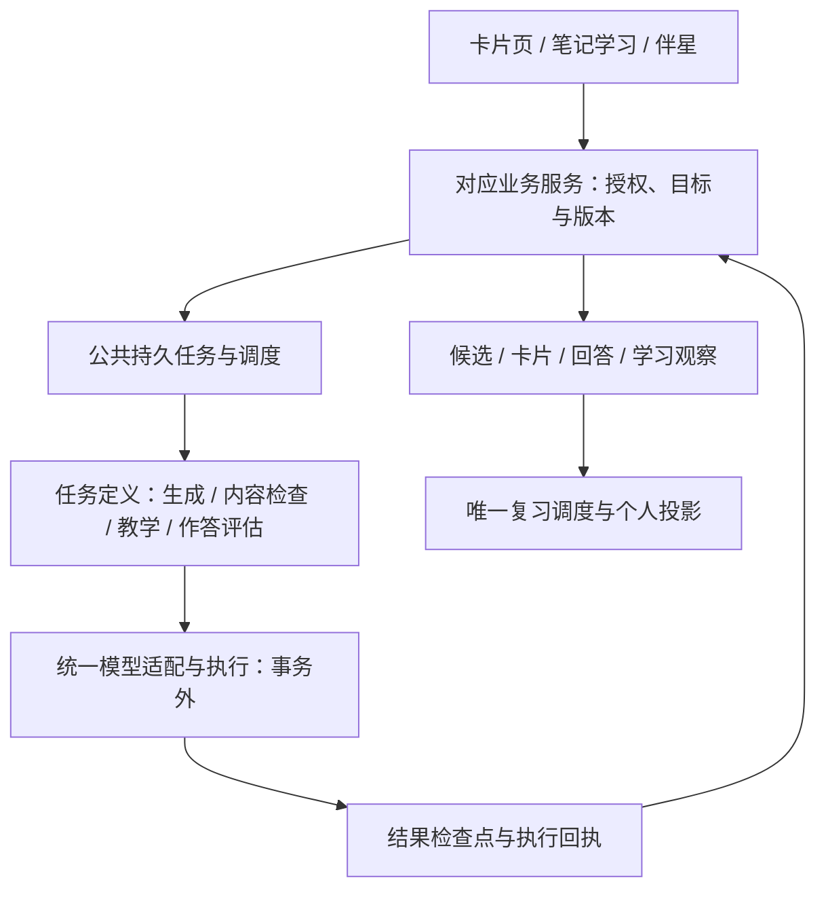

# 学习卡完整 AI 链路重做：从生成到作答与复习

> 日期：2026-09-24
>
> 状态：方案 39 的专项设计，尚未实施。范围包含生成、检查、改写、任务准备、提示、文本/语音作答、评估、反馈与调度交接；不是只拆制卡长事务。
>
> 主方案：[理解引擎](./39-adaptive-note-learning-system-prd-2026-09-24.md)。伴星协作：[39b](./39b-companion-capability-audit-and-integration-2026-09-24.md)。

## 1. 重做决定与边界

学习卡原有 AI 编排不再作为新架构的基座。重做整条执行链，使用与伴星、笔记学习相同的 Agent 运行基础、材料读取、任务身份、模型适配、预算、恢复和事件机制。学习卡保留自己的业务输入与结果类型，不保留一套独立执行引擎。

重做包含原先分散在制卡 worker 和 LearningRun/API 中的 AI 调用，不按目录划定范围。目标是让“做卡—学卡—作答—收到反馈—决定以后怎么练”形成一条清楚的产品路径。

保留有价值的业务语义与可复用实现：不可变材料和题目快照、候选审核、原始回答、权限、帮助记录、幂等回执、确定性题目校验与唯一调度服务。它们是否保留具体代码由调用和合同核对决定，不能为了“重做”删掉数据正确性的保障，也不能以“复用”为名继续包裹旧四阶段运行器。

## 2. 当前事实：为什么前几次拆分还不够

本节是静态代码核查，不引用旧注释中的历史耗时作为当前实测数据。

| 位置 | 当前代码事实 | 设计结论 |
| --- | --- | --- |
| 制卡 `runV2PlanPhase` | `withWorkerWorkspaceTransaction` 内加载并锁定 run，随后 `executePlanner` 使用模型 provider | 名为“短事务”的阶段仍可能等待外部模型；拆函数不等于拆事务 |
| 制卡 `runV2AuthoringPhase` | 短事务读输入，事务外逐候选生成并单独提交 | 这一段已有有效拆分，应承认；不能说今天整条仍是一个未提交大事务 |
| `reviewAndFinalizeV2Candidates` | 在事务内调用 `critiqueAndFinalizeCandidates`；未命中预计算复用时可调用 pedagogy，修复分支还会调用模型 | 主成功路径优化不能覆盖集合变化和修复等慢路径 |
| regenerate/replan/recheck | 各自有处理器和事务包裹，并复用作者/双检查/修复等流程 | 单张修改可能重新进入复杂门禁；必须核对所有可达调用，不能只改首次生成 |
| 进度与 outbox | 独立进度写入、租约、续租、回收、终态写入等机制并存；事务封装默认可加入外层事务 | 进度可见不代表业务检查点已提交；嵌套函数新调用事务封装也不保证脱离外层事务 |
| 作答评估 `processClaimedCommand` | 已采用事务内准备、事务外 Critic HTTP、事务内写回 | 这条边界应复用，不应把作答评估也笼统判成仍在长事务中 |
| 作答 `run-critic` | 独立 HTTP transport、配置、重试和解析；评估由 API 内独立处理循环驱动 | 与统一 Agent 的模型执行仍需收口，保留评分合同而替换专属调用编排 |
| 提示和结构题 | 已有确定性题目、提示模板和结构答案判定；正式结果核对帮助与能力上限 | 不应为“统一 Agent”把本来不需要模型的步骤改成模型调用 |

代码依据：[制卡处理器](../../../workers/ai-worker/src/handlers/card-generation-v2-handler.ts) 的上述函数、[worker 事务封装](../../../workers/ai-worker/src/db.ts)、[生成请求](../../../apps/api/src/modules/card-generation-v2/generation-run-service.ts)、[作答处理](../../../apps/api/src/modules/learning-runs/run-processing-tick.ts)、[评估 transport](../../../apps/api/src/modules/learning-runs/run-critic.ts)、[任务准备与提示](../../../apps/api/src/modules/learning-runs/run-planner.ts)。

根因是业务流程、数据库读写和模型执行互相穿插，同时重试边界仍以较大流程为单位。继续增加超时、进度旁路或局部并行，无法建立“每次模型调用都在事务外，每个有效结果都能恢复”的统一约束。

## 3. 完整用户路径与 AI 调用预算

以下次数指默认成功路径的语义模型调用，读取数据库与程序检查不计为模型调用；转写、图片解析、重试与额外批次须另计并公开进入运行记录。它是待验证的初始预算，不是已达到的性能数据。

| 用户任务 | 新默认路径 | 默认模型调用 |
| --- | --- | --- |
| 从选定材料做一小批卡 | 一次生成目标与候选 → 程序校验 → 独立批量内容检查 → 用户保留 | 2 次 |
| 修改一张候选 | 对指定版本改写 → 程序校验 → 检查该版本及必要的同组重复关系 | 2 次；不重做全组 |
| 手动改候选 | 保存新草稿版本 → 按变更范围检查 | 实质改题/答案/依据需 1 次检查；纯样式修改可 0 次 |
| 翻面自评 | 回忆 → 揭示 → 自评 → 个人观察及已授权安排 | 0 次 |
| 既有可可靠判定的结构题 | 冻结题目 → 作答 → 程序核对 → 反馈 | 0 次 |
| 针对现有卡提交开放短答 | 冻结题目与评估依据 → 作答 → 独立语义评估 | 1 次 |
| 请求新情境能力检查 | 生成有公开要求与可核对依据的新题 → 作答 → 独立评估 | 通常 2 次；不默认加 Planner/出题自评/仲裁 |
| 请求帮助 | 简单结构引导用既有内容；具体解释/换例子调用公共教学任务 | 可复用时 0 次；需生成时通常 1 次 |
| 语音作答 | 转写 → 用户确认文本 → 进入同一开放回答评估 | 转写单列；评估不重复 |
| 查分、解释判定、安排下次 | 读取已存报告与调度回执，默认程序组织反馈 | 0 次；用户追问新解释再按需调用 |

简单事实优先使用卡片本身作为提取题，不为每次复习强制生成新题。新情境用于确有价值的应用/迁移，先验证内容类型，再扩展题型。所有路径都允许用户说不会、跳过、结束或先保留回答，不强迫补答到通过。

## 4. 公共运行基础与领域服务

只保留一套任务领取、尝试、租约、预算、取消、恢复与模型调用机制。任务定义是有类型的代码函数，不建设工作流 DSL。单次结构化任务使用公共运行器的直接调用模式；伴星使用工具循环模式。不同负载可分队列与并发配额，作答反馈不能被批量制卡耗尽资源；迁移不得使“提交→首个有效反馈”变慢——以迁移前的现状分位数为下限，迁移后不得劣于该基线。

业务服务控制候选是否能保存、回答是否属于本题、学习观察如何生效；模型无权直接写卡片、判定掌握状态或设置下次日期。业务 outbox 是可靠投递边界，可以保留；不为每项功能再建带自己重试规则的 AI worker。公共任务完成和业务采纳结果分开记录，未采纳的过期输出不成为成功业务结果。

首批任务定义只需候选生成、内容检查、教学/题目准备、回答评估，按实际输入使用相同基础。改写是候选生成的明确输入模式；无需单独修复 Agent。转写/读图复用已有媒体能力，也遵守同一外部调用与恢复纪律。

## 5. 事务纪律：让长事务在结构上不能回来

### 5.1 每个需要外部调用的任务遵循同一边界

1. **短事务准备**：校验当前权限与业务版本，冻结必要输入的引用/哈希，领取尝试并写有效租约令牌；提交后释放连接与行锁。
2. **事务外执行**：解析受控模型配置，读取已授权快照所需内容，发出模型、转写、图片解析或对象存储请求；不持有数据库事务。期间续租使用独立短事务，不能继承任何外层业务事务。
3. **短事务保存**：核对任务状态、尝试令牌、租约有效性、取消/权限状态与输入版本，写不可变输出及其检查结果，原子记录下一任务投递或业务待处理回执；提交后才对用户宣告该步骤完成。

材料/对象存储读取发生在事务外时，不能改为读取实时笔记来替代已冻结材料；引用需指向不可变版本并校验哈希。权限在外发前重新核对，撤销发生后停止后续调用/提交；已发送出去的请求无法被宣称“撤回”。大文件不塞入队列载荷，内容以受权限控制的产物引用保存。

对于不调用外部服务的原子业务写入，直接短事务完成，无需人为拆成三步。例如保留一组有界候选、提交一次回答、自评及安排变更，都需要保留其业务原子性。

### 5.2 必须可验证的约束

- AI 执行接口不接收数据库事务对象；领域读写函数不能把 provider 闭包传入事务回调。
- 公共外部调用边界检测当前异步作用域是否有活动事务，有则拒绝执行并记录开发错误。API 与 worker 两侧都要覆盖，防止隐式加入外层事务。
- 数据库设置有限的语句、锁等待及事务空闲超时作为后备；不得为等待模型而给制卡单独放宽到分钟级。阈值根据有界数据库操作实测确定，不能拿超时替代正确拆分。
- 不在数据库锁内重试、等待退避、轮询任务完成或运行大规模 CPU 处理；材料大小与批量写入有上限，超限显式分批。
- 每个检查点、结果与下一步投递在同一事务形成，不允许“结果已提交、下一步永久丢失”。通知失败由持久队列补齐。

验收不是只检查函数名或新增 `isolated:true`，而是注入慢模型时真实观察数据库会话、锁、连接占用和其他请求是否受阻。

## 6. 生成、检查与保存怎样重做

### 6.1 批次、候选与目标分开

生成请求冻结笔记范围、来源、已有适用目标/卡片摘要和用户需求，不把整空间所有目标无界塞进提示词。快照封存只读取已有可用内容；若来源需解析，先形成可恢复的准备任务，不在请求事务里等外部解析。

候选目标尚未被保留前只是草稿，不凭生成成功写入正式能力或订阅。已有目标可以引用；新目标在业务保留动作中按主方案的目标规则建立，一张卡也可以对应既有无卡学习目标。

一次结构化生成返回有界小批候选及稳定的服务端候选身份映射。完整且可解析的结果先持久化，再独立检查；程序剔除无效项并保留可独立解析的完整候选。无法确定结构的流式碎片只作为生成进度，不能展示成可保存卡片。若整个输出无效，明确记录生成失败，不伪装有部分成果。

长材料按用户范围和上下文容量分批，记录已覆盖与未覆盖部分；各批次独立检查点，后续批失败不抹掉前批。需要跨批语义检查时只做必要增量比较，额外调用计入预算，不承诺任意长材料也只需两次。

### 6.2 检查是独立任务，不是整套固定门禁

程序负责引用存在、类型、必需字段、版本、权限、明确重复与回答格式。模型在独立上下文一次检查依据支持、答案可用性、题面是否清楚、条件遗漏和教学价值；报告逐候选绑定精确内容版本，不能接受生成器自称“已验证”。

内容结论分为可保留、需修改、依据不足/有实质疑点；执行失败另记“检查未完成”，不能把服务不可用当成卡片质量不合格。普通措辞偏好是建议，严重错误影响该候选；除非存在实际共同问题，不让一张错误卡阻塞其他已确认候选。

检查结果保存后即可给用户审核。检查服务失败从检查点继续，不重跑生成。报告只覆盖部分候选时，验证通过的独立条目可保存报告，其余仍待检查；不能把缺失条目默认判通过。新的实质内容版本不会继承旧版报告；仅展示样式变化且程序确认题面、答案、条件与依据的语义输入哈希完全相同时，可显式关联原检查结果，不冒充重新检查。

### 6.3 修改和保存

用户只改一张，创建该卡新候选版本，旧稿保留到新稿可用；生成失败不先把旧候选废掉。重新规划整批仅由用户明确改变范围触发，不是每次单卡修复的隐含动作。默认取消自动修复/再评估循环，用户可按问题选择改写、手改或舍弃。

保存动作按用户选定且检查有效的候选版本，在一个有界短事务中完成权限/版本/重复核对、卡片与必要目标写入、候选状态和回执、投影事件。原子集合内有冲突则返回可解释冲突，用户可改选；不会擅自少保存几张并宣称全部成功。不同批次已明确相同目标时提示复用，语义不确定时展示差异，不盲目合并。

保存不自动订阅复习，不因新批次产生而停用已有正式卡；对已保存卡的修改走正式修订与变更影响规则。后续投影失败不能回滚或重复创建已经成功保存的卡片。

用户选择“保存并开启复习”时，按主文档 §8.3 在同一有界短事务中调用卡片保存与唯一调度服务，建立/关联明确授权并返回组合回执；任何所选项冲突均不部分提交。已有同目标安排复用原需求及实际日期，目标排除仍有效时须明确选择恢复，不能借组合按钮绕过。保存后的通知与投影异步执行，失败不重做组合命令。

## 7. 作答整条链：不把旧评估器简单换个入口

### 7.1 先确定本次任务，再收回答

每次任务冻结目标/维度、材料与卡片修订、公开题面、实际变体、隐藏答案/判定依据、可用帮助规则和返回位置。公开要求与评分标准必须对应，不能考未问过的条件。卡片入口和笔记入口使用同一任务定义和目标身份，不另建“卡片掌握记录”。

已有题面与可靠答案可直接用；新情境按需生成。新生成题的来源与要求无法核实时降为普通教学练习，允许替换题目，不能只因题目 JSON 合法就签发正式能力证据。首期只支持经人工样本验证的出题类型，不默认叠加一个通用出题 Critic；发现具体质量问题再决定是否增加检查。

用户作答前可明确知道这是轻量自评、普通练习还是适用范围有限的能力检查，不需要理解内部信任等级。

### 7.2 提示、揭示与输入

用户请求提示或换例子时，复用教学能力，使用当前任务的目标和已提供帮助。提示内容与呈现记录关联到对应版本；伴星、卡背、原题回放和图示/语音帮助按主文档 §14.1.1 处理。不存在“制卡检查通过就永远独立作答”的资格。

帮助影响以每份回答锁定前的呈现事实为界：锁定后正常揭示不能因评分尚未返回而追溯降级原答；锁定前发出且可能呈现的帮助在回执未知时保守待核对。前一道题反馈可能提示下一题，跨目标同样核对，不能只按 taskId 或 objectiveId 是否相同判断。一直无法确认时记“帮助条件未知”，不签发独立证据，也不把用户留在永久处理中。

文本与结构输入在提交前校验类型和长度，不静默截短再评分。语音先由事务外转写生成可确认文本；用户确认后锁定回答版本，转写低质量可改成文本，不把麦克风/转写失败算答错。仅练口语表达等未来能力需要音频评价时另立任务合同，首期不据音色、口音或流利程度推断知识掌握。

提交回答用短事务写原始回答、题目/变体引用、提交时点与帮助关联、评估任务投递和提交回执。重复发送同一提交返回同一回执；同幂等键但不同答案报冲突，不能覆盖原回答。网络超时先查询回执，不能要求用户重新答题来恢复。

### 7.3 三种判断路径

- **自评或明确不会**：记录其真实来源，按已授权策略处理；不调用模型，也不包装为 AI 判错或独立成功。
- **可靠的确定性答案**：只判断题目实际覆盖内容。关系图/排序等只有在预定规则足以表达正确性时使用程序判断，不能仅比较一个序列就误判所有等价答案。
- **开放式回答**：公共运行器执行一次独立评估，输入原回答、冻结题目/目标、必要依据与评估规则，不注入伴星人格、鼓励或生成器的自评。以意思、推理和条件判断，不默认要求逐字背标准答案。

评估报告包含逐目标/维度判断、回答中的具体依据或缺口、适用范围与无法判断原因。拒绝缺失/越界 rubric 项和格式错误报告；模型自报高置信度不自动成为资格。课程材料存在争议时保留“相对笔记”的边界，不能用同一模型赞同笔记来证明事实正确。

### 7.4 评估、反馈和结算分开

模型报告先成为不可变评估产物，再由领域服务核对回答身份、任务版本、内容适用性、帮助事实和当前内容访问权限，形成学习观察。复习授权仅在调度交接时决定能否改安排，不作为保存学习观察的必要条件。程序根据报告组织默认反馈；不为把分数改写成友好口吻常态再加一次模型调用。

“活动结束”“本次表现”“日程是否改变”分别呈现。评估失败时回答仍已保存，用户可结束或重试本次评估；不能降格记成答错，也不能清空回答。部分正确提供具体缺口，不自动生成一串补考直到通过。

用户争议、补答或重新评估按主文档 §14.2 保留原回答和原报告，形成有关联的新版本；补答若发生在解释/揭示之后带相应帮助条件，不覆盖成第一次独立回答。更正对调度的影响由唯一业务策略解释，不以新报告到达再次消费同一日程。

正常结束学习不取消已受理评估，晚到结果按权限作为历史补充，不重开活动；用户明确取消该评估任务后，旧尝试返回的内容不再成为有效判定或调度依据。取消与成功提交竞态按真实先后回执处理，不抹掉已经成功的结果。手动改期、停订、内容实质变更后不能应用旧授权。生成额外解释、记忆提取、鼓励和星图投影失败都不阻塞已经正确完成的回答保存或业务结算。

## 8. 最小状态与恢复原则

不强制所有业务共享一张状态表。公共 AI 任务只表达排队、执行中、成功、失败、取消/失效等运行事实；短重试的次数、预算与下一尝试时间放在尝试记录中。候选另有待检查/可保留/需修改/已保留等业务状态，回答另有已提交/待判定/已判定/无法判定。

不把“用户还没保存卡片”计为 AI 任务一直运行；不让后台 AI 成功直接触发整个学习轮次完成。用户看到的状态由这些事实投影，不再复制一套与真实业务提交脱节的进度真值。

持久任务至少关联所属用户/空间、业务对象与版本、输入快照哈希、任务定义/提示/输出合同版本、实际模型、尝试身份、产物引用、预算与结果采纳状态。复用检查点必须匹配这些必要输入，不按相似提示词跨用户复用私有结果。原始回答与材料存在有权限的业务存储，队列、进度和普通日志只带必要引用，不能为可观测性再复制一份敏感正文。对象存储产物先完成写入和哈希校验再登记成功；未被事务引用的孤立文件按明确保留期清理，不影响有效检查点。

恢复使用原任务固定的合同与输入，不因部署了新提示词就默默重跑已完成步骤。旧合同已不支持执行时明确迁移或终止未完成任务，保留已完成的有效业务记录；需要新语义的重做形成关联的新任务。检查点复用、结果只读回放与新模型重新评估是不同动作。

| 中断点 | 恢复行为 |
| --- | --- |
| 请求已提交但响应丢失 | 按请求身份找回同一任务/提交，不开第二次 |
| 生成已保存、检查未开始 | 从检查继续；不能重付生成成本 |
| 部分批次或候选已完成 | 保留有效结果，只恢复未完成的有界任务 |
| 模型完成但持久化前进程崩溃 | 若 provider 支持可靠请求查询则恢复，否则可能需要再次调用；不能承诺外部调用恰好一次 |
| 结果已提交，worker 未确认消息 | 重投读取既有检查点/回执，不重复采纳和业务写入 |
| worker 租约过期，旧结果晚到 | 以尝试令牌、有效期和输入版本拒绝旧提交，不能覆盖新 worker 的结果 |
| 用户改候选、换题或取消 | 新版本/取消与结果提交在短事务串行核对；过期报告不用于新内容 |
| 保存卡片成功但投影失败 | 回执说明已保存，投影异步重试；不重跑生成/保存 |
| 回答保存成功、评分服务失败 | 自动重试预算内显示重试中；预算耗尽则明确无法判定，可按原答案手动重试或结束，不永久显示待判定 |
| 评分成功、调度提交失败 | 恢复领域提交，不重跑评分；当前授权失效则只保存允许的观察 |

同一任务可能因租约接管有重叠的外部请求，因此“只产生一次业务效果”必须靠结果提交和领域写入的唯一约束/CAS，而非期待模型只被调用一次。预算预留和实际用量都按尝试记录；未知成本如实标记。模型网络重试与结构修复共用模型调用总预算，禁止各层独立重试相乘。只保存已获得报告的业务提交有独立、有界且可恢复的执行重试，不再花模型预算，也不能因模型预算耗尽而丢弃已取得的有效结果。

首期建议每个模型步骤最多一次自动重试，且受单步/整任务时间与成本上限限制；权限、内容版本、无效输入和实质质量问题不自动重试。模型输出结构修复也占这次机会，不另开修复循环。用户显式再试形成关联尝试，已完成前置检查点不重做。

## 9. 旧链路处置与实施顺序

| 现有部分 | 目标处理 |
| --- | --- |
| Planner → 逐目标 Author → Grounding → Pedagogy 固定编排 | 被小批生成 + 独立综合检查替换；必要规则和题目知识经核对迁入任务定义 |
| 自动 bounded repair、recheck、replan 与投机 pedagogy | 删除失去调用方的专属链路；用户改写走统一候选生成模式和增量检查 |
| 制卡专属 AI 租约/重试/进度运行器 | 调用方切换到公共执行机制；保留必要业务投递与持久化语义，不长期维护两个循环 |
| API 内专属 Critic transport 与 AI 重试 | 迁入公共模型任务；独立评估上下文、输出解析和有用规则保留 |
| LearningRun 的原始回答、变体约束、暴露、提交与调度 | 保留并适配新观察语义；AI 执行退出领域事务，不能顺手放宽学习证据条件 |
| 结构题判定、确定性提示、快照与激活回执 | 核对新合同后复用；不为统一而改成模型步骤 |
| 旧 UI 阶段、固定比例进度、专属失败文案和测试 | 随新状态语义一起替换；原有有效业务约束迁成新合同测试 |

**第一步：先贯通一条竖向样例。** 在开发验证中用同一公共运行基础完成“小笔记生成与检查 → 保存一张卡 → 开放回答 → 评估与观察”，并让伴星或笔记任务也作为真实调用方。单卡重生成、慢检查和评分失败必须纳入，避免只证明最顺的一条生成路径。此时锁定 §5 的事务硬约束和最小身份合同，不先搭大平台。

**第二步：迁移作答 AI 执行与教学能力。** 沿用已正确的事务外评估边界，替换专属 transport/执行循环中的 AI 部分；保留非 AI 业务消费与结算。覆盖自评、确定性判断、开放回答、语音转写、提示和争议，证明从卡片/笔记/伴星进入使用相同任务与事实。

**第三步：切换完整制卡链与候选界面。** 接入请求、生成、综合检查、改写、保存、恢复；用相同材料比较质量与成本。所有入口切到新链后清理旧四阶段、修复/投机链、专属配置及无调用方测试，不在产品中留下“新旧生成器”开关。

**第四步：完成调度与投影闭环。** 对照主文档阶段二的新自评/借助/独立观察语义，核对一次回答、一次需求消费和手动安排优先级；删去旧事实映射和重复推荐。步骤二保留现行安全结算不意味着可以永久保留两套证据合同。

第四步是阶段二切换交付的共同门槛，不是第三步上线后再补。新的“保存并开启复习”以及会按新观察改变安排的卡片路径，须与对应授权/调度语义一并交付；否则只能用于开发验证，不向试用用户开放半条链。阶段一可只提供明确的单次提醒，不将新自评/借助事件套入旧独立成功事件来临时推进间隔。

以上是依赖顺序，主方案阶段一交付公共基础和开放回答评估接入，阶段二完成学习卡整链切换。当前项目未上线，无需保留无用兼容代码；历史 schema 删除/合并前仍需验证开发库可重建。切换期间对尚未完成的旧在途任务明确结束或迁移身份，不能让它们继续写新状态；已经保存且仍有效的卡片不因切换自动作废。

## 10. 必须通过的验收，而非再次“拆完函数就算完成”

| 场景 | 必须证明 |
| --- | --- |
| 分别让生成、检查、改写、评估、转写慢 30 秒 | 外部等待期间没有持有对应业务事务/行锁；并发读写不被这些等待钉住 |
| 在已有事务作用域中误调模型 | 执行边界立即拒绝；测试覆盖 API/worker 的隐式嵌套，不只检查文本中是否出现 transaction |
| 在每个检查点前后杀 worker | 有效输入/输出能恢复，只重试未完成步骤；不出现永久排队或丢失下一步 |
| 两 worker 接管同一任务，旧调用晚到 | 旧令牌不能提交；只有一个有效产物被采纳，无重复卡/观察/日程消费 |
| 改写或综合检查失败 | 不抹掉原草稿，不重生成其他有效卡；服务失败与质量失败分别显示 |
| 同一答案重复提交，随后补答/争议 | 首次提交幂等，后续版本可追溯；解释后补答不冒充初次独立答案 |
| 模型超时/非法结果/依据矛盾 | 回答保留，不当答错，不扩大能力结论；有明确结束和重试路径 |
| 提示在另一入口呈现、语音部分失败 | 帮助按目标与版本关联；呈现未知不签发独立证据 |
| 用户结束、改期或停订后评估到达 | 不重开活动，不覆盖手动安排，不消费已经失效的授权 |
| 卡片已保存或观察已提交但投影失败 | 正确业务事实不回滚；重放恢复投影，不重调模型 |
| 保存并开启复习时出现版本/排除项冲突 | 不出现“卡已保存但授权未建”却报全部成功；组合命令幂等，通知失败不回滚业务 |
| 原回答锁定后立即看卡背，评分随后返回 | 不降级锁定前独立的原答；后续相关题按近期帮助单独判断 |
| 模型预算耗尽时，结果已经保存但业务提交待重试 | 继续恢复业务提交，不额外调用模型，不丢弃已取得的有效结果 |

质量样本同时覆盖候选和作答：短长材料、无来源/矛盾材料、条件遗漏、重复目标；等价正确答案、部分正确、似是而非推理、答非所问、不知道、转写错误与疑似坏题。用人工标注检查严重内容错误、错误放行/拦截、有效答案误判和反馈可操作性，不只比 JSON 合法率。

性能记录请求到首个可用候选、到可审核结果、提交到有效反馈的分位数，模型调用/重试与 token，事务持续时间、连接等待、重复外部调用和业务重复写入。新旧方案使用同批材料和可比模型设置，测试集固定并保留失败样本；不拿降低质量标准换取更短耗时。

## 11. 本轮验证范围

编写本附件时只更新方案并核对代码，不实施迁移、不修改数据库或现有运行逻辑。当时执行的现有 API 测试包括 `run-critic`、`run-planner`、`run-structured`、`run-result-facets` 和 `card-generation-v2-retry-contract`，**52 项通过，0 失败**。它们用于了解当前可复用规则，不证明新方案已经实现；后续文档复审不把这份结果重复算作新功能验收。

§10 的慢调用事务观测、崩溃注入、真实 provider 质量比较与桌面完整交互均为实施验收，尚未运行。当前没有依据宣称重做后固定快多少或成本降低多少。
